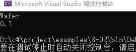
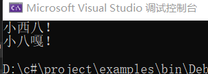
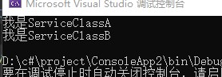
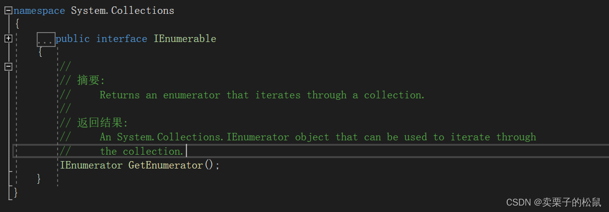
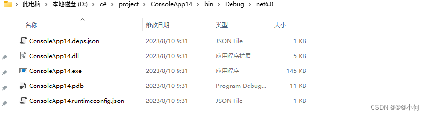

@[TOC](目录)

```bash 	
  	2022.06，我正式走上了所追求、热爱的编程道路，用此文记录"C#"学习过程中的问题点。
  	“书山有路勤为径，学海无涯苦作舟！”
    日后我也可以成为很厉害的技术大佬！
    
```


### 1.语句块


### 2.Write和WriteLine的区别：

1. Write没有在字符串后面添加换行符，而WriteLine则在每个字符串后面添加了换行符。如图：
   


2. 从命令行读取和输入的例子：

```csharp
using System;
using System.Text;
namespace APP
{
    class Program
    {
        static void Main()
        {
            Console.WriteLine("请输入您的姓名：");
            string name = Console.ReadLine();
            Console.WriteLine("请输入您的年龄：");
            int age =int.Parse(Console.ReadLine());//通过int.parse方法可以将字符串类型转化为int类型
            Console.WriteLine("您好，{0}岁的{1}", age, name);
        }
    }
}
```


### 3.params

params是一个计算机函数，表示函数的参数是可变个数的，即可变的方法参数，用于表示类型相同，但参数数量不确定。
C#开发语言中 params 是关键字，**params主要的用处是在给函数传参数的时候用，就是当函数的参数不固定的时候。 在函数的参数数目可变而执行的代码差异很小的时候很有用！C#语法规定，params后边必定跟数组。作用是把不定数量的、同类型的参数装入这个数组中.**

### 4.托管代码和非托管代码

（1）托管代码：
运行在CLR(CLR是一个通用语言架构，它定义了一个代码运行的环境）下的代码就是托管代码，诸如C#、VB.NET 写的代码都会先编译成MSIL（MS中间代码），并运行在CLR的子集CLI(Common Language Infrastructure）中，最终根据不同的平台使用JIT（just in Time）编译成机器代码。
与Java机制不同在于Java是经过一次编译和一次解释运行，C#是经过两次编译运行,这两个阶段分别为：源代码编译为托管代码，托管代码编译为微软平台的专用语言，又称机器语言。
（2）非托管代码：
非托管的代码也叫本地代码（native），是由操作系统管理的。
高级语言编写的程序必须经过一定的步骤编译为机器语言才能被机器理解和运行。
这一系列步骤为：预处理、编译、汇编、链接。
（3）托管代码和非托管代码的区别：
1、托管代码是一种中间语言，运行在CLR上；非托管代码被编译为机器码，运行在机器上。
2、托管代码独立于平台和语言，能更好的实现不同语言平台之间的兼容；非托管代码依赖于平台和语言。
3、托管代码可享受CLR提供的服务（如安全检测、垃圾回收等），不需要自己完成这些操作；非托管代码需要自己提供安全检测、垃圾回收等操作。

### 5.DllImport的使用：

托管代码生成的DLL文件，可以在VS中直接通过添加引用的方式使用。
非托管代码生成的DLL文件，比如使用C++编写的代码编译生成的DLL，不能在VS中直接引用，可以通过DllImport方法来使用。

### 6.WriteLine、ReadLine和ReadKey：

console.ReadLine()是等待输入，并按回车继续。
console.WriteLine()是向控制台窗口产生输出。
Console.ReadKey()是等待键盘输入，退出程序。使调试时能看到输出结果。如果没有此句，命令窗口会一闪而过。

### 7.C#中访问修饰符

在C#语言中，共有五种访问修饰符：public、private、protected、internal、protected internal。
（1）作用范围：

（2）在c#中，

1. 类、结构的默认修饰符是internal。
2. 类中所有的成员默认修饰符是private。
3. 接口默认修饰符是internal。
4. 接口的成员默认修饰符是public。
5. 命名空间、枚举类型成员默认修饰符是public。
6. 委托的默认修饰符是internal。

### 8.类型的实例化

从某一个类型模板创建实际的对象，就称为实例化该类型。

### 9.成员可以分为两种：数据成员和函数成员

数据成员：保存了这个类的对象或作为一个整体的类相关的数据；
函数成员：执行代码，函数成员定义类型的行为。

### 10.枚举enum和结构struct的区别：

enum与struct的区别是：枚举里的变量都是整型的同类型，而struct是由不同类型
的变量所组成的，默认情况下，枚举的第一个值为0，后面每个连续的元素值递增1。

### 11.运行中的程序使用栈和堆来存储数据

### 12.栈存储几种类型的数据：

某些类型变量的值；
程序当前的执行环境；
传递给方法的参数。

### 13.与栈不同，堆里的内存能够以任意顺序存入和移除.

### 14.堆和栈：

栈是一个内存数组，是一个LIFO（Last-In First-Out，后进先出）的数据结构。
堆和栈的区别主要有五大点，分别是：
（1）申请方式的不同。栈由系统自动分配，而堆是人为申请开辟;
（2）申请大小的不同。栈获得的空间较小，而堆获得的空间较大;
（3）申请效率的不同。栈由系统自动分配，速度较快，而堆一般速度比较慢;
（4）存储内容的不同。栈在函数调用时，函数调用语句的下一条可执行语句的地址第一个进栈，然后函数的各个参数进栈，其中静态变量是不入栈的。而堆一般是在头部用一个字节存放堆的大小，堆中的具体内容是人为安排;
（5）底层不同。栈是连续的空间，而堆是不连续的空间。

### 15.在声明一个类时使用static关键字，具有两个方面的意义：

防止程序员写代码来实例化该静态类；
防止在类的内部声明任何实例字段或方法。

### 16.static在内存中的地址为：程序的全局数据区。

### 17.值类型和引用类型

数据项的类型定义了存储数据需要的内存大小及组成该类型的数据成员。类型还决定了对象在内存中的存储位置——栈或堆。
类型被分为两种：值类型和引用类型，这两种类型的对象在内存中的存储方式不同。
值类型只需要一段单独的内存，用于存储实际的数据。
引用类型需要两段内存，第一段存储实际的数据，它总是位于堆中；第二段是一个引用，指向数据在堆中的存放位置。
对于值类型，数据存放在栈里；对于引用类型，实际数据存放在堆里而引用存放在栈里。


### 18.C#的4种变量

分别是本地变量、字段、参数、数组元素。
本地变量：在方法的作用域保存临时数据，不是类型的成员。
字段：保存和类型或类型实例相关的数据，是类型的成员。
参数：用于从一个方法到另一个方法传递数据的临时变量，不是类型的成员。
数组元素：（通常是）同类数据项构成的有序集合的一个成员，可以为本地变量，也可以为类型的成员。
###简单的变量声明
一个简单的变量声明至少需要一个类型和一个名称，如int a,其中int为类型，a为名称。

### 19.变量 、字段、属性的区别：

一句话：字段、属性都是变量，只是为了区分和数据安全设置的。
字段的使用场景：与类或者对象关系密切，建议使用private修饰。
属性的使用场景：对字段进行封装，提供get/set关键字，进行访问。
变量的使用场景：与类或者对象关系不密切，常常在方法或者语句块中使用。
字段和属性是相对于类而言的，而变量相对于方法或者语句块而言，可以在任何地方使用。

### 20.常量字段const表现得像静态字段，但在内存中没有存储位置。


虽然常量成员表现得像一个静态量，但**不能将常量声明为静态static**，如：static const int a=3.14这句语法是错误的。

### 21.析构函数执行在类的实例被销毁之前需要的清理或释放非托管资源的行为。

### 22.非托管资源是指通过Win32 Api获得的文件句柄，或非托管内存块。

### 23.const和readonly：

const是静态常量，readonly是动态常量。
静态常量是指编译器在编译时候会对常量进行解析，并将常量的值替换成初始化的那个值；而动态常量的值则是在运行的那一刻才获得的，编译器编译期间将其标示为只读常量，而不用常量的值代替，这样动态常量不必在声明的时候就初始化，而可以延迟到构造函数中初始化。
区别：可以通过静态常量与动态常量的特性来说明：
      1）const修饰的常量在声明的时候必须初始化;readonly修饰的常量则可以延迟到构造函数初始化 。
      2）const修饰的常量在编译期间就被解析，即常量值被替换成初始化的值;readonly修饰的常量则延迟到运行的时候。
      此外const常量既可以声明在类中也可以在函数体内，但是static readonly常量只能声明在类中。

###  24.this用法(指代当前实例、扩展方法、索引器)

#### 1. this指代当前实例

 this关键字在类中使用，是对当前实例的引用，它只能被用在下列类成员的代码块中：
 （1）实例构造函数；
 （2）实例方法；
 （3）属性和索引器的实例访问器。
 值得注意的是，静态成员并不是实例的一部分，所以不能在任何静态函数成员的代码中使用this关键字，确切来说，this用于下列目的：
 用于区分类的成员和本地变量或参数；
 作为调用方法的实参。

#### 2. this用作扩展方法

 扩展方法能够向现有类型“添加”方法，而无需创建新的派生类型、重新编译或以其他方式修改原始类型。扩展方法是一种特殊的静态方法，但可以像扩展类型上的实例方法一样进行调用。C#扩展方法第一个参数指定该方法作用于哪个类型，并且该参数以 this 修饰符为前缀。
    需要注意的几点：
   （1）**扩展方法（this 需要扩展的类 命名），如：public static void ExtensionEat(this Person person)；**
（2）**扩展方法必须是静态类的一个静态方法。**
（3）**调用扩展方法,必须用对象来调用 。**
如图看一段代码：

```csharp
using System;
namespace ConsoleApp10
{
    class Program
    {
        static void Main(string[] args)
        {
            Music p = new Music();
            p.ExtensionEat();
            p.ExtensionHello();
            p.ExtensionHaHa();
            ExtensionMusic.ExtensionHaHa(p);
            Console.ReadLine();
        }
    }
    public class Music
    {
        public void Eat()
        {
            Console.WriteLine("听歌曲");
        }
        public void Hello(string name)
        {
            Console.WriteLine("歌曲名：" + name);
        }
    }
    public static class ExtensionMusic //静态的扩展类，用于扩展Music类
    {
        public static void ExtensionEat(this Music  mu)//扩展方法必须是静态类的一个静态方法,this Music  mu这一句表示该ExtensionEat要扩展的类名是Music,然后在Music的实例中就可以调用该方法
        {
            mu.Eat();
            Console.WriteLine("打开播放器");
        }
        public static void ExtensionHello(this Music mu)
        {
            mu.Hello("起风了");
            Console.WriteLine("真好听");
        }
        public static void ExtensionHaHa(this Music mu)
        {
            Console.WriteLine("多听几遍");
        }
    }
}
```

运行结果：


#### 3. this用作索引器：

索引器（Indexer） 允许一个对象可以像数组一样使用下标的方式来访问。
先看一段代码：

```csharp
/// <summary>
/// 最简单的索引器
/// </summary>
public class IDXer
{
    private string[] name = new string[10];

    //索引器必须以this关键字定义，其实这个this就是类实例化之后的对象
    public string this[int index]
    {
        get
        {
            return name[index];
        }
        set
        {
            name[index] = value;
        }
    }
}

public class Program
{
    static void Main(string[] args)
    {
        //最简单索引器的使用           
        IDXer indexer = new IDXer();
        //“=”号右边对索引器赋值，其实就是调用其set方法
        indexer[0] = "张三";
        indexer[1] = "李四";
        //输出索引器的值，其实就是调用其get方法
        Console.WriteLine(indexer[0]);
        Console.WriteLine(indexer[1]);
        Console.ReadKey();
    }
}
```

```csharp
 //以字符串为下标的索引器
    public class IDXer2
    {
        private Hashtable name = new Hashtable();

        //以字符串为下标的索引器
        public string this[string index]
        {
            get
            {
                return name[index].ToString();
            }
            set
            {
                name.Add(index, value);
            }
        } 
    }

    public class Program
    {
        static void Main(string[] args)
        {
            //以字符串为下标的索引器
            IDXer2 indexer2 = new IDXer2();
            indexer2["A01"] = "张三";
            indexer2["A02"] = "李四";
            Console.WriteLine(indexer2["A01"]);
            Console.WriteLine(indexer2["A02"]);
            Console.ReadKey();
        }
  }
```

索引器的索引值（Index）类型不限定为整数，如上两个图代码中的整形和字符串型索引。
索引器与属性的区别：
（1）索引器的命名只能为this，而属性可以任意命名（开头字母大写）；
（2）索引器可以重载，属性不可以；
（3）索引器不可用static进行声明，属性可以。

### 25.派生类屏蔽基类的成员：

虽然派生类不能删除它继承的任何成员，但可以用与基类成员名称相同的成员来屏蔽基类成员，这也是继承的主要功能之一，很实用。**派生类屏蔽基类成员的关键字是new**，在派生类中屏蔽一些基类成员的一些要点如下：
（1）要屏蔽一个继承的数据成员，需要声明一个新的相同类型的成员，并使用相同的名称。
（2）通过在派生类中声明新的带有相同签名的函数成员，可以隐藏或屏蔽继承的基类的函数成员。注意：签名由名称和参数列表组成，不包括返回类型。
（3）**要让编译器知道你在故意屏蔽继承的成员，实用new修饰符**。否则，程序会成功编译，但会警告你隐藏了一个继承的成员。
（4）也可以屏蔽静态成员。

### 26.virtual的使用

**当使用基类引用访问派生类对象时，得到的是基类的成员**。**虚方法可以使基类的引用访问“升至”派生类级别**。可以使用基类引用调用派生类的方法，只需要满足以下条件：
（1）派生类的方法和基类的方法拥有相同的签名和返回类型；
（2）基类的方法使用virtual标注；
（3）派生类的方法使用override标注。
可对比以下两图：


### 27. 构造函数初始化语句：


如，一个简单的继承类程序：

```csharp
using System;
namespace Application
{
    public class ShangPin
    {
        private double _price;
        private double _count;
        private string _name;
        private int _id;
        public double Price
        {
            get { return _price; }
            set { _price = value; }
        }
        public double Count
        {
            get { return _count; }
            set { _count = value; }
        }
        public string Name
        {
            get { return _name; }
            set { _name = value; }
        }
        public int ID
        {
            get { return _id; }
            set { _id = value; }
        }
        public ShangPin(string name, double price, int id, double count)
        {
            this.Name = name;
            this.Price = price;
            this.ID = id;
            this.Count = count;
            Console.WriteLine("名称：{0},价格：{1},编号：{2},数量：{3}", this.Name, this.Price, this.ID, this.Count);
        }
    }

    public class Banana : ShangPin
    {
        private double _keepDays;
        public double KeepDays
        {
            set { _keepDays = value; }
            get { return _keepDays; }
        }

        public Banana(string name, double price, int id, double count, double keepDays) : base(name, price, id, count)
        {
            this.KeepDays = keepDays;
        }
    }
    class app
    {
        static void Main()
        {
            // ShangPin shangPin = new ShangPin("可乐",2.5,1,100);
            // Console.WriteLine("名称：{0},价格：{1},编号：{2},数量：{3}",shangPin.Name,shangPin.Price,shangPin.ID,shangPin.Count );
            Banana banana = new Banana("香蕉", 2.3, 2, 50.0, 7);
            Console.WriteLine("名称：{0},价格：{1},编号：{2},数量：{3},保存天数：{4}", banana.Name, banana.Price, banana.ID, banana.Count, banana.KeepDays);//会先调用基类的构造函数，然后再调用子类的构造函数
        }
    }

}
```

运行结果：


而另外一种形式的构造函数初始化语句（通过this）可以让编译器使用该类中的其他构造函数。

### 28.readonly字段

**readonly字段只可以在构造函数中初始化**，如果在其他方法中初始化一个readonly字段（即使这个方法只被构造函数调用），会得到一个编译错误。

### 29.本地变量与字段的区别：


### 30.关键字var

编译器可以通过初始化语句提供的信息推断出数据类型。
（1）传统定义变量是已经知道变量的类型，如： int a = 1； string b = “hello”；char c='x';
而var关键字不用预先知道变量的类型，是根据给变量赋值来判定变量属于什么类型；如var a =1， 则a是整型；var b = “hello”,则b是字符型;var c='x',则c也是字符型。
（2）简言之，var可以代替任何类型，编辑器会根据上下文来判断使用者具体想用什么类型，当无法确定自己将使用什么类型时，就可以使用var。
（3）使用var关键字有一些重要的条件：

1. 必须在定义时初始化。必须是var a=“abc”的形式，不能是var a； a=“abc”的形式；
2. 只能用于本地变量，不能用于字段；
3. 只能在变量声明中包含初始化时使用；
4. 一旦编译器推断除变量的类型，它就是固定且不能更改的。

### 31.C#中方法的参数有四种类型

      （1） 值参数  (不加任何修饰符,是默认的类型)
      （2）引用型参数  (以ref 修饰符声明)
      （3）输出参数  (以out 修饰符声明)
      （4）数组型参数  (以params 修饰符声明)

### 32.值参数和引用参数：

当值参数为值类型时，值被复制，产生一个独立的数据项，当值参数为引用类型时，引用被复制，实参和形参都引用堆中的同一个对象。
使用引用参数时，必须在方法的声明和调用中都使用ref修饰符。
引用类型作为值参数和引用参数：
（1）将引用类型对象作为值参数传递 ：如果在方法内创建一个新对象并赋值给形参，将切断形参与实参之间的关联，并且在方法调用结束之后，新对象也将不复存在。
（2）将引用类型作为引用参数传递 ：如果在方法内创建一个新对象并赋值给形参，在方法结束后该对象依然存在，并且是实参所引用的值。

### 33.输出参数out

引用参数ref修饰的参数必须对其赋初值，但是初值不能是常量（即不能用const修饰），因为按引用传递可能会改变参数的值。在函数使用out参数时，必须看做是尚未赋值（不晓得为什么），实参传递给形参的值在函数执行时会丢失，参考以下代码段：


### 34.成员访问修饰符：


### 35.抽象类

抽象类是指设计为被继承的类，抽象类只能被用作其他类的基类。
（1）不能创建抽象类的实例；
（2）抽象类必须使用abstract修饰符来声明，如下图：

（3）抽象类可以包含抽象成员和普通的非抽象成员，即抽象类的成员可以是抽象成员和普通成员的任意组合。
（4）抽象类自己可以派生另外一个抽象类，如下图：

（5）**任何派生自抽象类的类必须使用override关键字实现该类的所有抽象成员，除非派生类自己也是抽象类**。
看一段代码:


### 36.静态类

**静态类中所有的成员都是静态的**，静态类用于存放不受实例数据影响的函数或数据。**静态类的一个常见用途就是创建一个包含一组数学方法和值的数学库**。
关于静态类需要注意的几个地方：
（1）类本身必须被标记为static;
（2）**类的所有成员必须是静态的**；
（3）类可以有一个静态构造函数，但不能有实例构造函数，不能创建该类的实例；
（4）静态类是隐式封装的，也就是说，不能继承静态类。

### 37.C#提供隐式转换与显式转换

对于隐式转换，当决定在特定上下文中使用特定类型时，如有必要，编译器会自动执行转换；
对于显式转换，编译器只在使用显示转换运算符时才执行转换。

### 38.运算符重载

运算符重载：通过特定的语法，使某些运算符可以具备特殊的功能。关键字operator，修饰符必须为public static。
运算符重载的例子：

```csharp
using System;

public struct Point
{
    public double x;
    public double y;
    public Point(double x,double y)
    {
        this.x = x;
        this.y = y;
    }
//运算符重载，使加号具有新的功能
//可以实现两个Point对象直接相加，得到一个新的点
    public static Point operator +(Point p1,Point p2)
    {
        return new Point(p1.x + p2.x, p1.y + p2.y);
    }
    //参数类型可以不相同
    public static Point operator + (Point p1,int a)
    {
        return new Point(p1.x + a, p1.y + a);
    }
//*号是二元运算符，因此必须有两个参数
    public static Point operator *(Point p1,Point p2)
    {
        return new Point(1, 1);
    }
//-号的身份有两种：1是加减乘除的减号，2是负号。为前者时是二元运算符，为后者是一元运算符。
    public static Point operator - (Point p1)
    {
        return new Point(1, 1);
    }
    //【重载--运算符】练习
    public static Point operator --(Point p1)
    {
        return new Point(p1.x-1,p1.y-1);
    }
}

public class Program
{
    public static void Main(string[] args)
    {
        Point p1 = new Point(1, 2);
        Point p2 = new Point(2, 3);
        Point p = p1 + p2;
        //【重载--运算符】练习
        Point p3 = new Point(1, 3);
        p3--;
        Console.WriteLine(p3.x);
        Console.WriteLine(p3.x);
        Console.WriteLine(p3.y);
        p3 = new Point(1, 3);
        --p3;
        Console.WriteLine(p3.x);
        Console.WriteLine(p3.y);
    }
}

```

### 39.C# 关键字explicit和implicit

implicit：代表用来声明隐式自定义类型的转换;
explicit：代表用来声明显示自定义类型的转换。

### 40.typeof运算符

typeof用于获取类型的 System.Type 对象
例如下面代码：

```csharp
using System.Reflection;//反射
using System;
namespace APP
{
    class SomeClass
    {
        public int Field1;
        public int Field2;
        public void Method1()
        {
        	
        }
        public int Method2()
        { 
            return 1;
        }
    }
    class Program
    {
        static void Main()
        {
            var t = typeof(SomeClass);
            FieldInfo[] fi = t.GetFields(); //返回FieldInfo类型，用于取得该类的字段（成员变量）的信息
             MethodInfo[] mi = t.GetMethods();//返回MethodInfo类型，用于取得该类的方法的信息
            foreach (var f in fi)
            {
                Console.WriteLine("Field:{0}", f.Name);
            }
                
            foreach (var m in mi)
            {
                Console.WriteLine("Method:{0}", m.Name);
            }       
        }
    }
}
```


### 41.结构和类的区别

结构和类非常相似，都有数据成员和函数成员，最重要的区别是：
（1）类是引用类型，而结构是值类型；
（2）结构是隐式封装的，这意味着他们不能被派生。
**结构也可以有实例构造函数和静态构造函数**，但不能有析构函数。

### 42.关于静态字段

**static修饰的静态字段被类的所有实例共享**，所有实例都访问同一内存位置。如果该内存位置的值被一个实例改变了，这种变化对于所有的实例都改变。


### 43.可以声明为static的类成员类型(重要)


### 44.枚举

（1）枚举是一个值类型， 包含一组命名的常量，  枚举类型用 enum 关键字定义。如，声明一个简单的枚举类：

（2）默认情况下， enum 的类型是 int。
（3）**动态获得枚举类型的信息：**
Enum.GetNames：该方法返回一个包含所有枚举名的字符串数组，如下图：
Enum.GetValues：为了获得枚举的所有值， 可以使用 Enum.GetValues 。 Enum.GetValues 返回枚举值的一个数组。 为了获得整数值， 需要把它转换为枚举的底层类型， 为此应使用 foreach语句，如下图：

（4）Flags特性：没理解（后续学习）

### 45.数组

（1）C#不支持动态数组，也就是说，数组一旦被创建，大小就固定了。
（2）C#中的各种数组：

（3）数组中一些可用的方法和属性：


### 46.委托

[自己以前写过的委托笔记](https://blog.csdn.net/weixin_48239221/article/details/124169936)
委托就是可以用方法名调用另一方法的便捷方法，可以理解为一个”命令”。
委托是一种用户自定义的类型，**它也是引用类型**，委托持有一个或者多个方法，以及一些列预定义操作。

#### 1.delegate委托

先看一代码：

```csharp
using System;

namespace enumExample
{
    delegate void myDel(int value);//声明一个委托类型
    class Program
    {
        void PrintLow(int value)
        {
            Console.WriteLine("{0}---Low Value", value);
        }
        void PrintHigh(int value)
        {
            Console.WriteLine("{0}---High Value", value);
        }
        static void Main(string[] args)
        {
            Program program = new Program();
            myDel del;//声明一个委托变量
            Random rand = new Random();//创建随机整数生成器对象
            int randValue = rand.Next(99);//该随机数在0到99之间随机选取
            del = randValue < 50 ? new myDel(program.PrintLow) : new myDel(program.PrintHigh);//当随机数的值小于50时，创建一个包含PrintLow的委托对象并将其赋值给del；
                                                                                              //当随机数的值大于50时，创建一个包含PrintHigh的委托对象并将其赋值给del；
            del(randValue);//执行委托
        }
    }
}

```

运行结果：


因此使用委托的步骤：
（1）声明一个委托类型；

```csharp
delegate void myDel(int value);//声明一个委托类型
```

（2）使用该委托类型声明一个委托变量；

```csharp
myDel del;//声明一个委托变量
```

（3）创建委托类型的变量，把它赋值给委托变量。新的委托对象包含指向某个方法的引用，这个方法和第一步定义的签名和返回类型保持一致；

```csharp
del = randValue < 50 ? new myDel(program.PrintLow) : new myDel(program.PrintHigh);//当随机数的值小于50时，创建一个包含PrintLow的委托对象并将其赋值给del；
                                                                                       //当随机数的值大于50时，创建一个包含PrintHigh的委托对象并将其赋值给del；
```

（4）（非必要步骤）可以选择为委托对象增加其他方法（这些方法必须和第一步定义的签名和返回类型保持一致）；
（5）在代码中可以像调用方法一样调用委托，在调用委托的时候，其包含的每一个方法都会被执行。

```csharp
 del(randValue);//执行委托
```

再看一段代码，稳固下委托的使用步骤：

```csharp
using System;

namespace ConsoleApp1
{
     class Program
    {
        public delegate void MyDelete(string str);//声明一个委托，可以简单地把委托理解为一个”命令”
        static void Print1(string str)//定义一个方法Print1
        {
            Console.WriteLine("Print1:"+str);
        }
        static void Print2(string str)//定义一个方法Print2
        {
            Console.WriteLine("Print2:" + str);
        }
        static void Main()
        {
            MyDelete myDelete=Print1; //将方法追加至委托
            myDelete += Print2;//委托的多播；
            myDelete("hello");//该myDelete委托此时调用的是Print1和Print2两个函数，这就是委托的多播（一个委托可以调用多个方法）
            Console.ReadLine();
        }
    }
}


```

运行结果：

**调用带有返回值的委托：**

如：

```csharp
using System;
namespace ConsoleApp1
{
    delegate int MyDel();//声明一个返回值为int的委托类型
    class MyClass
    {
      private int _value = 5;
      public int Add3()
        {
            _value += 3;
            return _value;
        }
       public int Add2()
        {
            _value += 2;
            return _value;
        }
    }
    class Program
    {
        static void Main()
        {
            MyClass mc = new MyClass();
            MyDel del1=mc.Add2;//给该委托加一个方法
            del1 += mc.Add3;//给该委托追加一个方法
            del1 += mc.Add2;//给该委托追加一个方法
            Console.WriteLine("Value:{0}", del1());
        }
    }
}
```

运行结果：

**调用带有引用参数的委托：**


#### 2.Action委托

**Action委托签名不提供返回类型（也就是说Action委托是没有返回值的）**，它具有Action、Action<T1,T2>、Action<T1,T2,T3>……Action<T1,……T16>多达16个的重载，其中传入参数均采用泛型中的类型参数T，涵盖了几乎所有可能存在的无返回值的委托类型。
代码示例：

```csharp
 class Program
    {
        public void Print()
        {
            Console.WriteLine("我是一个普通的输出方法");
        }
        public void Add1(int a, int b)
        {
            Console.WriteLine("a+b的值为{0}", a + b);
        }

        public void Add2(string name, int age)
        {
            Console.WriteLine("我的名字叫：{0}，今年{1}岁", name, age);
        }
        public void Add3(bool isTrue,string str)
        {
            if (isTrue)
            {
                Console.WriteLine("Yes,"+str);
            }
            else
            {
                Console.WriteLine("No," + str);
            }
        }
        public static void Main(string[] args)
        {
            Program program = new Program();
            Action ac1 = program.Print; // Action是系统内置（预定义）的一个委托类型，它可以指向一个没有返回值，没有参数的方法
            ac1();
            Action<int, int> ac2 = program.Add1; // 定义了一个委托类型，这个类型可以指向一个没有返回值，有两个int参数的方法
            ac2(3, 4);
            Action<string, int> ac3 = program.Add2; // Action可以后面通过泛型去指定Action指向的方法的多个参数的类型，参数的类型跟Action后面声明的委托类型是对应的
            ac3("张三", 23);
            Action<bool,string> ac4 = program.Add3;
            bool isTrue = false;
            ac4(isTrue, "你好");
        }
    }
```


#### 3.Func委托

Func具有Func<TResult>、Func<T,Tresult>、Func<T1,T2,T3……,Tresult>17种类型重载，T1……T16为出入参数，Tresult为返回类型。**Func委托必须有返回值**

```csharp
 class Program
    {
        private  int Test()
        {
            return 1;
        }
        private  int Mes(string name)
        {
            Console.WriteLine("我的名字叫：" + name);
            return 100;
        }
        private  int Add(int a, int b)
        {
            return a + b;
        }
        public static void Main(string[] args)
        {
            Program program = new Program();

            Func<int> fu1 = program.Test; // Func中的泛型类型指定的是方法的返回值类型
            int res1 = fu1();
            Console.WriteLine(res1);

            Func<string, int> fu2 = program.Mes; // Func后面可以跟很多类型，最后一个类型是返回值类型，前面的类型是参数类型，参数类型必须跟指向的方法的参数类型安装顺序对应
            int res2 = fu2("李四");
            Console.WriteLine(res2);

            Func<int, int, int> fu3 = program.Add; // Func后面必须指定一个返回值类型，参数类型可以有0~16个，先写参数类型，最后一个是返回值类型
            int res3 = fu3(2, 3);
            Console.WriteLine(res3);
        }
    }
```


#### 4.Predicate委托

 - Predicate是返回bool型的泛型委托；
 - Predicate<int>表示传入参数为int，返回bool的委托；
 - Predicate有且只有一个参数，返回值固定为bool；

```csharp
 class Program
    {

        private bool isEqual(bool b)
        {
            return b;
        }
        private bool Show(int number)
        {
            if (number == 1)
            {
                return true;
            }
            else
            {
                return false;
            }
        }
        public static void Main(string[] args)
        {
            Program program = new Program();

            Predicate<int> p1 = program.Show;// Predicate是返回bool型的泛型委托，有且只有一个参数
            bool res1= p1(5);
            Console.WriteLine(res1);

            Predicate<bool> pre = program.isEqual; // Predicate是返回bool型的泛型委托，有且只有一个参数
            bool res2= pre(2 > 1);
            Console.WriteLine(res2);
        }
    }
```


#### 5.这几种委托的区别：

 - Delegate至少0个参数，至多32个参数，可以无返回值，也可以指定返回值类型；
 - Func可以接受0个至16个传入参数，必须具有返回值；
 - Action可以接受0个至16个传入参数，无返回值；
 - Predicate只能接受一个传入参数，返回值为bool类型；

### 47.匿名方法

匿名方法是在初始化委托时内联（inline）声明的方法。


### 48.Lambda表达式

Lambda表达式的出现很好地替代了匿名语法，它是匿名方法的简写形式,用来代替匿名方法。


### 49.一些代码编写规范

（1）类名使用 BigCamelCase 大驼峰风格：
如：BaseClass,DerivedClass,SecondDerivedClass。
（2）方法名也用BigCamelCase大驼峰风格：
如：GetHttpMessage()，GetValue()。
（3）参数名、成员变量、局部变量都统一使用 lowerCamelCase 小驼峰风格：
如：localValue,inputUserId。
（4）常量命名全部大写，单词间用下划线隔开，力求语义表达完整清楚，不要嫌名字长：
如：MAX_STOCK_COUNT,CACHE_EXPIRED_TIME。
（5）抽象类命名使用 Abstract开头 或 Base 结尾 ；异常类命名使用 Exception 结尾：
抽象类是特殊类，不能被实例化，抽象方法只能存在于抽象类中
访问修饰符 abstract class 类名
{
访问修饰符 abstract void 方法名();
}
抽象方法是一种特殊虚方法，只能声明，不能实现；
（6）测试类命名以它要测试的类的名称开始，以 Test 结尾。
（7）接口和实现类的命名：接口以I开头，实现类用 Impl 结尾：
如：XOrderImpl 实现 IOrder 接口。
（8）枚举类名带上 Enum 后缀，枚举成员名称需要全大写，单词间用下划线隔开：
如：枚举名字为 ProcessStatusEnum 的成员名称：SUCCESS / UNKNOWN_REASON。

### 50.事件

（1）使用 += 运算符注册事件；使用 -= 运算符取消订阅。
（2）**C# 中使用事件机制实现线程间的通信**。
（3）事件模型的5个组成部分
事件拥有者（event source）（类对象）（有些书将其称为事件发布者）；
事件成员（event）（事件拥有者的成员）（事件成员就是事件本身，事件不会主动发生，其只会在事件拥有者的内部逻辑的触发下发生。）；
事件响应者（event subscriber）（类对象）（有些书将其称为事件订阅者）；
事件处理器（event handler）（事件的响应者的成员）（根据拿到的事件参数/信息对事件进行处理）；
事件订阅（委托类型）。
例如，“裁判员开枪，运动员开始跑步。”
在上面这个例子中，事件拥有者是裁判员，事件成员是开枪，事件响应者是运动员，事件处理是开始跑步。
（4）代码举例：

```csharp
	//事件的使用
//1.声明一个委托
//2.声明一个事件
//3.编写引发事件的函数
//4.编写引发事件后的处理程序
//5.把事件发生后的处理程序注册到事件上
using System;
namespace APP
{
    //事件发送者
    class Dog
    {
        //1.声明关于事件的委托；
        public delegate void AlarmEventHandler(object sender, EventArgs e);
        //2.声明事件；   
        public event AlarmEventHandler Alarm;
        //3.编写引发事件的函数；
        public void OnAlarm()
        {
            if (this.Alarm != null)
            {
                Console.WriteLine("\n狗报警: 有小偷进来了,汪汪~~~~~~~");
                this.Alarm(this, new EventArgs());   //发出警报
            }
        }
    }
    //事件接收者
    class Host
    {
        //４.编写事件处理程序
        void HostHandleAlarm(object sender, EventArgs e)
        {
            Console.WriteLine("主人: 抓住了小偷！");
        }
        //５.注册事件处理程序
        public Host(Dog dog)
        {
            dog.Alarm += new Dog.AlarmEventHandler(HostHandleAlarm);
        }
    }

    //６.现在来触发事件
    class Program
    {
        static void Main(string[] args)
        {
            Dog dog = new Dog();
            Host host = new Host(dog);
            //当前时间，从2008年12月31日23:59:50开始计时
            DateTime now = new DateTime(2015, 12, 31, 23, 59, 50);
            DateTime midnight = new DateTime(2016, 1, 1, 0, 0, 0);
            //等待午夜的到来
            Console.WriteLine("时间一秒一秒地流逝... ");
            while (now < midnight)
            {
                Console.WriteLine("当前时间: " + now);
                System.Threading.Thread.Sleep(1000);    //程序暂停一秒
                now = now.AddSeconds(1);                //时间增加一秒
            }
            //午夜零点小偷到达,看门狗引发Alarm事件
            Console.WriteLine("\n月黑风高的午夜: " + now);
            Console.WriteLine("小偷悄悄地摸进了主人的屋内... ");
            dog.OnAlarm();//引发事件的函数
            Console.ReadLine();
        }
    }
}
```


（5）再如代码举例:

```csharp
	//事件的使用
//1.声明一个委托
//2.声明一个事件
//3.编写引发事件的函数
//4.编写引发事件后的处理程序
//5.把事件发生后的处理程序注册到事件上
using System;
namespace APP
{
   public class Dog
    {
        public delegate void dele();//1.声明一个委托
        public event dele deleHandler;//2.声明一个事件
        public void cry()//3.引发事件的函数
        {
            Console.WriteLine("小偷进来，狗开始叫：");
            if (deleHandler != null)
            {
                deleHandler();//引发该事件
            }
        }
     }
    public class Program
    {
        public static void result()//4.事件发生后的处理程序
        {
            Console.WriteLine("狗叫之后，主任转身起床抓小偷!");
        }
        static void Main()
        {
            Dog dog = new Dog();
            dog.deleHandler += result;//5.把事件发生后的处理程序注册到事件上
            dog.cry(); //引发事件的发生  
        }
    }
}
```


### 51.接口
#### 1.什么是接口

> 接口是使用interface关键字声明的数据类型。

#### 2.接口的作用是是什么

1. 作为一个客观的规范

> 比如，如果把接口比做一个合同，这个合同规定了你能做什么事情，但是没有规定你怎么做。那么实现了这个接口的人就相当于履行合同的人，这个人必须按照合同的规定去做事情，但是不同的人在做这些事情时可以有不同的实现。

```csharp
/// <summary>
 /// IDo代表合同，规定了一年必须赚到100万元
 /// </summary>
 public interface IDo
 {
     void Do();//一年内赚到100万元
 }

 /// <summary>
 /// 履行合同的人
 /// </summary>
 public class Person01: IDo
 { 
     public void Do()
     {
         Console.WriteLine("通过工地打工赚100万");
     }
 }

 /// <summary>
 /// 履行合同的人
 /// </summary>
 public class Person02: IDo
 {
     public void Do()
     {
         Console.WriteLine("通过炒股赚100万");
     }
 }
```


2. 实现多态

>接口的主要目的是为不相关的类提供通用的处理服务，实现多态。
多态的定义：同一操作作用于不同的对象，可以有不同的的解释，产生不同的执行结果，这就是多态性。
比如下面代码，公司的每个人都是一个对象，有份工作需要对公司所有租房的人进行发放补助。一般来说，我们需要一一访问每个人才能知道他有没有租房，但是，倘若我们定义了一个接口，并且规定继承这个接口的人一定是租房了的，那么我只需要检查你是否实现这个接口就行。
事实上，很多时候，一一访问是做不到的，因为业务是多变的，但是功能是固定的，因此接口就能很好地弥补这种情况，在主体框架中只对接口进行编程，而不需要关注实现，这样才能让系统更加稳固。

```csharp
namespace Csharp接口
{
    /// <summary>
    /// IRent代表租房的接口
    /// </summary>
    public interface IRent
    {
        void Do();
    }

    /// <summary>
    /// 租过房子的人
    /// </summary>
    public class Person01 : IRent
    {
        public void Do()
        {
            Console.WriteLine("我是张三，有租房");
        }
    }

    /// <summary>
    /// 租过房子的人
    /// </summary>
    public class Person02 : IRent
    {
        public void Do()
        {
            Console.WriteLine("我是李四，有租房");
        }
    }

    public class Program
    {
        public static void Main()
        {
            IRent do01 = new Person01();//接口类型来引用对象
            do01.Do();

            IRent do02 = new Person02();
            do02.Do();

            Console.ReadKey();
        }
    }
}

```
#### 3.接口的特点是什么

>    1. 接口是抽象的行为，规定了能做什么，没规定怎么做。
>    2. 实现了接口必须实现接口的所有成员。
#### 4.接口如何使用
> 
>    1. 类继承接口 Class A ： interface B，interface C
>       类需要实现继承接口中所有的方法，支持多继承。
> 
>    2. 接口继承接口 interface A ：interface B，interface C
>       接口不能实现继承接口的任何方法，支持多继。
#### 6.接口和抽象类的区别

>  1. 接口的主要作用是定义类型之间的契约，实现了接口的类必须按照接口定义的契约来实现它的成员，从而可以实现不同类型之间的通用性和互换性。抽象类的主要作用是为了实现多态性，它可以为子类提供一组基础功能，并要求子类必须实现一些具体的方法。抽象类可以包含一些具体的实现，但同时也可以包含一些抽象的成员，子类必须实现这些抽象成员。
>  
>  2. 使用接口的主要场景是当你需要定义一组通用的规范或契约时。比如说，你可以定义一个 IDisposable 接口，规定实现该接口的类型必须实现 Dispose 方法，用于释放资源。又比如，你可以定义一个 IComparer 接口，规定实现该接口的类型必须实现 Compare 方法，用于比较两个对象的大小。使用抽象类的主要场景是当你需要为子类提供一组基础功能，并要求子类必须实现一些具体的方法时。比如说，你可以定义一个 Animal 抽象类，规定所有动物都必须具有 Eat 和 Sleep 方法，但对于不同的动物，它们的实现方法是不同的，因此你可以定义一个 Dog 类和一个 Cat 类，分别继承 Animal 类，并实现它的抽象方法。
>  
>  3. 接口和抽象类都可以用来定义一组抽象的方法和属性，但它们的应用场景有所不同。当你需要定义一组通用的规范或契约时，应该使用接口；当你需要为子类提供一组基础功能，并要求子类必须实现一些具体的方法时，应该使用抽象类。
### 52.转换

转换是接收一个类型的值并使用它作为另一个类型的等价值的过程。
使用强制转换表达式，意味着可能要承担数据丢失的后果。

#### （1）装箱和拆箱

 - **装箱：将值类型转换为引用类型的操作**。
 - **拆箱：相应地将引用类型转换成值类型。**
   

#### （2）is运算符(用来检测转换是否成功，不像as操作符那样直接转换)：

有时候有些转换是不成功的，需要在运行时抛出一个InvalidCastException异常，可以使用is运算符来检查转换是否会成功完成，从而避免盲目尝试转换。
is运算符的语法如下：

```csharp
源表达式 is 目标类型
```

如果源表达式可以通过以下三种方式：引用、拆箱、装箱转换成功，则运算符返回true。
代码举例：

```csharp
using System;
namespace APP
{
    public class Person
    {
        public string Name = "小明";
        public int Age = 25;
    }

    public class Employee : Person
    {

    }

    public class Program
    {
        static void Main()
        {
            Employee bill = new Employee();
            Person p;
            if(bill is Person)//检测变量bill能否转换为Person类型
            {
                p = bill;
                Console.WriteLine("Person Info:{0},{1}", p.Name, p.Age);
            }
        }
    }
}
```

**注意：** is运算符只可用于引用、装箱、拆箱三种转换，不可用于用户自定义转换。

#### （3）as运算符：

as运算符和强制转换运算符类似，只是不抛出异常。如果转换失败，它返回空而不是抛出异常。
语法如下：
源表达式 as 目标类型
**注意：** 目标类型必须是引用类型。

（6）当长类型的数据转换成短数据时，数据可能会丢失，需要我们进行显示地强制转换。

### 53.泛型

泛型：多种类型可以共享一组代码。泛型允许我们声明类型参数化的代码，可以用不同的类型进行实例化，也就是说，我们可以用“类型占位符”来写代码，然后在创建类的实例时指明真实的类型。
（1）**C#提供了5中泛型，包括：类、结构、接口、委托和方法。（注意：前四种是方法，而方法则是成员。）**
（2）泛型类不是实际的类，而是类的模板，也就是说，我们要先从他们构建实际的类类型，然后创建这个构建后的类类型的实例。这个过程如图：

（3）**泛型类代码**
看一段代码：

```csharp
using System;
namespace APP
{
    public class GeneriClass1<T> //泛型类GeneriClass1
    {
        private T[] arr;
        public GeneriClass1(int size)//构造函数
        {
            arr = new T[size];
        }
        public T GetItem(int index)
        {
            T t = arr[index];
            return t;
        }

        public void setItem(T t,int index)
        {
            arr[index] = t;
        }
    }

    public class Program
    {
        static void Main()
        {
            GeneriClass1<int> IntArray = new GeneriClass1<int>(5);//构建实际的类类型，然后创建这个构建后的类类型的实例
            GeneriClass1<string> StringArray = new GeneriClass1<string>(5);//构建实际的类类型，然后创建这个构建后的类类型的实例

            for (int i = 0; i < 5; i++)
            {
                IntArray.setItem(i * 5, i);
            }
            for (int i = 0; i < 5; i++)
            {
                Console.Write(IntArray.GetItem(i)+" ");
            }
            Console.WriteLine();

            StringArray.setItem("老鼠", 0);
            StringArray.setItem("小狗", 1);
            StringArray.setItem("乌龟", 2);
            StringArray.setItem("小西八", 3);
            StringArray.setItem("小八嘎", 4);
            for (int i = 0; i < 5; i++)
            {
                Console.Write(StringArray.GetItem(i)+" ");
            }
            Console.WriteLine();
        }
    }
}
```


（4）泛型方法：
泛型方法具有类型参数列表和可选的约束。

  1. 泛型方法有两个参数列表：
     封闭在圆括号内的方法参数列表和封闭在尖括号内的类型参数列表。
  2. 要声明泛型方法，需要：在方法名称之后和方法参数列表之前防止类型参数列表，并在方法参数列表后放置可选的约束子句。
     如图：
       
 3. 泛型方法的调用：
    
 4. 泛型方法举例：
    代码：

```csharp
using System;
namespace APP
{
    class Simple//非泛型类
    {
        public static void ReversePrint<T>(T[] arr)//泛型方法
        {
            Array.Reverse(arr);//翻转该数组
            foreach( T item in arr)
            {
                Console.Write(item.ToString()+" ");
            }
            Console.WriteLine();
        }
    }
    class Program
    {
        static void Main()
        {
            var intArray = new int[5] { 1,3,5,7,9};
            var stringArray = new string[5] { "s1","s2","s3","s4","s5"};
            var doubleArray = new double[5] { 1.2,2.3,3.4,4.5,5.6};

            Simple.ReversePrint<int>(intArray);//调用方法
            Simple.ReversePrint(intArray);//推断类型并调用

            Simple.ReversePrint<string>(stringArray);//调用方法
            Simple.ReversePrint(stringArray);//推断类型并调用

            Simple.ReversePrint<double>(doubleArray);//调用方法
            Simple.ReversePrint(doubleArray);//推断类型并调用
        }
    }
}
```


（5）扩展方法和泛型类：
扩展方法可以和泛型类结合来使用，它允许我们将类中的静态方法关联到不同的泛型类上，还允许我们像调用类构造实例的实例方法一样来调用方法。

代码举例：

```csharp
using System;
using System.Collections.Generic;

namespace APP
{
    public class Holder<T>
    {
        List<T> list = new List<T>();
        public Holder(T t1,T t2,T t3)
        {
            list.Add(t1);
            list.Add(t2);
            list.Add(t3);
        }
        public List<T> returnList()
        {
            return list;
        }
    }

    public static class ExtendExample//泛型类的扩展方法必须是静态static的
    {
        public static void ExtendH<T>(this Holder<T> e,int index1,string s1)//扩展方法  注意：扩展方法的定义必须要有this,this后边跟的是扩展的泛型类的名字.此ExtendH方法有两个形参，分别是int型的index1，string型的s1
        {
            List<T> lists = new List<T>();
            lists = e.returnList();
            Console.WriteLine(index1+" "+s1);
            foreach(var item in lists)
            {
                Console.Write(item+" ");
            }
            Console.WriteLine();
        }
    }

    public class Program
    {
        public static void Main()
        {
            Holder<int> intHolder = new Holder<int>(1, 3, 5);
            Holder<string> stringHolder = new Holder<string>("s1", "s2", "s3");
            intHolder.ExtendH(1,"s1");
            stringHolder.ExtendH(2,"s2");
        }
    }
}
```


（6） 泛型结构

```csharp
using System;
using System.Collections.Generic;

namespace APP
{
   struct PieceOfData<T>
    {
        private T _data;
        public PieceOfData(T t)//结构的构造函数(注意;结构也可以有有构造函数)
        {
            _data = t;
        }

        public T Data { get => _data;}
    }

    public class Program
    {
        public static void Main()
        {
            var intData = new PieceOfData<int>(1);
            var stringData = new PieceOfData<String>("你好");
            Console.WriteLine("intData={0}", intData.Data);
            Console.WriteLine("stringData={0}", stringData.Data);
        }
    }
}
```


（7） 泛型委托

代码举例：

```csharp
using System;
using System.Collections.Generic;

namespace APP
{
    public delegate R MyDele<R, T>(T t);//定义一个泛型委托，返回值为R泛型类型，传入参数为T泛型类型
    public class Simple
    {
        public static string PrintInt1(int t)
        {
            string s1 = "Print1:" + t;
            Console.WriteLine(s1);
            return s1;
        }
        public static string PrintInt2(int t)
        {
            string s1 = "Print2:" + t;
            Console.WriteLine(s1);
            return s1;
        }
    }
    public class Program
    {
        public static void Main()
        {
            MyDele<string, int> myDele = new MyDele<string, int>(Simple.PrintInt1);
            myDele += Simple.PrintInt2;
           string s= myDele(3);//如果委托带有返回值，那么委托最后一个方法返回的值就是委托调用返回的值，因此在这行代码中，委托返回的是PrintInt2方法的返回值
            Console.WriteLine(s);
        }
    }
}
```


（8）泛型接口：
代码示例1：泛型类继承泛型接口

```csharp
using System;
using System.Collections.Generic;

namespace APP
{
    public interface IBase<T>//泛型接口
    {
        T Show(T t);
    }
   public class sample<T> : IBase<T>//泛型类继承泛型接口
    {
        public T Show(T t)
        {
            return t;
        }
    }
    public class Program
    {
        public static void Main()
        {
            var intSample = new sample<int>();
            var strSample = new sample<string>();
            Console.WriteLine(intSample.Show(1));
            Console.WriteLine(strSample.Show("你好"));
        }
    }
}
```


代码示例2：非泛型类继承泛型接口

```csharp
using System;
using System.Collections.Generic;

namespace APP
{
    public interface IBase<T>//泛型接口
    {
        T Show(T t);
    }
   public class sample:IBase<int>,IBase<string>//非泛型类继承泛型接口
    {
        public int Show(int t)
        {
            return t;
        }
        public string Show(string t)
        {
            return t;
        }
    }
    public class Program
    {
        public static void Main()
        {
            var Sample = new sample();
            Console.WriteLine(Sample.Show(1));
            Console.WriteLine(Sample.Show("你好"));
        }
    }
}
```


### 54.c#中的“\r”和“\n”问题


如下面一段代码：

```csharp
using System;
namespace APP
{
    class Program
    {
        static void Main()
        {
            Console.WriteLine("{0}", "12\n3678\r456");
            Console.WriteLine("{0}", "-------分隔------");
            Console.WriteLine("{0}", "12\\n\r456");
            Console.WriteLine("{0}", "12\\n456");
            Console.WriteLine("{0}", "\\");
        }
    }
}
```


### 55.本地变量和字段是否会自动初始化？

本地变量是不会自动初始化的，而字段是会自动初始化的。
例如double rad是本地变量，如果没有赋值，就不会自动初始化；
字段则可以自动初始化。

### 56.属性相比公共字段的优点：


### 57.枚举器和迭代器

### 58.LINQ

（1）LINQ(发音为link)表示语言集成查询；
（2）LINQ是.net框架的扩展，它允许我们可以使用SQL查询数据库的方式来查询数据集合；
（3）使用LINQ，可以从XML文档、数据库、程序对象的集合中查找数据；
（4）匿名类型经常用于LINQ查询的结果之中；
（5）如下是一段匿名类型的对象：

```csharp
using System;
using System.Linq;

namespace APP
{
    class Program
    {
        public static void Main()
        {
            var student = new { Name = "小明", Age = 19, Sex = "男" };//匿名类型的对象
            Console.WriteLine("{0},{1},{2}", student.Name, student.Age, student.Sex);
          }
    }
}
```

（6）form子句：
from子句指定了要作为数据源使用的数据集合。

```csharp
using System;
using System.Linq;

namespace APP
{
    class Program
    {
        public static void Main()
        {
            int[] arr= { 1, 3, 5, 7, 9 };
            var query = from item in arr //from子句指定了要作为数据源使用的数据集合
                        where item < 7
                        select item;
            foreach (var item in query)
            {
                Console.WriteLine("{0}, ", item);
            }

         }
    }
}
```


（7）join（联结）子句：
LINQ中的Join接受两个集合然后创建一个新的集合，每一个元素包含两个原始集合中的原始成员。
看一段代码：

```csharp
using System;
using System.Linq;

namespace APP
{
    public class Student //学生类
    {
        public int StID;//学生编号
        public string StName;//学生姓名
    }
    public class CourseStudent//学生所学习的课程类
    {
        public int StID;//学生编号
        public string CourseName;//4课程名称
    }
    class Program
    {
        static void Main()
        {
            Student[] students = new Student[3]
{
            new Student{ StID=1,StName="小王" },
            new Student{ StID=2,StName="小刘" },
            new Student{ StID=3,StName="小明" },
};
            CourseStudent[] courseStudentes = new CourseStudent[5]
            {
            new CourseStudent{ StID=1,CourseName="历史" },
            new CourseStudent{ StID=2,CourseName="哲学" },
            new CourseStudent{ StID=1,CourseName="音乐" },
            new CourseStudent{ StID=3,CourseName="历史" },
            new CourseStudent{ StID=3,CourseName="音乐" },
            };

            //查找了所有选取历史课的学生姓名
            var query = from s in students
                        join c in courseStudentes on s.StID equals c.StID
                        where c.CourseName == "历史"
                        select s.StName;
            foreach(var q in query)
            {
                Console.WriteLine("学习历史课的学生有：{0}", q);
            }

        }
    }
}
```


再看一段代码：

```csharp
using System;
using System.Linq;

namespace APP
{
    class Program
    {
        static void Main()
        {
            var GroupA = new int[] { 3, 4, 5, 6 };
            var GroupB = new int[] { 6, 7, 8, 9 };
            //查找了所有选取历史课的学生姓名
            var query = from int a in GroupA
                        from int b in GroupB
                        let sum = a + b
                        where sum >= 11//条件1
                        where a == 4//条件2
                        select new { a, b, sum };//匿名类型的对象
            foreach(var q in query)
            {
                Console.WriteLine(q);
            }

        }
    }
}
```


（8）orderby子句:
orderby子句接受一个表达式并根据表达式顺序返回结果项。

```csharp
using System;
using System.Linq;

namespace APP
{
    class Program
    {
        static void Main()
        {
            var students = new[]
            {
                new{Name="小王",Age=21},
                new{Name="小李",Age=25},
                new{Name="小刘",Age=11},
                new{Name="小张",Age=14},
                new{Name="小何",Age=19},
                new{Name="小陈",Age=23},
                new{Name="小罗",Age=27},
            };
            var query = from student in students
                        orderby student.Age//根据Age排序
                        select student;
            foreach(var q in query)
            {
                Console.WriteLine("姓名:{0},年龄:{1}", q.Name, q.Age);
            }
        }
    }
}
```


（9）select ...group子句:

(10)group子句：
group子句按照一些标准进行分组。
(11)查询延续：into子句：
into子句可以接受查询的一部分结果并赋予另外一个名字，从而可以在查询的另一部中使用。

（12）再看一段代码：

```csharp
using System;
using System.Collections.Generic;
using System.Diagnostics;
using System.Linq;
using System.Threading;

namespace APP
{
    class Program
    {
        static void Main()
        {
            int x = 10;
            int[] intArr = { 1, 2, 3, 4, 5, 6, 7 };

            Person person1 = new Person() { name = "One",age = 10 };
            Person person2 = new Person() { name = "Two", age = 20 };
            Person person3 = new Person() { name = "Three", age = 20 };

            List<Person> people = new List<Person>();
            people.Add(person1);
            people.Add(person2);
            people.Add(person3);

            var lst = people.AsEnumerable().Where((a) => a.age == 20);
            foreach (var item in lst)
            {
                Console.WriteLine("名称：{0}，年龄：{1}",item.name,item.age);
            }
        }

    }
   public  class Person{ public string name; public int age; }
}
```


（13）标准查询运算符：


（14）再看一段代码：

```csharp
using System;
using System.Collections.Generic;
using System.Linq;

namespace APP
{
    public class Person
    {
        private string _name;
        private int _age;
        private string _sex;

        public string Name { get => _name; set => _name = value; }
        public int Age { get => _age; set => _age = value; }
        public string Sex { get => _sex; set => _sex = value; }
        //重写ToString方法
        public override string ToString()
        {
            string str = this.Name + "," + this.Age + "," + this.Sex;
            return str;
        }
    }
    public class Program
    {
        public static void Main()
        {
            List<Person> lists = new List<Person>();
            lists.Add(new Person() { Name = "s1", Age = 13, Sex = "男" });
            lists.Add(new Person() { Name = "s1", Age = 11, Sex = "男" });
            lists.Add(new Person() { Name = "s3", Age = 17, Sex = "女" });
            lists.Add(new Person() { Name = "s4", Age = 9, Sex = "男" });
            lists.Add(new Person() { Name = "s5", Age = 31, Sex = "男" });
            var lists2 = lists.AsEnumerable().OrderBy(item => item.Age);
            foreach(var item in lists2)
            {
                Console.WriteLine(item.ToString());
            }
        }
    }
}
```


### 59.线程、多线程、异步编程相关

#### 1.进程和线程分别是什么？谈谈进程和线程的区别与联系。

（1）进程：构成运行程序的资源的集合。这些资源包括虚地址空间，文件句柄和许多其他程序运行所需的东西。
（2）线程：在进程的内部，系统创建了一个称为线程的内核对象，它代表了真正执行的程序。
（3）进程和线程的区别与联系：

1. 默认情况下，一个进程只包含一个线程，从程序的开始一直执行到结束；
2. 线程可以派生其他线程，因此在任意时刻，一个进程都可能包含不同状态的多个线程来执行程序的不同部分；
3. 如果一个进程拥有多个线程，他们将共享进程的资源；
   系统为处理器执行所规划的单元是线程，不是进程。

#### 2.使用CancellationTokenSource 取消多线程

CancellationTokenSource 用于取消多线程操作。
使用步骤：
（1）声明CancellationTokenSource 对象；
（2）实例化 CancellationTokenSource 对象，此对象管理取消通知并将其发送给单个取消标记。并进行注册回调事件；
 注意：想再次启动线程,必须重新再new CancellationTokenSource();因为取消了一次CancellationTokenSource.Cancel()，CancellationToken.IsCancellationRequested的标记一直为true;
（3）**Cancel()方法调用会设置cancellationManage.IsCancellationRequested为True**;
调用 CancellationTokenSource.Cancel 方法以提供取消通知。 这会将 CancellationToken.IsCancellationRequested 取消标记的每个副本上的属性设置为 true ；
代码举例：

```csharp
using System;
using System.Linq;
using System.Threading;

namespace practice01
{

    class Program
    {
        private static CancellationTokenSource cts;//1.声明CancellationTokenSource对象

        static void Main(string[] args)
        {
            while (true)
            {
                Console.WriteLine("1.开始运行多线程");
                Console.WriteLine("2.取消多线程");
                switch (Console.ReadLine())
                {
                    case "1":
                        BeginThread();
                        break;
                    case "2":
                        CancelThread();
                        break;
                    default:
                        break;
                }
            }

            // Console.ReadKey();
        }

        /// <summary>
        /// 回调停止方法
        /// </当多线程结束即调用Cancel方法后，将会调用此回调方法>
        private static void CallStopThread()
        {
            Console.WriteLine("回调停止方法");
        }

        /// <summary>
        /// 取消方法
        /// </summary>
        private static void CancelThread()
        {
            cts.Cancel();//4.Cancel()方法调用会设置IsCancellationRequested为True;
        }

        /// <summary>
        /// 开始运行线程方法
        /// </summary>
        private static void StartThread()
        {
            for (int i = 0; i < 1000000; i++)
            {
                if (cts.IsCancellationRequested) break;//如果为true，就跳出当前循环
                Console.WriteLine($"开始运行线程方法,线程ID：{Thread.CurrentThread.ManagedThreadId}");
                Thread.Sleep(1000);
            }
        }

        /// <summary>
        /// 开始运行线程
        /// </summary>
        private static void BeginThread()
        {
            Console.WriteLine("开始运行1方法");
            cts = new CancellationTokenSource(); //2.实例化 CancellationTokenSource 对象，此对象管理取消通知并将其发送给单个取消标记。
            cts.Token.Register(CallStopThread);//3.注册回调事件

            Thread[] ths = new Thread[3];
            for (int i = 0; i < ths.Count(); i++)
            {
                ths[i] = new Thread(StartThread);
                ths[i].Start();
            }
        }
    }
}
```


#### 3. 异步编程

首先，一个描述很详细的博客链接： [异步编程](https://blog.csdn.net/zls365365/article/details/124601385?ops_request_misc=&request_id=&biz_id=102&utm_term=c?ops_request_misc=&request_id=&biz_id=102&utm_term=c&utm_medium=distribute.pc_search_result.none-task-blog-2~all~sobaiduweb~default-4-124601385.nonecase&spm=1018.2226.3001.4187#%E5%BC%82%E6%AD%A5%E7%BC%96%E7%A8%8B&utm_medium=distribute.pc_search_result.none-task-blog-2~all~sobaiduweb~default-4-124601385.nonecase)

#### 4.Task.Run 和 Task.Factory.StartNew 区别

可以认为Task.Run是简化的Task.Factory.StartNew 的使用，除了需要指定一个线程是长时间占用的，否则就使用 Task.Run。Task.Run方法是从线程池中调用一个新的线程，并不是调用Task.Run方法就一定会开辟一个新的线程；而Task.Factory.StartNew方法是开辟一个新的线程。两个方法实际上没有太大的区别，因此推荐使用Task.Run方法。
总的来讲，在需要设置线程是长时间运行的才需要使用 Task.Factory.StartNew 方法，不然就使用 Task.Run方法。


**不推荐他使用 Task.Factory.StartNew ，因为 Task.Run 是比较新的方法。**

**需要知道 `Task.Run` 是在 dotnet framework 4.5 之后才可以使用，但是 `Task.Factory.StartNew` 可以使用比 `Task.Run` 更多的参数，可以做到更多的定制。**

**可以认为 `Task.Run` 是简化的 `Task.Factory.StartNew` 的使用，除了需要指定一个线程是长时间占用的，否则就使用 `Task.Run`**

对比说明如下：

###### 1.创建新线程

下面来使用两个函数创建新的线程：

```c#
            Task.Run(() =>
            {
                var foo = 2;
            });

            Task.Factory.StartNew(() =>
            {
                var foo = 2;
            });
```

这时 foo 的创建就在另一个线程，需要知道 Task.Run 用的是线程池，也就是不是调用这个函数就会一定创建一个新的线程，但是会在另一个线程运行。

可以看到，两个方法实际上是没有差别，但是`Task.Run`比较好看，所以推荐使用`Task.Run`。

###### 2.等待线程

创建的线程，如果需要等待线程执行完成再继续，那么可以使用 await 等待。

```c#
using System;
using System.Collections.Generic;
using System.Linq;
using System.Runtime.CompilerServices;
using System.Threading;
using System.Threading.Tasks;

class Test
{
    private static async void SeenereKousa()
    {
        Console.WriteLine("开始 线程" + Thread.CurrentThread.ManagedThreadId);
        await Task.Run(() =>
        {
            Console.WriteLine("进入 线程" + Thread.CurrentThread.ManagedThreadId);
        });
        Console.WriteLine("退出 线程" + Thread.CurrentThread.ManagedThreadId);
    }
    static void Main()
    {
        SeenereKousa();
        Console.ReadKey();
    }

}

```

输出结果：

```c#
开始 线程1
进入 线程3
退出 线程3
```

但是需要说的是这里使用 await 主要是给函数调用的外面使用，上面代码在函数里面使用 await 函数是 void 那么和把代码放在 task 里面是相同。

```C#
private static async void SeenereKousa()
        {
            Console.WriteLine("开始 线程"+Thread.CurrentThread.ManagedThreadId);
            await Task.Run(() =>
            {
                Console.WriteLine("进入 线程" + Thread.CurrentThread.ManagedThreadId);
                Console.WriteLine("退出 线程"+Thread.CurrentThread.ManagedThreadId);
            });
        }
```

但是如果把 void 修改为 Task ，那么等待线程才有用。

除了使用 await 等待，还可以使用 WaitAll 等待。

```C#
using System;
using System.Collections.Generic;
using System.Linq;
using System.Runtime.CompilerServices;
using System.Threading;
using System.Threading.Tasks;

class Test
{
    private static async void SeenereKousa()
    {
        Console.WriteLine("开始 线程" + Thread.CurrentThread.ManagedThreadId);
        var t = Task.Run(() =>
        {
            Console.WriteLine("进入 线程" + Thread.CurrentThread.ManagedThreadId);
        });

        Task.WaitAll(t);

        Console.WriteLine("退出 线程" + Thread.CurrentThread.ManagedThreadId);
    }
    static void Main()
    {
        SeenereKousa();
        Console.ReadKey();
    }

}

```

使用 WaitAll 是在调用 WaitAll 的线程等待，也就是先在线程 1 运行，然后异步到线程3 运行，这时线程1 等待线程2运行完成再继续，所以输出结果：

```C#
开始 线程1
进入 线程3
退出 线程1
```

###### 3.长时间运行

两个函数最大的不同在于 `Task.Factory.StartNew `可以设置线程是长时间运行，这时线程池就不会等待这个线程回收。

```c#
        Task.Factory.StartNew(() =>
        {
            for (int i = 0; i < 100; i++)
            {
                var foo = 2;
            }
            Console.WriteLine("进行 线程" + Thread.CurrentThread.ManagedThreadId);
        }, TaskCreationOptions.LongRunning);
        Console.ReadKey();
```

所以在需要设置线程是长时间运行的才需要使用 `Task.Factory.StartNew `不然就使用 `Task.Run`

调用 `Task.Run(foo)` 就和使用下面代码一样：

```c#
Task.Factory.StartNew(foo, 
    CancellationToken.None, TaskCreationOptions.DenyChildAttach, TaskScheduler.Default);
```

实际上 `Task.Run(foo)` 可以认为是对 `Task.Factory.StartNew` 封装，使用简单的默认的参数。如果需要自己定义很多参数，就请使用 `Task.Factory.StartNew` 定义参数。

#### 5.TaskCompletionSource的使用

###### 1.TaskCompletionSource简介以及简单使用方法

MSDN链接：[添加链接描述](https://learn.microsoft.com/zh-cn/dotnet/standard/asynchronous-programming-patterns/)

TaskCompletionSource生成Task方法，使用TaskCompletionSource很简单，只需要实例化它即可。TaskCompletionSource有一个Task属性，可以对该属性暴露的task做操作，比如让它wait或者ContinueWith等操作。当然，这个task由TaskCompletionSource完全控制。

大多数时候，只在目标方法要调用基于事件API，又要返回Task的时候使用。比如下面的ApiWrapper方法，该方法要返回Task<string>,又要调用EventClass对象的Do方法，并且等到Do方法触发Done事件后，Task才能得到结果并返回。

```csharp
class CD_Ctor
{
   public static void Main()
    {
        var task = ApiWrapper(); 
        Console.WriteLine("Foo4:"+Thread.CurrentThread.ManagedThreadId);
        Console.WriteLine(task.Result);
    }

    public static Task<string> ApiWrapper()
    {
        var tcs=new TaskCompletionSource<string>();
        var api = new EventClass();
        api.Done += (args) => { tcs.TrySetResult(args); };
        api.Do();
        return tcs.Task;
    }

    public class EventClass
    {
        public Action<string> Done = (args) => { };
        public void Do()
        {
            Console.WriteLine("EventClass:"+Thread.CurrentThread.ManagedThreadId);
            Done("Done");
        }
    }
}

```

再看一个例子：**TaskCompletionSource中有一个SetResult方法，当该方法被调用后。就会让await等待的代码继续往下执行。**

```csharp
using System.Collections.Concurrent;
using System.Runtime.CompilerServices;

namespace prop
{
   public class Program
    {

        //选择车票
        public static async Task<bool> ChoiceTicket(TaskCompletionSource<bool> tcs)
        {
            Console.WriteLine("选购火车票");
            Console.WriteLine("跳转到到支付页面");

            await tcs.Task;//到这里会等待直到其他地方设置了Task的状态
            Console.WriteLine("订票完成");
            return true;
        }

        //选择支付页面
        public static async Task PayForMoney(TaskCompletionSource<bool> tcs)
        {

            await Task.Delay(3000).ContinueWith((t) => Console.WriteLine("选购支付宝支付"));

            tcs.SetResult(false);//SetResult方法被调用后。就会让await等待的代码即await tcs.Task继续往下执行。
            Console.WriteLine("支付完成");
            Console.WriteLine("跳到火车票软件完成");
        }
        public static void Main()
        {
            TaskCompletionSource<bool> tcs = new();
            Task.Run(async () => await ChoiceTicket(tcs));
            Task.Run(async () => await PayForMoney(tcs));

            Console.Read();
        }
    }
}
```

输出结果：

```bash
选购火车票
跳转到到支付页面
选购支付宝支付
订票完成
支付完成
跳到火车票软件完成
```


###### 2.TaskCompletionSource 的 TrySetResult 是线程安全

在创建一个 TaskCompletionSource 期望让等待的逻辑只会被调用一次，而调用的是多线程，可以使用 TrySetResult 方法，这个方法是线程安全，只会让 TaskCompletionSource 被调用一次。

在多个线程调用 TaskCompletionSource 的 TrySetResult 方法，只有一个线程能进入设置，其他线程将会拿到返回 false 的值

测试代码如下：

```c#
using System;
using System.Collections.Generic;
using System.Linq;
using System.Runtime.CompilerServices;
using System.Threading;
using System.Threading.Tasks;

class Test
{

    private static TaskCompletionSource<bool> _taskCompletionSource;
    private static async void Foo()
    {
        await _taskCompletionSource.Task;
        Console.WriteLine("F");
    }
    static void Main()
    {
        _taskCompletionSource = new TaskCompletionSource<bool>();

        Foo();

        var taskList = new List<Task>();

        for (int i = 0; i < 100; i++)
        {
            var task = Task.Run(() =>
            {
                _taskCompletionSource.TrySetResult(true);
            });

            taskList.Add(task);
        }

        Task.WaitAll(taskList.ToArray());

        Console.Read();
    }

}

```

输出结果：

```c#
F
```

#### 6. c#判断代码是否执行超时的几种方式

###### 1.使用Task

```csharp
            var task = Task.Factory.StartNew(() =>
            {
                Thread.Sleep(3000);
                Console.WriteLine("d代码执行完毕！");
            });

            if (!task.Wait(5000))//如果在5秒内task执行完成，那就返回true，否则返回false
            {
                Console.WriteLine("已经执行过了3秒！");
            }
```

###### 2.使用Thread

```csharp
            Thread t = new Thread(() =>
            {
                Thread.Sleep(10000);
                Console.WriteLine("代码执行完毕！");
            });
            t.Start();
            bool isOver = t.Join(3000);
            if (!isOver)
            {
                Console.WriteLine("执行已过了3秒!");
            }
            return;
```

#### 7.C# Monitor和Lock的定义及区别

###### 1.Monitor对象

1. Monitor.Enter(object)方法是获取锁，Monitor.Exit(object)方法是释放锁，这就是Monitor最常用的两个方法，当然在使用过程中为了避免获取锁之后因为异常，致锁无法释放，所以需要在try{} catch(){}之后的finally{}结构体中释放锁(Monitor.Exit())。
2. Monitor的常用属性和方法：

* Enter(Object) 在指定对象上获取排他锁。
* Exit(Object) 释放指定对象上的排他锁。
* IsEntered 确定当前线程是否保留指定对象锁。
* Pulse 通知等待队列中的线程锁定对象状态的更改。
* PulseAll 通知所有的等待线程对象状态的更改。
* TryEnter(Object) 试图获取指定对象的排他锁。
* TryEnter(Object, Boolean) 尝试获取指定对象上的排他锁，并自动设置一个值，指示是否得到了该锁。
* Wait(Object) 释放对象上的锁并阻止当前线程，直到它重新获取该锁。

###### 2.Lock关键字

1. 如果在使用多线程时，在相同的时间内有多个线程同时执行相同的方法，也许就存在数据安全的问题，如多个线程之间对于相同的内存进行同时的读取和修改。为了让多线程每次只能有一个线程执行，可以使用的方法有很多。

在C#里面可以使用关键词lock加上一个对象作为锁定，在进入lock的逻辑，只能有一个线程获取锁，因此在lock里面的代码只能被一个线程同时执行。

**lock锁的究竟是什么？是lock下面的代码块吗，不，是locker对象。我们想象一下，locker对象相当于一把门锁（或者钥匙），后面代码块相当于屋里的资源。哪个线程先控制这把锁，就有权访问代码块，访问完成后再释放权限，下一个线程再进行访问。注意：如果代码块中的逻辑执行时间很长，那么其他线程也会一直等下去，直到上一个线程执行完毕，释放锁。**

Lock关键字实际上是一个语法糖，它将Monitor对象进行封装，给object加上一个互斥锁，A进程进入此代码段时，会给object对象加上互斥锁，此时其他B进程进入此代码段时检查object对象是否有锁？如果有锁则继续等待A进程运行完该代码段并且解锁object对象之后，B进程才能够获取object对象为其加上锁，访问代码段。

例如，以下代码就是标准的锁定方法的代码：

```c#
    private readonly object _locker=new object();
    private void LockTest()
    {
        lock(_locker)
        {

        }
    }
```

2. Lock关键字封装的Monitor对象结构如下：

```csharp
 try
 {
  	 Monitor.Enter(obj);
   	 dosomething();
 }
catch(Exception ex)
 {
                
 }
 finally
 {
  	 Monitor.Exit(obj);
 }

```

3. 锁定的对象应该声明为private static object obj = new object();尽量别用公共变量和字符串、this、值类型。

###### 3.Monitor和Lock的区别

1. Lock是Monitor的语法糖。
2. Lock只能针对引用类型加锁。
3. Monitor能够对值类型进行加锁，实质上是Monitor.Enter(object)时对值类型装箱。
4. Monitor还有其他的一些功能。

  代码示例：

```csharp
class Program
    {
        private static object obj = new object();
        public void LockSomething()
        {
            lock (obj)
            {
                dosomething();
            }
        }
        public void MonitorSomeThing()
        {
            try
            {
                Monitor.Enter(obj);
                dosomething();
            }
            catch(Exception ex)
            {
                
            }
            finally
            {
                Monitor.Exit(obj);
            }
        }
 
        public void dosomething()
        { 
            //做具体的事情
        }
    }
```

#### 8.Thread.Abort()和Thread.ResetAbort()

先看一个问题，如下，要在Main方法中如何操作才能执行Foo方法finally中的语句？

```csharp
using System.Collections.Concurrent;
using System.Runtime.CompilerServices;

namespace prop
{
   public class Program
    {
        static async void Main(string[] args)
        {
            // 请在此处写代码，调用 Foo 函数内的输出代码
        }
        private static void Foo()
        {
            try
            {
                while (true)
                {
                    
                }
            }
            finally
            {
                Console.WriteLine("尝试调用 Foo 函数执行这一句代码");
            }
        }
    }
}
```

答案之一：使用一个线程调用的方式，调用之后结束线程，此时就会输出

```csharp
using System;
using System.Collections.Generic;
using System.Linq;
using System.Text;
using System.Threading.Tasks;

namespace ConsoleApp4
{
    using System.Collections.Concurrent;
    using System.Runtime.CompilerServices;
    using System.Threading;

    namespace prop
    {
        public class Program
        {
            static void Main(string[] args)
            {
                // 请在此处写代码，调用 Foo 函数内的输出代码
                var thread = new Thread(() =>
                {
                    Foo();
                });
                thread.Start();
                Task.Delay(1000).Wait();
                thread.Abort();//注意，在 dotnet core 不支持 Abort 方法
                Console.ReadLine();
            }
            private static void Foo()
            {
                try
                {
                    while (true)
                    {

                    }
                }
                finally
                {
                    Console.WriteLine("尝试调用 Foo 函数执行这一句代码");
                }
            }
        }
    }
}

```

引深一些：
Thread类中的Abort方法用于终止正在运行的线程。它可以强制终止线程，而不管线程是否是Sleep中。在执行了Abort方法后，被终止的线程就会继续运行try catch finally 块中代码，因为是强行终止，catch块中之后的语句就不再会执行。除非在catch块中执行Thread.ResetAbort这个静态方法。
先举例没有ResetAbort()的情况：

```csharp
using System;
using System.Threading;

class Test
{
    public static void Main()
    {
        Thread newThread = new Thread(new ThreadStart(TestMethod));
        newThread.Start();
        Thread.Sleep(1000);

        Console.WriteLine("Main aborting new thread.");
        newThread.Abort("Information from Main.");//强制中止newThread线程

        newThread.Join();//等待newThread线程执行完
        Console.WriteLine("New thread terminated - Main exiting.");
        Console.ReadKey();
    }

    static void TestMethod()
    {
        try
        {
            while (true)
            {
                Console.WriteLine("New thread running.");
                Thread.Sleep(1000);
            }
        }
        catch (ThreadAbortException abortException)
        {
            Console.WriteLine((string)abortException.ExceptionState);
        }
        finally
        {
            Console.WriteLine("Do somthing else in funally{}.");
        }
        Console.WriteLine("Do somthing else here.");
    }
}
```

输出结果：

```bash
New thread running.
Main aborting new thread.
Information from Main.
Do somthing else in funally{}.
New thread terminated - Main exiting.
```

看输出结果，可以看到线程被Abort之后，执行catch和finally块中的内容，但是不会执行finally块之后的内容。
再看增加ResetAbort()的代码：

```csharp
using System;
using System.Threading;

class Test
{
    public static void Main()
    {
        Thread newThread = new Thread(new ThreadStart(TestMethod));
        newThread.Start();
        Thread.Sleep(1000);

        Console.WriteLine("Main aborting new thread.");
        newThread.Abort("Information from Main.");//强制中止newThread线程

        newThread.Join();//等待newThread线程执行完
        Console.WriteLine("New thread terminated - Main exiting.");
        Console.ReadKey();
    }

    static void TestMethod()
    {
        try
        {
            while (true)
            {
                Console.WriteLine("New thread running.");
                Thread.Sleep(1000);
                
            }
        }
        catch (ThreadAbortException abortException)
        {
            Console.WriteLine((string)abortException.ExceptionState);
            Thread.ResetAbort();
        }
        finally
        {
            Console.WriteLine("Do somthing else in funally{}.");
        }
        Console.WriteLine("Do somthing else here.");
    }
}

```

输出结果：

```bash
New thread running.
Main aborting new thread.
Information from Main.
Do somthing else in funally{}.
Do somthing else here.
New thread terminated - Main exiting.
```

从结果中可以看到，线程被终止了，由于执行了Thread.ResetAbort()，因此就允许继续执行finally块之后的代码。
注意: 如果Thread.ResetAbort()语句放在catch块中，最好应当把Thread.ResetAbort()语句放在catch{}代码块最后，否则会把abortException.ExceptionState中的内容给清空了。Thread.ResetAbort()还可以放在finally块中，它同样也可以允许继续执行finally块之后的代码。另外，Thread.ResetAbort()只能执行一次，不能执行二次及以上，否则会出新的异常。

现在解释一下，在默认（不调用Thread.ResetAbort()）的情况下， finally块后的代码是执行不到的，这是由于 ThreadAbortException这个异常非常特殊，它会在finally块的最后（如果没有finally块，则是在catch块的最后）重新扔出一个 ThreadAbortException异常。(不过这个异常在外部抓不到，它仅仅是为了退出线程用的)。

#### 9.Task线程的开始、暂停、继续、取消

配合使用CancellationTokenSource和ManualResetEvent来实现线程的开始、暂停、继续、取消功能。
先看效果：

代码如下(此代码例子中还有同步、并行、异步、事件的举例代码)：

代码已经放在仓库，地址为：[仓库链接](https://gitee.com/hezexi/code-exercise/tree/Task%E7%BA%BF%E7%A8%8B%E7%9A%84%E5%BC%80%E5%A7%8B%E3%80%81%E6%9A%82%E5%81%9C%E3%80%81%E7%BB%A7%E7%BB%AD%E3%80%81%E5%81%9C%E6%AD%A2/)

1. MainWindow.xaml代码：

```xml
<Window x:Class="同步异步多线程.Views.MainWindow"
        xmlns="http://schemas.microsoft.com/winfx/2006/xaml/presentation"
        xmlns:x="http://schemas.microsoft.com/winfx/2006/xaml"
        xmlns:prism="http://prismlibrary.com/"
        prism:ViewModelLocator.AutoWireViewModel="True"
        Title="{Binding Title}" Height="350" Width="525" >
    <Grid>
        <Grid.RowDefinitions>
            <RowDefinition Height="Auto"/>
            <RowDefinition />
        </Grid.RowDefinitions>
        <StackPanel Grid.Row="0" Orientation="Vertical">
            <StackPanel Orientation="Horizontal">
                <Button Content="同步" Width="100"  Command="{Binding SearchCommand}"/>
                <Button Content="异步" Width="100" Command="{Binding SearchAsyncCommand}"/>
                <Button Content="并行" Width="100"  Command="{Binding SrearchConcurrentAsyncCommand}"/>
                <Button Content="事件" Width="100"  Command="{Binding SrearchEventCommand}"/>
            </StackPanel>
            <StackPanel Orientation="Horizontal" Margin="0,20,0,0">
                <Button Content="开始" Width="100"  Command="{Binding TaskStartCommand}"/>
                <Button Content="暂停" Width="100"  Command="{Binding TaskPauseCommand}"/>
                <Button Content="继续" Width="100"  Command="{Binding TaskContinueCommand}"/>
                <Button Content="停止" Width="100"  Command="{Binding TaskStopCommand}"/>
            </StackPanel>
        </StackPanel>
        <TextBox Grid.Row="1"  ScrollViewer.VerticalScrollBarVisibility="Visible" FontSize="10" Foreground="Black" Text="{Binding ShowText}"/>
    </Grid>
</Window>

```

2. MainWindowViewModel.cs代码：

```csharp
using ImTools;
using Microsoft.Xaml.Behaviors.Core;
using Prism.Commands;
using Prism.Mvvm;
using System;
using System.Collections.Generic;
using System.Diagnostics;
using System.Diagnostics.Tracing;
using System.Text;
using System.Threading;
using System.Threading.Tasks;
using System.Windows.Documents;
using System.Windows.Input;
using 同步异步多线程.Datas;

namespace 同步异步多线程.ViewModels
{
    public class MainWindowViewModel : BindableBase
    {
		#region 属性
		private string _title = "同步、异步、并行";
		public string Title
		{
			get { return _title; }
			set { SetProperty(ref _title, value); }
		}

		private string showText;
		public string ShowText
		{
			get { return showText; }
			set { RaisePropertyChanged(nameof(ShowText)); SetProperty(ref showText, value); }
		}

		public DelegateCommand SearchCommand { get; set; }
		public DelegateCommand SearchAsyncCommand { get; set; }
		public DelegateCommand SrearchConcurrentAsyncCommand { get; set; }
		public DelegateCommand SrearchEventCommand { get; set; }

		public DelegateCommand TaskStartCommand { get; set; }
		public DelegateCommand TaskPauseCommand { get; set; }
		public DelegateCommand TaskContinueCommand { get; set; }
		public DelegateCommand TaskStopCommand { get; set; }

		private CancellationTokenSource? TokenSource;
		private ManualResetEvent? ManualReset;//ManualResetEvent可以对所有进行等待的线程进行统一控制
		#endregion


		public MainWindowViewModel()
        {
            SearchCommand = new DelegateCommand(Search);
            SearchAsyncCommand = new DelegateCommand(SearchAsync);
            SrearchConcurrentAsyncCommand = new DelegateCommand(SrearchConcurrentAsync);
            SrearchEventCommand = new DelegateCommand(SrearchEvent);


            TaskStartCommand = new DelegateCommand(TaskStart);
            TaskPauseCommand = new DelegateCommand(TaskPause);
            TaskContinueCommand = new DelegateCommand(TaskContinue);
            TaskStopCommand = new DelegateCommand(TaskStop);
		}

		public void TaskStart()
		{
			TokenSource = new CancellationTokenSource();
			ManualReset = new ManualResetEvent(true);//true-初始状态为发出信号；false-初始状态为未发出信号
			int i = 0;
			Task.Run(() =>
			{
				while(!TokenSource.Token.IsCancellationRequested)//如果令牌没有发取消信号
				{
					ManualReset.WaitOne();//根据是否收到信号判断是否阻塞当前线程（为true就不会阻塞，为false就会阻塞）
					Thread.Sleep(200);
					ShowText += "\r\n" + $"线程{Environment.CurrentManagedThreadId}正在运行第{++i}次{Environment.NewLine}";
				}
				
			},TokenSource.Token);//可以通过CancellationTokenSource令牌来对线程进行操作
		}
		public void TaskPause()
		{
			ManualReset?.Reset(); //Reset方法重置该值为False(即未发出信号，让线程阻塞在WaitOne处)
		}
		public void TaskContinue()
		{
			ManualReset.Set();//将该值置为true发出信号。即释放信号，所有等待信号的线程都将获得信号，开始执行WaitOne()后面的语句
		}
		public void TaskStop()
		{
			TokenSource?.Cancel(); //令牌发送取消信号，以取消其他地方的线程运行
		}
		#region
		/// <summary>
		/// 并行方式
		/// </summary>
		private async void SrearchConcurrentAsync()
		{
			Stopwatch stopwatch = Stopwatch.StartNew();
			ShowText = string.Empty;
			ShowText += "\r\n" + ("并行检索开始");
			int index = 0;
			List<Task<string>> Tasks = new List<Task<string>>();
			Data.books.ForEach(book =>
			{
				Tasks.Add(Task.Run(book.Search));
			});
			var tasks = await Task.WhenAll(Tasks);
			foreach (var result in tasks)
			{
				ShowText += "\r\n" + ($"{++index},{result}");
			}
			stopwatch.Stop();
			ShowText += "\r\n" + ($"并行检索完成:{Convert.ToSingle(stopwatch.ElapsedMilliseconds / 1000)}秒");

		}
		/// <summary>
		/// 异步方式
		/// </summary>
		private async void SearchAsync()
		{
			Stopwatch stopwatch = Stopwatch.StartNew();
			ShowText = string.Empty;
			ShowText += "\r\n" + ("异步检索开始");
			int index = 0;
			foreach (var book in Data.books)
			{
				var task = await Task.Run(book.Search);
				ShowText += "\r\n" + ($"{++index},{task}");
			}
			stopwatch.Stop();
			ShowText += "\r\n" + ($"异步检索完成:{Convert.ToSingle(stopwatch.ElapsedMilliseconds) / 1000}秒");
		}

		/// <summary>
		/// 同步方式
		/// </summary>
		private void Search()
		{
			Stopwatch stopwatch = Stopwatch.StartNew();
			ShowText = string.Empty;
			ShowText += "\r\n" + ("同步检索开始");
			int index = 0;
			Data.books.ForEach(book => ShowText += "\r\n" + ($"{++index},{book.Search()}"));
			ShowText += "\r\n" + ($"同步检索完成:{Convert.ToSingle(stopwatch.ElapsedMilliseconds) / 1000}秒");
		}

		public async void SrearchEvent()
		{
			Stopwatch sw = Stopwatch.StartNew();
			ShowText = string.Empty;
			ShowText += "\r\n" + ("事件检索开始");

			List<Task> tasks = new List<Task>();
			foreach (var book in Data.books)
			{
				book.EventCompleted += Book_EventCompleted;//事件触发后的执行方法
				tasks.Add(Task.Run(book.SearchEvent));//SearchEvent方法中的invoke方法来触发该事件
			}

			await Task.WhenAll(tasks);
			sw.Stop();
			ShowText += "\r\n" + ($"事件检索完成:{Convert.ToSingle(sw.ElapsedMilliseconds) / 1000}秒");
		}

		private void Book_EventCompleted(object sender, BookEventArgs e)
		{
			ShowText += "\r\n" + e.Result;
		}
		#endregion


	}
}

```

3. Book.cs代码：

```csharp
using System;
using System.Collections.Generic;
using System.Diagnostics;
using System.Linq;
using System.Runtime.CompilerServices;
using System.Text;
using System.Threading;
using System.Threading.Tasks;

namespace 同步异步多线程.Datas
{

	public class BookEventArgs : EventArgs
	{
        public string? Name { get; set;}
        public string? Result { get; set; }
        public BookEventArgs(string name,string result)
        {
            this.Name=name;
			this.Result=result;
        }
    }

	public class Book
    {
		public event Action<object?, BookEventArgs> EventCompleted;
		/// <summary>
		/// 书名
		/// </summary>
		private string name;
		public string Name
		{
			get { return name; }
			set { name = value; }
		}

		/// <summary>
		/// 查询时间
		/// </summary>
		private int duration;
		public int Duration
		{
			get { return duration; }
			set { duration = value; }
		}

		public Book( string name,int duration)
		{
			this.name = name;
			this.duration = duration;
		}

		public string Result(long millionSeconds)
		{
			return $"{Name.PadRight(12,'-')}用时:{Convert.ToSingle(millionSeconds/1000)}秒";
		}

		public string Search()
		{
			Stopwatch stopwatch	= Stopwatch.StartNew();
			Thread.Sleep(Duration * 1000);
			stopwatch.Stop();
			return Result(stopwatch.ElapsedMilliseconds);
		}

		/// <summary>
		/// 带事件的检索方法
		/// </summary>
		/// <returns></returns>
		public void SearchEvent()
		{
			Stopwatch stopwatch = Stopwatch.StartNew();
			Thread.Sleep(Duration * 1000);
			stopwatch.Stop();
			EventCompleted?.Invoke(this, new BookEventArgs(Name, Result(stopwatch.ElapsedMilliseconds)));
		}

		#region 注释
		//public async Task<string> SearchAsync()
		//{
		//	Stopwatch stopwatch = new Stopwatch();
		//	await Task.Delay(Duration * 1000);
		//	stopwatch.Stop();
		//	return Result(stopwatch.ElapsedMilliseconds);
		//}
		#endregion

	}
}

```

4. Data.cs代码：

```csharp
using System;
using System.Collections.Generic;
using System.Linq;
using System.Text;
using System.Threading.Tasks;

namespace 同步异步多线程.Datas
{
    public class Data
    {
        public readonly static List<Book> books = new() { 
            new Book("封神演义",1),
            new Book("三国演义",2),
            new Book("水浒传",1),
            new Book("西游记",1),
            new Book("红楼梦",2),
            new Book("聊斋志异",2),
            new Book("儒林外史",1),
            new Book("隋唐演义",1)
        };

        #region 注释
        //public readonly static List<string> urlCollect = new()
        //{
        //    "https://www.sina.com.cn/",
        //    "https://www.sina.com.cn/",
        //    "https://www.sina.com.cn/",
        //    "https://www.sina.com.cn/",
        //    "https://www.sina.com.cn/",
        //    "https://www.sina.com.cn/",
        //    "https://www.sina.com.cn/",
        //    "https://www.sina.com.cn/",
        //    "https://www.sina.com.cn/"

        //};
        #endregion

    }
}

```
#### 10.Task的一些用法详解

Task是微软在.Net 4.0时代推出来的，Task看起来像一个Thread，实际上，它是在ThreadPool的基础上进行的封装，Task的控制和扩展性很强，在线程的延续、阻塞、取消、超时等方面远胜于Thread和ThreadPool，所以一经问世，基本ThreadPool就被取代了。

task有很多封装好的API，比如：

1. WaitAll：等待提供的所有 System.Threading.Tasks.Task 对象完成执行过程。

```csharp
Task.WaitAll(t1,t2);//等待所有任务结束
```

2. WaitAny：等待提供的任一 System.Threading.Tasks.Task 对象完成执行过程。

```csharp
Task.WaitAny(t1,t2);
```

3. ContinueWith：创建一个在目标 System.Threading.Tasks.Task 完成时异步执行的延续任务。

```csharp
static void Main(string[] args)
        {
            string str = "当前时间是";

            Task t1 = Task.Run(() => ThreadFuc1(str));
            Task t2 = Task.Run(() => ThreadFuc2(str));
            Task.WaitAny(t1,t2);
            t1.ContinueWith(task =>
            {
                Console.WriteLine($"任务完成时的状态：IsCanceled={task.IsCanceled}\tIsCompleted={task.IsCompleted}\tIsFaulted={task.IsFaulted}");
            });

            Task.WaitAll(t1,t2);//等待所有任务结束 
            Console.WriteLine($"线程Id是{Thread.CurrentThread.ManagedThreadId},{str}:{DateTime.Now}");
            Console.ReadKey();
        }

        public static void ThreadFuc1(string str)
        {
            Console.WriteLine($"线程Id是{Thread.CurrentThread.ManagedThreadId},{str}:{DateTime.Now}");
            Thread.Sleep(1000);
        }
        public static void ThreadFuc2(string str)
        {
            Console.WriteLine($"线程Id是{Thread.CurrentThread.ManagedThreadId},{str}:{DateTime.Now}");
            Thread.Sleep(2000);
        }
```

这里分别开启了两个线程t1、t2，在t1里面等待1秒，t2里面等待2秒，所以执行WaitAny时先等到ti完成，WaitAll时会等到t2完成.最终输出结果如下：

```csharp
线程Id是8,当前时间是:2023/4/17 23:17:24
线程Id是5,当前时间是:2023/4/17 23:17:24
任务完成时的状态：IsCanceled=False      IsCompleted=True        IsFaulted=False
线程Id是1,当前时间是:2023/4/17 23:17:26
```

4. Wait：等待 System.Threading.Tasks.Task 完成执行过程。
5. Start：启动 System.Threading.Tasks.Task，并将它安排到当前的 System.Threading.Tasks.TaskScheduler中执行；

带返回值的使用方式：

```csharp
		static void Main(string[] args)
		{
			string str = "当前时间是";

			Task<int> t1 = new Task<int>(() => ThreadFuc1(str));
			Task<int> t2 = new Task<int>(() => ThreadFuc2(str));
			t1.Start();
			t2.Start();

			Task.WaitAny(t1, t2);
			t1.ContinueWith(task =>
			{
				Console.WriteLine($"任务完成时的状态：IsCanceled={task.IsCanceled}\tIsCompleted={task.IsCompleted}\tIsFaulted={task.IsFaulted}");
			});

			Task.WaitAll(t1, t2);//等待所有任务结束 
			int result1 = t2.Result;
			int result2 = t2.Result;
			Console.WriteLine($"result1值是{result1},result2值是{result2}");
			Console.WriteLine($"线程Id是{Thread.CurrentThread.ManagedThreadId},{str}:{DateTime.Now}");
			Console.ReadKey();
		}

		public static int ThreadFuc1(string str)
		{
			Console.WriteLine($"线程Id是{Thread.CurrentThread.ManagedThreadId},{str}:{DateTime.Now}");
			Thread.Sleep(1000);
			return 1;
		}
		public static int ThreadFuc2(string str)
		{
			Console.WriteLine($"线程Id是{Thread.CurrentThread.ManagedThreadId},{str}:{DateTime.Now}");
			Thread.Sleep(2000);
			return 2;
		}
```

```csharp
线程Id是8,当前时间是:2023/4/17 23:21:59
线程Id是5,当前时间是:2023/4/17 23:21:59
任务完成时的状态：IsCanceled=False      IsCompleted=True        IsFaulted=False
result1值是2,result2值是2
线程Id是1,当前时间是:2023/4/17 23:22:01
```
#### 11.Thread类中IsBackground属性
Thread的IsBackground = true;//后台线程，当主程序结束后，线程随之结束【日常要用到的】。
Thread的IsBackground = false;//前台线程，当主程序结束后，线程不会随之结束。

#### 12.C# 前台线程和后台线程的区别(重要知识点)

前台线程和后台线程唯一区别：应用程序必须运行完所有的前台线程才会完全退出，若前台线程未执行完成，关闭应用程序后，应用程序并没有完全退出，在任务管理器中还存在此进程；而对于后台线程，应用程序则可以不考虑其是否已经运行完毕而直接退出，所有的后台线程在应用程序退出时都会自动结束。

1. 在任何时候我们都可以通过线程的IsBackground属性改变线程的前后台属性：
* thread.IsBackground=false；前台线程

* thread.IsBackground=true；后台线程

2. 应用程序的主线程以及使用Thread构造的线程都默认为前台线程

    线程池线程也就是使用 ThreadPool.QueueUserWorkItem()和Task工厂创建的线程都默认为后台线程。

线程由程序员创建，可是创建的方式不同，总体来说有两种，一种是个人构造，也就是使用thread类new线程对象创建，这一类线程是大部分程序员知道的，也叫专用线程;还有一种是由CLR创建，这一类线程主要存在于线程池中，也叫线程池线程。对于这两种线程的好坏，建议最好使用线程池线程，不要大量使用专用线程。

从回收的角度来看又可分为前台线程和后台线程：

* 后台线程：后台线程是可以随时被CLR关闭而不引发异常的，也就是说当后台线程被关闭时，资源的回收是立即的，不等待的，也不考虑后台线程是否执行完成，就算是正在执行中也立即被终止。【后台，存在于黑暗之中默默无闻，它的消亡和存在，别人也感受不到】
* 前台线程：前台线程是不会被立即关闭的，它的关闭只会发生在自己执行完成时，不受外在因素的影响。假如应用程序退出，造成它的前台线程终止，此时CLR仍然保持活动并运行，使应用程序能继续运行，当它的的前台线程都终止后，整个进程才会被销毁。
#### 13.向线程里面传递数据
如果想往线程的启动方法里面传递参数，最简单直接的方式是使用Lambda表达式，在里面使用参数的调用方法。
如：

```csharp
namespace ConsoleApp12
{
    internal class Program
    {
        static void Main(string[] args)
        {
            WriteY();
        }

        public static void WriteY()
        {
            Thread t = new Thread(() =>
            {
                Print("你好");
            });

            t.Start();
        }

        public static void Print(string mes)
        {
            Console.WriteLine($"{mes}");
        }
    }
}
```

### 60.异常

（1）try语句：
try语句用来指明因避免出现异常而被保护的代码片段，并在发生异常时提供代码处理异常。

（2）try块后面必须跟catch块或finally块组合使用，不能单独使用
（3）代码举例：

```csharp
using System;
namespace Application
{
    class app
    {
        static void Main()
        {
            try
            {
                int[] nums = { 1, 2, 3, 4, 5 };
                Console.WriteLine("开始执行~");
                Console.WriteLine(nums[5]);
            }
            catch (IndexOutOfRangeException e)
            {
                Console.WriteLine("程序发生异常，数组越界了，请修正！");
                throw new Exception(); // 抛出异常
            }
            finally
            {
                Console.WriteLine("执行完毕~");
            }
        }
    }
}
```

运行结果：


### 61.预处理指令

（1）预处理指令指示编译器如何处理源代码。
（2）预处理指令：

（3）#define和#undef只能用在源文件的第一行，也就是任何C#代码之前使用，在C#代码开始后，#define和#undef就不能再使用。
### 62.反射和特性

（1）元数据：有关程序及其类型的数据称为元数据，它们保存在程序的程序集中。
（2）程序在运行时，可以查看其他程序集或其本身的元数据。一个运行的程序可以查看本身的元数据和其他程序的元数据的行为叫做反射。
（3）反射在System.Reflection命名空间中。
（4）Type类
（5）特性：
特性是一种允许我们向程序的程序集增加元数据的语言结构。它是用于保存程序结构信息的某种特殊类型的类。
特性的目的就是告诉编译器把程序结构的某组元数据嵌入到程序集。
（6）Obsolete特性：


（7）Conditional特性
（8）看一段代码，反射中SetValue和GetValue以及克隆的使用：

```csharp
using System;
using System.Collections.Generic;
using System.Reflection;
using System.Text;

namespace _8_02
{
   public class WaferBase
    {
        public string Name = "Wafer";
        public double Thickness = 0.1;
        public WaferBase clone()
        {
            WaferBase waferBase1 = new WaferBase();
            foreach (var item in this.GetType().GetFields())
            {
                item.SetValue(waferBase1, item.GetValue(this));
            }
            return waferBase1;
        }
    }
}

```

```csharp
using System;

namespace _8_02
{
        class app
        {
            static void Main()
            {
             WaferBase waferBase = new WaferBase();
             WaferBase  waferBaseClone= waferBase.clone();
            
             Console.WriteLine(waferBaseClone.Name);
             Console.WriteLine(waferBaseClone.Thickness);
            }
        }

}

```

运行结果：


### 63.字符串

（1）字符串string类型的一些成员：
（2）Spilt方法：
该方法很有用，该方法会将一个字符串分割成若干个子字符串，并将他们以数组的形式返回。将一组按照预定位置分隔字符串的分隔符传给Spilt方法，就可以指定如何处理输出数组中的空元素（当然，原始字符串依然不会改变）。代码举例如下：

```csharp
using System;
using System.Reflection;
namespace APP
{
    class Program
    {
        static void Main()
        {
            string str = "Hi there! this,is :a string!";
            char[] delimiters = { ',',':',' ','!'};
            string[] words = str.Split(delimiters, StringSplitOptions.RemoveEmptyEntries); //RemoveEmptyEntries表示返回值不包括含有空字符串的数组元素
            Console.WriteLine("单词个数是：{0}", words.Length);
            foreach(var item in words)
            {
                Console.WriteLine(item);
            }
        }
    }
}
```


（3）StringBuilder类
StringBuilder类位于System.Text命名空间中，它可以帮助程序员动态、有效地产生字符串，并避免创建许多副本。代码举例如下：

```csharp
using System;
using System.Text;
namespace APP
{
    class Program
    {
        static void Main()
        {
            StringBuilder str = new StringBuilder("小西八！");
            Console.WriteLine(str.ToString());
            str.Replace("西八", "八嘎");//替换部分字符串
            Console.WriteLine(str);
        }
    }
}
```


（4）把字符串解析为数据值
解析允许我们接受表示值的字符串，并转化为实际的值，通过Parse静态方法。如：

```csharp
using System;
using System.Text;
namespace APP
{
    class Program
    {
        static void Main()
        {
            string s1 = "24.3";
            string s2 = "12.4";
            double d1 = double.Parse(s1);//把字符串转化为double类型
            double d2 = double.Parse(s2);
            Console.WriteLine(d1 + d2);
        }
    }
}
```


但是，Parse方法有一个缺点，当转换不成功（即不能把string类型转化为其他类型）时会抛出一个异常，而在编程中要尽量避免异常。TryParse方法可以解决这个问题。


### 64.List < T >

（1）List < T >是泛型集合，用法如下代码所示：

```csharp
using System;
using System.Collections.Generic;

namespace APP
{
    public class Person
    {
        private string _name;
        private int _age;
        private string _hobby;

        public string Name { get => _name; set => _name = value; }
        public int Age { get => _age; set => _age = value; }
        public string Hobby { get => _hobby; set => _hobby = value; }

        public string ShowMessage()
        {
            return "Name=" + Name + ",Age=" + Age + ",Hobby=" + Hobby;
        }

    }
    class Program
    {
        static void Main()
        {
            List <Person> list= new List<Person>();
            list.Add(new Person { Name = "小明", Age = 18, Hobby = "听音乐" });
            list.Add(new Person { Name="小刘",Age=14,Hobby="爬山"});
            list.Add(new Person { Name = "小王", Age = 19, Hobby = "游泳" });
            foreach(var item in list)
            {
                Console.WriteLine(item.ShowMessage());
            }
        }
     }
}
```


（2）List的一些常用属性和方法：

（3）可以用List<T>中的AsEnumerable()方法+lambda表达式结合的语句进行一些操作，如下代码：

```csharp
using System;
using System.Collections.Generic;
using System.Linq;

namespace practice7_25
{
    class Person
    {
        private string _name;
        private int _age;
        private int _id;

        public string Name { get => _name; set => _name = value; }
        public int Age { get => _age; set => _age = value; }
        public int ID { get => _id; set => _id = value; }
    }
  public class Program
    {
        static void Main(string[] args)
        {
            List<Person> lists = new List<Person>();
            lists.Add(new Person { Name="小明",Age=18,ID=5});
            lists.Add(new Person { Name = "小王", Age = 20, ID = 5 });
            lists.Add(new Person { Name = "小六", Age = 13, ID = 8 });
            lists.Add(new Person { Name = "小1", Age = 11, ID = 8 });
            lists.Add(new Person { Name = "小2", Age = 17, ID = 2 });
            int counts = lists.Count();
            Console.WriteLine("元素个数为：{0}", counts);
            var result = lists.AsEnumerable().OrderBy(p => p.ID);
            foreach (var item in result)
            {
                Console.WriteLine(item.Name + " " + item.Age + " " + item.ID);
            }
        }
    }
}
```


### 65.方法重载和重写的区别

重写：当一个子类继承一父类，而子类中的方法与父类中的方法的名称，参数个数、类型都完全一致时，就称子类中的这个方法重写了父类中的方法。
重载：一个类中的方法与另一个方法同名，但是参数表不同，这种方法称之为重载方法。

### 66.简述c#中类(class)和结构(struct)的异同

**异**:(1)类型不同:
类是引用类型,在堆上分配地址;
结构是值类型,在栈上分配地址;
(2)继承性不同:
类:是完全可扩展的，也可以继承其他类和接口，自身也能被继承；
结构：不能从另外一个结构或者类继承，本身也不能被继承(但能够继承接口，方法和类继承接口一样)。
(3)内部结构不同：
类： 有默认的构造函数和析构函数，可以使用访问修饰符 ，必须使用new 初始化；
 结构： 没有默认的构造函数，但是可以添加构造函数，没有析构函数 ，可以不使用new 初始化。
**同**:基类型都是对象（object）

### 67.简述c#中接口和类的异同

**不同点**：
不能直接实例化接口。
接口不包含方法的实现。
接口可以多继承，类只能单继承。
类定义可以在不同的源文件之间进行拆分。
**相同点**：
接口、类都可以从多个接口继承。
接口类似于抽象基类：继承接口的任何非抽象类型都必须实现接口的所有成员。
接口和类都可以包含事件、索引器、属性。

### 68. 一道C#编程测验题

```csharp
using System;
namespace APP
{
    public class student
    {
        public int age;
    }
    class Program
    {
        static void ChangeAge(student s)
        {
            s.age = 20;
        }
        static void ChangeAge_1(student s)
        {
            s = new student();
            s.age = 20;
        }

        static void ChangeAge_2(ref student s)
        {
            s = new student();
            s.age = 20;
        }
        static void ChangeAge_3(out student s)
        {
            s = new student();
            s.age = 20;
        }
        static void Main(string[] args)
        {
            student s = new student();
            s.age = 18;
            student s1 = new student();
            s1.age = 18;
            student s2 = new student();
            s2.age = 18;
            student s3 = new student();
            s3.age = 18;

            ChangeAge(s);
            ChangeAge_1(s1);
            ChangeAge_2(ref s2);
            ChangeAge_3(out s3);
            Console.WriteLine("student s age is {0}", s.age);
            Console.WriteLine("student s1 age is {0}", s1.age);
            Console.WriteLine("student s2 age is {0}", s2.age);
            Console.WriteLine("student s3 age is {0}", s3.age);
        }
    }
}
```


### 69.C#中如何判断传入值的数据类型

（1）GetType方法：获取当前变量的类型对象

（2）typeof运算符，在此笔记第41条已提到。

### 70.C#中唯一的非派生类是Object类

因为C#中所有的类都直接或者间接派生自Object类，因此Object类类是C#中唯一的非派生类。

### 71.C#转义字符的两种处理方式

当声明一个字符串变量时有一些字符是不能以平常的方式包含在变量中的。为了解决这个问题，C#提供了两种不同的C#转义字符方法:：
（1）第一种方法是使用\

代码举例一可参考笔记第56条；
代码举例二：

```csharp
            string str1 = "C:\\Program Files\\Microsoft\\";
            Console.WriteLine("str1的值是{0}:",str1);

            string str2 = "C:\nProgram Files\\nMicrosoft\\n";
            Console.WriteLine("str2的值是{0}:", str2);

            string str3 = "\"\n";
            Console.WriteLine("str3的值是{0}:", str3);
```


**注意：当出现"\\\n"时，结果是显示的是\n，而不会出现换行**
（2）第二种C#转义字符方法是使用@

代码举例：

```csharp
            string str1 = "C:\\Program Files\\Microsoft\\";
            Console.WriteLine("str1的值是{0}:", str1);

            string str2 = @"C:\Program Files\Microsoft\";
            Console.WriteLine("str2的值是{0}:", str2);
```


### 72.抽象成员，哪些成员可以声明为抽象的，虚成员和抽象成员的区别

（1）抽象成员是抽象类中的成员，抽象成员是指设计为被覆写的函数成员，抽象成员具有以下特征：

 - 抽象成员必须是函数成员，字段和常量不能为抽象成员；
 - 抽象成员必须用Abstract标记；
 - 抽象成员不能实现代码块；
 - 抽象成员必须被子类用override关键字重写;
   例如下图：
     
     （2）虚成员和抽象成员的区别：
     抽象方法是只有方法名称，没有方法体（也就是没有方法具体实现），子类必须用override关键字重写父类抽象方法。
     虚函数有方法体，但是子类可以覆盖，也可不覆盖。

### 73.构造函数重载、静态构造函数、构造函数分别什么时候执行？

先看代码展示：

```csharp
using System;
using System.Collections.Generic;
using System.Linq;

namespace practice7_25
{
    public class A
    {
        static A()
        {
            Console.WriteLine("SA");
        }
        public A()
        {
            Console.WriteLine("baseA");
        }
        public virtual void Fun()
        {
            Console.WriteLine("A.Fun");
        }
    }
    public class B : A
    {
        static B()
        {
            Console.WriteLine("SB");
        }
        public B()
        {
            Console.WriteLine("baseB");
        }
        public override void Fun()
        {
            Console.WriteLine("B.Fun");
        }
    }
    public class Program
    {
        static void Main(string[] args)
        {
            A a = new A();
            a.Fun();
            Console.WriteLine("————————————————————————————————");
            A b = new B();
            b.Fun();
        }
    }
}
```


十二字口诀：“**先静后构，静外到内，构内到外**”;
**先静后构：**
一个类同时存在静态构造函数和普通构造函数，对象实例化后，先执行静态构造函数（先静），再执行普通构造函数（后构）；
故上文对象A实例后输出的是SA baseA。

**静外到内：**
父类和子类都存在静态构造函数的时候，实例化子类后，先执行子类静态构造函数（静外），再执行父类静态构造函数（到内）；
上文B继承了A，B和A同时存在静态构造函数但是由于一个静态构造函数在一个应用程序的完整生命周期中，最多只会被自动执行一次，因此基类的静态构造函数只会在基类被初始化的时候调用且调用一次，所以实例化B后，静态构造函数输出结果是是SB ，而不是SB SA。

**构内到外：**
实例化子类后，先执行父类的普通构造函数（构内），再执行子类的构造函数（到外）；
上文B继承了A，实例化B后，普通构造函数输出结果是baseA baseB。

 - 对于构造函数重载，先执行基类的构造函数，再执行子类的构造函数;
 - 对于析构函数，先执行子类的析构函数，再执行基类的析构函数。

### 74.测验题：委托的创建和初始化


```csharp
public class Program
    {
        public delegate int MyDelegate(int x);
        
        static void Main()
        {
            Program program = new Program();

            //以下这5种方式声明委托都是可以的：
            MyDelegate myDelegate1 = delegate (int x) { return x + 1; };
            MyDelegate myDelegate2 =(int x)=>{ return x + 1; };
            MyDelegate myDelegate3 = (x) => { return x + 1; };
            MyDelegate myDelegate4 = x=> { return x + 1; };
            MyDelegate myDelegate5 = x => x + 1;
            
            Console.WriteLine(myDelegate1(1));
            Console.WriteLine(myDelegate2(1));
            Console.WriteLine(myDelegate3(1));
            Console.WriteLine(myDelegate4(1));
            Console.WriteLine(myDelegate5(1));
        }
    }
```


### 75.测验题：判断类型是否是隐式转换

隐式转换：类型的转换不会丢失数据或精度。


```csharp
 public class Program
    {
        static void Main()
        {
            //doube转int
            double a1 = 2.3456;
            int a2 = (int)a1;
            Console.WriteLine("double转int: {0}---{1}", a1, a2);

            //float转double
            float b1 = 2.3456f;
            double b2 = (double)b1;
            Console.WriteLine("float转double: {0}---{1}", b1, b2);

            //unshort转int
            ushort c1 = 2;
            int c2 = (int)c1;
            Console.WriteLine("unshort转int: {0}---{1}", c1, c2);

            //int转long
            int d1 = 2;
            long d2 = (long)d1;
            Console.WriteLine("int转long: {0}---{1}", d1, d2);
        }
    }
```


### 76.LINQ的部分知识点考察

```csharp
   public class Program
    {
        static void Main()
        {
            int[] array1 = new[] { 3,2,5,33,56,43,4,5 };

            //Take是获取到第几个下标为止,取得的值不包括当前下标值的内容
            var array2 = array1.Take(5).Where(x => x > 20).ToList();//在本行代码中，array1.Take(5)返回的集合是：3,2,5,33,56，因此最终array2接受的只有33和56大于20
            foreach (var item in array2)
            {
                Console.WriteLine(item);
            }

        }
    }
```


### 77.哪些成员可以在接口内声明，列举接口和抽象类的区别？

（1）可以在接口内声明的成员：方法、属性、事件、索引器。
（2）接口和抽象类的区别：

  1. 接口中不能声明常量和字段，抽象类中可以声明任何类成员；
  2. 在接口中只能定义成员，但不能具体实现，在抽象类中除了抽象方法外，其他成员允许有具体的实现；
  3. 接口中没有实例构造函数，也就是说没有构造函数，抽象类中有构造函数；
  4. 接口成员不能使用任何访问修饰符，抽象类中的类成员可以使用任意的访问修饰符；
  5. 继承接口的类或结构必须隐式或显式实现接口中的所有成员，否则需要将实现类定义为抽象类，并将接口中未实现的成员以抽象的方式实现，继承抽象类的类必须重写实现抽象类中的所有抽象方法，或者抽象类继承抽象类，可以重写部分抽象方法；
  6. 接口不能作为派生类继承，抽象类可以继承非抽象类或抽象类；
  7. 接口可以作为基类来多继承：接口、类和结构，抽象类可以作为基类只能实现单继承，只能让非抽象类或者抽象类继承。

### 78.什么叫显式转换，什么叫隐式转换？装箱和拆箱又是什么？

（1）显式转换：类型的转换可能会丢失数据或精度，语言不会自动做的转换需要用到显示转换。
（2）隐式转换：类型的转换不会丢失数据或精度，因此语言会自动给做的转换叫做隐式转换。
（3）装箱：值类型到引用类型的隐式转换。任何值类型都可以被隐式转换为object类型，System.ValueType或InterfaceT；
（4）拆箱：把装箱后的对象转换回值类型的过程。拆箱是显式转换。

### 79.将 int 输出为二进制字符串

```csharp
class Test
{
    static void Main()
    {
        int value = 5;
        var result= Convert.ToString(value, 2);
        Console.WriteLine(result);
        Console.ReadKey();
    }
}
```

输出结果：

```csharp
101
```

### 80.一道c#试题

```csharp
using System;
namespace  day
{
    class day1
    {
        static void Main()
     {
        int n1=1,n2=2;
        bool re1=n1>n2 && n1++>1;
        Console.WriteLine(n1);
        //此处 false&&?,不管false与谁且，结果仍未fasle,所以，语句“n1++>1”并没有执行，所以此处n1的结果为1

        bool re2=n1<n2 || n2++<1;
        Console.WriteLine(n2);
        //此处true||?,不管true与谁或，结果仍未true,所以语句“n2++<1”并没有执行,所以此处n2结果为2
     }
    }
    
}
```

结果如图：n1的值为1，n2的值为2


### 81.C#中的单例模式与IOC

今天看项目代码，在IOC(控制反转)这部分知识这边卡了壳，问了下同事，终于理解了它的用法。
&emsp; 首先将一个类声明为单例模式下的类，然后将它放进IOC容器中，这样每次从IOC容器中取出的时候，就不用再重复实例化该类，减少内存的占用。
&emsp; 因为传统的实例化都是通过用new关键字实例化，当频繁地在不同文件中使用该类的时候，就可能需要不断地通过new来实例化，极大消耗了内存占用；而通过将单例模式下的类注入IOC容器后，每次用该类的时候可以通过IOC.Get方法取出该类（不管从IOC容器中取多少次，只会对该类进行一次实例化，不会重复实例化）。

### 82.C# string.Join的用法

发现了string类中一个特别好用的方法string.Join，先直接看效果：

```csharp
int[] arrays = { 2, 8, 29, 19, 12, 13, 99, 89, 105, 108, 81 };
Console.WriteLine(string.Join(",", arrays));
```


看出来了，string.Join(",", arrays)这部分代码将arrays数组中每个成员用","分隔开，方便快捷。
下面是该方法原型：
public static String Join<T>(String? separator, IEnumerable<T> values)方法

- 摘要:
  // 串联集合的成员，其中在每个成员之间使用指定的分隔符。
- 参数:
  // separator:
  // 要用作分隔符的字符串。只有在 values 具有多个元素时，separator 才包括在返回的字符串中。
  // values:
  // 一个包含要串联的对象的集合。


### 83.C#中using

#### 1.using指令

用法：using 命名空间
如：

```csharp
using System;
```

#### 2.using别名

用法：using 别名 = 包括详细命名空间信息的具体的类型。
如：

```csharp
using classA = namespaceA.MyClass;//给namespaceA下的MyClass起一个别名叫classA
using classB = namespaceB.MyClass;
```

#### 3.using语句

定义一个范围，在范围结束时处理（释放）对象。

注意：**只有使用了IDisposible接口的对象才可以用using进行管理。**

只在一定的范围内有效，出了这个范围时，自动调用IDisposable接口释放掉using语句块中的内容，当然并不是所有的类都适用，只有实现了IDisposable接口的类才可以使用。

**using语句处理实现IDisposable的对象，并在作用域的末尾调用Dispose方法。**

应用场景：当在某个代码段中使用了类的实例，而希望无论因为什么原因，只要离开了这个代码段就自动调用这个类实例的Dispose。
如：

```csharp
using (Class1 cls1 = new Class1(), cls2 = new Class1())
{

}
```

### 84.object.ReferenceEquals方法

在.net中，可以用object.ReferenceEquals比较两个对象是否是同一个对象，是同一个对象的话，返回结果为true，反之返回false。
如：

```csharp
 TestServiceImpI t= sp.GetService<TestServiceImpI>();
 TestServiceImpI t1 = sp.GetService<TestServiceImpI>();
 bool result= object.ReferenceEquals(t1, t);
 Console.WriteLine(result);
```

### 85.读取环境变量

用Environment.GetEnvironmentVariable方法读取环境变量，并返回一个string类型的结果。

### 86.C#新语法：顶级语句（C#9.0）

1.使用vs2022新建一个.net core控制台应用，并选择.net6.0时会有一个是否选择使用顶级语句的按钮，如图：


那么什么才是顶级语句？

1. 直接在C#文件中直接编写入口方法的代码，不用类，不用Main。经典写法仍然支持。反编译一下了解真相。
2. 同一个项目中只能有一个文件具有顶级语句。
3. 顶级语句中可以直接使用await语法，也可以声明函数，如：
   

### 87.C#新语法：全局Using指令（C#10.0）

1.将 global 修饰符添加到 using 前，这个命名空间就应用到整个项目，不用重复using。
2.通常创建一个专门用来编写全局using代码的C#文件。
3.如果csproj中启用了<ImplicitUsings>enable</ImplicitUsings>，编译器会自动隐式增加对于System、System.Linq等常用命名空间的引入，不同各类型项目引入的命名空间也不一样。

### 88.C#新语法:record类型（C#9.0）

1.C# 9.0 中引入了 record，record 是一个特殊类，本质上是Class类型。用它来实现 model 在有些情况下会非常的好用。
先看一段代码：

```csharp
record RecordPerson
{
    public string Name { get; init; }

    public int Age { get; init; }
}

record RecordPerson2(string Name, int Age);

public static void MainTest()
{
    var p1 = new RecordPerson()
    {
        Name = "Tom",
        Age = 12,
    };
    Console.WriteLine(p1);

    var p2 = p1 with { Age = 10 };
    Console.WriteLine(p2);

    var p3 = new RecordPerson() { Name = "Tom", Age = 12 };
    Console.WriteLine(p3);
    Console.WriteLine($"p1 Equals p3 =:{p1 == p3}");

    RecordPerson2 p4 = new("Tom", 12);
    Console.WriteLine(p4);
}
```

这里的示例，用 record 声明了两个 model，第二个 model 声明的时候使用了简化的写法record RecordPerson2(string Name, int Age); 这样的声明意味着，构造方法有两个参数，分别是 string Name 和 int Age，并对应着两个属性，属性的声明方式和 RecordPerson 一样 public string Name { get; init; } 都是一个 get 一个 init。
对于 record 支持一个 with 表达式，来修改某几个属性的值，这对于有很多属性都相同的场景来说是及其方便的，来看一下上面示例的输出结果。

2.在C#9.0中增加了记录（record）类型的语法，编译器会为我们自动生成Equals、GetHashcode等方法。

```csharp
public record Person(string FirstName, string LastName);

Person p1 = new Person("Yang", "Zack");
Person p2 = new Person("Yang","Zack");
Person p3 = new Person("Gates", "Bill");
Console.WriteLine(p1);
Console.WriteLine(p1==p2);
Console.WriteLine(p1==p3);
Console.WriteLine(p1.FirstName);
```

### 89.C#新语法:init（C#9.0）

init是C# 9.0中引入的新的访问器。
如果一个属性用get和init修饰，而不是get和set修饰，那么该属性只能在本类的构造函数中进行赋值，在本类的其他方法和其他类中均无法赋值。

### 90.Sealed关键字

sealed的英文意思就是密封，禁止的意思，故名思义，就是由它修饰的类或方法将不能被继承或是重写。在c#中sealed关键字可以用来修饰类和方法。

#### 1.sealed关键字修饰类

当对一个类应用 sealed 修饰符时，此修饰符会阻止其他类从该类继承。

如上图，sealed关键字修饰了类B，类B可以继承自类A，但是类C无法从类B继承。

#### 2.sealed关键字修饰方法或属性

当sealed修饰方法时,表示该方法不能被重写。

```csharp
    public class A
    {
        protected  virtual  void M()
        {
            Console.WriteLine("A.M()");
        }
        protected  virtual  void N()
        {
            Console.WriteLine("A.N()");
        }
    }
    public class B:A 
    {
        protected override void M()
        {
            Console.WriteLine("B.M()");
        }
        protected sealed override void N()
        {
            Console.WriteLine("B.N()");
        }
    }
    public sealed class C:B
    {
        protected override void M()
        {
            Console.WriteLine("C.M()");
        }
        protected override void N()  //会报错 ："C.N():"继承成员"B.N()"是密封的，无法进行重写
        {
            Console.WriteLine("C.N()"); 
        }
    }
```

### 91.C#中依赖注入的三种方式

#### 1.通过接口注入

**接口注入：**
相比构造函数注入和属性注入，接口注入显得有些复杂，使用也不常见。具体思路是先定义一个接口，包含一个设置依赖的方法。然后依赖类，继承并实现这个接口。

```csharp
using System;
namespace Example
{
    public interface IServiceClass
    {
        string ServiceInfo();
    }

    public class ServiceClassA : IServiceClass
    {
        public string ServiceInfo()
        {
            return "我是ServiceClassA";
        }
    }
    public class ServiceClassB : IServiceClass
    {
        public string ServiceInfo()
        {
            return "我是ServiceClassB";
        }
    }
    public interface IClinetClass
    {
        IServiceClass myServiceClass { get; set; }
    }

    public class ClientClass: IClinetClass
    {
        private IServiceClass _myServiceClass;
        public IServiceClass myServiceClass
        {
            get { return _myServiceClass; }
            set { _myServiceClass = value; }
        }
        public void Set_ServiceImpl(IServiceClass serviceClass)
        {
            this.myServiceClass = serviceClass;
        }
        public void ShowInfo()
        {
            Console.WriteLine(myServiceClass.ServiceInfo());
        }
    }

    public class Program
    {
        public static void Main()
        {
            IServiceClass serviceClassA = new ServiceClassA();
            IServiceClass serviceClassB = new ServiceClassB();
            ClientClass client = new ClientClass();

            client.Set_ServiceImpl(serviceClassA);
            client.ShowInfo();

            client.Set_ServiceImpl(serviceClassB);
            client.ShowInfo();
        }
    }
}
```

#### 2.通过属性访问器Settter注入

Setter注入（Setter Injection）是指在客户类中，设置一个服务类接口类型的数据成员，并设置一个Set方法作为注入点，这个Set方法接受一个具体的服务类实例为参数，并将它赋给服务类接口类型的数据成员。
举例：

1. UML图：
   
2. 代码：

```csharp
using System;
namespace Example
{
    public interface IServiceClass
    {
        string ServiceInfo();
    }

    public class ServiceClassA : IServiceClass
    {
        public string ServiceInfo()
        {
            return "我是ServiceClassA";
        }
    }
    public class ServiceClassB : IServiceClass
    {
        public string ServiceInfo()
        {
            return "我是ServiceClassB";
        }
    }
    public class ClientClass
    {
        private IServiceClass _serviceImpl;
        public IServiceClass ServiceImpl
        {
            get { return _serviceImpl; }
            set { _serviceImpl = value; }
        }
        public void Set_ServiceImpl(IServiceClass serviceClass)
        {
            this.ServiceImpl = serviceClass;
        }
        public void ShowInfo()
        {
            Console.WriteLine(ServiceImpl.ServiceInfo());
        }
    }

    public class Program
    {
        public static void Main()
        {
            IServiceClass serviceClassA = new ServiceClassA();
            IServiceClass serviceClassB = new ServiceClassB();
            ClientClass client = new ClientClass();

            client.Set_ServiceImpl(serviceClassA);
            client.ShowInfo();

            client.Set_ServiceImpl(serviceClassB);
            client.ShowInfo();
        }
    }
}
```


#### 3.通过构造函数注入

构造函数注入：
通过客户类的构造函数，向客户类注入服务类实例。
构造注入（Constructor Injection）是指在客户类中，设置一个服务类接口类型的数据成员，并以构造函数为注入点，这个构造函数接受一个具体的服务类实例为参数，并将它赋给服务类接口类型的数据成员。

1. UML图：
   
2. 代码：

```csharp
using System;
namespace Example
{
    public interface IServiceClass
    {
        string ServiceInfo();
    }

    public class ServiceClassA : IServiceClass
    {
        public string ServiceInfo()
        {
            return "我是ServiceClassA";
        }
    }
    public class ServiceClassB : IServiceClass
    {
        public string ServiceInfo()
        {
            return "我是ServiceClassB";
        }
    }
    public class ClientClass
    {
        private IServiceClass _serviceImpl;
        public ClientClass(IServiceClass serviceClass)
        {
            this._serviceImpl = serviceClass;
        }
        public void ShowInfo()
        {
            Console.WriteLine(_serviceImpl.ServiceInfo());
        }
    }
    public class Program
    {
        public static void Main()
        {
            IServiceClass serviceClassA = new ServiceClassA();
            IServiceClass serviceClassB = new ServiceClassB();

            ClientClass client1 = new ClientClass(serviceClassA);
            client1.ShowInfo();

            ClientClass client2 = new ClientClass(serviceClassB);
            client2.ShowInfo();
        }    
    }
}
```



### 92.C#中yield关键字使用：yield return和yield break的作用

C#中，yield关键字的作用是将当前集合中的元素立即返回，只要没有yield break,方法还是会继续执行循环到迭代结束。

1. yield return是一次一个的返回，yield return例子：

```csharp
namespace yield关键字
{
    public class Program
    {
        public static IEnumerable<int> enumerableFuc()
        {
            yield return 1;
            yield return 2;
            yield return 3;
        }

        public static void Main()
        {
            foreach (int item in enumerableFuc())
            {
                Console.WriteLine(item);
            }
            Console.ReadKey();
        }
    }
}
```


通过单步调试即可发现，enumerableFuc方法每次被调用就会返回一个数据，第一次调用enumerableFuc方法会返回1，第二次调用会返回2，第三次调用会返回3。

2. yield break用于结束返回（终止迭代），yield break例子：

```csharp
namespace yield关键字
{
    public class Program
    {
        public static IEnumerable<int> enumerableFuc()
        {
            yield return 1;
            yield return 2;
            yield break;
            yield return 3;
        }
        public static void Main()
        {
            foreach (int item in enumerableFuc())
            {
                Console.WriteLine(item);
            }
            Console.ReadKey();
        }
    }
}
```


通过此代码可以看出，此代码返回的结果是1和2，不是1、2和3，因为用了yield break，因此enumerableFuc方法中的第四行yield return 3这一行没有被执行。

### 93.C#中的克隆

克隆比较常用，所以.NET在System命名空间中提供了ICloneable接口，其中就是唯一的一个方法Clone()；使用Colne方法可以完成浅拷贝，但有时候我们还需要完成深拷贝以拷贝类中的引用类型的属性。先来看引用拷贝、浅拷贝、深拷贝三者的区别：
区分 引用拷贝、浅拷贝和深拷贝：

* **引用拷贝**：只复制对象的地址，并不会创建一个新的对象；
* **浅拷贝**：浅拷贝会创建一个对象，并进行属性复制，但对于引用类型的属性，只会复制其对象地址；
* **深拷贝**：深拷贝会完全复制整个对象，包括引用类型的属性。

浅拷贝代码举例，代码如下：

```csharp
using System;

namespace PrototypePattern
{
    public class Person : ICloneable
    {
        private string _name="小明";
        public string Name
        {
            get { return _name; }
            set { _name = value; }
        }

        private string _sex="男";
        public string Sex
        {
            get { return _sex; }
            set { _sex = value; }
        }

        private int _age=18;
        public int Age
        {
            get { return _age; }
            set { _age = value; }
        }

        private List<string> _hobbies=new List<string>() { "唱歌","跳舞","做饭"};
        public List<string> Hobbies
        {
            get { return _hobbies; }
            set { _hobbies = value; }
        }

        public void Show()
        {
            string showHobbies = "";
            foreach (var item in Hobbies)
            {
                showHobbies += item.ToString();
            }
            Console.WriteLine("姓名:{0},性别:{1},年龄:{2},爱好:{3}", Name, Sex, Age, showHobbies);
        }
        //克隆信息
        public object Clone()
        {
            return (object)this.MemberwiseClone();//MemberwiseClone（）这个方法就是创建当前对象的浅表副本
        }
    }

    public class Client
    {
        public static void Main()
        {
            Person person1 = new Person();
            person1.Hobbies.Add("爬山");
            person1.Show();
            Person person2 = (Person)person1.Clone();//将person1的信息拷贝至person2上
            person2.Show();
        }
    }
}
```

输出结果：

```tex
姓名:小明,性别:男,年龄:18,爱好:唱歌跳舞做饭爬山
姓名:小明,性别:男,年龄:18,爱好:唱歌跳舞做饭爬山
```

上面Clone（）方法就是实现的接口的方法，用来克隆对象。
MemberwiseClone（）这个方法就是创建当前对象的浅表副本。

深拷贝例子：
针对上面代码进行修改，

```csharp
using System;

namespace PrototypePattern
{
    public class Person : ICloneable
    {
        private string _name="小明";
        public string Name
        {
            get { return _name; }
            set { _name = value; }
        }

        private string _sex="男";
        public string Sex
        {
            get { return _sex; }
            set { _sex = value; }
        }

        private int _age=18;
        public int Age
        {
            get { return _age; }
            set { _age = value; }
        }

        private List<string> _hobbies=new List<string>() { "唱歌","跳舞","做饭"};
        public List<string> Hobbies
        {
            get { return _hobbies; }
            set { _hobbies = value; }
        }

        public void Show()
        {
            string showHobbies = "";
            foreach (var item in Hobbies)
            {
                showHobbies += item.ToString();
            }
            Console.WriteLine("姓名:{0},性别:{1},年龄:{2},爱好:{3}", Name, Sex, Age, showHobbies);
        }
        //克隆信息
        public object Clone()
        {
            Person p= (Person)this.MemberwiseClone();//MemberwiseClone（）这个方法就是创建当前对象的浅表副本
            
            p.Hobbies = new List<string>();
            if (Hobbies != null)
            {
                foreach (var item in Hobbies)
                {
                    p.Hobbies.Add(item);
                }
            }
            return p;
        }
    }

    public class Client
    {
        public static void Main()
        {
            Person person1 = new Person();
            person1.Hobbies.Add("爬山");
            person1.Show();
            Person person2 = (Person)person1.Clone();//将person1的信息拷贝至person2上
            person2.Show();
        }
    }
}
```

输出结果：

```tex
姓名:小明,性别:男,年龄:18,爱好:唱歌跳舞做饭爬山
姓名:小明,性别:男,年龄:18,爱好:唱歌跳舞做饭爬山
```

**在C#中，string类型和数组类型也属于引用类型，而string类型比较特殊（具体可查资料），因此只需要手动克隆List类型的Hobbies属性即可实现深克隆。**


### 94.Lazy（延迟初始化）的用法

#### 1.Lazy简介

通过Lazy关键字，我们可以声明某个对象为仅仅当第一次使用的时候，再初始化，如果一直没有调用，那就不初始化，省去了一部分不必要的开销，提升了效率，同时Lazy是天生线程安全的。

#### 2.应用场景

* 对象创建成本高且程序可能不会使用它;
* **对象创建成本高，且希望将其创建推迟到其他高成本操作完成后**。
  例如，假定程序在启动时加载多个对象实例，但是只需立即加载其中一部分。 可以通过推迟初始化不需要的对象，直到创建所需对象，提升程序的启动性能。

#### 3.Lazy基本用法

##### 用法1：构造时使用默认的初始化方式

在使用Lazy时，如果没有在构造函数中传入委托，则在首次访问值属性时，将会使用Activator.CreateInstance来创建类型的对象，如果此类型没有无参数的构造函数时将会引发运行时异常。

```csharp
using System;

namespace LazyUsage
{
    class LazyDemo
    {
        static void Main()
        {
            Lazy<Data> lazyData = new Lazy<Data>();
            Console.WriteLine("Main-lazyData被初始化了吗? value = " + lazyData.IsValueCreated);
            lazyData.Value.Print();//此处访问时才会将Data真正的初始化
            Console.WriteLine("Main-lazyData被初始化了吗? value = " + lazyData.IsValueCreated);

            Console.ReadKey();
        }
    }

    class Data
    {
        public Data()
        {
            Console.WriteLine("Data::.ctor->Initialized");
        }

        public void Print()
        {
            Console.WriteLine("Data::Print->println");
        }
    }
}

```

输出结果：

```bash
Main-lazyData被初始化了吗? value = False
Data::.ctor->Initialized
Data::Print->println
Main-lazyData被初始化了吗? value = True

```

##### 用法2：构造时使用指定的委托初始化

```csharp
using System;

namespace LazyUsage
{
    class LazyDemo
    {
        static void Main()
        {
            //指定委托来初始化Data
            Lazy<Data> lazyData = new Lazy<Data>(
                () =>
                {
                    Console.WriteLine("Main->lazyData将被初始化");
                    return new Data("Test");
                });
            Console.WriteLine("Main->lazyData被初始化了吗? value = " + lazyData.IsValueCreated);
            lazyData.Value.Print();
            Console.WriteLine("Main->lazyData被初始化了吗? value = " + lazyData.IsValueCreated);

            Console.ReadKey();
        }
    }

    class Data
    {
        public string Name { get; private set; }

        public Data(string name)
        {
            Name = name;
            Console.WriteLine("Data::.ctor->Initialized,name = " + name);
        }

        public void Print()
        {
            Console.WriteLine("Data::Print->name = " + Name);
        }
    }
}
```

```bash
Main->lazyData被初始化了吗? value = False
Main->lazyData将被初始化
Data::.ctor->Initialized,name = Test
Data::Print->name = Test
Main->lazyData被初始化了吗? value = True
```

##### 用法3：利用Lazy关键字来构造一个单例类

用法：

```csharp
        private static Lazy<Client> instance = new Lazy<Client>(() => new Client());

        public static Client GetInsatce() => instance.Value;
```

代码举例：

```csharp
namespace ConsoleApp9
{
    public class Client
    {
        private static Lazy<Client> instance = new Lazy<Client>(() => new Client());

        public static Client GetInsatce() => instance.Value;

        private int testNumber=1;
        public int TestNumber
        {
            get { return testNumber; }
            set { testNumber = value; }
        }

        public void Test()
        {
            TestNumber = 2;
        }

    }

    public class Program
    {
        static void Main(string[] args)
        {
            Console.WriteLine($"{Client.GetInsatce().TestNumber}");
            Client.GetInsatce().Test();
            Console.WriteLine($"{Client.GetInsatce().TestNumber}");
        }
    }
}
```

运行结果：

```bash
1
2
```

### 95.字典：Dictionary

#### 1.何时使用Dictionary而不是List

* 通常情况下，我们可以用int类型的索引来从数组或集合中来查询所需要的数据，但是当索引不是int（如string和double），这时就需要使用Dictionary字典。
* 当要存储的东西很多、列表很长时，可以使用Dictionary字典,字典的查询效率很高（List集合是循环遍历的查找方式，而字典是哈希查找）。

#### 2.关于使用Dictionary时的注意事项

* 字典Dictionary在名称空间System.Collections.Generic下；
* 字典是一组键（Key）到一组值（Value）的映射；
* 键必须是唯一的且不能为空；
* 键和值可以是任何数据类型

#### 3.Dictionary的一些简单用法

```csharp
using System.Runtime.CompilerServices;

namespace prop
{
    public class Practice
    {
        //创建一个字典
        public Dictionary<string, string> MyDict = new Dictionary<string, string>();
        public Practice()
        {
            //向字典中添加元素
            MyDict.Add("小明", "听音乐");
            MyDict.Add("小红", "跳舞");
         
        }
    }

    public class Program
    {
        public static void Main()
        {
            Practice practice=new Practice();
            //检索键:方式1
            Console.WriteLine(practice.MyDict["小明"]);
            Console.WriteLine(practice.MyDict["小红"]);
            //检索键:方式2
            foreach (var k in practice.MyDict.Keys)
            {
                Console.WriteLine(k);
            }

            //检索值
            foreach (var v in practice.MyDict.Values)
            {
                Console.WriteLine(v);
            }

            //字典中的元素个数
            Console.WriteLine(practice.MyDict.Count);

            //删除元素
            Console.WriteLine(practice.MyDict.Remove("小明"));

            //判断字典中是否有这个键，返回布尔值
            Console.WriteLine(practice.MyDict.ContainsKey("小明")); 

            //判断字典中是否有这个值，返回布尔值
            Console.WriteLine(practice.MyDict.ContainsValue("小明"));

            //当在字典中不能确定是否存在该键时需要使用TryGetValue，以减少一次不必要的查找，同时避免了判断Key值是否存在而引发的“给定关键字不在字典中。”的错误。（TryGetValue是根据ID返回相应的数据，如果没有ID则返回默认值）
            practice.MyDict.TryGetValue("小红", out string tryResult);
            Console.WriteLine(tryResult);
        }
    }
}
```
### 96.什么是窗口句柄

举个例子：

你有你自己的身份证号,一报身份证号，你应该知道是你了
你也有名字，当然名字复杂点,并且不是唯一，没有数字来得方便,
所以,窗口句柄就相当于身份证号，每个窗口都有一个编号,操作系统用这个编号来发送消息的.这就是操作系统的消息机制。

一个窗口如果里面有组件的话,那么每个组件也会有窗口句柄，这里的窗口提的是WINDOW,不带那个S的，表示的就是一个框，所以说,翻译上的不同,我认为也可以翻译成"框句柄",这比较符合实情,接下来,就可以对这个句柄进行操作了。

如果可以隐藏一个窗口,就发送消息让他隐藏,这里就用到API,当然API是比较多的,所有的功能都是通过API实现的。

更专业一点：

在Windows中，是一个32为无符号整数值，句柄是一个系统内部数据结构的引用，例如，当你操作一个窗口，或说是一个Delphi窗体时，系统会给你一个该窗口的句柄，系统会通知你：你正在操作142号窗口，就此，你的应用程序就能要求系统对142号窗口进行操作——移动窗口、改变窗口大小、把窗口极小化为图标，等等。实际上许多Windows API函数把句柄作为它的第一个参数，如GDI（图形设备接口）句柄、菜单句柄、实例句柄、位图句柄等等，不仅仅局限于窗口函数。


### 97. IEnumerable接口与yield return

**在实际编程中，IEnumerable接口常常和yield关键字配合使用。**
比如像下面这样的方法，通过yield return每次返回一个数据，即产生了一个数据就返回一个：

又或者像下面这样的用法：


在一些返回集合数据的接口中，我们经常能看到IEnumerable接口的身影，那什么是Enumerable呢？首先它跟C#中的enum关键字所表达的意思是不同的， 从翻译上来看：可枚举的，展开来说就是它的数据是一枚一枚可以让我们列举出来。就像人们排队去打疫苗，排队的人就是可枚举的，他们有的开车，有走着，有早有晚全都按照先来后到的顺序排好队，当医生开始进行打疫苗的工作时，他并不关心有多少人在排队，也不关心是否有人迟到，当然也不能越过第一个人让其后边的人先进来打，他只能说“请下一个人进来打疫苗”，如果没人响应医生就等着，直到有人进来开始接种，当前这个人完成接种后，医生继续叫下一个人，直到所有人都打完疫苗。这样的情景在编程中就体现为对Enumerable数据的操作。

下面看看IEnumerable接口中都有什么东西：

IEnumerable< T >泛型接口中：

这两个接口中都有一个IEnumerator的接口，我们称之为枚举器，

IEnumerator接口有三个成员，Current就是保存的当前数据对象，MoveNext方法则是将指针指向下个对象(类似打疫苗情景中的"下一位")，Reset则是将指针复位，泛型版接口则对其内部名为Current的成员指定了类型。也就是说通过枚举我们可以获取一个枚举器，通过枚举器我们能找到一个个数据对象，明白了这一点，我们就能大体上了解如何通过IEnumerable来获取数据了。

如下代码中有一个返回IEnumerable< string >的方法，用来模拟数据的产生，其中用到了一个yield关键字，**yield return就是部分返回（产生了一个数据，就返回一个）**，这个方法最终的运行效果就是一秒钟返回一个当前时间构成一个IEnumerable<string>集合,代码如下：

```csharp
using System;
using System.Collections;
using System.Diagnostics;
using System.Security.Cryptography;

namespace App
{
    class CD_Ctor
    {
        public static void Main()
        {
            IEnumerable<string> enumerable = DataTimeEnum();
            foreach (var item in enumerable)
            {
                Console.WriteLine(item);
            }
        }
        
        public static IEnumerable<string> DataTimeEnum()
        {
            for (int i = 0; i < 10; i++)
            {
                string result = DateTime.Now.ToString("F");
                Thread.Sleep(1000);
                yield return result;
            }
        }
    }
}
```

最终输出结果：

```csharp
2022年10月18日 20:47:19
2022年10月18日 20:47:20
2022年10月18日 20:47:21
2022年10月18日 20:47:22
2022年10月18日 20:47:23
2022年10月18日 20:47:24
2022年10月18日 20:47:25
2022年10月18日 20:47:26
2022年10月18日 20:47:27
2022年10月18日 20:47:28
```

### 98.反射和特性

#### 1.反射

反射就是我们在只知道一个对象的外部而不了解内部结构的情况下，可以知道这个对象的内部实现。

可以通过Type类获取程序集、模块、类的相关信息，可以看到Type类继承自IReflect接口，如下：


代码演示：

```csharp
using System;

namespace 测试
{
    class MainClass
    {
        public static void Main(string[] args)
        {
            //1.通过对象获取到这个对象所属类的Type对象
            //TestClass c = new TestClass();
            //Type t = c.GetType();

            //2.通过Type类中的静态方法GetType获取到类的Type对象
            //Type t = Type.GetType("TestClass");

            //3.通过typeof关键字获取到类的Type对象
            Type t = typeof(TestClass);

            Console.WriteLine("----------获取类名(不带命名空间)");
            Console.WriteLine(t.Name);

            Console.WriteLine("----------获取类名(带命名空间)");
            Console.WriteLine(t.FullName);

            Console.WriteLine("----------获取程序集");
            Console.WriteLine(t.Assembly);

            Console.WriteLine("----------获取基类类型");
            Console.WriteLine(t.BaseType);

            Console.WriteLine("----------获取类中字段");
            var fields = t.GetFields();
            foreach (var temp in fields)
            {
                Console.WriteLine(temp.Name);
            }

            Console.WriteLine("----------获取类中属性");
            var properties = t.GetProperties();
            foreach (var temp in properties)
            {
                Console.WriteLine(temp.Name);
            }

            Console.WriteLine("----------获取类中方法");
            var methods = t.GetMethods();
            foreach (var temp in methods)
            {
                Console.WriteLine(temp.Name);
            }

            Console.WriteLine("----------获取类中成员");
            var members = t.GetMembers();
            foreach (var temp in members)
            {
                Console.WriteLine(temp.Name);
            }

            Console.WriteLine("----------获取类中嵌套类");
            var nesteds = t.GetNestedTypes();
            foreach (var temp in nesteds)
            {
                Console.WriteLine(temp.Name);
            }

            Console.WriteLine("----------获取类中构造函数");
            var constructors = t.GetConstructors();
            foreach (var temp in constructors)
            {
                Console.WriteLine(temp.Name);
            }
        }
    }

    public class TestClass
    {
        public string _str;
        public int num { get; set; }
        public string Fun()
        {
            return "你好";
        }
        public TestClass()
        {

        }
        public class TestNestedClass
        {

        }
    }
}

```

输出结果：

```csharp
----------获取类中属性
num
----------获取类中方法
get_num
set_num
Fun
GetType
ToString
Equals
GetHashCode
----------获取类中成员
get_num
set_num
Fun
GetType
ToString
Equals
GetHashCode
.ctor
num
_str
TestNestedClass
----------获取类中嵌套类
TestNestedClass
----------获取类中构造函数
.ctor
```

> **得到一个Type类型对象有三种方法：object.GetType()、Type.GetType()、typeof()
> 使用object.GetType()必须先创建一个实例，而后两种不需要创建实例，但使用typeof运算符仍然需要知道类型的编译时信息，Type.GetType()静态方法不需要知道类型的编译时信息，所以是首选方法。**

#### 2.特性

特性，是用来给代码添加额外信息的一种手段，我们通常是将特性标记到方法，类或者属性上，在使用的这些结构的时候，通过反射(reflection)这一非常高级的技术，获取它们通过特性标记的信息，从而进行某些特殊的处理。
系统也给我们提供了一些特性，比如Serializable 标记一个可序列化的类，DebuggerStepThrough设置方法在调试时为跳过的状态。

特性的使用很简单，在结构声明的上一行，用"[]"扩起特性类名即可：

```csharp
 [Serializable]
 class Sunshine{...}
```

#### 3.反射和特性配合使用

```csharp
using System;

namespace 测试
{
    [AlarmID((long)AlarmIDs.UVOpenFailure, (long)AlarmIDs.UVCloseFailure, (long)AlarmIDs.UVProcedureAlarm)]
    class CalculationFailureAlarm: IAlarmProcedure
    {

    }
}

```

```csharp
/// <summary>
        /// 下面这段代码复刻了一个流程：在类的前面加上[AlarmID((long)AlarmIDs.UVOpenFailure, (long)AlarmIDs.UVCloseFailure, (long)AlarmIDs.UVProcedureAlarm)]这些特性，注入这些特性，C#就自动为我们复刻了以下流程
        /// </summary>
        Dictionary<long, Type> AlarmID2Type = new Dictionary<long, Type>(); //实例化一个字典
        public void xyz()
        {
            var assembly = System.Reflection.Assembly.GetExecutingAssembly();//获取整个应用程序所有的类型
            foreach (var type in assembly.GetTypes()) //遍历所有的类型
            {
                if (type.IsAssignableFrom(typeof(IAlarmProcedure)) //如果有的类型继承自接口IAlarmProcedure且自定义了一些AlarmIDAttribute属性并转化为AlarmIDAttribute类型的alarmID集合
                    && type.GetCustomAttribute(typeof(AlarmIDAttribute)) is AlarmIDAttribute alarmID)
                {
                    foreach (var id in alarmID.AlarmID)
                        
                    {
                        AlarmID2Type[id] = type;//将这些数据存到字典中
                    }
                }
            }
        }
        public void HandleID(long alarmID)
        {
            (Activator.CreateInstance(AlarmID2Type[alarmID]) as IAlarmProcedure).HandleAsync(null, null); //根据传入的alarmID创造实例并调用相应的HandleAsync方法
        }
```

### 99.属性和字段的区别？为什么要用属性？

 ` 时间：2022.11-2 22:47 `
 转眼间，距离7月份参加工作已经有4个月了，今天师傅问我C#中属性和字段的区别，我支支吾吾答了一小部分，等于没说（实感自己在编程学习方面的不足），师傅便给我语重心长地讲解了二者的区别，因此晚上回到酒店后做了如下整理：

**属性的本质就是方法，get和set两个方法构成。**

  1. 字段只管存值，不管对数据的操作，字段一定是占用内存的。
     属性可以占用内存，也可以不占用，当属性中封装了字段时，那么属性会占用内存，当不封装字段而是做了其他操作时，是可以不占用内存的。

  2. 字段是给类自己内部用的，属性是给外部调用这个类的时候用的。
     字段一般都声明为private私有的，而属性一般都声明为public公有的。

  3. 属性跟字段最根本区别就在于属性是类似于方法，字段就是变量。通过属性的set和get函数可以限制字段的一些功能，以达到某种目的。

 感觉师傅给我讲的关于属性和字段的区别以及属性的优点，我还是没有理解核心区别，今天先写总结到这里，日后再有更深层次的理解了，继续完善。

### 100.事件Event的使用、与委托的区别

 ` 时间：2022.11-2 23:15`
 今天师傅给我讲了些项目代码中事件和委托的使用以及区别，并让我学会多使用evnet事件（可以少用action委托，多用事件），晚上回去作了些总结，记录如下：
 先分析委托因为封装不充分而产生的缺点：

  1. 错误使用赋值操作符导致原本的委托链被覆盖：
     如果一个委托通过 **"+="** 绑定了多个方法，那么当委托通过 **"="** 绑定方法时，之前所有通过 **“+=”** 方式绑定的方法都将被覆盖。

  2. 在类的外部也可以调用委托：
     尤其是委托可以在类的外部（即不同类之间）使用，就会显得很混乱，而且会容易造成错误操作。
     总结下来就是：委托封装的不好，没有很严格规范的使用规则，事件则解决了这些问题：
     事件本质是对委托的封装，事件只能在类内调用，+=和-=是事件允许的唯一运算符，可以为事件定义事件访问器。有两个访问器add和remove，声明事件的访问器和声明一个属性差不多：

```csharp
public delegate void action(string str);
        public event action EventTs
        {
            add
            {
                ···  //执行+=运算符
            }
            remove
            {
                ···  //执行-=运算符
            }
        }
```

### 101.关于C#中序列化的一些小问题

关于序列化的详细知识可参考此篇文章[C# Xml进行序列化与反序列化](https://blog.csdn.net/hjssss/article/details/88718634)

1. 序列号的概念
   序列化就是把一个对象保存到一个文件或数据库字段中去，反序列化就是在适当的时候把这个文件在转化成原来的对象使用。对象的序列化不是类的序列化。对象的序列化表明C#提供了将运行的对象（实时数据）写入硬盘文件或数据库中，此功能可以运用在需要保留程序运行时状态信息的环境下。
2. 使用序列化的两个重要的原因
   第一个原因：是将对象的状态永久保存在存储媒体中，以便可以在以后重新创建精确的副本；
   第二个原因：是通过值将对象从一个应用程序域发送到另一个应用程序域中。
   前提是要将对象的声明为可以序列化。
3. 最主要的作用有
   第一个作用：在进程下一次启动的时侯读取上一次保存的对象的信息。
   第二个作用：在不同的AppDomain或进程之间传递数据。
   第三个作用：在分布式应用系统中传递数据。
   序列化是把一个内存中的对象的信息转化成一个可以持久化保存的形式，以便于保存或传输，序列化的主要作用是不同平台之间进行通信，常用的序列化有json、xml、文件等。

4. 代码举例：

```csharp
using Microsoft.VisualBasic;
using System.ComponentModel;
using System.Net;
using System.Reflection;
using System.Xml.Serialization;
using System.Xml;

namespace _11_3
{
    class Program
    {
        static void Main(string[] args)
        {
            #region 序列化
            Student student = new Student
            {
                Name = "Tom",
                Age = 20,
                Sex = 1
            };
            XmlSerializer xmlSerializer = new XmlSerializer(typeof(Student));
            using (FileStream stream = new FileStream(@"d:\123.xml", FileMode.OpenOrCreate))
            {
                xmlSerializer.Serialize(stream, student);
            }
            #endregion

            #region 反序列化
            using (FileStream stream = new FileStream(@"d:\123.xml", FileMode.OpenOrCreate))//FileMode.OpenOrCreate方式，表示如果文件存在就打开，不存在就创建该文件
            {
                XmlReader xmlReader = new XmlTextReader(stream);
                student = xmlSerializer.Deserialize(xmlReader) as Student;
            }
            Console.WriteLine("Name: " + student.Name);
            Console.WriteLine("Sex: " + student.Sex);
            Console.WriteLine("Age: " + student.Age);
            #endregion

            Console.WriteLine("操作完成");
            Console.ReadLine();
        }
    }

    [Serializable]      // 在类前加上[Serializable] 特性表示该类可以被序列化

    [XmlRoot("AAABBBCCC")]    // 设置为XML中的根元素名称
    public class Student
    {
        [XmlIgnore] //在属性前加上一个[XmlIngore]特性表示该属性不会被序列化
        public string Name { get; set; }
        public int Age { get; set; }
        public int Sex { get; set; }
    }
}
```


输出结果：

```csharp
Name:
Sex: 1
Age: 20
操作完成
```

### 102.C#中的流和文件操作相关

1. 通过FileInfo和DirectoryInfo类来读取文件和文件夹属性
   包括：查看文件属性，创建文件，移动文件，重命名文件，判断路径是否存在，创建目录。
2. 通过File来读写文件。
3. 使用流来读写文件
   FileStream,StreamReader(读取流，读取数据)，StreamWriter（写入流，向别人传输）。

相对路径：找当前程序所在的路径。
绝对路径：加上文件完整的路径名字。

#### 1.使用FileInfo查看文件属性

```bash
小知识：
		//1 byte=1字节  1024byte=1KB  1024Kb=1MB  1024MB=1GB  1024GB=1T
        因为C#提供的文件的大小是以B为单位的，所以显示文件大小的时候会出现一大串数字很不方便。所以，FileInfo类中的Length属性为了方便地显示文件大小而出现
   		函数说明，
          	如果文件大小是0-1024B 以内的   显示以B为单位
          	如果文件大小是1KB-1024KB之间的 显示以KB为单位
          	如果文件大小是1M-1024M之间的   显示以M为单位
          	如果文件大小是1024M以上的      显示以GB为单位
```

代码示例：

```csharp
using System.Text.RegularExpressions;

namespace _002正则表达式
{
    public class Program
    {
        static void Main(string[] args)
        {
            //相对路径：找当前程序所在路径
            FileInfo fileInfo = new FileInfo("TextFile1.txt");
            Console.WriteLine(fileInfo.Exists);//判断文件是否存在
            Console.WriteLine(fileInfo.DirectoryName);//获得文件所在路径
            Console.WriteLine(fileInfo.Name);//获取文件名+后缀
            Console.WriteLine(fileInfo.Length);//获取文件大小
            Console.WriteLine(fileInfo.IsReadOnly);//获取文件是否只读
            fileInfo.CopyTo("Test.txt");//将该文件的内容复制到另外一个新的文件
            fileInfo.Delete();//删除的是输出路径的文件，工程下的文件还是存在的

            FileInfo fileInfo1 = new FileInfo("Test02.txt");
            if (fileInfo1.Exists == false)//如果不存在
            {
                fileInfo1.Create();//创建当前文件
            }

            fileInfo1.MoveTo("Test02.txt");//重命名操作
            
            Console.ReadKey();
        }
    }
}
```

#### 2.使用DirectoryInfo查看文件夹属性

代码示例：

```csharp
using System.Text.RegularExpressions;

namespace _002正则表达式
{
    public class Program
    {
        static void Main(string[] args)
        {
            DirectoryInfo directoryInfo01 = new DirectoryInfo(@"C:\Users\hezexi\Desktop\C#高级教程\002正则表达式\bin\Debug\net6.0");
            Console.WriteLine(directoryInfo01.Exists);//目录是否存在
            Console.WriteLine(directoryInfo01.Name);//目录的名称
            Console.WriteLine(directoryInfo01.Parent);//目录的上一级目录
            Console.WriteLine(directoryInfo01.Root);//目录的根目录
            Console.WriteLine(directoryInfo01.CreationTime);//目录的创建时间

            directoryInfo01.CreateSubdirectory("小何");//在该目录下创建一个子目录，名为小何

            DirectoryInfo directoryInfo02 = new DirectoryInfo("Test-01");
            if (directoryInfo02.Exists == false)
            {
                directoryInfo02.Create();//创建目录
            }

            Console.ReadKey();
        }
    }
}
```

#### 3.使用File来读写文件

代码示例：

```csharp
using System.Text.RegularExpressions;

namespace _002正则表达式
{
    public class Program
    {
        static void Main(string[] args)
        {

            var strs01= File.ReadAllLines("TextFile1.txt");//读取文件，把每一行文本读取成一个字符串，最后组成一个字符串数组
            foreach (var item in strs01)
            {
                Console.WriteLine(item);
            }

            var strs02= File.ReadAllText("TextFile1.txt");//读取所有的内容并组成一个字符串
            Console.WriteLine(strs02);

            File.WriteAllText("TestFile02.txt", "再别康桥");//将字符串内容写入指定的文件，若文件存在就重写；若不存在就创建
            File.WriteAllLines("TestFile03.txt", new string[] { "断桥残雪", "有何不何", "星座书上" });//将字符串数组写入指定的文件，若文件存在就重写；若不存在就创建
            var byteDatas = File.ReadAllBytes("head.jpg");//读取字节数据
            File.WriteAllBytes("head02.png", byteDatas);//往指定路径的文件中写入字节数据

            Console.ReadKey();
        }
    }
}
```

#### 4.使用FileStream流来读写文件

FileStream(文件流) 这个类主要用于二进制文件中读写，也可以使用它读写任何文件（包括一些图像、音频文件）。

文件流FileStream 位于命名空间System.IO下，主要用来操作文件流，与File类的读取写入相比File类读取文件时是一次性读取，在操作大型文件时容易导致内存飙升，FileStream类则可以对一个文件分多次进行读取，每次只读取一部分，节省内存空间。FileStream就像把水缸里的水一瓢一瓢的取出来，而不像File类一次性倒出来，因此FileStream对电脑的内存占用资源占用方面相对较小，使用范围更广。

#### 5.使用StreamReader和StreamWriter流读写文本文件

StreamReader(流读取器)和StreamWriter(流写入器)专门用于读写文本文件。

示例一：

```csharp
using System.Text.RegularExpressions;

namespace _002正则表达式
{
    public class Program
    {
        static void Main(string[] args)
        {
            using (FileStream fileStream = new FileStream("TextFile2.txt", FileMode.Open))
            {
                using (StreamReader sr = new StreamReader(fileStream))
                {
                    string str = "";
                    while ( (str= sr.ReadLine())!= null)
                    {
                        Console.WriteLine(str);
                    }
                }
            }
                Console.ReadKey();
        }
    }
}
```

示例二：

```csharp
using System.Text.RegularExpressions;

namespace _002正则表达式
{
    public class Program
    {
        static void Main(string[] args)
        {
            using (FileStream fileStream = new FileStream("TextFile2.txt", FileMode.Append))
            {
                using (StreamWriter sr = new StreamWriter(fileStream))
                {
                    sr.WriteLine("有何不可");
                    sr.WriteLine("素颜");
                }
            }
            
                Console.ReadKey();
        }
    }
}
```

#### 6.MemoryStream流

数据 —> 通过inputStream()、Read()转化为流 —> 通过outputStream()、Writer()转化为数据，就像流是通过一个小细管道传输的，input输入管道变为流，output输出管道变为数据，流类读取数据为流，流将流写入数据。

**C#中的MemoryStream是一个实现了Stream类的内存流类，用于在内存中读写数据。**

下面是一些常用的属性和方法：

**属性：**

```bash
CanRead：获取一个值，该值指示当前流是否支持读取操作。
CanSeek：获取一个值，该值指示当前流是否支持查找操作。
CanWrite：获取一个值，该值指示当前流是否支持写入操作。
Capacity：获取或设置内存流的初始大小。
Length：获取内存流中的字节数。
Position：获取或设置当前读写位置。
```

**方法：**

```bash
Close()：关闭当前流并释放与之关联的所有资源（如缓冲区）。
Flush()：清除此流的缓冲区，并将缓冲数据写入基础设备。
GetBuffer()：返回内存流的缓冲区数组。
Read(byte[] buffer, int offset, int count)：从内存流中读取指定字节数到缓冲区中。
Seek(long offset, SeekOrigin origin)：将当前读写位置设置为给定的偏移量。
SetLength(long value)：设置内存流的长度。
ToArray()：将内存流中的内容复制到一个字节数组中。
Write(byte[] buffer, int offset, int count)：将指定的字节数组写入内存流中。
```

代码举例：

```csharp
using System;
using System.IO;

class Program
{
    static void Main()
    {

        MemoryStream stream = new MemoryStream();// 创建一个内存流对象


        byte[] buffer = System.Text.Encoding.UTF8.GetBytes("Hello World");// 将一个字符串写入内存流中
        stream.Write(buffer, 0, buffer.Length);

      
        byte[] result = stream.ToArray();// 将内存流中的数据读取到一个新的字节数组中

        Console.WriteLine(System.Text.Encoding.UTF8.GetString(result));

        // 关闭内存流
        stream.Close();
    }
}

```
#### 7.C#中操作表格
如下例子，向一个csv文件中写入数据并读取：

以下代码需要注意一点：

> 注意File.Create方法返回的是一个流，必须要调用Close方法关闭流，否则会报异常提示正在被其他的线程占用，因此不能用File.Create(),要用File.Create.Close方法


```csharp
using System.Text;

namespace ConsoleApp3
{
	public class TestItem
	{
		public DateTime DateTime { get; set; }
		public string Value { get; set; }
	}

	public class Program
	{
		static void Main(string[] args)
		{
			for(int i = 0; i < 10; i++)
			{
				WriteToCsv(new TestItem { DateTime = DateTime.Now, Value = i.ToString() });
			}
			ReadFromCsv();
			Console.ReadKey();
		}
		public static bool WriteToCsv(TestItem testItem)
		{
			try
			{
				var logSavePath = @"D:/Test/TestCsv.csv";
				if (!File.Exists(logSavePath))
				{
					File.Create(logSavePath).Close();//注意File.Create方法返回的是一个流，必须要调用Close方法关闭流，否则会报异常提示正在被其他的线程占用，因此不能用File.Create(),要用File.Create.Close方法
					using (var fs = new FileStream(logSavePath, FileMode.Append))
					{
						using (var ws = new StreamWriter(fs, Encoding.UTF8))//设置编码方式为UTF8
						{
							ws.WriteLine("时间, 监测值");
						}
					}
				}
				using (var fs = new FileStream(logSavePath, FileMode.Append))
				{
					using (var ws = new StreamWriter(fs))
					{
						ws.WriteLine($"{testItem.DateTime},{testItem.Value}");
					}
				}
			}
			catch (Exception ex)
			{

			}
			return true;
		}

		public static bool ReadFromCsv()
		{
			try
			{
				var savePath = @"D:/Test/TestCsv.csv";
				if (File.Exists(savePath))
				{
					using (FileStream fs = new FileStream(savePath, FileMode.Open))
					{
						using (StreamReader sr = new StreamReader(fs))
						{
							while (sr.ReadLine() is string str)
							{
								List<string> strLists = str.Split(',').ToList();
								if (strLists[0] == "")
								{
									break;
								}
								else
								{
									Console.Write(strLists[0] + ", " + strLists[1]);
									Console.WriteLine();
								}
							}
						}
					}
				}
				
			}
			catch (Exception ex)
			{

			}
			return true;
		}
	}
}
```
运行结果：

```bash
时间,  监测值
2023/7/7 18:17:18, 0
2023/7/7 18:17:18, 1
2023/7/7 18:17:18, 2
2023/7/7 18:17:18, 3
2023/7/7 18:17:18, 4
2023/7/7 18:17:18, 5
2023/7/7 18:17:18, 6
2023/7/7 18:17:18, 7
2023/7/7 18:17:18, 8
2023/7/7 18:17:18, 9
```
#### 8.C# 使用File.Create方法创建文件时，报进程被占用
在一个程序里偶然用了System.IO.File.Create去创建文件，运行时一直报错（进程被占用），后来在网上找到了解决办法，引用了一下。

判断是否有当前的文件存在，不存在则进行创建，在进行操作:

```csharp
if(!File.Exists(fileName))
{
    File.Create(fileName);
}
```
但是当我运行到发现没有当前的文件，就直接创建当前文件，之后直接进行操作，出问题了直接报出异常，当前文件正在另一个进程中使用……仔细一看 System.IO.File.Create(fileName)返回的类型是FileStream，ND文件流，文件流不关闭不出异常那才叫怪呢。

提供两种解决的方法：
方法一：

```csharp
if(!File.Exists(fileName))
{
    File.Create(fileName).Close();
}
```
方法二：

```csharp
if(!File.Exists(fileName))
{
    using(File.Create(fileName))
 
    {
 
        //……
 
    }
}
```
#### 9.C# 以非独占方式打开文件(FileShare)
使用C#开发中，当一个程序正在读写某个文件，另一个程序则无法操作此文件。

使用FileStream类，其中的FileShare参数可设置文件的共享方式：
* FileShare.None 谢绝共享当前文件
* FileShare.Read 允许别的程序读取当前文件
* FileShare.Write 允许别的程序写当前文件
* FileShare.ReadWrite 允许别的程序读写当前文件

下面代码中将文件的FileShare属性设置为Read，程序在读写文件时，其他程序可以查看此文件

> 每次以追加的方式向文件中写入数据，并且给本程序赋予读写的权限来操作该文件，但是其他程序只能读取该文件

```csharp
					using (var fs = new FileStream(logSavePath, FileMode.Append,FileAccess.ReadWrite,FileShare.ReadWrite))//每次以追加的方式向文件中写入数据，并且给本程序赋予读写的权限来操作该文件，但是其他程序只能读取该文件
					{
						using (var ws = new StreamWriter(fs, Encoding.UTF8))//设置编码方式为UTF8
						{
							ws.WriteLine("时间, 监测值");
						}
					}
```

### 103.XML

XML指可扩展标记语言，XML被设计用来传输和存储数据。XML被设计用来结构化、存储以及传输信息。

1.[C# 序列类为 xml 可以使用的特性大全](https://blog.lindexi.com/post/C-%E5%BA%8F%E5%88%97%E7%B1%BB%E4%B8%BA-xml-%E5%8F%AF%E4%BB%A5%E4%BD%BF%E7%94%A8%E7%9A%84%E7%89%B9%E6%80%A7%E5%A4%A7%E5%85%A8.html)
2.[dotnet C# 序列化 XML 时进行自动格式化](https://blog.lindexi.com/post/dotnet-C-%E5%BA%8F%E5%88%97%E5%8C%96-XML-%E6%97%B6%E8%BF%9B%E8%A1%8C%E8%87%AA%E5%8A%A8%E6%A0%BC%E5%BC%8F%E5%8C%96.html)

#### 1.MemoryStream和XmlSerializer配合来序列化和反序列化

```csharp
        public Client Clone()
        {
            XmlSerializer xmlSerializer = new XmlSerializer(this.GetType());
            using (MemoryStream ms = new MemoryStream())
            {
                xmlSerializer.Serialize(ms, this);
                ms.Position = 0;
                return (Client)xmlSerializer.Deserialize(ms);
            }
        }
```


### 104.Json介绍

1.[C# json 转 xml 字符串](https://blog.lindexi.com/post/C-json-%E8%BD%AC-xml-%E5%AD%97%E7%AC%A6%E4%B8%B2.html)
2.[dotnet C# 如何让 Json 序列化数组时序列化继承类的属性](https://blog.lindexi.com/post/dotnet-C-%E5%A6%82%E4%BD%95%E8%AE%A9-Json-%E5%BA%8F%E5%88%97%E5%8C%96%E6%95%B0%E7%BB%84%E6%97%B6%E5%BA%8F%E5%88%97%E5%8C%96%E7%BB%A7%E6%89%BF%E7%B1%BB%E7%9A%84%E5%B1%9E%E6%80%A7.html)
3.[dotnet 手动解决 json 解析中不合法字符串](https://blog.lindexi.com/post/dotnet-%E6%89%8B%E5%8A%A8%E8%A7%A3%E5%86%B3-json-%E8%A7%A3%E6%9E%90%E4%B8%AD%E4%B8%8D%E5%90%88%E6%B3%95%E5%AD%97%E7%AC%A6%E4%B8%B2.html)
4.[dotnet 使用 Newtonsoft.Json 输出枚举首字符小写](https://blog.lindexi.com/post/dotnet-%E4%BD%BF%E7%94%A8-Newtonsoft.Json-%E8%BE%93%E5%87%BA%E6%9E%9A%E4%B8%BE%E9%A6%96%E5%AD%97%E7%AC%A6%E5%B0%8F%E5%86%99.html)

### 105.StopWatch计时器

StopWatch类用于精确测量时间
简单使用如下：

```csharp
using System.Diagnostics;

namespace StopWatch练习
{
    public class Program
    {       
        static void Main(string[] args)
        {
            Stopwatch stopwatch = new Stopwatch();

            ///第一次计时
            stopwatch.Start();//启动StopWatch
            Console.WriteLine("计时器的运行状态："+stopwatch.IsRunning);//查看StopWtch的运行状态
            Thread.Sleep(5555);
            stopwatch.Stop();//停止StopWtch
            Console.WriteLine("使用时分秒来输出时间格式："+stopwatch.Elapsed);//使用时分秒来输出
            Console.WriteLine("使用毫秒来输出："+stopwatch.ElapsedMilliseconds);// 使用毫秒来输出
            Console.WriteLine("计时器的运行状态：" + stopwatch.IsRunning);

            ///第二次计时
            stopwatch.Start();
            Thread.Sleep(1000);
            stopwatch.Stop();
            Console.WriteLine("使用毫秒来输出："+stopwatch.ElapsedMilliseconds);

            ///第三次计时
            stopwatch.Restart();//清空前面的时间并重新启动计时
            stopwatch.Start();
            Thread.Sleep(3000);
            stopwatch.Stop();
            Console.WriteLine("使用毫秒来输出：" +stopwatch.ElapsedMilliseconds);
            Console.ReadKey();
        }
    }
}
```

输出结果：

```bash
计时器的运行状态：True
使用时分秒来输出时间格式：00:00:05.5710477
使用毫秒来输出：5571
计时器的运行状态：False
使用毫秒来输出：6585
使用毫秒来输出：3014
```

### 106.字符串首字符大写的方法。

```csharp
using System;
using System.Linq;
using System.Threading;

class Test
{
    public static void Main()
    {
        Console.WriteLine(First("spider man")); 
        Console.ReadKey();
    }

    public static string First(string input)
    {
        if (string.IsNullOrEmpty(input))
        {
            throw new ArgumentNullException("输入字符串为空");
        }
        return input.First().ToString().ToUpper()+input.Substring(1);
    }
}

```

输出结果：

```csharp
Spider man
```

### 107.使用下划线忽略使用的变量

这个用的比较多的是在 out 参数后，比如输出的out类型的参数用不到，就可以直接out var _。

```csharp
class Test
{
    public static void Main()
    {
        var str = "123";
        if (int.TryParse(str, out var _))
        {

        }
        Console.ReadKey();
    }
}
```

### 108.C#中?(可空类型)

#### 1.?符号

可以在值类型后加一个?符号，使用该符号声明的值类型可以赋值null。
比如下面,numb变量可以为空。

```csharp
using System;
using System.Linq;
using System.Threading;

class Test
{
    public static void Main()
    {
        int? numb = null;
        numb = null;
        Console.WriteLine(numb);
        Console.ReadKey();
    }
}

```

如果去掉int?numb=null中的？,在声明的时候就会报错。


#### 2.?.符号

VS新的使用方式，判断？前的对象是否为空，不为空再获取对象的属性。
例如：

```csharp
ManualReset?.Reset();//当ManualReset不为空时调用它的Reset方法
```

### 109.字符串的大量拼接使用 StringBuilder 代替

根据字符串的原理，如果进行不断的拼接，将会带来一点性能损耗，原因是每次拼接都会创建新的字符串对象。

```csharp
for (int i = 0; i < n; i++)
{
    str += i.ToString();
}
```

如上面代码将会创建大量中间的字符串对象，而最终需要的对象仅仅只有一个字符串。一个优化的方法就是使用 StringBuilder 代替 string 此时能提升不少的性能。


### 110.拼接 URI 路径

需要将一个 URI 和另一个 URI 拼接如 https://blog.XXX.com/post/123 和 /api/12 拼接，拿到绝对路径 https://blog.XXX.com/api/12 可以使用下面方法：

```csharp
using System;
using System.Collections.Generic;
using System.Linq;
using System.Runtime.CompilerServices;
using System.Threading;
using System.Threading.Tasks;

class Test
{
    static void Main()
    {
        var uri1 = new Uri("https://blog.XXX.com/post/123");
        var uri2 = "/api/12";

        if (Uri.TryCreate(uri1, uri2, out var absoluteUrl))
        {
            // 拼接成功，在这里就可以使用 absoluteUrl 拼接后的绝对路径
            Console.WriteLine(absoluteUrl);
        }
        Console.ReadKey();
    }

}

```

输出结果：

```csharp
https://blog.xxx.com/api/12
```


### 111.使用Linq查找某个类集合中属性的最大值和最小值

` 2023-3-11日：今天在工作写代码时，关于Linq这块的一个小需求竟然卡壳了，因时间紧急，便用了很笨的一种方法解决问题，晚上下班回到酒店做了整理，把这块学会，弥补不足。`

今日遇到需求如下：查找一个集合类中某个属性的最大值和最小值，想使用Linq来实现。

需求复现代码如下：

```csharp
using System;
using System.Collections.Generic;
using System.Linq;
using Microsoft.Office.Interop.Excel;
using static System.Net.Mime.MediaTypeNames;
using Application = Microsoft.Office.Interop.Excel.Application;

namespace LinqPractice
{
    public class Program
    {
        static void Main(string[] args)
        {
            Data data = new Data();
            data.jobDatas = init();
            var maxValue = data.jobDatas.Select(e => e.Power).Max();
            var minValue=data.jobDatas.Select(e=>e.Power).Min();
            Console.WriteLine($"最大值:{maxValue}");
            Console.WriteLine($"最小值:{minValue}");
            Console.ReadKey();
        }

        public static List<JobData> init()
        {
            List<JobData> jobs = new List<JobData>();
            jobs.Add(new JobData() { Power = 1 });
            jobs.Add(new JobData() { Power = 3 });
            jobs.Add(new JobData() { Power = 5 });
            jobs.Add(new JobData() { Power = 7 });
            jobs.Add(new JobData() { Power = 9});
            return jobs;
        }
    }
    public class JobData
    {
        public int Power { get; set; }
    }
    public class Data
    {
        public List<JobData> jobDatas {  get; set; }
    }
}
```

代码运行结果如下：

```csharp
最大值:9
最小值:1
```

总结：
可以通过Linq中的Select方法把集合中的每一项转换为另外一种类型。

什么时候该用where什么时候该用select。其实也挺简单的，就是假如后面的表达式返回的是true 或者false的bool值的时候就用where，要是后面能直接得到值就用select。

比如，以上代码Select(e=>e.Power)表达式中e=>e.Power返回的是值，因此就用select。

### 112.语法糖

语法糖可以理解为，编码过程中写了一个关键字，但是编译的时候会把它编译成别的东西，主要是用来提升开发效率。

例如，C#中的async和await就是一组语法糖。

### 113.C# 检查集合是否为空

当一个集合作为入参传入另外一个方法时，我们首先需要判空处理，以免在空集合上处理引发异常，目前想到了以下几种判空处理的方式：

#### 1.是否为null

如果一个集合没有实例化，那集合就是null，判null的常用以下几种方式：

1. == null

```csharp
class Program
    {
        static List<Student> stuList;
        static void Main(string[] args)
        {
            if (stuList == null)
            {
                Console.WriteLine("stuList is null");
            }
            Console.ReadKey();
        }
    }

    public class Student
    {
        public string Name { get; set; }
        public int Age { get; set; }
    }
```

2. is null

```csharp
 if (stuList is null)
```

#### 2.是否为空

在上面我们先判断了集合不为null以后，如果还需要检查集合是否有元素，也是有多种方式可以实现：

1. stuList.Count == 0

```csharp
if (stuList.Count == 0)
            {
                Console.WriteLine("stuList is empty");
            }
```

2. !stuList.Any()   //     确定序列是否包含任何元素。
       // 返回结果:
       //     true 如果源序列中不包含任何元素，则否则为 false。

```csharp
if (!stuList.Any())
            {
                Console.WriteLine("stuList is empty");
            }
```

那如果既想检查他是否为空又想检查是否为null，这时候我们就可以用 ？. 来操作了。

```csharp
class Program
		{
			static List<Student> stuList = new List<Student>();
			static void Main(string[] args)
			{


				stuList.Add(new Student() { Name = "zls", Age = 25 });
				if (stuList?.Count != 0)
				{
					Console.WriteLine("StuList is neither null nor empty");
				}

				Console.ReadKey();
			}
		}

		public class Student
		{
			public string Name { get; set; }
			public int Age { get; set; }
		}
```

### 114.C# 中? 和 ??的区别

最近在调试 C# 项目的时候，发现一个比较关于 ?? 的特殊用法。
示例代码：

```csharp
showsomething(isNameNull ?? errorMes);
```

上面那个就是 ?? 的用法。

#### 1.？的使用

1. 定义数据类型可为空，目的是用于对 int,double,bool 等无法直接赋值为 null 的类型进行 null 的赋值：

```csharp
		int i;                 //默认值为0
		int? valueOfNull;   // 默认值为null
```

2. 用于判断对象是否为 null，如果对象为 null，则不管调用什么都不会抛出异常，直接返回 null：

```csharp
  Pen redPen = new Pen();     
  redPen.showColor();          
  Pen nullPen = null;     
  nullPen?.showColor();     // 这里将不会引起异常          
  Pen testNullPen = null;     
  testNullPen.showColor();     // 这里将会抛出异常
```

#### 2.？？的使用

1. ??用于判断一个变量为 null 返回一个指定的值：

```csharp
		string name = null;
		name = name ?? "Alex";   //如果name为空，就返回Alex。因此，此行代码name的值为Alex
```

### 115.一段看似简单却隐藏很多知识点的代码

#### 1. 这道题要考察的知识点：


#### 2.问题

先看下面这段代码有没有问题？


```csharp
class Program
{
    static void Main(string[] args)
    {
        Transform t = new Transform();
        t.v.x = 1;
        t.ShowV();
        Console.Read();
    }
}

struct Vector
{
    public float x;
    public float y;
    public float z;
}

class Transform
{
    public Vector v { get; set; }
    public void ShowV()
    {
        Console.WriteLine(v.x+"..."+v.y+"..."+v.z);
    }
}
```

这段代码实际是有问题的，如下：


#### 3.分析

如果非常清楚属性的本质的话，那么上述代码可以进行转换，将属性转换为普通方法。（属性的本质就是方法嘛）

```csharp
class Program
{
    static void Main(string[] args)
    {
        Transform t = new Transform();
        t.GetVector().x = 1;
        t.ShowV();
        Console.Read();
    }
}

struct Vector
{
    public float x;
    public float y;
    public float z;
}
class Transform
{
    public Vector v;
    //set
    public void SetVector(Vector v)
    {
        this.v = v;
    }
    //get
    public Vector GetVector()
    {
        return v;
    }
    public void ShowV()
    {
        Console.WriteLine(v.x + "..." + v.y + "..." + v.z);
    }
}

```

果然上述的改写只是将属性的写法转为本质写法-写成两个普通的方法。结果还是报一样的编译错误。

再修改一下：

```csharp
Transform t = new Transform();
//t.GetVector().x = 10; 这边编译报错
Vector v2 = t.GetVector();
v2.x = 10;
t.ShowV();
Console.Read();
```

输出结果：

```csharp
0..0..0
```

压根就没变，当然没有变啊，因为v2是副本，你更改的只是副本，并没有改变t中的v，同理，通过t.GetVector()也是一个副本，没有意义。

所以C#语法在对于这种情况，帮我们做了一个处理，如果写了这样的代码，直接给出编译报错。C#还是很智能的。就是如果我们错误的进行一个无意义的操作，会直接给出提示。这里给C#语法赞一个。

#### 4.闲谈

这一段代码虽然好像很简单，但是真的藏的很深。因为枚举值传递是副本传递，再进行赋值操作没有意义。这一道很简单的问题，但是考察的东西真的很多很多。

### 116.C#中Split分隔字符串的应用

#### 1.用字符串分隔

```csharp
	public class Program
	{
		static void Main(string[] args)
		{
			string str ="aaajsbbbjsccc";

			string[] sArray = Regex.Split(str,"js", RegexOptions.IgnoreCase);

			foreach (var item  in sArray)
			{
                Console.WriteLine(item);
            }

		}
	}
```

运行结果：

```csharp
aaa
bbb
ccc
```

#### 2.用多个字符来分隔

```csharp
	public class Program
	{
		static void Main(string[] args)
		{
			string str = "aaajbbbscccjdddseee";

			string[] sArray = str.Split(new char[2] {'j','s'});

			foreach (var item  in sArray)
			{
                Console.WriteLine(item);
            }

		}
	}
```

运行结果：

```csharp
aaa
bbb
ccc
ddd
eee
```

#### 3.用单个字符来分隔

```csharp
	public class Program
	{
		static void Main(string[] args)
		{
			string str = "aaajbbbscccjdddseee";

			string[] sArray = str.Split('j');

			foreach (var item  in sArray)
			{
                Console.WriteLine(item);
            }

		}
	}
```

运行结果：

```csharp
aaa
bbbsccc
dddseee
```
### 117.C#中图像Image类

#### 1.概述

Image 类为Bitmap（位图） 和 Metafile（矢量图） 的类提供功能的抽象基类。Image类不能直接创建对象的，但Image.FromFile()返回的是Bitmap或者Metafile的对象。

初始化Image：

```csharp
			Image img0 = Image.FromFile(@"C:\1.jpg");
			Image img1 = Image.FromStream(File.OpenRead(@"C:\1.jpg"));
			Image img2 = new Bitmap(@"C:\1.jpg");
```

#### 2.属性

* PixelFormat：获取此 Image 的像素格式。
* RawFormat：获取此 Image 的文件格式。
* Size：获取此图像的宽度和高度（以像素为单位）。
* Width：获取此 Image 的宽度（以像素为单位）。
* Height：获取此 Image 的高度（以像素为单位）。

#### 3.方法

* FromFile(String)：从指定的文件创建 Image。
* FromStream(Stream)：从指定的数据流创建 Image。
* GetBounds(GraphicsUnit)：以指定的单位获取图像的界限。
* GetThumbnailImage(Int32, Int32, Image+GetThumbnailImageAbort, IntPtr)：返回此 Image 的缩略图。
* RotateFlip(RotateFlipType)：旋转、翻转或者同时旋转和翻转 Image。
* Save(Stream, ImageFormat)：将此图像以指定的格式保存到指定的流中。
* Save(String, ImageFormat)：将此 Image 以指定格式保存到指定文件。

#### 4.绘制图片

```csharp
using (Image img = new Bitmap(@"C:\1.jpg"))
{
    System.Drawing.Graphics g = Graphics.FromImage(img);
    g.DrawImage(img, new System.Drawing.Rectangle(0, 0, img.Width, img.Height));
}
```

#### 5.缩放

```csharp
			Image img1 = new Bitmap(@"D:\1\1.jpg");
			using (Image smallImage = new Bitmap(img1, new System.Drawing.Size(img1.Width / 2, img1.Height / 2)))
			{
				//...
				smallImage.Save(@"D:\1\2.jpg", ImageFormat.Jpeg);
			}
```

#### 6.获取缩略图

```csharp
Bitmap myBitmap = new Bitmap("Climber.jpg");
Image myThumbnail = myBitmap.GetThumbnailImage(40, 40, null, IntPtr.Zero);
e.Graphics.DrawImage(myThumbnail, 150, 75);
```

#### 7.旋转

```csharp
Image img = Bitmap.FromFile(@"C:\music.bmp");
PictureBox1.SizeMode = PictureBoxSizeMode.AutoSize;
PictureBox1.Image = img;
//旋转
img.RotateFlip(RotateFlipType.Rotate180FlipY);
PictureBox1.Image = img;
```

#### 8.双倍缓冲

```csharp
//创建一个与窗体工作区大小相同的空位图
using (Bitmap image = new Bitmap(ClientRectangle.Width, ClientRectangle.Height))//创建位图实例
{
    Graphics g = Graphics.FromImage(image);//以此图像做画布，画图形
    g.FillRectangle(Brushes.White, ClientRectangle);
    g.DrawImage(image, ClientRectangle);  //在窗体中绘制出内存中的图像
}
```

#### 9.格式转换与保存

```csharp
img.Save("c:/1.jpg", ImageFormat.Jpeg);
img.Save("c:/1.gif", ImageFormat.Gif);
```

### 118.C#中Export和Import特性标签

使用Export和Import特性标签主要是为了让程序进行解耦。

代码举例如下：

```csharp
using System;
using System.ComponentModel.Composition;
using System.ComponentModel.Composition.Hosting;
using System.Linq;
using System.Reflection;

namespace ConsoleApp1
{
	class Program
	{
		static void Main(string[] args)
		{
			Go go = new Go();

			//获取当前执行的程序集中所有的标有特性标签的代码段
			AssemblyCatalog catalog = new AssemblyCatalog(Assembly.GetExecutingAssembly());

			//将所有Export特性标签存放进组件容器中（其实是一个数组里面）
			CompositionContainer container = new CompositionContainer(catalog);

			//找到所传入对象中所有拥有Import特性标签的属性，并在组件容器的数组中找到与这些属性匹配的Export特性标签所标注的类，然后进行实例化并给这些属性赋值。
			//简而言之，就是找到与Import对应的Export所标注的类，并用这个类的实例来给Import所标注的属性赋值，用于解耦。
			container.ComposeParts(go);

			if (go.test != null)
			{
				go.test.show();
			}
			Console.ReadLine();
		}
	}

	//定义一个测试接口
	interface ITest
	{
		void show();

	}

	//Export出去的类型和名称都要和Import标注的属性匹配，类型可以写ITest, 也可以写Test
	[Export("wakaka", typeof(ITest))]
	class Test : ITest
	{
		public void show()
		{
			Console.WriteLine("OK");
		}
	}

	class Go
	{
		[Import("wakaka")]
		public ITest test { get; set; }
	}
}
```

输出结果：

```bash
ok
```

### 119.Math类

C# Math 类主要用于一些与数学相关的计算。

一些常用的方法如下：

|                |                                              |
| -------------- | -------------------------------------------- |
| 方法           | 描述                                         |
| Math.Abs()     | 取绝对值                                     |
| Math.Ceiling() | 返回大于或等于指定的双精度浮点数的最小整数值 |
| Math.Floor()   | 返回小于或等于指定的双精度浮点数的最大整数值 |
| Math.Equals()  | 返回指定的对象实例是否相等                   |
| Math.Max()     | 返回两个数中较大数的值                       |
| Math.Min()     | 返回两个数中较小数的值                       |
| Math.Sqrt()    | 返回指定数字的平方根                         |
| Math.Round()   | 返回四舍五入后的值                           |
|                |                                              |

### 120.C#中线程安全集合(Concurrent命名空间下)
Concurrent命名空间下提供多个线程安全集合类方案。
C#中线程安全集合汇总：


#### 1.ConcurrentDictionary

ConcurrentDictionary<TKey,TValue> 类表示可由多个线程同时访问的键/值对的线程安全集合。
也就是说，ConcurrentDictionary可由多个线程同时访问，并且线程安全。

对于c#中使用的List<T>,Dictionary<TKey, TValue>等常用的集合，如果需要在多线程中有写操作，会线程不安全，需要加锁（lock）。而ConcurrentDictionary无需手动加锁即可实现多线程中的写操作。

ConcurrentDictionary的用法和Dictionary类似。
#### 2.BlockingCollection
##### 1.BlockingCollection简介

多线程操作集合时，ConcurrentQueue 是我常用的，一直用得也挺爽，突然发现了 BlockingCollection，原来还可以更简单。

BlockingCollection ，与经典的阻塞队列数据结构类似，能够适用于多个任务添加和删除数据，提供阻塞和限界能力，它是一个自带阻塞功能的线程安全集合。BlockingCollection<T> 是类，和 ConcurrentQueue<T> 有点像，不同的是，BlockingCollection<T>自带阻塞功能。

##### 2.常用方法和属性

```c#
1.Add方法：用于向集合添加元素。
    
2.Take方法方法：用于从集合中获取元素。当集合为空时，Take 方法将阻塞，直到获取到新元素。
    
3.CompleteAdding方法：告诉容器，添加元素完成，标记集合为完成状态。CompleteAdding 方法是直接不允许任何元素被加入集合；当使用了 CompleteAdding 方法后且集合内没有元素的时候，另一个属性 IsCompleted 此时会为 True，这个属性可以用来判断是否当前集合内的所有元素都被处理完。
    
4.实例化 BlockingCollection<T> 时，可以传入 boundedCapacity 参数，设置集合的上限，集合中元素到达上限后，Add 方法将阻塞。
    
5.TryAdd 方法在集合满时，不会阻塞，而是直接返回 false，并且丢弃要插入的元素。
    
6.TryTake：从容器中取出元素并删除，在集合为空时不会阻塞，而是会返回 false。

7.TryPeek：从容器中取出元素，但不删除。

8.IsCompleted：判断当前集合是否处理完。
    
9.当有多个线程 Take 时，将形成一个 Take 队列，依次获取到元素。

10.GetConsumingEnumerable方法：这个方法会遍历集合取出数据，一旦发现集合空了，则阻塞自己，直到集合中又有元素了再开始遍历。当CompleteAdding方法被调用即IsCompleted被标记为true时，GetConsumingEnumerable枚举会自动结束。
```

##### 3.代码举例
先看这一段代码的作用：

```csharp
Task.Factory.StartNew(() =>
{
        foreach (string value in blockingCollection.GetConsumingEnumerable())
        {
            Console.WriteLine("Worker A: " + value);
        }
});
```
BlockingCollection.GetConsumingEnumerable 方法是关键，这个方法会遍历集合取出数据，一旦发现集合空了，则阻塞自己，直到集合中又有元素了再开始遍历。

###### 1.例子1

一个任务往容器里面添加数据，另一个任务把数据从容器中取出，进行处理。

下面的代码很简单，使用BlockingCollection定义一个消息队列，然后使用AddMessage方法向队列中添加消息。重点看一下Process方法，里面写了一个死循环，里面调用BlockingCollection的Take方法，当队列中如果没有消息时，则阻塞队列，所以并不会一直循环。等到有新消息进来时，它就会继续处理。还有一个，我们在这个类中使用单独的线程来作执行Process方法。


```c#
using System.Collections.Concurrent;
using System.Drawing;
using System.Timers;

namespace ConsoleApp1
{
	public class MessageDistributer
	{
		private BlockingCollection<string> messageQueue;
		private Thread thread;

        public MessageDistributer()
        {
			messageQueue=new BlockingCollection<string>(1000);//该集合中元素最大值为1000
			thread = new Thread(ProcessMessage);
			thread.IsBackground = true; //即主程序结束后，线程随之结束。如果thread.IsBackground = false，那么主程序结束后，线程不会随之结束
		}
        public void AddMessage(string str)
		{
			messageQueue.Add(str);
		}

		public void ProcessMessage()
		{
			while (!messageQueue.IsCompleted)
			{
				var message=messageQueue.Take();
				SendMessage(message);
			}
		}

		public void Start()
		{
			thread.Start();
		}

		public void SendMessage(string mes)
		{
            Console.WriteLine($"发送消息成功:{mes}");
        }

	}


	public class Program
	{
		static void Main(string[] args)
		{
			var messageDistributer=new MessageDistributer();
			messageDistributer.Start();

			string message = string.Empty;
			while (true)
			{
                Console.WriteLine("请输入消息内容：");
				message=Console.ReadLine();
				if (message == "exit")
				{
                    Console.WriteLine("退出成功");
                    break;
				}
				messageDistributer.AddMessage(message);
				Thread.Sleep(500);
            }
		}
	}
}
```

输出结果：

```bash
请输入消息内容：
晚上好
发送消息成功:晚上好
请输入消息内容：
123
发送消息成功:123
请输入消息内容：
exit
退出成功
```

###### 1.例子2

还可以将Action委托作为消息放到队列中，这样可以实现一个任务执行器。

```c#
using System.Collections.Concurrent;
using System.Drawing;
using System.Timers;

namespace ConsoleApp1
{
	public class ActionWorker
	{
		private BlockingCollection<Action> actionQuene;
		private Thread thread;

        public ActionWorker()
        {
            actionQuene=new BlockingCollection<Action>(1001);
			thread = new Thread(ProcessMessage);
			thread.IsBackground = true;
        }
		public void AddAction(Action action)
		{
			actionQuene.Add(action);	
		}

		public void ProcessMessage()
		{
			while(!actionQuene.IsCompleted)
			{
				var action=actionQuene.Take();
				try
				{
					action?.Invoke();
				}
				catch(Exception e) 
				{

				}
			}
		}

		public void Start()
		{
			thread.Start();
		}
	}

	public class Program
	{

		public static void Show(string str)
		{
            Console.WriteLine($"{DateTime.Now.ToString("MM-dd HH:mm:ss::fff,")+str}");
        }
		static void Main(string[] args)
		{

			ActionWorker worker = new ActionWorker();
			worker.Start();

			while (true)
			{
				Console.WriteLine("请输入内容：");
				string str = string.Empty;
				str = Console.ReadLine();
				if (str == null || str == "exit")
				{
                    Console.WriteLine("退出");
					break;
                }
				worker.AddAction(() =>
				{
					Show(str);
				});

				Thread.Sleep(500);
            }

		}
	}
}
```

输出结果：

```bash
请输入内容：
123
06-26 00:42:39:437, 123
请输入内容：
456
06-26 00:42:42:893, 456
请输入内容：
exit
退出
```
#### 3.ConcurrentQueue

**线程安全的集合使用Concurrent开头的集合就可以了。** 多线程操作集合时，可以考虑用ConcurrentQueue。
##### 1.ConcurrentQueue简介
ConcurrentQueue队列是一个高效的线程安全的队列。

ConcurrentQueue表示线程安全的先进先出 (FIFO) 集合。

经典的多线程应用问题就是：有一个或多个线程（生产者线程）产生一些数据，还有一个或者多个线程（消费者线程）要取出这些数据并执行一些相应的工作。
##### 2.常用方法和属性
```csharp
1.TryPeek方法：尝试返回该集合开头处的对象，但不将其移除。
2.Enqueue方法：入队操作。
3.TryDequeue方法：出队操作。如果当前队列为空，返回false，否则返回队列的第一个元素。
4.Count方法：返回当前队列中元素的个数。
5.IsEmpty方法：判断当前队列是否为空。

```

### 121.强制结束进程

> taskkill /f /im 后加上要杀死的进程名称。例如：
> taskkill /f /im Test.exe

### 122.托管和非托管的资源

1. .Net所指的托管只是针对内存这一个方面，并不是对于所有的资源；因此对于**Stream**，数据库的连接，GDI+的相关对象，还有Com对象等等，这些资源并不是受到.Net管理而统称为非托管资源。而对于内存的释放和回收，系统提供了垃圾回收器(GC-Garbage Collector)，而至于其他资源则需要手动进行释放。

2. .Net类型分为两大类，一个就是值类型，另一个就是引用类型。前者是分配在栈上，并不需要GC回收；后者是分配在堆上，因此它的内存释放和回收需要通过GC来完成。GC的全称为“Garbage Collector”,顾名思义就是垃圾回收器，那么只有被称为垃圾的对象才能被GC回收。也就是说，**一个引用类型对象所占用的内存需要被GC回收，需要先成为垃圾**。那么.Net如何判定一个引用类型对象是垃圾呢，.Net的判断很简单，**只要判定此对象或者其包含的子对象没有任何引用是有效的，那么系统就认为它是垃圾**。对于内存中的垃圾分为两种，一种是需要调用对象的析构函数，另一种是不需要调用的。GC对于前者的回收需要通过两步完成，第一步是调用对象的析构函数，第二步是回收内存，但是要注意这两步不是在GC一次轮循完成，即需要两次轮循；相对于后者，则只是回收内存而已。

3. **托管和非托管的资源指的是存储在托管或本机堆中的对象。**

4. C#编程的一个优点是程序员不需要担心具体的内存管理，垃圾回收器会自动处理所有的内存清理工作。尽管**垃圾收集器释放存储在托管堆中的托管对象，但不释放本机堆中的对象**。必须由开发人员自己释放它们。
   **垃圾回收器的出现意味着，通常不需要担心不再需要的对象，只要让这些对象的所有引用都超出作用域，并允许垃圾回收器在需要时释放内存即可。但是，垃圾回收器不知道如何释放非托管的资源（例如，文件句柄、网络连接和数据库连接）。** 托管类在封装对非托管资源的直接或间接引用时，需要制定专门的规则，确保非托管的资源在回收类的一个
   实例时释放。
   **在定义一个类时，可以使用两种机制来自动释放非托管的资源**。这些机制常常放在一起实现，因为每种机制都为问题提供了略为不同的解决方法。这两种机制是：

* 声明一个析构函数（或终结器），作为类的一个成员；
* 在类中实现System.IDisposable接口；

### 123.Marshal静态类

众所周知，C#在大部分情况下，内存都是由.Net托管的，而有一些特殊的类，它能够进行一些非托管的操作，这通常用于在和c/C++代码进行交互时。Marshal是一个方法集合，主要应用在C#和非托管代码交互时，主要有如下方法：

* 分配非托管内存
* 复制非托管内存块
* 将托管类型转换为非托管类型
* 其他方法（与非托管代码交互时）

**使用 Marshal 做出可以快速释放内存的大数组**
使用方法：

```csharp
        static void Main(string[] args)
        {
            for (int i = 0; i < 10000; i++)
            {
                Foo();
            }
            Console.ReadKey();
        }

        private static void Foo()
        {
            int n = 100000;//长度
            IntPtr buffer = Marshal.AllocHGlobal(sizeof(int) * n);
        }
```

这段代码跑起来大概会到4个G。
调用

```csharp
 Marshal.FreeHGlobal(buffer);
```

这行代码会将内存减少到几M左右。

### 124.GC.Collect

```bash
2023-5-6日 晚上1点15分。
没睡着，因为今天工作中遇到了一个内存泄漏问题，还没排查到具体原因，刚才睡觉一直在想这个事情，穿上衣服再来搜集下内存泄漏的处理方法，以便尽早解决此问题。
```

**注意：析构函数只能被GC来调用。**

**.NET里面有一个GC.Collect()吧,它的功能就是强制对所有代进行垃圾回收。**

首先举个例子：

```bash
学生入学：
schoolList.Add(curStudent);
roomList.Add(curStudent);
学生毕业时：
schoolList.Remove(stuIndex);
忘记了roomList.Remove(stuIndex);
而schoolList和roomList都是全局变量。
此时roomList有对curStudent的引用，
curStudent无法被GC回收。
```

.NET CLR中对于大于85000字节的内存既不像引用类型那样分配到普通堆上，也不像值类型那样分配到栈上，而是分配到了一个特殊的称为LOH的内部堆上，这部分的内存只有在GC执行完全回收，也就是回收二代内存的时候才会回收。因此，考虑如下情形：假设你的程序每次都要分配一个大型对象（大于85000字节），但却很少分配小对象，导致2代垃圾回收从不执行，即使这些大对象不再被引用，依然得不到释放，最终导致内存泄漏。示例代码：

```xml
    <StackPanel Orientation="Vertical">
        <Button x:Name="btnAddBuffer" Content="Add Buffer" Width="100" Margin="50" Click="btnAddBuffer_Click"/>
        <Button x:Name="btnRemoveBuffer" Content="Remove Buffer " Width="100" Margin="50" Click="btnRemoveBuffer_Click"/>
        <Button  x:Name="btnForceGCBuffer" Content="Force GC" Width="100" Margin="50" Click="btnForceGCBuffer_Click"/>
    </StackPanel>
```

```csharp
using System;
using System.Collections.Generic;
using System.Windows;
using System.Windows.Media;
using System.Windows.Media.Animation;

namespace BlankApp2.Views
{
	/// <summary>
	/// Interaction logic for MainWindow.xaml
	/// </summary>
	public partial class MainWindow : Window
	{
		private readonly List<byte[]> mBuffer = new List<byte[]>();

		public MainWindow()
		{
			InitializeComponent();
		}

		/// <summary>
		/// 每次调用该点击事件会增加1个G内存
		/// </summary>
		/// <param name="sender"></param>
		/// <param name="e"></param>
		private void btnAddBuffer_Click(object sender, RoutedEventArgs e)
		{
			var buffer = new byte[1024 * 1024 * 1024];

			for (int i = 0; i < buffer.Length; i++)
			{
				buffer[i] = 100;
			}

			mBuffer.Add(buffer);

		}

		/// <summary>
		/// 原则上，每次调用该点击事件可能会减少1个G内存(注意：是可能，不是一定)
		/// </summary>
		/// <param name="sender"></param>
		/// <param name="e"></param>
		private void btnRemoveBuffer_Click(object sender, RoutedEventArgs e)
		{
			if (mBuffer.Count <= 0) return;
			mBuffer.RemoveAt(0);
		}

		/// <summary>
		/// 强制调用垃圾回收器
		/// </summary>
		/// <param name="sender"></param>
		/// <param name="e"></param>
		private void btnForceGCBuffer_Click(object sender, RoutedEventArgs e)
		{
			GC.Collect();
			GC.WaitForPendingFinalizers();
		}
	}
}

```

以上有三个按钮，Add Buffer、Remove Buffer 和 Force GC。每点一次 Add Buffer 会申请 1 GB 的内存，并添加到 mBuffer 中。每点一次 Remove Buffer 会从 mBuffer 中移除 1 GB 的内存。当点击 Force GC 的时候会强制执行一次完全的垃圾回收。

现在我点击4次Add Buffer按钮，BlankApp2进程的内存大约达到了4个G，如图：

接着，我再点击4次 Remove Buffer，发现内存并没有释放。紧接着，我点击了一次Force GC，发现内存马上就被释放到了98.7MB，如图：


### 125.IDisposable接口

在C#中，推荐使用System.IDisposable接口替代析构函数。

**提示：实现Dispose方法的时候，一定要加上“GC.SuppressFinalize( this )”语句，避免再让GC调用对象的析构函数。**

IDisposable接口定义了一种模式（具有语言级的支持），该模式为释放非托管的资源提供了确定的机制，并避免产生析构函数固有的与垃圾回收器相关的问题。

IDisposable接口声明了一个Dispose（）方法，它不带参数，返回void。MyClass类的Dispose（）方法的实现代码如下：

```csharp
class MyClass: IDisposable
{
	public void Dispose()
	{
	// implementation
	}
}
```

Dispose()方法的实现代码显式地释放由对象直接使用的所有非托管资源，并在所有也实现IDisposable接口的封装对象上调用Dispose()方法。这样，Dispose()方法为何时释放非托管资源提供了精确的控制。

例如下面的例子展示了析构函数和Dispose方法的调用顺序：

```csharp
namespace ConsoleApp4
{
	public class DisposeClass : IDisposable
	{
		~DisposeClass()
		{
			Console.WriteLine("Destructor called!");
		}

		public void Dispose()
		{
			Console.WriteLine("Dispose called!");
		}
	}
	class Program
	{
		public static void Create()
		{
			DisposeClass myClass = new DisposeClass();
		}

		public static void CallGC()
		{
			GC.Collect();
		}

		static void Main()
		{
			Create();
			Console.WriteLine("After created!");
			CallGC();
			Console.ReadKey();
		}
	}
}
```

运行结果：

显然，以上代码，在出了Create函数外，myClass对象的析构函数没有被立刻调用，而是等显示调用GC.Collect才被调用。


对于Dispose来说，也需要显示的调用，但是对于继承了IDisposable的类型对象可以使用using这个关键字，这样对象的Dispose方法在出了using范围后会被自动调用。例如如下代码：

```csharp
namespace ConsoleApp4
{
	public class DisposeClass : IDisposable
	{
		~DisposeClass()
		{
			Console.WriteLine("Destructor called!");
		}

		public void Dispose()
		{
			Console.WriteLine("Dispose called!");
		}
	}
	class Program
	{
		public static void Create()
		{
			using (DisposeClass myClass = new DisposeClass())
			{

			}
		}

		public static void CallGC()
		{
			GC.Collect();
		}

		static void Main()
		{
			Create();
			Console.WriteLine("After created!");
			CallGC();
			Console.ReadKey();
		}
	}
}
```

运行结果：

```bash
Dispose called!
After created!
Destructor called!
```

**那么对于如上DisposeClass类型的Dispose实现来说，事实上GC还需要调用对象的析构函数，按 照前面的GC流程来说，GC对于需要调用析构函数的对象来说，至少经过两个步骤，即首先调用对象的析构函数，其次回收内存。也就是说，按照上面所写的 Dispose函数，虽说被执行了，但是GC还是需要执行析构函数，那么一个完整的Dispose函数，应该通过调用 GC.SuppressFinalize(this )来告诉GC，让它不用再调用对象的析构函数中。**
例子如下：

```csharp
namespace ConsoleApp4
{
	public class DisposeClass : IDisposable
	{
		~DisposeClass()
		{
			Console.WriteLine("Destructor called!");
		}

		public void Dispose()
		{
			Console.WriteLine("Dispose called!");
			GC.SuppressFinalize(this);//告诉GC不需要再调用对象的析构函数了
		}
	}
	class Program
	{
		public static void Run()
		{
			using (DisposeClass myClass = new DisposeClass())
			{

			}
		}

		public static void CallGC()
		{
			GC.Collect();
		}

		static void Main()
		{
			Run();
			Console.WriteLine("After Run!");
			CallGC();
			Console.ReadKey();
		}
	}
}
```

运行结果：

```bash
Dispose called!
After Run!
```

**显然加上了GC.SuppressFinalize(this)后，对象的析构函数没有被调用。**

表格总结：


### 126.Net自带的List一旦分配了内存，无论是Remove还是Clear都不会释放任何空间。
### 127.可能造成内存泄漏和内存溢出的几种情况
#### 1.内存溢出和内存泄漏简介
内存溢出：通俗理解就是内存不够，系统中存在无法回收的内存或程序运行要用到的内存大于能提供的最大内存，从而造成“Out of memory”之类的错误，使程序不能正常运行。

内存泄露：内存泄漏指由于疏忽或错误造成程序不能释放或不能及时释放已经不再使用的内存的情况，是应用程序分配某段内存后，由于设计错误，失去了对该段内存的控制，因而造成了内存不能回收和不能及时回收，最后可能导致程序运行缓慢或者崩溃的问题。

造成内存泄漏的可能原因：
1、你的对象仍被引用但实际上却未被使用。 由于它们被引用，因此GC将不会收集它们，这样它们将永久保存并占用内存。
2、当你以某种方式分配非托管内存（比如用Marshal静态类来操作内存，但没有垃圾回收）并且不释放它们。
#### 2.使用未退订的event事件造成的内存泄漏
注意当使用+=来订阅事件的时候，在不用的时候要用-=来取消订阅,这样才能取消对事件的引用以减少内存泄漏现象。
#### 3.静态变量
静态变量中的成员所占的内存，如果不手动处理是不会释放内存的，单态模式的对象也是静态的，所以需要特别注意。因为静态对象中的成员所占的内存不会释放，如果此成员是以个对象，同时此对象中的成员所占的内存也不会释放，以此类推，如果此对象很复杂，而且是静态的就很容易造成内存泄露。

### 128.AppDomain.CurrentDomain.BaseDirectory
C#中使用AppDomain.CurrentDomain.BaseDirectory来获取程序的运行路径。例如：

```csharp
        static void Main(string[] args)
        {
            Console.WriteLine(AppDomain.CurrentDomain.BaseDirectory);
            Console.ReadKey();
        }
```
输出结果：

```csharp
D:\c#\project\ConsoleApp14\bin\Debug\net6.0\
```

### 129.获取电脑硬件、硬盘、系统信息
> 首先项目要引用System.Management库。

```csharp
using System;
using System.Management;
using System.Net;
using System.Text.RegularExpressions;

namespace PrototypePattern
{

    /// <summary>
    /// 获取客户端计算机硬件及系统信息帮助类
    /// </summary>
    public class HardwareHandler
    {
        public HardwareHandler()
        {
        }
        /// <summary>
        /// Cpu信息
        /// </summary>
        /// <returns></returns>
        public void CpuInfo()
        {
            try
            {
                ManagementClass mc = new ManagementClass(WMIPath.Win32_Processor.ToString());
                ManagementObjectCollection moc = mc.GetInstances();
                foreach (ManagementObject mo in moc)
                {
                    Console.WriteLine("CPU编号：" + mo.Properties["ProcessorId"].Value);
                    Console.WriteLine("CPU型号：" + mo.Properties["Name"].Value);
                    Console.WriteLine("CPU状态：" + mo.Properties["Status"].Value);
                    Console.WriteLine("主机名称：" + mo.Properties["SystemName"].Value);
                }
            }
            catch
            {
                Console.WriteLine("Erroe");
            }
        }

        /// <summary>
        /// 主板信息
        /// </summary>
        public void MainBoardInfo()
        {
            try
            {
                ManagementClass mc = new ManagementClass(WMIPath.Win32_BaseBoard.ToString());
                ManagementObjectCollection moc = mc.GetInstances();
                foreach (ManagementObject mo in moc)
                {
                    Console.WriteLine("主板ID：" + mo.Properties["SerialNumber"].Value);
                    Console.WriteLine("制造商：" + mo.Properties["Manufacturer"].Value);
                    Console.WriteLine("型号：" + mo.Properties["Product"].Value);
                    Console.WriteLine("版本：" + mo.Properties["Version"].Value);
                }
            }
            catch
            {
                Console.WriteLine("Erroe");
            }
        }

        /// <summary>
        /// 硬盘信息
        /// </summary>
        public void DiskDriveInfo()
        {
            try
            {
                ManagementClass mc = new ManagementClass(WMIPath.Win32_DiskDrive.ToString());
                ManagementObjectCollection moc = mc.GetInstances();
                foreach (ManagementObject mo in moc)
                {
                    Console.WriteLine("硬盘SN：" + mo.Properties["SerialNumber"].Value);
                    Console.WriteLine("型号：" + mo.Properties["Model"].Value);
                    Console.WriteLine("大小：" + Convert.ToDouble(mo.Properties["Size"].Value) / (1024 * 1024 * 1024));
                }
            }
            catch
            {
                Console.WriteLine("Erroe");
            }
        }

        /// <summary>
        /// 获取当前服务器或本地电脑的默认ip信息
        /// </summary>
        /// <returns></returns>
        public void GetDefaultIP()
        {
            try
            {
                IPHostEntry ipHost = Dns.Resolve(Dns.GetHostName());
                IPAddress ipAddr = ipHost.AddressList[0];
                Console.WriteLine("本机IP地址：" + ipAddr.ToString());
            }
            catch (Exception exp)
            { }
        }
        /// <summary>
        /// 操作系统信息 
        /// </summary>
        public void OsInfo()
        {
            try
            {
                ManagementClass mc = new ManagementClass(WMIPath.Win32_OperatingSystem.ToString());
                ManagementObjectCollection moc = mc.GetInstances();
                foreach (ManagementObject mo in moc)
                {
                    Console.WriteLine("操作系统：" + mo.Properties["Name"].Value);
                    Console.WriteLine("版本：" + mo.Properties["Version"].Value);
                    Console.WriteLine("系统目录：" + mo.Properties["SystemDirectory"].Value);
                }
            }
            catch
            {
                Console.WriteLine("Erroe");
            }
        }
    }
    public enum WMIPath
    {
        // 硬件 
        Win32_Processor,         // CPU 处理器 
        Win32_PhysicalMemory,    // 物理内存条 
        Win32_Keyboard,          // 键盘 
        Win32_PointingDevice,    // 点输入设备，包括鼠标。 
        Win32_FloppyDrive,       // 软盘驱动器 
        Win32_DiskDrive,         // 硬盘驱动器 
        Win32_CDROMDrive,        // 光盘驱动器 
        Win32_BaseBoard,         // 主板 
        Win32_BIOS,              // BIOS 芯片 
        Win32_ParallelPort,      // 并口 
        Win32_SerialPort,        // 串口 
        Win32_SerialPortConfiguration, // 串口配置 
        Win32_SoundDevice,       // 多媒体设置，一般指声卡。 
        Win32_SystemSlot,        // 主板插槽 (ISA & PCI & AGP) 
        Win32_USBController,     // USB 控制器 
        Win32_NetworkAdapter,    // 网络适配器 
        Win32_NetworkAdapterConfiguration, // 网络适配器设置 
        Win32_Printer,           // 打印机 
        Win32_PrinterConfiguration, // 打印机设置 
        Win32_PrintJob,          // 打印机任务 
        Win32_TCPIPPrinterPort,  // 打印机端口 
        Win32_POTSModem,         // MODEM 
        Win32_POTSModemToSerialPort, // MODEM 端口 
        Win32_DesktopMonitor,    // 显示器 
        Win32_DisplayConfiguration, // 显卡 
        Win32_DisplayControllerConfiguration, // 显卡设置 
        Win32_VideoController,  // 显卡细节。 
        Win32_VideoSettings,    // 显卡支持的显示模式。 

        // 操作系统 
        Win32_TimeZone,         // 时区 
        Win32_SystemDriver,     // 驱动程序 
        Win32_DiskPartition,    // 磁盘分区 
        Win32_LogicalDisk,      // 逻辑磁盘 
        Win32_LogicalDiskToPartition,     // 逻辑磁盘所在分区及始末位置。 
        Win32_LogicalMemoryConfiguration, // 逻辑内存配置 
        Win32_PageFile,         // 系统页文件信息 
        Win32_PageFileSetting,  // 页文件设置 
        Win32_BootConfiguration, // 系统启动配置 
        Win32_ComputerSystem,   // 计算机信息简要 
        Win32_OperatingSystem,  // 操作系统信息 
        Win32_StartupCommand,   // 系统自动启动程序 
        Win32_Service,          // 系统安装的服务 
        Win32_Group,            // 系统管理组 
        Win32_GroupUser,        // 系统组帐号 
        Win32_UserAccount,      // 用户帐号 
        Win32_Process,          // 系统进程 
        Win32_Thread,           // 系统线程 
        Win32_Share,            // 共享 
        Win32_NetworkClient,    // 已安装的网络客户端 
        Win32_NetworkProtocol,  // 已安装的网络协议 
    }


    public class Client
    {
        public static void Main()
        {
            HardwareHandler hardwareHandler = new HardwareHandler();
            hardwareHandler.CpuInfo();
            hardwareHandler.MainBoardInfo();
            hardwareHandler.DiskDriveInfo();
            hardwareHandler.GetDefaultIP();
            hardwareHandler.OsInfo();

        }
    }
}
```

