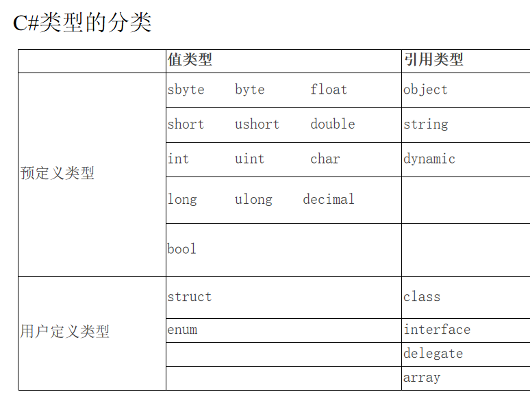

@[TOC](目录)

> 该文章整理并摘抄自[ 疯狂的小黑](https://www.xiaoheiwoo.com/c-sharp-interview-questions/)，本人在个别地方进行了修改，便于更容易地理解和学习。


### 0.什么是 C#？
> C# 于 2000 年发布，是一种基于 C 的编程语言，用于从桌面应用程序到 Web 服务的所有内容。今天，C#是世界上最流行的编程语言之一，它是一种在编程领域备受追捧的语言。 C# 在几个主要方面与 C++不同。最明显的是，C#是一种基于组件的语言，而 C++ 是一种面向对象的语言。C# 被认为比 C++ 更重量级，但它被用于许多现代系统，例如游戏开发工具包。
### 1.什么是类？
> **类是创建对象的模板。它包含数据成员和方法成员。** 我们可以从一个类创建许多对象实例。 下面是一个类的例子：

```csharp
    public class Student
    {
        //数据成员
        public int rollNumber { get; set; }
        public string fullName { get; set; }

        //方法成员
        public void PrintDetails()
        {
            //login of function
        }
    }
```
### 2.面向对象编程的主要概念是什么？

> 封装、抽象、多态和继承是面向对象编程的主要概念。准备好描述其中的每一个。面向对象编程与过程编程的不同之处在于过程编程按时间顺序、逐步进行，而面向对象编程则灵活得多。
### 3.什么是对象？
> 对象是一个类的实例，我们通过它访问该类的功能。我们可以使用“new”关键字来创建一个对象。在内存中创建对象的类保存有关该类的函数、数据成员和行为的信息。
> 请参阅下面的对象语法：

```csharp
    //类
    public class Employee
    {
        //数据成员
        private string fName { get; set; }
        private string lName { get; set; }

        //方法成员
        public void Display()
        {
            Console.WriteLine("Full name is {0} {1}", fName, lName);
        }

        public void SetName(string firstName, string lastName)
        {
            fName = firstName;
            lName = lastName;
        }
    }

    class Program
    {
        static void Main(string[] args)
        {
            //创建对象
            Employee employee = new Employee();
            employee.SetName("John", "Grande");
            employee.Display();
        }
    }
```
### 4.什么是构造函数，它有哪些不同的类型？

> 构造函数就像一个与类同名的方法，但它是唯一的方法。即使没有创建，编译器也会在创建类的对象时在内存中创建一个默认构造函数。构造函数用于使用一些默认值初始化对象。默认构造函数、参数化构造函数、复制构造函数、静态构造函数和私有构造函数都是不同的构造函数类型。
> 
> 下面是不同构造函数类型的示例：

```csharp
    public class Student
    {
        private int rollNumber { get; set; }
        private string fullName { get; set; }

        //默认构造函数
        public Student()
        {
            //code goes here
        }

        //带参数的构造函数
        public Student(int rNum, string fName)
        {
            this.rollNumber = rNum;
            this.fullName = fName;
        }

        //静态构造函数
        static Student()
        {
            //code goes here
        }

        //复制构造函数
        public Student(Student student)
        {
            rollNumber = student.rollNumber;
            fullName = student.fullName;
        }
    }
```
### 5. C#中的析构函数是什么？
> 析构函数清除内存以释放资源，并由垃圾收集器自动管理。为此目的在内部调用
> System.GC.collect()。如果需要，可以使用析构函数显式完成。但是，一般情况下，在C#程序开发是不用写析构函数的。

```csharp
public class Purchase
    {
        //显示地写析构函数
        ~Purchase()
        {
            //code here to release resources.
        }
    }
```
### 6.C# 代码是托管代码还是非托管代码？
> C# 是托管代码。 
> 1. 托管代码：运行在CLR(CLR是一个通用语言架构，它定义了一个代码运行的环境）下的代码就是托管代码，诸如C#、VB.NET写的代码都会先编译成MSIL（MS中间代码），并运行在CLR的子集CLI(Common Language Infrastructure）中，最终根据不同的平台使用JIT（just in Time）编译成机器代码。
> 与Java机制不同在于Java是经过一次编译和一次解释运行，C#是经过两次编译运行,这两个阶段分别为：源代码编译为托管代码，托管代码编译为微软平台的专用语言，又称机器语言。
>2. 非托管代码： 非托管的代码也叫本地代码（native），是由操作系统管理的。
> 高级语言编写的程序必须经过一定的步骤编译为机器语言才能被机器理解和运行。 这一系列步骤为：预处理、编译、汇编、链接。
> 3. 托管代码和非托管代码的区别： 
> * 托管代码是一种中间语言，运行在CLR上；非托管代码被编译为机器码，运行在机器上。
> * 托管代码独立于平台和语言，能更好的实现不同语言平台之间的兼容；非托管代码依赖于平台和语言。
> * 托管代码可享受CLR提供的服务（如安全检测、垃圾回收等），不需要自己完成这些操作；非托管代码需要自己提供安全检测、垃圾回收等操作。
### 7.什么是值类型和引用类型？
> 数据项的类型定义了存储数据需要的内存大小及组成该类型的数据成员。类型还决定了对象在内存中的存储位置——栈或堆。类型被分为两种：值类型和引用类型，这两种类型的对象在内存中的存储方式不同。 值类型只需要一段单独的内存，用于存储实际的数据。
> * 引用类型需要两段内存，第一段存储实际的数据，它总是位于堆中；第二段是一个引用，指向数据在堆中的存放位置。
> * 值类型，数据存放在栈里；对于引用类型，实际数据存放在堆里而引用存放在栈里。


### 8.什么是命名空间，它是强制性的吗？
> 命名空间是一种以相同名称组织相同组或功能的类的方法。我们可以称它为模块。尽管将类放在命名空间中并不是强制性的。 请参阅下面的语法：
```csharp
namespace demoapp
{
    class SomeClass
    {
        public static void someMethod()
        {
            Console.WriteLine("Creating my namespace");
        }

    }
}
```
### 9.用例子解释 C# 中的注释类型

> C# 中有三种类型的注释。
> 
> * 单行注释
> * 多行注释
> * XML 注释

> 单行注释的示例是：

```csharp
//嘿，这是单行注释
```

> 多行注释的一个例子是：

```csharp
/*这是一个多行注释，第一行
第二行
*/
```

> XML 注释的一个示例是：

```csharp
    /// <summary>
    /// XML 注释
    /// </summary>
```
### 10.请解释封装

> 封装是将函数和数据成员包装在一个类中的过程；它就像一个胶囊，一个单一的单元。封装可防止来自函数外部的未经授权或不需要的数据更改。它用于更好地控制和标准化你的代码。下面是一个封装的例子。

```csharp
 class User
    {
        private string _address;//私有字段
        private string _name;//私有字段
        public string Address//公有属性
        {
            get
            {
                return _address;
            }
            set
            {
                _address = value;
            }
        }
        public string Name//公有属性
        {
            get
            {
                return _name;
            }
            set
            {
                _name = value;
            }
        }
    }
    class MyProgram
    {
        static void Main(string[] args)
        {
            User u = new User();
            u.Name = "Ravi";
            u.Address = "New Delhi";
            Console.WriteLine("Name: " + u.Name);
            Console.WriteLine("Location: " + u.Address);
            Console.WriteLine("nPress Enter Key");
            Console.ReadLine();
        }
    }
```
### 11.什么是抽象？

> 抽象是只暴露类的必需特性并隐藏不必要信息的方法。我们可以尝试以摩托车为例来理解它：骑手知道自行车的颜色、名称和型号。尽管如此，他们仍然不了解内部发动机和排气功能。同样，抽象侧重于提供对特定功能的访问，而不暴露该功能在内部是如何工作的。
### 12.什么是多态性？
> 多态意味着相同的方法但不同的实现，有两种类型的多态性。

> 1. 编译时多态性是通过方法重载实现的，如下例所示：

```csharp
using System;
namespace Practice
{
    public class cellphone
    {
        //方法名相同但参数不同
        public void Typing()
        {
            Console.WriteLine("Using keypad");
        }

        public void Typing(bool isSmartPhone)
        {
            Console.WriteLine("Using qwerty keyboard");
        }
    }
}
```

> 2. 运行时多态性是通过方法覆盖来实现的，如下例所示：
```csharp
using System;
namespace Practice
{
    public class CellPhone
    {
        public virtual void Typing()
        {
            Console.WriteLine("Using keypad");
        }
    }
    public class SmartPhone : CellPhone
    {
        //方法的重载
        public override void Typing()
        {
            Console.WriteLine("Typing function from child class");
        }
    }
}
```
### 13.定义一个接口并展示一个例子。
> 接口是抽象类的另一种形式，它只有抽象的公共方法。这些方法只有声明，没有定义。实现接口的类必须实现接口的所有方法。 例如：

```csharp
using System;
namespace Practice
{
   public interface IPencil
    {
        void Write(string text);
        void Sharpen(string text);
    }

    class Pencil : IPencil
    {
        public void Write(string text)
        {
            //some code here
        }

        public void Sharpen(string text)
        {
            //some code here
        }
    }

    public class CellPhone
    {
        public virtual void Typing()
        {
            Console.WriteLine("Using keypad");
        }
    }
}
```
### 14.什么是继承？
> 一个类可以从另一个类（称为其父类）继承数据成员和方法。继承属性和方法的类将被称为子类、派生类。派生类中的某些属性可以被覆盖。从类继承特征的能力使管理类的整个过程变得更加容易，因为你可以创建自定义的子类。原始类将被称为父类或基类。
> 请参考以下示例：
```csharp
using System;
namespace Practice
{
    class Mobile  //基类
    {
        public void call()
        {
            Console.WriteLine("calling...!");
        }
    }

    class Nokia : Mobile  //子类
    {
        public string modelName = "Nokia";
    }

    class MyProgram
    {
        static void Main(string[] args)
        {
            // 实例化一个Nokia类
            Nokia myNokia = new Nokia();

            // 子类调用基类中的方法
            myNokia.call();
        }
    }
}
```
### 15.如何在同一个类中实现多个具有相同方法名的接口？
> 要实现具有相同方法名称的多个接口，你将避免在函数体中实现。相反，你将显式地将接口名称提供给方法的主体。编译器将了解所引用的接口方法，从而解决问题。
> 这可以在以下示例中看到：

```csharp
using System;
namespace Practice
{
   public interface IMyInterface1
    {
        void Print();
    }
    public interface IMyInterface2
    {
        void Print();
    }
    class Student : IMyInterface1, IMyInterface2
    {
        void IMyInterface1.Print()
        {
            Console.WriteLine("For myInterface1 !!");
        }
        void IMyInterface2.Print()
        {
            Console.WriteLine("For myInterface2 !!");
        }
    }
}
```
### 16.什么是虚方法，它与抽象方法有什么不同？
> 一个虚方法必须有一个默认实现，我们可以在派生类中使用 override关键字来覆盖这个虚方法。抽象方法没有实现，只在抽象类内部创建。在抽象类的情况下，从抽象类派生的类必须具有该抽象方法的实现。
> 下面是一个虚方法的例子：

```csharp
using System;
namespace Practice
{
    public class CellPhone
    {
        public virtual void Typing()
        {
            Console.WriteLine("Using old keypad");
        }
    }

    public class SmartPhone : CellPhone
    {
        public override void Typing()
        {
            Console.WriteLine("Using qwerty keyboard");
        }
    }
}
```

> 下面是一个抽象方法的例子：

```csharp
using System;
namespace Practice
{
    public abstract class CellPhones
    {
        //抽象类中的抽象方法，不实现方法体
        public abstract void Typing();
    }

    public class OldPhones : CellPhones
    {
        //重写抽象基类中的抽象方法，实现方法体
        public override void Typing()
        {
            Console.WriteLine("Using keypad");
        }
    }

    public class SmartPhones : CellPhones
    {
        //重写抽象基类中的抽象方法，实现方法体
        public override void Typing()
        {
            Console.WriteLine("Using Qwerty keyboard");
        }
    }
}
```
### 17.什么是方法重载和方法重写？
> 方法重载和覆盖都是一种多态性：
> 
> * 方法重载是指我们有一个名称相同但签名不同的函数。
> * 方法重写是当我们使用 override 关键字来重写子类中基类的虚拟方法时。
### 18.什么是static关键字？
> 我们使用 static关键字来创建静态类、静态方法或静态属性。当我们创建一个静态类时，该类中只能有静态数据成员和静态方法。静态意味着我们不能创建该类的实例。该类可以像 ClassName.methodName一样直接使用。当需要其他类的所有实例都具有的特殊功能时，我们使用静态类。例如，需要加载一些默认的应用程序级值。我们创建一个带有静态函数的静态类。然后，所有其他类都可以访问该类，而无需创建任何实例。它还与所有类共享相同的数据。
> 请参考以下示例：

```csharp
using System;
namespace Practice
{
    public static class Setting
    {
        public static int fetchDefault()
        {
            int maxAmount = 0;
            return maxAmount;
        }
    }

    public class Sales
    {
        //静态类无法被实例化
        int maxAmount = Setting.fetchDefault();
    }
}
```
### 19.我们可以在静态类中使用“this”吗？

> 不可以。“this”不能与静态类一起使用，因为我们只能在静态类中使用静态变量和静态方法。
### 20.常量和只读变量有什么区别？
> 有几点不同：
> 
> * 常量变量只能在声明时赋值，我们不能在整个程序中更改该变量的值。
> * 我们可以在声明时或在同一类的构造函数中将值分配给只读变量。
> 

> 下面是一个常量示例：

```csharp
using System;
namespace Practice
{
    class DemoClass
    {
        // 常量
        public const int myvar = 101;
        public const string str = "staticstring";

        static public void Main()
        {
            Console.WriteLine("The value of myvar: {0}", myvar);
            Console.WriteLine("The value of str: {0}", str);
        }
    }
}
```

> 下面是一个只读变量示例：

```csharp
using System;
namespace demoapp
{
    class MyClass
    {
        // 只读变量
        public readonly int myvar1;
        public readonly int myvar2;

        //可以在构造函数中将值分配给只读变量
        public MyClass(int b, int c)
        {
            myvar1 = b;
            myvar2 = c;
            Console.WriteLine("Display value of myvar1 {0}, " +
             "and myvar2 {1}", myvar1, myvar2);
        }
        static public void Main()
        {
            MyClass obj1 = new MyClass(100, 200);
        }
    }
}
```
### 21. C#中的String和StringBuilder有什么区别？

> 字符串是不可变的对象。当我们必须执行一些操作来更改字符串或附加新字符串时，它会清除字符串对象的旧值，并在内存中创建一个新实例以将新值保存在字符串对象中。
> 例如，以下代码使用 System.String 类：
```csharp
using System;
namespace demoapp
{
    class StringClass
    {
        public static void Main()
        {
            string val = "Hello";
            //创造一个新的字符串实例
            val += " World";
            Console.WriteLine(val);
        }
    }
}
```
> StringBuilder是一个可变对象，这意味着它每次都会为添加字符串（追加），替换字符串（替换）等操作创建一个新实例。它仅将旧对象用于对字符串执行的任何操作，从而提高性能。
> 例如，以下代码使用 System.Text.StringBuilder 类：

```csharp
using System;
using System.Text;
namespace demoapp
{
    class StringClass
    {
        public static void Main() 
        {
            StringBuilder val = new StringBuilder("Hello");
            val.Append(" World");
            Console.WriteLine(val);
        }
    }
}
```

> 两个程序的输出都是一样的，“Hello World”。
### 22.解释“continue”和“break”语句。
> 我们可以在 C# 的循环中使用 continue 和 break 语句。使用 break 语句，我们可以中断循环执行，而使用 continue 语句，我们可以中断循环的一次迭代。 下面是一个 break 语句的例子：

```csharp
using System;
namespace demoapp
{
    class LoopingStatements
    {
        public static void Main()
        {
            for (int i = 0; i <= 5; i++)
            {
                if (i == 4)
                {
                    break; //break跳出循环
                }
                Console.WriteLine("The number is " + i);
                Console.ReadLine();
            }  //在break跳出循环之后程序会从这里开始执行
        }
    }
}
```
> 这是带有 continue 语句的相同示例：

```csharp
using System;
namespace demoapp
{
    class LoopingStatements
    {
        public static void Main()
        {
            for (int i = 0; i <= 5; i++)//在continue跳出循环后，会从这里执行
            {
                if (i == 4)
                {
                    continue;//跳出本次循环，并执行下次循环
                }
                Console.WriteLine("The number is " + i);
                Console.ReadLine();
            }
        }
    }
}
```
### 23. 什么是装箱和拆箱？

> 从值类型和数据类型到引用类型（对象）数据类型的转换称为装箱。 例如：
```csharp
namespace demoapp
{
    class Conversion
    {
        public void DoSomething()
        {
            int i = 10;
            object o = i;
        }
    }
}
```
> 拆箱是将引用类型和数据类型转换为值类型。 例如：

```csharp
namespace demoapp
{
    class Conversion
    {
        public void DoSomething()
        {
            object o = 222;
            int i = (int)o;
        }
    }
}
```
### 24.什么是密封类？

> 我们使用“sealed”关键字来创建一个密封类。当不需要进一步继承或需要限制该类被继承时，类被创建为密封类。请参阅下面的语法：
```csharp
public sealed class MyClass
{
   
}
```
### 25.什么是偏类？
> C#语言中有一个特性是将单个类文件分成多个物理文件。为此，我们必须使用“partial”关键字。在编译时，它在逻辑上只是一个文件；我们不能在两个不同的分部类文件中拥有同名的方法或同名的变量。在这里，为了方便开发者将大类文件分解成多个小的物理文件，提供了这个功能。
### 26.什么是枚举？
> “枚举”关键字在许多语言中都很常见。枚举是一种值。它用作相关常量的集合，称为枚举列表。 枚举可以是 int、float、double 或 byte。但如果它不是 int，则需要显式转换。.NET 框架枚举可用于创建数字常量。Int
> 是枚举元素的默认值。默认情况下，第一个枚举数的值为 0，并且每个后续的枚举数都增加 1，就像一个数组一样。请参考以下语法：

```csharp
using System;
namespace demoapp
{
    enum Day 
    { 
        Sat,
        Sun, 
        Mon,
        Tue, 
        Wed, 
        Thu, 
        Fri 
    };
}
```
### 27.什么是依赖注入，如何实现？

> 依赖注入是一种设计模式。我们不是直接在另一个类（依赖类）中创建一个类的对象，而是将对象作为参数传递给依赖类的构造函数。它有助于编写松散耦合的代码，并有助于使代码更加模块化和易于测试。实现依赖注入的三种方式：
> 
> * 构造函数注入：这是最常用的注入类型。在构造函数注入中，我们可以将依赖项传递给构造函数。我们必须确保这里没有默认构造函数，唯一的应该是参数化构造函数。
> * 属性注入：在某些情况下，我们需要一个类的默认构造函数，那么在这种情况下，我们可以使用属性注入。
> * 方法注入：在方法注入中，我们只需要在方法中传递依赖即可。当整个类不需要那个依赖时，就不需要实现构造函数注入。当我们对多个对象有依赖关系时，我们不会在构造函数中传递该依赖关系，而是在需要它的函数本身中传递该依赖关系。
### 28.请解释“using”语句。
> 关键字“using”用于定义该 using 语句块中使用的资源的范围。一旦代码块完成执行，在 using 代码块中使用的所有资源都会被释放。
> 请参考以下示例:

```csharp
using System;
namespace demoapp
{
   public class Books : IDisposable
    {
        private string _name;
        private double _price;
        public string Name
        {
            get { return _name; }
            set { _name = value; }
        }
        public double Price
        {
            get { return _price; }
            set { _price = value; }
        }
        public Books(string name, double price)
        {
            _name = name;
            _price = price;
        }

        public void Print()
        {
            Console.WriteLine("Book name is {0} and price is {1}", _name, _price);
        }

        public void Dispose()
        {
            throw new NotImplementedException();
        }
    }

   public class Students
    {
        public void DoSomething()
        {
            using (Books myBook = new Books("book name", 12.45))
            {
                myBook.Print();
            }
        }
    }
}
```
### 29.什么是访问修饰符？解释每种类型。

> 在C#语言中，共有五种访问修饰符：public、private、protected、internal、protected internal。

> 在c#中：
> 1. 类、结构的默认修饰符是internal。
> 2. 类中所有的成员默认修饰符是private。
> 3. 接口默认修饰符是internal。
> 4. 接口的成员默认修饰符是public。
> 5. 命名空间、枚举类型成员默认修饰符是public。
> 6. 委托的默认修饰符是internal。

### 30.什么是C#委托？
> 委托就是可以方法名调用另一个方法的便捷方法，我们使用委托来编写泛型类型安全函数。所有委托都派生自 System.Delegate。可以使用delegate 关键字后跟函数签名来声明委托，如下所示。这些是委托的特征：
> * 委托派生自 System.Delegate 类；
> * 委托具有签名和返回类型。分配给代表的函数必须符合此签名；
> * 委托可以指向实例方法或静态；
> * 委托对象一旦创建，就可以在运行时动态调用它所指向的方法；
> * 委托可以同步和异步调用方法 请参考以下示例：
```csharp
using System;
namespace demoapp
{
    class DelegateClass
    {
        // 声明一个委托
        public delegate void Print(int value);

        static void Main()
        {
            //将PrintNumber方法指派给委托
            Print printDel = PrintNumber;

            printDel(100000);
            printDel(200);

            //将PrintMoney方法也指派给委托
            printDel = PrintMoney;
            printDel(10000);
            printDel(200);
        }

        public static void PrintNumber(int num)
        {
            Console.WriteLine("Number: {0,-12:N0}", num);
        }

        public static void PrintMoney(int money)
        {
            Console.WriteLine("Money: {0:C}", money);
        }
    }
}
```
### 31.委托有哪些不同类型？

> 委托分为三种类型：
> * **单个委托**可以调用单个方法。
> * **多个委托**可以调用多个方法。委托方法可以进行多播。我们可以使用 + 运算符在委托实例中添加一个方法，也可以使用 – 运算符删除一个方法。所有方法在分配时按顺序调用。
> * .Net Framework 3.5 引入了**通用委托**。无需在通用委托中创建实例。
### 32.什么是数组？解释一维和多维数组。

> 该数组存储相同类型的值。它是将变量存储到内存位置的集合。 例如：
```csharp
int[] marks = new int[3] { 25, 34, 89 };
```
> 一维数组是线性数组。一维数组将变量存储在一行中。上面的例子是一个一维数组。数组可以有多个维度。多维数组也称为矩形数组。 例如：
```csharp
int[,] numbers = new int[3, 2] { { 1, 2 }, { 2, 3 }, { 3, 4 } };
```
### 33. System.Array.CopyTo() 和 System.Array.Clone() 有什么区别？
> 使用 Clone() 方法，我们可以使用 CopyTo()方法创建一个包含原始数组的所有元素的新数组对象。现有数组的所有项目都复制到另一个现有数组中。两种方式都会创建一个浅拷贝。
### 34.Array和ArrayList有什么区别？
> Array和 ArrayList类似。当你想存储相同类型的项目时，可以使用Array。Array具有固定大小。当你要存储任何类型的数据时，我们使用ArrayList。ArrayList 没有固定大小。 参考数组和ArrayList的例子：
```csharp
using System.Collections;
namespace demoapp
{
    class Sample
    {
        public void ArrayFunction()
        {
            //Array只能添加字符串String类型的数据
            string[] country = new string[3];
            country[0] = "USA";
            country[1] = "Denmark";
            country[2] = "Russia";

            //ArrayList可以存储不同类型的数据
            ArrayList arraylist = new ArrayList();
            arraylist.Add(3);
            arraylist.Add("USA");
            arraylist.Add(false);
        }
    }
}
```
### 35.什么是C#中的交错数组？
> 交错数组就像一个嵌套数组，其中交错数组的每个元素本身就是一个数组。交错数组的项目可以具有不同的维度和大小。交错数组是 C# 中引入的一种特殊类型的数组。交错数组是数组的数组，其中每个数组索引的长度可以不同。 请参考以下示例：
```csharp
namespace demoapp
{
    public class JaggedArrayClass
    {
        public void ShowJaggedArray()
        {
            int[][] jaddedArray = new int[2][];

            jaddedArray[0] = new int[3] { 1, 2, 3 };

            jaddedArray[1] = new int[4] { 1, 2, 3, 4 };
        }
    }
}
```
### 36. struct和class有什么区别？

> 结构和类非常相似，都有数据成员和函数成员，最重要的区别是：
>  （1）类是引用类型，而结构是值类型；
> （2）结构是隐式封装的，这意味着他们不能被派生。
> **结构也可以有实例构造函数和静态构造函数**，但不能有析构函数。 结构不能是抽象的。无需使用 new 关键字创建对象。Struct 无权创建任何默认构造函数。类可以是抽象的。 结构的语法：
```csharp
struct MyStruct
            {
        public int MyProperty1 { get; set; }
        public int MyProperty2 { get; set; }
}
```
### 37. “throw”和“throw ex”有什么区别？
> “throw”语句将保留前一个函数的原始错误堆栈，而“throw ex”语句将保留从抛出点开始的堆栈跟踪。通常，建议使用“throw”，因为它提供了准确的错误信息和跟踪数据。
### 38.解释final, finally的区别。
> * final—修饰符（关键字）如果一个类被声明为final，意味着它不能再派生出新的子类，不能作为父类被继承。因此     一个类不能既被声明为 abstract的，又被声明为final的。将变量或方法声明为final，可以保证它们在使用中    不被改变。被声明为final的变量必须在声明时给定初值，而在以后的引用中只能读取，不可修改。被声明为 final的方法也同样只能使用，不能重载。
> * finally—在异常处理时提供 finally 块来执行任何清除操作。如果抛出一个异常，那么相匹配的catch子句就会执行，然后控制就会进入 finally 块（如果有的话）。
### 39.解释 var 和 dynamic。
> 我们可以声明变量的 var 类型，而无需明确指定 .net 数据类型。编译器在编译时根据分配给它的值自动检测变量的类型。我们不能声明一个 var 类型的变量而不给它赋值。var 类型变量的值不能在后面的代码中更改。dynamic与var相反。稍后我们可以在代码中更改dynamic类型变量的值。它还根据分配给它的值决定变量的类型。就像在创建dynamic类型的变量时，会为其分配一个整数类型的值，然后在进一步的代码中，我们可以为该变量分配一个字符串类型的值。它保存最后更改的值，其行为类似于它保存的最新值的数据类型。让我们看这个例子来更详细地理解它：

```csharp
using System.Collections;
namespace demoapp
{
    public class Bike
    {
        dynamic someValue = 21;

        public Bike()
        {
            someValue = "Hello";
        }
    }
}
```

> 在上面的示例中，如果我们将变量“someValue”声明为 var 而不是
> dynamic，则会引发错误。该错误的原因是在下一行中，我们更改了变量的值并分配了一个字符串值。
### 40. C# 中的匿名类型是什么？
> 有时我们可能需要创建一个新类型而不定义它。这将被称为匿名类型。当需要在单个对象中定义只读属性而不定义每种类型时，这很有用。 在这里，编译器生成类型并且只能用于当前代码块。 请参考以下示例：
```csharp
public class SomeClass
            {
     public void print()
     {
        var anonymousData = new
        {
             FirstName = "John",
             SurName = "lastname"
        };

       Console.WriteLine("First Name : " + anonymousData.FirstName);
     }
}
```
### 41. 什么是多线程，它有哪些不同的状态？

> C#中的任何代码块都在称为进程的线程中运行。线程是程序的执行路径。简单的应用程序可以在单线程上运行，但今天的程序经常使用多线程。多线程将进程的执行划分为多个线程以同时执行它，从而提高效率。
> 通过多线程，我们可以一次运行多个任务。程序更高效、更快捷。但是我们还需要了解线程是如何工作的。每个线程都有自己的生命周期，其中包括线程的各种状态：
> * 未启动状态：在这种状态下，编译器创建线程的实例但等待启动方法。
> * 已启动：是线程准备好运行并等待 CPU 周期时的状态。
> * 不可运行状态：线程在以下情况下不可执行:
>    - 当我们调用“Sleep”或“Wait”方法时。
>   - I/O 操作阻塞线程。
### 42. C#中的异常处理是如何完成的？
> 异常处理通过 try、catch、finally 和 throw 模型进行管理。这些是整个模型中使用的关键字。下面是每个关键字的解释：
> 
> * Try：我们将代码保存在我们想要处理异常的 try 块中。
> * Catch：当 try 块中发生任何异常时，在异常处理程序的帮助下将其捕获到 catch 块中。
> * finally：为了不考虑错误地执行代码块，我们将该代码放在 finally 块中以执行。
> * Throw：发生问题时抛出异常。 下面是异常处理的例子：

```csharp
using System.Collections;
namespace demoapp
{
    public class SomeClass
    {
        public void GetData()
        {
            try
            {

            }
            catch (Exception)
            {
                throw;
            }
            finally
            {

            }
        }
    }
}
```
### 43.什么是自定义异常？

> 自定义异常用于根据用户要求捕获的错误，而不是内置在编译器中的错误。自定义异常是实例化用户定义异常的一种简单方法。
> 
> 请参考以下示例:

```csharp
using System.Collections;
namespace demoapp
{
    public class Purchase
    {
        public void DoPurchase(int quantity)
        {
            if (quantity == 0)
            {
                throw new Exception("Quantity cannot be zero");
            }
        }
    }
}
```
### 44.什么是 C# 中的 LINQ？
> LINQ 是指语言集成查询。LINQ 是一种使用 .NET 功能和类似于 SQL 的 C# 语法查询数据的方法。 LINQ
> 的优点是我们可以查询不同的数据源。数据源可以是对象的集合、XML 文件、JSON
> 文件、内存中的数据或列表或数据库对象。我们可以轻松地从任何实现 IEnumerable<T> 接口的对象中检索数据。下面是 LINQ 的语法:
```csharp
    public class Devices
    {
        public void GetData()
        {
            List<string> mobiles = new List<string>() {
                "Iphone","Samsung","Nokia","MI"
            };

            //LINQ 的语法
            var result = from s in mobiles
                         where s.Contains("Nokia")
                         select s;

        }
    }     
```
### 45.什么是序列化？

> 当我们想通过网络发送一个对象时，我们必须将该对象转换为字节流。序列化是将对象转换为字节流的过程。为了便于对象进行可序列化，它应该实现 ISerialize 接口。反序列化的过程是从字节流创建对象的逆过程。
### 46. C#中的泛型是什么？
> C# 中的泛型：
> * 提高性能。
> * 增加类型安全。
> * 减少重复代码。
> * 制作可重用的代码。
> 
>  使用泛型，我们可以创建集合类。最好使用 System.Collections.Generic 命名空间而不是 System.Collections 命名空间中的类（例如 ArrayList）来创建泛型集合。泛型鼓励使用参数化类型， 如下例所示：

```csharp
using System;
namespace demoapp
{
    public class GFG<T>
    {
        private T data;

        public T value
        {
            get
            {
                return this.data;
             }
            set
            {
                this.data = value;
             }
        }
    }

   public class Vehicle
    {
        static void Main()
        {
            GFG<string> company = new GFG<string>();
            company.value = "Tata motors";

            GFG<float> version = new GFG<float>();
            version.value = 6.0F;

            Console.WriteLine(company.value);

            Console.WriteLine(version.value);
        }
    }
}
```
### 47.什么是反射（Reflection）？
> Reflection 是 C# 中的一个特定类，用于访问程序集或类的元数据。可以使用反射检索以下信息：
> 
> * 程序集名称；
> * 类名；
> * 方法名；
> * 类型名；
> * 自定义的属性和方法名。

### 48.如何使用可空类型？
> 空值可以分配给 C# 中的变量。这些类型称为可空类型。大多数变量类型都是可为空的类型。 下面的例子：

```csharp
namespace demoapp
{
    class Calculate
    {
        int? number = null; //表示numbet可以为空
        public Calculate()
        {

        }

        public void DoCalculation()
        {
            if (number.HasValue)
            {
                Console.WriteLine("number值不为空：{0}", number.Value);
               
            }else
            {

                Console.WriteLine("number值为空");
            }
            
        }
    }
    public class Client
    {
        public static void Main()
        {
            Calculate calculate = new Calculate();
            calculate.DoCalculation();
        }
    }
}
```

> 输出结果：
```bash
为空
```
### 49.我们在 C# 中创建的所有类的父类是哪个？
> 答案：Object。
### 50.解释 C# 中的代码编译。
> 程序员编写人们可读的代码。然后将该代码输入 C# 编译器。C# 编译器会将代码编译成高效、机器可读的托管代码，称为字节码。然后，即时编译器(JIT) 会将字节码编译为本机或机器语言。当程序运行时，CPU会直接执行这段代码。
### 51.什么是 C# 中的哈希表？
> 哈希表通常包含“键”和“值”。你经常会听到关于密码的“哈希表”；可以为给定的密码创建密码哈希。但是哈希表本身只是键对象和值对象的通用集合，其中的值必须使用键来访问；否则无法访问它们。
### 52. 如何从基类创建派生类对象？
> 派生类将从基类继承变量和方法。此外，派生类只能有一个基类。你需要直接使用基类进行工作。
### 53.什么是不可变字符串？
> 不可变字符串是不能更改的对象，尽管你可以更改对它的引用。通常，只要你有绝对不应该更改的常量，就应该使用不可变字符串。但是，你应该谨慎使用此技巧，因为如果你稍后尝试更改不可变字符串，它可能会引发错误。
### 54.什么是C#中的反射？
> 反射是指系统能够查看和修改自身的方法和过程。在 C# 中，反射是指检查系统的内容。它需要通过“System.Reflection”命名空间手动包含在 C# 中。反射对于调试工具特别有用。
### 55.什么是泛型类？
> 泛型类是可以处理任何类型的类。这是独一无二的，因为大多数类都遵循严格的类型；你必须声明一个类型，并且该类型必须是一致的。定义一个泛型类如下：
```csharp
    class dataStore<T>
    {
        public T data
        {
            get; set;
        }
    }
```
### 56.什么是params关键字，如何使用？
> 通过使用 params 关键字，你可以指定采用可变数量参数的方法参数。参数类型必须是一维数组。
```csharp
    public static void CalcListSum(params int[] list)
    {
        int sum = 0;
        for (int i = 0; i < list.Length; i++)
        {
            sum += list[i];
        }
        Console.WriteLine("The sum is " + sum);
    }
```
### 57. 什么是 NuGet？
> NuGet 是面向开发人员的包管理器。它使开发人员能够共享和使用有用的代码。NuGet 包是单个 ZIP 文件，带有 .nupack 或 .nupkg 文件扩展名，并包含 .NET 程序集及其所需文件。
### 58、什么是DLL文件，使用它们有什么好处？
> DLL 是一个库，其中包含可由多个程序同时使用的代码和数据。每个程序都可以使用 DLL
> 中包含的功能。这有助于提高代码的可重用性和有效的内存使用。通过使用 DLL，可以将程序模块化为单独的组件。
> 
> 因为模块是分开的，所以程序的加载时间更快。并且仅在请求该功能时才加载模块。此外，更新更容易应用于每个模块，而不会影响程序的其他部分。当这些更改被隔离到
> DLL 时，你可以应用更新而无需再次构建或安装整个程序。

