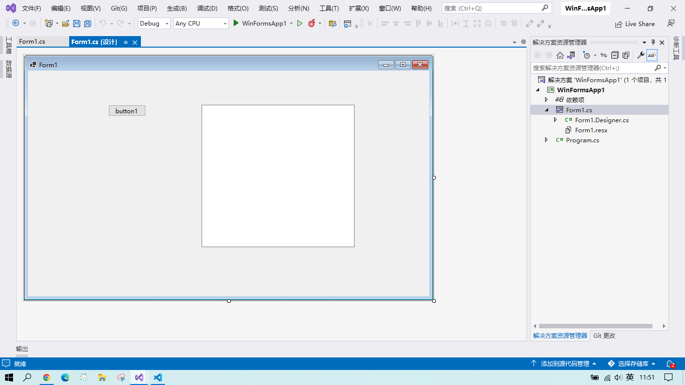
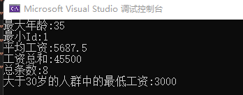
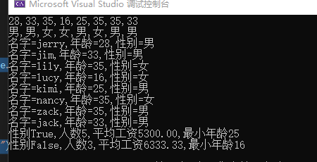
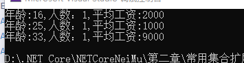
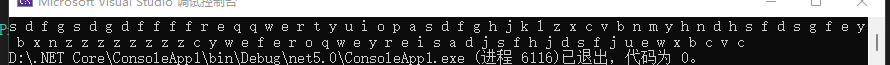
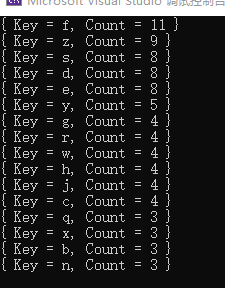

@[TOC](目录)

> 系统学习下.Net Core。


# 1.关于.NET
## 1. 什么是.NET？

> .NET是.NET Framework、.NETCore、Xamarin/Mono的统称。

## 2. 什么是.NET FrameWork？

> .NET FrameWork框架只能开发Windows平台的应用程序，也就是说用.NET
> FrameWork框架做出来的程序只能运行在Windows系统下。

## 3. 什么是.NET Core？

> .NET Core框架是免费、开源、跨平台的，可以运行在Linux、Macos、Windows平台下。

## 4.NET Core的优点

>  1. 支持独立部署，不相互影响；
>  2. 彻底模块化；
>  3. 没有历史包袱，运行效率高；
>  4. 不依赖于IIS;
>  5. 跨平台;
>  6. 符合现代开发理念：依赖注入、单元测试等。

# 2.异步编程
## 1.C#中async、await关键字

> 异步方法：用async关键字修饰的方法。
>  1. 异步方法的返回值一般是Task<T>，T是真正的返回值类型，Task<int>。惯例：异步方法的名字以Async结尾；
>  2. 即使方法没有返回值，也最好把返回值声明为非泛型的Task；
>  3. 调用泛型方法时，一般在方法前加上await关键字，这样拿到的返回值就是泛型指定的T类型；
>  4. 异步方法的”传染性“：一个方法如果await调用，则这个方法也必须修改为async；
>  5. 如果一个方法是异步方法，那么一般在调用这个方法的时候在方法前加await关键字，如：

```csharp
await File.WriteAllTextAsync(filename,html);
```

> 体验下异步编程，如：

```csharp
 public class Program
    {
        static async Task Main(string[] args)
        {
            string fileName = @"D:\1.txt";//该行也可以写成string fileName = "D:/1.txt";
            File.Delete(fileName);//删除文件
            StringBuilder str = new StringBuilder();
            for(int i = 0; i < 10000; i++)
            {
                str.Append(",Hello");
            }
             File.WriteAllTextAsync(fileName,str.ToString());
            string s=await File.ReadAllTextAsync(fileName);
            Console.WriteLine(s);
        }
    }
```

> 运行程序会报错，因为File.WriteAllTextAsync(fileName,str.ToString())前没有await关键字，程序运行到此行时，不会跳过此行，会一直执行此行知道此行执行结束，但是由于下一行中的File.ReadAllTextAsync(fileName)前有await，因此运行此代码会报错（报错原因：同一个文件不能同时被一个进程读和另外一个进程写）。
> 如下图，在File.WriteAllTextAsync(fileName,str.ToString())方法前加一个await关键字就可以了：

```csharp
public class Program
    {
        static async Task Main(string[] args)
        {
            string fileName = @"D:\1.txt";//该行也可以写成string fileName = "D:/1.txt";
            File.Delete(fileName);//删除文件
            StringBuilder str = new StringBuilder();
            for(int i = 0; i < 10000; i++)
            {
                str.Append(",Hello");
            }
            await File.WriteAllTextAsync(fileName,str.ToString());
            string s=await File.ReadAllTextAsync(fileName);
            Console.WriteLine(s);
        }
    }
```
## 2.编写异步方法

> 1.自定义两个异步方法，一个不带返回值，一个带返回值，如下：

```csharp
 public class Program
    {
       public static async Task Main(string[] args)
        {
             await DownloadHtmlAsync1("https://www.youzack.com", @"D:/1.txt");
            Console.WriteLine("Ok");
            Console.WriteLine("**************");
            Console.WriteLine("**************");
            Console.WriteLine("**************");
            int len2= await DownloadHtmlAsync2("https://www.youzack.com", @"D:/2.txt");
            Console.WriteLine("Ok"+len2);
        }

        /// <summary>
        /// 自定义一个异步方法(不带返回值)，用于从网页上下载html文件，并写在本地文件中
        /// </summary>
        /// <param name="url">
        /// html文件的下载地址
        /// </param>
        /// <param name="filename">
        /// 下载的html文件保存在本地哪个文件中
        /// </param>
        /// <returns></returns>
        public static async Task DownloadHtmlAsync1(string url, string filename)
        {
            HttpClient httpClient = new HttpClient();
            string html = await httpClient.GetStringAsync(url);
            await File.WriteAllTextAsync(filename, html);
        }

        /// <summary>
        /// 自定义一个异步方法(带返回值)，用于从网页上下载html文件，并写在本地文件中
        /// </summary>
        /// <param name="url">
        /// html文件的下载地址
        /// </param>
        /// <param name="filename">
        /// 下载的html文件保存在本地哪个文件中
        /// </param>
        /// <returns></returns>
        public static async Task<int> DownloadHtmlAsync2(string url, string filename)
        {
            HttpClient httpClient = new HttpClient();
            string html = await httpClient.GetStringAsync(url);
            await File.WriteAllTextAsync(filename, html);
            return html.Length;
        }
    }
}
```

> 2.如果同样的功能，既有同步方法，又有异步方法，那么优先使用异步方法。
> 3.异步lambda表达式(委托) 例如：

```csharp
 public class Program
    {
        public static void Main()
        {
            ThreadPool.QueueUserWorkItem(async (obj) =>
            {
                while (true)
                {
                    await File.WriteAllTextAsync(@"D:/3.txt", "sdfffffffffffffffffff");
                }
               
            });
            Console.ReadKey();
        }
    }
```
## 3.异步方法并不等于多线程

> **异步方法中的代码并不会自动在新线程中执行，除非把代码放到新线程中执行（通过Task.Run方法将代码放到新的线程中执行）。** 看下不使用Task.Run方法和使用Task.Run方法的效果： 不使用Task.Run方法:

```csharp
public class Program
    {
        public static async Task Main()
        {
            Console.WriteLine("之前" + Thread.CurrentThread.ManagedThreadId);
            double r = await CalcAsync(5000);
            Console.WriteLine("之后" + Thread.CurrentThread.ManagedThreadId);
        }

        public static async Task<double> CalcAsync(int n)
        {
            Console.WriteLine("CalcAsync" + Thread.CurrentThread.ManagedThreadId);
            double result = 0;
            Random random = new Random();
            for(var i = 0; i < n * n; i++)
            {
                result+=random.NextDouble();
            }
            return result;
        }
    }
```

> 使用Task.Run方法:

```csharp
 public class Program
    {
        public static async Task Main()
        {
            Console.WriteLine("之前" + Thread.CurrentThread.ManagedThreadId);
            double r = await CalcAsync(5000);
            Console.WriteLine("之后" + Thread.CurrentThread.ManagedThreadId);
        }

        public static async Task<double> CalcAsync(int n)
       {
            return await Task.Run(() =>
            { 
                Console.WriteLine("CalcAsync" + Thread.CurrentThread.ManagedThreadId);
                double result = 0;
                Random random = new Random();
                for (var i = 0; i < n * n; i++)
                {
                    result += random.NextDouble();
                }
                return result;
            });
        }
    }
```
## 4.为什么有的异步方法没标async

> 1.async方法的缺点：
>  1. 异步方法会生成一个类，运行效率没有普通方法高;
>  2. 可能会占用非常多的线程; 用async和await配合来调用普通方法(推荐此方式,运行效率高),例如：

```csharp
public class Program
    {
        public static async Task Main()
        {
            string s = await ReadAsync(1);
            Console.WriteLine(s);
        }

        public static Task<string> ReadAsync(int n)
        {
            if (n == 1)
            {
                return File.ReadAllTextAsync(@"D:/1.txt");
                
            }else if (n == 2)
            {
                return File.ReadAllTextAsync(@"D:/2.txt");
            }
            else
            {
                throw new ArgumentException();
            }
        }
    }
```
## 5.不要用sleep

> 1.Thread.Sleep()方法阻塞的是当前线程，如果当前线程是主线程，那么调用Sleep方法就会阻塞主线程。如果想在异步方法中暂停一段时间，不要用Thread.Sleep()方法，因为它会阻塞调用线程，而要用await
> Task.Delay()。举例：下载一个网址，3秒后下载另外一个。
> 
> 例如，新建一个Winfrom程序（选用winform程序而不采用控制台为例子是因为在控制台中看不到区别，但是在winfrom程序中就可以看到区别，在ASP.NET
> Core中也看不到区别，但是Sleep()方法会降低并发，因此不要用Sleep()方法）：



> 在后台的代码如下：

```csharp
 private async void button1_Click(object sender, EventArgs e)
        {
            HttpClient httpClient=new HttpClient();
            string s1= await httpClient.GetStringAsync("https://www.youzack.com");
            textBox1.Text = s1.Substring(0, 2000);
            //Thread.Sleep(3000);
            await Task.Delay(3000);
            string s2 = await httpClient.GetStringAsync("https://www.baidu.com");
            textBox1.Text = s2.Substring(0, 200);
        }
```
## 6.CancellationToken

> 1.有时需要提前终止任务，比如：请求超时、用户取消请求。很多异步方法都有CancellationToken参数，用于获得提前终止执行的信号。
> 2.CancellationToken结构体：
>  1. bool IsCancellationRequested是否取消
>  2. Register(Action callback) 注册取消监听
>  3. ThrowIfCancellationRequested()如果任务被取消，执行到这句话就抛异常。
>  3.CancellationTokenSource类
>  4. CancelAfter()超时后发出取消信号
>  5. Cancel()发出取消信号
>  6. CancellationToken Token 代码举例1，5秒后请求被取消：

```csharp
public class Program
    {
        public static async Task  Main(string[] args)
        {
            //await Download1Async("https://www.youzack.com", 100);

            CancellationTokenSource cts=new CancellationTokenSource();
            cts.CancelAfter(5000);
            CancellationToken cToken=cts.Token;
            await Download2Async("https://www.youzack.com",100,cToken);
        }

        /// <summary>
        /// 不带CancellationToken的方法
        /// </summary>
        /// <param name="url"></param>
        /// <param name="n"></param>
        /// <returns></returns>
        public static async Task Download1Async(string url,int n)
        {
            HttpClient client = new HttpClient(); 
            for(int i = 0; i < n; i++)
            {
                string html=await client.GetStringAsync(url);
                Console.WriteLine($"{DateTime.Now}:{html}");
            }
        }


        /// <summary>
        /// 带CancellationToken的方法
        /// </summary>
        /// <param name="url"></param>
        /// <param name="n"></param>
        /// <returns></returns>
        public static async Task Download2Async(string url, int n, CancellationToken cancellationToken)
        {
            HttpClient client = new HttpClient();
            for (int i = 0; i < n; i++)
            {
                string html = await client.GetStringAsync(url);
                Console.WriteLine($"{DateTime.Now}:{html}");
                if (cancellationToken.IsCancellationRequested)
                {
                    Console.WriteLine("请求被取消");
                    break;
                }
            }
        }
    }
```

> 4.在ASP.NET Core开发中，一般不需要自己处理cancellationToken、CancellationTokenSource 这些，只要能做到“能转发cancellationToken”即可。在ASP.NET Core会对用户请求中断进行处理。

## 7.WhenAll

> 1.Task类的重要方法：
> 
>  1. Task<Task> **WhenAny**(IEnumerable<Task> tasks)等，任何一个Task完成，Task就完成；
>  2. Task<TResult[]> **WhenAll**<TResult>(params Task<TResult>[] tasks)方法：等所有Task完成，Task才完成，用于等待多个任务执行结束，但是他们不在乎他们的执行顺序。
>  3. Task<TResult> **FromResult**<TResult>(TResult result)方法：创建普通数值的Task对象。
>  2.代码练习：计算一个文件夹下，所有文本文件的单词个数汇总。代码如下：

```csharp
public class Program
    {
        public static async Task  Main(string[] args)
        {
            string[] files=Directory.GetFiles(@"D:/Test");
            Task<int>[] countTasks=new Task<int>[files.Length];
            for(int i=0; i<files.Length; i++)
            {
                string filename=files[i];
                Task<int> t = ReadCharsCount(filename);
                countTasks[i] = t;
            }
            int[] counts=await Task.WhenAll(countTasks);
            int c = counts.Sum();//计算数组中所有元素的和
            Console.WriteLine(c);
        }

        static async Task<int> ReadCharsCount(string filename)
        {
            string s=await File.ReadAllTextAsync(filename);
            return s.Length;
        }
    }
```
## 8.异步编程中其他问题
### 1.接口中的异步方法：

> async是提示编译器为异步方法中的await代码进行分段处理的，而一个异步方法是否修饰了async对于方法的调用者来讲是没区别的，因此对于接口中的方法或抽象方法不能修饰为async。
> 如：

```csharp
public interface Itest
{
    Task<int> GetCharCount(string file);
}
public class Test : Itest
{
    public async Task<int> GetCharCount(string file)
    {
        string s = await File.ReadAllTextAsync(file);
        return s.Length;
    }
}
```
### 2.异步与yield

> yield return不仅能够简化数据的返回，而且可以让数据处理"流水线化",提升性能。 如：

```csharp
public class Program
    {
        public static async Task  Main(string[] args)
        {
            IEnumerable<string> lists= Test();
            foreach(var item in lists)
            {
                Console.WriteLine(item);
            }
        }

      public static IEnumerable<string> Test()
        {
            yield return "hello1";
            yield return "hello2";
            yield return "hello3";
        }
    }
```
# 3.LINQ
## 1.为什么要学习LINQ? 

> 1.答案是让数据处理变得简单。 比如，现在有这样一个需求：统计一个字符串中每个字母出现的频率（忽略大小写）,然后按照从高到低的顺序输出出现频率高于2次的单词和其出现的频率。用LINQ的知识很容易就可以写出来：

```csharp
            var items = s.Where(c => char.IsLetter(c)) //过滤非字母
                .Select(c => char.ToLower(c)) //大写字母转化为小写
                .GroupBy(c => c)//根据字母进行分组
                .Where(g => g.Count() > 2)//过滤掉出现次数小于2
                .OrderByDescending(g => g.Count())//按照出现次数排序
                .Select(g => new { Char = g.Key, Count = g.Count() });
```

>  2.要想把LINQ学好，需要按照委托---lambda---LINQ的顺序来，即先把委托学好，再学好委托中lamda，最后学习LINQ。

##  2.LINQ中的常用扩展方法

> LINQ中提供了大量类似于Where的扩展方法，简化数据处理，大部分都在System.Linq命名空间中。

### 1.Where方法：根据条件执行操作
### 2.Count方法：获取数据的条数
### 3.Any方法：是否至少有一条数据

> 如：

```csharp
bool b1 = List.Any(e => e.Salary > 8000);
bool b2 = List.Where(e => e.Salary > 8000).Any();
```
### 4.获取一条数据（是否带有参数的两种写法）

> - Single:有且只有一条满足要求的数据；
> - SingleOrDefault:最多只有一条要满足的数据；
> - First:至少有一条，返回第一条；
> - FirstOrDefault:返回第一条或默认值；

### 5.排序

> - Order() 升序排序；
> - OrderByDescending() 倒序排序；
> - list.OrderBy(e => e.Age);//根据Age来对集合进行升序排序; 对于简单类型排序，也许不用lambda表达式。 特殊案例：按照最后一个字符排序；用Guid或者随机数进行随机排序。

### 5.多规则排序

> 可以在Order()、OrderByDescending()后继续写ThenBy () 、ThenByDescending()。
> 案例：优先按照Age排序，如果Age相同再按照Salary排序。 list.OrderBy(e =>
> e.Age).ThenByDescending(e => e.Salary)， 千万不要写成list.OrderBy(e =>
> e.Age). OrderByDescending (e => e.Salary)。

### 6.限制结果集，获取部分数据

> Skip(n)跳过n条数据，Take(n)获取n条数据。 案例：跳过前2条数据并开始获取之后的3条数据(即获得第3、4、5条数据)： var
> orderedItems1 = list.Skip(2).Take(3); Skip()、Take()也可以单独使用。

### 7.聚合函数

> Max()、Min () 、Average () 、Sum () 、Count ()。
> LINQ中所有的扩展方法几乎都是针对IEnumerable接口的，而几乎所有能返回集合的都返回IEnumerable，所以是可以把几乎所有方法“链式使用”的。
> list.Where(e => e.Age > 30).Min(e=>e.Salary)。 代码举例：

```csharp
public static void Main()
{
    List<Employee> list = new List<Employee>();
    list.Add(new Employee { Id = 1, Name = "jerry", Age = 28, Gender = true, Salary = 5000 });
    list.Add(new Employee { Id = 2, Name = "jim", Age = 33, Gender = true, Salary = 3000 });
    list.Add(new Employee { Id = 3, Name = "lily", Age = 35, Gender = false, Salary = 9000 });
    list.Add(new Employee { Id = 4, Name = "lucy", Age = 16, Gender = false, Salary = 2000 });
    list.Add(new Employee { Id = 5, Name = "kimi", Age = 25, Gender = true, Salary = 1000 });
    list.Add(new Employee { Id = 6, Name = "nancy", Age = 35, Gender = false, Salary = 8000 });
    list.Add(new Employee { Id = 7, Name = "zack", Age = 35, Gender = true, Salary = 8500 });
    list.Add(new Employee { Id = 8, Name = "jack", Age = 33, Gender = true, Salary = 9000 });

	int maxAge = list.Max(e => e.Age);
	Console.WriteLine($"最大年龄:{maxAge}");
	long minId = list.Min(e => e.Id);
	Console.WriteLine($"最小Id:{minId}");
	double avgSalary = list.Average(e => e.Salary);
	Console.WriteLine($"平均工资:{avgSalary}");
	int sumSalary = list.Sum(e => e.Salary);
	Console.WriteLine($"工资总和:{sumSalary}");
	int count = list.Count();
	Console.WriteLine($"总条数:{count}");
	int minSalary2 = list.Where(e => e.Age > 30).Min(e => e.Salary);
	Console.WriteLine($"大于30岁的人群中的最低工资:{minSalary2}");

}
```
```csharp
record Employee
{
    public long Id { get; set; }
    public string Name { get; set; }
    public int Age { get; set; }
    public bool Gender { get; set; }
    public int Salary { get; set; }
}
```

> 运行结果：


### 8.分组GroupBy方法

> GroupBy()方法参数是分组条件表达式，根据条件将一个大点的集合分成多个小集合。 例子：根据年龄分组，获取每组人数、最高工资、平均工资：

```csharp
public static void Main()
{
    List<Employee> list = new List<Employee>();
    list.Add(new Employee { Id = 1, Name = "jerry", Age = 28, Gender = true, Salary = 5000 });
    list.Add(new Employee { Id = 2, Name = "jim", Age = 33, Gender = true, Salary = 3000 });
    list.Add(new Employee { Id = 3, Name = "lily", Age = 35, Gender = false, Salary = 9000 });
    list.Add(new Employee { Id = 4, Name = "lucy", Age = 16, Gender = false, Salary = 2000 });
    list.Add(new Employee { Id = 5, Name = "kimi", Age = 25, Gender = true, Salary = 1000 });
    list.Add(new Employee { Id = 6, Name = "nancy", Age = 35, Gender = false, Salary = 8000 });
    list.Add(new Employee { Id = 7, Name = "zack", Age = 35, Gender = true, Salary = 8500 });
    list.Add(new Employee { Id = 8, Name = "jack", Age = 33, Gender = true, Salary = 9000 });
	var items = list.GroupBy(e => e.Age);
	foreach (var item in items)
	{
	    int age = item.Key;
	    int count = item.Count();
	    int maxSalary = item.Max(e => e.Salary);
	    double avgSalary = item.Average(e => e.Salary);
	    Console.WriteLine($"年龄{item.Key},人数{count},最高工资{maxSalary},平均工资{avgSalary}");
	}
}
```
### 9.投影select方法

> 通过Select方法把集合中的每一项转换为另外一种类型。 IEnumerable<int> ages = list.Select(e =>
> e.Age); IEnumerable<string> names = list.Select(e=>e.Gender?"男":"女");
> var dogs = list.Select(p=>new Dog{NickName=e.Name,Age=e.Age}); 代码如下：

```csharp
public static void Main()
{
    List<Employee> list = new List<Employee>();
    list.Add(new Employee { Id = 1, Name = "jerry", Age = 28, Gender = true, Salary = 5000 });
    list.Add(new Employee { Id = 2, Name = "jim", Age = 33, Gender = true, Salary = 3000 });
    list.Add(new Employee { Id = 3, Name = "lily", Age = 35, Gender = false, Salary = 9000 });
    list.Add(new Employee { Id = 4, Name = "lucy", Age = 16, Gender = false, Salary = 2000 });
    list.Add(new Employee { Id = 5, Name = "kimi", Age = 25, Gender = true, Salary = 1000 });
    list.Add(new Employee { Id = 6, Name = "nancy", Age = 35, Gender = false, Salary = 8000 });
    list.Add(new Employee { Id = 7, Name = "zack", Age = 35, Gender = true, Salary = 8500 });
    list.Add(new Employee { Id = 8, Name = "jack", Age = 33, Gender = true, Salary = 9000 });
	var ages = list.Select(e => e.Age);
	Console.WriteLine(string.Join(",", ages));
	var names = list.Select(e => e.Gender ? "男" : "女");
	Console.WriteLine(string.Join(",", names));
	
	
	var items1 = list.Select(e => new { e.Name, e.Age, XingBie = e.Gender ? "男" : "女" });
	foreach (var item in items1)
	{
	    string name = item.Name;
	    int age = item.Age;
	    string xingbie = item.XingBie;
	    Console.WriteLine($"名字={name},年龄={age},性别={xingbie}");
	}
	
	var items2 = list.GroupBy(e => e.Gender).Select(g => new
	{
	    Gender = g.Key,
	    Count = g.Count(),
	    AvgSalary = g.Average(e => e.Salary),
	    MinAge = g.Min(e => e.Age)
	});
	foreach (var item in items2)
	{
	    Console.WriteLine($"性别{item.Gender},人数{item.Count},平均工资{item.AvgSalary:F},最小年龄{item.MinAge}");
	}
}
```

> 运行结果：


### 10.匿名类型

> var p = new {Name="tom",Id=1}; var p1 = new {name,Id=1,p.Age};
> 通过反编译看匿名类型原理。

### 11.投影与匿名类型(很常用)

```csharp
var items = list.Select(e=>new {e.Name,e.Age,XingBie= e.Gender ? "男" : "女"});
var items = list.GroupBy(e => e.Gender).Select(g=>new { Gender=g.Key,Count=g.Count(),AvgSalary= g.Average(e => e.Salary),MinAge= g.Min(e => e.Age)});
```

## 3.LINQ中的链式调用
### 1.集合转换

> 有一些地方需要数组类型或者List类型的变量，我们可以用ToArray()方法和ToList()分别把IEnumerable<T>转换为数组类型和List<T>类型。

### 2.链式调用

> Where、Select、OrderBy、GroupBy、Take、Skip等返回值都是IEnumerable<T>类型，所以可以链式调用。例子：“获取Id>2的数据，然后按照Age分组，并且把分组按照Age排序，然后取出前3条，最后再投影取得年龄、人数、平均工资”。
> 代码举例：

```csharp
public static void Main()
{
    List<Employee> list = new List<Employee>();
    list.Add(new Employee { Id = 1, Name = "jerry", Age = 28, Gender = true, Salary = 5000 });
    list.Add(new Employee { Id = 2, Name = "jim", Age = 33, Gender = true, Salary = 3000 });
    list.Add(new Employee { Id = 3, Name = "lily", Age = 35, Gender = false, Salary = 9000 });
    list.Add(new Employee { Id = 4, Name = "lucy", Age = 16, Gender = false, Salary = 2000 });
    list.Add(new Employee { Id = 5, Name = "kimi", Age = 25, Gender = true, Salary = 1000 });
    list.Add(new Employee { Id = 6, Name = "nancy", Age = 35, Gender = false, Salary = 8000 });
    list.Add(new Employee { Id = 7, Name = "zack", Age = 35, Gender = true, Salary = 8500 });
    list.Add(new Employee { Id = 8, Name = "jack", Age = 33, Gender = true, Salary = 9000 });
	var items = list.Where(e => e.Id > 2).GroupBy(e => e.Age).OrderBy(g => g.Key).Take(3)
	   				.Select(g => new { Age = g.Key, Count = g.Count(), AvgSalary = g.Average(e => e.Salary) });
	foreach (var item in items)
	{
	    Console.WriteLine($"年龄:{item.Age},人数：{item.Count},平均工资:{item.AvgSalary}");
	}
```

> 运行结果：


## 4.LINQ中小知识补充
### 1.过滤掉字符串中的非字母(即只保留字符串中的字母)

> 例如，有如下这样一段字符串：

```xml
sdfgsdgdffffreqqwertyuiopasdfghjklzxcvbnm,yhndhsfdsgfeybxnzzzzzzzzcyweferoqweyrei./,\]-=sadjsfhjdsfjuewxbcvc
```

> 现在要把所有的非字母过滤掉，可以很方便地用LINQ中的方法实现：

```csharp
            string str = @"sdfgsdgdffffreqqwertyuiopasdfghjklzxcvbnm,yhndhsfdsgfeybxnzzzzzzzzcyweferoqweyrei./,\]-=sadjsfhjdsfjuewxbcvc";
            var result = str.Where(c => char.IsLetter(c));//选择字母,即过滤掉非字母         
            foreach(var item in result)
            {
                Console.Write(item+" ");
            }
```

### 5.LINQ练习题

> 习题1：
> 有一个用逗号分隔的表示成绩的字符串，如"61,90,100,99,18,22,38,66,80,93,55,50,89"，计算这些成绩的平均值。

```csharp
 public class Program
    {
        static void Main(string[] args)
        {
            List<int> lists = new List<int>() { 61, 90, 100, 99, 18, 22, 38, 66, 80, 93, 55, 50, 89 };
            var results = lists.Average();//求出集合中的平均数
            Console.WriteLine(results);
        }
    }
```


> 习题2： 统计一个字符串中每个字母出现的频率（忽略大小写），然后按照从高到低的顺序输出出现频率高于2次的单词和其出现的频率。

```csharp
    public class Program
    {
        static void Main(string[] args)
        {
            string str = @"sdfgsdgdffffreqqwertyuiopasdfghjklzxcvbnm,yhndhsfdsgfeybxnzzzzzzzzcyweferoqweyrei./,\]-=sadjsfhjdsfjuewxbcvc";
            var result = str.Where(c => char.IsLetter(c))//选择字母,即过滤掉非字母
                            .Select(c => char.ToLower(c))//大写字母全部转换为小写
                            .GroupBy(c => c)//根据字母进行分组
                            .Where(c => c.Count() > 2)//过滤掉字母出现频率低于2的
                            .OrderByDescending(c => c.Count())//根据出现次数降序排序（即出现次数多的排在前面）
                            .Select(c => new { Key = c.Key, Count = c.Count() });//实例化一个匿名对象，并赋值字符的值和出现的次数
                                
           foreach(var item in result)
           {
               Console.WriteLine(item);
           }
        }
    }
```

# 4.依赖注入

> [大佬写的很详细的关于依赖注入和控制反转的博客](https://blog.csdn.net/HerryDong/article/details/124097518)

## 1.依赖注入与控制反转的概念

> 1. 生活中的“控制反转”：自己发电和用电网的电。
> 2. 依赖注入（Dependency Injection，DI）是控制反转（Inversion of Control，IOC）思想的实现方式。
> 3. **依赖注入作用：简化模块的组装过程，降低模块之间的耦合度。**
> 4. 代码控制反转的目的：“怎样创建XX对象”→“我要XX对象” 两种实现方式： &emsp;&emsp;- 服务定位器(ServiceLocator)； &emsp;&emsp;-  依赖注入(Dependency Injection，DI)；
> 5. 畅想Demo 两种方式代码比较： 
> &emsp;&emsp;- 服务定位器 ```csharp IDbConnection conn = ServiceLocator.GetService<IDbConnection>(); ```
> &emsp;&emsp;- 依赖注入

```csharp
class Demo
{
    public IDbConnection Conn { get; set; }
    public void InsertDB()
    {
        IDbCommand cmd = Conn.CreateCommand();
    }
}
```
## 2.NET中DI服务注册
### 1.DI的几个概念

> 服务(service)：对象； 注册服务； 服务容器：负责管理注册的服务； 查询服务：创建对象及关联对象；
> 对象生命周期：**Transient(瞬态); Scoped（范围）; Singleton（单例）;**

### 2.NET中使用DI

> 1.根据类型来获取和注册服务。
> 2.可以分别指定服务类型（service type）和实现类型（implementation type）。这两者可能相同，也可能不同。服务类型可以是类，也可以是接口，建议面向接口编程，更灵活。
> 3.NET控制反转组件取名为DependencyInjection，但它包含ServiceLocator的功能。
> 4.使用DI的步骤：
> 1. Install-Package Microsoft.Extensions.DependencyInjection
> 2. using Microsoft.Extensions.DependencyInjection
> 3. ServiceCollection用来构造容器对象IServiceProvider 。调用ServiceCollection的BuildServiceProvider()创建的ServiceProvider，可以用来获取BuildServiceProvider()之前ServiceCollection中的对象。
> 
> 5.一个简单的例子：

```csharp
using System;
using Microsoft.Extensions.DependencyInjection;
namespace ConsoleApp1
{
    public interface ITestService
    {
        public string Name { get; set; }
        public void SayHi();
    }
    public class TestServiceImpI: ITestService
    {
        public string Name { get; set; }
        public void SayHi()
        {
            Console.WriteLine($"Hi,I'm{Name}");
        }
    }

    public class TestServiceImpI2 : ITestService
    {
        public string Name { get; set; }
        public void SayHi()
        {
            Console.WriteLine($"你好,我是{Name}");
        }
    }

    public class Program
    {
        public static void Main()
        {
            //ITestService t = new TestServiceImpI();
            //t.Name = "tom";
            //t.SayHi();
            ServiceCollection services = new ServiceCollection();
            services.AddTransient<TestServiceImpI>();
            using (ServiceProvider sp = services.BuildServiceProvider())
            {
                TestServiceImpI t= sp.GetService<TestServiceImpI>();
                t.Name = " Lily";
                t.SayHi();
            };
            Console.ReadKey();
        }
    }
}
```
## 3.服务的生命周期

> 1.给类构造函数中打印，看看不同生命周期的对象创建，使用serviceProvider.CreateScope()创建Scope。
> 2.如果一个类实现了IDisposable接口，则离开作用域之后容器会自动调用对象的Dispose方法。
> 3.不要在长生命周期的对象中引用比它短的生命周期的对象。在ASP.NET Core中，这样做默认会抛异常。
> 4.生命周期的选择：如果类无状态，建议为Singleton；如果类有状态，且有Scope控制，建议为Scoped，因为通常这种Scope控制下的代码都是运行在同一个线程中的，没有并发修改的问题；在使用Transient的时候要谨慎。
> 5.NET注册服务的重载方法很多，看着文档琢磨吧。

## 4.服务定位器

> - IServiceProvider的服务定位器方法：
> - T GetService<T>() 如果获取不到对象，则返回null;
> - object GetService(Type serviceType);
> - T GetRequiredService<T>()如果获取不到对象，则抛异常;
> - object GetRequiredService(Type serviceType) ;
> - IEnumerable<T> GetServices<T>()适用于可能有很多满足条件的服务;
> - IEnumerable<object> GetServices(Type serviceType)。

## 5.DI魅力渐显：依赖注入

> 1.依赖注入是有“传染性”的，如果一个类的对象是通过DI创建的，那么这个类的构造函数中声明的所有服务类型的参数都会被DI赋值；但是如果一个对象是程序员手动创建的，那么这个对象就和DI没有关系，它的构造函数中声明的服务类型参数就不会被自动赋值。
> 2..NET的DI默认是构造函数注入。
> 3.案例：编写一个类，记录日志（模拟的输出），把Dao、日志都放入单独的服务类。 代码如下：

```csharp
using System;
using Microsoft.Extensions.DependencyInjection;
namespace DI会传染
{
    public class Program
    {
        static void Main(string[] args)
        {
            ServiceCollection services = new ServiceCollection();
            services.AddScoped<Controller>();
            services.AddScoped<ILog,LogImpl>();
            services.AddScoped<IStorage, StorgeImpl>();
            services.AddScoped<IConfig, ConfigImpl>();

            using(var sp = services.BuildServiceProvider())
            {
              var c=sp.GetRequiredService<Controller>();
                c.Test();
            }
            Console.ReadKey();
        }
    }

    public class Controller
    {
        private readonly ILog log;
        private readonly IStorage storage;
        public Controller(ILog log, IStorage storage)
        {
            this.log = log;
            this.storage = storage;
        }
        public void Test()
        {
            this.log.Log("开始上传");
            this.storage.Save("33333333333", "3.txt");
            this.log.Log("上传完毕");
        }
    }

    /// <summary>
    /// 日志相关
    /// </summary>
    public interface ILog
    {
        public void Log(string msg);
    }
    public class LogImpl : ILog
    {
        public void Log(string msg)
        {
            Console.WriteLine($"日志:{msg}");
        }
    }

    /// <summary>
    /// 配置相关
    /// </summary>
    public interface IConfig
    {
        public string GetValue(string name);
    }
    public class ConfigImpl : IConfig
    {
        public string GetValue(string name)
        {
            return "你好";
        }
    }
    
    /// <summary>
    /// 云存储相关
    /// </summary>
    public interface IStorage
    {
        public void Save(string content,string name);
    }
    public class StorgeImpl : IStorage
    {
        private readonly IConfig config;
        public StorgeImpl(IConfig config)
        {
            this.config = config;
        }
        public void Save(string content, string name)
        {
            string server = config.GetValue("server");
            Console.WriteLine($"向服务器{server}的文件名为{name}上传{content}");
        }
    }
}
```
运行结果：

# 5.ASP.NET Core
## 1.什么是ASP.NET Core?

> 1. ASP.NET Core是.NET中做Web开发的框架；
> 2. ASP.NET Core MVC是传统的开发网站的技术；
> 3. ASP.NET Core Web API：前后端分离、多端开发；
> 4. ASP.NET Core MVC其实包含Web API，Web API其实是MVC的一部分，但是平时都称之为两个部分；
> 5. 侧重Web API，现在主流是Web API，MVC正在淡化；
> 6. 需要有Html、JavaScript的基础，需要了解Http协议。

## 2.ASP.NET Core MVC

> 1. 模型（Model）、视图（View）和控制器（Controller）,控制器由Controller类实现，视图一般是扩展名为cshtml的文件，而模型则是只有属性的普通C#类。
> 2. 控制器类的名字一般以Controller结尾，并且被放到Controllers文件夹下。控制器的名字为控制器的类名去掉Controller。
> 3. 视图一般被放到Views文件夹下的控制器名字的文件夹下。
> 4. 视图→浏览器端提交的请求→模型→控制器→处理→模型→视图。渲染：Render。

## 3.ASP.NET Core Web API入门

> 1. 什么是结构化的Http接口。Json。
> 2. Web API项目的搭建。
> 3. Web API项目没有Views文件夹。
> 4. 运行项目，解读代码结构。
> 5. 【启用OpenAPI支持】→swagger，在界面上进行接口的测试。

## 4.ASP.NET Core前后端分离开发
### 1.传统MVC开发模式：

> 前后端的代码被放到同一个项目中，前端人员负责编写页面的模板，而后端开发人员负责编写控制器和模型的代码并且“套模板”。缺点：互相依赖；耦合性强；责任划分不清。

### 2.主流的“前后端分离” ：

> 前端开发人员和后端开发人员分别负责前端和后端代码的开发，各自在自己的项目中进行开发；后端人员只写Web API接口，页面由前端人员负责。

### 3.为什么“前后端分离” 更流行以及优缺点?

> 需求变动越来越大、交付周期越来越短、多端支持。
> 优点：独立开发，不互相依赖；耦合性低；责任划分清晰；前后端分别部署，可以针对性运维（扩容等）。
> 缺点：对团队的沟通能力要求更高，提前沟通好接口和通知接口变更；不利于SEO（可以用“服务器端渲染”SSR）；对运维要求更高。

## 5.什么是Rest

> Web API两种风格：面向过程（RPC）、面向REST（REST）
> 
> RPC：“控制器/操作方法“的形式把服务器端的代码当成方法去调用。把HTTP当成传输数据的通道，不关心HTTP谓词。通过QueryString、请求报文体给服务器传递数据。状态码。比如：/Persons/GetAll、/Persons/GetById?id=8、/Persons/Update、/Persons/DeleteById/8。
> REST：按照HTTP的语义来使用HTTP协议：
> 1. URL用于资源的定位：/user/888、/user/888/orders；
> 2. HTTP谓词：GET、POST（新增）、PUT（整体更新）、DELETE、PATCH（局部更新）等；
> 3. 什么是“幂等”，举例？DELETE、PUT、GET是幂等的，POST不幂等；
> 4. GET的响应可以被缓存；
> 5. 服务器端要通过状态码来反映资源获取的结果：404、403（没有权限）、201（新增成功）。
> 
> RPC：业务驱动，自然。 REST：要求开发人员对REST原则更了解、并且有更多的设计能力。

### 1.Restful的优缺点

> REST的优点：
>  1、通过URL对资源定位，语义更清晰；
>   2、通过HTTP谓词表示不同的操作，接口自描述；
> 3、可以对GET、PUT、DELETE请求进行重试；
>  4、可以用GET请求做缓存；
> 5、通过HTTP状态码反映服务器端的处理结果，统一错误处理机制。 6、网关等可以分析请求处理结果。
> 
> 
> REST的缺点： 1、真实系统中的资源非常复杂，很难清晰地进行资源的划分，对技术人员的业务和技术水平要求高。
> 2、不是所有的操作都能简单地对应到确定的HTTP谓词中。 3、系统的进化可能会改变幂等性。 4、通过URL进行资源定位不符合中文用户的习惯。
> 5、HTTP状态码个数有限。 6、有些环节会篡改非200响应码的响应报文。 7、有的客户端不支持PUT、DELETE请求。
> 
> 选择： 1、REST是学术化的概念，仅供参考。为什么AWS、ES等比较RESTful。为什么阿里、腾讯等很多系统不RESTful？
> 2、根据公司情况，进行REST的选择和裁剪。

### 2.Restful中如何传递参数

> HTTP传递参数的三种方式： URL(资源定位)：适合定位；长度限制。 QueryString(URL之外的额外数据)：灵活；长度限制。
> 请求报文体(供PUT、POST提供数据)：灵活；长度不限制；不支持GET、Delete。
> 

> 实施指南: 
> 1）对于保存、更新类的请求POST、PUT请求，把全部参数都放到请求报文体中；
> 2）对于DELETE请求，要传递的参数就是一个资源的id，因此把参数放到QueryString中即可；
> 3）对于GET请求，一般参数的内容都不会太长，因此统一通过QueryString传递参数就可以。对于极少数参数内容超过URL限制的请求，由于GET、PUT请求都是幂等的，因此我们把请求改成通过PUT请求，然后通过报文体来传递参数。

# 6.知识点
> 1. FromBody特性能将Json数据转为对象。
> 2. appsettings.json文件包含配置数据，如连接字符串。
> 3. app.UseHttpsRedirection();：将 HTTP 请求重定向到 HTTPS。
> 4. app.UseStaticFiles();：使能够提供 HTML、CSS、映像和 JavaScript 等静态文件。
> 5. app.UseRouting();：向中间件管道添加路由匹配。
> 6. app.MapRazorPages();：为 Razor Pages 配置终结点路由。
> 7. app.UseAuthorization();：授权用户访问安全资源。
> 8. app.Run();：运行应用。
> 9.  ASP.NET Core 通过依赖关系注入进行生成。 服务（例如 SchoolContext）在应用程序启动期间通过依赖关系注入进行注册。 需要这些服务（如 Razor 页面）的组件通过构造函数参数提供相应服务。因此可在Program.cs类中配置服务相关。
> 10. 通过调用 DbContextOptions 中的一个方法将数据库连接字符串在配置文件中的名称传递给上下文对象。 进行本地开发时，ASP.NET Core 配置系统会从 appsettings.json 或 appsettings.Development.json 文件中读取连接字符串。
> 11. 一些EF数据库相关命令：
> * 删除数据库：
>  Drop-Database
> * 创建初始迁移并更新数据库：
> Add-Migration InitialCreate
> Update-Database


