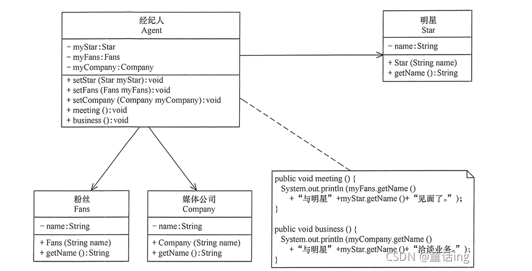
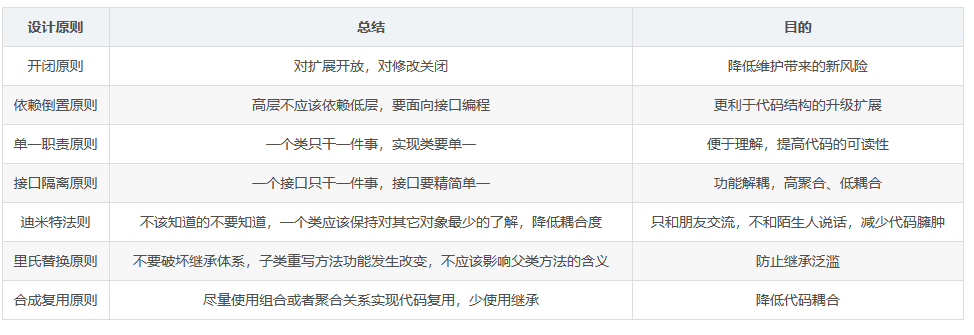
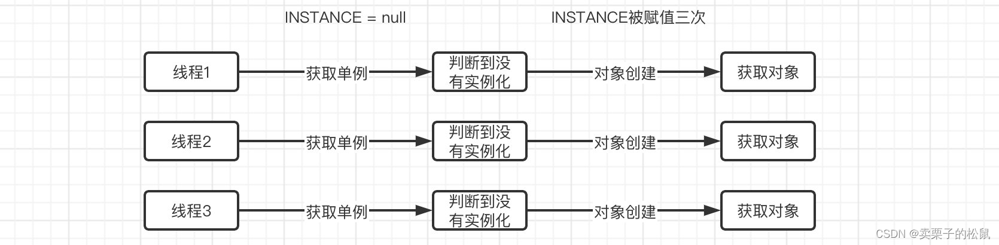
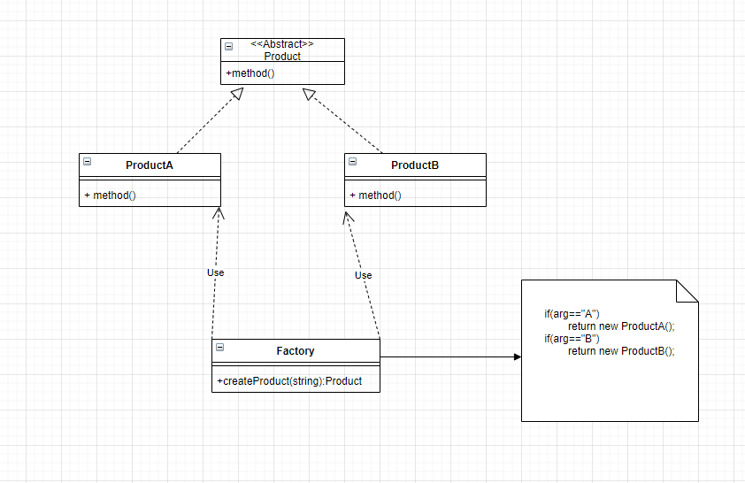
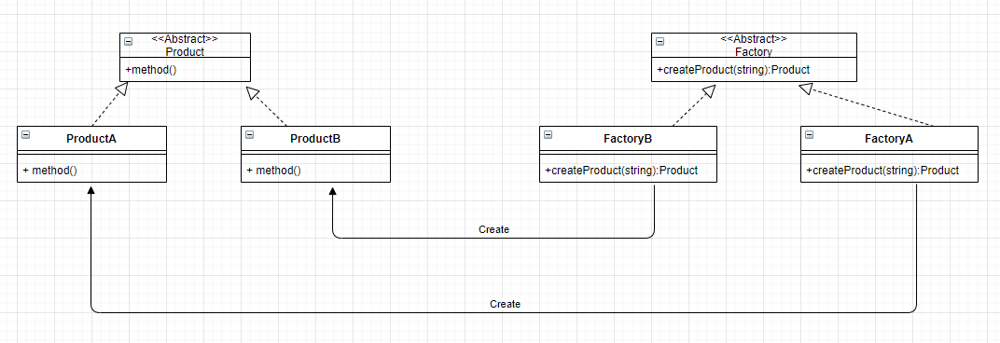

@[TOC](目录)

> 最近越发感到自己在程序设计方面的欠缺和不足，希望深入学习理解设计模式以改善自己在程序设计方面的不足。


## 1.设计模式的七大原则

> 我们在进行软件开发时，不仅仅需要将最基本的业务给完成，还要考虑整个项目的可维护性和可复用性，我们开发的项目不单单需要我们自己来维护，同时也需要其他的开发者一起来进行共同维护，因此我们在编写代码时，应该尽可能的规范。如果我们在编写代码时不注重这些问题，整个团队项目就像一座屎山，随着项目的不断扩大，整体结构只会越来越遭。
> 甚至到最后会离谱地发现，我们的程序居然是稳定运行在BUG之上的。

> 这 7 种设计原则是软件设计模式必须尽量遵循的原则，是设计模式的基础。在实际开发过程中，并不是一定要求所有代码都遵循设计原则，而是要综合考虑人力、时间、成本、质量，不刻意追求完美，要在适当的场景遵循设计原则。这体现的是一种平衡取舍，可以帮助我们设计出更加优雅的代码结构。

> 所以，为了尽可能避免这种情况的发生，先学习下面向对象七大设计原则。
### 1.单一职责原则
> **单一职责原则：一个类只负责一个功能领域中相应的职责，并且该职责被完整地封装在一个类中。**

> 就一个类而言，应该只专注于做一件事和仅有一个引起变化的原因，这就是所谓的单一职责原则。该原则提出了对对象职责的一种理想期望，对象不应该承担太多职责，正如人不应该一心分为二用。唯有专注，才能保证对象的高内聚；唯有单一，才能保证对象的细粒度。对象的高内聚与细粒度有利于对象的重用。一个庞大的对象承担了太多的职责，当客户端需要该对象的某一个职责时，就不得不将所有的职责都包含进来，从而造成冗余代码。

> 比如，现在有一个People类：

```csharp
 /// <summary>
    /// 一个人类
    /// </summary>
    public class People
    {
        /// <summary>
        /// 会写程序
        /// </summary>
        public void Coding()
        {
            Console.WriteLine("我会写代码");
        }

        /// <summary>
        /// 会打螺丝
        /// </summary>
        public void Working()
        {
            Console.WriteLine("我会打螺丝");
        }

        /// <summary>
        /// 会送外卖
        /// </summary>
        public void Riding()
        {
            Console.WriteLine("会送外卖");
        }
    }
```

> 可以看到，这个人类可以说是很全能的，能写程序、能会打螺丝，还会送外卖。可是，这个类是不是显得有点臃肿了。“闻道有先后，术业有专攻，如是而已”，不应该是程序员负责写代码，富士康的工人打螺丝，骑手送外卖吗？显然这个People类过于臃肿（而且根据开闭原则，扩展优于修改，当我们修改People类中的行为比如添加一个会开飞机的行为时，都需要从内部修改这个类而不是从外部去扩展比如增加一个会开飞机的飞行员类，这就违背了**扩展优于修改**的开闭原则）。

> 因此根据单一职责原则，我们需要进行更明确的划分，同种类型的操作我们一般才会放在一起：

```csharp
/// <summary>
    /// 程序员类
    /// </summary>
    public class Coder
    {
        /// <summary>
        /// 会写程序
        /// </summary>
        public void Coding()
        {
            Console.WriteLine("我会写代码");
        }
    }
    /// <summary>
    /// 工人类
    /// </summary>
    public class Worker
    {
        /// <summary>
        /// 会打螺丝
        /// </summary>
        public void Working()
        {
            Console.WriteLine("我会打螺丝");
        }
    }

    /// <summary>
    /// 骑手类
    /// </summary>
    public class Rider
    {
        /// <summary>
        /// 会送外卖
        /// </summary>
        public void Riding()
        {
            Console.WriteLine("会送外卖");
        }
    }
```

> **注意：单一职责同样也适用于方法。一个方法应该尽可能做好一件事情。如果一个方法处理的事情太多，其颗粒度会变得很粗，不利于重用。**

### 2.迪米特法则

> **迪米特法则：一个实体类应当尽量少的与其他实体类之间发生相互作用，使得系统功能模块相对独立。**

> 简单来说就是，一个类/者模块对其他的类/模块有越少的交互越好。当一个类发生改动，那么，与其相关的类（比如用到此类啥方法的类）需要尽可能少的受影响，这样我们在维护项目的时候会更加轻松一些。如果两个软件实体（类）无须直接通信，那么就不应当发生直接的相互调用，可以通过第三方转发该调用。其目的是降低类之间的耦合度，提高模块的相对独立性。

> 说白了，迪米特法则的核心思想就是降低耦合度。

> 例子：以明星和经纪人关系为例，明星由于全身心投入艺术，所以许多日常事务由经纪人负责处理，如与粉丝的见面会，与媒体公司的业务洽淡等。这里的经纪人是明星的朋友，而粉丝和媒体公司是陌生人，所以适合使用迪米特法则，其类图如图所示。



```csharp
namespace ConsoleApp3
{
    public class LoDtest
    {
        public static void Main(String[] args)
        {
            Agent agent = new Agent();
            agent.setStar(new Star("许嵩"));
            agent.setFans(new Fans("粉丝诗仙李白"));
            agent.setCompany(new Company("中国传媒有限公司"));
            agent.meeting();
            agent.business();
        }
    }
    //经纪人
    public class Agent
    {
        private Star myStar;
        private Fans myFans;
        private Company myCompany;
        public void setStar(Star myStar)
        {
            this.myStar = myStar;
        }
        public void setFans(Fans myFans)
        {
            this.myFans = myFans;
        }
        public void setCompany(Company myCompany)
        {
            this.myCompany = myCompany;
        }
        public void meeting()
        {
            Console.WriteLine(myFans.getName() + "与明星" + myStar.getName() + "见面了。");
        }
        public void business()
        {
            Console.WriteLine(myCompany.getName() + "与明星" + myStar.getName() + "洽淡业务。");
        }
    }

    /// <summary>
    /// 明星
    /// </summary>
    public class Star
    {
        private String name;
        public Star(String name)
        {
            this.name = name;
        }
        public String getName()
        {
            return name;
        }
    }

    /// <summary>
    /// 粉丝
    /// </summary>
    public class Fans
    {
        private String name;
        public Fans(String name)
        {
            this.name = name;
        }
        public String getName()
        {
            return name;
        }
    }

    /// <summary>
    /// 媒体公司
    /// </summary>
    public class Company
    {
        private String name;
        public Company(String name)
        {
            this.name = name;
        }
        public String getName()
        {
            return name;
        }
    }
}
```

### 3.里氏代换原则
> **里氏代换原则：所有引用基类的地方必须能透明地使用其子类的对象。**

> 简单的说就是，子类可以扩展父类的功能，但不能改变父类原有的功能。子类继承父类时，除添加新的方法完成新增功能外，尽量不要重写父类的方法。

> 总的来讲，里氏代换原则的定义可以总结为以下几点：
> 1. 子类可以实现父类的抽象方法，但不能覆盖父类的非抽象方法。
> 2. 子类可以增加自己特有的方法。
> 3. 当子类的方法重载父类的方法时，方法的前置条件（即方法的输入/入参）要比父类方法的输入参数更宽松。
> 4. 当子类的方法实现父类的方法时（重写/重载或实现抽象方法），方法的后置条件（即方法的输出/返回值）要比父类更严格或与父类一样。

> 比如我们下面的例子：

```csharp
 public abstract class Father
    {
        public void Coding()
        {
            Console.WriteLine("我会写代码");
        }
    }

    public class Child : Father
    {
        public void Gaming()
        {
            Console.WriteLine("我会打游戏");
        }
    }
```

> 可以看到Child类继承自抽象类Father，但是并没有对父类Father中的方法进行重写，而且还在父类的基础上进行了扩展，这符合里氏代换原则。

> 再来看下面一段代码：

```csharp
    public abstract class Father
    {
        public void Coding()
        {
            Console.WriteLine("我会写代码");
        }
    }

    public class Child : Father
    {
        public void Gaming()
        {
            Console.WriteLine("我会打游戏");
        }

        public new void Coding()//覆盖父类Father中的Coding方法
        {
            Console.WriteLine("我不想写代码了,我要躺平");
        }
    }
```

> 可以看到，现在我们对父类的方法进行了重写，显然，父类的行为已经被我们给覆盖了，这个子类已经不具备父类的原本的行为，很显然违背了里氏替换原则。

> 要是程序员连敲代码都不会了，还能叫做程序员吗？

> 所以，对于这种情况，我们不需要再继承自Father类了，我们可以提升一下，将此行为定义到People中：

```csharp
 public abstract class People
    {
        public abstract void Coding();
    }

    public class Father : People
    {
        public override void Coding()//重写父类People中的Coding方法
        {
            Console.WriteLine("我会写代码");
        }
    }

    public class Child : People
    {
        public void Gaming()
        {
            Console.WriteLine("我会打游戏");
        }

        public override void Coding()//覆盖父类Father中的Coding方法
        {
            Console.WriteLine("我不想写代码了,我要躺平");
        }
    }
```
### 4.依赖倒置原则
> **依赖倒转原则：针对接口编程，依赖于抽象而不依赖于具体。**

> 依赖倒置原则的目的是：通过要面向接口的编程来降低类间的耦合性，所以我们在实际编程中只要遵循下面几点，就能在项目中满足这个规则。
> 
> 1. 每个类尽量提供接口或抽象类，或者两者都具备。 
> 2. 变量的声明类型尽量是接口或者是抽象类。 
> 3. 任何类都不应该从具体类派生。
> 4. 使用继承时尽量遵循里氏替换原则。

> 代码举例： 
> 以顾客购物场景为例，假设今天，顾客想去万达买点东西，于是乎就有了下面代码：

```csharp
    public class Customer
    {
        public void Shopping(WanDaShop shop)
        {
            //购物
            Console.WriteLine(shop.sell());
        }
    }
```

> 第二天，顾客觉得万达东西太贵了，想换一家店购买，比如永辉超市，于是又修改代码为：

```csharp
    class Customer
    {
        public void shopping(YonghuiShop shop)
        {
            //购物
            System.out.println(shop.sell());
        }
    }
```

> 此时，缺点已经体现出来了，顾客每更换一家商店，都要修改一次代码，这明显违背了开闭原则。
> 存在以上缺点的原因是：顾客类设计时同具体的商店类绑定了，这违背了依赖倒置原则。解决方法是：定义“永辉超市”和“万达的”的共同接口Shop，顾客类面向该接口编程，其代码修改如下：

```csharp
    public interface IShop
    {
        void Sell();
    }
    class Customer
    {
        public void shopping(IShop shop)
        {
            //购物
            Console.WriteLine(shop.Sell());
        }
    }
```
### 5.接口隔离原则

> **接口隔离原则：要求程序员尽量将臃肿庞大的接口拆分成更小的和更具体的接口，让接口中只包含客户感兴趣的方法。。**

> 要为各个类建立它们需要的专用接口，而不要试图去建立一个很庞大的接口供所有依赖它的类去调用。使用多个隔离的接口，比使用单个接口要好，这是一个降低类之间的耦合度的意思，我们在定义接口的时候，一定要注意控制接口的粒度，比如下面的例子：

```csharp
using System;
namespace Application
{
    /// <summary>
    /// 电子设备的接口
    /// </summary>
    public interface IDevice
    {
        string GetCpu();//获得CPU信息
        string GetName();//获得名称
        string GetMemory();//获得内存
    }

    /// <summary>
    /// 电脑本身也是电子设备，我们继承自此接口
    /// </summary>
    public class Computer : IDevice
    {
        public string GetCpu()
        {
            return "AMD 6800h";
        }

        public string GetMemory()
        {
            return "16G+512G";
        }

        public string GetName()
        {
            return "Redmi Book Pro 14 2022锐龙版";
        }
    }

    /// <summary>
    /// 电风扇也是电子设备
    /// </summary>
    public class Fun : IDevice
    {
        public string GetCpu()
        {
            return null;//就一个破风扇，还需要Cpu? 呸
        }

        public string GetMemory()
        {
            return null;//风扇也不需要内存吧
        }

        public string GetName()
        {
            return "小破风扇";
        }
    }
}
```

> 可以看出来，上面的接口定义得有些问题，风扇Fun类继承了Idevice接口，可是风扇不需要Cpu和内存啊，也就是说，接口中的GetCpu和GetMemory方法对于风扇来讲有些多余了（风扇压根就不需要CPU和内存啊），因此根据接口隔离原则，我们需要把它分得更细一点：

```csharp
using System;
namespace Application
{
    /// <summary>
    /// 智能电子设备的接口
    /// </summary>
    public interface ISmartDevice
    {
        string GetCpu();//获得CPU信息
        string GetName();//获得名称
        string GetMemory();//获得内存
    }

    /// <summary>
    /// 普通电子设备的接口
    /// </summary>
    public interface INormalDevice
    {
        string GetName();//获得名称
    }

    public class Computer : ISmartDevice
    {
        public string GetCpu()
        {
            return "AMD 6800h";
        }

        public string GetMemory()
        {
            return "16G+512G";
        }

        public string GetName()
        {
            return "Redmi Book Pro 14 2022锐龙版";
        }
    }

    public class Fun : INormalDevice
    {
        public string GetName()
        {
            return "小破风扇";
        }
    }
}
```
### 6.开闭原则

> **开闭原则：一个软件实体应当对扩展开放，对修改关闭。**

> 这个原则核心理念在于“扩展优于修改”，在设计一个模块的时候，应当使这个模块可以在不被修改。

> 实际开发中，我们可以通过“抽象约束、封装变化”来实现开闭原则，即通过接口或者抽象类为软件实体定义一个相对稳定的抽象层，而将相同的可变因素封装在相同的具体实现类中。
### 7.合成复用原则
> 它要求在软件复用时，要尽量先使用组合或者聚合等关联关系来实现，其次才考虑使用继承关系来实现。

>  暂时不做多余阐述。
### 8.总结

## 2.创建型模式
> **创建型模式提供了创建对象的机制， 能够提升已有代码的灵活性和可复用性。**

> 创建型设计模式包括以下五种：
> 
> 1. 单例模式：让你能保证一个类只有一个实例，并提供一个访问该实例的全局节点。
> 2. 工厂模式：在父类中提供一个创建对象的接口以允许子类决定实例化对象的类型。
> 3. 抽象工厂模式：让你能创建一系列相关的对象，而无需指定其具体类。
> 4. 生成器模式（建造者模式）： 使你能够分步骤创建复杂对象。 该模式允许你使用相同的创建代码生成不同类型和形式的对象。
> 5. 原型模式：使你能够复制已有对象， 而又无需使代码依赖它们所属的类。
### 1.单例模式
> 单例模式的主要是确保一个类只有一个实例存在。如果你的代码能够访问单例类， 那它就能调用单例类的静态方法，无论何时调用该方法，它总是会返回相同的对象。

> 能解决的问题：
> 1. 保证一个类只有一个实例
> 为什么会有人想要控制一个类所拥有的实例数量？ 最常见的原因是控制某些共享资源 （例如数据库或文件） 的访问权限。它的运作方式是这样的： 如果你创建了一个对象， 同时过一会儿后你决定再创建一个新对象， 此时你会获得之前已创建的对象， 而不是一个新对象。**注意， 普通构造函数无法实现上述行为， 因为构造函数的设计决定了它**必须**总是返回一个新对象。**
> 2. 为该实例提供一个全局访问节点
> 和全局变量一样， 单例模式也允许在程序的任何地方访问特定对象，它可以保护该实例不被其他代码覆盖。


> 优点：
  >1. 可以保证一个类只有一个实例；
  >2. 获得了一个指向该实例的全局访问节点；
  >3. 仅在首次请求单例对象时对其进行初始化。

>缺点：
  >1. 违反了单一职责原则。
  >2. 单例模式可能掩盖不良设计， 比如程序各组件之间相互了解过多等。
  >3. 该模式在多线程环境下需要进行特殊处理， 避免多个线程多次创建单例对象。
>4. 单例的客户端代码单元测试可能会比较困难， 因为许多测试框架以基于继承的方式创建模拟对象。 由于单例类的构造函数是私有的， 而且绝大部分语言无法重写静态方法， 所以你需要想出仔细考虑模拟单例的方法。 要么干脆不编写测试代码， 或者不使用单例模式。

>使用场景
> 1. 如果程序中的某个类对于所有客户端只有一个可用的实例， 可以使用单例模式。
> 单例模式禁止通过除特殊构建方法以外的任何方式来创建自身类的对象。 该方法可以创建一个新对象， 但如果该对象已经被创建， 则返回已有的对象。
> 2. 如果你需要更加严格地控制全局变量，可以使用单例模式。
> 单例模式与全局变量不同， 它保证类只存在一个实例。 除了单例类自己以外， 无法通过任何方式替换缓存的实例。

> 实现步骤：
> 1. 将该类的构造函数设为私有，防止其他对象使用该单例类的new 运算符。
> 2. 建立当前类的一个静态成员变量，该变量用于保存创建的单例类对象。
> 3. 建立一个静态构建方法用于向外界提供当前类的实例，该方法是外界获取该单例对象的唯一方式。
> 4. 在客户端代码中， 将对单例的构造函数的调用替换为对其静态构建方法的调用。

> 代码实现：
> 根据实例化的时机不同，单例模式可以分为饿汉式和懒汉式：
> 
> 1. 饿汉式：在类加载的时候就进行实例化，代码实现如下：

```csharp
using System;
using System.Dynamic;
using System.Text;

namespace 单例模式
{
    public class Singleton
    {
        //1.将构造函数设为私有
        private Singleton()
        {

        }
        private static Singleton singleton = new Singleton();//2.建立当前类的一个静态成员变量;
        public static Singleton GetInstance()//3.建立一个静态构建方法用于向外界提供当前类的实例
        {
            return singleton;
        }
    }


    public class Client
    {
        public static void Main()
        {
            //4.在客户端类中，将对单例的构造函数的调用替换为对其静态构建方法的调用。
            Singleton s1 = Singleton.GetInstance(); 
            Singleton s2 = Singleton.GetInstance();

            if (s1 == s2)
            {
                Console.WriteLine("s1和s2是相同的两个对象");
            }
            else
            {
                Console.WriteLine("s1和s2不是相同的两个对象");
            }
        }
    }
}
```
> 输出结果：
```csharp
s1和s2是相同的两个对象
```

> 2. 懒汉式：在刚开始类加载的时候不进行实例化，在第一次使用的时候进行实例化。
> 代码实现如下：

```csharp
using System;
using System.Dynamic;
using System.Text;

namespace 单例模式
{
    public class Singleton
    {
        //1.将构造函数设为私有
        private Singleton() 
        {

        }
        //2.建立当前类的一个静态成员变量
        private static Singleton singleton;

        //3.建立一个静态构建方法用于向外界提供当前类的实例
        public static Singleton GetInstance()
        {
            if (singleton == null)
            {
                singleton = new Singleton();
            }
            return singleton;
        }
    }


    public class Client
    {
        public static void Main()
        {
            //4.在客户端类中，将对单例的构造函数的调用替换为对其静态构建方法的调用。
            Singleton s1 = Singleton.GetInstance();
            Singleton s2 = Singleton.GetInstance();

            if (s1 == s2)
            {
                Console.WriteLine("s1和s2是相同的两个对象");
            }
            else
            {
                Console.WriteLine("s1和s2不是相同的两个对象");
            }
        }
    }
}
```
> 输出结果：
```csharp
s1和s2是相同的两个对象
```

> 由于懒汉式是在方法中进行的初始化，在多线程环境下，可能会出现问题，可以试想一下，如果这个时候有多个线程同时调用了GetInstance()方法，那么会出现什么问题呢？
> 


> 可以看到，在多线程环境下，如果三条线程同时调用getInstance()方法，会同时进行INSTANCE ==
> null的判断，那么此时由于确实还没有进行任何实例化，所以导致三条线程全部判断为true（而饿汉式由于在类加载时就创建完成，不会存在这样的问题）此时问题就来了，我们既然要使用单例模式，那么肯定是只希望对象只被初始化一次的，但是现在由于多线程的机制，导致对象被多次创建。
> 所以，为了避免线程安全问题，针对于懒汉式单例，还需要做出一些代码方面的改进，才能避免线程安全问题。

> 可以使用lock锁来防止多线程同时调用GetInstance方法：

```csharp
using System;
using System.Dynamic;
using System.Text;

namespace 单例模式
{
    public class Singleton
    {
        //1.将构造函数设为私有
        private Singleton() 
        {

        }
        //2.建立当前类的一个静态成员变量
        private static Singleton singleton;

        private static readonly object _lock=new object();
        //3.建立一个静态构建方法用于向外界提供当前类的实例
        public static Singleton GetInstance()
        {
            if (singleton == null)
            {
                lock(_lock)
                {
                    singleton = new Singleton();
                }            
            }
            return singleton;
        }
    }


    public class Client
    {
        public static void Main()
        {
            //4.在客户端类中，将对单例的构造函数的调用替换为对其静态构建方法的调用。
            Singleton s1 = Singleton.GetInstance();
            Singleton s2 = Singleton.GetInstance();

            if (s1 == s2)
            {
                Console.WriteLine("s1和s2是相同的两个对象");
            }
            else
            {
                Console.WriteLine("s1和s2不是相同的两个对象");
            }
        }
    }
}
```


### 2.工厂方法模式
> 我们知道，如果需要创建一个对象，那么最简单的方式就是直接new一个即可。而工厂方法模式代替了传统的直接new的形式，那么为什么要替代传统的new形式呢？

> 可以想象一下，如果所有的对象我们都通过new的方式去创建，那么当我们的程序中大量使用此对象时，突然有一天这个对象的构造方法或是类名发生了修改，那我们岂不是得挨个去进行修改？根据迪米特法则，我们应该尽可能地少与其他类进行交互，所以我们可以将那些需要频繁出现的对象创建，封装到一个工厂类中，当我们需要对象时，直接调用工厂类中的工厂方法来为我们生成对象，这样，就算类出现了变动，我们也只需要修改工厂中的代码即可，而不是大面积地进行修改。

> 下面首先讲述简单工厂模式，再讲述工厂模式：
#### 1.简单工厂模式
> 简单工厂模式又称静态工厂方法模式，它属于类创建模式。在简单工厂模式中，可以根据参数的不同返回不同类的实例。简单工厂模式专门定义一个类来负责创建其他类的实例，被创建的实例通常都有共同的父类（这个父类一般是抽象类）。

> 简单举个例子：
> 我们都知道工厂是根据产品的图纸生产产品的，那简单工厂模式中，工厂类就是负责专门创建其他类实例的类，它称之为工厂类，它知道每一个产品，它决定哪一个产品类应该被实例化。

>优点：
 >实现对象的创建和对象的使用分离。创建呢，完全交给专门的工厂类负责，客户端程序员不需要关心怎么创建，只关心怎么使用。

>缺点：
 >简单工程类不够灵活，如果我们新增一个产品就要修改工厂类，就需要修改它的判断逻辑，如果产品很多的话，这个逻辑将会非常复杂。

 >怎么实现
 >

```csharp
namespace ConsoleApp4
{
    /// <summary>
    /// 抽象的产品类
    /// </summary>
    public abstract class Product
    {
        public abstract void Print();
    }
    /// <summary>
    /// 产品A类
    /// </summary>
    public class ProductA : Product
    {
        public override void Print()
        {
            Console.WriteLine("产品A");
        }
    }
    /// <summary>
    /// 产品B类
    /// </summary>
    public class ProductB : Product
    {
        public override void Print()
        {
            Console.WriteLine("产品B");
        }
    }
    /// <summary>
    /// 简单工厂类
    /// </summary>
    public class SimpleSingleton
    {
        public static Product createProduct(string arg)
        {
            if (arg == "A")
            {
                return new ProductA();
            }else
            {
                return new ProductB();
            }
        }
        public static void Main()
        {
           Product product = SimpleSingleton.createProduct("A");
            product.Print();
        }
    }    
}
```

> 不过这样还是有一些问题，我们前面提到了开闭原则，一个软件实体，比如类、模块和函数应该对扩展开放，对修改关闭，但是如果我们现在需要新增一种水果，比如桃子，那么这时我们就得去修改工厂提供的工厂方法了，但是这样是不太符合开闭原则的，因为工厂实际上是针对于调用方提供的，所以我们应该尽可能对修改关闭。

> 所以，我们就利用对扩展开放，对修改关闭的性质，将简单工厂模式改进为工厂方法模式，那现在既然不让修改，那么我们就看看如何去使用扩展的形式：下面就使用工厂模式来创建对象。
#### 2.工厂模式
> 工厂模式可以认为是简单工厂模式的升级版。它定义一个用于创建对象的接口，让子类决定实例化哪个类，工厂方法使一个类的实例化延迟到其子类。

> 在工厂模式中，之前简单工厂模式中的工厂变成了一个抽象接口，他负责给出工厂应该实现的方法，它不再负责所有产品的创建，而是将具体的产品创建工作交给子类去做，这样子就诞生了具体的子工厂，子工厂即子类，负责生成具体的产品对象，这样子就可以将产品类的实例化操作延迟到工厂子类中完成，即通过工厂子类来确定究竟应该实例化哪一个具体的实例类。在工厂模式中，如果要新增一个产品，不需要修改原有的工厂类逻辑，而是需要新增一个工厂。

>优点：
>1. 可以避免创建者和具体产品之间的紧密耦合。
>2. 单一职责原则。 你可以将产品创建代码放在程序的单一位置， 从而使得代码更容易维护。
>3. 开闭原则。 无需更改现有客户端代码， 你就可以在程序中引入新的产品类型。

>缺点：
> 1. 应用工厂方法模式需要引入许多新的子类， 代码可能会因此变得更复杂。 最好的情况是将该模式引入创建者类的现有层次结构中。

>实现步骤：
>

```csharp
namespace ConsoleApp4
{
    /// <summary>
    /// 产品接口
    /// </summary>
    public interface IProduct
    {
        public void Print();
    }
    public class ProductA : IProduct
    {
        public void Print()
        {
            Console.WriteLine("ProductA");
        }
    }

    public class ProductB : IProduct
    {
        public void Print()
        {
            Console.WriteLine("ProductB");
        }
    }

    public interface IFactory
    {
        IProduct CreateProduct();
    }

    public class ProductAFactory : IFactory
    {
        public IProduct CreateProduct()
        {
            return new ProductA();
        }
    }

    public class ProductBFactory : IFactory
    {
        public IProduct CreateProduct()
        {
            return new ProductB();
        }
    }

    public class Program
    {
        public static void Main()
        {
            IFactory factoryA = new ProductAFactory();
            IFactory factoryB = new ProductBFactory();
            IProduct productA = factoryA.CreateProduct();
            IProduct productB = factoryB.CreateProduct();
            productA.Print();
            productB.Print();
            Console.Read();
        }
    }
}
```

> 这样，我们就简单实现了工厂方法模式，通过工厂来屏蔽对象的创建细节，使用者只需要关心如何去使用对象即可。

>使用场景：
> 1. 当你在编写代码的过程中， 如果无法预知对象确切类别及其依赖关系时，可使用工厂方法。
> 工厂方法将创建产品的代码与实际使用产品的代码分离， 从而能在不影响其他代码的情况下扩展产品创建部分代码。
> 例如， 如果需要向应用中添加一种新产品， 你只需要开发新的创建者子类， 然后重写其工厂方法即可。
>2. 如果你希望用户能扩展你软件库或框架的内部组件，可使用工厂方法。
>3. 如果你希望复用现有对象来节省系统资源，而不是每次都重新创建对象，可使用工厂方法。
### 3.抽象工厂模式
> 抽象工厂模式是一种创建型设计模式， 它能创建一系列相关的对象， 而无需指定其具体类。

> 前面我们介绍了工厂方法模式，通过定义顶层抽象工厂类，通过继承的方式，针对于每一个产品都提供一个工厂类用于创建。
不过这种模式只适用于简单对象，当我们需要生产许多个产品族的时候，这种模式就有点乏力了，比如，有这样一个需求：某4S店需要订制一批普通轿车和SUV，针对低端客户准备以比亚迪为主，针对高端用户准备以保时捷为主，以后还可能订制其他品牌的车型；

> 这里我们就可以开始思考了，首先比亚迪和保时捷制造轿车和SUV是不会变的，变的是客户的需求，可能今天要比亚迪，明天又需要保时捷，后面又需要宝马、奔驰等汽车了。实际上这些产品都是成族出现的，比如比亚迪的生产线上有汉和宋两种产品，保时捷的产品线上有帕拉梅拉和卡宴两种产品，但是如果按照我们之前工厂方法模式来进行设计，那就需要单独设计4个工厂来生产上面这些产品，显然这样就比较浪费时间的。

> 但是现在有什么方法能够更好地处理这种情况呢？我们就可以使用抽象工厂模式，我们可以将多个产品，都放在一个工厂中进行生成，按不同的产品族进行划分，比如比亚迪，那么我就可以安排一个比亚迪工厂，而这个工厂里面就可以生产整条产品线上的内容，包括汉和宋等；比对于保时捷，那么我就可以安排一个保时捷工厂，而这个工厂里面就可以生产整条产品线上的内容，包括帕拉梅拉和卡宴等。代码如下：

```csharp
public interface ICar
{
     void ShowCarName();
}
public interface ISuv
{
    void ShowSuvName();
}
public class BYDCar : ICar
{
    public void ShowCarName()
    {
        Console.WriteLine("比亚迪-汉");
    }
}
public class BYDSuv : ISuv
{
    public void ShowSuvName()
    {
        Console.WriteLine("比亚迪-宋");
    }
}
public class PorscheCar : ICar
{
    public void ShowCarName()
    {
        Console.WriteLine("保时捷-帕拉梅拉");
    }
}
public class PorscheSuv : ISuv
{
    public void ShowSuvName()
    {
        Console.WriteLine("保时捷-卡宴");
    }
}
public interface IFactory
{
    ICar CreateCar();
    ISuv CreateSuv();
}
/// <summary>
/// 比亚迪工厂,将生产小汽车和SUV
/// </summary>
public class BYDFactory : IFactory
{
    public ICar CreateCar()
    {
        return new BYDCar();
    }

    public ISuv CreateSuv()
    {
        return new BYDSuv();
    }
}
/// <summary>
/// 保时捷工厂,将生产小汽车和SUV
/// </summary>
public class PorscheFactory : IFactory
{
    public ICar CreateCar()
    {
        return new PorscheCar();
    }

    public ISuv CreateSuv()
    {
        return new PorscheSuv();
    }
}

public class Client
{
    public static void Main()
    {
        //比亚迪工厂制作的小汽车和SUV
        IFactory bYDFactory = new BYDFactory();
        bYDFactory.CreateCar().ShowCarName();
        bYDFactory.CreateSuv().ShowSuvName();
        Console.WriteLine("-------------------");
        //保时捷工厂制作的小汽车和SUV
        IFactory porscheFactory = new PorscheFactory();
        porscheFactory.CreateCar().ShowCarName();
        porscheFactory.CreateSuv().ShowSuvName();
    }
}
```

输出结果：

```tex
比亚迪-汉
比亚迪-宋
-------------------
保时捷-帕拉梅拉
保时捷-卡宴
```

> 这样，假如后续4S店需要订制其他品牌的车型，我们就只需要抽象其他品牌的车辆工厂及对应的车辆即可。

> 一个工厂可以生产同一个产品族的所有产品，这样按族进行分类，显然比之前的工厂方法模式更好。

> 不过，缺点还是有的，如果产品族新增了产品，那么我就不得不去为每一个产品族的工厂都去添加新产品的生产方法，违背了开闭原则。
### 4.生成器模式
> 生成器模式使用多个简单的对象一步一步构建成一个复杂的对象。这种类型的设计模式属于创建型模式，它提供了一种创建对象的最佳方式。

> 一个 Builder 类会一步一步构造最终的对象。该 Builder 类是独立于其他对象的。

> 能解决的问题：
> 主要解决在软件系统中，有时候面临着"一个复杂对象"的创建工作，其通常由各个部分的子对象用一定的算法构成；由于需求的变化，这个复杂对象的各个部分经常面临着剧烈的变化，但是将它们组合在一起的算法却相对稳定。

> 使用场景：
>  一些基本部件不会变，而其组合经常变化的时候。


>应用举例：
>1. 去肯德基，汉堡、可乐、薯条、炸鸡翅等是不变的，而其组合是经常变化的，生成出所谓的"套餐"。 
>2. JAVA 中的 StringBuilder。

>优点：
>1. 建造者独立，易扩展。
>2. 便于控制细节风险。

> 缺点：
>1. 产品必须有共同点，范围有限制。
>2. 如内部变化复杂，会有很多的建造类。

> 使用场景：
>1. 需要生成的对象具有复杂的内部结构。
>2. 需要生成的对象内部属性本身相互依赖。

>注意：与工厂模式的区别是：建造者模式更加关注与零件装配的顺序。

> 代码如下：

```csharp
using System;
using System.Collections.Generic;

namespace StrategyPattern
{
    /// <summary>
    /// 抽象的Builder，ICarBuilder接口提供步骤的实现
    /// </summary>
    public interface ICarBuilder
    {
        void BuilderWheels();
        void BuilderWindows();
    }
    //普通汽车的Builder
    public class BasicBuilder : ICarBuilder
    {
        public void BuilderWheels()
        {
            Console.WriteLine("建造普通轮子");
        }

        public void BuilderWindows()
        {
            Console.WriteLine("建造普通窗子");
        }
    }
    //高级汽车的Builder
    public class AdvancedBuilder : ICarBuilder
    {
        public void BuilderWheels()
        {
            Console.WriteLine("建造高级轮子");
        }

        public void BuilderWindows()
        {
            Console.WriteLine("建造高级窗子");
        }
    }
    /// <summary>
    /// 创建汽车建造工厂，它使用Builder来创建不同种类的汽车
    /// </summary>
    public class CarFactory
    {
        public ICarBuilder Builder { get; set; }
        public CarFactory(ICarBuilder builder)
        {
            this.Builder = builder;
        }
        public void CreateCar()
        {
            Builder.BuilderWheels();
            Builder.BuilderWindows();
        }
    }
    /// <summary>
    /// 客户端类调用
    /// </summary>
    public class Client
    {
        public static void Main()
        {
            CarFactory carFactory = new CarFactory(new BasicBuilder());
            carFactory.CreateCar();
            carFactory.Builder = new AdvancedBuilder();
            carFactory.CreateCar();
            Console.ReadKey();
        }
    }
}
```

> 输出结果：

```tex
建造普通轮子
建造普通窗子
建造高级轮子
建造高级窗子
```
### 5.原型模式

> 原型模式其实就是从一个对象再创建另外一个可定制的对象，而且不需知道任何创建的细节,也就是说使你能够复制已有对象， 而又无需使代码依赖它们所属的类。

> 因为克隆比较常用，所以.NET在System命名空间中提供了ICloneable接口，其中就是唯一的一个方法Clone()；只需要实现这个接口就可以完成原型模式了。

> 关于引用拷贝、浅拷贝和深拷贝的区别：
> 引用拷贝：只复制对象的地址，并不会创建一个新的对象。
> 浅拷贝：浅拷贝会创建一个对象，并进行属性复制，但对于引用类型的属性，只会复制其对象地址。
> 深拷贝：深拷贝会完全复制整个对象，包括引用类型的属性。

> 浅拷贝代码举例：
```csharp
using System;

namespace PrototypePattern
{
    public class Person : ICloneable
    {
        private string _name="小明";
        public string Name
        {
            get { return _name; }
            set { _name = value; }
        }

        private string _sex="男";
        public string Sex
        {
            get { return _sex; }
            set { _sex = value; }
        }

        private int _age=18;
        public int Age
        {
            get { return _age; }
            set { _age = value; }
        }

        private List<string> _hobbies=new List<string>() { "唱歌","跳舞","做饭"};
        public List<string> Hobbies
        {
            get { return _hobbies; }
            set { _hobbies = value; }
        }

        public void Show()
        {
            string showHobbies = "";
            foreach (var item in Hobbies)
            {
                showHobbies += item.ToString();
            }
            Console.WriteLine("姓名:{0},性别:{1},年龄:{2},爱好:{3}", Name, Sex, Age, showHobbies);
        }
        //克隆信息
        public object Clone()
        {
            return (object)this.MemberwiseClone();//MemberwiseClone（）这个方法就是创建当前对象的浅表副本
        }
    }

    public class Client
    {
        public static void Main()
        {
            Person person1 = new Person();
            person1.Hobbies.Add("爬山");
            person1.Show();
            Person person2 = (Person)person1.Clone();//将person1的信息拷贝至person2上
            person2.Show();
        }
    }
}
```

> 输出结果：

```tex
姓名:小明,性别:男,年龄:18,爱好:唱歌跳舞做饭爬山
姓名:小明,性别:男,年龄:18,爱好:唱歌跳舞做饭爬山
```

> 上面Clone（）方法就是实现的接口的方法，用来克隆对象。 MemberwiseClone（）这个方法就是创建当前对象的浅表副本。

> 深拷贝代码针对上面代码进行修改：

```csharp
using System;

namespace PrototypePattern
{
    public class Person : ICloneable
    {
        private string _name="小明";
        public string Name
        {
            get { return _name; }
            set { _name = value; }
        }

        private string _sex="男";
        public string Sex
        {
            get { return _sex; }
            set { _sex = value; }
        }

        private int _age=18;
        public int Age
        {
            get { return _age; }
            set { _age = value; }
        }

        private List<string> _hobbies=new List<string>() { "唱歌","跳舞","做饭"};
        public List<string> Hobbies
        {
            get { return _hobbies; }
            set { _hobbies = value; }
        }

        public void Show()
        {
            string showHobbies = "";
            foreach (var item in Hobbies)
            {
                showHobbies += item.ToString();
            }
            Console.WriteLine("姓名:{0},性别:{1},年龄:{2},爱好:{3}", Name, Sex, Age, showHobbies);
        }
        //克隆信息
        public object Clone()
        {
            Person p= (Person)this.MemberwiseClone();//MemberwiseClone（）这个方法就是创建当前对象的浅表副本
            
            p.Hobbies = new List<string>();
            if (Hobbies != null)
            {
                foreach (var item in Hobbies)
                {
                    p.Hobbies.Add(item);
                }
            }
            return p;
        }
    }

    public class Client
    {
        public static void Main()
        {
            Person person1 = new Person();
            person1.Hobbies.Add("爬山");
            person1.Show();
            Person person2 = (Person)person1.Clone();//将person1的信息拷贝至person2上
            person2.Show();
        }
    }
}
```
输出结果：
```tex
姓名:小明,性别:男,年龄:18,爱好:唱歌跳舞做饭爬山
姓名:小明,性别:男,年龄:18,爱好:唱歌跳舞做饭爬山
```

> **注意：在C#中，string类型和数组也属于引用类型，而string类型比较特殊（具体可查资料），因此只需要手动克隆List类型的Hobbies属性即可实现深克隆。**

---
## 3.结构型设计模式

> **结构型设计模式关注如何将现有的类或对象组织在一起形成更加强大的结构，并同时保持结构的灵活和高效**。 结构型设计模式包括以下七种：
>1. 适配器模式：让接口不兼容的对象能够相互合作。
>2. 桥接模式：可将一个大类或一系列紧密相关的类拆分为抽象和实现两个独立的层次结构， 从而能在开发时分别使用。
>3. 组合模式：可以使用它将对象组合成树状结构， 并且能像使用独立对象一样使用它们。
>4. 装饰模式： 允许你通过将对象放入包含行为的特殊封装对象中来为原对象绑定新的行为。
>5. 观模式：能为程序库、 框架或其他复杂类提供一个简单的接口。
>6. 享元模式：摒弃了在每个对象中保存所有数据的方式， 通过共享多个对象所共有的相同状态， 让你能在有限的内存容量中载入更多对象。
>7. 代理模式：让你能够提供对象的替代品或其占位符。 代理控制着对于原对象的访问， 并允许在将请求提交给对象前后进行一些处理。

> 本篇文章学习一些常用的结构型设计模式：

### 1.适配器模式

> 适配器模式(Adapter)：将一个类的接口转换成为客户希望的另外一个接口。Adapter模式是的由于原本接口不兼容而不能一起工作的那些类可以一起工作。

> 适配器模式适合解决什么问题呢？ 简单来讲，就是需要的东西就在眼前，但却不能使用，而短时间又无法改造它，于是我们就想办法来适配它。

> 比如下面代码中，客户希望调用GetRequest方法，而我们目前只有Adaptee类中的GetSpecificRequest方法，因此需要做转换：表面上调用Request方法，而实际调用GetSpecificRequest方法，代码如下：

```csharp
using System;
namespace Application
{
    //客户所期待的接口
    public interface ITarget
    {
        string GetRequest();
    }

  //需要适配的类
    class Adaptee
    {
        public string GetSpecificRequest()
        {
            return "特殊请求";
        }
    }

    //通过在内部包装一个Adaptee对象，把源接口转化为目标接口
    class Adapter : ITarget
    {
        private readonly Adaptee _adaptee;
        public Adapter(Adaptee adaptee)
        {
            this._adaptee = adaptee;
        }
        public string GetRequest()
        {
            return $"这是 '{this._adaptee.GetSpecificRequest()}'";
        }
    }

    class Program
    {
       public static void Main(string[] args)
        {
            Adaptee adaptee = new Adaptee();
            ITarget target = new Adapter(adaptee);
            Console.WriteLine("适配器接口与客户端不兼容。");
            Console.WriteLine("但是通过适配器客户端可以调用它的方法。");
            Console.WriteLine(target.GetRequest());
        }
    }
}
```
输出结果：
```csharp
适配器接口与客户端不兼容。
但是通过适配器客户端可以调用它的方法。
这是 '特殊请求'
```
## 行为型设计模式
### 1.观察者模式

> 观察者模式是一种行为设计模式， 允许你定义一种订阅机制， 可在对象事件发生时通知多个 “观察” 该对象的其他对象。

> 使用场景：
>  1. 当一个对象状态的改变需要改变其他对象， 或实际对象是事先未知的或动态变化的时， 可使用观察者模式。当你使用图形用户界面类时通常会遇到一个问题。 比如， 你创建了自定义按钮类并允许客户端在按钮中注入自定义代码，这样当用户按下按钮时就会触发这些代码。 观察者模式允许任何实现了订阅者接口的对象订阅发布者对象的事件通知。 你可在按钮中添加订阅机制，允许客户端通过自定义订阅类注入自定义代码。
> 
> 2. 当应用中的一些对象必须观察其他对象时， 可使用该模式。 但仅能在有限时间内或特定情况下使用。订阅列表是动态的， 因此订阅者可随时加入或离开该列表。

> 代码举例：

```csharp
using System;
using System.Collections.Generic;
using System.Threading;

namespace RefactoringGuru.DesignPatterns.Observer.Conceptual
{
	public interface IObserver
	{
		/// <summary>
		/// 观察者做出相应处理
		/// </summary>
		/// <param name="subject"></param>
		void Update(ISubject subject);
	}

	public interface ISubject
	{
		/// <summary>
		/// 将一名观察者附加到对象上(即订阅)
		/// </summary>
		/// <param name="observer"></param>
		void Attach(IObserver observer);

		/// <summary>
		/// 将一名观察者从对象上移除(即取消订阅)
		/// </summary>
		/// <param name="observer"></param>
		void Detach(IObserver observer);

		/// <summary>
		/// 通知所有的观察者(即通知所有订阅的观察者)
		/// </summary>
		void Notify();
	}

	/// <summary>
	/// Subject类拥有一些重要的状态，并在状态发生变化时通知观察者。
	/// </summary>
	public class Subject : ISubject
	{
		private List<IObserver> _observers = new List<IObserver>();

		public void Attach(IObserver observer)
		{
			Console.WriteLine("订阅了一个");
			this._observers.Add(observer);
		}

		public void Detach(IObserver observer)
		{
			this._observers.Remove(observer);
			Console.WriteLine("取消订阅了一个");
		}

		/// <summary>
		/// 当发生变化时通知每个订阅此对象的观察者
		/// </summary>
		public void Notify()
		{
			Console.WriteLine("开始通知所有订阅此对象的观察者");

			foreach (var observer in _observers)
			{
				observer.Update(this);
			}
		}

		public void SomeBusinessLogic()
		{
			Console.WriteLine("\n业务逻辑");

			Thread.Sleep(15);

			Console.WriteLine("我的状态发生了变化，即将通知所有观察者" );
			this.Notify();
		}
	}

	class ConcreteObserverA : IObserver
	{
		public void Update(ISubject subject)
		{
			Console.WriteLine("观察者A做出变化");
		}
	}

	class ConcreteObserverB : IObserver
	{
		public void Update(ISubject subject)
		{
			Console.WriteLine("观察者B做出变化");
		}
	}

	class Program
	{
		static void Main(string[] args)
		{
			var subject = new Subject();
			var observerA = new ConcreteObserverA();
			subject.Attach(observerA);

			var observerB = new ConcreteObserverB();
			subject.Attach(observerB);

			subject.SomeBusinessLogic();
			subject.SomeBusinessLogic();

			subject.Detach(observerB);

			subject.SomeBusinessLogic();
		}
	}
}
```
运行结果：

```csharp
订阅了一个
订阅了一个

业务逻辑
我的状态发生了变化，即将通知所有观察者
开始通知所有订阅此对象的观察者
观察者A做出变化
观察者B做出变化

业务逻辑
我的状态发生了变化，即将通知所有观察者
开始通知所有订阅此对象的观察者
观察者A做出变化
观察者B做出变化
取消订阅了一个

业务逻辑
我的状态发生了变化，即将通知所有观察者
开始通知所有订阅此对象的观察者
观察者A做出变化
```


