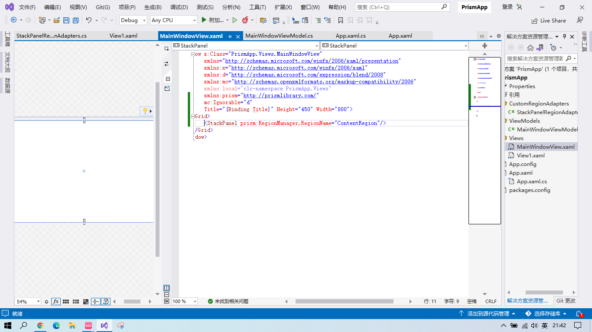
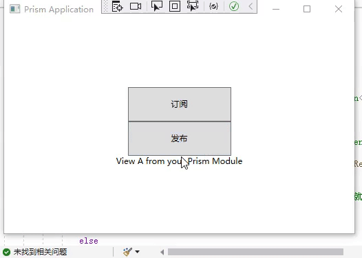
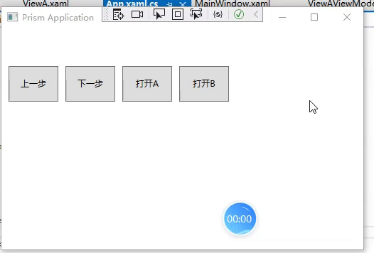

@[TOC](目录)

> Prism是WPF中一个比较知名的框架，简单记录下学习Prism框架过程中的一些知识点。


### 1.Prism的一些特点

> 在Prism当中，你可以遵循默认约定，即可自动将View/ViewModel建立DataContext的关系，同时默认支持多种容器依赖注入，其强大的模块化、导航功能能够将应用变得更加灵活自如。 Prism支持的一些功能：
>  - 通知BindableBase;
>  - 命令DelegateCommand;
>  - 聚合器IEventAggregator;
>  - 模块化；
>  - 容器；
>  - 依赖注入；
>  - 导航；
>  - 对话；

### 2.使用步骤

> 可在vs2022中快速创建Prism模板工程，
> 

### 3.什么是Region
> 1. Region作为Prism当中模块化的核心功能，其主要目的是弱化了模块与模块之间的耦合关系。在普遍的应用程序开发中，界面上的元素及内容往往被固定；而在Prism中，可以不再为其固定内容，从而有了区域的概念，现在将页面每个部分定于一个唯一区域（Region），那么在运行时，我们可以对每个区域动态设置内容。


>2. 使用区域管理器RegionManager来定义Region。<br>
> 定义Region的方式有两种，一种是在XAML界面指定，另一种是在代码中指定：
>  - XAML指定：RegionManager.RegionName；
>  - 代码中指定：RegionManager.SetRegionName；<br>
> RegionManager除了定义区域，还有以下功能：
>* 维护区域集合；
>  - 提供对区域的访问；
>  - 合成视图；
>  - 区域导航；
>  - 定义区域；

>3. 区域适配器RegionAdapter。实际上，Prism内置了几个区域适配器，所以我们在ContentControl当中定义区域，实际可以在任何元素上定义区域，如果定义的范围不在官方提供的默认适配器当中，则会引发异常。
> Prism内置的几个区域适配器：
>  - ContentControlRegionAdapter
>  - ItemsControlRegionAdapter
>  - SelectorRegionAdapter
>  - ComboBox 
>  - ListBox
>  - Ribbon
>  - TabControl
>  - ContentControl<br>
> 例如，StackPanel并不存在于官方默认自带的区域适配器,当我们强行用StackPanel作为区域适配器的时候，会报以下错误：



> 当然，我们也可以自定义一个区域适配器：比如，要给StackPanel新建一个适配器：需要新建一个名称为StackPanelRegionAdapters的类，并实现如下代码：

```csharp
using System;
using System.Collections.Generic;
using System.Linq;
using System.Text;
using System.Threading.Tasks;
using System.Windows;
using System.Windows.Controls;
using Prism.Regions;

namespace PrismApp.CustomRegionAdapters
{
    public class StackPanelRegionAdapters : RegionAdapterBase<StackPanel>
    {
        public StackPanelRegionAdapters(IRegionBehaviorFactory regionBehaviorFactory) : base(regionBehaviorFactory)
        {
        }

        /// <summary>
        /// 当在StackPanel中动态添加一些内容或子控件时，需要重写该Adapt函数
        /// </summary>
        /// <param name="region"></param>
        /// <param name="regionTarget"></param>
        protected override void Adapt(IRegion region, StackPanel regionTarget)
        {
            //当给StackPanel中动态添加一些内容或子控件时，CollectionChanged事件就会被触发
            region.Views.CollectionChanged += (s, e) =>
            {
                if (e.Action == System.Collections.Specialized.NotifyCollectionChangedAction.Add)//如果e.Action检测到是向StackPanel中添加内容或控件而不是移除
                {
                    foreach(FrameworkElement item in e.NewItems)//遍历所有新添加的内容或子控件，然后添加子元素进regionTarget；
                    {
                        regionTarget.Children.Add(item);
                    }
                }
            };
        }

        protected override IRegion CreateRegion()
        {
            return new Region();
        }
    }
}
```
> 然后在App.xaml.cs中，通过重写ConfigureRegionAdapterMappings方法初始化该区域适配器：
```csharp
using System;
using System.Collections.Generic;
using System.Configuration;
using System.Data;
using System.Linq;
using System.Threading.Tasks;
using System.Windows;
using System.Windows.Controls;
using Prism.DryIoc;
using Prism.Ioc;
using Prism.Regions;
using PrismApp.CustomRegionAdapters;
using PrismApp.Views;

namespace PrismApp
{
    /// <summary>
    /// App.xaml 的交互逻辑
    /// </summary>
    public partial class App : PrismApplication
    {
        /// <summary>
        /// 用来创建主窗体
        /// </summary>
        /// <returns></returns>
        protected override Window CreateShell()
        {
            return Container.Resolve<MainWindowView>();
        }

        /// <summary>
        /// 可以用来给容器中注册对象
        /// </summary>
        /// <param name="containerRegistry"></param>
        protected override void RegisterTypes(IContainerRegistry containerRegistry)
        {

        }

        /// <summary>
        /// 这段代码的作用：在Prism初始化的时候，把区域适配器添加进去，以便能加载自定义的区域适配器
        /// </summary>
        /// <param name="regionAdapterMappings"></param>
        protected override void ConfigureRegionAdapterMappings(RegionAdapterMappings regionAdapterMappings)
        {
            base.ConfigureRegionAdapterMappings(regionAdapterMappings);
            regionAdapterMappings.RegisterMapping(typeof(StackPanel), Container.Resolve<StackPanelRegionAdapters>());
        }
    }
}
```

> 此时再次运行程序，StackPanel区域适配器就可以用了，程序不再报错：
> 

### 4.BindableBase
> BindableBase抽象类实现了INotifyPropertyChanged接口，主要作用当绑定到界面的数据发生改变的时候可以通知界面进行更新。


```csharp
   private string _message;
        public string Message
        {
            get { return _message; }
            set { SetProperty(ref _message, value); }//这一行也可以写为 set { _message = value;RaisePropertyChanged(); }
        }
```
### 5.模块Module
#### 1.简介

> 本质上来说，对于一个应用程序而言，特定功能的所有View、Logic、Service等都可以独立存在，那么意味着每个独立的功能我们都可以称之为模块。
#### 2. 创建模块Module
> 创建Module实际上是将模块独立于类库存在，主程序通过加载类库添加模块，以下步骤：
> 
> 1. 创建Module：  模块实现IModule接口 ;
> 
>  2. 主程序配置模块目录， 配置方式： 
>     （代码方式）Code;  
>      （配置文件）App.config；
>      （磁盘目录）Disk/Directory；  
>      （XAML定义）XAML； 
>      （自定义)Custom;
#### 3.视图注入：
>  应用程序模块化后，每个子模块中的视图可以独立的进行依赖注入，再使用IRegionManager来实现页面导航。 步骤：
>  * 利用Region进行导航功能；
>  * 使用Module将应用程序模块化；
>  * 将独立模块的视图、服务使用注入到容器当中；
> 

>  如下，注册一个模块的流程：
>  
>  1. 右键单击解决方案，添加一个新项目
>  

> 2. 添加一个Prism Module项目
> 

> 3. 点击创建


> 4. 向项目中添加该Module的引用
> 

> 5. 在该ModuleAModule.cs文件中实现OnInitialized方法：
```csharp
public void OnInitialized(IContainerProvider containerProvider)
        {
            var regionManager = containerProvider.Resolve<RegionManager>();
            regionManager.RegisterViewWithRegion("ContentRegion", typeof(ViewA));
        }
```
> 如图：
> 

> 
> 6. 在项目的APP.xaml.cs代码中实现ConfigureModuleCatalog方法：

```csharp
 protected override void ConfigureModuleCatalog(IModuleCatalog moduleCatalog)
        {
            moduleCatalog.AddModule<ModuleA.ModuleAModule>();
        }
```

> 如图：
> 

> 此时，点击运行，ModuleA就会成功被加载
> 

### 6.MVVM
>1. Prism中的MVVM:

如上图，我们建立了这样两个文件夹，那么MainWindow.xaml如何和MainWindowViewModel.cs建立起联系呢？只需要在MainWindow.xaml中加入这样一行代码来实现自动建立View和ViewModel之间的联系（但是View和ViewModel两个文件的命名要符合规范）：
```xml
prism:ViewModelLocator.AutoWireViewModel="True"
```
> 如图：
> 

### 7.DelegateCommand命令、CompositeCommand复合命令
>1. DelegateCommand命令的使用
>


>2. CompositeCommand复合命令的使用
```xml
<Grid>
        <StackPanel Orientation="Vertical" VerticalAlignment="Center" HorizontalAlignment="Center">
            <Button Command="{Binding OpenAllCommand}" Width="150" Height="50"/>
            <TextBlock Text="{Binding Message}" HorizontalAlignment="Center" VerticalAlignment="Center" />
        </StackPanel>    
    </Grid>
```

```csharp
public class ViewAViewModel : BindableBase
    {
        private string _message;
        public string Message
        {
            get { return _message; }
            set { SetProperty(ref _message, value); }//此行也可以写为set { _message = value;RaisePropertyChanged(); }
        }

        public DelegateCommand btnCommand1 { get; set; }
        public DelegateCommand btnCommand2 { get; set; }
        public CompositeCommand OpenAllCommand { get; set; }//复合命令

        public ViewAViewModel()
        {
            Message = "View A from your Prism Module";
            btnCommand1 = new DelegateCommand(() =>
            {
                Message += "我是btnCommand1";
            });
            btnCommand2 = new DelegateCommand(() =>
            {
                Message += "我是btnCommand2";
            });
            OpenAllCommand = new CompositeCommand();//实例化复合命令类型的对象
            OpenAllCommand.RegisterCommand(btnCommand1);//把子命令btnCommand1注册到复合命令OpenAllCommand上去
            OpenAllCommand.RegisterCommand(btnCommand2);//把子命令btnCommand2注册到复合命令OpenAllCommand上去
        }
    }
```

> 运行结果：
> 

### 8.事件聚合器IEventAggregator
> IEventAggregator的作用：
>  - 松耦合基于事件通讯；
>  - 多个发布者和订阅者；
>  - 微弱的事件；
>  - 过滤事件；
>  - 传递参数；
>  - 取消订阅；
>  
>   该功能主要作用是：事件聚合器负责接收订阅以及发布消息。订阅者可以接收到发布者发送的内容，例如：AViewModel订阅了一个消息接收的事件，然后BViewModel当中指定该事件推送消息，此时AViewModel接受BViewModel推送的内容。
#### 1.普通的发布和订阅事件
> 点击“发布”按钮，再点击“订阅”按钮，再点击“发布按钮”，下边的文本框中就会出现“Hello”。 效果如下：
> 

> 步骤：
> 1. 先定义两个Button,一个用来发布事件，一个用来订阅事件，如图：


> 2. 在后台ViewModel中实现如下6个步骤：
```csharp
using System;
using System.Collections.Generic;
using System.Linq;
using System.Text;
using System.Threading.Tasks;
using Prism.Commands;
using Prism.Events;
using Prism.Mvvm;

namespace ModuleA.ViewModels
{
    public class MessageEvent1 : PubSubEvent<string> //1.实现一个类MessageEvent1（这个类的名字可以自定义）,该类必须继承自泛型类PubSubEvent<>
    { 

    }
    public class ViewAViewModel : BindableBase
    {
        private readonly IEventAggregator eventAggregator;//2.声明一个事件聚合器
        private string _message;
        public string Message
        {
            get { return _message; }
            set { SetProperty(ref _message, value); }//此行也可以写为set { _message = value;RaisePropertyChanged(); }
        }

        public DelegateCommand OpenCommand { get; set; }
        public DelegateCommand SendCommand { get; set; }
        public void OnMessageReceived(string message)//4.定义一个接收订阅事件后执行的方法
        {
            Message += message;
        }

        public ViewAViewModel(IEventAggregator eventAggregator)
        {
            this.eventAggregator = eventAggregator;//3.指定事件聚合器
            Message = "View A from your Prism Module";
            OpenCommand = new DelegateCommand(() =>
            {
                eventAggregator.GetEvent<MessageEvent1>().Subscribe(OnMessageReceived);//6.订阅一个事件,OnMessageReceived是订阅事件之后执行的方法
            });

            SendCommand = new DelegateCommand(() =>
            {
                eventAggregator.GetEvent<MessageEvent1>().Publish("Hello!");//5.发布一个事件，Publish后跟的是要发布的信息
            });
        }
    }
}

```
>如图：
>

#### 2.事件过滤器
```csharp
///事件过滤器public virtual SubscriptionToken Subscribe(Action<TPayload> action, ThreadOption threadOption, bool keepSubscriberReferenceAlive, Predicate<TPayload> filter)
                ///关于Subscribe的四个参数：
                ///1.actions:发布事件时执行的委托
                ///2.ThreadOption枚举：指定在哪个线程上接收委托回调
                ///3.keepSubscriberReferenceAlive布尔：如果为true，则Prism.Event.PubSubEvent保留对订阅者的引用因此它不会收集垃圾
                ///4.filter:进行筛选以评估订阅者是否应该接收事件
```
> 代码举例：
```csharp
using System;
using System.Collections.Generic;
using System.Linq;
using System.Text;
using System.Threading.Tasks;
using Prism.Commands;
using Prism.Events;
using Prism.Mvvm;

namespace ModuleA.ViewModels
{
    public class MessageEvent1 : PubSubEvent<string> //1.实现一个类MessageEvent1（这个类的名字可以自定义）,该类必须继承自泛型类PubSubEvent<>
    { 

    }
    public class ViewAViewModel : BindableBase
    {
        private readonly IEventAggregator eventAggregator;//2.声明一个事件聚合器
        private string _message;
        public string Message
        {
            get { return _message; }
            set { SetProperty(ref _message, value); }//此行也可以写为set { _message = value;RaisePropertyChanged(); }
        }

        public DelegateCommand OpenCommand { get; set; }
        public DelegateCommand SendCommand { get; set; }
        public void OnMessageReceived(string message)//4.定义一个接收订阅事件后执行的方法
        {
            Message += message;
        }

        public ViewAViewModel(IEventAggregator eventAggregator)
        {
            this.eventAggregator = eventAggregator;//3.指定事件聚合器
            Message = "View A from your Prism Module";
            OpenCommand = new DelegateCommand(() =>
            {
                ///事件过滤器public virtual SubscriptionToken Subscribe(Action<TPayload> action, ThreadOption threadOption, bool keepSubscriberReferenceAlive, Predicate<TPayload> filter)
                ///关于Subscribe的四个参数：
                ///1.actions:发布事件时执行的委托
                ///2.ThreadOption枚举：指定在哪个线程上接收委托回调
                ///3.keepSubscriberReferenceAlive布尔：如果为true，则Prism.Event.PubSubEvent保留对订阅者的引用因此它不会收集垃圾
                ///4.filter:进行筛选以评估订阅者是否应该接收事件
                eventAggregator.GetEvent<MessageEvent1>().Subscribe(OnMessageReceived, ThreadOption.PublisherThread, false, msg => 
                {
                   
                    if(msg.Equals("Hello"))///当接收到发布的字符串为Hello时，就同意接收；如果不是Hello就拒绝接收
                    {
                        return true;
                    }
                    else
                    {
                        return false;
                    }
                });//6.订阅一个事件,OnMessageReceived是订阅事件之后执行的方法
            });

            SendCommand = new DelegateCommand(() =>
            {
                eventAggregator.GetEvent<MessageEvent1>().Publish("Hello!");//5.发布一个事件，Publish后跟的是要发布的信息
            });
        }
    }
}
```
> 其他地方代码和上面“普通的发布和订阅事件”一样，效果如下： 点击“发布”按钮，然后点击“订阅”按钮，再点击“发布”按钮，没有显示消息


>3. 为注册的消息取消订阅Unsubscribe：
```csharp
 eventAggregator.GetEvent<MessageEvent1>().Unsubscribe(OnMessageReceived);//5取消一个事件，OnMessageReceived是一个方法名
```
### 9.导航Navigation
>1. [参考博客](https://www.cnblogs.com/zh7791/p/14140905.html)
>2. 先看一个效果（知识点都写在了代码注释里）：主界面中，点击"打开A"按钮就会在主界面下方区域显示A窗口同时该命令还会给窗口A传递一个值为Hello的参数，点击"打开B"按钮就会在主界面下方区域显示B窗口；

> 工程目录：

>MainWindow.xaml(MainWindow.xaml.cs里啥都没有)：


>ViewA.xaml（ViewA.xaml.cs里啥都没有）：
>

>ViewB.xaml（ViewB.xaml.cs里啥都没有）：
>

>App.xaml：
>

> App.xaml.cs:

```csharp
using System.Windows;
using BlankApp1.Views;
using Prism.Ioc;
using Prism.Modularity;

namespace BlankApp1
{
    /// <summary>
    /// Interaction logic for App.xaml
    /// </summary>
    public partial class App
    {
        protected override Window CreateShell()
        {
            return Container.Resolve<MainWindow>();
        }

        protected override void RegisterTypes(IContainerRegistry containerRegistry)
        {
            containerRegistry.RegisterForNavigation<ViewA>("PageA");//将ViewA注册为导航页面，并给ViewA起一个别名为PageA;
            containerRegistry.RegisterForNavigation<ViewB>();////将ViewB注册为导航页面
        }
        //protected override void ConfigureModuleCatalog(IModuleCatalog moduleCatalog)
        //{
        //    moduleCatalog.AddModule<ModuleA.ModuleAModule>();
        //}
    }
}
```

>ViewAViewModel.cs：
```csharp
using System;
using System.Collections.Generic;
using System.Linq;
using System.Text;
using System.Threading.Tasks;
using Prism.Mvvm;
using Prism.Regions;

namespace BlankApp1.ViewModels
{
    public class ViewAViewModel:BindableBase,INavigationAware
    {
        private string _title;
        public string Title
        {
            get { return _title; }
            set { _title = value;RaisePropertyChanged(); }
        }

        
        /// <summary>
        /// 判断该ViewAViewModel是否已经实例化，如果返回true则会创建一个新的实例
        /// </summary>
        /// <param name="navigationContext"></param>
        /// <returns></returns>
        public bool IsNavigationTarget(NavigationContext navigationContext)
        {
            return true;
        }

        /// <summary>
        /// 导航离开当前页时触发
        /// </summary>
        /// <param name="navigationContext"></param>
        public void OnNavigatedFrom(NavigationContext navigationContext)
        {
            
        }

        /// <summary>
        /// 导航完成前，接收用户传递的参数以及是否允许导航等控制
        /// </summary>
        /// <param name="navigationContext"></param>
        public void OnNavigatedTo(NavigationContext navigationContext)
        {
           Title= navigationContext.Parameters.GetValue<string>("Value");//拿到其他页面传递给此页面的参数Value,该Value被指定为String类型
        }
    }
}

```

>MainWindowViewModel.cs：
```csharp
using Prism.Commands;
using Prism.Mvvm;
using Prism.Regions;

namespace BlankApp1.ViewModels
{
    public class MainWindowViewModel : BindableBase
    {
        private string _title = "Prism Application";
        public string Title
        {
            get { return _title; }
            set { SetProperty(ref _title, value); }
        }

        private readonly IRegionManager regionManager;

        public DelegateCommand OpenACommand { get; set; }
        public DelegateCommand OpenBCommand { get; set; }
        public DelegateCommand GoBackCommand { get; set; }
        public DelegateCommand GoForwordCommand { get; set; }

        public MainWindowViewModel(IRegionManager regionManager)
        {
          
            OpenACommand = new DelegateCommand(OpenA);
            OpenBCommand = new DelegateCommand(OpenB);
            GoForwordCommand = new DelegateCommand(GoForward);
            GoBackCommand = new DelegateCommand(GoBack);
            this.regionManager = regionManager;

        }

        public void GoBack()
        {

        }
        public void GoForward()
        {

        }
        public void OpenA()
        {
            //NavigationParameters parm=new NavigationParameters();
            //parm.Add("Value", "Hello");//传递一个参数，名称为Value,Value的值为Hello
            /////导航到指定的区域管理器
            //regionManager.RequestNavigate("ContentRegion", "PageA",parm);//第1个参数是要在哪个区域显示，第2个参数是要显示的页面,第3个是要给参数2要显示的页面传递的参数

           //注：上面那3行的作用和下面这一行一样
            regionManager.RequestNavigate("ContentRegion", $"PageA?Value=Hello");//第1个参数是要在哪个区域显示，第2个参数$"PageA?Value=Hello"的作用是：要显示的页面为PageA,传递的一个Value参数值为Hello

        }

        public void OpenB()
        {
            ///导航到指定的区域管理器
            regionManager.RequestNavigate("ContentRegion", "ViewB");//第1个参数是要在哪个区域显示，第2个参数是要显示的页面
        }
    }
}
```
>3. 导航，通过区域导航日志IRegionNavigationJournal来实现上一页下一页功能：
代码较1中，只有MainWindowViewModel.cs发生了改变，如下：
效果：


>MainWindowViewModel.cs：
```csharp
using Prism.Commands;
using Prism.Mvvm;
using Prism.Regions;

namespace BlankApp1.ViewModels
{
    public class MainWindowViewModel : BindableBase
    {
        private string _title = "Prism Application";
        public string Title
        {
            get { return _title; }
            set { SetProperty(ref _title, value); }
        }

        private readonly IRegionManager regionManager;
        IRegionNavigationJournal journal;//区域导航日志

        public DelegateCommand OpenACommand { get; set; }
        public DelegateCommand OpenBCommand { get; set; }
        public DelegateCommand GoBackCommand { get; set; }
        public DelegateCommand GoForwordCommand { get; set; }

        public MainWindowViewModel(IRegionManager regionManager)
        {
          
            OpenACommand = new DelegateCommand(OpenA);
            OpenBCommand = new DelegateCommand(OpenB);
            GoForwordCommand = new DelegateCommand(GoForward);
            GoBackCommand = new DelegateCommand(GoBack);
            this.regionManager = regionManager;

        }

        public void GoBack()
        {
            journal.GoBack();//回到上一步的页面
        }
        public void GoForward()
        {
            journal.GoForward();//回到下一步的页面
        }
        public void OpenA()
        {
            //NavigationParameters parm=new NavigationParameters();
            //parm.Add("Value", "Hello");//传递一个参数，名称为Value,Value的值为Hello
            /////导航到指定的区域管理器
            //regionManager.RequestNavigate("ContentRegion", "PageA",parm);//第1个参数是要在哪个区域显示，第2个参数是要显示的页面,第3个是要给参数2要显示的页面传递的参数

           //注：上面那3行的作用和下面这一行一样
            regionManager.RequestNavigate("ContentRegion", $"PageA?Value=Hello", arg =>
            {
                journal = arg.Context.NavigationService.Journal;//导航日志
            });//第1个参数是要在哪个区域显示，第2个参数$"PageA?Value=Hello"的作用是：要显示的页面为PageA,传递的一个Value参数值为Hello

        }

        public void OpenB()
        {
            ///导航到指定的区域管理器
            regionManager.RequestNavigate("ContentRegion", "ViewB", arg =>
            {
                journal = arg.Context.NavigationService.Journal;
            });//第1个参数是要在哪个区域显示，第2个参数是要显示的页面
        }
    }
}
```
### 10.对话服务Dialog
#### 1.简介
>1. [参考博客](https://www.cnblogs.com/zh7791/p/14320463.html)
>2. 对话框实际上我们应用程序经常用到的一个功能，类如：Show、ShowDialog，可以弹出一个我们指定的窗口，仅此而已。
而Prism中提供了一组对话框，封装了常用的对话框组件的功能，例如：
> * RegisterDialog/DialogService(注册对话及使用对话)
>* 打开对话框传递参数/关闭对话框返回参数
>*  回调通知对话结果
#### 2.创建一个对话框
>创建并使用一个对话框的步骤举例：
实现效果：

工程目录如下：

> 1. 添加一个View，这里起名为MsgView
 
 2.添加一个ViewModel类，这里名为：MsgViewModel
```csharp
using System;
using System.Collections.Generic;
using System.Linq;
using System.Text;
using System.Threading.Tasks;
using Prism.Commands;
using Prism.Mvvm;
using Prism.Services.Dialogs;

namespace BlankApp1.ViewModels
{
    public class MsgViewModel : BindableBase,IDialogAware
    {
        public DelegateCommand saveCommand { get; set; }
        public DelegateCommand cancelCommand { get; set; }

        private string _title;
        public string Title
        {
            get { return _title; }
            set { _title = value;RaisePropertyChanged(); }
        }

        public event Action<IDialogResult> RequestClose;


        public MsgViewModel()
        {
            ///当单击“确定”按钮后，对话框返回的结果是ButtonResult.OK,并且会传出一个Value值,该值为Title的值
            saveCommand = new DelegateCommand(() =>
            {
                DialogParameters parm=new DialogParameters();
                parm.Add("Value",Title);
                RequestClose?.Invoke(new DialogResult(ButtonResult.OK, parm));
            });
            ///当单击“取消”按钮后，对话框返回的结果是ButtonResult.NO,不会传出任何值
            cancelCommand = new DelegateCommand(() =>
            {
                RequestClose?.Invoke(new DialogResult(ButtonResult.No));
            });
        }
            /// <summary>
            /// 允许关闭对话框
            /// </summary>
            /// <returns></returns>
            public bool CanCloseDialog()
        {
            return true;
        }

        public void OnDialogClosed()
        {
           
        }

        public void OnDialogOpened(IDialogParameters parameters)
        {
            var title=parameters.GetValue<string>("Value");//取出往该对话框中传入的参数Value
        }
    }
}

```
>3.进入App.xaml.cs的RegisterTypes方法中，将页面注册为对话框:
```csharp
  containerRegistry.RegisterDialog<MsgView, MsgViewModel>("question");//将MsgView注册对话框组件,并给MsgView起一个别名为question
```
>如图：

>4.修改MainWindowViewModel.cs中的内容，如下：
```csharp
using System.Windows;
using Prism.Commands;
using Prism.Mvvm;
using Prism.Regions;
using Prism.Services.Dialogs;

namespace BlankApp1.ViewModels
{
    public class MainWindowViewModel : BindableBase
    {
        private string _title = "Prism Application";
        public string Title
        {
            get { return _title; }
            set { SetProperty(ref _title, value); }
        }

        private readonly IRegionManager regionManager;
        IRegionNavigationJournal journal;//区域导航日志
        private readonly IDialogService dialog;//对话框服务

        public DelegateCommand OpenACommand { get; set; }
        public DelegateCommand OpenBCommand { get; set; }
        public DelegateCommand GoBackCommand { get; set; }
        public DelegateCommand GoForwordCommand { get; set; }

        public MainWindowViewModel(IRegionManager regionManager, IDialogService dialig)
        {
          
            OpenACommand = new DelegateCommand(OpenA);
            OpenBCommand = new DelegateCommand(OpenB);
            GoForwordCommand = new DelegateCommand(GoForward);
            GoBackCommand = new DelegateCommand(GoBack);
            this.regionManager = regionManager;
            this.dialog = dialig;
        }

        public void GoBack()
        {
            journal.GoBack();//回到上一步的页面
        }
        public void GoForward()
        {
            journal.GoForward();//回到下一步的页面
        }


        /// <summary>
        /// 当单击“打开A”按钮后，会弹出一个question类型的对话框，
        ///     如果用户关闭对话框时返回的结果是ButtonResult.OK，那么会取出用户在对话框中输入的内容并显示在一个消息框中；
        ///     如果返回的结果是ButtonResult.NO，那么会取出用户在对话框中输入的内容并显示在一个消息框中；
        /// </summary>
        public void OpenA()
        {
            
            DialogParameters param=new DialogParameters();
            dialog.ShowDialog("question", param, arg =>
            {
                if (arg.Result == ButtonResult.OK)
                {
                    var val = arg.Parameters.GetValue<string>("Value");
                    MessageBox.Show($"用户输入了:{val}");
                }
                else
                {
                    MessageBox.Show("用户取消了弹窗！");
                }
            });
            //NavigationParameters parm=new NavigationParameters();
            //parm.Add("Value", "Hello");//传递一个参数，名称为Value,Value的值为Hello
            /////导航到指定的区域管理器
            //regionManager.RequestNavigate("ContentRegion", "PageA",parm);//第1个参数是要在哪个区域显示，第2个参数是要显示的页面,第3个是要给参数2要显示的页面传递的参数

           //注：上面那3行的作用和下面这一行一样
            //regionManager.RequestNavigate("ContentRegion", $"PageA?Value=Hello", arg =>
            //{
            //    journal = arg.Context.NavigationService.Journal;//导航日志
            //});//第1个参数是要在哪个区域显示，第2个参数$"PageA?Value=Hello"的作用是：要显示的页面为PageA,传递的一个Value参数值为Hello

        }

        public void OpenB()
        {
            ///导航到指定的区域管理器
            regionManager.RequestNavigate("ContentRegion", "ViewB", arg =>
            {
                journal = arg.Context.NavigationService.Journal;
            });//第1个参数是要在哪个区域显示，第2个参数是要显示的页面
        }
    }
}
```

