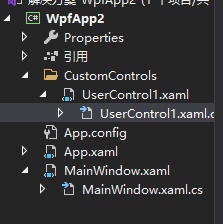
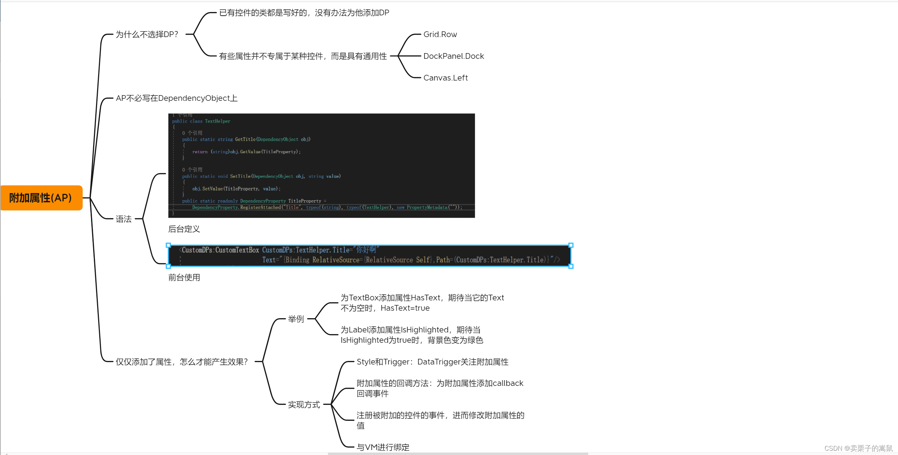
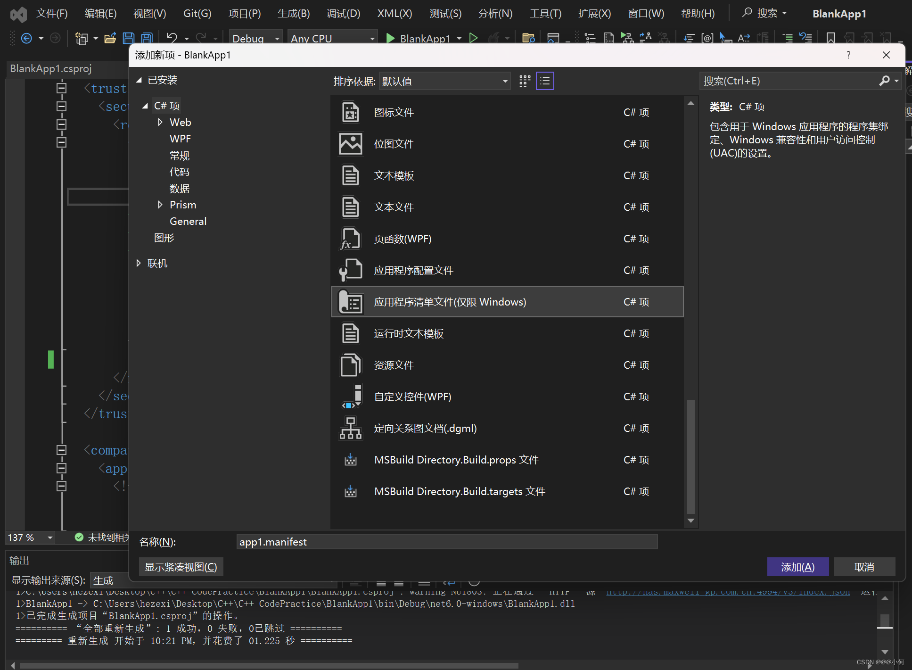
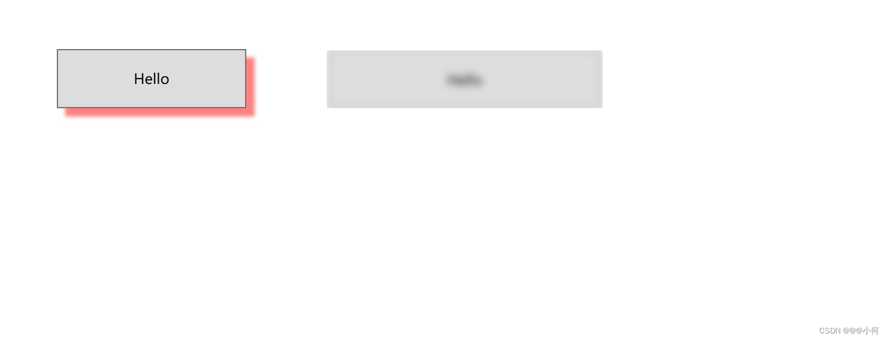
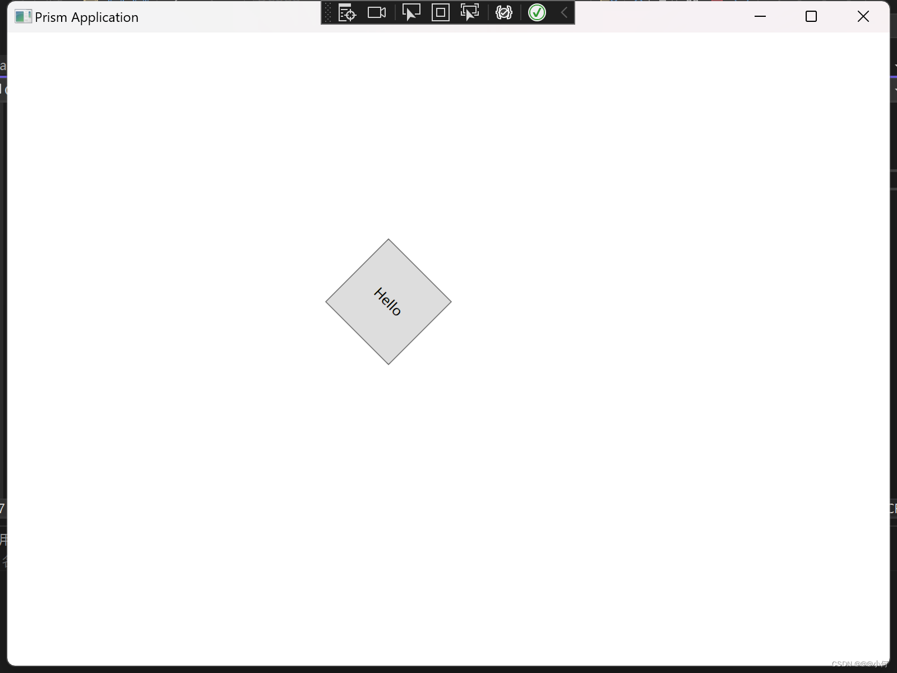
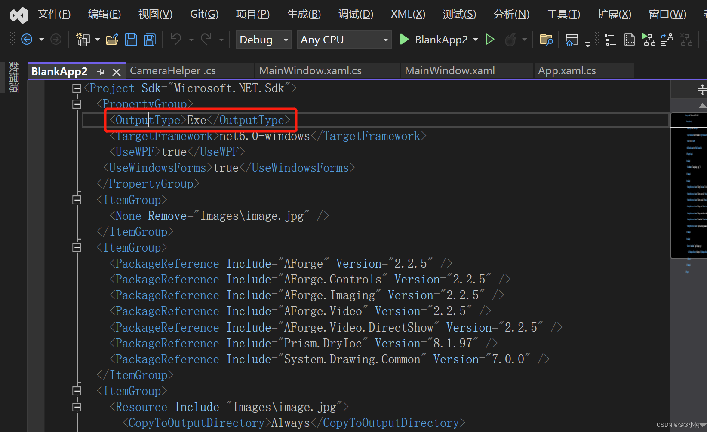

@[TOC](目录)

```bash
“书山有路勤为径，学海无涯苦作舟！”
记录平时学习以及工作中遇到的WPF知识点、问题，总结在此篇博客中，此篇博客会常常更新，不断修改或添加新的知识点。
希望能帮到自己的同时也能帮到他人。
```


### 1.Wpf中内置的控件
* 按钮：Button和RepeatButton。
* 数据显示：DataGrid、ListView、TreeView。
* 日期显示和选择：Calendar、DataPicker。
* 对话框:OpenFileDialog、PrintDIalog、SaveFileDialog。
* 数字墨迹：Incanvas、InkPresenter。
* 文档：DocumentViewer、FlowDocumentPageViewer、FlowDocumentPageReader、FlowDocumentScrollViewer、StickNoteControl。
* 输入：TextBox、RichTextBox、PasswordBox。
* 布局：Border、BulletDecorator、Canvas、DockPanel、Expander、Grid、GridSplitter 、GroupBox、Panel、ResizeGrip、Separator、ScrollBar、ScrollViewer、StackPanel、Thumb、Viewbox、VirtualizingStackPanel、Window、WrapPanel。
* 媒体：Image、MediaElenment、SoundplayerAction。
* 菜单：ContentMenu、Menu、ToolBar。
* 导航：Frame、Hyperlink、Page、NavigationWindow、TabControl。
* 选项：CheckBox、ComboBox、ListBox、RadioButton、Slider。
* 用户信息：AccessText、Label、Popup、ProgressBar、StatusBar、TextBlock、ToolTip。
### 2.Template模板
在WPF中有三种类型的模板,分别为为数据模板**DataTemplate** 、 控件模板**ControlTemplate**、面板模板**ItemsPanelTemplate**。
#### 1.ControlTemplate
ControlTemplate它决定了控件“长成什么样子”，并让开发者有机会在控件原有的内部逻辑基础上扩展自己的逻辑,它不仅能用于来定义控件的外观、样式, 还可通过控件模板的触发器(ControlTemplate.Triggers)修改控件的行为、响应动画等。
举例：
- 效果：

- 代码：
```xml
<Window.Resources>
        <ControlTemplate TargetType="Button" x:Key="ButtonTemplate">
            <!--定义视觉树-->
            <Grid>
                <Ellipse Name="faceEllipse" Width="{TemplateBinding Button.Width}" Height="{TemplateBinding Control.Height}"  Fill="{TemplateBinding Button.Background}"/>
                <TextBlock Name="txtBlock" Margin="{TemplateBinding Button.Padding}" VerticalAlignment="Center"  HorizontalAlignment="Center"  Text="{TemplateBinding Button.Content}" />
            </Grid>
            <!--定义触发器-->
            <ControlTemplate.Triggers>
                <Trigger Property="Button.IsMouseOver"  Value="True">
                    <Setter Property="Button.Foreground" Value="Red" />
                    <Setter Property="Button.FontSize" Value="25"/>
                </Trigger>
            </ControlTemplate.Triggers>
        </ControlTemplate>
    </Window.Resources>
    <UniformGrid Rows="2" Columns="2" Background="GreenYellow" Width="300" Height="300">
        <Button Content="One " Margin="1" Template="{StaticResource ButtonTemplate}"/>
        <Button Content="One " Margin="1" Template="{StaticResource ButtonTemplate}"/>
        <Button Content="One " Margin="1" Template="{StaticResource ButtonTemplate}"/>
        <Button Content="One " Margin="1" Template="{StaticResource ButtonTemplate}"/>
    </UniformGrid>
```
#### 2.数据模板（CellTemplate、ItemTemplate、ContentTemplate）
 1. 简介

- Grid这种列表表格中修改Cell的数据格式, CellTemplate可以修改单元格的展示数据的方式。
- 针对列表类型的控件, 例如树形控件，下拉列表，列表控件, 可以修改其中的ItemTemplate。
- 修改ContentTemplate, 例UserControl控件的数据展现形式。

 2. CellTemplate 模板
通过实现在DataGrid表格的列中添加按钮，来练习CellTemplate 模板的使用：
效果如图：

```xml
<DataGrid  Height="260" AutoGenerateColumns="False" IsReadOnly="True"  ItemsSource="{Binding Loglists}" SelectedItem="{Binding SelectedCurrent}">
                                                <DataGrid.Columns>
                                                    <DataGridTextColumn Width="80" Header="时间" Binding="{Binding Time}"/>
                                                    <DataGridTextColumn Width="80" Header="级别" Binding="{Binding Num}"/>
                                                    <DataGridTextColumn Width="80" Header="模块" Binding="{Binding Belong}"/>
                                                    <DataGridTextColumn Width="80" Header="消息" Binding="{Binding Message}"/>
                                                    <DataGridTextColumn Width="160" Header="线程ID" Binding="{Binding ID}"/>
                                                    <DataGridTemplateColumn Header="操作" Width="100" >
                                                        <DataGridTemplateColumn.CellTemplate>
                                                            <DataTemplate>
                                                                <StackPanel Orientation="Horizontal" VerticalAlignment="Center" HorizontalAlignment="Left">
                                                                    <Button Content="编辑"/>
                                                                    <Button Margin="8 0 0 0" Content="删除" />
                                                                </StackPanel>
                                                            </DataTemplate>
                                                        </DataGridTemplateColumn.CellTemplate>
                                                    </DataGridTemplateColumn>
                                                </DataGrid.Columns>
                                            </DataGrid>
```
3. ItemTemplate模板
通过实现在ComboBox和ListBox中绑定后台并设置DataTemplate ，来练习ItemTemplate模板的使用：
效果如下：

```xml
<Window.Resources>
        <DataTemplate x:Key="comTemplate">
            <StackPanel Orientation="Horizontal" Margin="5,0">
                <Border Width="10" Height="10" Background="{Binding Cl}"/>
                <TextBlock Text="{Binding Cl}" Margin="5,0"/>
            </StackPanel>
        </DataTemplate>
    </Window.Resources>
    <Grid>
        <Grid>
            <StackPanel Orientation="Horizontal" HorizontalAlignment="Center">
                <ComboBox Name="cob" Width="120" Height="30" ItemTemplate="{StaticResource comTemplate}"/>
                <ListBox Name="lib" Width="120" Height="100" Margin="5,0"  ItemTemplate="{StaticResource comTemplate}"/>
            </StackPanel>
        </Grid>
    </Grid>
```
```csharp
public class ShowColorModel
    {
        public string Cl { get; set; }
    }
```
```csharp
 List<ShowColorModel> ColorList = new List<ShowColorModel>();
            ColorList.Add(new ShowColorModel() { Cl= "#FF8C00" });
            ColorList.Add(new ShowColorModel() { Cl = "#FF7F50" });
            ColorList.Add(new ShowColorModel() { Cl = "#FF6EB4" });
            ColorList.Add(new ShowColorModel() { Cl = "#FF4500" });
            ColorList.Add(new ShowColorModel() { Cl = "#FF3030" });
            ColorList.Add(new ShowColorModel() { Cl = "#CD5B45" });

            cob.ItemsSource = ColorList;
            lib.ItemsSource = ColorList;
```
而DataTemplate是数据内容的展示方式，一条数据显示成什么样子，是简单的文本还是直观的图形就由它来决定了。
#### 3.面板模板ItemsPanelTemplate
ItemsPanelTemplate用于定义集合控件的容器外观，如ListBox,Combox 等等。

### 4.对话框
（1）**消息框MessageBox**，是一个对话框，用于快速显示信息并允许用户做出决策。
使用方法如代码所示：

```xml
    <Grid>
        <Button Width="100" Height="30" Content="Click me" Click="Button_Click"/>
    </Grid>
```

```csharp
    public partial class MainWindow : Window
    {
        public MainWindow()
        {
            InitializeComponent();
        }

        private void Button_Click(object sender, RoutedEventArgs e)
        {
            string messageBoxText = "是否要保存这些信息?";
            string caption = "文字处理";
            MessageBoxButton button = MessageBoxButton.YesNoCancel;//MessageBoxButton为MessageBox的按钮类型
            MessageBoxImage icon = MessageBoxImage.Warning;//MessageBoxImage为 MessageBox的图标类型
            MessageBoxResult result;// MessageBoxResult指定用户在消息框上单击的按钮

            result = MessageBox.Show(messageBoxText, caption, button, icon, MessageBoxResult.Yes);
            if (result == MessageBoxResult.Yes)
            {
                MessageBox.Show("点击了“是“");
            }
        }
    }
```
运行如图:

MessageBoxButton的属性：

MessageBoxImage的属性：

MessageBoxResult的属性：

（2）**通用对话框 Dialog**
示例：“打开文件”对话框:
使用方法如代码所示：
```xml
    <Grid>
        <Button Width="100" Height="30" Content="Click me" Click="Button_Click"/>
    </Grid>
```

```csharp
  public partial class MainWindow : Window
    {
        public MainWindow()
        {
            InitializeComponent();
        }

        private void Button_Click(object sender, RoutedEventArgs e)
        {
            // 打开一个文件对话框
            var dialog = new Microsoft.Win32.OpenFileDialog();//实例化一个打开文件的对话框
            dialog.FileName = "打开文件"; // 要打开文件的名称
            dialog.DefaultExt = ".txt"; // 获取或设置默认文件扩展名
            dialog.Filter = "文本文件(*.txt)|*.txt|所有文件(*.*)|*.*"; //获取或设置当前文件名筛选器字符串

            bool?result=dialog.ShowDialog();//显示该对话框（如果不调用该方法，则不会显示该对话框）,并用bool型的result接受该函数的返回结果
            // Process open file dialog box results
            if (result == true)
            {
                // Open document
                string filename = dialog.FileName;//获取要打开文件的名称
                MessageBox.Show("打开的文件名称为:"+filename);
            }
        }
    }
```
代码运行如图:

示例："保存文件"对话框:
使用方法如代码所示：
```xml
    <Grid>
        <Button Width="100" Height="30" Content="Click me" Click="Button_Click"/>
    </Grid>
```

```csharp
    public partial class MainWindow : Window
    {
        public MainWindow()
        {
            InitializeComponent();
        }

        private void Button_Click(object sender, RoutedEventArgs e)
        {
            
            var dialog = new Microsoft.Win32.SaveFileDialog();//实例化一个保存文件的对话框
            dialog.FileName = "Document"; // 要保存文件的名称
            dialog.DefaultExt = ".txt"; // 要保存文件的默认类型
            dialog.Filter = "Text documents (.txt)|*.txt"; //获取或设置当前文件名筛选器字符串

            // Show save file dialog box
            bool? result = dialog.ShowDialog();//显示该对话框（如果不调用该方法，则不会显示该对话框）,并用bool型的result接受该函数的返回结果

            // Process save file dialog box results
            if (result == true)
            {
                // Save document
                string filename = dialog.FileName;//获取要保存文件的名称
                MessageBox.Show("保存的文件名称为:" + filename);
            }

        }
    }
```
代码运行如图：

示例：“打印”对话框:
使用方法如代码所示：

```xml
    <Grid>
        <Button Width="100" Height="30" Content="Click me" Click="Button_Click"/>
    </Grid>
```
```csharp
            var dialog = new System.Windows.Controls.PrintDialog();//实例化一个打印文件的对话框
            dialog.PageRangeSelection = System.Windows.Controls.PageRangeSelection.AllPages;
            dialog.UserPageRangeEnabled = true;
            bool? result = dialog.ShowDialog();
```
代码运行如图：


### 5.ContentPresenter
ContentPresenter是一个基础控件，其他的控件可以继承他，主要作用是实现内容的显示，可以是任何内容。
### 6.画刷
* LinearGradientBrush是线性渐变画刷。
* SolidColorBrush 是纯色画刷。
* RadialGradientBrush是径向渐变画刷。
* ImageBrush是图片画刷。
* GradientBrush是渐变画刷。

#### 1.LinearGradientBrush
示例如下：

```xml
    <Grid>
        <Grid.RowDefinitions>
            <RowDefinition/>
            <RowDefinition/>
        </Grid.RowDefinitions>
        <Grid Grid.Row="0">
            <Grid.Background>
                <LinearGradientBrush EndPoint="0,1" StartPoint="0,0">
                    <GradientStop Color="#FFF6F6F6"/>
                    <GradientStop Color="#FFF9F96A" Offset="0.569"/>
                    <GradientStop Color="#FFDCD9D9" Offset="0.8"/>
                    <GradientStop Color="#FFDA5454" Offset="1"/>
                </LinearGradientBrush>
            </Grid.Background>
        </Grid>
    </Grid>
```
效果：

### 7.路由事件
（1）Button中有个click事件，该事件就是定义好的路由事件。
（2）路由事件和依赖属性一样，也需要注册，使用 EventManager.RegisterRoutedEvent方法来注册路由事件。
（3）自定义一个路由事件的例子：

 1. 首先添加一个用户控件，名为UserControl1，如图：

以下代码中包含前三个步骤，
```csharp
using System;
using System.Collections.Generic;
using System.Linq;
using System.Text;
using System.Threading.Tasks;
using System.Windows;
using System.Windows.Controls;
using System.Windows.Data;
using System.Windows.Documents;
using System.Windows.Input;
using System.Windows.Media;
using System.Windows.Media.Imaging;
using System.Windows.Navigation;
using System.Windows.Shapes;

namespace WpfApp2.CustomControls
{
    /// <summary>
    /// UserControl1.xaml 的交互逻辑
    /// </summary>
    public partial class UserControl1 : UserControl
    {
        public UserControl1()
        {
            InitializeComponent();
        }
        //1.声明并注册路由事件，并使用冒泡策略
            //
            // 摘要:
            //     向WPF事件系统注册新的路由事件。
            // public static RoutedEvent RegisterRoutedEvent(string name, RoutingStrategy routingStrategy, Type handlerType, Type ownerType);
            //
            // 参数:
            //   name:
            //     路由事件的名称。 该名称在所有者类型中必须是唯一的，并且不能为 null 或空字符串。
            //
            //   routingStrategy:
            //     作为枚举值的事件的路由策略。
            //
            //   handlerType:
            //     事件处理程序的类型。 该类型必须为委托类型，并且不能为 null。
            //
            //   ownerType:
            //     路由事件的所有者类类型。 该类型不能为 null。
            //
            // 返回结果:
            //     新注册的路由事件的标识符。 现在可将该标识符对象存储为类中的静态字段，然后将其用作将处理程序附加到事件的方法的参数。 路由事件标识符也用于其他事件系统 API。
        public static readonly RoutedEvent MyRoutedEvent = EventManager.RegisterRoutedEvent("MyRoutedEventHandler", RoutingStrategy.Bubble, typeof(RoutedEventHandler), typeof(UserControl1));

        //2、通过.NET事件包装路由事件
        public event RoutedEventHandler MyRoutedEventHandler
        {
            add
            {
                AddHandler(MyRoutedEvent, value);
            }
            remove
            {
                RemoveHandler(MyRoutedEvent, value);
            }
        }

        //3、使用按钮的单击事件激发路由事件
        private void Btn_Test_Click(object sender, RoutedEventArgs e)
        {
            RoutedEventArgs arg = new RoutedEventArgs();
            arg.RoutedEvent = MyRoutedEvent;
            RaiseEvent(arg);
        }
    }
}

```
到目前为止，路由事件的准备工作已经完成，接下里开始最后一个步骤：调用该用户控件，并实现路由事件即可。
```csharp
    <Grid>
        <!--在MainWindow.xaml文件中引入自定义的UserControl1用户控件-->
        <CustomControls:UserControl1 MyRoutedEventHandler="UserControl1_MyRoutedEventHandler" HorizontalAlignment="Center" Height="100"  VerticalAlignment="Center" Width="100"/>
    </Grid>
```
最后在MainWindow.xaml.cs文件中实现该路由事件的具体功能即可：

```csharp
        private void UserControl1_MyRoutedEventHandler(object sender, RoutedEventArgs e) //路由事件具体实现(当单击Test按钮后就会触发这个路由事件)
        {
            MessageBox.Show("Hello:" + e.Source.ToString());
        }
```
运行结果如图：

单击Test按钮后，会弹出右边的那个对话框，成功实现单击Test按钮触发自定义的路由事件。
### 8.依赖属性



#### 1.先看一个例子
先举个例子，在WPF中如果我们自定义了一个叫ButtonExpand的用户控件，该控件继承自按钮Button类，这时我们想向ButtonExpand控件中添加一张背景图Image类以实现背景图效果，而Button类中没有这个Image属性，我们就可以在这时注册一个依赖项属性，此时该控件就有了这个新的属性，在前台xaml文件中我们就可以直接使用这个新的属性。
一个简短的例子来注册并使用依赖属性：

 1. 首先建立一个用户控件StreamingStatusButton，用于自定义控件外观：


 2. 其次在StreamingStatusButton.xaml文件中实现代码（那个ImageSource属性是即将要注册的依赖属性）：

```xml
<UserControl x:Class="WpfApp1.customcontrols.StreamingStatusButton"
             xmlns="http://schemas.microsoft.com/winfx/2006/xaml/presentation"
             xmlns:x="http://schemas.microsoft.com/winfx/2006/xaml"
             xmlns:mc="http://schemas.openxmlformats.org/markup-compatibility/2006" 
             xmlns:d="http://schemas.microsoft.com/expression/blend/2008" 
             xmlns:local="clr-namespace:WpfApp1.customcontrols"
             mc:Ignorable="d" x:Name="this">

    <UserControl.Resources>
        <Style x:Key="btnStyle" TargetType="Button">
            <Style.Triggers>
                <Trigger Property="IsMouseOver" Value="True">
                    <Setter Property="RenderTransform">
                        <Setter.Value>
                            <ScaleTransform ScaleX="1.2" ScaleY="1.2"/>
                            <!--ScaleTransform表示缩放;ScaleX表示X轴缩小值，正常为1;ScaleY表示Y轴缩小值，正常为1 -->
                        </Setter.Value>
                    </Setter>
                </Trigger>
            </Style.Triggers>
        </Style>
    </UserControl.Resources>
    <Grid>
        <Button Background="Transparent" BorderThickness="0" Style="{StaticResource btnStyle}">
            <Border x:Name="border" Background="Transparent" CornerRadius="10" RenderTransformOrigin="0.5,0.5" Height="27" Width="27" BorderThickness="1">
                <Rectangle StrokeThickness="2" Stretch="Uniform">
                    <Rectangle.Fill>
                        <ImageBrush ImageSource="{Binding ImageSource,ElementName=this}"/>
                    </Rectangle.Fill>
                </Rectangle>
            </Border>
        </Button>

    </Grid>
</UserControl>

```
其次在StreamingStatusButton.xaml.cs后台文件中注册ImageSource依赖属性：

```csharp
using System;
using System.Collections.Generic;
using System.Linq;
using System.Text;
using System.Threading.Tasks;
using System.Windows;
using System.Windows.Controls;
using System.Windows.Data;
using System.Windows.Documents;
using System.Windows.Input;
using System.Windows.Media;
using System.Windows.Media.Imaging;
using System.Windows.Navigation;
using System.Windows.Shapes;

namespace WpfApp1.customcontrols
{
    /// <summary>
    /// StreamingStatusButton.xaml 的交互逻辑
    /// </summary>
    public partial class StreamingStatusButton : UserControl
    {
        public StreamingStatusButton()
        {
            InitializeComponent();
        }

        //注册依赖属性（快捷键：输入propdp,连续按两次tab键即可快捷注册依赖属性）
        public Uri ImageSource
        {
            get { return (Uri)GetValue(ImageSourceProperty); }
            set { SetValue(ImageSourceProperty, value); }
        }
        // Using a DependencyProperty as the backing store for ImageSource.  This enables animation, styling, binding, etc...
        public static readonly DependencyProperty ImageSourceProperty =
            DependencyProperty.Register("ImageSource", typeof(Uri), typeof(StreamingStatusButton));
    }
}

```
 1. 然后在MainWindow.xaml文件中引入该自定义控件，并给刚才注册的ImageSource依赖属性赋值即可。
```xml
<customcontrols:StreamingStatusButton  ImageSource="assets/s1.png" />
```
#### 2.WPF为什么需要依赖属性
以上是一个使用依赖属性的简单例子，那么WPF为什么需要依赖属性？

 WPF的设计理念是：数据驱动，UI与逻辑松耦合。

1. 什么是依赖属性？
依赖属性是一种可以自已没有值，但是可以通过Binding方式，从数据源（依赖别人的数据）获得值的属性。

2. 为什么要有依赖属性
传统的CLR属性：

```csharp
public class Person
{
    private string _Name;
    public string Name
    {
        get
        {
             return _Name;
         }
         set
         {
            _Name = value;
         }
     }
 }
```
CLR属性存在的问题：

在多继承的情况下，每次继承，父类的字段都被继承，孙孙辈对象占用内存空间不可避免的膨胀。

3. 如何添加依赖属性？
在多继承，大多数字段并没有被修改的情况下，如何少对象的体积。
数据驱动指导思想下，数据如何保存简单一致，同步

```csharp
// 1. 使类型继承DependencyObject类
    public class Person : DependencyObject
    {
        // 2. 声明一个静态只读的DependencyProperty 字段
        public static readonly DependencyProperty nameProperty;
        static Person()
        {
            // 3. 注册定义的依赖属性
            nameProperty = DependencyProperty.Register("Name", typeof(string), typeof(Person), 
                new PropertyMetadata("Learning Hard",OnValueChanged)); 
        }
        // 4. 属性包装器，通过它来读取和设置我们刚才注册的依赖属性
        public string Name
        {
            get { return (string)GetValue(nameProperty); }
            set { SetValue(nameProperty, value); }
        }
        private static void OnValueChanged(DependencyObject dpobj, DependencyPropertyChangedEventArgs e)
        {
            // 当只发生改变时回调的方法
        }
    }
```
4. 依赖属性的优势：
* 解决多继承，且大多数字段值不改变的情况下，减少内存占比
将一个DependencyProperty对象存储在一个全局的Hashtable中；通过依赖对象(DependencyObject)的GetValue和SetValue存取数据；

* 以数据为中心，当数据源改变时，所以关联的UI数据改变
依赖属性值可以通过Binding依赖于其它对象上，这就使得数据源一变动；依赖于此数据源的依赖属性全部进行更新
#### 3.什么时候需要定义依赖属性？
* 希望支持动态资源引用

* 希望支持动画

* 希望支持数据绑定

* 希望支持属性值继承

* 希望该属性发生改变时触发一系列的行为

* 希望该属性有自己的元数据

* 希望在样式中使用该属性

* 希望得到WPF样式器的支持，比如在wpf窗口中直接修改该属性

### 9.命令Command
一个简单地创建一些Command命令的例子：
 2. 如下图，在Base文件中，创建一个CommandBase类，该类存放了command命令的初始化工作


CommandBase.cs代码如下：

```csharp
using System;
using System.Collections.Generic;
using System.Linq;
using System.Text;
using System.Threading.Tasks;
using System.Windows.Input;

namespace WpfApp1.Base
{
   public class CommandBase:ICommand //继承自ICommand接口
    {
       // 当出现影响是否应执行该命令的更改时发生。
        public event EventHandler CanExecuteChanged;

        //
        // 摘要:
        //     定义确定此命令是否可在其当前状态下执行的方法。
        //
        // 参数:
        //   parameter:
        //     此命令使用的数据。 如果此命令不需要传递数据，则该对象可以设置为 null。
        //
        // 返回结果:
        //     如果可执行此命令，则为 true；否则为 false。
        public bool CanExecute(object parameter)
        {
            return true;
        }

        //
        // 摘要:
        //     定义在调用此命令时要调用的方法。
        //
        // 参数:
        //   parameter:
        //     此命令使用的数据。 如果此命令不需要传递数据，则该对象可以设置为 null。
        public void Execute(object parameter)
        {
            DoExecute?.Invoke();
        }

        public Action DoExecute { get; set; }

        public CommandBase(Action doExecute)
        {
            this.DoExecute = doExecute;
        }
    }
}

```
2. 在ViewModels文件夹下，有一个MainViewModel类，该类存放了主界面MainWindow的一些需要绑定的数据和命令。该类代码如下：

```csharp

//这个类存放了MainWindow界面中一些Command命令的定义


using System;
using System.Collections.Generic;
using System.Linq;
using System.Text;
using System.Threading.Tasks;
using WpfApp1.Base;
using System.Windows.Input;
using System.Windows;

namespace WpfApp1.ViewModels
{
   public class MainViewModel
    {
        public ICommand btnSearchCommand { get; set; }
        public ICommand btnContactCommand { get; set; }
        public MainViewModel()
        {
           
            //“搜索按钮”的命令
            btnSearchCommand = new CommandBase(() =>
            {
                string messageBoxText = "搜索失败";
                string caption = "搜索";
                MessageBox.Show(messageBoxText, caption);
            });

            //“联系我们按钮”的命令
            btnContactCommand = new CommandBase(() =>
            {
                string messageBoxText = "我们的客服电话是：1234567890";
                string caption = "联系我们";
                MessageBox.Show(messageBoxText, caption);
            });
        }

    }
}

```
到此，command命令已经定义好，接下来直接在前台.xaml文件中使用即可：

```xml
 <Button x:Name="btnSearch" Command="{Binding btnSearchCommand}"  Height="50" Style="{StaticResource MaterialDesignRaisedButton}" Content="搜索" />
```

```xml
<Button x:Name="btnContact" Command="{Binding btnContactCommand}"/>
```
### 10.给样式赋值 {x:Null} 可以清除样式
### 11.MVVM模式
（1）MVVM:Model-View-ViewModel
（2）为什么使用MVVM模式：
 1. 团队层面 ：统一的思维方式和实现方法；
 2. 架构层面：稳定、解耦、富有禅意；
 3. 代码层面：可读、可测、可替换。

（3）什么是Model?
现实世界中对象的抽象结果。比如，现实世界中有一些学生，那么对应到Model里面就是Student类；有一些动物，那么对应到Model就是Animals。
（4）什么是View和ViewModel?
 - View=UI,VIew也就是一些前台的xaml界面；
 - ViewModel=Model for View;
 - ViewModel与View的沟通依靠两种方式：用于传递数据的数据属性、用于传递操作的命令属性。
### 12.ObservableCollection和List的比较

ObservableCollection是一个动态集合，已经实现了INotifyPropertyChanged接口，不需要再实现因此PropertyChanged方法，因此能自动刷新前台页面。而List集合则没有实现INotifyPropertyChanged接口，我们需要自己实现List集合的PropertyChanged方法，才能在前台页面实现动态刷新。
### 13.MergedDictionaries 属性
该属性相当于对ResourceDictionary资源字典进行分类。
### 14.margin和padding
margin是自己与父容器的间距；
padding是自己与子控件的间距。
### 15.Convert
什么时候用到Convert？
在wpf中，常常会遇到这种情况：给定一组数据，但是我们需要在前台xaml界面中把它转化为相对应的其他的数据类型。例如，我们定义了一个学生类，如下：
```csharp
    public class Student
    {
        public string ID { get; set; }
        public string Name { get; set; }
        public string Sex { get; set; }
    }
```
而此时客户给出的是这种的数据：Sex属性并不是“男”或者“女”，而是0或1。而我们在前台界面呈现出的应该是“男”或“女”，而不是显示0或1，此时我们就需要用到convert转化，把客户输入的0转化为“男”，1转化为“女”。
```csharp
 new Student() { ID = "1", Name = "Peter", Sex = "0" },
                new Student() { ID = "2", Name = "Tom", Sex = "1" },
                new Student() { ID = "3", Name = "Ben", Sex = "0" }

```
所以此时定义一个类SexConvert，该类用于将string类型的0或1转化为string类型的男或女，

```csharp
public  class SexConvert: IValueConverter
    {
       public object Convert(object value, Type targetType, object parameter, CultureInfo culture)
        {
            string result = "";
            string sex = (string)value;
            if (sex == "0")
            {
                result = "女";
            }
            else if (sex == "1")
            {
                result = "男";
            }
            else
            {
                result = "人妖";
            }
            return result;
        }
        public object ConvertBack(object value, Type targetType, object parameter, CultureInfo culture)
        {
            return null;
        }
    }
```
这时只需要在前台xaml页面引入即可，在控件里这样写：把该lc:SexConvert 类以资源的形式添加进窗口资源中：

```xml
    <Window.Resources>
        <lc:SexConvert x:Key="IFC"/>
    </Window.Resources>
```
然后在控件里的使用方法如下：
```xml
<GridViewColumn Header="性别" Width="150" DisplayMemberBinding="{Binding SexList,Converter={StaticResource IFC}}"/>
```
此时就成功实现convert转化了。
### 16.INotifyPropertyChanged接口
当前台页面和后台ViewModel中的数据源通过binding绑定后，如果后台数据源发生改变，那么修改后的数据是不会自动刷新到前台xaml页面中的，这是我们需要用到INotifyPropertyChanged接口了。当类继承INotifyPropertyChanged接口并实现后，如果后台数据修改，那么修改后的数据就会自动刷新到前台页面中了。
一般来说，定义一个INotifedChangedBse 类，来继承这个INotifyPropertyChanged接口，以后其他的ViewModel类要想再使用这个接口，就可以直接继承INotifedChangedBse 类，不用再每次使用时都实现接口的方法了，减少了代码的重复性，很方便。如下图：
```csharp
    //定义一个INotifedChangedBse类，该类继承自INotifyPropertyChanged接口，当后台数据中数据发生改变时，可以通知前台也发生相应变化。
  public  class INotifedChangedBse : INotifyPropertyChanged
    {
        public event PropertyChangedEventHandler PropertyChanged;
        public void RaiseProperChanged(string propertyName)
        {
            if (this.PropertyChanged != null)
            {
                this.PropertyChanged(this, new PropertyChangedEventArgs(propertyName));
            }
        }
    }
```
比如有一个ShowCourseWindowViewModel 类，该类继承额了INotifedChangedBse类，那么这个ShowCourseWindowViewModel 类自然也拥有INotifedChangedBse类的RaiseProperChanged方法了，如下图：
```csharp
public class ShowCourseWindowViewModel : INotifedChangedBse
    {
        public ICommand btnTestCommand { get; set; }
        private string _btnTest;
        public string BtnTest
        {
            get { return _btnTest; }
            set { _btnTest = value; RaiseProperChanged("BtnTest"); }//当BtnTest属性发生变化时，前台也会自动刷新数据，以应对变化。
        }
        public ShowCourseWindowViewModel()
        {
            BtnTest = "未点击";
            btnTestCommand = new CommandBase(() =>
            {
                if (BtnTest == "已经点击")
                {
                    BtnTest = "未点击";
                }
                else
                {
                    BtnTest = "已经点击";
                }
            });
        }
    }
```
### 17.DataTrigger
定义：当绑定的数据满足指定的条件时,应用(指定的)属性或执行操作的触发器；
### 18.wpf中后台代码引用解决方案资源管理器中图片资源

比如在.xaml代码中有一个image类的组件，并用x:name起名为playerStateButton，如图：

```xml
 <Image x:Name="playerStateButton" Source="/Image/pause.png" Margin="0" />
```
同时文件资源管理器中有一个名为play.png的图片，在后台代码.xaml.cs中想用代码更换这个image的source属性，并使其设置为play.png，如下代码就可以实现：

```csharp
 this.playerStateButton.Source =  new BitmapImage(new Uri(" pack://application:,,,/Image/play.png "));//引用该项目中图片资源  
```

### 19.触发器
#### （1）简介
顾名思义, 触发器可以理解为, 当达到了触发的条件, 那么就执行预期内的响应, 可以是样式、数据变化、动画等。
触发器通过 Style.Triggers集合连接到样式中, 每个样式都可以有任意多个触发器, 并且每个触发器都是 System.Windows.TriggerBase的派生类实例, 以下是触发器的类型：
- Trigger : 监测依赖属性的变化、触发器生效；
- MultiTrigger : 通过多个条件的设置、达到满足条件、触发器生效；
- DataTrigger : 通过数据的变化、触发器生效；
- MultiDataTrigger : 多个数据条件的触发器；
- EventTrigger : 事件触发器, 触发了某类事件时, 触发器生效；
#### （2）Trigger的使用
效果如下，当鼠标进入Brder的范围时，背景变成浅蓝色，边框变成黄色；当不在Border的范围时，景变成红色，边框变成黑色：

```csharp
 <Window.Resources>
        <Style x:Key="borderStyle" TargetType="Border">
            <Setter Property="BorderThickness" Value="10"/>
            <Style.Triggers>
                <Trigger Property="IsMouseOver" Value="True">
                    <Setter Property="BorderBrush" Value="Yellow"/>
                    <Setter Property="Background" Value="AliceBlue"/>
                </Trigger>
                <Trigger Property="IsMouseOver" Value="False">
                    <Setter Property="BorderBrush" Value="Black"/>
                    <Setter Property="Background" Value="Red"/>
                </Trigger>
            </Style.Triggers>
        </Style>
    </Window.Resources>
    <Grid>
        <Grid>
            <Border Width="200" Height="100" Style="{StaticResource borderStyle}">

            </Border>
        </Grid>
    </Grid>
```
#### （3）MultiTrigger的使用
和Trigger类似, MultiTrigger可以设置多个条件满足时,触发,。下面以TextBox为例, 做一个简单的Demo
当鼠标进入文本框的范围, 并且光标设置到TextBox上, 则把TextBox的背景颜色改变成Red，效果如下：

```xml
 <Window.Resources>
        <Style x:Key="TextBoxStyle" TargetType="TextBox">
            <Setter Property="BorderThickness" Value="5"/>
            <Style.Triggers>
                <MultiTrigger>
                    <MultiTrigger.Conditions>
                        <Condition Property="IsMouseOver" Value="True"/>
                        <Condition Property="IsFocused" Value="True"/>
                    </MultiTrigger.Conditions>
                    <MultiTrigger.Setters>
                        <Setter Property="Background" Value="Red"/>
                    </MultiTrigger.Setters>
                </MultiTrigger>
            </Style.Triggers>
        </Style>
    </Window.Resources>
    <Grid>
        <StackPanel VerticalAlignment="Center">
            <TextBox Width="100" Height="30" Style="{StaticResource TextBoxStyle}"/>
            <Button Width="100" Height="30" Margin="0 10 0 0"/>
        </StackPanel>
    </Grid>
```
#### （4）EventTrigger的使用
触发了某类事件, 触发器执行响应。
当鼠标进入按钮的范围中, 在0.02秒内, 把按钮的字体变成18号
当鼠标离开按钮的范围时, 在0.02秒内, 把按钮的字体变成13号 。
 代码及效果如下所示:


```xml
<Window.Resources>
        <Style x:Key="btnStyle" TargetType="Button">
            <Setter Property="BorderThickness" Value="1"/>
            <Style.Triggers>
                <EventTrigger RoutedEvent="MouseMove">
                    <EventTrigger.Actions>
                        <BeginStoryboard>
                            <Storyboard>
                                <DoubleAnimation Duration="0:0:0.02" Storyboard.TargetProperty="FontSize" To="18"/>
                            </Storyboard>
                        </BeginStoryboard>
                    </EventTrigger.Actions>
                </EventTrigger>

                <EventTrigger RoutedEvent="MouseLeave">
                    <EventTrigger.Actions>
                        <BeginStoryboard>
                            <Storyboard>
                                <DoubleAnimation Duration="0:0:0.02" Storyboard.TargetProperty="FontSize" To="13"/>
                            </Storyboard>
                        </BeginStoryboard>
                    </EventTrigger.Actions>
                </EventTrigger>
                
            </Style.Triggers>
        </Style>
    </Window.Resources>
    <Grid>
        <StackPanel VerticalAlignment="Center">
            <Button Content="Hello彦祖" FontSize="13" Style="{StaticResource btnStyle}" Width="100" Height="30" Margin="0 10 0 0"/>
        </StackPanel>
    </Grid>
```
### 20.ItemsControl的使用
效果：

代码：
```xml
  <Grid>
        <ItemsControl Grid.Row="1" ItemsSource="{Binding TaskBars}">
            <ItemsControl.ItemsPanel>
                <ItemsPanelTemplate>
                    <UniformGrid Columns="4"/>
                </ItemsPanelTemplate>
            </ItemsControl.ItemsPanel>

            <ItemsControl.ItemTemplate>
                <DataTemplate>
                    <Border CornerRadius="5" Background="{Binding Color}"  Margin="10">
                        <Border.Style>
                            <Style TargetType="Border">
                                <Style.Triggers>
                                    <Trigger Property="IsMouseOver" Value="True">
                                        <Setter Property="Effect">
                                            <Setter.Value>
                                                <DropShadowEffect  Color="#DDDDDD" ShadowDepth="1" BlurRadius="10"/>
                                            </Setter.Value>
                                        </Setter>
                                    </Trigger>
                                </Style.Triggers>
                            </Style>
                        </Border.Style>
                        <Grid>
                            <StackPanel Margin="20,10">
                                <TextBlock Margin="0,15" FontSize="15" Text="{Binding Title}"/>
                                <TextBlock FontSize="40" FontWeight="Bold" Text="{Binding Content}"/>
                            </StackPanel>
                            <Canvas ClipToBounds="True">
                                <Border Canvas.Top="10"  Canvas.Right="-50" Width="120"  Height="120"  CornerRadius="100" Background="#FFFFFF" Opacity="0.1"/>
                                <Border Canvas.Top="80"  Canvas.Right="-30" Width="120"  Height="120" CornerRadius="100" Background="#FFFFFF" Opacity="0.1"/>
                            </Canvas>
                        </Grid>
                    </Border>
                </DataTemplate>
            </ItemsControl.ItemTemplate>
        </ItemsControl>
    </Grid>
```
```csharp
    public class MyTasks
    {
        public string Title { get; set; }
        public string Content { get; set; }
        public string Color { get; set; }
    }
    
 public class MyTasksViewModel
    {
        private ObservableCollection<MyTasks> _tasks;
        public ObservableCollection<MyTasks> TaskBars
        {
            get { return _tasks; }
            set { _tasks = value; }
        }

        public MyTasksViewModel()
        {
             TaskBars = new ObservableCollection<MyTasks>();
            TaskBars.Add(new MyTasks() { Title = "汇总", Content = "9", Color = "#FF0CA0FF"});
            TaskBars.Add(new MyTasks() { Title = "已完成", Content = "9", Color = "#FF1ECA3A"});
            TaskBars.Add(new MyTasks() { Title = "完成", Content = "100%", Color = "#FF02C6DC" });
            TaskBars.Add(new MyTasks() { Title = "备忘录", Content = "19", Color = "#FFFFA000" });
        }
    }
```
### 21.ListBox的使用
举例：


```xml
  <Grid>
        <ListBox ItemsSource="{Binding MemoDtos}"
                         ScrollViewer.VerticalScrollBarVisibility="Hidden">
            <ListBox.ItemTemplate>
                <DataTemplate>
                    <StackPanel MaxHeight="80">
                        <TextBlock 
                                    FontSize="16"
                                    FontWeight="Bold"
                                    Text="{Binding Title}"/>
                        <TextBlock 
                                    Opacity="0.5" 
                                    Margin="0,5"
                                    Text="{Binding Content}"/>
                    </StackPanel>
                </DataTemplate>
            </ListBox.ItemTemplate>
        </ListBox>
    </Grid>
```
### 22.ScrollViewer的使用
（1）留意一下这样一段代码：
```xml
				<ItemsControl.ItemsPanel>
                    <ItemsPanelTemplate>
                        <WrapPanel/>
                    </ItemsPanelTemplate>
                </ItemsControl.ItemsPanel>
```
ItemsControl.ItemsPanel是定义ItemsControl各个项的布局，ItemsPanelTemplate是用来定义集合控件的容器外观，此处设置为WrapPanel，表示各个项的布局是Wrap布局即排列完一行继续排列下一行。
（2）效果如下：

前台代码如下：
```xml
    <Grid>
        <ScrollViewer>

            <ItemsControl Grid.Row="1" HorizontalAlignment="Center" ItemsSource="{Binding MemoDtos}">
                <ItemsControl.ItemsPanel>
                    <ItemsPanelTemplate>
                        <WrapPanel/>
                    </ItemsPanelTemplate>
                </ItemsControl.ItemsPanel>

                <ItemsControl.ItemTemplate>
                    <DataTemplate>
                        <mt:TransitioningContent OpeningEffect="{mt:TransitionEffect Kind=SlideInFromLeft}">
                            <Grid Width="220" MinHeight="180" MaxHeight="250" Margin="8">
                                <Grid.RowDefinitions>
                                    <RowDefinition Height="auto"/>
                                    <RowDefinition/>
                                </Grid.RowDefinitions>

                                <mt:PopupBox HorizontalAlignment="Right" Panel.ZIndex="1">
                                    <Button Content="删除"/>
                                </mt:PopupBox>

                                <Border CornerRadius="3" Grid.RowSpan="2" Background="SkyBlue"/>

                                <TextBlock Padding="10,5" FontWeight="Bold" Text="{Binding Title}"/>
                                <TextBlock Padding="10,5" Text="{Binding Content}" Grid.Row="1"/>
                                <Canvas Grid.RowSpan="2" ClipToBounds="True">
                                    <Border Canvas.Top="10"  Canvas.Right="-50" Width="120"  Height="120"  CornerRadius="100" Background="#FFFFFF" Opacity="0.1"/>
                                    <Border Canvas.Top="80"  Canvas.Right="-30" Width="120" Height="120" CornerRadius="100" Background="#FFFFFF" Opacity="0.1"/>
                                </Canvas>
                            </Grid>
                        </mt:TransitioningContent>
                    </DataTemplate>
                </ItemsControl.ItemTemplate>
            </ItemsControl>
        </ScrollViewer>
    </Grid>
```
后台代码如下：
```csharp
public class MyTasksViewModel
    {
        private ObservableCollection<MemoDto> memoDtos;

        public ObservableCollection<MemoDto> MemoDtos
        {
            get { return memoDtos; }
            set { memoDtos = value;  }
        }

        public MyTasksViewModel()
        {
            MemoDtos = new ObservableCollection<MemoDto>();
            for (int i = 0; i < 10; i++)
            {
                MemoDtos.Add(new MemoDto() { Title = "备忘录" + i, Content = "我的密码...." });
            }
        }

    }
```
### 23.UpdateSourceTrigger属性
遇到了这样一行代码：
```xml
 <ToggleButton IsChecked="{Binding IsUsed, Mode=TwoWay, UpdateSourceTrigger=PropertyChanged}" />
```
这行代码的意思是：该控件的IsChecked属性绑定到后台的IsUsed属性，当IsUsed属性值发生变化时，就会改变控件的IsChecked状态。
UpdateSourceTrigger的默认值是Default，其他值有PropertyChanged、LostFocus和Explicit。
 - PropertyChanged：当属性值发生改变时，源就会被更新；
 - LostFocus：当失去焦点的时候，源就会被更新；
 - Explicit：必须通过手动更新来推送。
### 24.wpf中的TextBox实现密码样式、水印、后台绑定功能
在写一个登录页面时，遇到了一些小问题，想把输入的密码和后台进行绑定，并且使用密码样式（即输入的密码要显示为黑色的小圆点）和水印提示,使用纯原生的TextBox或PasswordBox并不能满足上述需求。因为PasswordBox有密码样式，但是不支持数据绑定，而TextBox支持数据绑定，但是不支持密码样式。因此对TextBox设计样式，并成功实现以下两个需求：密码样式和水印提示
```xml
<Style TargetType="{x:Type TextBox}" x:Key="textBoxStyle">
                <Setter Property="TextDecorations">
                    <Setter.Value>
                        <TextDecorationCollection>
                            <TextDecoration>
                                <TextDecoration.Pen>
                                    <Pen Brush="Black" DashCap="Round" EndLineCap="Round"  StartLineCap="Round"Thickness="10">
                                        <Pen.DashStyle>
                                            <DashStyle Dashes="0.0,1.2" Offset="0.6" />
                                        </Pen.DashStyle>
                                    </Pen>
                                </TextDecoration.Pen>
                                <TextDecoration.Location>
                                    <TextDecorationLocation>Strikethrough</TextDecorationLocation>
                                </TextDecoration.Location>
                            </TextDecoration>
                        </TextDecorationCollection>
                    </Setter.Value>

                </Setter>
                <Setter Property="Height" Value="30" />
                <Setter Property="Background" Value="White" />
                <Setter Property="Foreground" Value="Transparent" />
                <Setter Property="FontSize" Value="20" />
                <Setter Property="FontFamily" Value="Courier New" />
                <Setter Property="Template">
                    <Setter.Value>
                        <ControlTemplate TargetType="TextBox">
                            <Border x:Name="border" BorderBrush="{TemplateBinding BorderBrush}" BorderThickness="{TemplateBinding BorderThickness}" Background="{TemplateBinding Background}" SnapsToDevicePixels="True" CornerRadius="5">
                                <Grid>
                                    <TextBlock Text="请输入密码" VerticalAlignment="Center" HorizontalAlignment="Left" Foreground="#BBB" Name="markText" Visibility="Collapsed" FontSize="12" Margin="10,0"/>
                                    <ScrollViewer x:Name="PART_ContentHost" Focusable="False" HorizontalScrollBarVisibility="Hidden" VerticalScrollBarVisibility="Hidden"  VerticalAlignment="Center" MinHeight="20"/>
                                </Grid>
                            </Border>
                            <ControlTemplate.Triggers>
                                <Trigger Property="IsEnabled" Value="false">
                                    <Setter Property="Opacity" TargetName="border" Value="0.56"/>
                                </Trigger>
                                <Trigger Property="IsMouseOver" Value="true">
                                    <Setter Property="BorderBrush" TargetName="border" Value="#FF7EB4EA"/>
                                </Trigger>
                                <Trigger Property="IsKeyboardFocused" Value="true">
                                    <Setter Property="BorderBrush" TargetName="border" Value="#FF569DE5"/>
                                </Trigger>
                                <DataTrigger Binding="{Binding Path=Text,RelativeSource={RelativeSource Mode=self}}" Value="">
                                    <Setter Property="Visibility" TargetName="markText" Value="Visible"/>
                                </DataTrigger>
                            </ControlTemplate.Triggers>
                        </ControlTemplate>
                    </Setter.Value>
                </Setter>
            </Style>
```

```xml
 <TextBox x:Name="passwordBox" Width="410" ToolTip="提示:密码为用户名拼音"  FontSize="35" Height="70"  Margin="50,0,0,40" Text="{Binding InputPassword}" Style="{StaticResource textBoxStyle}"/>
```
效果：

### 25.MultiBinding
MultiBinding 允许绑定多个源，MultiBinding必须和转换器Converter一起使用。下面这个例子是将DataGrid 中的一个DataGridTextColumn 绑定到两个值上面而不是传统的一个值。
```xml
<StackPanel Grid.Row="0">
            <DataGrid  ColumnHeaderStyle="{StaticResource DataGridColumnHeaderStyle}" x:Name="Courseslist" AutoGenerateColumns="False" IsReadOnly="True" Width="780" Height="600" ItemsSource="{Binding CoursesDataList}">
                <DataGrid.Columns>
                    <DataGridTextColumn Header="课程名称" Width="140" Binding="{Binding CourseName}"/>
                    <DataGridTextColumn Header="任课教师" Width="140" Binding="{Binding CourseTeacher}"/>
                    <DataGridTextColumn Header="课程时长" Width="140" Binding="{Binding CourseTime}"/>
                    <DataGridTextColumn Header="课程评分" Width="140" Binding="{Binding CourseScore}"/>
                    <DataGridTextColumn Header="课程是否免费" Width="220">
                        <DataGridTextColumn.Binding>
                            <MultiBinding Converter="{StaticResource IFC}">
                                <Binding Path="CourseName"/>
                                <Binding Path="IsCourseFree"/>
                            </MultiBinding>
                        </DataGridTextColumn.Binding>
                    </DataGridTextColumn>
                </DataGrid.Columns>
            </DataGrid>
        </StackPanel>
```

```xml
        <lc:IsCourseFreeConvert x:Key="IFC"/>
```
课程信息的Model类：
```csharp
  public class CoursesData : INotifedChangedBse
    {
        private string _courseName;
        private string _courseTeacher;
        private string _courseTime;
        private string _courseScore;
        private string _isCourseFree;

        public string CourseName //课程名称
        {
            get { return _courseName; }
            set { _courseName = value; this.RaiseProperChanged("CourseName"); }
        }
        public string CourseTeacher//任课教师
        {
            get { return _courseTeacher; }
            set { _courseTeacher = value; this.RaiseProperChanged("CourseTeacher"); }
        }
        public string CourseTime//课程时长
        {
            get { return _courseTime; }
            set { _courseTime = value; this.RaiseProperChanged("CourseTime"); }
        }
        public string CourseScore//课程评分
        {
            get { return _courseScore; }
            set { _courseScore = value; this.RaiseProperChanged("CourseScore"); }
        }
        //课程是否免费
        public string IsCourseFree
        {
            get { return _isCourseFree; }
            set { _isCourseFree = value; this.RaiseProperChanged("IsCourseFree"); }
        }
```

定义的一个用于多值转换的类：
```csharp
   //定义一个用于多值转换的类
  public  class IsCourseFreeConvert: IMultiValueConverter //如果是单个绑定时，定义的转换器类需要继承自IValueConverter接口;如果是多个绑定，定义的转换器类需要继承自IsCourseFreeConvert接口
    {
        public object Convert(object[] values, Type targetType, object parameter, CultureInfo culture)
        {
            ////将object类型的数组values转化为string类型的数组values1,否则后续会报错
            string[] values1 = new string[values.Length];
            for (int i = 0; i < values1.Length; i++)
            {
                values1[i] = values[i].ToString();
            }

            //开始进行转换
            string result;
            if (values1[1] == "0")
            {
                result = values[0] + "免费";
            }
            else if (values1[1] == "1")
            {
                result = values[0] + "收费";
            }
            else
            {
                result = "未知";
            }
            return result;
        }


        public object[] ConvertBack(object value, Type[] targetTypes, object parameter, CultureInfo culture)
        {
            throw new NotImplementedException();
        }
    }
```
最后实现转换后的效果：

### 26.Stylet框架中事件聚合器的使用
先看效果：

通过点击右侧区域RunModelButtonView中的“启动”按钮和“退出”按钮发布两个信号，然后在左侧区域MainView对应的MainViewViewModel中订阅发布的两个信号。
步骤举例：
工程结构：


1. 首先自定义一个事件类：建立一个文件夹Event,添加一个事件类ShowProcessEvent，并实现如下代码：
```csharp
public class ShowProcessEvent 
    {
        private bool _isAction;
        public bool IsAction
        {
            get => _isAction;
            set => _isAction = value;
        }

        public ShowProcessEvent(bool args)
        {
            _isAction = args;
        }
    }
```
2.把事件类加入到事件聚合器中并发布信号： 在RunModelButtonViewModel中实现点击两个按钮后发布事件功能：
```csharp
 public class RunModelButtonViewModel : Screen, IView
    {
        public RunModelButtonViewModel()
        {
        }
        /// <summary>
        /// 点击启动按钮的方法
        /// </summary>
        public void StartProcess()
        {
            IoC.Get<IEventAggregator>().Publish(new ShowProcessEvent(true));//发布事件,发送的参数为bool类型的true
        }

        /// <summary>
        /// 点击退出按钮的方法
        /// </summary>
        public void EndProcess()
        {
            IoC.Get<IEventAggregator>().Publish(new ShowProcessEvent(false));//发布事件,发送的参数为bool类型的false
        }
    }
```
3. 订阅事件：在MainViewViewModel订阅事件聚合器中加入的自定义事件爱你类,首先MainViewViewModel必须继承IHandle接口并在尖括号里加入自定义的事件类名称,其次实现接口中的Handle方法并在此方法里写出订阅事件后要执行的逻辑，最后在构造函数里订阅自定义的事件类即可：
```csharp
public class MainViewModel : Screen, IPage,IHandle<ShowProcessEvent>
 public MainViewModel()
        {
            IoC.Get<IEventAggregator>().Subscribe(this);
        }
     
  public void Handle(ShowProcessEvent message)
  {
  	//此方法里写订阅事件后具体的逻辑
  }
```
### 27.DataGrid表格
WPF中的DataGrid表格是一个很复杂而且很常用的控件，这里面有好多知识点，简单记录下对DataGrid表格的学习。
#### 1.DataGrid中一些常见的属性：
1. **CanUserReorderColumns**：是否允许用户通过使用鼠标拖拽列标题，更改列的显示顺序；

2. **AutoGenerateColumns**：是否根据数据源集合自动生成列，如果设置成false，那么就需要自己定义一些列；

3. **CanUserSortColumns**：用来判断是否允许用户按列对表中内容进行排序；

4. **CanUserDeleteRows**：是否允许删除行；

5. **SelectionMode**：设置DataGrid的选取模式，是否可以选取多行。SelectionMode="Single"表示只能选择一行，SelectionMode="Extended"表示可以选择多行；

6. **SelectionUnit**：设置每次选中的方式，是一行还是一个单元格。SelectionUnit="FullRow"表示每次选取的是一行，SelectionUnit="Cell"表示每次选取的是一个单元格；

7. **IsReadOnly**：设置单元格只读，不可编辑；

8. **StringFormat属性**： <TextBlock Text="{Binding Value,StringFormat={}{0:F4}}" 这一句话表示对float类型的Value显示4位小数在View中：StringFormat 表示格式化显示数值，常用于数字的小数点显示，绑定内容的前缀后缀的添加以及时间的格式化形式；

9. **DecimalPlaces**：小数要显示的位数;

#### 2. DataGrid列（重点）
目前DataGrid中可用的列有如下：
* DataGridTextColumn：用于展示普通文本的列
* DataGridCheckBoxColumn：用于在列上展示一些单选框，以表示用户是否选中；
* DataGridComboBoxColumn：用于展示一些可供用户从列表集合中选择的数据列；
* DataGridHyperlinkColumn：用于展示一些超链接的列；
* DataGridTemplateColumn：自定义单元格的列，可以在这个列里自定义一些布局，比如加个按钮；

下图是微软官方给出的关于这几种列的数据类型：
| 生成的列类型 |  数据类型|
|--|--|
| DataGridTextColumn | String类型 |
| DataGridCheckBoxColumn| Bool类型|
| DataGridComboBoxColumn| Enum类型|
| DataGridHyperlinkColumn| Uri类型|

下面直接上代码来展示效果：

1. 文件结构（这是基于Prism模板创建的工程，只需要关注DataGridExampleView和DataGridExampleViewModel这两个文件的代码即可，其他文件可以忽略）：

2. DataGridExampleView代码：


```xml
<UserControl x:Class="BlankApp1.Views.DataGridExampleView"
             xmlns="http://schemas.microsoft.com/winfx/2006/xaml/presentation"
             xmlns:x="http://schemas.microsoft.com/winfx/2006/xaml"
             xmlns:mc="http://schemas.openxmlformats.org/markup-compatibility/2006" 
             xmlns:d="http://schemas.microsoft.com/expression/blend/2008" 
             xmlns:local="clr-namespace:BlankApp1.Views"
             xmlns:VideModels="clr-namespace:BlankApp1.ViewModels"
             xmlns:Converter="clr-namespace:BlankApp1.Converter"
             mc:Ignorable="d" 
             xmlns:core="clr-namespace:System;assembly=mscorlib"
             xmlns:prism="http://prismlibrary.com/"
             prism:ViewModelLocator.AutoWireViewModel="True"
             d:DesignHeight="450" d:DesignWidth="800" Background="White">
    <UserControl.Resources>

        <ObjectDataProvider x:Key="SexHobbyKey" MethodName="GetValues" ObjectType="{x:Type core:Enum}">
            <ObjectDataProvider.MethodParameters>
                <x:Type Type="VideModels:HobbyType"/>
            </ObjectDataProvider.MethodParameters>
        </ObjectDataProvider>
        
        <Converter:QQConverter x:Key="QQConverter"/>
    </UserControl.Resources>
    
    <DataGrid Width="600" AutoGenerateColumns="False" CanUserSortColumns="False" Height="400" IsReadOnly="True" ItemsSource="{Binding Students}" SelectionUnit="Cell" VerticalAlignment="Center" HorizontalAlignment="Center" CanUserAddRows="False">
        <DataGrid.Columns>
            <DataGridTextColumn Header="Name" Binding="{Binding Name}"/>
            <DataGridCheckBoxColumn Header="状态" Binding="{Binding IsSelected}"/>
            <DataGridComboBoxColumn Header="爱好" SelectedItemBinding="{Binding Hobby}" ItemsSource="{Binding Source={StaticResource SexHobbyKey}}"/>
            <DataGridHyperlinkColumn Header="QQ邮箱" Binding="{Binding Email}"  Width="150"/>
            <DataGridHyperlinkColumn Header="QQ" Binding="{Binding Email,Converter={StaticResource QQConverter}}"  Width="150"/>
            <DataGridTemplateColumn Header="操作">
                <DataGridTemplateColumn.CellTemplate>
                    <DataTemplate>
                        <Button Width="60" Height="40" Content="编辑"/>
                    </DataTemplate>
                </DataGridTemplateColumn.CellTemplate>
            </DataGridTemplateColumn>
        </DataGrid.Columns>
    </DataGrid>
</UserControl>
```

3. DataGridExampleViewModel代码：

```csharp
using Prism.Mvvm;
using Prism.Regions;
using System;
using System.Collections.Generic;
using System.Linq;
using System.Text;
using System.Threading.Tasks;

namespace BlankApp1.ViewModels
{
    public class Student
    {
        public int Id { get; set; }
        public string Name { get; set; }
        public int Age { get; set; }
        public bool IsSelected { get; set; }
        public HobbyType Hobby { get; set; }
        public string Email { get; set; }
    }

    public enum HobbyType
    {
        Basketball,
        FootBall,
        TableTennis
    }


    public class DataGridExampleViewModel:BindableBase
    {
        public List<Student> _students = new List<Student>();
        public List<Student> Students
        {
            get { return _students; }
            set { _students = value;RaisePropertyChanged(); }
        }

        public DataGridExampleViewModel()
        {
            List<Student> studentList = new List<Student>();
            studentList.Add(new Student { Email = "1221343567@qq.com",Id = 1, IsSelected = false, Name = "John Doe", Age = 19, Hobby = HobbyType.Basketball });
            studentList.Add(new Student { Email = "124567@qq.com", Id = 2, IsSelected = false, Name = "Jane Doe", Age = 18, Hobby = HobbyType.FootBall });
            studentList.Add(new Student { Email = "1dfgh54567@qq.com", Id = 3, IsSelected = true, Name = "Marry Doe", Age = 21, Hobby = HobbyType.Basketball });
            studentList.Add(new Student { Email = "12879567@qq.com", Id = 4, IsSelected = false, Name = "Kang Doe", Age = 17, Hobby = HobbyType.Basketball });
            Students =studentList;
        }
    }
}

```
4. 转换器QQConverter类


```csharp
using System;
using System.Collections.Generic;
using System.Globalization;
using System.Linq;
using System.Text;
using System.Threading.Tasks;
using System.Windows.Data;

namespace BlankApp1.Converter
{
    /// <summary>
    /// 该转换器类用于把QQ邮箱转化为QQ号码
    /// </summary>
    public class QQConverter : IValueConverter
    {
        public object Convert(object value, Type targetType, object parameter, CultureInfo culture)
        {
            string QQEmail = value.ToString();
            int index = QQEmail.IndexOf("@");
            string QQ=QQEmail.Substring(0,index);
            return QQ;
        }

        public object ConvertBack(object value, Type targetType, object parameter, CultureInfo culture)
        {
            return null; 
        }
    }
}

```
5. 运行演示：


### 28.行为Behaviors
#### 1.什么是行为？
1. 行为是Blend中的自带资产。
如果要在VS中使用行为需要下载一个包Microsoft.Xaml.Behaviors.Wpf：

2. 控件的界面逻辑大都可以被认为是行为：TextBox在被聚焦后自动全选、在Window中按下Esc会退出、Button点击后会弹出一个小窗口、Grid按照某种方式排布子控件。
3. 行为本质上是基于附加属性(AP)实现的。
4. 行为本身也继承了DependencyObject。

#### 2.怎么使用Behaviors
每个控件添加的行为是一个个单独的实例，而且可以添加多个行为(存放在Collection中)。
##### 1.使用包中自带的行为：
比如要对一个Border实现拖拽效果，可以使用MouseDragElementBehavior：

```xml
<Window x:Class="BlankApp1.Views.MainWindow"
        xmlns="http://schemas.microsoft.com/winfx/2006/xaml/presentation"
        xmlns:x="http://schemas.microsoft.com/winfx/2006/xaml"
        xmlns:prism="http://prismlibrary.com/"
        xmlns:Behaviors="http://schemas.microsoft.com/xaml/behaviors"
        xmlns:i="http://schemas.microsoft.com/xaml/behaviors"
        prism:ViewModelLocator.AutoWireViewModel="True"
        Title="{Binding Title}" Height="350" Width="525" >
    <Grid>
        <Border Width="50" Height="50" Background="Red">
            <Behaviors:Interaction.Behaviors>
                <i:MouseDragElementBehavior/>
            </Behaviors:Interaction.Behaviors>
        </Border>
    </Grid>
</Window>

```
运行效果：

##### 2.自定义一个行为
1. 自定义一个行为：当鼠标移入、移除该行为附加的控件时，控件的背景色会发生改变：

```csharp
using Microsoft.Xaml.Behaviors;
using System;
using System.Collections.Generic;
using System.Linq;
using System.Text;
using System.Threading.Tasks;
using System.Windows;
using System.Windows.Controls;
using System.Windows.Input;
using System.Windows.Media;
using EventTrigger = Microsoft.Xaml.Behaviors.EventTrigger;

namespace BlankApp1.Behaviors
{
    public class BorderBehavior : Behavior<Border>
    {
        protected override void OnAttached()
        {
            ///当鼠标移入该控件时
            AssociatedObject.MouseEnter += (s, e) =>
            {
                AssociatedObject.Background = Brushes.Blue;//AssociatedObject指的是使用该行为的控件
            };

            ///当鼠标移出该控件时
            AssociatedObject.MouseLeave += (s, e) =>
            {
                AssociatedObject.Background = Brushes.Black;//AssociatedObject指的是使用该行为的控件
            };

        }

        protected override void OnDetaching()
        {

        }
    }
}

```

```xml
<Window x:Class="BlankApp1.Views.MainWindow"
        xmlns="http://schemas.microsoft.com/winfx/2006/xaml/presentation"
        xmlns:x="http://schemas.microsoft.com/winfx/2006/xaml"
        xmlns:prism="http://prismlibrary.com/"
        xmlns:Behaviors="http://schemas.microsoft.com/xaml/behaviors"
        xmlns:i="http://schemas.microsoft.com/xaml/behaviors"
        xmlns:CustomBehaviors="clr-namespace:BlankApp1.Behaviors"
        prism:ViewModelLocator.AutoWireViewModel="True"
        Title="{Binding Title}" Height="350" Width="525" >
    <Grid>
        <Border Width="50" Height="50" Background="Red">
            <Behaviors:Interaction.Behaviors>
                <i:MouseDragElementBehavior/>
                <CustomBehaviors:BorderBehavior/>
            </Behaviors:Interaction.Behaviors>
        </Border>
    </Grid>
</Window>

```
效果展示：

2.自定义一个行为：点击按钮会改变其他TextBox的内容:

```csharp
using Microsoft.Xaml.Behaviors;
using System;
using System.Collections.Generic;
using System.Linq;
using System.Text;
using System.Threading.Tasks;
using System.Windows;
using System.Windows.Controls;
using System.Windows.Input;
using System.Windows.Media;
using EventTrigger = Microsoft.Xaml.Behaviors.EventTrigger;

namespace BlankApp1.Behaviors
{
    public class ButtonClearBehavior : Behavior<Button>
    {
        /// <summary>
        /// 注册一个依赖属性用于获取要清空内容的TextBox
        /// </summary>
        public TextBox Target
        {
            get { return (TextBox)GetValue(TargetProperty); }
            set { SetValue(TargetProperty, value); }
        }

        public static readonly DependencyProperty TargetProperty =
            DependencyProperty.Register("Target", typeof(TextBox), typeof(ButtonClearBehavior), new PropertyMetadata(null));

        protected override void OnAttached()
        {
            AssociatedObject.Click += AssociatedObject_Click;
        }

        private void AssociatedObject_Click(object sender, RoutedEventArgs e)
        {
            Target.Text = "变变变";
        }

        protected override void OnDetaching()
        {

        }
    }
}

```

```xml
<Window x:Class="BlankApp1.Views.MainWindow"
        xmlns="http://schemas.microsoft.com/winfx/2006/xaml/presentation"
        xmlns:x="http://schemas.microsoft.com/winfx/2006/xaml"
        xmlns:prism="http://prismlibrary.com/"
        xmlns:Behaviors="http://schemas.microsoft.com/xaml/behaviors"
        xmlns:i="http://schemas.microsoft.com/xaml/behaviors"
        xmlns:CustomBehaviors="clr-namespace:BlankApp1.Behaviors"
        prism:ViewModelLocator.AutoWireViewModel="True"
        Title="{Binding Title}" Height="350" Width="525" >
    <StackPanel>
        <TextBox x:Name="textBox1" Text="我是1号"/>
        <TextBox x:Name="textBox2" Text="我是2号"/>
        <Button Content="清空">
            <Behaviors:Interaction.Behaviors>
                <CustomBehaviors:ButtonClearBehavior Target="{Binding ElementName=textBox1}"/>
                <CustomBehaviors:ButtonClearBehavior Target="{Binding ElementName=textBox2}"/>
            </Behaviors:Interaction.Behaviors>
        </Button>
    </StackPanel>
</Window>
```
运行效果：

### 29.触发器Triggers(非WPF原生)
Microsoft.Xaml.Behaviors.Wpf包中既包含行为，也包含触发器。

1. 有有点类似WPF的原生Triggers，在触发某些条件时会发生一些变化。
2. 但是比原生Triggers更为灵活，可以做的事情也很多。
3. 通常与Action结合使用：InvokeCommandAction、CallMethodAction、ChangePropertyAction。

例子1，前台窗口的Loaded加载事件被调用后，会随之调用MVVM后台的方法：

```xml
<Window x:Class="BlankApp1.Views.MainWindow"
        xmlns="http://schemas.microsoft.com/winfx/2006/xaml/presentation"
        xmlns:x="http://schemas.microsoft.com/winfx/2006/xaml"
        xmlns:prism="http://prismlibrary.com/"
        xmlns:i="http://schemas.microsoft.com/xaml/behaviors"
        xmlns:CustomBehaviors="clr-namespace:BlankApp1.Behaviors"
        prism:ViewModelLocator.AutoWireViewModel="True"
        Title="{Binding Title}" Height="350" Width="525" >
    <i:Interaction.Triggers>
        <i:EventTrigger EventName="Loaded">
            <i:InvokeCommandAction Command="{Binding ShowCommand}"/>
        </i:EventTrigger>
    </i:Interaction.Triggers>
    <StackPanel>
        <TextBox x:Name="textBox1" Text="{Binding TimeStr}"/>
        <TextBox x:Name="textBox2" Text="我是2号"/>
    </StackPanel>
</Window>

```

```csharp

using Microsoft.Xaml.Behaviors;
using Microsoft.Xaml.Behaviors.Core;
using Prism.Commands;
using Prism.Interactivity;
using Prism.Mvvm;
using System;
using System.Diagnostics;
using System.Runtime.CompilerServices;
using System.Threading;
using System.Threading.Tasks;
using System.Timers;
using System.Windows;
using System.Windows.Input;
using InvokeCommandAction = Microsoft.Xaml.Behaviors.InvokeCommandAction;

namespace BlankApp1.ViewModels
{
    public class MainWindowViewModel : BindableBase
    {
        private string timeStr = "我是1号";
        public string TimeStr
        {
            get { return timeStr; }
            set
            {
                timeStr = value; RaisePropertyChanged();
            }
        }

        public MainWindowViewModel()
        {
            ShowCommand = new DelegateCommand(Show);
        }
        public async void Show()
        {
           await Show1();
        }
        public DelegateCommand ShowCommand { get; set; }
        public async Task Show1()
        {
            await Task.Delay(3000);
            TimeStr = string.Empty;
        }
    }
}

```
运行效果：

例子2，点击按钮，会关闭当前窗口的Close方法来关闭窗口：

```xml
<Window x:Class="BlankApp1.Views.MainWindow"
        xmlns="http://schemas.microsoft.com/winfx/2006/xaml/presentation"
        xmlns:x="http://schemas.microsoft.com/winfx/2006/xaml"
        xmlns:prism="http://prismlibrary.com/"
        xmlns:i="http://schemas.microsoft.com/xaml/behaviors"
        xmlns:CustomBehaviors="clr-namespace:BlankApp1.Behaviors"
        prism:ViewModelLocator.AutoWireViewModel="True"
        Title="{Binding Title}" Height="350" Width="525" >
    <Grid>
        <Button Content="关闭窗口" HorizontalAlignment="Center" VerticalAlignment="Center">
            <i:Interaction.Triggers>
                <i:EventTrigger EventName="Click">
                    <i:CallMethodAction TargetObject="{Binding RelativeSource={RelativeSource AncestorType=Window}}" MethodName="Close"/>
                </i:EventTrigger>
            </i:Interaction.Triggers>
        </Button>
    </Grid>
</Window>

```

### 30.长按按钮(非单击)来执行方法
1.定义一个附加属性，当长按按钮一定时间后会执行某个方法
```csharp
using System;
using System.Collections.Generic;
using System.Diagnostics;
using System.Linq;
using System.Text;
using System.Threading.Tasks;
using System.Windows;
using System.Windows.Controls;
using System.Windows.Controls.Primitives;
using System.Windows.Input;
using System.Windows.Threading;

namespace BlankApp1.CustomDPs
{
    /// <summary>
    /// 长按Button触发事件。新增属性LongPressSwitch，类型为bool.
    /// </summary>
    public class ButtonHelper
    {
        public static readonly DependencyProperty LongPressSwitchProperty = DependencyProperty.RegisterAttached("LongPressSwitch",
                            typeof(bool), typeof(ButtonHelper),
                            new FrameworkPropertyMetadata((bool)false, new PropertyChangedCallback(OnLongPressSwitchChanged)));

        private static DispatcherTimer _pressDispatcherTimer;
        private static Button _curBtn;

        static ButtonHelper()
        {
            _pressDispatcherTimer = new DispatcherTimer();
            _pressDispatcherTimer.Tick += OnDispatcherTimeOut;
            _pressDispatcherTimer.Interval = new TimeSpan(0, 0, 0, 1, 0);
        }

        public static bool GetLongPressSwitch(Button d)
        {
            return (bool)d.GetValue(LongPressSwitchProperty);
        }
        public static void SetLongPressSwitch(Button d, bool value)
        {
            d.SetValue(LongPressSwitchProperty, value);
        }

        private static void OnLongPressSwitchChanged(DependencyObject dependency, DependencyPropertyChangedEventArgs e)
        {
            if (dependency is Button btn)
            {
                var enabled = (bool)e.NewValue;
                if (enabled)
                {
                    btn.PreviewMouseDown += ButtonPreviewMouseDown;
                    btn.PreviewMouseUp += ButtonPreviewMouseUp;
                }
                else
                {
                    btn.PreviewMouseDown -= ButtonPreviewMouseDown;
                    btn.PreviewMouseUp -= ButtonPreviewMouseUp;
                    MessageBox.Show("单击了");
                }
            }
        }

        private static void ButtonPreviewMouseDown(object sender, MouseButtonEventArgs e)
        {
            if (sender is Button btn)
            {
                _curBtn = btn;
                _pressDispatcherTimer?.Start();
                e.Handled = true;
            }
        }

        private static void ButtonPreviewMouseUp(object sender, MouseButtonEventArgs e)
        {
            if (sender is Button btn)
            {
                _pressDispatcherTimer?.Stop();
                e.Handled = true;
            }
        }

        private static void OnDispatcherTimeOut(object sender, EventArgs e)
        {
            _pressDispatcherTimer?.Stop();
            MessageBox.Show("长按了");
        }
    }
}

```
2.在界面引用该附加属性

```xml
<Window x:Class="BlankApp1.Views.MainWindow"
        xmlns="http://schemas.microsoft.com/winfx/2006/xaml/presentation"
        xmlns:x="http://schemas.microsoft.com/winfx/2006/xaml"
        xmlns:prism="http://prismlibrary.com/"
        xmlns:i="http://schemas.microsoft.com/xaml/behaviors"
        xmlns:CustomDP="clr-namespace:BlankApp1.CustomDPs" 
        prism:ViewModelLocator.AutoWireViewModel="True"
        Height="350" Width="525" >
    <Grid>
        <Button  Width="100" Height="50" CustomDP:ButtonHelper.LongPressSwitch="True"  HorizontalAlignment="Center" VerticalAlignment="Center"/>
    </Grid>
</Window>

```
### 31.背景或边框使用 Border 代替 Grid 控件
如果只是需要显示背景色或者只是为了显示边框，此时选用 Grid 控件就太重了，可以使用 Border 代替，减少内存占用以及提升对象初始化性能。
### 32.公开在 XAML 中使用对象的访问权限
在 XAML 中使用的对象，包括转换器以及自定义元素等，推荐将这部分类的定义的可访问权限，在不影响整个框架设计的情况下，设置为 public 权限，用来提升 XAML 创建对象的性能

原因是在 XAML 创建对象的时候，会通过反射的方法创建，而如果是反射创建的话，使用 public 权限，可以让类的构造函数被 WPF 框架进行缓存，可以大大提高对象创建的性能。

给 XAML 里面创建的类型应该是公开的，这样才能发挥 XAML 的创建对象性能。如果类型是 internal 的，那么 XAML 每次创建都需要反射创建

在 XAML 里面的创建的类型包括了用户自定义控件和转换器等类型，这些类型推荐是作为公开的，除非是确实不能公开的类型
### 33.尽可能使用 TextBlock 代替 Label 控件
在 WPF 中，存在一个框架设计问题是引入了 Label 这个定位不够明确的控件。在所有使用 Label 的地方，都应该尽可能使用 TextBlock 代替，用来提升性能。其实在 WPF 中 Label 也仅仅只是对 TextBlock 的封装，除了性能比 TextBlock 更差之外，几乎没有别的差别。
### 34.调用 Dispatcher.Invoke 时需要判断是否可以使用 Dispatcher.InvokeAsync 代替
在使用 WPF 的 Dispatcher.Invoke 时，如果遇到异步，是有可能出现锁的相互等待。因此更多推荐使用 Dispatcher.InvokeAsync 代替，如果可以修改为 Dispatcher.InvokeAsync 那么推荐使用 Dispatcher.InvokeAsync 代替。如果需要等待 Invoke 内容执行完成，记得使用 Dispatcher.InvokeAsync 时需要加上 await 等待。

不想思考的话，默认使用 Dispatcher.InvokeAsync 就好了，除非有特别需求，否则少用 Dispatcher.Invoke 方法或 Dispatcher.BeginInvoke 方法。
### 35.调用 Dispatcher.Invoke 里面使用 Shutdown 方法可以使用 InvokeShutdown 代替
如下面代码

```csharp
  Application.Current.Dispatcher.Invoke(() =>
  {
      Application.Current.Shutdown(0);
  });
```

可以使用 InvokeShutdown 代替：

```csharp
 Application.Current.Dispatcher.InvokeShutdown();
```
### 36.不要使用 Dispatcher.InvokeShutdown 方法退出应用
应该使用 Application.Current.Dispatcher.InvokeShutdown 或者是 Application.Current.Shutdown 进行退出，不应该使用 Dispatcher.InvokeShutdown 方法退出应用。
### 37.给 DispatcherTimer 设置 Interval 属性
#### 1.DispatcherTimer 的使用和注意事项
如果创建一个空的 DispatcherTimer 对象，没有设置 Interval 属性，也没有加上事件，直接开始，那将会空跑 UI 线程，让 UI 线程开始拉满一个 CPU 资源。

这是因为 DispatcherTimer 对象在没有设置 Interval 属性时，此属性的值就是 0 时间，也就是不断执行。

代码审查的时候，看到 DispatcherTimer 需要看看 Interval 属性是否被设置了，和设置的时间是多少。

代码举例：

```csharp
		public MainWindow()
		{
			InitializeComponent();
			Colertimer = new DispatcherTimer();
			Colertimer.Tick += Colertimer_Tick;
			Colertimer.Interval = new TimeSpan(30000000);
			Colertimer.Start();
		}
		private void Colertimer_Tick(object sender, EventArgs e)
		{
			MPLable.Foreground = (MPLable.Foreground == System.Windows.Media.Brushes.Yellow ? System.Windows.Media.Brushes.Red : System.Windows.Media.Brushes.Yellow);
		}
```
#### 2.DispatcherTimer的作用，与Dispatcher有什么瓜葛？
Dispatcher（这里我们把Dispatcher简单的看做是一个线程）需要处理各种各样的任务，比如响应键盘输入、鼠标移动、渲染界面等，这些任务有各自的优先级，而DispatcherTimer就是要将一个指定优先级的任务插入到Dispatcher的任务队列中，并让其在指定时间间隔（Interval）之后被处理。需要注意的是，Dispatcher只保证在DispatcherTimer的时间间隔到达之前不会去处理该定时器的任务，至于定时器的任务具体会在什么时候被处理，取决于任务自身的优先级以及Dispatcher当时的任务队列情况。
### 38.当鼠标滑过一个被禁用的元素时，让ToolTip 显示
在WPF中，当鼠标划过一些禁用元素时，设置了ToolTip属性后，是不会有提示的效果，比如下面代码：

```xml
 <Button Content="点击测试" Width="100" Height="40" ToolTip="oK" IsEnabled="False" />
```
但是当设置设置ToolTipService.ShowOnDisabled为 true时，被禁用的元素就可以显示ToolTip的内容了，如：

```xml
 <Button Content="点击测试" Width="100" Height="40" ToolTip="oK" IsEnabled="False" ToolTipService.ShowOnDisabled="True"/>
```
### 39.资源字典引用

```xml
<Application.Resources>
    <ResourceDictionary>
      <ResourceDictionary.MergedDictionaries>
        <ResourceDictionary Source="pack://application:,,,/JeenalerenenearWerjilakaw;component/ColorBrushResourcesDictionary.xaml"></ResourceDictionary>
      </ResourceDictionary.MergedDictionaries>
    </ResourceDictionary>
  </Application.Resources>
```
设计器挖的一个坑是 component 如果写两次，如 ;component;component 那么设计器依然能帮你找到资源，但是运行就炸了。
### 40.设置WPF程序管理员身份运行和判断是否使用管理员权限运行
#### 1.以管理员身份运行
新建一个WPF程序，然后右键单击项目，添加清单文件，如图：

打开此文件，将矩形框中内容修改为如下：

运行程序即可以管理员身份运行。


#### 2.判断是否管理员身份运行
引用命名空间，复制下面代码，然后调用 IsAdministrator 方法，如果返回 true 就是使用管理员权限运行：

```csharp
        public static bool IsAdministrator()
        {
            WindowsIdentity current = WindowsIdentity.GetCurrent();
            WindowsPrincipal windowsPrincipal = new WindowsPrincipal(current);
            //WindowsBuiltInRole可以枚举出很多权限，例如系统用户、User、Guest等等
            return windowsPrincipal.IsInRole(WindowsBuiltInRole.Administrator);
        }
```
### 41.注册全局事件
如果需要注册一个类型的全局事件，如拿到 TextBox 的全局输入，那么可以使用下面代码：

```csharp
EventManager.RegisterClassHandler(typeof(TextBox), TextBox.KeyDownEvent, new RoutedEventHandler(方法));
```
### 42.高版本的 WPF 引用低版本类库导致无法启动
如果在一个 .net 4.0 的 WPF 程序引用一个 .net 2.0 的库，那么就会让程序无法运行，解决方法添加useLegacyV2RuntimeActivationPolicy。

打开 app.config 添加 useLegacyV2RuntimeActivationPolicy="true" 在 startup 元素

下面是 app.config 代码：

```xml
<?xml version="1.0" encoding="utf-8"?>
<configuration>
<startup useLegacyV2RuntimeActivationPolicy="true">
  <supportedRuntime version="v4.0" sku=".NETFramework,Version=v4.0"/>
</startup>
</configuration>
```
### 43.使用十进制设置颜色

xaml代码如下：

```xml
 <Button Content="点击测试" Width="100" Height="40" ToolTip="oK">
            <Button.Background>
                <SolidColorBrush>
                    <SolidColorBrush.Color>
                        <Color R="100" G="200" B="30" A="100"/>
                    </SolidColorBrush.Color>
                </SolidColorBrush>
            </Button.Background>
        </Button>
```

### 44.WPF 判断文件是否隐藏

可以设置一些文件是隐藏文件，那么 WPF 如何判断 FileInfo 是隐藏文件？

简单的代码，通过判断 Attributes 就可以得到，请看下面:

```c#
 file.Attributes.HasFlag(FileAttributes.Hidden)
```

### 45.TextBlock 换行

1. 方法1：在 xaml 可以使用 " &#x0a"加一个英文分号表示换行，所以最简单的方法是在 Text 里面输入换行，如下：

```xml
        <TextBlock Text="青青子衿，悠悠我心。&#x0a;纵我不往，子宁不嗣音？青青子佩，悠悠我思。&#x0a;纵我不往，子宁不来？挑兮达兮，在城阙兮。&#x0a;一日不见，如三月兮。">
            
        </TextBlock>
```
效果如下：


2. 方法2：使用xml:space="preserve"直接输入换行。添加了 space 就可以在换行的时候自动换行。
代码如下：

```yaml
        <TextBlock xml:space="preserve">
            <!--Text="青青子衿，悠悠我心。&#x0a;纵我不往，子宁不嗣音？青青子佩，悠悠我思。&#x0a;纵我不往，子宁不来？挑兮达兮，在城阙兮。&#x0a;一日不见，如三月兮。">-->
            <TextBlock.Text>
                青青子衿，悠悠我心。纵我不往，子宁不嗣音？
                青青子佩，悠悠我思纵我不往，子宁不来？
                挑兮达兮，在城阙兮。一日不见，
                如三月兮。
            </TextBlock.Text>
        </TextBlock>
```
效果如下：

3. 方法3：通过 LineBreak 的方法换行：
代码如下：

```xml
        <TextBlock>
                青青子衿，
                <LineBreak/>
                悠悠我心。
                纵我不往，
                <LineBreak/>
                子宁不嗣音？
        </TextBlock>
```
效果：


### 46.WPF 去掉最大化按钮
通过在窗口添加下面代码：

```xml
ResizeMode="NoResize"
```
### 47.WPF ListView 使用 WrapPanel 没有自动换行
把ScrollViewer.HorizontalScrollBarVisibility属性禁用即可。
```xml
<ListView ScrollViewer.HorizontalScrollBarVisibility="Disabled">
  <ListView.ItemsPanel>
    <ItemsPanelTemplate>
      <WrapPanel Orientation="Horizontal" />
    </ItemsPanelTemplate>
  </ListView.ItemsPanel>
</ListView>
```
### 48.WPF 让 TextBox 支持水平滚动
只需要设置 HorizontalScrollBarVisibility 可见就可以了。
### 49.WPF 如何给 Grid 的某一行添加背景色
其实在 WPF 里面是不存在单独设置 Grid 的某一行的配色，但是想要达到这个视觉效果，可以通过 Border 配合做到。

```xml
 <Grid>
        <Grid.RowDefinitions>
            <RowDefinition Height="*"></RowDefinition>
            <RowDefinition Height="*"></RowDefinition>
            <RowDefinition Height="*"></RowDefinition>
        </Grid.RowDefinitions>
    </Grid>
```
如上代码，想给这三行的第一行设置背景色，那么可以加一个Border，如下：

```xml
  <Border Grid.Row="0" Background="Red"/>
```
这样，这一行就变成了红色。

### 50.WPF中使用OxyPlot包生成图表
代码示例：

1. 首先下载OxyPlot.WPF包；
2. 在View中添加上述代码：

```xml
<Window x:Class="BlankApp1.Views.MainWindow"
        xmlns="http://schemas.microsoft.com/winfx/2006/xaml/presentation"
        xmlns:x="http://schemas.microsoft.com/winfx/2006/xaml"
        xmlns:prism="http://prismlibrary.com/"
        prism:ViewModelLocator.AutoWireViewModel="True"
        xmlns:oxyPlot="http://oxyplot.org/wpf"
        Title="{Binding Title}" Height="350" Width="525" >
    <Grid>
        <oxyPlot:PlotView  Foreground="Black" Margin="5" Background="Transparent" Model="{Binding ChartModel}"/>
    </Grid>
</Window>

```
3.在ViewModel中代码如下：

```csharp
using OxyPlot;
using OxyPlot.Axes;
using OxyPlot.Legends;
using OxyPlot.Series;
using Prism.Mvvm;
using System;
using System.Collections.Generic;
using System.Threading.Tasks;

namespace BlankApp1.ViewModels
{

    public class ChartData
    {
        public DateTime Date { get; set; }

        public double Total { get; set; }

        public double PassRate { get; set; }
    }

    public class MainWindowViewModel : BindableBase
    {
        private string _title = "Prism Application";
        public string Title
        {
            get { return _title; }
            set { SetProperty(ref _title, value); }
        }

        private PlotModel chartModel;

        public PlotModel ChartModel
        {
            get { return chartModel; }
            set { SetProperty(ref chartModel, value); }
        }

        /// <summary>
        /// 根据数据生成图表模型
        /// </summary>
        /// <param name="list"></param>
        /// <returns></returns>
        private PlotModel CreateChartModel(List<ChartData> list)
        {
            var model = new PlotModel() { Title = "OxyPlot测试" };

            // 添加图例说明
            model.Legends.Add(new Legend
            {
                LegendPlacement = LegendPlacement.Outside,
                LegendPosition = LegendPosition.BottomCenter,
                LegendOrientation = LegendOrientation.Horizontal,
                LegendBorderThickness = 1,
                LegendTextColor = OxyColors.Red
            });

            // 定义第一个Y轴y1，显示数量
            var ay1 = new LinearAxis()
            {
                Key = "y1",
                Position = AxisPosition.Left,
            };


            // 定义第二个Y轴y2，显示百分比
            var ay2 = new LinearAxis()
            {
                Key = "y2",
                Position = AxisPosition.Right,
                Minimum = 0.1,
                MajorStep = .1,
                Maximum = 1,
                LabelFormatter = v => $"{v:P1}"
            };
            // 在第二Y轴坐标50%和80%处显示网格线
            ay2.ExtraGridlines = new double[2] { 0.5, 0.8 };
            ay2.ExtraGridlineStyle = LineStyle.DashDashDot; // 网格线样式

            // 定义X轴为日期轴，从15天前到现在
            var minValue = DateTimeAxis.ToDouble(DateTime.Now.Date.AddDays(-15));
            var maxValue = DateTimeAxis.ToDouble(DateTime.Now.Date);
            var ax = new DateTimeAxis()
            {
                Minimum = minValue,
                Maximum = maxValue,
                StringFormat = "yyyy-MM-dd日",
                MajorStep = 2,
                Position = AxisPosition.Bottom,
                Angle = 45,
                IsZoomEnabled = false
            };

            // 定义柱形图序列，指定数据轴为Y1轴
            var totalBarSeries = new LinearBarSeries();
            totalBarSeries.YAxisKey = "y1";
            totalBarSeries.BarWidth = 10;
            //totalBarSeries.FillColor = OxyColor.FromArgb(69, 76, 175, 80);
            //totalBarSeries.StrokeThickness = 1;
            //totalBarSeries.StrokeColor = OxyColor.FromArgb(255, 76, 175, 80);
            totalBarSeries.Title = "总数";
            // 点击时弹出的label内容
            totalBarSeries.TrackerFormatString = "{0}\r\n{2:dd}日: {4:0}";
            // 设置数据绑定源和字段
            totalBarSeries.ItemsSource = list;
            totalBarSeries.DataFieldX = "Date";
            totalBarSeries.DataFieldY = "Total";
            // 下面为手动添加数据方式
            //totalBarSeries.Points.Add(new DataPoint(DateTimeAxis.ToDouble(DateTime.Now.Date.AddDays(-15)), 333));

            // 定义三色折线图序列，指定数据轴为Y2轴
            var passedRateSeries = new ThreeColorLineSeries();
            passedRateSeries.Title = "通过率";
            passedRateSeries.YAxisKey = "y2";
            // 点击时弹出的label内容
            passedRateSeries.TrackerFormatString = "{0}\r\n{2:dd}日: {4:P1}";
            // 设置颜色阈值范围
            passedRateSeries.LimitHi = .8;
            passedRateSeries.LimitLo = .5;
            // 设置数据绑定源和字段
            passedRateSeries.ItemsSource = list;
            passedRateSeries.DataFieldX = "Date";
            passedRateSeries.DataFieldY = "PassRate";
            // 下面为手动添加数据方式
            //passedRateSeries.Points.Add(new DataPoint(DateTimeAxis.ToDouble(DateTime.Now.Date.AddDays(-15)), .750));
            // 添加图标资源
            model.Series.Add(totalBarSeries);
            model.Series.Add(passedRateSeries);
            model.Axes.Add(ay1);
            model.Axes.Add(ay2);
            model.Axes.Add(ax);
            // 设置图形边框
            model.PlotAreaBorderThickness = new OxyThickness(1, 0, 1, 1);
            return model;
        }

        public MainWindowViewModel()
        {
            ChartModel=CreateChartModel(GetData());
        }

        /// <summary>
        /// 模拟后台异步查询表格数据
        /// </summary>
        /// <returns></returns>
        private List<ChartData> GetData()
        {
            var data = new List<ChartData>()
            {
                new ChartData { Date = DateTime.Now.Date.AddDays(-15), Total = 121, PassRate = .84 },
                new ChartData { Date = DateTime.Now.Date.AddDays(-14), Total = 88, PassRate = .92 },
                new ChartData { Date = DateTime.Now.Date.AddDays(-13), Total = 180, PassRate = .35 },
                new ChartData { Date = DateTime.Now.Date.AddDays(-12), Total = 150, PassRate = .46 },
                new ChartData { Date = DateTime.Now.Date.AddDays(-11), Total = 78, PassRate = .58 },
                new ChartData { Date = DateTime.Now.Date.AddDays(-10), Total = 99, PassRate = .71 },
                new ChartData { Date = DateTime.Now.Date.AddDays(-9), Total = 143, PassRate = .81 },
                new ChartData { Date = DateTime.Now.Date.AddDays(-8), Total = 56, PassRate = .85 },
                new ChartData { Date = DateTime.Now.Date.AddDays(-7), Total = 108, PassRate = .95 },
                new ChartData { Date = DateTime.Now.Date.AddDays(-6), Total = 79, PassRate = .78 },
                new ChartData { Date = DateTime.Now.Date.AddDays(-5), Total = 63, PassRate = .65 },
                new ChartData { Date = DateTime.Now.Date.AddDays(-4), Total = 157, PassRate = .58 },
                new ChartData { Date = DateTime.Now.Date.AddDays(-3), Total = 148, PassRate = .36 },
                new ChartData { Date = DateTime.Now.Date.AddDays(-2), Total = 115, PassRate = .48 },
                new ChartData { Date = DateTime.Now.Date.AddDays(-1), Total = 89, PassRate = .63 },
                new ChartData { Date = DateTime.Now.Date, Total = 121, PassRate = .90 },
            };
            return data;
        }
    }
}

```
4.运行程序，效果如下：

### 50.WPF中使用avalonedit
AvalonEdit是基于WPF的代码显示控件，在工业领域应用较多，简单用法如下：

```xml
<UserControl x:Class="BlankApp1.CustomAvalonEditControl"
             xmlns="http://schemas.microsoft.com/winfx/2006/xaml/presentation"
             xmlns:x="http://schemas.microsoft.com/winfx/2006/xaml"
             xmlns:mc="http://schemas.openxmlformats.org/markup-compatibility/2006" 
             xmlns:d="http://schemas.microsoft.com/expression/blend/2008" 
             xmlns:local="clr-namespace:BlankApp1"
             xmlns:avalonEdit="http://icsharpcode.net/sharpdevelop/avalonedit"
             mc:Ignorable="d" 
             d:DesignHeight="450" d:DesignWidth="800">
    <Border BorderBrush="LightGray" BorderThickness="2">
        <avalonEdit:TextEditor Name="textEditor" SyntaxHighlighting="XML"  
                               ShowLineNumbers="True" FontFamily="Consolas" 
                               FontSize="15pt" Background="White" 
                               Foreground="Black" />
    </Border>
</UserControl>

```

```csharp
using ICSharpCode.AvalonEdit.CodeCompletion;
using System;
using System.Collections.Generic;
using System.Linq;
using System.Text;
using System.Threading.Tasks;
using System.Windows;
using System.Windows.Controls;
using System.Windows.Data;
using System.Windows.Documents;
using System.Windows.Input;
using System.Windows.Media;
using System.Windows.Media.Imaging;
using System.Windows.Navigation;
using System.Windows.Shapes;

namespace BlankApp1
{
    /// <summary>
    /// CustomAvalonEditControl.xaml 的交互逻辑
    /// </summary>
    public partial class CustomAvalonEditControl : UserControl
    {
        public CustomAvalonEditControl()
        {
            InitializeComponent();
            textEditor.TextChanged += TextEditor_TextChanged;
            textEditor.TextArea.TextEntering += TextArea_TextEntering;
        }

        CompletionWindow completionWindow;
        private void TextArea_TextEntering(object sender, TextCompositionEventArgs e)
        {
            if (e.Text.Length > 0 && completionWindow != null)
            {
                if (!char.IsLetterOrDigit(e.Text[0]))
                {
                    completionWindow.CompletionList.RequestInsertion(e);
                }
            }
        }

        private void TextEditor_TextChanged(object sender, EventArgs e)
        {
            ConfigText = textEditor.Text;
        }

        public string ConfigText
        {
            get { return (string)GetValue(ConfigTextProperty); }
            set { SetValue(ConfigTextProperty, value); }
        }

        public static readonly DependencyProperty ConfigTextProperty =
            DependencyProperty.Register("ConfigText", typeof(string), typeof(CustomAvalonEditControl),
                new FrameworkPropertyMetadata(null, FrameworkPropertyMetadataOptions.BindsTwoWayByDefault, OnConfigTextChanged));

        private static void OnConfigTextChanged(DependencyObject d, DependencyPropertyChangedEventArgs e)
        {
            var edt = d as CustomAvalonEditControl;
            if (e.NewValue is string newStr && newStr != edt.textEditor.Text)
                edt.textEditor.Text = e.NewValue as string;
        }
    }
}

```
运行效果如下：

### 51.WPF中使用CallerMemberName简化InotifyPropertyChanged的实现
在WPF中，当我们使用MVVM的方式实现属性变更通知时，往往要实现INotifyPropertyChanged接口，如下：

```csharp
using System;
using System.Collections.Generic;
using System.ComponentModel;
using System.Linq;
using System.Text;
using System.Threading.Tasks;

namespace BlankApp1.Others
{
    public class Practice01 : INotifyPropertyChanged
    {
        public event PropertyChangedEventHandler PropertyChanged;
        protected void OnPropertyChanged(string propertyName = "")
        {
            PropertyChangedEventHandler handler = PropertyChanged;
            if (handler != null)
            {
                handler(this, new PropertyChangedEventArgs(propertyName));
            }
        }

        private string text;
		public string Text
		{
			get { return text; }
            set { text = value; OnPropertyChanged("Text"); }
		}
	}
}

```
这么做有一个比较大的隐患，那就是用了字符串的硬编码的方式传递了属性名称，一旦拼写错误或因为重构代码忘记去更新这个字符串时，这样就会导致界面上得不到更新。（本身硬编码的方式来保证两者的一致性就是不靠谱的行为）

虽然这本身并不是问题，但却不是很好的实践。也有人通过一些手段来解决这个问题，有的是通过表达式树，还有的通过Attribute注入的方式。

从性能上来讲，注入是一个比较好的方式，但往往引入了比较复杂的框架。实际上，在C# 5.0中就引入了一个调用方信息的语法方便我们获取调用方的函数名称和位置，通过它可以非常简单快捷的解决上面的这个问题：

```csharp
using System;
using System.Collections.Generic;
using System.ComponentModel;
using System.Linq;
using System.Runtime.CompilerServices;
using System.Text;
using System.Threading.Tasks;

namespace BlankApp1.Others
{
    public class Practice01 : INotifyPropertyChanged
    {
        public event PropertyChangedEventHandler PropertyChanged;
        protected void OnPropertyChanged([CallerMemberName] string propertyName = "")
        {
            PropertyChangedEventHandler handler = PropertyChanged;
            if (handler != null)
            {
                handler(this, new PropertyChangedEventArgs(propertyName));
            }
        }

        private string text;
		public string Text
		{
			get { return text; }
            set { text = value; OnPropertyChanged(); }
		}
	}
}

```
### 52.在WPF中，可以使用“Bogus”包中Faker命名空间下的代码来伪造一些数据
用法如下：

```csharp
using Bogus;
using System;
using System.Collections.Generic;
using System.Linq;
using System.Text;
using System.Threading.Tasks;

namespace BlankApp1.Models
{
	public class Employee
	{
		public int Id { get; set; }
		public string FirstName { get; set; }
		public string LastName { get; set; }
		public DateOnly Birthday { get; set; }
		public int Salay { get; set; }

		/// <summary>
		/// //伪造单个数据
		/// </summary>
		/// <returns></returns>
		public static Employee FakeOne() => employeeFaker.Generate();

		/// <summary>
		/// //伪造多个数据，形参是要伪造的数据个数
		/// </summary>
		/// <param name="count"></param>
		/// <returns></returns>
		public static IEnumerable<Employee> FakeMany(int count) => employeeFaker.Generate(count);


		/// <summary>
		/// 定义伪造的规则
		/// </summary>
		private static readonly Faker<Employee> employeeFaker = new Faker<Employee>()
			.RuleFor(x => x.Id, x => x.IndexFaker)
			.RuleFor(x => x.FirstName, x => x.Person.FirstName)
			.RuleFor(x => x.LastName, x => x.Person.LastName)
			.RuleFor(x => x.Birthday, x => DateOnly.FromDateTime(x.Person.DateOfBirth))
			.RuleFor(x => x.Salay, x => x.Random.Int(6, 30) * 1000);
	}
}

```

### 53.WPF实现带模糊搜索的DataGrid
效果如下：

1. 项目结构：

2.Employee.cs代码：

```csharp
using Bogus;
using System;
using System.Collections.Generic;
using System.Linq;
using System.Text;
using System.Threading.Tasks;

namespace BlankApp1.Models
{
	public class Employee
	{
		public int Id { get; set; }
		public string FirstName { get; set; }
		public string LastName { get; set; }
		public DateOnly Birthday { get; set; }
		public int Salay { get; set; }

		/// <summary>
		/// //伪造单个数据
		/// </summary>
		/// <returns></returns>
		public static Employee FakeOne() => employeeFaker.Generate();

		/// <summary>
		/// //伪造多个数据，形参是要伪造的数据个数
		/// </summary>
		/// <param name="count"></param>
		/// <returns></returns>
		public static IEnumerable<Employee> FakeMany(int count) => employeeFaker.Generate(count);


		/// <summary>
		/// 定义伪造的规则
		/// </summary>
		private static readonly Faker<Employee> employeeFaker = new Faker<Employee>()
			.RuleFor(x => x.Id, x => x.IndexFaker)
			.RuleFor(x => x.FirstName, x => x.Person.FirstName)
			.RuleFor(x => x.LastName, x => x.Person.LastName)
			.RuleFor(x => x.Birthday, x => DateOnly.FromDateTime(x.Person.DateOfBirth))
			.RuleFor(x => x.Salay, x => x.Random.Int(6, 30) * 1000);
	}
}

```
3. MainWindow.xaml代码：

```xml
<Window x:Class="BlankApp1.Views.MainWindow"
        xmlns="http://schemas.microsoft.com/winfx/2006/xaml/presentation"
        xmlns:x="http://schemas.microsoft.com/winfx/2006/xaml"
        xmlns:prism="http://prismlibrary.com/"
        xmlns:hc="https://handyorg.github.io/handycontrol"
        prism:ViewModelLocator.AutoWireViewModel="True" Height="350" Width="525" >
    <Grid>
        <DataGrid
            Name="dataGrid"
            AutoGenerateColumns="False"
            CanUserDeleteRows="True"
            ItemsSource="{Binding CollectionView}">
            <DataGrid.Columns>
                <DataGridTextColumn Binding="{Binding Id}" Header="Id" />
                <DataGridTextColumn Binding="{Binding FirstName}" Header="FirstName" />
                <DataGridTextColumn Binding="{Binding LastName}" Header="LastName" />
                <DataGridTextColumn Binding="{Binding Birthday}" Header="Birthday" />
                <DataGridTextColumn Binding="{Binding Salay}" Header="Salay" />
            </DataGrid.Columns>
        </DataGrid>
        <Grid VerticalAlignment="Bottom">
            <StackPanel Orientation="Horizontal">
                <Button
                    Width="120"
                    Command="{Binding AddEmployeeCommand}"
                    Content="Add New Employee" />
                <hc:TextBox
                    Name="filterTextBox"
                    Width="200"
                    Margin="5,0"
                    hc:InfoElement.Placeholder="Filter data by name"
                    Text="{Binding FilterText, UpdateSourceTrigger=PropertyChanged}" />
            </StackPanel>
        </Grid>
    </Grid>
</Window>

```
4. MainWindowViewModel.cs代码：

```csharp
using BlankApp1.Models;
using Prism.Commands;
using Prism.Mvvm;
using System.Collections.Generic;
using System.Collections.ObjectModel;
using System.ComponentModel;
using System.Windows.Data;

namespace BlankApp1.ViewModels
{
	public class MainWindowViewModel : BindableBase
	{
		public MainWindowViewModel()
		{
			AddEmployeeCommand = new DelegateCommand(AddEmployee);
			Init();
		}
		/// <summary>
		/// 初始化工作
		/// </summary>
		public void Init()
		{
			this.employees = new List<Employee>(Employee.FakeMany(10));//伪造10个数据

			CollectionView = CollectionViewSource.GetDefaultView(employees);

			///过滤器Filter
			CollectionView.Filter = (item) =>
			{
				if (string.IsNullOrEmpty(FilterText))
				{
					return true;
				}
				var em = item as Employee;
				return em.FirstName.Contains(FilterText) || em.LastName.Contains(FilterText);
			};
		}

		private ObservableCollection<Employee> myCollection;
		public ObservableCollection<Employee> MyCollection
		{
			get { return myCollection; }
			set { SetProperty(ref myCollection, value); }
		}


		List<Employee> employees;
		public DelegateCommand AddEmployeeCommand { get; set; }

		private ICollectionView collectionView;
		public ICollectionView CollectionView
		{
			get { return collectionView; }
			set { SetProperty(ref collectionView, value); }
		}

		private string filterText;
		public string FilterText
		{
			get { return filterText; }
			set { SetProperty(ref filterText, value, OnFilterTextChanged); }
		}

		public void OnFilterTextChanged()
		{
			CollectionView.Refresh();//刷新视图集合
		}

		public void AddEmployee()
		{
			employees.Add(Employee.FakeOne());
			CollectionView.Refresh();
		}
	}
}

```
### 54.WPF中的Stretch属性
`奶奶滴，现在是2023-4-15日凌晨1点53分，在刚才用WPF写一个个人项目时，遇到了图片加载不出来的问题，搞到现在终于解决了，强忍着困意写下此知识点，避免以后再遇到此问题`

我在image控件中加载了一个资源图片，并将Stretch属性设置成了None，图片加载不出来。然后将None改成了Fill，如上图红色矩形框所示，图片就加载出来了。
查了下资料，

原因大抵是图片太大，属性设置成了None，导致图片会按原始大小显示，图片太大，于是就未在image控件上显示完全，造成一种图片未显示的问题。
### 55.WPF中的阴影效果DropShadowEffect

```xml
        <Border BorderThickness="3" Background="Gray" BorderBrush="Orange">
            <TextBlock Text="这里是阴影测试" VerticalAlignment="Center" HorizontalAlignment="Center" FontSize="30" Foreground="Green">
                <TextBlock.Effect>
                    <DropShadowEffect Color="Black" ShadowDepth="10" Opacity="0.8" BlurRadius="20" Direction="300"/>
                </TextBlock.Effect>
            </TextBlock>
        </Border>
```
效果：

### 56.WPF中的Application
WPF中的Application对象用来进行一些全局的行为和操作，并且每个 Domain （应用程序域）中仅且只有一个 Application 实例存在。

微软把WPF中经常使用的功能都封装在 Application 类中了。 Application 类具体有以下功能:

* 跟踪应用程序的生存期并与之交互。
* 检索和处理命令行参数。
* 检测和响应未经处理的异常。
* 共享应用程序范围的属性和资源。
* 管理独立应用程序中的窗口。
* 跟踪和管理导航

#### 1.Application类中与应用程序生存期相关的方法和事件
|  |  |  |
|--|--|--|
|方法名|事件|作用|
| |Activated |在应用程序获得输入焦点时调用|
||Deactivated|在应用程序失去输入焦点时调用|
||SessionEnding|在用户退出登录或系统关机前调用|
||Exit|在应用程序退出前调用|
|Shutdown||使应用程序退出|
||Startup|当调用Run方法时，系统调用此方法|
|  |  |  |
### 57.WPF 常用的9种布局方式
* Grid

* StackPanel

* WrapPanel

* DockPanel

* UniformGrid

* Canvas

* ScrollViewer

* ViewBox

* Border

### 58.WPF绘图

WPF中基本图形包括以下几个，都是Shaper类的派生类。

1. Line：直线段。
2. Rectangle：矩形
3. Ellipse：椭圆
4. Polygon：多边形
5. Polyline：折线
6. Path：路径

#### 1.直线

```xml
    <Grid>
        <Line X1="10" Y1="20" X2="260" Y2="20" Stroke="Red" StrokeThickness="10"/>

        <Line X1="10" Y1="40" X2="260" Y2="40" Stroke="Orange" StrokeThickness="6"/>

        <Line X1="10" Y1="60" X2="260" Y2="60" Stroke="Green" StrokeThickness="3"/>

        <Line X1="10" Y1="80" X2="260" Y2="80" Stroke="Purple" StrokeThickness="2"/>

        <Line X1="10" Y1="100" X2="260" Y2="100" Stroke="Black" StrokeThickness="1"/>

        <Line X1="10" Y1="120" X2="260" Y2="120" Stroke="Black" StrokeThickness="1"
 	StrokeDashArray="10,20,30"/>

        <Line X1="10" Y1="140" X2="260" Y2="140" Stroke="Black" StrokeThickness="1"
 	StrokeDashArray="10"/>

        <Line X1="10" Y1="160" X2="260" Y2="160" Stroke="Black" StrokeThickness="6"
 	StrokeEndLineCap="Round"/>

        <Line X1="10" Y1="180" X2="260" Y2="180" StrokeThickness="6" StrokeEndLineCap="Round">
            <Line.Stroke>
                <LinearGradientBrush EndPoint="0,0.5" StartPoint="1,0.5">
                    <GradientStop Color="Blue"/>
                    <GradientStop Offset="1"/>
                </LinearGradientBrush>
            </Line.Stroke>
        </Line>
    </Grid>
```
1. 使用X1和Y1两个属性可以设置它的起点坐标，X2和Y2可以设置终点坐标。
2. StrokeDashArray用来画虚线，[关于StrokeDashArray的详细介绍](https://blog.csdn.net/huzhenv5/article/details/103745362?ops_request_misc=%257B%2522request%255Fid%2522%253A%2522168294124916800197079285%2522%252C%2522scm%2522%253A%252220140713.130102334..%2522%257D&request_id=168294124916800197079285&biz_id=0&utm_medium=distribute.pc_search_result.none-task-blog-2~all~sobaiduend~default-1-103745362-null-null.142%5Ev86%5Einsert_down28,239%5Ev2%5Einsert_chatgpt&utm_term=StrokeDashArray&spm=1018.2226.3001.4187)。
3. Stroke是颜色。
4. StrokeThickness是粗细。
5. StrokeEndLineCap管的是末端的形状。

#### 2.矩形
矩形由边线(stroke)和填充(Fill)组成。

```xml
    <Grid>
        <Grid.RowDefinitions>
            <RowDefinition Height="160" />
            <RowDefinition Height="10" />
            <RowDefinition Height="160" />
        </Grid.RowDefinitions>
        <Grid.ColumnDefinitions>
            <ColumnDefinition Width="18*" />
            <ColumnDefinition Width="*" />
            <ColumnDefinition Width="18*" />
            <ColumnDefinition Width="*" />
            <ColumnDefinition Width="18*" />
        </Grid.ColumnDefinitions>
        <!--实心填充-->
        <Rectangle Grid.Row="0" Grid.Column="0" Fill="LightBlue" Stroke="Black" />
        <!--使用渐变颜色填充-->
        <Rectangle Grid.Column="2" Grid.Row="0">
            <Rectangle.Fill>
                <LinearGradientBrush>
                    <GradientStop Color="LightBlue"  Offset="0"/>
                    <GradientStop Color="Green" Offset="0.25"/>
                    <GradientStop Color="White" Offset="0.6"/>
                    <GradientStop Color="Beige" Offset="1"/>
                </LinearGradientBrush>
            </Rectangle.Fill>
        </Rectangle>
        <!--使用径向渐变填充-->
        <Rectangle Grid.Column="4" Grid.Row="0">
            <Rectangle.Fill>
                <RadialGradientBrush>
                    <GradientStop Color="LightBlue"  Offset="0"/>
                    <GradientStop Color="Pink" Offset="0.25"/>
                    <GradientStop Color="White" Offset="0.6"/>
                    <GradientStop Color="Beige" Offset="1"/>
                </RadialGradientBrush>
            </Rectangle.Fill>
        </Rectangle>
        <!--使用图片填充-->
        <Rectangle Grid.Column="0" Grid.Row="2">
            <Rectangle.Fill>
                <!--可见区与填充模式-->
                <ImageBrush ImageSource="/Images/image.jpg" Stretch="UniformToFill"/>
            </Rectangle.Fill>
        </Rectangle>
        <!--矢量图填充-->
        <Rectangle Grid.Column="2" Grid.Row="2">
            <Rectangle.Fill>
                <DrawingBrush >
                    <DrawingBrush.Drawing>
                        <GeometryDrawing Brush="LightBlue">
                            <GeometryDrawing.Geometry>
                                <EllipseGeometry RadiusX="0.2" RadiusY="0.2"/>
                            </GeometryDrawing.Geometry>
                        </GeometryDrawing>
                    </DrawingBrush.Drawing>
                </DrawingBrush>
            </Rectangle.Fill>
        </Rectangle>
        <!--渐变框填充，Fill为null-->
        <Rectangle Grid.Column="4" Grid.Row="2" StrokeThickness="10">
            <Rectangle.Stroke>
                <LinearGradientBrush>
                    <GradientStop Color="Yellow" Offset="0"/>
                    <GradientStop Color="LightGreen" Offset="1"/>
                </LinearGradientBrush>
            </Rectangle.Stroke>
        </Rectangle>
    </Grid>
```
效果如下：

#### 3.椭圆

```xml
       <Grid>
        <Ellipse Stroke="#0077d2" Cursor="Hand" ToolTip="A Boll" >
            <Ellipse.Fill>
                <RadialGradientBrush GradientOrigin="0.2,0.8" RadiusX="0.75" RadiusY="0.75">
                    <RadialGradientBrush.RelativeTransform>
                        <TransformGroup>
                            <RotateTransform Angle="90" CenterX="0.5" CenterY="0.5"/>
                            <TranslateTransform/>
                        </TransformGroup>
                    </RadialGradientBrush.RelativeTransform>
                    <GradientStop Color="#0077d0" Offset="0"/>
                    <GradientStop Color="#006" Offset="0.65"/>
                    <GradientStop Color="#3979a4" Offset="1"/>
                </RadialGradientBrush>
            </Ellipse.Fill>
        </Ellipse>
    </Grid>
```
效果如图：

#### 4.Path
Path的Data属性是Geometry类，但Geometry类是个抽象的类，所有我们不能在XAML直接使用`<Geometry>`标签。我们可以使用是Geometry的子类。子类包括：
**1. LineGeometry，直线几何图形；
2. RectangleGeometry，矩形几何图形；
3. EllipseGeometry，椭圆几何图形；
4. PathGeometry，路径几何图形（功能最强大）；
5. StreamGeometry，PathGeometry的轻量级替代品，不支持 Bidning、动画等功能；
6. CombinedGeometry，多图形组合，形成单一几何几何图形；
7. GeometryGroup，多图形组合，形成几何图形组；**

##### 1.简单用法如下：
```xml
  <Window.Resources>
        <!--这里存放一些图标的绘制情况-->
        <!--PathGeometry是用来绘制路径图形,PathGeometry类表示一个可能由弧、曲线、椭圆、直线和矩形组成的复杂形状。-->
        <PathGeometry x:Key="logo" Figures="M864.4352 385.8496l42.0992 461.7856L518.4 996.544l-388.1344-148.9152 41.472-454.8864L0 294.4 512 3.2384 1024 294.4l-159.5648 91.4496zM742.208 455.104L512 585.5616 293.952 462.0032l-27.4176 300.8128L518.4 859.456l251.8656-96.64-28.0512-307.712zM512 150.3616L257.8112 294.4 512 438.4384 766.1888 294.4 512 150.3616zM921.6 422.4l102.4-51.2v256h-83.2l-19.2-204.8z"></PathGeometry>
        <PathGeometry x:Key="messages" Figures="M512 640v42.666667H341.333333v-213.333334h170.666667v170.666667z m170.666667-256v42.666667H341.333333V341.333333h341.333334v42.666667zM213.333333 213.333333h597.333334v597.333334H213.333333V213.333333z m85.333334 85.333334v426.666666h426.666666V298.666667H298.666667z m256 298.666666h128v85.333334h-128v-85.333334z m0-128h128v85.333334h-128v-85.333334z"></PathGeometry>
        <PathGeometry x:Key="settings" Figures="M1017.358145 622.659875c-0.264999-3.879991-1.299997-7.459983-3.029993-10.519976-0.085-0.239999-0.14-0.499999-0.225-0.739998l-0.314999-0.08c-2.679994-4.24999-6.634985-7.359983-11.563974-8.299981l-126.810714-24.459945c4.42999-21.300952 6.799985-43.279902 6.799985-65.779852 0-23.539947-2.614994-46.499895-7.469983-68.719845l79.214821-30.670931c-0.08 0.19-0.154 0.379999-0.233999 0.569999l16.964961-7.049984 27.594938-10.689976c1.594996-0.609999 2.979993-1.519997 4.25499-2.539994l14.265968-5.919987c2.309995-11.739974 3.738992-23.759946 4.009991-36.069918 2.444994-111.469749-82.524814-205.479536-195.875558-224.419494-3.919991-1.339997-7.868982-1.909996-11.568974-1.669996-0.274999-0.03-0.539999-0.08-0.814998-0.11l-0.205 0.239999c-5.264988 0.559999-9.914978 2.669994-12.834971 6.489986l-75.409829 98.249778a378.612146 378.612146 0 0 0-68.764845-35.43092l35.51992-120.389728c1.334997-4.52099 0.165-9.209979-2.684994-13.36997l0.063999-0.3c-0.2-0.181-0.403999-0.339999-0.608998-0.509998-2.129995-2.829994-5.090989-5.329988-8.689981-7.310984-47.089894-37.719915-107.209758-55.648874-166.932623-52.879881-59.727865-2.769994-119.83973 15.159966-166.939623 52.879881-3.597992 1.979996-6.557985 4.47999-8.684981 7.310984-0.205 0.17-0.414999 0.328999-0.609998 0.509998l0.064999 0.3c-2.849994 4.159991-4.017991 8.84998-2.684994 13.36997l35.52192 120.389728a378.124147 378.124147 0 0 0-68.764845 35.43092l-75.409829-98.249778c-2.927993-3.819991-7.572983-5.930987-12.834971-6.489986l-0.208-0.239999c-0.271999 0.03-0.541999 0.08-0.814998 0.11-3.697992-0.239999-7.649983 0.329999-11.572974 1.669996C85.718247 146.20995 0.753438 240.220738 3.195433 351.689487c0.267999 12.310972 1.697996 24.339945 4.007991 36.069918l14.264968 5.919987c1.277997 1.020998 2.659994 1.929996 4.25499 2.539994l27.596938 10.689976 16.964961 7.049984c-0.083-0.19-0.155-0.379999-0.237999-0.569999l79.212821 30.680931c-4.849989 22.20995-7.466983 45.169898-7.466983 68.709845 0 22.499949 2.366995 44.4789 6.801985 65.779852L21.783391 603.02092c-4.927989 0.938998-8.88298 4.049991-11.562974 8.299981l-0.316999 0.08c-0.083 0.239999-0.14 0.499999-0.22 0.739998-1.731996 3.059993-2.769994 6.639985-3.034993 10.519976-27.191939 104.159765 30.87293 214.479516 141.417681 257.43942 12.211972 4.749989 24.604944 8.389981 37.071916 11.159974l11.584974-9.739978c1.511997-0.679998 2.964993-1.499997 4.211991-2.599994l21.656951-19.180956 13.782969-11.589974c-0.215-0.01-0.432999-0.029-0.654999-0.029l61.729861-54.659877c21.94995 14.559967 45.702897 26.889939 70.84984 36.769917l-35.149921 119.130731c-1.332997 4.51999-0.165 9.198979 2.684994 13.35897l-0.064999 0.3c0.195 0.181 0.404999 0.340999 0.609998 0.520998 2.126995 2.819994 5.086989 5.319988 8.684981 7.299984 47.099894 37.719915 107.211758 55.659874 166.939623 52.879881 59.722865 2.779994 119.84273-15.159966 166.932623-52.879881 3.599992-1.978996 6.560985-4.47899 8.689981-7.299984 0.205-0.18 0.408999-0.339999 0.608998-0.520998l-0.063999-0.3c2.849994-4.159991 4.019991-8.83998 2.684994-13.35897l-35.149921-119.130731c25.149943-9.869978 48.89989-22.20995 70.85084-36.769917l61.729861 54.659877c-0.22 0-0.444999 0.02-0.654999 0.029l13.779969 11.589974 21.659951 19.180956c1.244997 1.099998 2.693994 1.919996 4.209991 2.599994l11.584974 9.739978c12.464972-2.770994 24.864944-6.409986 37.069916-11.159974 110.550751-42.959903 168.61162-153.280654 141.420681-257.44042zM855.55351 834.680397c-1.344997 0.520999-2.704994 0.978998-4.059991 1.478997l-109.984752-97.389781c-8.139982-7.209984-22.909948-5.089989-32.975925 4.75999-0.929998 0.909998-1.709996 1.889996-2.493995 2.850993-25.880942 18.659958-54.920876 33.698924-86.285805 44.2399l0.15 0.239c-1.019998 0.181-2.034995 0.289999-3.063993 0.549999-14.090968 3.609992-23.085948 14.689967-20.109955 24.790944l36.834917 124.858718c-35.46492 24.419945-78.714822 35.68092-121.557726 33.220925-42.849903 2.459994-86.097806-8.80098-121.560726-33.220925L427.283476 816.200439c2.976993-10.100977-6.022986-21.180952-20.109955-24.790944-1.026998-0.259999-2.044995-0.368999-3.066993-0.549999l0.152-0.239c-31.367929-10.540976-60.412864-25.579942-86.294805-44.2399-0.784998-0.970998-1.559996-1.939996-2.489995-2.850993-10.064977-9.849978-24.827944-11.969973-32.972925-4.75999l-109.989752 97.389781c-1.352997-0.499999-2.711994-0.958998-4.059991-1.478997C86.803244 802.939469 41.988345 723.960647 55.786314 646.720821l136.229693-26.270941c11.009975-2.119995 17.53496-14.629967 14.569967-27.929937a30.139932 30.139932 0 0 0-1.539997-4.890989c-6.716985-23.908946-10.364977-48.96989-10.364976-74.849831 0-25.020944 3.382992-49.279889 9.682978-72.469836 0.22-0.439999 0.499999-0.829998 0.704998-1.290997 1.429997-3.198993 2.229995-6.448985 2.474995-9.599979 0.035-0.109 0.065-0.22 0.098-0.329999l-0.098-0.029c0.586999-9.02998-3.481992-17.079961-11.117975-20.040955l-140.159684-54.278877c-0.06-1.350997-0.163-2.689994-0.189999-4.050991-1.804996-82.329814 57.70987-152.389656 139.204685-171.858612l80.864818 105.358762c6.534985 8.509981 21.467952 9.00998 33.349925 1.109997 0.764998-0.509999 1.407997-1.100998 2.109995-1.649996l0.143 0.171c29.204934-22.14095 62.687859-39.569911 99.162776-50.979885l-0.777998-1.239997c12.322972-4.31999 19.907955-14.449967 17.149961-23.799947l-36.837917-124.849718c35.46292-24.429945 78.709822-35.67992 121.560726-33.219925 42.842903-2.459994 86.092806 8.78998 121.557726 33.219925l-36.834917 124.850718c-2.759994 9.359979 4.819989 19.478956 17.148961 23.799947l-0.778998 1.239997c36.474918 11.409974 69.959842 28.839935 99.164776 50.979885l0.145-0.16c0.699998 0.538999 1.340997 1.129997 2.104995 1.639996 11.879973 7.898982 26.80994 7.398983 33.350925-1.119997l80.863818-105.349762c81.494816 19.469956 141.010682 89.528798 139.200685 171.858612-0.025 1.359997-0.125 2.699994-0.189999 4.050991l-140.154684 54.278877c-7.634983 2.960993-11.704974 11.010975-11.119975 20.040955l-0.1 0.029c0.04 0.11 0.064 0.229999 0.1 0.329999 0.244999 3.149993 1.049998 6.399986 2.479995 9.599979 0.199 0.460999 0.478999 0.839998 0.698998 1.279997a275.914378 275.914378 0 0 1 9.685978 72.479836c0 25.869942-3.645992 50.939885-10.364976 74.839831a30.063932 30.063932 0 0 0-1.539997 4.899989c-2.964993 13.29997 3.559992 25.809942 14.569967 27.929937l136.225693 26.270941c13.798969 77.240826-31.01693 156.219648-112.666746 187.960576z  M512.006285 339.720514c-102.234769 0-185.110582 77.139826-185.110582 172.279611s82.874813 172.279611 185.110582 172.279611c102.222769 0 185.102582-77.139826 185.102582-172.279611s-82.879813-172.279611-185.102582-172.279611z m0 296.119332c-73.020835 0-132.217702-55.099876-132.217702-123.059723s59.196866-123.060722 132.217702-123.060722c73.017835 0 132.217702 55.100876 132.217702 123.060722s-59.199866 123.059722-132.217702 123.059723z"></PathGeometry>
        <PathGeometry x:Key="medal" Figures="M435.73248 134.2464L342.97856 28.59008C456.56064 0.43008 582.0416 0.3072 695.64416 28.38528l-92.79488 105.86112a644.75136 644.75136 0 0 0-167.1168 0z m191.40608 220.93824l133.87776-152.71936c8.8064-10.0352 12.16512-23.71584 8.99072-36.67968l-30.49472-125.29664-192.83968 219.97568 80.46592 94.72zM847.0528 682.92608c0 193.06496-167.85408 347.66848-365.28128 325.57056C330.73152 991.58016 209.12128 868.78208 193.47456 717.59872c-15.1552-146.65728 67.23584-276.1728 189.93152-332.43136a324.1984 324.1984 0 0 1 40.71424-15.70816L277.66784 202.42432a40.96 40.96 0 0 1-8.99072-36.67968l30.43328-125.0304 220.2624 250.88 58.81856 69.2224c27.0336 4.93568 52.8384 13.2096 77.14816 24.35072 112.92672 51.77344 191.71328 165.62176 191.71328 297.75872z m-122.88 0c0-113.11104-91.70944-204.8-204.8-204.8-113.11104 0-204.8 91.68896-204.8 204.8s91.68896 204.8 204.8 204.8c113.09056 0 204.8-91.68896 204.8-204.8z"></PathGeometry>
        <PathGeometry x:Key="contact" Figures="M1023.245286 358.277182c-127.905661-42.399667-76.3194-122.252372-153.345461-153.34546a737.754198 737.754198 0 0 0-255.811321-51.586261 737.754198 737.754198 0 0 0-255.811322 51.586261C282.664444 236.02481 332.837382 316.584177 204.225061 358.277182S0 337.78401 0 257.224644a189.385177 189.385177 0 0 1 102.465861-154.758783C275.597833 0 614.088504 0 614.088504 0s337.78401 0 511.622643 102.465861a188.678516 188.678516 0 0 1 102.465861 153.34546c0 81.266028-70.666111 146.985511-204.931722 102.465861z  M790.04712 409.863443V322.237466H702.421142V409.863443H526.462526V322.237466H439.54321V409.863443l-353.330555 306.690922V918.659442a115.892422 115.892422 0 0 0 118.719067 105.292505h819.020225A117.305744 117.305744 0 0 0 1141.964352 918.659442v-204.931722zM614.795165 893.926303a175.958616 175.958616 0 1 1 175.251955-175.958616 175.958616 175.958616 0 0 1-175.251955 175.958616z"></PathGeometry>
    </Window.Resources>
    <UniformGrid Rows="2" Columns="4">
        <!--直线几何图形-->
        <Path Stroke="Black" StrokeThickness="3">
            <Path.Data>
                <LineGeometry StartPoint="20,20" EndPoint="120,120" />
            </Path.Data>
        </Path>
        <!--矩形几何图形（RectangleGeometry）-->
        <Path  Fill="Black" StrokeThickness="2" Stretch="Fill">
            <Path.Data>
                <RectangleGeometry Rect="20,20,120,120" RadiusX="30" RadiusY="30"/>
            </Path.Data>
        </Path>
        <!--椭圆几何图形-->
        <Path Fill="Black" >
            <Path.Data>
                <EllipseGeometry Center="70,60" RadiusX="60" RadiusY="60"/>
            </Path.Data>
        </Path>
        <Path Width="100" Height="100" Data="{StaticResource logo}" Fill="Black" Stretch="UniformToFill"/>
        <Path Width="100" Height="100" Data="{StaticResource medal}" Fill="Black" Stretch="UniformToFill"/>
        <Path Width="100" Height="100" Data="{StaticResource messages}" Fill="Black" Stretch="UniformToFill"/>
        <Path Width="120" Height="100" Data="{StaticResource settings}" Fill="Black" Stretch="UniformToFill"/>
        <Path Width="120" Height="100" Data="{StaticResource contact}" Fill="Black" Stretch="UniformToFill"/>
    </UniformGrid>
```
效果：

##### 2.在ControlTemplate中使用Path(自定义控件外观)

```xml
    <Window.Resources>
        <!--这里存放一些图标的绘制情况-->
        <!--PathGeometry是用来绘制路径图形,PathGeometry类表示一个可能由弧、曲线、椭圆、直线和矩形组成的复杂形状。-->
        <PathGeometry x:Key="logo" Figures="M864.4352 385.8496l42.0992 461.7856L518.4 996.544l-388.1344-148.9152 41.472-454.8864L0 294.4 512 3.2384 1024 294.4l-159.5648 91.4496zM742.208 455.104L512 585.5616 293.952 462.0032l-27.4176 300.8128L518.4 859.456l251.8656-96.64-28.0512-307.712zM512 150.3616L257.8112 294.4 512 438.4384 766.1888 294.4 512 150.3616zM921.6 422.4l102.4-51.2v256h-83.2l-19.2-204.8z"></PathGeometry>
        <PathGeometry x:Key="messages" Figures="M512 640v42.666667H341.333333v-213.333334h170.666667v170.666667z m170.666667-256v42.666667H341.333333V341.333333h341.333334v42.666667zM213.333333 213.333333h597.333334v597.333334H213.333333V213.333333z m85.333334 85.333334v426.666666h426.666666V298.666667H298.666667z m256 298.666666h128v85.333334h-128v-85.333334z m0-128h128v85.333334h-128v-85.333334z"></PathGeometry>
        <PathGeometry x:Key="settings" Figures="M1017.358145 622.659875c-0.264999-3.879991-1.299997-7.459983-3.029993-10.519976-0.085-0.239999-0.14-0.499999-0.225-0.739998l-0.314999-0.08c-2.679994-4.24999-6.634985-7.359983-11.563974-8.299981l-126.810714-24.459945c4.42999-21.300952 6.799985-43.279902 6.799985-65.779852 0-23.539947-2.614994-46.499895-7.469983-68.719845l79.214821-30.670931c-0.08 0.19-0.154 0.379999-0.233999 0.569999l16.964961-7.049984 27.594938-10.689976c1.594996-0.609999 2.979993-1.519997 4.25499-2.539994l14.265968-5.919987c2.309995-11.739974 3.738992-23.759946 4.009991-36.069918 2.444994-111.469749-82.524814-205.479536-195.875558-224.419494-3.919991-1.339997-7.868982-1.909996-11.568974-1.669996-0.274999-0.03-0.539999-0.08-0.814998-0.11l-0.205 0.239999c-5.264988 0.559999-9.914978 2.669994-12.834971 6.489986l-75.409829 98.249778a378.612146 378.612146 0 0 0-68.764845-35.43092l35.51992-120.389728c1.334997-4.52099 0.165-9.209979-2.684994-13.36997l0.063999-0.3c-0.2-0.181-0.403999-0.339999-0.608998-0.509998-2.129995-2.829994-5.090989-5.329988-8.689981-7.310984-47.089894-37.719915-107.209758-55.648874-166.932623-52.879881-59.727865-2.769994-119.83973 15.159966-166.939623 52.879881-3.597992 1.979996-6.557985 4.47999-8.684981 7.310984-0.205 0.17-0.414999 0.328999-0.609998 0.509998l0.064999 0.3c-2.849994 4.159991-4.017991 8.84998-2.684994 13.36997l35.52192 120.389728a378.124147 378.124147 0 0 0-68.764845 35.43092l-75.409829-98.249778c-2.927993-3.819991-7.572983-5.930987-12.834971-6.489986l-0.208-0.239999c-0.271999 0.03-0.541999 0.08-0.814998 0.11-3.697992-0.239999-7.649983 0.329999-11.572974 1.669996C85.718247 146.20995 0.753438 240.220738 3.195433 351.689487c0.267999 12.310972 1.697996 24.339945 4.007991 36.069918l14.264968 5.919987c1.277997 1.020998 2.659994 1.929996 4.25499 2.539994l27.596938 10.689976 16.964961 7.049984c-0.083-0.19-0.155-0.379999-0.237999-0.569999l79.212821 30.680931c-4.849989 22.20995-7.466983 45.169898-7.466983 68.709845 0 22.499949 2.366995 44.4789 6.801985 65.779852L21.783391 603.02092c-4.927989 0.938998-8.88298 4.049991-11.562974 8.299981l-0.316999 0.08c-0.083 0.239999-0.14 0.499999-0.22 0.739998-1.731996 3.059993-2.769994 6.639985-3.034993 10.519976-27.191939 104.159765 30.87293 214.479516 141.417681 257.43942 12.211972 4.749989 24.604944 8.389981 37.071916 11.159974l11.584974-9.739978c1.511997-0.679998 2.964993-1.499997 4.211991-2.599994l21.656951-19.180956 13.782969-11.589974c-0.215-0.01-0.432999-0.029-0.654999-0.029l61.729861-54.659877c21.94995 14.559967 45.702897 26.889939 70.84984 36.769917l-35.149921 119.130731c-1.332997 4.51999-0.165 9.198979 2.684994 13.35897l-0.064999 0.3c0.195 0.181 0.404999 0.340999 0.609998 0.520998 2.126995 2.819994 5.086989 5.319988 8.684981 7.299984 47.099894 37.719915 107.211758 55.659874 166.939623 52.879881 59.722865 2.779994 119.84273-15.159966 166.932623-52.879881 3.599992-1.978996 6.560985-4.47899 8.689981-7.299984 0.205-0.18 0.408999-0.339999 0.608998-0.520998l-0.063999-0.3c2.849994-4.159991 4.019991-8.83998 2.684994-13.35897l-35.149921-119.130731c25.149943-9.869978 48.89989-22.20995 70.85084-36.769917l61.729861 54.659877c-0.22 0-0.444999 0.02-0.654999 0.029l13.779969 11.589974 21.659951 19.180956c1.244997 1.099998 2.693994 1.919996 4.209991 2.599994l11.584974 9.739978c12.464972-2.770994 24.864944-6.409986 37.069916-11.159974 110.550751-42.959903 168.61162-153.280654 141.420681-257.44042zM855.55351 834.680397c-1.344997 0.520999-2.704994 0.978998-4.059991 1.478997l-109.984752-97.389781c-8.139982-7.209984-22.909948-5.089989-32.975925 4.75999-0.929998 0.909998-1.709996 1.889996-2.493995 2.850993-25.880942 18.659958-54.920876 33.698924-86.285805 44.2399l0.15 0.239c-1.019998 0.181-2.034995 0.289999-3.063993 0.549999-14.090968 3.609992-23.085948 14.689967-20.109955 24.790944l36.834917 124.858718c-35.46492 24.419945-78.714822 35.68092-121.557726 33.220925-42.849903 2.459994-86.097806-8.80098-121.560726-33.220925L427.283476 816.200439c2.976993-10.100977-6.022986-21.180952-20.109955-24.790944-1.026998-0.259999-2.044995-0.368999-3.066993-0.549999l0.152-0.239c-31.367929-10.540976-60.412864-25.579942-86.294805-44.2399-0.784998-0.970998-1.559996-1.939996-2.489995-2.850993-10.064977-9.849978-24.827944-11.969973-32.972925-4.75999l-109.989752 97.389781c-1.352997-0.499999-2.711994-0.958998-4.059991-1.478997C86.803244 802.939469 41.988345 723.960647 55.786314 646.720821l136.229693-26.270941c11.009975-2.119995 17.53496-14.629967 14.569967-27.929937a30.139932 30.139932 0 0 0-1.539997-4.890989c-6.716985-23.908946-10.364977-48.96989-10.364976-74.849831 0-25.020944 3.382992-49.279889 9.682978-72.469836 0.22-0.439999 0.499999-0.829998 0.704998-1.290997 1.429997-3.198993 2.229995-6.448985 2.474995-9.599979 0.035-0.109 0.065-0.22 0.098-0.329999l-0.098-0.029c0.586999-9.02998-3.481992-17.079961-11.117975-20.040955l-140.159684-54.278877c-0.06-1.350997-0.163-2.689994-0.189999-4.050991-1.804996-82.329814 57.70987-152.389656 139.204685-171.858612l80.864818 105.358762c6.534985 8.509981 21.467952 9.00998 33.349925 1.109997 0.764998-0.509999 1.407997-1.100998 2.109995-1.649996l0.143 0.171c29.204934-22.14095 62.687859-39.569911 99.162776-50.979885l-0.777998-1.239997c12.322972-4.31999 19.907955-14.449967 17.149961-23.799947l-36.837917-124.849718c35.46292-24.429945 78.709822-35.67992 121.560726-33.219925 42.842903-2.459994 86.092806 8.78998 121.557726 33.219925l-36.834917 124.850718c-2.759994 9.359979 4.819989 19.478956 17.148961 23.799947l-0.778998 1.239997c36.474918 11.409974 69.959842 28.839935 99.164776 50.979885l0.145-0.16c0.699998 0.538999 1.340997 1.129997 2.104995 1.639996 11.879973 7.898982 26.80994 7.398983 33.350925-1.119997l80.863818-105.349762c81.494816 19.469956 141.010682 89.528798 139.200685 171.858612-0.025 1.359997-0.125 2.699994-0.189999 4.050991l-140.154684 54.278877c-7.634983 2.960993-11.704974 11.010975-11.119975 20.040955l-0.1 0.029c0.04 0.11 0.064 0.229999 0.1 0.329999 0.244999 3.149993 1.049998 6.399986 2.479995 9.599979 0.199 0.460999 0.478999 0.839998 0.698998 1.279997a275.914378 275.914378 0 0 1 9.685978 72.479836c0 25.869942-3.645992 50.939885-10.364976 74.839831a30.063932 30.063932 0 0 0-1.539997 4.899989c-2.964993 13.29997 3.559992 25.809942 14.569967 27.929937l136.225693 26.270941c13.798969 77.240826-31.01693 156.219648-112.666746 187.960576z  M512.006285 339.720514c-102.234769 0-185.110582 77.139826-185.110582 172.279611s82.874813 172.279611 185.110582 172.279611c102.222769 0 185.102582-77.139826 185.102582-172.279611s-82.879813-172.279611-185.102582-172.279611z m0 296.119332c-73.020835 0-132.217702-55.099876-132.217702-123.059723s59.196866-123.060722 132.217702-123.060722c73.017835 0 132.217702 55.100876 132.217702 123.060722s-59.199866 123.059722-132.217702 123.059723z"></PathGeometry>
        <PathGeometry x:Key="medal" Figures="M435.73248 134.2464L342.97856 28.59008C456.56064 0.43008 582.0416 0.3072 695.64416 28.38528l-92.79488 105.86112a644.75136 644.75136 0 0 0-167.1168 0z m191.40608 220.93824l133.87776-152.71936c8.8064-10.0352 12.16512-23.71584 8.99072-36.67968l-30.49472-125.29664-192.83968 219.97568 80.46592 94.72zM847.0528 682.92608c0 193.06496-167.85408 347.66848-365.28128 325.57056C330.73152 991.58016 209.12128 868.78208 193.47456 717.59872c-15.1552-146.65728 67.23584-276.1728 189.93152-332.43136a324.1984 324.1984 0 0 1 40.71424-15.70816L277.66784 202.42432a40.96 40.96 0 0 1-8.99072-36.67968l30.43328-125.0304 220.2624 250.88 58.81856 69.2224c27.0336 4.93568 52.8384 13.2096 77.14816 24.35072 112.92672 51.77344 191.71328 165.62176 191.71328 297.75872z m-122.88 0c0-113.11104-91.70944-204.8-204.8-204.8-113.11104 0-204.8 91.68896-204.8 204.8s91.68896 204.8 204.8 204.8c113.09056 0 204.8-91.68896 204.8-204.8z"></PathGeometry>
        <PathGeometry x:Key="contact" Figures="M918.651 496.59c3.397 0.912 6.693 1.998 9.917 3.119l-72.696-86.752c-0.876-3.504-1.719-7.01-2.699-10.444 15.949-6.521 33.229-10.306 51.386-10.446 3.47-0.036 6.907 0.21 10.377 0.456l-91.977-64.67c-3.646-6.66-7.712-13.04-11.776-19.419 13.424-10.795 28.846-19.453 46.268-24.815 3.295-0.982 6.693-1.789 10.025-2.525l-106.944-35.577c-3.961-3.891-8.166-7.5-12.302-11.182 9.99-14.09 22.538-26.604 37.854-36.523 2.909-1.929 5.926-3.576 8.94-5.223l-112.375-5.154c-5.717-3.119-11.64-5.818-17.527-8.657 5.608-16.405 14.162-31.967 26.113-45.848 2.279-2.593 4.732-5.048 7.15-7.465l-109.817 26.708c-7.605-1.683-15.385-2.875-23.203-4.066 0.771-16.929 4.346-33.929 11.604-50.229 1.4-3.19 3.083-6.238 4.695-9.254l-95.411 56.328c-3.047 0.21-6.167 0.176-9.216 0.456-3.575-16.754-4.348-34.386-1.332-52.227 0.595-3.436 1.437-6.764 2.277-10.095l-80.057 79.671c-1.962 0.667-3.857 1.403-5.783 2.104-7.642-15.458-12.725-32.423-14.125-50.614-0.282-3.471-0.282-6.871-0.282-10.341l-58.221 96.813c-1.472 0.946-3.014 1.717-4.45 2.699-11.076-13.11-20.016-28.287-25.765-45.462-1.086-3.33-1.926-6.66-2.733-9.99l-33.229 108.275c-0.666 0.735-1.332 1.471-1.997 2.208-13.985-10.165-26.359-22.924-36.034-38.381-1.856-2.91-3.434-5.994-5.047-9.009l-6.694 112.655c-0.843 1.473-1.823 2.84-2.63 4.313-15.878-6.485-30.81-15.808-43.85-28.357-2.489-2.454-4.766-5.012-7.045-7.571l20.61 111.148c-0.84 3.084-1.611 6.239-2.417 9.395-17.106-2.208-34.036-7.466-49.914-16.405-3.049-1.717-5.923-3.609-8.799-5.467l48.162 102.175c-0.036 1.788-0.281 3.541-0.281 5.328 0 1.612 0.21 3.155 0.246 4.767-17.071 2.139-34.735 1.402-52.331-3.155-3.4-0.841-6.696-1.998-9.885-3.049l72.73 86.717c0.878 3.505 1.719 7.01 2.699 10.479-15.982 6.52-33.227 10.306-51.455 10.445-3.506 0.036-6.904-0.176-10.341-0.42l92.011 64.705c3.644 6.625 7.71 12.969 11.777 19.349-13.46 10.831-28.917 19.418-46.303 24.781-3.295 1.017-6.696 1.823-10.025 2.56l106.943 35.577c3.959 3.891 8.167 7.499 12.338 11.216-9.99 14.091-22.574 26.639-37.857 36.523-2.909 1.893-5.959 3.574-8.973 5.188l112.341 5.154c5.993 3.293 12.302 6.168 18.507 9.112-5.644 16.229-14.092 31.687-25.938 45.392-2.279 2.629-4.732 5.082-7.15 7.501L435.92 844.51c7.5 1.649 15.177 2.841 22.855 3.997-0.527 17.596-4.208 35.298-11.744 52.332-1.437 3.189-3.083 6.169-4.696 9.219l99.407-58.643c1.715-0.14 3.505-0.104 5.256-0.244 3.576 16.754 4.346 34.35 1.297 52.157-0.595 3.469-1.473 6.835-2.277 10.129l80.057-79.637c1.962-0.666 3.857-1.438 5.783-2.139 7.678 15.458 12.688 32.423 14.126 50.579 0.281 3.471 0.281 6.905 0.281 10.341l58.152-96.708c1.47-0.945 3.047-1.787 4.519-2.769 11.076 13.145 20.016 28.286 25.766 45.462 1.085 3.295 1.926 6.66 2.731 9.989l33.229-108.273a107.64 107.64 0 0 0 2.033-2.208c13.949 10.164 26.287 22.889 35.999 38.312 1.855 2.979 3.433 6.028 5.047 9.042l6.729-112.619c0.84-1.472 1.787-2.84 2.627-4.313 15.845 6.485 30.776 15.773 43.816 28.357 2.489 2.419 4.801 5.012 7.046 7.535l-20.61-111.111c0.876-3.121 1.646-6.24 2.418-9.396 17.105 2.243 33.999 7.467 49.912 16.405 3.015 1.718 5.891 3.609 8.764 5.468l-48.09-102.105c0.033-1.823 0.278-3.575 0.278-5.398 0-1.612-0.209-3.189-0.245-4.802 17.071-2.136 34.703-1.4 52.265 3.121z m-355.704 1.682c0 28.146-22.855 50.965-50.966 50.965s-50.929-22.818-50.929-50.965 22.819-50.93 50.929-50.93 50.966 22.784 50.966 50.93z"></PathGeometry>
        <Style x:Key="btnStyle" TargetType="Button">
            <Setter Property="Cursor" Value="Hand"/>
            <Setter Property="Template">
                <Setter.Value>
                    <ControlTemplate TargetType="Button">
                        <Path Data="{StaticResource contact}" Stretch="UniformToFill" Width="100" Height="100" Fill="{TemplateBinding Button.Background}"/>
                    </ControlTemplate>
                </Setter.Value>
            </Setter>
            <Style.Triggers>
                <Trigger Property="IsMouseOver" Value="True">
                    <Setter Property="Background" Value="Purple"/>
                </Trigger>
                <Trigger Property="IsMouseOver" Value="False">
                    <Setter Property="Background" Value="Black"/>
                </Trigger>
            </Style.Triggers>
        </Style>
    </Window.Resources>
    <Grid>
        <Button   Width="200" Height="200" Content="点击测试" Style="{StaticResource btnStyle}"  Click="Button_Click"/>
    </Grid>
```
效果：


#### 5.裁剪Clip
例子：
1.
原图：


```xml
  <Border>
        <Image Source="/Images/image.jpg" Stretch="UniformToFill">
            <Image.Clip>
                <EllipseGeometry Center="550,300" RadiusX="300" RadiusY="300" />
            </Image.Clip>
        </Image>
    </Border>
```
效果：

#### 6.图形的效果和变形
##### 1.图形效果Effect
Effect 类有三个派生类，它们是：

1. BlurEffect：模糊效果

2. DropShadowEffect：投影效果

3. ShaderEffect：着色器效果（抽象类）

Effect同样有多种写法，可以写在样式中，也可以写在控件本身内。

```xml
    <Window.Resources>
        <Style TargetType="Button" x:Key="btnDropShadowEffectStyle">
            <Style.Triggers>
                <Trigger Property="IsMouseOver" Value="False">
                    <Setter Property="Effect">
                        <Setter.Value>
                            <DropShadowEffect Direction="-45" Opacity="0.5" ShadowDepth="10" Color="Red" />
                        </Setter.Value>
                    </Setter>
                </Trigger>
            </Style.Triggers>
        </Style>
    </Window.Resources>
    <Grid>
        <Grid.ColumnDefinitions>
            <ColumnDefinition Width="296" />
            <ColumnDefinition Width="112" />
        </Grid.ColumnDefinitions>
        <Grid.RowDefinitions>
            <RowDefinition Height="160" />
            <RowDefinition Height="160" />
        </Grid.RowDefinitions>
        <!--阴影效果-->
        <Button Grid.Row="0" Grid.Column="0" Style="{StaticResource btnDropShadowEffectStyle}" Width="160" Height="50" Content="Hello"/>
        <!--模糊效果-->
        <Button Grid.Row="0" Grid.Column="1" Height="50" Content="Hello" Margin="0,56,-121,55">
            <Button.Effect>
                <BlurEffect KernelType="Gaussian" Radius="10" />
            </Button.Effect>
        </Button>
    </Grid>
```
效果：

##### 2.图形的变形
WPF中变形包括：尺寸、位置、坐标系比列、旋转角度等的变化。
控制变形的属性有两个，分别是：
1. RenderTransform：呈现变形，定义在 UIElement类中。
2. LayoutTransform：布局变形，定义在 FrameworkElement类中。

RenderTransform和LayoutTransform两个变形属性均可使用以下变化形式，变化的形式有：
* MatrixTransform：矩阵变形；
* RotateTransform：旋转变形；
* ScaleTransform：坐标系变形；
* SkewTransform：拉伸变形；
* TranslateTransform：偏移变形；
* TransformGroup：变形组（多个独立变形放在一起）；

###### 1.RenderTransform
**不影响界面的布局效果。**
```xml
<Grid>
        <Grid.ColumnDefinitions>
            <ColumnDefinition Width="Auto"/>
            <ColumnDefinition Width="*"/>
        </Grid.ColumnDefinitions>
        <Grid.RowDefinitions>
            <RowDefinition Height="Auto"/>
            <RowDefinition Height="*"/>
        </Grid.RowDefinitions>
 
        <Button Width="80" HorizontalAlignment="Left" VerticalAlignment="Top" Height="80"
	 Content="Hello">
            <Button.RenderTransform>
                <TransformGroup>
                    <RotateTransform CenterX="40" CenterY="40" Angle="45"/>
                    <TranslateTransform X="300" Y="200"/>
                </TransformGroup>
            </Button.RenderTransform>
        </Button>
    </Grid>
```
效果：

###### 2.LayoutTransform
**影响界面的布局效果，导致窗体布局重新测算。**

```xml
    <Window.Resources>
        <Style TargetType="Button" x:Key="btnStyle">
            <Style.Triggers>
                <Trigger Property="IsMouseOver" Value="True">
                    <Setter Property="LayoutTransform">
                        <Setter.Value>
                            <RotateTransform Angle="-45"/>
                        </Setter.Value>
                    </Setter>
                </Trigger>
            </Style.Triggers>
        </Style>
    </Window.Resources>
    <Grid>
        <Button Style="{StaticResource btnStyle}" Content="Hello Transformer!" FontSize="24"
                       HorizontalAlignment="Center" VerticalAlignment="Center">
        </Button>
    </Grid>
```
效果：

### 59.WPF中的动画
动画的本质就是在一个时间段内对象位置、角度、颜色、透明度等属性值的连续变化。

**WPF把一组协同的动画也称为Storyboard。**

**注：WPF规定——可以用来制作动画的属性必须是依赖属性。**

WPF动画大致可分为2种，分别是**AnimationTimeline(简单动画)和Storyboard(复杂动画)**。

动画的基类都是**Timeline**。

Timeline、AnimationTimeline和Storyboard的关系如下所示：


#### 1.简单动画
AnimationTimeline的派生类有：

* BooleanAnimationBase
* ByteAnimationBase
* CharAnimationBase
* ColorAnimationBase
* DecimalAnimationBase
* DoubleAnimationBase
* Int16AnimationBase
* Int32AnimationBase
* Int64AnimationBase
* MatrixAnimationBase
* ObjectAnimationBase
* Point3DAnimationBase
* PointAnimationBase
* QuaternionAnimationBase
* RectAnimationBase
* Rotation3DAnimationBase
* SingleAnimationBase
* SizeAnimationBase
* StringAnimationBase
* ThicknessAnimationBase
* Vector3DAnimationBase
* VectorAnimationBase

上面列出的这些类都是抽象基类（带有Base后缀）。完整的情况下，这些抽象基类又能派生出3种具体动画，即简单动画、关键帧动画、沿路径运动的动画。

如DoubleAnimationBase完整地派生出了3个具体动画，如下所示：

##### 1.简单线性动画
简单线性动画”是指仅由变化起点、变化终点、变化幅度、变化时间4个要素构成的动画：

* 变化时间（Duration属性）：必须指定，数据类型为Duration。
* 变化终点（To属性）：如果没有指定变化终点，程序将采用上一次动画的终点或默认值。
* 变化幅度（By属性）：如果同时指定了变化终点，变化幅度将被忽略。
* 变化起点（From属性）：如果没有指定变化起点则以变化目标属性的当前值为起点。

每次单击按钮，按钮都会从起始位置（窗体的左上角）向窗体右下长宽不超出300像素的矩形内的某点运动，完成运动的时长是300毫秒，代码如下：

```xml
<Grid>
    <Button Content="Move!" HorizontalAlignment="Left" VerticalAlignment="Top" Width="60" Height="60" Click="Button_Click">
        <Button.RenderTransform>
            <TranslateTransform x:Name="tt" X="0" Y="0"/>
        </Button.RenderTransform>
    </Button>
</Grid>

```

```csharp
private void Button_Click(object sender, RoutedEventArgs e)
{
    //TranslateTransform的X、Y属性均为Double类型，选用DoubleAnimation来使之产生变化
    //声明dax和daY两个DoubleAnimation变量并分别为之创建引用实例
    DoubleAnimation daX = new DoubleAnimation();
    DoubleAnimation daY = new DoubleAnimation();

    //指定起点
    daX.From = 0D;
    daY.From = 0D;

    //指定终点
    Random r = new Random();
    daX.To = r.NextDouble() * 300;
    daY.To = r.NextDouble() * 300;

    //指定时长
    Duration duration = new Duration(TimeSpan.FromMilliseconds(300));
    daX.Duration = duration;
    daY.Duration = duration;

    // 动画的主体是TranslateTransform 变形，而非Button 
    //调用BeginAnimation方法，让daX、daY分别作用在TranslateTransform的XProperty、YProperty依赖属性上
    this.tt.BeginAnimation(TranslateTransform.XProperty, daX);
    this.tt.BeginAnimation(TranslateTransform.YProperty, daY);
}

```
效果：

以下几处值得注意：

* **想让按钮从当前位置开始下一次动画，只需要把“daX.From=0D；”和“daY.From=0D；”两句代码移除即可。**
* **尽管表现出来的是Button在移动，但DoubleAnimation的作用目标并不是Button而是TranslateTransform实例。**
* **用来制作动画的属性必须是依赖属性，TranslateTransform的XProperty和YProperty就是两个依赖属性。**
* **UIElement和Animatable两个类都定义有BeginAnimation方法，方法的调用者就是动画要作用的目标对象，两个参数分别指明被作用的依赖属性和设计好的动画。**
#### 2.高级动画
##### 1.CombinedGeometry
在WPF中，提供了一个CombinedGeometry对象可以使两个几何图形合并产生效果。

CombinedGeometry类：表示由两个 Geometry 对象组合定义的二维几何形状。

如下，通过设计一个矩形进度条来演示下CombinedGeometry的简单使用，代码举例如下：

```xml
<Window x:Class="面包屑控件.Views.MainWindow"
        xmlns="http://schemas.microsoft.com/winfx/2006/xaml/presentation"
        xmlns:x="http://schemas.microsoft.com/winfx/2006/xaml"
        xmlns:prism="http://prismlibrary.com/"
        prism:ViewModelLocator.AutoWireViewModel="True"
        Title="矩形进度条" Height="350" Width="525" Loaded="Window_Loaded">
    <Grid Margin="20">
        <Rectangle Width="400" Height="14" Fill="LightGray"/>
        <Path Fill="#FF5C11DF" Width="400" Height="14" >
            <Path.Data>
                <CombinedGeometry GeometryCombineMode="Intersect"><!--GeometryCombineMode="Intersect"表示取这2个几何图形的交集，也就是最终得到的合并后的图形就是长度为50，高度为14，颜色为紫色的矩形-->
                    <CombinedGeometry.Geometry1><!--合并需要2个几何图形，这是第1个-->
                        <RectangleGeometry Rect="0,0,400,14"/>
                    </CombinedGeometry.Geometry1>
                    <CombinedGeometry.Geometry2><!--第2个几何图形-->
                        <RectangleGeometry Rect="0,0,50,14">
                            <RectangleGeometry.Transform>
                                <TranslateTransform X="-50" x:Name="ProgressRectange"/>
                            </RectangleGeometry.Transform>
                        </RectangleGeometry>
                    </CombinedGeometry.Geometry2>
                </CombinedGeometry>
            </Path.Data>
        </Path>
    </Grid>
</Window>

```

```csharp
using System;
using System.Collections.ObjectModel;
using System.Threading.Tasks;
using System.Windows;
using System.Windows.Media;
using System.Windows.Media.Animation;

namespace 面包屑控件.Views
{
	/// <summary>
	/// Interaction logic for MainWindow.xaml
	/// </summary>
	public partial class MainWindow : Window
	{
		public MainWindow()
		{
			InitializeComponent();
		}

		private void Window_Loaded(object sender, RoutedEventArgs e)
		{
			var animation = new DoubleAnimation();//通过操作简单线性动画来控制对象移动
			animation.From = -50;//物体开始移动的起点
			animation.To = 400;//物体开始移动的终点
			animation.Duration = new Duration(TimeSpan.FromSeconds(5));//动画从-50移动到400需要5秒
			animation.RepeatBehavior= RepeatBehavior.Forever;//设置动画循环重复执行
			ProgressRectange.BeginAnimation(TranslateTransform.XProperty, animation);//该动画作用在ProgressRectange物体的X属性上
		}
	}
}

```
效果：


### 60.WPF使用AForge类库操作USB摄像头拍照并保存
借鉴别人的，后续会慢慢优化。
先看效果：

1.需要安装的包：

2.三个文件：

```xml
<Window x:Class="BlankApp2.Views.MainWindow"
        xmlns="http://schemas.microsoft.com/winfx/2006/xaml/presentation"
        xmlns:x="http://schemas.microsoft.com/winfx/2006/xaml"
        xmlns:prism="http://prismlibrary.com/"
        prism:ViewModelLocator.AutoWireViewModel="True"
         Title="UMessageBox"   
        xmlns:wfi ="clr-namespace:System.Windows.Forms.Integration;assembly=WindowsFormsIntegration"
        xmlns:aforge ="clr-namespace:AForge.Controls;assembly=AForge.Controls"
        ResizeMode="NoResize"  x:Name="main" Width="700" Height="600">
    <StackPanel>
        <Button Name="btnCapture" Click="btnCapture_Click">拍照</Button>
        <Button Name="btnOpenCamera" Click="btnOpenCamera_Click">打开</Button>
        <wfi:WindowsFormsHost >
            <aforge:VideoSourcePlayer x:Name="player" Height="480" Width="640"/>
        </wfi:WindowsFormsHost>
        <Image  Name="imgCapture" Stretch="Fill" Height="480" Width="640"/>
    </StackPanel>
</Window>


```

```csharp
using BlankApp2.Others;
using System;
using System.Collections.Generic;
using System.Windows;
using System.Windows.Media;
using System.Windows.Media.Animation;
using System.Windows.Media.Imaging;

namespace BlankApp2.Views
{
	/// <summary>
	/// Interaction logic for MainWindow.xaml
	/// </summary>
	public partial class MainWindow : Window
	{
		public MainWindow()
		{
			InitializeComponent();
			CameraHelper.IsDisplay = true;
			CameraHelper.SourcePlayer = player;
			CameraHelper.UpdateCameraDevices();
		}

		private void btnOpenCamera_Click(object sender, EventArgs e)
		{
			if (CameraHelper.CameraDevices.Count > 0)
			{
				CameraHelper.SetCameraDevice(0);
			}
		}

		private void btnCapture_Click(object sender, EventArgs e)
		{
			string fullPath = CameraHelper.CaptureImage(AppDomain.CurrentDomain.BaseDirectory + @"\Capture");

			BitmapImage bit = new BitmapImage();
			bit.BeginInit();
			bit.UriSource = new Uri(fullPath);
			bit.EndInit();
			imgCapture.Source = bit;
		}

		private void Window_Closing(object sender, System.ComponentModel.CancelEventArgs e)
		{
			CameraHelper.CloseDevice();
		}
	}
}

```


```csharp
using System;
using AForge.Video.DirectShow;
using AForge.Controls;
using System.Windows;
using System.IO;
using System.Drawing;
using System.Drawing.Imaging;
namespace BlankApp2.Others
{
	public static class CameraHelper
	{
		private static FilterInfoCollection _cameraDevices;
		private static VideoCaptureDevice div = null;
		private static VideoSourcePlayer sourcePlayer = new VideoSourcePlayer();
		private static bool _isDisplay = false;
		//指示_isDisplay设置为true后，是否设置了其他的sourcePlayer，若未设置则_isDisplay重设为false
		private static bool isSet = false;

		/// <summary>
		/// 获取或设置摄像头设备，无设备为null
		/// </summary>
		public static FilterInfoCollection CameraDevices
		{
			get
			{
				return _cameraDevices;
			}
			set
			{
				_cameraDevices = value;
			}
		}
		/// <summary>
		/// 指示是否显示摄像头视频画面
		/// 默认false
		/// </summary>
		public static bool IsDisplay
		{
			get { return _isDisplay; }
			set { _isDisplay = value; }
		}
		/// <summary>
		/// 获取或设置VideoSourcePlayer控件，
		/// 只有当IsDisplay设置为true时，该属性才可以设置成功
		/// </summary>
		public static VideoSourcePlayer SourcePlayer
		{
			get { return sourcePlayer; }
			set
			{
				if (_isDisplay)
				{
					sourcePlayer = value;
					isSet = true;
				}

			}
		}
		/// <summary>
		/// 更新摄像头设备信息
		/// </summary>
		public static void UpdateCameraDevices()
		{
			_cameraDevices = new FilterInfoCollection(FilterCategory.VideoInputDevice);
		}
		/// <summary>
		/// 设置使用的摄像头设备
		/// </summary>
		/// <param name="index">设备在CameraDevices中的索引</param>
		/// <returns><see cref="bool"/></returns>
		public static bool SetCameraDevice(int index)
		{
			if (!isSet) _isDisplay = false;
			//无设备，返回false
			if (_cameraDevices.Count <= 0 || index < 0) return false;
			if (index > _cameraDevices.Count - 1) return false;
			// 设定初始视频设备
			div = new VideoCaptureDevice(_cameraDevices[index].MonikerString);
			sourcePlayer.VideoSource = div;
			div.Start();
			sourcePlayer.Start();
			return true;
		}
		/// <summary>
		/// 截取一帧图像并保存
		/// </summary>
		/// <param name="filePath">图像保存路径</param>
		/// <param name="fileName">保存的图像文件名</param>
		/// <returns>如果保存成功，则返回完整路径，否则为 null</returns>
		public static string CaptureImage(string filePath, string fileName = null)
		{
			if (sourcePlayer.VideoSource == null) return null;
			if (!Directory.Exists(filePath))
			{
				Directory.CreateDirectory(filePath);
			}
			try
			{
				Image bitmap = sourcePlayer.GetCurrentVideoFrame();
				if (fileName == null) fileName = DateTime.Now.ToString("yyyy-MM-dd-HH-mm-ss");
				string fullPath = Path.Combine(filePath, fileName + "-cap.jpg");
				bitmap.Save(fullPath, ImageFormat.Jpeg);
				bitmap.Dispose();
				return fullPath;
			}
			catch (Exception e)
			{
				MessageBox.Show(e.Message.ToString());
				return null;
			}
		}
		/// <summary>
		/// 关闭摄像头设备
		/// </summary>
		public static void CloseDevice()
		{
			if (div != null && div.IsRunning)
			{
				sourcePlayer.Stop();
				div.SignalToStop();
				div = null;
				_cameraDevices = null;
			}
		}
	}
}

```
### 61.在WPF程序中使用命令行
有时候会在运行WPF程序的时候将一些测试数据打印至控制台，那么该如何在WPF程序中添加控制台呢？

双击项目打开配置文件，将OutputType中WinExe改为Exe即可，如下图：
### 62.在WPF程序中使用Winfrom的控件
双击项目打开配置文件，添加一行 `<UseWindowsForms>true</UseWindowsForms>`，并引入using System.Windows.Forms命名空间，如下图：

### 63.数据模板选择器DataTemplateSelector
DataTemplateSelector提供一种方式，用于根据数据对象和数据绑定元素来选择 DataTemplate，为数据模型内不同的属性值应用不同的数据模板，多用于容器。

例子如下：


**MainWindow.xaml：**

```xml
<Window x:Class="BlankApp3.Views.MainWindow"
        xmlns="http://schemas.microsoft.com/winfx/2006/xaml/presentation"
        xmlns:x="http://schemas.microsoft.com/winfx/2006/xaml"
        xmlns:prism="http://prismlibrary.com/"
        prism:ViewModelLocator.AutoWireViewModel="True"
        xmlns:DataTemplateSelectors="clr-namespace:BlankApp3.Others"
        Title="{Binding Title}" Height="350" Width="525" >
    <Window.Resources>
        <DataTemplate  x:Key="highTemplate">
            <Border CornerRadius="5" Background="#FF0CA0FF"  Margin="10" >
                <Border.Style>
                    <Style TargetType="Border">
                        <Style.Triggers>
                            <Trigger Property="IsMouseOver" Value="True">
                                <Setter Property="Effect">
                                    <Setter.Value>
                                        <DropShadowEffect  Color="#DDDDDD" ShadowDepth="1" BlurRadius="10"/>
                                    </Setter.Value>
                                </Setter>
                            </Trigger>
                        </Style.Triggers>
                    </Style>
                </Border.Style>
                <Grid>
                    <StackPanel Margin="20,10">
                        <TextBlock Margin="0,15" FontSize="15" Text="{Binding Name}"/>
                        <TextBlock FontSize="40" FontWeight="Bold" Text="{Binding Score}"/>
                    </StackPanel>
                </Grid>
            </Border>
        </DataTemplate>
        <DataTemplate x:Key="lowTemplate">
            <Border CornerRadius="5" Background="#FF1ECA3A"  Margin="10"  >
                <Border.Style>
                    <Style TargetType="Border">
                        <Style.Triggers>
                            <Trigger Property="IsMouseOver" Value="True">
                                <Setter Property="Effect">
                                    <Setter.Value>
                                        <DropShadowEffect  Color="#DDDDDD" ShadowDepth="1" BlurRadius="10"/>
                                    </Setter.Value>
                                </Setter>
                            </Trigger>
                        </Style.Triggers>
                    </Style>
                </Border.Style>
                <Grid>
                    <StackPanel Margin="20,10">
                        <TextBlock Margin="0,15" FontSize="15" Text="{Binding Name}"/>
                        <TextBlock FontSize="40" FontWeight="Bold" Text="{Binding Score}"/>
                    </StackPanel>
                </Grid>
            </Border>
        </DataTemplate>
    </Window.Resources>
    <Grid >
        <ItemsControl ItemsSource="{Binding StudentLists}">
            <ItemsControl.ItemsPanel>
                <ItemsPanelTemplate>
                    <UniformGrid Columns="4"/>
                </ItemsPanelTemplate>
            </ItemsControl.ItemsPanel>
            <ItemsControl.ItemTemplateSelector>
                <DataTemplateSelectors:TemplateSelector HighTemplate="{StaticResource highTemplate}" LowTemplate="{StaticResource lowTemplate}"/>
            </ItemsControl.ItemTemplateSelector>
        </ItemsControl>
    </Grid>
</Window>

```
**MainWindowViewModel.cs：**

```csharp
using Prism.Mvvm;
using System.Collections.ObjectModel;
using System.Drawing;

namespace BlankApp3.ViewModels
{
	public class Student
	{
		public Student(string name, int score)
		{
			Name = name;
			Score = score;
		}
		public string Name { get; set; }
		public int Score { get; set; }
	}


	public class MainWindowViewModel : BindableBase
	{
		private string _title = "Prism Application";
		public string Title
		{
			get { return _title; }
			set { SetProperty(ref _title, value); }
		}

		private ObservableCollection<Student> studentLists = new ObservableCollection<Student>();
		public ObservableCollection<Student> StudentLists
		{
			get { return studentLists; }
			set { SetProperty(ref studentLists, value); }
		}


		public MainWindowViewModel()
		{
			StudentLists.Add(new Student("张三", 40));
			StudentLists.Add(new Student("张四", 70));
			StudentLists.Add(new Student("张五", 80));
			StudentLists.Add(new Student("张六", 90));
			StudentLists.Add(new Student("张一", 100));

		}
	}
}

```
**TemplateSelector.cs：**

```csharp
using BlankApp3.ViewModels;
using System;
using System.Collections.Generic;
using System.Linq;
using System.Text;
using System.Threading.Tasks;
using System.Windows.Controls;
using System.Windows;

namespace BlankApp3.Others
{
	public class TemplateSelector : DataTemplateSelector
	{
		public DataTemplate HighTemplate { get; set; }
		public DataTemplate LowTemplate { get; set; }
		public override DataTemplate SelectTemplate(object item, DependencyObject container)
		{
			if (item == null) return null;
			var stu = item as Student;
			if (stu.Score > 60)
			{
				return HighTemplate;
			}else
			{
				return LowTemplate;
			}			
		}
	}
}

```

效果：

### 64.WPF 中 XAML 使用 String.Format 格式化字符串示例
具体请看下面效果图

xaml代码：

```xml
<UniformGrid Columns="6" Rows="2">
        <GroupBox Header="货币格式">
            <TextBlock Text="{Binding Price, StringFormat={}{0:C}}" />
        </GroupBox>
        <GroupBox Header="货币格式，一位小数">
            <TextBox Text="{Binding Price, StringFormat={}{0:C1}}" />
        </GroupBox>
        <GroupBox Header="前文字">
            <TextBox Text="{Binding Price, StringFormat=单价：{0:C}}" />
        </GroupBox>
        <GroupBox Header="后文字">
            <TextBox Text="{Binding Price, StringFormat={}{0}元}"/>
        </GroupBox>
        <GroupBox Header="指定小数点后的位数">
            <TextBox Text="{Binding Price, StringFormat={}{0:F4}}" />
        </GroupBox>
        <GroupBox Header="格式化百分比">
            <TextBox Text="{Binding Persent, StringFormat={}{0:P1}}" />
        </GroupBox>
        <GroupBox Header="占位符">
            <StackPanel>
                <TextBox Text="{Binding Price, StringFormat={}{0:0000.00}}" />
                <TextBox Text="{Binding Price, StringFormat={}{0:####.##}}" />
            </StackPanel>
        </GroupBox>
        <GroupBox Header="日期/时间">
            <StackPanel>
                <TextBox Text="{Binding DateTimeNow, StringFormat={}{0:d}}" /> 
                <TextBox Text="{Binding DateTimeNow, StringFormat={}{0:D}}" /> 
                <TextBox Text="{Binding DateTimeNow, StringFormat={}{0:f}}" /> 
                <TextBox Text="{Binding DateTimeNow, StringFormat={}{0:F}}" /> 
                <TextBox Text="{Binding DateTimeNow, StringFormat={}{0:g}}" /> 
                <TextBox Text="{Binding DateTimeNow, StringFormat={}{0:G}}" /> 
                <TextBox Text="{Binding DateTimeNow, StringFormat={}{0:m}}" /> 
                <TextBox Text="{Binding DateTimeNow, StringFormat={}{0:M}}" /> 
                <TextBox Text="{Binding DateTimeNow, StringFormat={}{0:t}}" /> 
                <TextBox Text="{Binding DateTimeNow, StringFormat={}{0:T}}" /> 
                <TextBox Text="{Binding DateTimeNow, StringFormat={}{0:yyyy年MM月dd日}}" /> 
                <TextBox Text="{Binding DateTimeNow, StringFormat={}{0:yyyy-MM-dd}}" /> 
                <TextBox Text="{Binding DateTimeNow, StringFormat={}{0:yyyy-MM-dd HH:mm}}" />
                <TextBox Text="{Binding DateTimeNow, StringFormat={}{0:yyyy-MM-dd HH:mm:ss}}" />
            </StackPanel>
        </GroupBox>
        <GroupBox Header="多重绑定">
            <TextBox>
                <TextBox.Text>
                    <MultiBinding StringFormat="姓名：{0}{1}">
                        <Binding Path="FristName" />
                        <Binding Path="LastName" />
                    </MultiBinding>
                </TextBox.Text>
            </TextBox>
        </GroupBox>
        <GroupBox Header="多重绑定中的特殊字符">
            <TextBox>
                <TextBox.Text>
                    <MultiBinding StringFormat="姓名：{0}&#x09;{1}">
                        <Binding Path="FristName" />
                        <Binding Path="LastName" />
                    </MultiBinding>
                </TextBox.Text>
            </TextBox>
        </GroupBox>
    </UniformGrid>
```
后台代码：

```csharp
using Prism.Mvvm;
using System;
using System.Windows.Input;

namespace 面包屑控件.ViewModels
{
	public class MainWindowViewModel : BindableBase
	{
		private string _title = "Prism Application";
		public string Title
		{
			get { return _title; }
			set { SetProperty(ref _title, value); }
		}

		private double price=123.456;
		public double Price
		{	
			get { return price; }
			set { SetProperty(ref price, value); }
		}

		private double persent=0.789;
		public double Persent
		{	
			get { return persent; }
			set { SetProperty(ref price, value); }
		}

		private DateTime dateTimeNow=DateTime.Now;
		public DateTime DateTimeNow
		{
			get { return dateTimeNow; }
			set { SetProperty(ref dateTimeNow, value); }
		}

		private string fristName = "A";
		public string FristName
		{
			get { return fristName; }
			set { SetProperty(ref fristName, value); }
		}

		private string lastName = "bbb";
		public string LastName
		{
			get { return lastName; }
			set { SetProperty(ref lastName, value); }
		}


		public MainWindowViewModel()
		{

		}
	}
}

```
效果图：


### 65.WPF实现窗口双击改变大小、窗口拖拽
代码展示：

```xml
<Window x:Class="BlankApp1.Views.MainWindow"
        xmlns="http://schemas.microsoft.com/winfx/2006/xaml/presentation"
        xmlns:x="http://schemas.microsoft.com/winfx/2006/xaml"
        xmlns:prism="http://prismlibrary.com/"
        prism:ViewModelLocator.AutoWireViewModel="True"
        Title="{Binding Title}" Height="350" Width="525" >
    <Grid>
        <Border Background="Purple" MouseDown="Border_MouseDown" MouseLeftButtonDown="Border_MouseLeftButtonDown"/>
    </Grid>
</Window>

```

```csharp
using System.Windows;
using System.Windows.Input;

namespace BlankApp1.Views
{
	/// <summary>
	/// Interaction logic for MainWindow.xaml
	/// </summary>
	public partial class MainWindow : Window
	{
		public MainWindow()
		{
			InitializeComponent();
		}

		private void Border_MouseDown(object sender, System.Windows.Input.MouseButtonEventArgs e)
		{
			if(e.ChangedButton==MouseButton.Left)//如果鼠标左键按下
			{
				this.DragMove();//窗口拖拽
			}
        }

		private bool IsMAximized = false;
		private void Border_MouseLeftButtonDown(object sender, System.Windows.Input.MouseButtonEventArgs e)
		{
			if(e.ClickCount == 2)
			{
				if (IsMAximized)
				{
					this.WindowState = WindowState.Normal;
					this.Width = 800;
					this.Height = 600;

					IsMAximized = false;
				}
				else
				{
					this.WindowState = WindowState.Maximized;
					IsMAximized = true;
				}
			}
        }
    }
}

```
### 66.WPF在后台拿到VIew页面定义的资源
例如，在View页面定义了这样一个属性：


那么如何在后代拿到这个名称为FanAnimation的资源？

### 67.WPF中画圆小技巧
多采用RadiusX和RadiusY。

比如Rectangle为矩形，中央位置是宽高的正中间。加入现在宽高都为100，那么中心位置50，故将Center设置为"50，50"。

RadiusX:表示X轴方向上的圆角半径

RadiusY:表示Y轴方向上的圆角半径

设置为Rectangle中心为圆心，50为半径，即可得到一个以50为半径的圆。

代码举例：

```xml
    <Grid>
        <Rectangle Width="100" Height="100" Stroke="LightGreen" StrokeThickness="20" RadiusX="50" RadiusY="50"/>
    </Grid>
```
效果：

### 68.WPF程序拦截所有的异常
当我们在写代码时候，有时候会对代码做一些形如try catch finally等一些异常捕获处理操作。但是有的时候对代码没做异常处理的时候会引发崩溃。例如下面的代码，当我们点击按钮的时候，程序会遇到异常并闪退，如下：

```xml
    <Grid>
        <Button Height="100" Width="200" Click="Button_Click"/>
    </Grid>
```

```csharp
        private void Button_Click(object sender, RoutedEventArgs e)
        {
            throw new Exception("按钮点击事件处理失败，请检查");
        }
```
这是我们不能接受的 。

当我们遇到这个问题 要一个一个的去寻找 担惊受怕  那有没有一个方法 能拦截所有的异常 不然程序挂掉那?

有的， WPF 中 DispatcherUnhandledException事件！

我们在APP里 重写 Onstartup 方法并显示所有的异常。当程序中有任何未异常的时候，都会进入App_DispatcherUnhandledException方法并被捕获，不会引发程序闪退和崩溃，如下：

```csharp
using System;
using System.Collections.Generic;
using System.Configuration;
using System.Data;
using System.Linq;
using System.Threading.Tasks;
using System.Windows;

namespace WpfApp6
{
    /// <summary>
    /// App.xaml 的交互逻辑
    /// </summary>
    public partial class App : Application
    {
        protected override void OnStartup(StartupEventArgs e)
        {
            base.OnStartup(e);
            DispatcherUnhandledException += App_DispatcherUnhandledException;
        }

        private void App_DispatcherUnhandledException(object sender, System.Windows.Threading.DispatcherUnhandledExceptionEventArgs e)
        {
            MessageBox.Show(e.Exception.ToString());
            e.Handled = true;//该异常被标记为已处理
        }
    }
}

```
动图演示：

### 69.WPF Color类型颜色表

### 70.VisualStateManager

> VisualStateManager控件可以通过VisualState来定义控件的不同动画状态，然后在C#代码中合适地方，使用VisusalStateManager.GoToState()或VisualStateManager.GoToElementState()方法来切换到对应的状态，从而实现样式的切换。[例子](https://mp.weixin.qq.com/s?__biz=Mzg3MjY4NDgzNA==&mid=2247485196&idx=1&sn=ab9c703fcb29b40cc298c1b26525c526&chksm=ceeacb41f99d4257516f558e72e99fbd494f60901e3383f42a669abf3bbc430f04c89d1813c8&scene=21#wechat_redirect)
## 71.APP.config文件
> 一般用此文件来配置程序启动参数，使用方法如下：


```csharp

    /// <summary>
	/// 自定义类，用来查找App.Config文件内容
	/// </summary>
	public class AppConfig
    {
        public static string GetStringValue(string key,string defaultValue)
        {
            var value =defaultValue;
            var keys = ConfigurationManager.AppSettings.Keys;
            foreach(var key1  in keys)
            {
                if (key1.Equals(key))
                {
                    value = ConfigurationManager.AppSettings[key];
                    break;
                }
            }
            return value;
        }
    }
```

```csharp
调用：
 var title = AppConfig.GetStringValue("Title", string.Empty);
```
## 72.
