@[TOC](目录)

> 个人比较喜欢研究WPF界面设计, 此篇博客聚集了自己写过的一些WPF界面设计Demo。
> 


# 1.设计一个优美的注册界面
## 1.实现效果
1.静态图：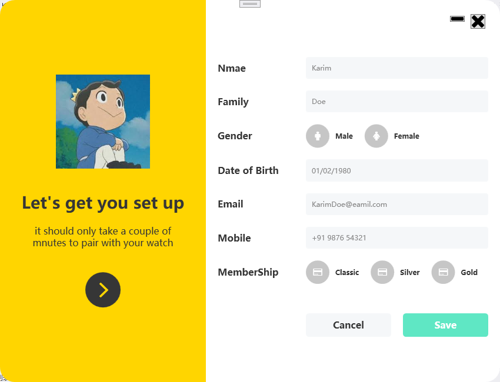
2.动态图：


## 2.代码展示
1.文件结构：
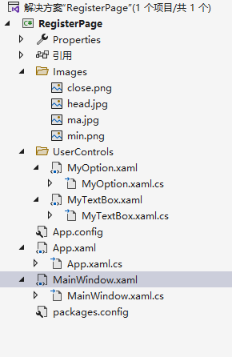

2.MainWindow.xaml代码：

```xml
<Window x:Class="RegisterPage.MainWindow"
        xmlns="http://schemas.microsoft.com/winfx/2006/xaml/presentation"
        xmlns:x="http://schemas.microsoft.com/winfx/2006/xaml"
        xmlns:d="http://schemas.microsoft.com/expression/blend/2008"
        xmlns:mc="http://schemas.openxmlformats.org/markup-compatibility/2006"
        xmlns:fa="http://schemas.fontawesome.io/icons/"
        xmlns:uc="clr-namespace:RegisterPage.UserControls"
        mc:Ignorable="d"
        Title="MainWindow" Height="650" Width="850" Background="Transparent" WindowStyle="None"
        WindowStartupLocation="CenterScreen" AllowsTransparency="True"><!-- WindowStyle="None"取消默认样式,AllowsTransparency="True"允许窗体透明;WindowStartupLocation="CenterScreen"表示使该窗口在屏幕中心启动-->
    <Grid>
        <!--设置两列-->
        <Grid.ColumnDefinitions>
            <ColumnDefinition Width="350"/>
            <ColumnDefinition Width="1*"/><!--使用*号就表示启用百分比方式来设置高宽-->
        </Grid.ColumnDefinitions>
        
        <!--左边部分-->
        <Border Grid.Column="0" Background="#ffd500" Padding="30" CornerRadius="25 0 0 25"> <!--CornerRadius设置的是圆角属性，四个参数的顺序是：左上、右上、右下、左下-->
            <StackPanel VerticalAlignment="Center">
                <Image Source="/Images/head.jpg" Width="160" Height="160" Margin="0 0 0 40"/>
                <TextBlock Text="Let's get you set up" TextAlignment="Center" FontWeight="SemiBold"  FontSize="28" Foreground="#363636"/><!--FontWeight代表字体加粗-->
                <TextBlock TextWrapping="Wrap"  FontSize="16" TextAlignment="Center" Foreground="#363636" Margin="0 20 0 20" Text="it should only take a couple of mnutes to pair with your watch"/><!--TextWrapping="Wrap"表示换行-->
                <Button Style="{StaticResource buttonBlack}"><!--引用定义在APP.xaml中的样式-->
                    <fa:ImageAwesome Icon="AngleRight" Width="25" Height="25" Foreground="#ffd500" Margin="3 0 0 0"/><!--fa:ImageAwesome Icon="AngleRight"表示引用库中图标-->
                </Button>
            </StackPanel>
        </Border>
        
        <!--输入部分-->
        <Border Grid.Column="1" Padding="20" Background="#ffffff" CornerRadius="0 25 25 0" MouseDown="Border_MouseDown">
            <Grid>
                <Button  Width="25" Margin="0 4 5 0" Style="{StaticResource iconApp}">
                    <fa:ImageAwesome Icon="Close" />
                </Button>
                <Button   Width="25" Margin="0 7  40 0" Style="{StaticResource iconApp}">
                    <fa:ImageAwesome Icon="Minus" />
                </Button>
                <Grid  VerticalAlignment="Center" HorizontalAlignment="Center" Margin="0 10 0 0">
                    <Grid.ColumnDefinitions>
                        <ColumnDefinition Width="150"/>
                        <ColumnDefinition Width="*"/>
                    </Grid.ColumnDefinitions>
                    <Grid.RowDefinitions>
                        <RowDefinition Height="auto"/>
                        <RowDefinition Height="auto"/>
                        <RowDefinition Height="auto"/>
                        <RowDefinition Height="auto"/>
                        <RowDefinition Height="auto"/>
                        <RowDefinition Height="auto"/>
                        <RowDefinition Height="auto"/>
                        <RowDefinition Height="auto"/>
                    </Grid.RowDefinitions>
                    <TextBlock Grid.Row="0" Text="Nmae" Style="{StaticResource text}"/>
                    <TextBlock Grid.Row="1" Text="Family" Style="{StaticResource text}"/>
                    <TextBlock Grid.Row="2" Text="Gender" Style="{StaticResource text}"/>
                    <TextBlock Grid.Row="3" Text="Date of Birth" Style="{StaticResource text}"/>
                    <TextBlock Grid.Row="4" Text="Email" Style="{StaticResource text}"/>
                    <TextBlock Grid.Row="5" Text="Mobile" Style="{StaticResource text}"/>
                    <TextBlock Grid.Row="6" Text="MemberShip" Style="{StaticResource text}"/>
                    <uc:MyTextBox Grid.Column="1" Grid.Row="0" Hint="Karim"/>
                    <uc:MyTextBox Grid.Column="1" Grid.Row="1" Hint="Doe"/>
                    <uc:MyTextBox Grid.Column="1" Grid.Row="3" Hint="01/02/1980"/>
                    <uc:MyTextBox Grid.Column="1" Grid.Row="4" Hint="KarimDoe@eamil.com"/>
                    <uc:MyTextBox Grid.Column="1" Grid.Row="5" Hint="+91 9876 54321"/>
                    <StackPanel Orientation="Horizontal" Grid.Row="2" Grid.Column="1" Margin="0 10">
                        <uc:MyOption Icon="Male" Text="Male"/>
                        <uc:MyOption Icon="Female" Text="Female"/>
                    </StackPanel>
                    <StackPanel Orientation="Horizontal" Grid.Row="6" Grid.Column="1" Margin="0 10">
                        <uc:MyOption Icon="CreditCard" Text="Classic"/>
                        <uc:MyOption Icon="CreditCard" Text="Silver"/>
                        <uc:MyOption Icon="CreditCard" Text="Gold"/>
                    </StackPanel>
                    <Grid Grid.Row="7" Grid.Column="1" Margin="0 40 0 0 ">
                        <Grid.ColumnDefinitions>
                            <ColumnDefinition Width="*"/>
                            <ColumnDefinition Width="*"/>
                        </Grid.ColumnDefinitions>
                        <Button Content="Cancel" Margin="0 0 10 0" Grid.Column="0" Style="{StaticResource buttonMain}"/>
                        <Button Content="Save" Margin="10 0 0 0" Grid.Column="1" Style="{StaticResource buttonMainGreen}"/>
                    </Grid>
                </Grid>
            </Grid>
        </Border>

    </Grid>
</Window>

```
MainWindow.xaml.cs代码：

```csharp

using System.Windows;
using System.Windows.Input;

namespace RegisterPage
{
    /// <summary>
    /// MainWindow.xaml 的交互逻辑
    /// </summary>
    public partial class MainWindow : Window
    {
        public MainWindow()
        {
            InitializeComponent();
        }

        private void Border_MouseDown(object sender, MouseButtonEventArgs e)
        {
            if (e.ChangedButton == MouseButton.Left)//如果按下了鼠标左键
            {
                this.DragMove();//允许拖动该窗口
            }
        }
    }
}

```
3.App.xaml代码：

```xml
<Application x:Class="RegisterPage.App"
             xmlns="http://schemas.microsoft.com/winfx/2006/xaml/presentation"
             xmlns:x="http://schemas.microsoft.com/winfx/2006/xaml"
             StartupUri="MainWindow.xaml">
    <Application.Resources>

        <!--该App.xaml文件定义了一些样式-->

        <!--左部分黑色按钮样式-->
        <Style x:Key="buttonBlack" TargetType="Button">
            <Setter Property="Background" Value="#363636"/>
            <Setter Property="BorderThickness" Value="2"/>
            <Setter Property="Width" Value="60"/>
            <Setter Property="Height" Value="60"/>
            <Setter Property="Margin" Value="0 20 0 0"/>
            <Setter Property="Template">
                <!--设置模板样式-->
                <Setter.Value>
                    <ControlTemplate TargetType="Button">
                        <Border Background="{TemplateBinding Background}" CornerRadius="50" Padding="5">
                            <ContentPresenter /><!--ContentPresenter是一个基础控件，其他的控件可以继承他，主要作用是实现内容的显示，可以是任何内容-->
                        </Border>
                    </ControlTemplate>
                </Setter.Value>
            </Setter>
            <Style.Triggers>
                <Trigger Property="IsMouseOver" Value="True">
                    <Setter Property="Background" Value="#000000"/>
                </Trigger>
            </Style.Triggers>
        </Style>

        <Style x:Key="iconApp" TargetType="Button"><!--最小化、关闭按钮的样式-->
            <Setter Property="VerticalAlignment" Value="Top"/>
            <Setter Property="HorizontalAlignment" Value="Right"/>
            <Style.Triggers>
                <Trigger Property="IsMouseOver" Value="True">
                    <Setter Property="RenderTransform">
                        <Setter.Value>
                            <ScaleTransform ScaleX="1.2" ScaleY="1.2"/><!--ScaleTransform表示缩放;ScaleX表示X轴缩小值，正常为1;ScaleY表示Y轴缩小值，正常为1 -->
                        </Setter.Value>
                    </Setter>
                </Trigger>
            </Style.Triggers>
        </Style>

        <Style x:Key="text" TargetType="TextBlock">
            <Setter Property="Foreground" Value="#363636"/>
            <Setter Property="FontWeight" Value="SemiBold"/>
            <Setter Property="FontSize" Value="16"/>
            <Setter Property="VerticalAlignment" Value="Center"/>
        </Style>

        <Style TargetType="TextBox">
            <Setter Property="Background" Value="#f5f7f9"/>
            <Setter Property="Foreground" Value="#767676"/>
            <Setter Property="BorderThickness" Value="1"/>
            <Setter Property="BorderBrush" Value="#f5f7f9"/>
            <Setter Property="FontSize" Value="12"/>
            <Setter Property="Padding" Value="10"/>
            <Setter Property="Margin" Value="0 10"/>
            <Setter Property="VerticalAlignment" Value="Center"/>
            <Setter Property="Template">
                <Setter.Value>
                    <ControlTemplate TargetType="{x:Type TextBoxBase}"> 
                        <Border x:Name="border" CornerRadius="3" Background="{TemplateBinding Background}" BorderThickness="{TemplateBinding BorderThickness}" BorderBrush="{TemplateBinding BorderBrush}" SnapsToDevicePixels="True">
                            <ScrollViewer x:Name="PART_ContentHost" Focusable="False" HorizontalScrollBarVisibility="Hidden" VerticalScrollBarVisibility="Hidden"/>
                        </Border>
                        <ControlTemplate.Triggers>
                            <Trigger Property="IsMouseOver" Value="True">
                                <Setter Property="BorderBrush" Value="#d9d9d9" TargetName="border"/>
                            </Trigger>
                            <Trigger Property="IsKeyboardFocused" Value="True">
                                <Setter Property="BorderBrush" Value="#d9d9d9" TargetName="border"/>
                            </Trigger>
                        </ControlTemplate.Triggers>
                    </ControlTemplate>
                </Setter.Value>
            </Setter>
        </Style>

        <Style x:Key="button" TargetType="Button">
            <Setter Property="Background" Value="#c6c6c6"/>
            <Setter Property="BorderThickness" Value="0"/>
            <Setter Property="Width" Value="40"/>
            <Setter Property="Height" Value="40"/>
            <Setter Property="Template">
                <Setter.Value>
                    <ControlTemplate TargetType="Button">
                        <Border Background="{TemplateBinding Background}" CornerRadius="50" Padding="5">
                            <ContentPresenter HorizontalAlignment="Center" VerticalAlignment="Center"/>
                        </Border>
                    </ControlTemplate>
                </Setter.Value>
            </Setter>
            <Style.Triggers>
                <Trigger Property="IsMouseOver" Value="True">
                    <Setter Property="Background" Value="#363636"/>
                </Trigger>
                <Trigger Property="IsMouseCaptured" Value="True">
                    <Setter Property="Background" Value="#161616"/>
                </Trigger>
            </Style.Triggers>
        </Style>

        <Style x:Key="buttonMain" TargetType="Button">
            <Setter Property="Background" Value="#f5f7f9"/>
            <Setter Property="Foreground" Value="#363636"/>
            <Setter Property="BorderThickness" Value="0"/>
            <Setter Property="Height" Value="40"/>
            <Setter Property="FontSize" Value="16"/>
            <Setter Property="FontWeight" Value="SemiBold"/>
            <Setter Property="Template">
                <Setter.Value>
                    <ControlTemplate TargetType="Button">
                        <Border Background="{TemplateBinding Background}" CornerRadius="5" Padding="5">
                            <ContentPresenter HorizontalAlignment="Center" VerticalAlignment="Center"/>
                        </Border>
                    </ControlTemplate>
                </Setter.Value>
            </Setter>

            <Style.Triggers>
                <Trigger Property="IsMouseOver" Value="True">
                    <Setter Property="Background" Value="#c9c9c9"/>
                    <Setter Property="Foreground" Value="#161616"/>
                </Trigger>
            </Style.Triggers>
        </Style><!--Cancel按钮样式表-->

        <Style x:Key="buttonMainGreen" TargetType="Button" BasedOn="{StaticResource buttonMain}"><!--Save按钮样式表-->
            <Setter Property="Background" Value="#5fe7c4"/>
            <Setter Property="Foreground" Value="#ffffff"/>
            <Style.Triggers>
                <Trigger Property="IsMouseOver" Value="True">
                    <Setter Property="Background" Value="#4ec7a8"/>
                    <Setter Property="Foreground" Value="#ffffff"/>
                </Trigger>
            </Style.Triggers>
        </Style>
        
    </Application.Resources>
</Application>

```
App.xaml.cs代码：

```csharp
using System;
using System.Collections.Generic;
using System.Configuration;
using System.Data;
using System.Linq;
using System.Threading.Tasks;
using System.Windows;

namespace RegisterPage
{
    /// <summary>
    /// App.xaml 的交互逻辑
    /// </summary>
    public partial class App : Application
    {
    }
}

```
4.MyOption.xaml代码:

```xml
<UserControl x:Class="RegisterPage.UserControls.MyOption"
             xmlns="http://schemas.microsoft.com/winfx/2006/xaml/presentation"
             xmlns:x="http://schemas.microsoft.com/winfx/2006/xaml"
             xmlns:mc="http://schemas.openxmlformats.org/markup-compatibility/2006" 
             xmlns:d="http://schemas.microsoft.com/expression/blend/2008" 
             xmlns:fa="http://schemas.fontawesome.io/icons/"
             mc:Ignorable="d" Name="myOption">
    <StackPanel Orientation="Horizontal">
        <Button Style="{StaticResource button}"><!--引用定义在APP.xaml中的样式-->
            <fa:ImageAwesome Icon="{Binding Path=Icon,ElementName=myOption}" Width="15" Height="15" Foreground="White"/>
        </Button>
        <TextBlock Text="{Binding Path=Text,ElementName=myOption}" Foreground="#363636" VerticalAlignment="Center" Margin="10 0 20 0" FontWeight="SemiBold"/>
    </StackPanel>
</UserControl>

```
MyOption.xaml.cs代码:

```csharp
using System.Windows;
using System.Windows.Controls;


namespace RegisterPage.UserControls
{
    /// <summary>
    /// MyOption.xaml 的交互逻辑
    /// </summary>
    public partial class MyOption : UserControl
    {
        public MyOption()
        {
            InitializeComponent();
        }

        public string Text
        {
            get { return (string)GetValue(TextProperty); }  
            set { SetValue(TextProperty, value); }
        }
        //DependencyProperty.Register方法：第一个参数是依赖属性的名字；第二个参数是依赖属性的类型；第三个参数是依赖属性所属的类名，也就是所有者类名；第四个参数是该属性的默认值
        public static readonly DependencyProperty TextProperty = DependencyProperty.Register("Text", typeof(string), typeof(MyOption));

        public FontAwesome.WPF.FontAwesomeIcon Icon
        {
            get { return (FontAwesome.WPF.FontAwesomeIcon)GetValue(IconProperty); }
            set { SetValue(IconProperty, value); }
        }
        //DependencyProperty.Register方法：第一个参数是依赖属性的名字；第二个参数是依赖属性的类型；第三个参数是依赖属性所属的类名，也就是所有者类名；第四个参数是该属性的默认值
        public static readonly DependencyProperty IconProperty = DependencyProperty.Register("Icon", typeof(FontAwesome.WPF.FontAwesomeIcon), typeof(MyOption));
    }

}

```
5.MyTextBox.xaml代码：

```xml
<UserControl x:Class="RegisterPage.UserControls.MyTextBox"
             xmlns="http://schemas.microsoft.com/winfx/2006/xaml/presentation"
             xmlns:x="http://schemas.microsoft.com/winfx/2006/xaml"
             xmlns:mc="http://schemas.openxmlformats.org/markup-compatibility/2006" 
             xmlns:d="http://schemas.microsoft.com/expression/blend/2008" 
             mc:Ignorable="d" 
             Name="myTextBox">
    <UserControl.Resources>
        <BooleanToVisibilityConverter x:Key="boolToVis"/>
    </UserControl.Resources>
    <Grid>
        <TextBlock  Foreground="#868686" Margin="10 0" VerticalAlignment="Center" Panel.ZIndex="1" IsHitTestVisible="False" 
                    Text="{Binding Path=Hint,ElementName=myTextBox}"
                    Visibility="{Binding ElementName=textBox,Path=Text.IsEmpty,Converter={StaticResource boolToVis}}"/>
        <TextBox x:Name="textBox"/><!--IsHitTestVisible表示设置/获取控件是否接受输入事件，Visibility表示设置/获取控件是否可见-->
    </Grid>
</UserControl>

```
MyTextBox.xaml.cs代码：

```csharp
using System.Windows;
using System.Windows.Controls;

namespace RegisterPage.UserControls
{
    /// <summary>
    /// MyTextBox.xaml 的交互逻辑
    /// </summary>
    public partial class MyTextBox : UserControl
    {
        public MyTextBox()
        {
            InitializeComponent();
        }
        public string Hint
        {
            get { return (string)GetValue(HintProperty); }
            set { SetValue(HintProperty, value); }
        }
        //DependencyProperty.Register方法：第一个参数是依赖属性的名字；第二个参数是依赖属性的类型；第三个参数是依赖属性所属的类名，也就是所有者类名；第四个参数是该属性的默认值
        public static readonly DependencyProperty HintProperty = DependencyProperty.Register("Hint", typeof(string), typeof(MyTextBox));
    }
}
```
# 2.简易登录按钮设计
## 1.实现效果
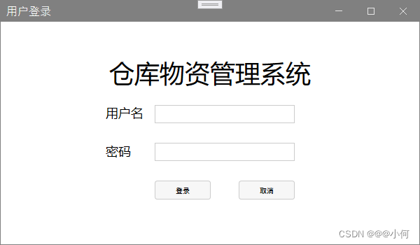
## 2.代码展示
```xml
<mah:MetroWindow  xmlns:mah="http://metro.mahapps.com/winfx/xaml/controls" x:Class="cms.Windows.LoginWindow"
        xmlns="http://schemas.microsoft.com/winfx/2006/xaml/presentation"
        xmlns:x="http://schemas.microsoft.com/winfx/2006/xaml"
        xmlns:d="http://schemas.microsoft.com/expression/blend/2008"
        xmlns:mc="http://schemas.openxmlformats.org/markup-compatibility/2006"
        xmlns:local="clr-namespace:cms.Windows"
        mc:Ignorable="d" WindowStartupLocation="CenterScreen"
        Title="用户登录" Height="350" Width="600"><!--WindowStartupLocation="CenterScreen"表示该窗口启动时将在屏幕中心位置-->
    <Grid>
        <Grid Margin="100,50,100,50"><!--Margin="100,50,100,50"表示该窗口距离左边边界100，上边50，右边100，下边50-->
            <Grid.RowDefinitions><!--行标签，在这里定义4行-->
                <RowDefinition/><!--定义一行-->
                <RowDefinition/>
                <RowDefinition/>
                <RowDefinition/>
            </Grid.RowDefinitions>
            <TextBlock Grid.Row="0" Text="仓库物资管理系统" HorizontalAlignment="Center" FontSize="36"/>
            <StackPanel Grid.Row="1" VerticalAlignment="Center" Orientation="Horizontal">
                <TextBlock Text="用户名" Width="60" FontSize="18" Margin="50 0 0 0 "/>
                <TextBox  Width="200" Margin="10 0 0 0"/>
            </StackPanel><!--设计用户名栏-->
            <StackPanel Grid.Row="2" VerticalAlignment="Center" Orientation="Horizontal">
                <TextBlock Text="密码" Width="60" FontSize="18" Margin="50 0 0 0 "/>
                <TextBox  Width="200" Margin="10 0 0 0"/>
            </StackPanel><!--设计密码栏-->
            <StackPanel Grid.Row="3" Margin="80 0 0 0" VerticalAlignment="Center" Orientation="Horizontal">
                <Button Content="登录" Width="80" Margin="40 0 0 0"/>
                <Button Content="取消" Width="80" Margin="40 0 0 0"/>
            </StackPanel>
            <!--设计密码栏-->
        </Grid>
    </Grid>
</mah:MetroWindow>


```


# 3.设计一个优美的注册登录界面（连接数据库）
## 1.实现效果
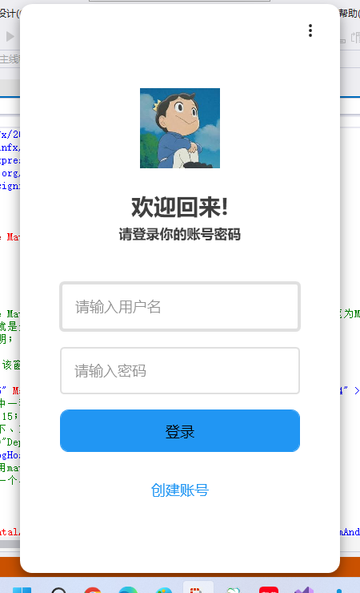
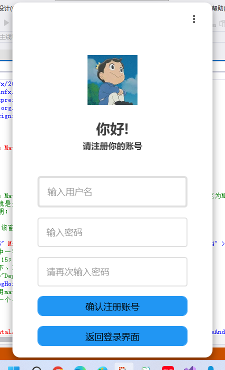

视频展示该界面：[视频链接](https://www.bilibili.com/video/BV1N34y1h7Z5/)
## 2.代码展示
1. 工程目录：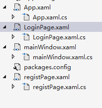
2. 数据库部署：
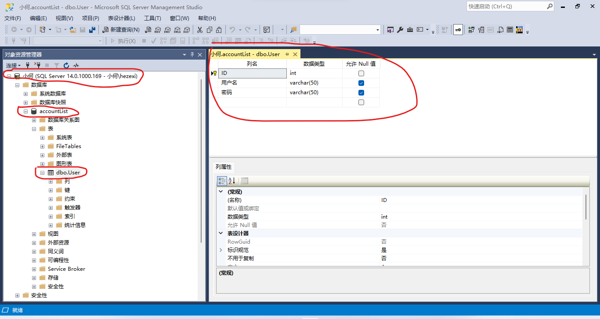
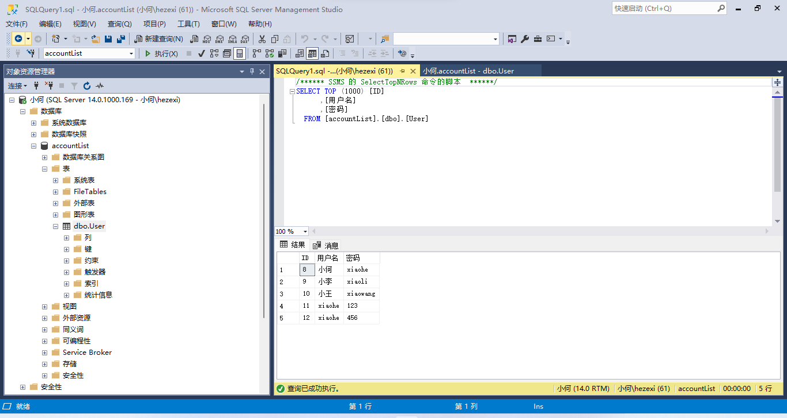
3. LoginPage.xaml代码：

```xml
<Window x:Class="Login.LoginPage"
        xmlns="http://schemas.microsoft.com/winfx/2006/xaml/presentation"
        xmlns:x="http://schemas.microsoft.com/winfx/2006/xaml"
        xmlns:d="http://schemas.microsoft.com/expression/blend/2008"
        xmlns:mc="http://schemas.openxmlformats.org/markup-compatibility/2006"
        xmlns:materialDesign="http://materialdesigninxaml.net/winfx/xaml/themes"
        xmlns:local="clr-namespace:Login"
        mc:Ignorable="d"
        Title="登录" Height="760" Width="450"
        TextElement.Foreground="{DynamicResource MaterialDesignBody}"
        Background="{x:Null}"
        AllowsTransparency="True"
        WindowStyle="None"
        WindowStartupLocation="CenterScreen"
        Icon="/Image/loginPage.png">
    <!--TextElement.Foreground="{DynamicResource MaterialDesignBody}"的意思是获取或设置要应用于元素内容的画笔为MaterialDesignBody；
    Background="{x:Null}"的意思是背景设置为空，就是无背景;
    AllowsTransparency="True"的意思是允许窗口透明；
    WindowStyle="None"的意思是设置窗口无边框；
    WindowStartupLocation="CenterScreen"的意思是该窗口在启动时将出现在屏幕中心位置
    -->
    <materialDesign:Card UniformCornerRadius="15" Margin="25" materialDesign:ShadowAssist.ShadowDepth="Depth4" >
        <!--materialDesign:Card是materialDesign中一种卡片式的布局；
        UniformCornerRadius=15表示设置圆角属性为15；
        Margin="25"设置间距为25，顺序是上、右、下、左的边距 ；
        materialDesign:ShadowAssist.ShadowDepth="Depth4"表示设置阴影大小，从Depth到Depth5-->
        <materialDesign:DialogHost x:Name="DialogHost" CloseOnClickAway="True">
            <!--materialDesign:DialogHost表示引用materialDesign库中对话框；
            x:Name="DialogHost"表示给该对话框起一个名字叫DialogHost；
            CloseOnClickAway="True"-->
            <StackPanel>

                <materialDesign:PopupBox HorizontalAlignment="Right" Margin="0 20 20 0" PlacementMode="BottomAndAlignRightEdges"  Height="25">
                    <!--materialDesign:PopupBox表示弹窗；PlacementMode="BottomAndAlignRightEdges"描述 Popup 控件在屏幕上显示的位置为底部和右边缘(即右下角)-->
                    <StackPanel>

                        <StackPanel Margin="16 10 0 6" Orientation="Horizontal" HorizontalAlignment="Center">
                            <TextBlock VerticalAlignment="Center" Text="暗黑模式"/>
                            <ToggleButton Cursor="Hand" ToolTip="切换至暗黑模式" Margin="12 0 8 0" x:Name="themeToggle" IsChecked="{Binding IsDarkTheme}" Click="toggleTheme"/>
                            <!--ToggleButton为状态开关按钮；Cursor="Hand"表示鼠标放上去时鼠标形状为hand；ToolTip表示鼠标放上去时，会弹出一些提示信息；Click="toggleTheme"表示自定义一些按钮点击事件-->
                        </StackPanel>
                        <Button ToolTip="登录遇到问题？" Margin="0 8 0 0" Content="帮助"/>
                        <Button x:Name="btn_exit" ToolTip="退出程序" Content="退出" Click="exitApp"/>
                    </StackPanel>
                </materialDesign:PopupBox>

                <Image Margin="0 60 0 5" Source="Image/head.jpg" Height="100"/>
                <TextBlock Margin="0 25 0 5" HorizontalAlignment="Center" FontSize="28" FontWeight="Bold" Text="欢迎回来!"/>
                <TextBlock FontSize="17" FontWeight="SemiBold" HorizontalAlignment="Center" Text="请登录你的账号密码"/>
                <TextBox Margin="0 50 0 0" x:Name="txtUserName" Width="300" FontSize="18" materialDesign:HintAssist.Hint="请输入用户名" BorderThickness="4" BorderBrush="{DynamicResource MaterialDesignDivider}" Style="{StaticResource MaterialDesignOutlinedTextBox}"/>
                <!--materialDesign:HintAssist.Hint="Enter UserNmae"表示设置提示文本为Enter UserNmae
                BorderThickness="4"表示设置边框宽度为4
                 BorderBrush="{DynamicResource MaterialDesignDivider}"表示设置边框笔刷为materialDesign库中的MaterialDesignDivider
                Style="{StaticResource MaterialDesignOutlinedTextBox}"表示设置样式为materialDesign库中的MaterialDesignOutlinedTextBox
                -->
                <PasswordBox Margin="0 20 0 0" x:Name="txtPassword" Width="300" FontSize="18" materialDesign:HintAssist.Hint="请输入密码" BorderThickness="2" BorderBrush="{DynamicResource MaterialDesignDivider}" Style="{StaticResource MaterialDesignOutlinedPasswordBox}"/>
                <Button Margin="0 20 0 0" x:Name="loginBtn" Style="{StaticResource MaterialDesignFlatMidBgButton}" materialDesign:ShadowAssist.ShadowDepth="Depth0" Height="53" Width="300" materialDesign:ButtonAssist.CornerRadius="10" FontSize="18" Content="登录" Click="loginButtonClick"/>
                <Button Margin="0 20 0 0" x:Name="signupBtn" Style="{StaticResource MaterialDesignFlatButton}" materialDesign:ShadowAssist.ShadowDepth="Depth0" Height="53" Width="300" materialDesign:ButtonAssist.CornerRadius="10" FontSize="18" Content="创建账号" Cursor="Hand" Click="regisButtonClick"/>
            </StackPanel>
        </materialDesign:DialogHost>
    </materialDesign:Card>
</Window>

```
LoginPage.xaml.cs代码：

```csharp
using System;
using System.Collections.Generic;
using System.Data.SqlClient;
using System.Linq;
using System.Text;
using System.Threading.Tasks;
using System.Windows;
using System.Windows.Controls;
using System.Windows.Data;
using System.Windows.Documents;
using System.Windows.Input;
using System.Windows.Media;
using System.Windows.Media.Imaging;
using System.Windows.Navigation;
using System.Windows.Shapes;
using MaterialDesignThemes.Wpf;

namespace Login
{
    /// <summary>
    /// MainWindow.xaml 的交互逻辑
    /// </summary>
    public partial class LoginPage : Window
    {
        public LoginPage()
        {
            InitializeComponent();
           
        }
        public bool IsDarkTheme { get; set; }//定义一个属性
        private readonly PaletteHelper paletteHelper = new PaletteHelper();
        private void toggleTheme(object sender, RoutedEventArgs e)//切换主题的按钮点击事件
        {
            ITheme theme = paletteHelper.GetTheme();
            if (IsDarkTheme = theme.GetBaseTheme() == BaseTheme.Dark)//如果当前主题颜色为暗黑色
            {
                IsDarkTheme = false;
                theme.SetBaseTheme(Theme.Light);//设置主题颜色为明亮
            }
            else
            {
                IsDarkTheme = true;
                theme.SetBaseTheme(Theme.Dark);//设置主题颜色为黑色
            }
            paletteHelper.SetTheme(theme);//成功设置界面主题颜色
        }

        private void exitApp(object sender, RoutedEventArgs e)//退出按钮点击事件
        {
            Application.Current.Shutdown();//退出该应用程序（即关掉该窗口）
        }
        protected override void OnMouseLeftButtonDown(MouseButtonEventArgs e)//设置窗口可拖拽
        {
            base.OnMouseLeftButtonDown(e);
            DragMove();
        }

        private void loginButtonClick(object sender, RoutedEventArgs e)//登录按钮点击事件
        {
         //与数据库进行连接；
            //Server=小何表示服务器名称是小何；
            //Database = accountList表示数据库名称为accountList；
            //integrated security = true表示可以在不知道数据库用户名和密码的情况下时，依然可以连接数据库，
                //如果integrated security = false, 或者不写，表示一定要输入正确的数据库登录名和密码。
            SqlConnection sqlConnection = new SqlConnection(@"Server=小何;Database=accountList;Integrated Security=True");
            sqlConnection.Open();
            string add_data = "select * from [dbo].[User] where 用户名=@用户名 and 密码=@密码";
            SqlCommand cmd = new SqlCommand(add_data, sqlConnection);
            cmd.Parameters.AddWithValue("@用户名", txtUserName.Text);
            cmd.Parameters.AddWithValue("@密码", txtPassword.Password);
            cmd.ExecuteNonQuery();
            int count=Convert.ToInt32(cmd.ExecuteScalar());
            sqlConnection.Close();
            txtUserName.Text = "";
            txtPassword.Password = "";
            if (count > 0)//数据库匹配成功
            {
                mainWindow mainWindow=new mainWindow();
                this.Close();
                mainWindow.Show();
            }else//若返回-1,即匹配失败
            {
                MessageBox.Show("账号或密码输入错误！");
            }  
        }
        private void regisButtonClick(object sender, RoutedEventArgs e)//注册按钮点击事件
        {
            registPage reg1 = new registPage();
            this.Close();
            reg1.Show();
        }
    }
}

```
registPage.xaml代码：

```xml
<Window x:Class="Login.registPage"
        xmlns="http://schemas.microsoft.com/winfx/2006/xaml/presentation"
        xmlns:x="http://schemas.microsoft.com/winfx/2006/xaml"
        xmlns:d="http://schemas.microsoft.com/expression/blend/2008"
        xmlns:mc="http://schemas.openxmlformats.org/markup-compatibility/2006"
        xmlns:materialDesign="http://materialdesigninxaml.net/winfx/xaml/themes"
        mc:Ignorable="d"
        Title="Login" Height="760" Width="450"
        TextElement.Foreground="{DynamicResource MaterialDesignBody}"
        Background="{x:Null}"
        AllowsTransparency="True"
        WindowStyle="None"
        WindowStartupLocation="CenterScreen"
        Icon="/Image/registPage.png">
    <materialDesign:Card UniformCornerRadius="15" Margin="25" materialDesign:ShadowAssist.ShadowDepth="Depth4" >
        <!--materialDesign:Card是materialDesign中一种卡片式的布局；
        UniformCornerRadius=15表示设置圆角属性为15；
        Margin="25"设置间距为25，顺序是上、右、下、左的边距 ；
        materialDesign:ShadowAssist.ShadowDepth="Depth4"表示设置阴影大小，从Depth到Depth5-->
        <materialDesign:DialogHost x:Name="DialogHost" CloseOnClickAway="True">
            <!--materialDesign:DialogHost表示引用materialDesign库中对话框；
            x:Name="DialogHost"表示给该对话框起一个名字叫DialogHost；
            CloseOnClickAway="True"-->
            <StackPanel>

                <materialDesign:PopupBox HorizontalAlignment="Right" Margin="0 20 20 0" PlacementMode="BottomAndAlignRightEdges"  Height="25">
                    <!--materialDesign:PopupBox表示弹窗；PlacementMode="BottomAndAlignRightEdges"描述 Popup 控件在屏幕上显示的位置为底部和右边缘(即右下角)-->
                    <StackPanel>

                        <StackPanel Margin="16 10 0 6" Orientation="Horizontal" HorizontalAlignment="Center">
                            <TextBlock VerticalAlignment="Center" Text="暗黑模式"/>
                            <ToggleButton Cursor="Hand" ToolTip="切换至暗黑模式" Margin="12 0 8 0" x:Name="themeToggle" IsChecked="{Binding IsDarkTheme}" Click="toggleTheme"/>
                            <!--ToggleButton为状态开关按钮；Cursor="Hand"表示鼠标放上去时鼠标形状为hand；ToolTip表示鼠标放上去时，会弹出一些提示信息；Click="toggleTheme"表示自定义一些按钮点击事件-->
                        </StackPanel>
                        <Button ToolTip="Having Trouble Logging In?" Margin="0 8 0 0" Content="帮助"/>
                        <Button x:Name="btn_exit" ToolTip="退出程序" Content="退出" Click="exitApp"/>

                    </StackPanel>
                </materialDesign:PopupBox>

                <Image Margin="0 60 0 5" Source="Image/head.jpg" Height="100"/>
                <TextBlock Margin="0 25 0 5" HorizontalAlignment="Center" FontSize="28" FontWeight="Bold" Text="你好!"/>
                <TextBlock FontSize="17" FontWeight="SemiBold" HorizontalAlignment="Center" Text="请注册你的账号"/>
                <TextBox Margin="0 50 0 0" x:Name="registUserName" Width="300" FontSize="18" materialDesign:HintAssist.Hint="输入用户名" BorderThickness="4" BorderBrush="{DynamicResource MaterialDesignDivider}" Style="{StaticResource MaterialDesignOutlinedTextBox}"/>
                
                <!--materialDesign:HintAssist.Hint="Enter UserNmae"表示设置提示文本为Enter UserNmae
                BorderThickness="4"表示设置边框宽度为4
                 BorderBrush="{DynamicResource MaterialDesignDivider}"表示设置边框笔刷为materialDesign库中的MaterialDesignDivider
                Style="{StaticResource MaterialDesignOutlinedTextBox}"表示设置样式为materialDesign库中的MaterialDesignOutlinedTextBox
                -->
                <PasswordBox Margin="0 20 0 0" x:Name="registPassword" Width="300" FontSize="18" materialDesign:HintAssist.Hint="输入密码" BorderThickness="2" BorderBrush="{DynamicResource MaterialDesignDivider}" Style="{StaticResource MaterialDesignOutlinedPasswordBox}"/>
                <PasswordBox Margin="0 20 0 0" x:Name="registPassword1" Width="300" FontSize="18" materialDesign:HintAssist.Hint="请再次输入密码" BorderThickness="2" BorderBrush="{DynamicResource MaterialDesignDivider}" Style="{StaticResource MaterialDesignOutlinedPasswordBox}"/>
                <Button Margin="0 20 0 0" x:Name="registButton" Style="{StaticResource MaterialDesignFlatMidBgButton}" materialDesign:ShadowAssist.ShadowDepth="Depth0" Height="40" Width="300" materialDesign:ButtonAssist.CornerRadius="10" FontSize="18" Content="确认注册账号" Click="registButtonClick"/>
                <Button Margin="0 20 0 0" x:Name="backBtn" Style="{StaticResource MaterialDesignFlatMidBgButton}" materialDesign:ShadowAssist.ShadowDepth="Depth0" Height="40" Width="300" materialDesign:ButtonAssist.CornerRadius="10" FontSize="18" Content="返回登录界面" Click="backButtonClick"/>
            </StackPanel>
        </materialDesign:DialogHost>
    </materialDesign:Card>
</Window>

```
registPage.xaml.cs代码：

```csharp
using MaterialDesignThemes.Wpf;
using System;
using System.Collections.Generic;
using System.Data;
using System.Data.SqlClient;
using System.Linq;
using System.Text;
using System.Threading.Tasks;
using System.Windows;
using System.Windows.Controls;
using System.Windows.Data;
using System.Windows.Documents;
using System.Windows.Input;
using System.Windows.Media;
using System.Windows.Media.Imaging;
using System.Windows.Shapes;

namespace Login
{
    /// <summary>
    /// registPage.xaml 的交互逻辑
    /// </summary>
    public partial class registPage : Window
    {
        public registPage()
        {
            InitializeComponent();
        }
        public bool IsDarkTheme { get; set; }//定义一个属性
        private readonly PaletteHelper paletteHelper = new PaletteHelper();
        private void toggleTheme(object sender, RoutedEventArgs e)//切换主题的按钮点击事件
        {
            ITheme theme = paletteHelper.GetTheme();
            if (IsDarkTheme = theme.GetBaseTheme() == BaseTheme.Dark)//如果当前主题颜色为暗黑色
            {
                IsDarkTheme = false;
                theme.SetBaseTheme(Theme.Light);//设置主题颜色为明亮
            }
            else
            {
                IsDarkTheme = true;
                theme.SetBaseTheme(Theme.Dark);//设置主题颜色为黑色
            }
            paletteHelper.SetTheme(theme);//成功设置界面主题颜色
        }
        private void exitApp(object sender, RoutedEventArgs e)//退出按钮点击事件
        {
            Application.Current.Shutdown();//退出该应用程序（即关掉该窗口）
        }
        protected override void OnMouseLeftButtonDown(MouseButtonEventArgs e)//设置窗口可拖拽
        {
            base.OnMouseLeftButtonDown(e);
            DragMove();
        }
        private void backButtonClick(object sender, RoutedEventArgs e)
        {
            LoginPage mainWindow = new LoginPage();
            this.Close();
            mainWindow.Show();
        }
        private void registButtonClick(object sender, RoutedEventArgs e)//注册按钮点击事件
        {
            if (registPassword1.Password!=registPassword.Password)
            {
                MessageBox.Show("两次输入的密码不一致，请重新输入！");
                registPassword.Password = "";
                registPassword1.Password = "";
            }
            else
            {
                SqlConnection sqlConnection = new SqlConnection(@"Server=小何;Database=accountList;Integrated Security=True");
                sqlConnection.Open();
                string add_data = "insert into [dbo].[User] values(@用户名,@密码)";
                SqlCommand cmd = new SqlCommand(add_data, sqlConnection);
                cmd.Parameters.AddWithValue("@用户名", registUserName.Text);
                cmd.Parameters.AddWithValue("@密码", registPassword.Password);
                cmd.ExecuteNonQuery();
                sqlConnection.Close();
                registUserName.Text = "";
                registPassword.Password = "";
                registPassword1.Password = "";
                MessageBox.Show("注册成功");
                LoginPage mainWindow = new LoginPage();
                this.Close();
                mainWindow.Show();
            }

        }
    }
    }

```
App.xaml代码：

```xml
<Application x:Class="Login.App"
             xmlns="http://schemas.microsoft.com/winfx/2006/xaml/presentation"
             xmlns:x="http://schemas.microsoft.com/winfx/2006/xaml"
             xmlns:local="clr-namespace:Login" xmlns:materialDesign="http://materialdesigninxaml.net/winfx/xaml/themes"
             xmlns:viewModel="clr-namespace:Login.MVVM.ViewModel"
             xmlns:view="clr-namespace:Login.MVVM.View"
             StartupUri="LoginPage.xaml">
    <Application.Resources>
        <ResourceDictionary>
            <ResourceDictionary.MergedDictionaries>
                <materialDesign:BundledTheme BaseTheme="Light" PrimaryColor="Blue" SecondaryColor="Yellow" />
                <!--BaseTheme="Light"表示设置主题为light样式；PrimaryColor="Blue"表示设置界面中各个控件外观为蓝色； SecondaryColor="Lime"表示设置次要首选颜色-->
                <ResourceDictionary Source="pack://application:,,,/MaterialDesignThemes.Wpf;component/Themes/MaterialDesignTheme.Defaults.xaml" />
                <ResourceDictionary Source="Theme/MenuButtonTheme.xaml"/>
                <ResourceDictionary Source="Theme/TextBoxTheme.xaml"/>
            </ResourceDictionary.MergedDictionaries>
            <DataTemplate DataType="{x:Type viewModel:HomeViewModel}">
                <view:HomeView/>
            </DataTemplate>
            <DataTemplate DataType="{x:Type viewModel:MusicViewModel}">
                <view:MusicView/>
            </DataTemplate>
            <DataTemplate DataType="{x:Type viewModel:FeaturedViewModel}">
                <view:FeaturedView/>
            </DataTemplate>
        </ResourceDictionary>
    </Application.Resources>
</Application>
```
App.xaml.cs代码：

```csharp
using System;
using System.Collections.Generic;
using System.Configuration;
using System.Data;
using System.Linq;
using System.Threading.Tasks;
using System.Windows;

namespace Login
{
    /// <summary>
    /// App.xaml 的交互逻辑
    /// </summary>
    public partial class App : Application
    {
    }
}

```
而mainWindow则是一个新建的空窗口，没啥代码；

# 4.设计一个简单的在线教育系统界面
## 1.实现效果
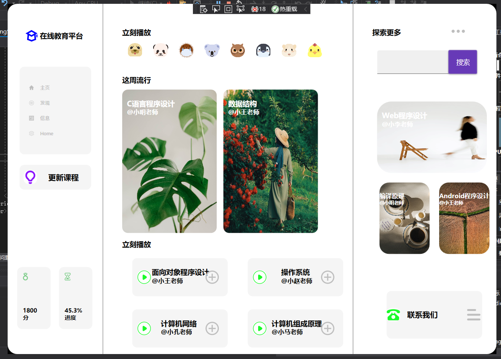
## 2.代码展示
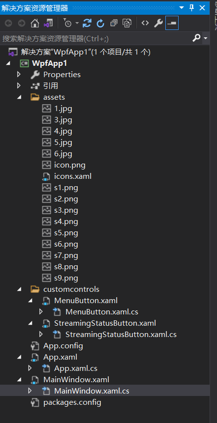
图片：
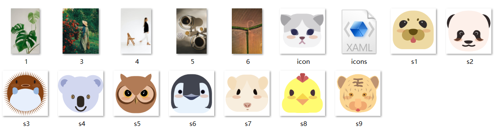

1. App.xaml

```xml
<Application x:Class="WpfApp1.App"
             xmlns="http://schemas.microsoft.com/winfx/2006/xaml/presentation"
             xmlns:x="http://schemas.microsoft.com/winfx/2006/xaml"
             xmlns:materialDesign="http://materialdesigninxaml.net/winfx/xaml/themes"
             xmlns:local="clr-namespace:WpfApp1"
             StartupUri="MainWindow.xaml">
    <!--引入MaterialDesignThemes库-->
    <Application.Resources>
        <ResourceDictionary>
            <ResourceDictionary.MergedDictionaries>
                <materialDesign:BundledTheme BaseTheme="Light" PrimaryColor="DeepPurple" SecondaryColor="Lime" />
                <ResourceDictionary Source="pack://application:,,,/MaterialDesignThemes.Wpf;component/Themes/MaterialDesignTheme.Defaults.xaml" />
            </ResourceDictionary.MergedDictionaries>
        </ResourceDictionary>
    </Application.Resources>
</Application>

```
App.xaml.cs

```csharp
using System;
using System.Collections.Generic;
using System.Configuration;
using System.Data;
using System.Linq;
using System.Threading.Tasks;
using System.Windows;

namespace WpfApp1
{
    /// <summary>
    /// App.xaml 的交互逻辑
    /// </summary>
    public partial class App : Application
    {
    }
}

```
2. MainWindow.xaml

```xml
<Window x:Class="WpfApp1.MainWindow"
        xmlns="http://schemas.microsoft.com/winfx/2006/xaml/presentation"
        xmlns:x="http://schemas.microsoft.com/winfx/2006/xaml"
        xmlns:d="http://schemas.microsoft.com/expression/blend/2008"
        xmlns:mc="http://schemas.openxmlformats.org/markup-compatibility/2006"
        xmlns:customcontrols="clr-namespace:WpfApp1.customcontrols"
        xmlns:materialDesign="http://materialdesigninxaml.net/winfx/xaml/themes"
        xmlns:local="clr-namespace:WpfApp1"
        mc:Ignorable="d" x:Name="this"
        Title="MainWindow" Icon="/assets/icon.png" Height="735" Width="1024" Background="Transparent" FontSize="15" WindowStartupLocation="CenterScreen" WindowStyle="None" ResizeMode="NoResize" >

    <!--初始化资源字典，该字典用来存放所有的app图标-->
    <Window.Resources>
        <ResourceDictionary>
            <ResourceDictionary.MergedDictionaries>
                <!--MergedDictionaries获取 ResourceDictionary 字典的集合，这些字典构成了合并字典中的各种资源字典-->
                <ResourceDictionary Source="/assets/icons.xaml"/>
            </ResourceDictionary.MergedDictionaries>
        </ResourceDictionary>
    </Window.Resources>

    <!--窗口背景和圆角-->
    <Border CornerRadius="20" Background="White">
        <Grid>
            <Grid.ColumnDefinitions>
                <ColumnDefinition Width="200"/>
                <ColumnDefinition/>
                <ColumnDefinition Width="300"/>
            </Grid.ColumnDefinitions>
            <!--绘制一根竖直的分隔细线-->
            <Line  Stroke="Black"  HorizontalAlignment="Right"  Y1="0" Y2="{Binding Height,ElementName=this}" StrokeThickness="0.5" /> <!--Line用于在两个点之间绘制直线;Y1是获取或设置 Line 起始点的 y 坐标；Y2是获取或设置 Line 终结点的 y 坐标；StrokeThickness是获取或设置笔划轮廓的 Shape 宽度。-->

            <!--左边区域-->
            <Grid Grid.Column="0">
                <!--左上角logo区域-->
                <Grid Grid.Column="0" HorizontalAlignment="Center" VerticalAlignment="Top" Margin="0,55">
                    <Grid.ColumnDefinitions>
                        <ColumnDefinition Width="25"/>
                        <ColumnDefinition/>
                    </Grid.ColumnDefinitions>
                    <Path Data="{StaticResource logo}" Fill="Blue" Stretch="Uniform"/>
                    <TextBlock Grid.Column="1" Text="在线教育平台" FontWeight="SemiBold" VerticalAlignment="Center" Margin="5,0"/>
                </Grid>
                <!--左边菜单栏区域-->
                <Border Grid.Column="0" CornerRadius="10" Background="WhiteSmoke" Width="150" Margin="25,132,25,419.2">
                    <StackPanel Orientation="Vertical" VerticalAlignment="Center">
                        <customcontrols:MenuButton Icon="{StaticResource home}" IconWidth="10" IndicatorBrush="#bebebe" Text="主页" IsSelected="True" VerticalAlignment="Center" GroupName="MenuButton"/>
                        <customcontrols:MenuButton Icon="{StaticResource discover}" IconWidth="10" IndicatorBrush="#bebebe" Text="发现" IsSelected="True" VerticalAlignment="Center" GroupName="MenuButton"/>
                        <customcontrols:MenuButton Icon="{StaticResource messages}" IconWidth="10" IndicatorBrush="#bebebe" Text="信息" IsSelected="True" VerticalAlignment="Center" GroupName="MenuButton"/>
                        <customcontrols:MenuButton Icon="{StaticResource settings}" IconWidth="10" IndicatorBrush="#bebebe" Text="Home" IsSelected="True" VerticalAlignment="Center" GroupName="MenuButton"/>
                    </StackPanel>
                </Border>
                <!--更新课程按钮-->
                <Button Height="52" Margin="25,338,25,345.2">
                    <Button.Style>
                        <Style TargetType="{x:Type Button}">
                            <Setter Property="HorizontalAlignment" Value="Center"/>
                            <Setter Property="VerticalAlignment" Value="Center"/>
                            <Setter Property="Height" Value="53"/>
                            <Setter Property="Width" Value="150"/>
                            <Setter Property="Margin" Value="0,-50,0,0"/>
                            <Setter Property="Background" Value="WhiteSmoke"/>
                            <Setter Property="Template">
                                <Setter.Value>
                                    <ControlTemplate TargetType="{x:Type Button}">
                                        <Border Background="{TemplateBinding Background}" CornerRadius="10">
                                            <Grid>
                                                <Grid.ColumnDefinitions>
                                                    <ColumnDefinition Width="45"/>
                                                    <ColumnDefinition/>

                                                </Grid.ColumnDefinitions>
                                                <Border Grid.Column="0" CornerRadius="10" Height="28" Width="28" Background="White" HorizontalAlignment="Center" VerticalAlignment="Center">
                                                    <Path Data="{StaticResource light}" Width="28" Height="28" Fill="#8c14fd" HorizontalAlignment="Center" VerticalAlignment="Center" Stretch="Uniform"/>
                                                </Border>
                                                <Grid Grid.Column="1">
                                                    <TextBlock HorizontalAlignment="Left" VerticalAlignment="Center" Margin="15,5,5,5">
                                                    <Run Text="更新课程" FontSize="16" FontWeight="Bold"/>
                                                    </TextBlock>
                                                </Grid>

                                            </Grid>

                                        </Border>
                                    </ControlTemplate>
                                </Setter.Value>
                            </Setter>
                        </Style>
                    </Button.Style>
                </Button>
                <!--课程分数-->
                <Border CornerRadius="10" Background="WhiteSmoke" HorizontalAlignment="Center" VerticalAlignment="Center" Height="130" Width="70" Margin="5,500,95,0">
                    <Grid>
                        <Path Data="{StaticResource medal}" Fill="#79cb86" HorizontalAlignment="Left" VerticalAlignment="Top" Height="16" Stretch="Uniform" Margin="12,12,0,0"/>
                        <TextBlock HorizontalAlignment="Left" VerticalAlignment="Bottom" Margin="12,0,0,16">
                        <Run Text="1800" FontWeight="Bold" FontSize="12"/>
                        <LineBreak/>
                        <Run Text="分" FontWeight="Bold" FontSize="12"/>
                        </TextBlock>
                    </Grid>
                </Border>
                <!--完成进度-->
                <Border CornerRadius="10" Background="WhiteSmoke" HorizontalAlignment="Center" VerticalAlignment="Center" Height="130" Width="70" Margin="90,500,5,0">
                    <Grid>
                        <Path Data="{StaticResource progress}" Fill="#79cb86" HorizontalAlignment="Left" VerticalAlignment="Top" Height="16" Stretch="Uniform" Margin="12,12,0,0"/>
                        <TextBlock HorizontalAlignment="Left" VerticalAlignment="Bottom" Margin="12,0,0,16">
                        <Run Text="45.3%" FontWeight="Bold" FontSize="12"/>
                        <LineBreak/>
                        <Run Text="进度" FontWeight="Bold" FontSize="12"/>
                        </TextBlock>
                    </Grid>
                </Border>
            </Grid>
            <!--中间部分-->
            <Grid Grid.Column="1">
                <Grid.RowDefinitions>
                    <RowDefinition Height="150"/>
                    <RowDefinition Height="370"/>
                    <RowDefinition/>
                </Grid.RowDefinitions>
                
                <!--中间部分区域-->
                <Grid  Grid.Row="0" Margin="40,0,0,0">
                    <TextBlock Margin="0,50,0,0">
                         <Run Text="立刻播放" FontWeight="SemiBold"/>
                    </TextBlock>
                    <UniformGrid  Columns="9" Margin="0,80,0,0" HorizontalAlignment="Stretch" VerticalAlignment="Top">
                        <customcontrols:StreamingStatusButton ImageSource="assets/s1.png"/>
                        <customcontrols:StreamingStatusButton ImageSource="/assets/s2.png"/>
                        <customcontrols:StreamingStatusButton ImageSource="/assets/s3.png"/>
                        <customcontrols:StreamingStatusButton ImageSource="/assets/s4.png"/>
                        <customcontrols:StreamingStatusButton ImageSource="/assets/s5.png"/>
                        <customcontrols:StreamingStatusButton ImageSource="/assets/s6.png"/>
                        <customcontrols:StreamingStatusButton ImageSource="/assets/s7.png"/>
                        <customcontrols:StreamingStatusButton ImageSource="/assets/s8.png"/>
                        <customcontrols:StreamingStatusButton ImageSource="/assets/.png"/>
                    </UniformGrid>
                </Grid>
                <Grid Grid.Row="1" Margin="40,0,0,0">
                    <TextBlock  FontWeight="SemiBold" HorizontalAlignment="Left" VerticalAlignment="Top">
                        <Run Text="这周流行"  FontWeight="SemiBold"/>
                    </TextBlock>
                    <Grid Grid.Column="1" HorizontalAlignment="Stretch" VerticalAlignment="Top" Margin="0">
                        <Grid.ColumnDefinitions>
                            <ColumnDefinition/>
                            <ColumnDefinition/>
                        </Grid.ColumnDefinitions>
                        
                        <Border  Grid.Column="0" CornerRadius="12" HorizontalAlignment="Left" Height="301" Width="198" Margin="0,30,20,0" VerticalAlignment="Top">
                            <Border.Background>
                                <ImageBrush ImageSource="/assets/1.jpg"/>
                            </Border.Background>
                            <TextBlock  Margin="10,20,0,0">
                        <Run  Text="C语言程序设计" Foreground="White" FontWeight="SemiBold"/>
                        <LineBreak/>
                        <Run  Text="@小明老师" FontSize="13" Foreground="White" FontWeight="SemiBold"/>
                            </TextBlock>
                        </Border>
                        
                        <Border  Grid.Column="1" CornerRadius="12" HorizontalAlignment="Left" Height="301" Width="198" Margin="-30,30,0,0" VerticalAlignment="Top">
                            <Border.Background>
                                <ImageBrush ImageSource="/assets/3.jpg"/>
                            </Border.Background>
                            <TextBlock  Margin="10,20,0,0">
                                <Run  Text="数据结构" Foreground="White" FontWeight="SemiBold"/>
                                 <LineBreak/>
                                 <Run  Text="@小王老师" FontSize="13" Foreground="White" FontWeight="SemiBold"/>
                            </TextBlock>
                        </Border>
                        
                    </Grid>
                    <TextBlock Margin="0,345,0,0">
                         <Run Text="立刻播放" FontWeight="SemiBold"/>
                    </TextBlock>
                </Grid>
                <Grid Grid.Row="2" Margin="40,0,0,0">
                    <Grid>
                        <Grid.ColumnDefinitions>
                            <ColumnDefinition/>
                            <ColumnDefinition/>
                        </Grid.ColumnDefinitions>
                        <Grid.RowDefinitions>
                            <RowDefinition/>
                            <RowDefinition/>
                        </Grid.RowDefinitions>

                        <Grid Grid.Row="0" Grid.Column="0">
                            <Button>
                                <Button.Style>
                                    <Style TargetType="{x:Type Button}">
                                        <Setter Property="HorizontalAlignment" Value="Center"/>
                                        <Setter Property="VerticalAlignment" Value="Center"/>
                                        <Setter Property="Height" Value="80"/>
                                        <Setter Property="Width" Value="200"/>
                                        <Setter Property="Margin" Value="0,0,0,0"/>
                                        <Setter Property="Background" Value="WhiteSmoke"/>
                                        <Setter Property="Template">
                                            <Setter.Value>
                                                <ControlTemplate TargetType="{x:Type Button}">
                                                    <Border Background="{TemplateBinding Background}" CornerRadius="10">
                                                        <Grid>
                                                            <Grid.ColumnDefinitions>
                                                                <ColumnDefinition Width="40"/>
                                                                <ColumnDefinition/>
                                                                <ColumnDefinition Width="35"/>
                                                            </Grid.ColumnDefinitions>
                                                            <Border Grid.Column="0" Margin="10,0,0,0" CornerRadius="10" Height="28" Width="28" Background="White" HorizontalAlignment="Center" VerticalAlignment="Center">
                                                                <Path Data="{StaticResource play}" Width="28" Height="28" Fill="#1afa29" HorizontalAlignment="Center" VerticalAlignment="Center" Stretch="Uniform"/>
                                                            </Border>
                                                            <Grid Grid.Column="1">
                                                                <TextBlock  Margin="1,20,1,10">
                                                                    <Run  Text="面向对象程序设计"  FontWeight="SemiBold"/>
                                                                    <LineBreak/>
                                                                    <Run  Text="@小王老师" FontSize="13"  FontWeight="SemiBold"/>
                                                                </TextBlock>
                                                            </Grid>
                                                            <Border Grid.Column="2" Margin="-30,0,0,0">
                                                                <Path Data="{StaticResource add}" Width="28" Height="28" Fill="#ffbebebe" HorizontalAlignment="Center" VerticalAlignment="Center" Stretch="Uniform"/>
                                                            </Border>
                                                        </Grid>

                                                    </Border>
                                                </ControlTemplate>
                                            </Setter.Value>
                                        </Setter>
                                    </Style>
                                </Button.Style>
                            </Button>
                        </Grid>
                        <Grid Grid.Row="0" Grid.Column="1">
                            <Button>
                                <Button.Style>
                                    <Style TargetType="{x:Type Button}">
                                        <Setter Property="HorizontalAlignment" Value="Center"/>
                                        <Setter Property="VerticalAlignment" Value="Center"/>
                                        <Setter Property="Height" Value="80"/>
                                        <Setter Property="Width" Value="200"/>
                                        <Setter Property="Margin" Value="0,0,0,0"/>
                                        <Setter Property="Background" Value="WhiteSmoke"/>
                                        <Setter Property="Template">
                                            <Setter.Value>
                                                <ControlTemplate TargetType="{x:Type Button}">
                                                    <Border Background="{TemplateBinding Background}" CornerRadius="10">
                                                        <Grid>
                                                            <Grid.ColumnDefinitions>
                                                                <ColumnDefinition Width="40"/>
                                                                <ColumnDefinition/>
                                                                <ColumnDefinition Width="35"/>
                                                            </Grid.ColumnDefinitions>
                                                            <Border Grid.Column="0" Margin="10,0,0,0" CornerRadius="10" Height="28" Width="28" Background="White" HorizontalAlignment="Center" VerticalAlignment="Center">
                                                                <Path Data="{StaticResource play}" Width="28" Height="28" Fill="#1afa29" HorizontalAlignment="Center" VerticalAlignment="Center" Stretch="Uniform"/>
                                                            </Border>
                                                            <Grid Grid.Column="1">
                                                                <TextBlock  Margin="30,20,30,10">
                                                                    <Run  Text="操作系统"  FontWeight="SemiBold"/>
                                                                    <LineBreak/>
                                                                    <Run  Text="@小赵老师" FontSize="13"  FontWeight="SemiBold"/>
                                                                </TextBlock>
                                                            </Grid>
                                                            <Border Grid.Column="2" Margin="-30,0,0,0">
                                                                <Path Data="{StaticResource add}" Width="28" Height="28" Fill="#ffbebebe" HorizontalAlignment="Center" VerticalAlignment="Center" Stretch="Uniform"/>
                                                            </Border>
                                                        </Grid>

                                                    </Border>
                                                </ControlTemplate>
                                            </Setter.Value>
                                        </Setter>
                                    </Style>
                                </Button.Style>
                            </Button>
                        </Grid>
                        <Grid Grid.Row="1" Grid.Column="0">
                            <Button>
                                <Button.Style>
                                    <Style TargetType="{x:Type Button}">
                                        <Setter Property="HorizontalAlignment" Value="Center"/>
                                        <Setter Property="VerticalAlignment" Value="Center"/>
                                        <Setter Property="Height" Value="80"/>
                                        <Setter Property="Width" Value="200"/>
                                        <Setter Property="Margin" Value="0,0,0,0"/>
                                        <Setter Property="Background" Value="WhiteSmoke"/>
                                        <Setter Property="Template">
                                            <Setter.Value>
                                                <ControlTemplate TargetType="{x:Type Button}">
                                                    <Border Background="{TemplateBinding Background}" CornerRadius="10">
                                                        <Grid>
                                                            <Grid.ColumnDefinitions>
                                                                <ColumnDefinition Width="40"/>
                                                                <ColumnDefinition/>
                                                                <ColumnDefinition Width="35"/>
                                                            </Grid.ColumnDefinitions>
                                                            <Border Grid.Column="0" Margin="10,0,0,0" CornerRadius="10" Height="28" Width="28" Background="White" HorizontalAlignment="Center" VerticalAlignment="Center">
                                                                <Path Data="{StaticResource play}" Width="28" Height="28" Fill="#1afa29" HorizontalAlignment="Center" VerticalAlignment="Center" Stretch="Uniform"/>
                                                            </Border>
                                                            <Grid Grid.Column="1">
                                                                <TextBlock  Margin="20,20,20,10">
                                                                    <Run  Text="计算机网络"  FontWeight="SemiBold"/>
                                                                    <LineBreak/>
                                                                    <Run  Text="@小孔老师" FontSize="13"  FontWeight="SemiBold"/>
                                                                </TextBlock>
                                                            </Grid>
                                                            <Border Grid.Column="2" Margin="-30,0,0,0">
                                                                <Path Data="{StaticResource add}" Width="28" Height="28" Fill="#ffbebebe" HorizontalAlignment="Center" VerticalAlignment="Center" Stretch="Uniform"/>
                                                            </Border>
                                                        </Grid>

                                                    </Border>
                                                </ControlTemplate>
                                            </Setter.Value>
                                        </Setter>
                                    </Style>
                                </Button.Style>
                            </Button>
                        </Grid>
                        <Grid Grid.Row="1" Grid.Column="1">
                            <Button>
                                <Button.Style>
                                    <Style TargetType="{x:Type Button}">
                                        <Setter Property="HorizontalAlignment" Value="Center"/>
                                        <Setter Property="VerticalAlignment" Value="Center"/>
                                        <Setter Property="Height" Value="80"/>
                                        <Setter Property="Width" Value="200"/>
                                        <Setter Property="Margin" Value="0,0,0,0"/>
                                        <Setter Property="Background" Value="WhiteSmoke"/>
                                        <Setter Property="Template">
                                            <Setter.Value>
                                                <ControlTemplate TargetType="{x:Type Button}">
                                                    <Border Background="{TemplateBinding Background}" CornerRadius="10">
                                                        <Grid>
                                                            <Grid.ColumnDefinitions>
                                                                <ColumnDefinition Width="40"/>
                                                                <ColumnDefinition/>
                                                                <ColumnDefinition Width="35"/>
                                                            </Grid.ColumnDefinitions>
                                                            <Border Grid.Column="0" Margin="10,0,0,0" CornerRadius="10" Height="28" Width="28" Background="White" HorizontalAlignment="Center" VerticalAlignment="Center">
                                                                <Path Data="{StaticResource play}" Width="28" Height="28" Fill="#1afa29" HorizontalAlignment="Center" VerticalAlignment="Center" Stretch="Uniform"/>
                                                            </Border>
                                                            <Grid Grid.Column="1">
                                                                <TextBlock  Margin="10,20,10,10">
                                                                    <Run  Text="计算机组成原理"  FontWeight="SemiBold"/>
                                                                    <LineBreak/>
                                                                    <Run  Text="@小马老师" FontSize="13"  FontWeight="SemiBold"/>
                                                                </TextBlock>
                                                            </Grid>
                                                            <Border Grid.Column="2" Margin="-30,0,0,0">
                                                                <Path Data="{StaticResource add}" Width="28" Height="28" Fill="#ffbebebe" HorizontalAlignment="Center" VerticalAlignment="Center" Stretch="Uniform"/>
                                                            </Border>
                                                        </Grid>

                                                    </Border>
                                                </ControlTemplate>
                                            </Setter.Value>
                                        </Setter>
                                    </Style>
                                </Button.Style>
                            </Button>
                        </Grid>
                    </Grid>
                </Grid>

            </Grid>

            <!--绘制一根竖直的分隔细线-->
            <Line Grid.Column="1" Stroke="Black"  HorizontalAlignment="Right"  Y1="0" Y2="{Binding Height,ElementName=this}" StrokeThickness="0.5" /><!--Line用于在两个点之间绘制直线;Y1是获取或设置 Line 起始点的 y 坐标；Y2是获取或设置 Line 终结点的 y 坐标；StrokeThickness是获取或设置笔划轮廓的 Shape 宽度。-->
            <!--右边区域-->
            <Grid Grid.Column="2" Margin="40,0,0,0">
                <Grid.RowDefinitions>
                    <RowDefinition />
                    <RowDefinition/>
                    <RowDefinition/>
                </Grid.RowDefinitions>
                <Grid Grid.Row="0">
                    <TextBlock Margin="0,50,0,0">
                         <Run Text="探索更多" FontWeight="SemiBold"/>
                    </TextBlock>
                    <Path Margin="100,-45,0,85" Data="{StaticResource more}" Width="28" Height="28" Fill="#ffbebebe" HorizontalAlignment="Center" VerticalAlignment="Center" Stretch="Uniform"/>
                    <StackPanel  Margin="-30,0,0,0" Orientation="Horizontal" HorizontalAlignment="Center" VerticalAlignment="Center">
                        <TextBox Height="50" Width="150" Style="{StaticResource MaterialDesignFilledTextBox}" />
                        <Button Height="50" Style="{StaticResource MaterialDesignRaisedButton}" Content="搜索" />
                    </StackPanel>
                     
                </Grid>
                <Grid Grid.Row="1" Margin="0,-50,0,0">
                    <Grid>
                        <Grid.ColumnDefinitions>
                            <ColumnDefinition />
                            <ColumnDefinition />
                        </Grid.ColumnDefinitions>
                        <Grid.RowDefinitions>
                            <RowDefinition Height="Auto"/>
                            <RowDefinition/>
                        </Grid.RowDefinitions>

                        <Border  CornerRadius="30" Grid.ColumnSpan="2" HorizontalAlignment="Left" Height="150" Width="230" Margin="10" VerticalAlignment="Top">
                            <Border.Background>
                                <ImageBrush ImageSource="/assets/4.jpg"/>
                            </Border.Background>
                            <TextBlock  Margin="10,20,0,0">
                        <Run  Text="Web程序设计" Foreground="White" FontWeight="SemiBold"/>
                        <LineBreak/>
                        <Run  Text="@小李老师" FontSize="13" Foreground="White" FontWeight="SemiBold"/>
                            </TextBlock>
                        </Border>
                        <Border  CornerRadius="20" Margin="15,10,0,-50" Height="150" Grid.Row="1" Grid.Column="0" HorizontalAlignment="Left"  VerticalAlignment="Top">
                            <Border.Background>
                                <ImageBrush ImageSource="/assets/5.jpg"/>
                            </Border.Background>
                            <TextBlock  Margin="0,20,0,0" Width="105">
                                <Run  Text="编译原理" Foreground="White" FontSize="13" FontWeight="SemiBold"/>
                                <LineBreak/>
                                <Run  Text="@小明老师" FontSize="10" Foreground="White" FontWeight="SemiBold"/>
                            </TextBlock>
                        </Border>
                        <Border  CornerRadius="20" Margin="10,10,-20,-50" Height="150" Grid.Row="1" Grid.Column="1" HorizontalAlignment="Left"  VerticalAlignment="Top">
                            <Border.Background>
                                <ImageBrush ImageSource="/assets/6.jpg"/>
                            </Border.Background>
                            <TextBlock  Margin="0,20,0,0">
                                <Run  Text="Android程序设计" Foreground="White" FontWeight="SemiBold" FontSize="13"/>
                                <LineBreak/>
                                <Run  Text="@小王老师" FontSize="10" Foreground="White" FontWeight="SemiBold"/>
                            </TextBlock>
                        </Border>
                    </Grid>

                </Grid>
                <Grid Grid.Row="2">
                    <!--联系我们按钮-->
                    <Button >
                        <Button.Style>
                            <Style TargetType="{x:Type Button}">
                                <Setter Property="HorizontalAlignment" Value="Center"/>
                                <Setter Property="VerticalAlignment" Value="Center"/>
                                <Setter Property="Height" Value="100"/>
                                <Setter Property="Width" Value="200"/>
                                <Setter Property="Margin" Value="0,0,0,-80"/>
                                <Setter Property="Background" Value="WhiteSmoke"/>
                                <Setter Property="Template">
                                    <Setter.Value>
                                        <ControlTemplate TargetType="{x:Type Button}">
                                            <Border Background="{TemplateBinding Background}" CornerRadius="10">
                                                <Grid>
                                                    <Grid.ColumnDefinitions>
                                                        <ColumnDefinition Width="28"/>
                                                        <ColumnDefinition/>
                                                        <ColumnDefinition Width="35"/>
                                                    </Grid.ColumnDefinitions>
                                                    <Border Grid.Column="0" CornerRadius="10" Height="28" Width="28" Background="White" HorizontalAlignment="Center" VerticalAlignment="Center">
                                                        <Path Data="{StaticResource contact}" Width="28" Height="28" Fill="#1afa29" HorizontalAlignment="Center" VerticalAlignment="Center" Stretch="Uniform"/>
                                                    </Border>
                                                    <Grid Grid.Column="1">
                                                        <TextBlock HorizontalAlignment="Left" VerticalAlignment="Center" Margin="15,5,5,5">
                                                    <Run Text="联系我们" FontSize="16" FontWeight="Bold"/>
                                                        </TextBlock>
                                                    </Grid>
                                                    <Border Grid.Column="2" >
                                                        <Path Data="{StaticResource detail}" Width="28" Height="28" Fill="#ffbebebe" HorizontalAlignment="Center" VerticalAlignment="Center" Stretch="Uniform"/>
                                                    </Border>
                                                </Grid>

                                            </Border>
                                        </ControlTemplate>
                                    </Setter.Value>
                                </Setter>
                            </Style>
                        </Button.Style>
                    </Button>
                </Grid>
            </Grid>
        </Grid>
    </Border>
</Window>

```
MainWindow.xaml.cs

```csharp
using System;
using System.Collections.Generic;
using System.Linq;
using System.Text;
using System.Threading.Tasks;
using System.Windows;
using System.Windows.Controls;
using System.Windows.Data;
using System.Windows.Documents;
using System.Windows.Input;
using System.Windows.Media;
using System.Windows.Media.Imaging;
using System.Windows.Navigation;
using System.Windows.Shapes;

namespace WpfApp1
{
    /// <summary>
    /// MainWindow.xaml 的交互逻辑
    /// </summary>
    public partial class MainWindow : Window
    {
        public MainWindow()
        {
            InitializeComponent();
        }

        protected override void OnMouseLeftButtonDown(MouseButtonEventArgs e)//设置窗口可拖拽
        {
            base.OnMouseLeftButtonDown(e);
            DragMove();
        }
    }
}

```
3. MenuButton.xaml

```xml
<UserControl x:Class="WpfApp1.customcontrols.MenuButton"
             xmlns="http://schemas.microsoft.com/winfx/2006/xaml/presentation"
             xmlns:x="http://schemas.microsoft.com/winfx/2006/xaml"
             xmlns:mc="http://schemas.openxmlformats.org/markup-compatibility/2006" 
             xmlns:d="http://schemas.microsoft.com/expression/blend/2008" 
             xmlns:local="clr-namespace:WpfApp1.customcontrols"
             mc:Ignorable="d" x:Name="this">

    <!--绘制菜单按钮用户自定义控件-->
    <UserControl.Resources>
        <!--如果我们没有在主窗口绑定任何图标，就设置默认图标-->
        <PathGeometry x:Key="DefaultIcon" Figures="M130.983 703.413l63.491 0 0 126.957-63.491 0 0-126.957ZM829.029 4.175 196.834 4.175c-104.742 0-189.659 84.917-189.659 189.659l0 632.177c0 104.768 84.917 189.659 189.659 189.659l632.196 0c104.742 0 189.659-84.891 189.659-189.659l0-632.177C1018.688 89.092 933.771 4.175 829.029 4.175zM354.691 68.548l316.949 0 0 354.192-94.972-94.981-63.502 63.482-63.495-63.482-94.98 94.984L354.691 68.548zM955.468 826.011c0 69.839-56.607 126.452-126.439 126.452L196.834 952.463c-69.832 0-126.439-56.613-126.439-126.452l0-632.177c0-69.839 56.607-126.42 126.439-126.42l93.857 0 0 509.845 158.986-158.994 63.487 63.475 63.494-63.476 158.981 158.998 0-509.848 93.39 0c69.832 0 126.439 56.581 126.439 126.42L955.468 826.011zM640.914 703.413l63.491 0 0 126.957-63.491 0 0-126.957ZM259.972 703.413l63.485 0 0 126.957-63.485 0 0-126.957ZM385.948 703.413l63.491 0 0 126.957-63.491 0 0-126.957ZM513.931 703.413l63.498 0 0 126.957-63.498 0 0-126.957Z "/>

        <Style x:Key="IndicatorStyle" TargetType="{x:Type Border}">
            <Setter Property="HorizontalAlignment" Value="Left"/>
            <Setter Property="VerticalAlignment" Value="Stretch"/>
            <Setter Property="CornerRadius" Value="{Binding IndicatorCornerEadius,ElementName=this,FallbackValue=2,TargetNullValue=2}"/>
            <Setter Property="Background" Value="{Binding IndicatorBrush,ElementName=this}"/>
            <Setter Property="Visibility" Value="Hidden"/>
            <Setter Property="Width" Value="{Binding IndicatorWidth,ElementName=this,FallbackValue=4,TargetNullValue=4}"/>
            <Style.Triggers>
                <DataTrigger Binding="{Binding IsMouseOver,RelativeSource={RelativeSource Mode=FindAncestor,AncestorType=ToggleButton}}" Value="True">
                    <Setter Property="Visibility" Value="Visible"/>
                </DataTrigger>
                <DataTrigger Binding="{Binding IsChecked,RelativeSource={RelativeSource Mode=FindAncestor,AncestorType=ToggleButton}}" Value="True">
                    <Setter Property="Visibility" Value="Visible"/>
                </DataTrigger>
            </Style.Triggers>
        </Style>
        
        <Style x:Key="MenuIconStyle" TargetType="{x:Type Path}">
            <Setter Property="Fill" Value="#bebebe"/>
            <Style.Triggers>
                <DataTrigger Binding="{Binding IsMouseOver,RelativeSource={RelativeSource Mode=FindAncestor,AncestorType=ToggleButton}}" Value="True">
                    <Setter Property="Fill" Value="#fff7542e"/>
                </DataTrigger>

                <DataTrigger Binding="{Binding IsChecked,RelativeSource={RelativeSource Mode=FindAncestor,AncestorType=ToggleButton}}" Value="True">
                    <Setter Property="Fill" Value="#fff7542e"/>
                </DataTrigger>
            </Style.Triggers>
        </Style>

        <Style x:Key="MenuTextStyle" TargetType="{x:Type TextBlock}">
            <Setter Property="Foreground" Value="#bebebe"/>
            <Setter Property="VerticalAlignment" Value="Center"/>
            <Setter Property="FontSize" Value="10"/>
            <Setter Property="FontWeight" Value="Normal"/>
            <Setter Property="FontFamily" Value="Segoe UI Semibold"/>
            <Setter Property="Margin" Value="13,0,0,0"/>
            <Style.Triggers>
                <DataTrigger Binding="{Binding IsMouseOver,RelativeSource={RelativeSource Mode=FindAncestor,AncestorType=ToggleButton}}" Value="True">
                    <Setter Property="Foreground" Value="Black"/>
                </DataTrigger>

                <DataTrigger Binding="{Binding IsChecked,RelativeSource={RelativeSource Mode=FindAncestor,AncestorType=ToggleButton}}" Value="True">
                    <Setter Property="Foreground" Value="Black"/>
                </DataTrigger>
            </Style.Triggers>
        </Style>
        
        <Style x:Key="MenuButtonStyle" TargetType="{x:Type ToggleButton}">
            <Setter Property="Height" Value="32"/>
            <Setter Property="Background" Value="White"/>
            <Setter Property="HorizontalAlignment" Value="Stretch"/>
            <Setter Property="HorizontalContentAlignment" Value="Center"/>
            <Setter Property="Background" Value="Transparent"/>
            <Setter Property="BorderThickness" Value="0"/>
            <Setter Property="Template">
                <Setter.Value>
                    <ControlTemplate TargetType="{x:Type ToggleButton}">
                        <Border Background="{TemplateBinding Background}" BorderThickness="{TemplateBinding BorderThickness}" Padding="{Binding Padding,ElementName=this}">
                            <Grid>
                                <Grid.ColumnDefinitions>
                                    <ColumnDefinition Width="Auto"/> <!--存放图标icon-->
                                    <ColumnDefinition/><!--存放文字text-->
                                </Grid.ColumnDefinitions>

                                <!--indiactor-->
                                <Border Style="{StaticResource IndicatorStyle}"/>

                                <!--图标icon-->
                                <Path Data="{Binding Icon,ElementName=this,FallbackValue={StaticResource DefaultIcon}, TargetNullValue={StaticResource DefaultIcon}}" Margin="{Binding IconMargin,FallbackValue='20,0,0,0',TargetNullValue='20,0,0,0'}"
                                      Stretch="Uniform" Width="{Binding IconWidth,ElementName=this,FallbackValue=10,TargetNullValue=10}"
                                      Style="{StaticResource MenuIconStyle}"/>
                                
                                <!--text文字-->
                                <TextBlock Style="{StaticResource MenuTextStyle}" Grid.Column="1" Text="{Binding Text,ElementName=this,FallbackValue=MenuText,TargetNullValue=MenuText}"/>
                            </Grid>
                        </Border>
                        <ControlTemplate.Triggers>
                            <DataTrigger Binding="{Binding IsChecked,ElementName=this}" Value="True">
                                <Setter Property="IsChecked" Value="True"/>
                            </DataTrigger>
                        </ControlTemplate.Triggers>
                    </ControlTemplate>
                </Setter.Value>
            </Setter>
        </Style>
    </UserControl.Resources>
    <Grid>
        <RadioButton Style="{StaticResource MenuButtonStyle}" GroupName="{Binding GroupName,ElementName=this}"/>
    </Grid>
</UserControl>

```
4. MenuButton.xaml.cs

```csharp
using System;
using System.Collections.Generic;
using System.Linq;
using System.Text;
using System.Threading.Tasks;
using System.Windows;
using System.Windows.Controls;
using System.Windows.Data;
using System.Windows.Documents;
using System.Windows.Input;
using System.Windows.Media;
using System.Windows.Media.Imaging;
using System.Windows.Navigation;
using System.Windows.Shapes;

namespace WpfApp1.customcontrols
{
    /// <summary>
    /// MenuButton.xaml 的交互逻辑
    /// </summary>
    public partial class MenuButton : UserControl
    {
        public MenuButton()
        {
            InitializeComponent();
        }
        //下面是注册的一些依赖属性（快捷键：输入propdp,连续按两次tab键即可快捷注册依赖属性）
       
        public PathGeometry Icon
        {
            get { return (PathGeometry)GetValue(IconProperty); }
            set { SetValue(IconProperty, value); }
        }

        // Using a DependencyProperty as the backing store for Icon.  This enables animation, styling, binding, etc...
        public static readonly DependencyProperty IconProperty =
            DependencyProperty.Register("Icon", typeof(PathGeometry), typeof(MenuButton));

        public int IconWidth
        {
            get { return (int)GetValue(IconWidthProperty); }
            set { SetValue(IconWidthProperty, value); }
        }

        // Using a DependencyProperty as the backing store for IconWidth.  This enables animation, styling, binding, etc...
        public static readonly DependencyProperty IconWidthProperty =
            DependencyProperty.Register("IconWidth", typeof(int), typeof(MenuButton));

        public SolidColorBrush IndicatorBrush
        {
            get { return (SolidColorBrush)GetValue(IndicatorBrushProperty); }
            set { SetValue(IndicatorBrushProperty, value); }
        }

        // Using a DependencyProperty as the backing store for IndicatorBrush.  This enables animation, styling, binding, etc...
        public static readonly DependencyProperty IndicatorBrushProperty =
            DependencyProperty.Register("IndicatorBrush", typeof(SolidColorBrush), typeof(MenuButton));

        public int IndicatorCornerEadius
        {
            get { return (int)GetValue(IndicatorCornerEadiusProperty); }
            set { SetValue(IndicatorCornerEadiusProperty, value); }
        }

        // Using a DependencyProperty as the backing store for IndicatorCornerEadius.  This enables animation, styling, binding, etc...
        public static readonly DependencyProperty IndicatorCornerEadiusProperty =
            DependencyProperty.Register("IndicatorCornerEadius", typeof(int), typeof(MenuButton));

        public string Text
        {
            get { return (string)GetValue(TextProperty); }
            set { SetValue(TextProperty, value); }
        }

        // Using a DependencyProperty as the backing store for Text.  This enables animation, styling, binding, etc...
        public static readonly DependencyProperty TextProperty =
            DependencyProperty.Register("Text", typeof(string), typeof(MenuButton));


        public new Thickness Padding
        {
            get { return (Thickness)GetValue( PaddingProperty); }
            set { SetValue( PaddingProperty, value); }
        }

        // Using a DependencyProperty as the backing store for Thickness Padding.  This enables animation, styling, binding, etc...
        public static readonly DependencyProperty PaddingProperty =
            DependencyProperty.Register(" Padding", typeof(Thickness), typeof(MenuButton));

        public bool IsSelected
        {
            get { return (bool)GetValue(IsSelectedProperty); }
            set { SetValue(IsSelectedProperty, value); }
        }

        // Using a DependencyProperty as the backing store for IsSelected.  This enables animation, styling, binding, etc...
        public static readonly DependencyProperty IsSelectedProperty =
            DependencyProperty.Register("IsSelected", typeof(bool), typeof(MenuButton));

        public string GroupName
        {
            get { return (string)GetValue(GroupNameProperty); }
            set { SetValue(GroupNameProperty, value); }
        }

        // Using a DependencyProperty as the backing store for GroupName.  This enables animation, styling, binding, etc...
        public static readonly DependencyProperty GroupNameProperty =
            DependencyProperty.Register("GroupName", typeof(string), typeof(MenuButton));

    }

    }

```
5. StreamingStatusButton.xaml

```xml
<UserControl x:Class="WpfApp1.customcontrols.StreamingStatusButton"
             xmlns="http://schemas.microsoft.com/winfx/2006/xaml/presentation"
             xmlns:x="http://schemas.microsoft.com/winfx/2006/xaml"
             xmlns:mc="http://schemas.openxmlformats.org/markup-compatibility/2006" 
             xmlns:d="http://schemas.microsoft.com/expression/blend/2008" 
             xmlns:local="clr-namespace:WpfApp1.customcontrols"
             mc:Ignorable="d" x:Name="this">
    <Grid>
        <Border x:Name="border" Background="Transparent" CornerRadius="10" RenderTransformOrigin="0.5,0.5" Height="35" Width="35" BorderThickness="1">
            <Rectangle StrokeThickness="2" Stretch="Uniform">
                <Rectangle.Fill>
                    <ImageBrush ImageSource="{Binding ImageSource,ElementName=this}"/>
                </Rectangle.Fill>
            </Rectangle>
        </Border>
    </Grid>
</UserControl>

```
StreamingStatusButton.xaml.cs

```csharp
using System;
using System.Collections.Generic;
using System.Linq;
using System.Text;
using System.Threading.Tasks;
using System.Windows;
using System.Windows.Controls;
using System.Windows.Data;
using System.Windows.Documents;
using System.Windows.Input;
using System.Windows.Media;
using System.Windows.Media.Imaging;
using System.Windows.Navigation;
using System.Windows.Shapes;

namespace WpfApp1.customcontrols
{
    /// <summary>
    /// StreamingStatusButton.xaml 的交互逻辑
    /// </summary>
    public partial class StreamingStatusButton : UserControl
    {
        public StreamingStatusButton()
        {
            InitializeComponent();
        }

        //注册依赖属性
        public Uri ImageSource
        {
            get { return (Uri)GetValue(ImageSourceProperty); }
            set { SetValue(ImageSourceProperty, value); }
        }
        // Using a DependencyProperty as the backing store for ImageSource.  This enables animation, styling, binding, etc...
        public static readonly DependencyProperty ImageSourceProperty =
            DependencyProperty.Register("ImageSource", typeof(Uri), typeof(StreamingStatusButton));
    }
}

```
# 5. 设计一个Dashboard
## 1.实现效果
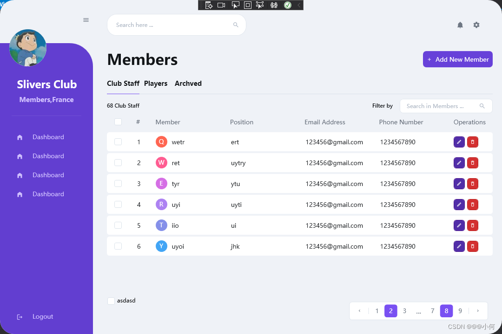
## 2.代码展示
需要安装一个包，来加载图标资源
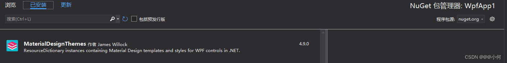
工程结构：
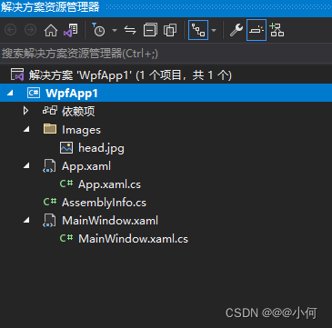
App.xaml：

```xml
<Application x:Class="WpfApp1.App"
             xmlns="http://schemas.microsoft.com/winfx/2006/xaml/presentation"
             xmlns:x="http://schemas.microsoft.com/winfx/2006/xaml"
             xmlns:local="clr-namespace:WpfApp1"
             xmlns:materialDesign="http://materialdesigninxaml.net/winfx/xaml/themes"
             StartupUri="MainWindow.xaml"
    xmlns:theme="clr-namespace:Microsoft.Windows.Themes;assembly=PresentationFramework.Aero2">
    <Application.Resources>
        
        <Style x:Key="topButton" TargetType="Button">
            <Setter Property="Background" Value="Transparent"/>
            <Setter Property="Foreground" Value="#6e7783"/>
            <Setter Property="FocusVisualStyle" Value="{x:Null}"/>
            <Setter Property="Width" Value="30"/>
            <Setter Property="Height" Value="30"/>
            <Setter Property="HorizontalAlignment" Value="Right"/>
            <Setter Property="Template">
                <Setter.Value>
                    <ControlTemplate TargetType="Button">
                        <Border Background="{TemplateBinding Background}" CornerRadius="50">
                            <ContentPresenter HorizontalAlignment="Center" VerticalAlignment="Center"/>
                        </Border>
                    </ControlTemplate>
                </Setter.Value>
            </Setter>

            <Style.Triggers>
                <Trigger Property="IsMouseOver" Value="True">
                    <Setter Property="Background" Value="#dcdcdc"/>
                </Trigger>
                
            </Style.Triggers>
        </Style>

        <Style x:Key="menuButton" TargetType="Button">
            <Setter Property="Background" Value="Transparent"/>
            <Setter Property="Foreground" Value="#d0c0ff"/>
            <Setter Property="FocusVisualStyle" Value="{x:Null}"/>
            <Setter Property="Height" Value="35"/>
            <Setter Property="Margin" Value="15 3"/>
            <Setter Property="FontSize" Value="13"/>
            <Setter Property="Template">
                <Setter.Value>
                    <ControlTemplate TargetType="Button">
                        <Border Background="{TemplateBinding Background}" CornerRadius="7">
                            <ContentPresenter HorizontalAlignment="Left" VerticalAlignment="Center"/>
                        </Border>
                    </ControlTemplate>
                </Setter.Value>
            </Setter>
            <Style.Triggers>
                <Trigger Property="IsMouseOver" Value="True">
                    <Setter Property="Background" Value="#7b5cd6"/>
                    <Setter Property="Foreground" Value="#ffffff"/>
                </Trigger>
            </Style.Triggers>
        </Style>

        <Style x:Key="menuButtonIcon" TargetType="materialDesign:PackIcon">
            <Setter Property="Width" Value="15"/>
            <Setter Property="Height" Value="15"/>
            <Setter Property="VerticalAlignment" Value="Center"/>
            <Setter Property="Margin" Value="20 2 20 0"/>
        </Style>

        <Style x:Key="textboxSearch" TargetType="TextBox">
            <Setter Property="Background" Value="#ffffff"/>
            <Setter Property="Foreground" Value="#b0b9c6"/>
            <Setter Property="BorderThickness" Value="0"/>
            <Setter Property="FontSize" Value="12"/>
            <Setter Property="Padding" Value="15"/>
            <Setter Property="Margin" Value="0 10"/>
            <Setter Property="Template">
                <Setter.Value>
                    <ControlTemplate TargetType="TextBox">
                        <Border x:Name="border" CornerRadius="20" Background="{TemplateBinding Background}" SnapsToDevicePixels="True" BorderThickness="1" BorderBrush="#e0e6ed">
                            <ScrollViewer x:Name="PART_ContentHost" Focusable="False" HorizontalScrollBarVisibility="Auto" VerticalScrollBarVisibility="Hidden"/>
                        </Border>
                        <ControlTemplate.Triggers>
                            <Trigger Property="IsMouseOver" Value="True">
                                <Setter Property="BorderBrush" Value="#d9d9d9" TargetName="border"/>
                            </Trigger>
                            <Trigger Property="IsKeyboardFocused" Value="True">
                                <Setter Property="BorderBrush" Value="#d9d9d9" TargetName="border"/>
                            </Trigger>
                        </ControlTemplate.Triggers>
                    </ControlTemplate>
                </Setter.Value>
            </Setter>
        </Style>

        <Style x:Key="addButton" TargetType="Button">
            <Setter Property="Background" Value="#6741d9"/>
            <Setter Property="Foreground" Value="#ffffff"/>
            <Setter Property="FocusVisualStyle" Value="{x:Null}"/>
            <Setter Property="Width" Value="150"/>
            <Setter Property="Height" Value="35"/>
            <Setter Property="HorizontalAlignment" Value="Right"/>
            <Setter Property="Margin" Value="0 20 0 0"/>
            <Setter Property="FontSize" Value="13"/>
            <Setter Property="Template">
                <Setter.Value>
                    <ControlTemplate TargetType="Button">
                        <Border Background="{TemplateBinding Background}" CornerRadius="7">
                            <ContentPresenter HorizontalAlignment="Center" VerticalAlignment="Center"/>
                        </Border>
                    </ControlTemplate>
                </Setter.Value>
            </Setter>
            <Style.Triggers>
                <Trigger Property="IsMouseOver" Value="True">
                    <Setter Property="Background" Value="#7b5cd6"/>
                    <Setter Property="Foreground" Value="#ffffff"/>
                </Trigger>
            </Style.Triggers>
        </Style>

        <Style x:Key="tabButton" TargetType="Button">
            <Setter Property="Background" Value="Transparent"/>
            <Setter Property="Foreground" Value="#121518"/>
            <Setter Property="FocusVisualStyle" Value="{x:Null}"/>
            <Setter Property="Width" Value="70"/>
            <Setter Property="Height" Value="45"/>
            <Setter Property="BorderBrush" Value="Transparent"/>
            <Setter Property="FontSize" Value="14"/>
            <Setter Property="FontWeight" Value="SemiBold"/>
            <Setter Property="Template">
                <Setter.Value>
                    <ControlTemplate TargetType="Button">
                        <Border Background="{TemplateBinding Background}" BorderThickness="0 0 0 1" BorderBrush="{TemplateBinding BorderBrush}">
                            <ContentPresenter HorizontalAlignment="Center" VerticalAlignment="Center"/>
                        </Border>
                    </ControlTemplate>
                </Setter.Value>
            </Setter>
            <Style.Triggers>
                <Trigger Property="IsMouseOver" Value="True">
                    <Setter Property="BorderBrush" Value="#784ff2"/>
                </Trigger>
            </Style.Triggers>
        </Style>

        <Style x:Key="textBoxFilter" TargetType="TextBox">
            <Setter Property="Padding" Value="10 7"/>
            <Setter Property="Template">
                <Setter.Value>
                    <ControlTemplate TargetType="TextBox">
                        <Border x:Name="border" CornerRadius="7" Background="{TemplateBinding Background}" SnapsToDevicePixels="True" BorderThickness="1" BorderBrush="#e0e6ed">
                            <ScrollViewer x:Name="PART_ContentHost" Focusable="False" HorizontalScrollBarVisibility="Auto" VerticalScrollBarVisibility="Hidden"/>
                        </Border>
                        <ControlTemplate.Triggers>
                            <Trigger Property="IsMouseOver" Value="True">
                                <Setter Property="BorderBrush" Value="#d9d9d9" TargetName="border"/>
                            </Trigger>
                            <Trigger Property="IsKeyboardFocused" Value="True">
                                <Setter Property="BorderBrush" Value="#d9d9d9" TargetName="border"/>
                            </Trigger>
                        </ControlTemplate.Triggers>
                    </ControlTemplate>
                </Setter.Value>
            </Setter>
        </Style>


        <Style x:Key="pagingButton" TargetType="Button">
            <Setter Property="Background" Value="Transparent"/>
            <Setter Property="Foreground" Value="#6c7682"/>
            <Setter Property="FocusVisualStyle" Value="{x:Null}"/>
            <Setter Property="FontSize" Value="13"/>
            <Setter Property="Margin" Value="1 0"/>
            <Setter Property="Template">
                <Setter.Value>
                    <ControlTemplate TargetType="Button">
                        <Border Background="{TemplateBinding Background}" CornerRadius="5" Padding="10 5">
                            <ContentPresenter HorizontalAlignment="Center" VerticalAlignment="Center" Margin="0 0 0 1"/>
                        </Border>
                    </ControlTemplate>
                </Setter.Value>
            </Setter>
            <Style.Triggers>
                <Trigger Property="IsMouseOver" Value="True">
                    <Setter Property="Background" Value="#7950f2"/>
                    <Setter Property="Foreground" Value="#ffffff"/>
                </Trigger>
            </Style.Triggers>
        </Style>

        <Style x:Key="pagingButtonIcon" TargetType="materialDesign:PackIcon">
            <Setter Property="Width" Value="10"/>
            <Setter Property="Height" Value="10"/>
            <Setter Property="VerticalAlignment" Value="Center"/>
        </Style>

        <Style x:Key="gridEditButton" TargetType="Button">
            <Setter Property="Background" Value="#512da8"/>
            <Setter Property="BorderBrush" Value="#4a148c"/>
            <Setter Property="Foreground" Value="#ffffff"/>
            <Setter Property="FocusVisualStyle" Value="{x:Null}"/>
            <Setter Property="VerticalAlignment" Value="Center"/>
            <Setter Property="Template">
                <Setter.Value>
                    <ControlTemplate TargetType="Button">
                        <Border Background="{TemplateBinding Background}" CornerRadius="5" Padding="5" BorderThickness="1" BorderBrush="{TemplateBinding BorderBrush}">
                            <ContentPresenter HorizontalAlignment="Center" VerticalAlignment="Center"/>
                        </Border>
                    </ControlTemplate>
                </Setter.Value>
            </Setter>
            <Style.Triggers>
                <Trigger Property="IsMouseOver" Value="True">
                    <Setter Property="Background" Value="#673ab7"/>
                </Trigger>
            </Style.Triggers>
        </Style>

        <Style x:Key="gridRemoveButton" TargetType="Button" BasedOn="{StaticResource gridEditButton}">
            <Setter Property="Background" Value="#d32f2f"/>
            <Setter Property="BorderBrush" Value="#b71c1c"/>
            <Style.Triggers>
                <Trigger Property="IsMouseOver" Value="True">
                    <Setter Property="Background" Value="#f44336"/>
                </Trigger>
            </Style.Triggers>
        </Style>

        <Style x:Key="gridButtonIcon" TargetType="materialDesign:PackIcon">
            <Setter Property="Width" Value="12"/>
            <Setter Property="Height" Value="12"/>
            <Setter Property="VerticalAlignment" Value="Center"/>
        </Style>
        
        <!-- Region DataGrid Style-->
        <SolidColorBrush x:Key="{x:Static DataGrid.FocusBorderBrushKey}" Color="#FF000000"/>
        <Style x:Key="{ComponentResourceKey ResourceId=DataGridSelectAllButtonStyle, TypeInTargetAssembly={x:Type DataGrid}}" TargetType="{x:Type Button}">
            <Setter Property="Template">
                <Setter.Value>
                    <ControlTemplate TargetType="{x:Type Button}">
                        <Grid>
                            <Rectangle x:Name="Border" Fill="{DynamicResource {x:Static SystemColors.ControlBrushKey}}" SnapsToDevicePixels="True"/>
                            <Polygon x:Name="Arrow" Fill="Black" HorizontalAlignment="Right" Margin="8,8,3,3" Opacity="0.15" Points="0,10 10,10 10,0" Stretch="Uniform" VerticalAlignment="Bottom"/>
                        </Grid>
                        <ControlTemplate.Triggers>
                            <Trigger Property="IsMouseOver" Value="True">
                                <Setter Property="Stroke" TargetName="Border" Value="{DynamicResource {x:Static SystemColors.ControlDarkBrushKey}}"/>
                            </Trigger>
                            <Trigger Property="IsPressed" Value="True">
                                <Setter Property="Fill" TargetName="Border" Value="{DynamicResource {x:Static SystemColors.ControlDarkBrushKey}}"/>
                            </Trigger>
                            <Trigger Property="IsEnabled" Value="False">
                                <Setter Property="Visibility" TargetName="Arrow" Value="Collapsed"/>
                            </Trigger>
                        </ControlTemplate.Triggers>
                    </ControlTemplate>
                </Setter.Value>
            </Setter>
        </Style>
        <Style x:Key="DataGridStyle1" TargetType="{x:Type DataGrid}">
            <Setter Property="Background" Value="Transparent"/>
            <Setter Property="Foreground" Value="#222528"/>
            <Setter Property="BorderThickness" Value="0"/>
            <Setter Property="RowDetailsVisibilityMode" Value="VisibleWhenSelected"/>
            <Setter Property="ScrollViewer.CanContentScroll" Value="true"/>
            <Setter Property="ScrollViewer.PanningMode" Value="Both"/>
            <Setter Property="Stylus.IsFlicksEnabled" Value="False"/>
            <Setter Property="AutoGenerateColumns" Value="False"/>
            <Setter Property="HeadersVisibility" Value="Column"/>
            <Setter Property="Margin" Value="0 10 0 0"/>
            <Setter Property="SelectionMode" Value="Single"/>
            <Setter Property="SelectionUnit" Value="FullRow"/>
            <Setter Property="CanUserAddRows" Value="False"/>
            <Setter Property="CanUserDeleteRows" Value="False"/>
            <Setter Property="CanUserReorderColumns" Value="False"/>
            <Setter Property="FontSize" Value="13"/>
            <Setter Property="ColumnWidth" Value="*"/>
            <Setter Property="GridLinesVisibility" Value="None"/>

            <Setter Property="Template">
                <Setter.Value>
                    <ControlTemplate TargetType="{x:Type DataGrid}">
                        <Border Background="{TemplateBinding Background}" BorderBrush="{TemplateBinding BorderBrush}" BorderThickness="{TemplateBinding BorderThickness}" Padding="{TemplateBinding Padding}" SnapsToDevicePixels="True">
                            <ScrollViewer x:Name="DG_ScrollViewer" Focusable="false">
                                <ScrollViewer.Template>
                                    <ControlTemplate TargetType="{x:Type ScrollViewer}">
                                        <Grid>
                                            <Grid.ColumnDefinitions>
                                                <ColumnDefinition Width="Auto"/>
                                                <ColumnDefinition Width="*"/>
                                                <ColumnDefinition Width="Auto"/>
                                            </Grid.ColumnDefinitions>
                                            <Grid.RowDefinitions>
                                                <RowDefinition Height="Auto"/>
                                                <RowDefinition Height="*"/>
                                                <RowDefinition Height="Auto"/>
                                            </Grid.RowDefinitions>
                                            <Button Command="{x:Static DataGrid.SelectAllCommand}" Focusable="false" Style="{DynamicResource {ComponentResourceKey ResourceId=DataGridSelectAllButtonStyle, TypeInTargetAssembly={x:Type DataGrid}}}" Visibility="{Binding HeadersVisibility, ConverterParameter={x:Static DataGridHeadersVisibility.All}, Converter={x:Static DataGrid.HeadersVisibilityConverter}, RelativeSource={RelativeSource AncestorType={x:Type DataGrid}}}" Width="{Binding CellsPanelHorizontalOffset, RelativeSource={RelativeSource AncestorType={x:Type DataGrid}}}"/>
                                            <DataGridColumnHeadersPresenter x:Name="PART_ColumnHeadersPresenter" Grid.Column="1" Visibility="{Binding HeadersVisibility, ConverterParameter={x:Static DataGridHeadersVisibility.Column}, Converter={x:Static DataGrid.HeadersVisibilityConverter}, RelativeSource={RelativeSource AncestorType={x:Type DataGrid}}}"/>
                                            <ScrollContentPresenter x:Name="PART_ScrollContentPresenter" CanContentScroll="{TemplateBinding CanContentScroll}" Grid.ColumnSpan="2" Grid.Row="1"/>
                                            <ScrollBar x:Name="PART_VerticalScrollBar" Grid.Column="2" Maximum="{TemplateBinding ScrollableHeight}" Orientation="Vertical" Grid.Row="1" Value="{Binding VerticalOffset, Mode=OneWay, RelativeSource={RelativeSource TemplatedParent}}" ViewportSize="{TemplateBinding ViewportHeight}" Visibility="{TemplateBinding ComputedVerticalScrollBarVisibility}"/>
                                            <Grid Grid.Column="1" Grid.Row="2">
                                                <Grid.ColumnDefinitions>
                                                    <ColumnDefinition Width="{Binding NonFrozenColumnsViewportHorizontalOffset, RelativeSource={RelativeSource AncestorType={x:Type DataGrid}}}"/>
                                                    <ColumnDefinition Width="*"/>
                                                </Grid.ColumnDefinitions>
                                                <ScrollBar x:Name="PART_HorizontalScrollBar" Grid.Column="1" Maximum="{TemplateBinding ScrollableWidth}" Orientation="Horizontal" Value="{Binding HorizontalOffset, Mode=OneWay, RelativeSource={RelativeSource TemplatedParent}}" ViewportSize="{TemplateBinding ViewportWidth}" Visibility="{TemplateBinding ComputedHorizontalScrollBarVisibility}"/>
                                            </Grid>
                                        </Grid>
                                    </ControlTemplate>
                                </ScrollViewer.Template>
                                <ItemsPresenter SnapsToDevicePixels="{TemplateBinding SnapsToDevicePixels}"/>
                            </ScrollViewer>
                        </Border>
                    </ControlTemplate>
                </Setter.Value>
            </Setter>
            <Style.Triggers>
                <MultiTrigger>
                    <MultiTrigger.Conditions>
                        <Condition Property="IsGrouping" Value="true"/>
                        <Condition Property="VirtualizingPanel.IsVirtualizingWhenGrouping" Value="false"/>
                    </MultiTrigger.Conditions>
                    <Setter Property="ScrollViewer.CanContentScroll" Value="false"/>
                </MultiTrigger>
            </Style.Triggers>
        </Style>
        <Style x:Key="DataGridCellStyle1" TargetType="{x:Type DataGridCell}">
            <Setter Property="Background" Value="Transparent"/>
            <Setter Property="VerticalAlignment" Value="Center"/>
            <Setter Property="FocusVisualStyle" Value="{x:Null}"/>
            <Setter Property="Margin" Value="15 0"/>
            <Setter Property="Template">
                <Setter.Value>
                    <ControlTemplate TargetType="{x:Type DataGridCell}">
                        <Border Background="{TemplateBinding Background}" BorderThickness="0" SnapsToDevicePixels="True">
                            <ContentPresenter SnapsToDevicePixels="{TemplateBinding SnapsToDevicePixels}"/>
                        </Border>
                    </ControlTemplate>
                </Setter.Value>
            </Setter>
        </Style>
        <Style x:Key="ColumnHeaderGripperStyle" TargetType="{x:Type Thumb}">
            <Setter Property="Width" Value="8"/>
            <Setter Property="Background" Value="Transparent"/>
            <Setter Property="Cursor" Value="SizeWE"/>
            <Setter Property="Template">
                <Setter.Value>
                    <ControlTemplate TargetType="{x:Type Thumb}">
                        <Border Background="{TemplateBinding Background}" Padding="{TemplateBinding Padding}"/>
                    </ControlTemplate>
                </Setter.Value>
            </Setter>
        </Style>
        <Style x:Key="DataGridColumnHeaderStyle1" TargetType="{x:Type DataGridColumnHeader}">
            <Setter Property="VerticalContentAlignment" Value="Center"/>
            <Setter Property="Background" Value="Transparent"/>
            <Setter Property="Foreground" Value="#69717d"/>
            <Setter Property="Margin" Value="15 0 15 10"/>
            <Setter Property="Template">
                <Setter.Value>
                    <ControlTemplate TargetType="{x:Type DataGridColumnHeader}">
                        <Grid>
                            <theme:DataGridHeaderBorder Background="{TemplateBinding Background}" BorderBrush="{TemplateBinding BorderBrush}" BorderThickness="{TemplateBinding BorderThickness}" IsPressed="{TemplateBinding IsPressed}" IsHovered="{TemplateBinding IsMouseOver}" IsClickable="{TemplateBinding CanUserSort}" Padding="{TemplateBinding Padding}" SortDirection="{TemplateBinding SortDirection}" SeparatorVisibility="{TemplateBinding SeparatorVisibility}" SeparatorBrush="{TemplateBinding SeparatorBrush}">
                                <ContentPresenter HorizontalAlignment="{TemplateBinding HorizontalContentAlignment}" RecognizesAccessKey="True" SnapsToDevicePixels="{TemplateBinding SnapsToDevicePixels}" VerticalAlignment="{TemplateBinding VerticalContentAlignment}"/>
                            </theme:DataGridHeaderBorder>
                            <Thumb x:Name="PART_LeftHeaderGripper" HorizontalAlignment="Left" Style="{StaticResource ColumnHeaderGripperStyle}"/>
                            <Thumb x:Name="PART_RightHeaderGripper" HorizontalAlignment="Right" Style="{StaticResource ColumnHeaderGripperStyle}"/>
                        </Grid>
                    </ControlTemplate>
                </Setter.Value>
            </Setter>
        </Style>
        <Style x:Key="DataGridRowStyle1" TargetType="{x:Type DataGridRow}">
            <Setter Property="Background" Value="White"/>
            <Setter Property="Margin" Value="0 4 0 0"/>
            <Setter Property="SnapsToDevicePixels" Value="true"/>
            <Setter Property="Validation.ErrorTemplate" Value="{x:Null}"/>
            <Setter Property="ValidationErrorTemplate">
                <Setter.Value>
                    <ControlTemplate>
                        <TextBlock Foreground="Red" Margin="2,0,0,0" Text="!" VerticalAlignment="Center"/>
                    </ControlTemplate>
                </Setter.Value>
            </Setter>
            <Setter Property="Template">
                <Setter.Value>
                    <ControlTemplate TargetType="{x:Type DataGridRow}">
                        <Border x:Name="DGR_Border" Padding="0 8" Background="{TemplateBinding Background}" CornerRadius="5" BorderThickness="0" SnapsToDevicePixels="True">
                            <SelectiveScrollingGrid>
                                <SelectiveScrollingGrid.ColumnDefinitions>
                                    <ColumnDefinition Width="Auto"/>
                                    <ColumnDefinition Width="*"/>
                                </SelectiveScrollingGrid.ColumnDefinitions>
                                <SelectiveScrollingGrid.RowDefinitions>
                                    <RowDefinition Height="*"/>
                                    <RowDefinition Height="Auto"/>
                                </SelectiveScrollingGrid.RowDefinitions>
                                <DataGridCellsPresenter Grid.Column="1" ItemsPanel="{TemplateBinding ItemsPanel}" SnapsToDevicePixels="{TemplateBinding SnapsToDevicePixels}"/>
                                <DataGridDetailsPresenter Grid.Column="1" Grid.Row="1" SelectiveScrollingGrid.SelectiveScrollingOrientation="{Binding AreRowDetailsFrozen, ConverterParameter={x:Static SelectiveScrollingOrientation.Vertical}, Converter={x:Static DataGrid.RowDetailsScrollingConverter}, RelativeSource={RelativeSource AncestorType={x:Type DataGrid}}}" Visibility="{TemplateBinding DetailsVisibility}"/>
                                <DataGridRowHeader Grid.RowSpan="2" SelectiveScrollingGrid.SelectiveScrollingOrientation="Vertical" Visibility="{Binding HeadersVisibility, ConverterParameter={x:Static DataGridHeadersVisibility.Row}, Converter={x:Static DataGrid.HeadersVisibilityConverter}, RelativeSource={RelativeSource AncestorType={x:Type DataGrid}}}"/>
                            </SelectiveScrollingGrid>
                        </Border>
                    </ControlTemplate>
                </Setter.Value>
            </Setter>
            <Style.Triggers>
                <Trigger Property="IsMouseOver" Value="True">
                    <Setter Property="Background" Value="#623ed0"/>
                    <Setter Property="Foreground" Value="#ffffff"/>
                </Trigger>

                <Trigger Property="IsSelected" Value="True">
                    <Setter Property="Background" Value="#623ed0"/>
                    <Setter Property="Foreground" Value="#ffffff"/>
                </Trigger>

                <MultiTrigger>
                    <MultiTrigger.Conditions>
                        <Condition Property="IsSelected" Value="True"/>
                        <Condition Property="Selector.IsSelectionActive" Value="False"/>
                    </MultiTrigger.Conditions>
                    <Setter Property="Background" Value="#dfdfdf"/>
                </MultiTrigger>
                
            </Style.Triggers>
        </Style>

        <!--EndRegion-->


        <!--#region CheckBoxStyle-->
        <SolidColorBrush x:Key="OptionMark.Static.Background" Color="#FFFFFFFF"/>
        <SolidColorBrush x:Key="OptionMark.Static.Border" Color="#FF707070"/>
        <SolidColorBrush x:Key="OptionMark.Static.Glyph" Color="#FF212121"/>
        <SolidColorBrush x:Key="OptionMark.MouseOver.Background" Color="#FFF3F9FF"/>
        <SolidColorBrush x:Key="OptionMark.MouseOver.Border" Color="#FF5593FF"/>
        <SolidColorBrush x:Key="OptionMark.MouseOver.Glyph" Color="#FF212121"/>
        <SolidColorBrush x:Key="OptionMark.Pressed.Background" Color="#FFD9ECFF"/>
        <SolidColorBrush x:Key="OptionMark.Pressed.Border" Color="#FF3C77DD"/>
        <SolidColorBrush x:Key="OptionMark.Pressed.Glyph" Color="#FF212121"/>
        <SolidColorBrush x:Key="OptionMark.Disabled.Background" Color="#FFE6E6E6"/>
        <SolidColorBrush x:Key="OptionMark.Disabled.Border" Color="#FFBCBCBC"/>
        <SolidColorBrush x:Key="OptionMark.Disabled.Glyph" Color="#FF707070"/>
        <Style x:Key="CheckBoxStyle1" TargetType="{x:Type CheckBox}">
            <Setter Property="Background" Value="{StaticResource OptionMark.Static.Background}"/>
            <Setter Property="BorderBrush" Value="#dae2ea"/>
            <Setter Property="Foreground" Value="{DynamicResource {x:Static SystemColors.ControlTextBrushKey}}"/>
            <Setter Property="BorderThickness" Value="1"/>
            <Setter Property="Template">
                <Setter.Value>
                    <ControlTemplate TargetType="{x:Type CheckBox}">
                        <Grid x:Name="templateRoot" Background="Transparent" SnapsToDevicePixels="True">
                            <Grid.ColumnDefinitions>
                                <ColumnDefinition Width="Auto"/>
                                <ColumnDefinition Width="*"/>
                            </Grid.ColumnDefinitions>
                            <Border x:Name="checkBoxBorder" CornerRadius="3" Padding="1" Background="{TemplateBinding Background}" BorderBrush="{TemplateBinding BorderBrush}" BorderThickness="{TemplateBinding BorderThickness}" HorizontalAlignment="{TemplateBinding HorizontalContentAlignment}" Margin="1" VerticalAlignment="{TemplateBinding VerticalContentAlignment}">
                                <Grid x:Name="markGrid">
                                    <Path x:Name="optionMark" Data="F1 M 9.97498,1.22334L 4.6983,9.09834L 4.52164,9.09834L 0,5.19331L 1.27664,3.52165L 4.255,6.08833L 8.33331,1.52588e-005L 9.97498,1.22334 Z " Fill="{StaticResource OptionMark.Static.Glyph}" Margin="1" Opacity="0" Stretch="None"/>
                                    <Rectangle x:Name="indeterminateMark" Fill="{StaticResource OptionMark.Static.Glyph}" Margin="2" Opacity="0"/>
                                </Grid>
                            </Border>
                            <ContentPresenter x:Name="contentPresenter" Grid.Column="1" Focusable="False" HorizontalAlignment="{TemplateBinding HorizontalContentAlignment}" Margin="{TemplateBinding Padding}" RecognizesAccessKey="True" SnapsToDevicePixels="{TemplateBinding SnapsToDevicePixels}" VerticalAlignment="{TemplateBinding VerticalContentAlignment}"/>
                        </Grid>
                        <ControlTemplate.Triggers>
                            <Trigger Property="HasContent" Value="true">
                                <Setter Property="FocusVisualStyle" Value="{x:Null}"/>
                                <Setter Property="Padding" Value="4,-1,0,0"/>
                            </Trigger>
                            <Trigger Property="IsMouseOver" Value="true">
                                <Setter Property="Background" TargetName="checkBoxBorder" Value="{StaticResource OptionMark.MouseOver.Background}"/>
                                <Setter Property="BorderBrush" TargetName="checkBoxBorder" Value="#9575cd"/>
                                <Setter Property="Fill" TargetName="optionMark" Value="{StaticResource OptionMark.MouseOver.Glyph}"/>
                                <Setter Property="Fill" TargetName="indeterminateMark" Value="{StaticResource OptionMark.MouseOver.Glyph}"/>
                            </Trigger>
                            <Trigger Property="IsEnabled" Value="false">
                                <Setter Property="Background" TargetName="checkBoxBorder" Value="{StaticResource OptionMark.Disabled.Background}"/>
                                <Setter Property="BorderBrush" TargetName="checkBoxBorder" Value="{StaticResource OptionMark.Disabled.Border}"/>
                                <Setter Property="Fill" TargetName="optionMark" Value="{StaticResource OptionMark.Disabled.Glyph}"/>
                                <Setter Property="Fill" TargetName="indeterminateMark" Value="{StaticResource OptionMark.Disabled.Glyph}"/>
                            </Trigger>
                            <Trigger Property="IsPressed" Value="true">
                                <Setter Property="Background" TargetName="checkBoxBorder" Value="{StaticResource OptionMark.Pressed.Background}"/>
                                <Setter Property="BorderBrush" TargetName="checkBoxBorder" Value="#9575cd"/>
                                <Setter Property="Fill" TargetName="optionMark" Value="{StaticResource OptionMark.Pressed.Glyph}"/>
                                <Setter Property="Fill" TargetName="indeterminateMark" Value="{StaticResource OptionMark.Pressed.Glyph}"/>
                            </Trigger>
                            <Trigger Property="IsChecked" Value="true">
                                <Setter Property="Opacity" TargetName="optionMark" Value="1"/>
                                <Setter Property="Opacity" TargetName="indeterminateMark" Value="0"/>
                            </Trigger>
                            <Trigger Property="IsChecked" Value="{x:Null}">
                                <Setter Property="Opacity" TargetName="optionMark" Value="0"/>
                                <Setter Property="Opacity" TargetName="indeterminateMark" Value="1"/>
                            </Trigger>
                        </ControlTemplate.Triggers>
                    </ControlTemplate>
                </Setter.Value>
            </Setter>
        </Style>
        <!--#endregion-->


    </Application.Resources>
</Application>

```
App.xaml.cs：

```csharp
using System;
using System.Collections.Generic;
using System.Configuration;
using System.Data;
using System.Linq;
using System.Threading.Tasks;
using System.Windows;

namespace WpfApp1
{
	/// <summary>
	/// Interaction logic for App.xaml
	/// </summary>
	public partial class App : Application
	{
	}
}

```
MainWindow.xaml：

```csharp
<Window x:Class="WpfApp1.MainWindow"
        xmlns="http://schemas.microsoft.com/winfx/2006/xaml/presentation"
        xmlns:x="http://schemas.microsoft.com/winfx/2006/xaml"
        xmlns:d="http://schemas.microsoft.com/expression/blend/2008"
        xmlns:mc="http://schemas.openxmlformats.org/markup-compatibility/2006"
        xmlns:local="clr-namespace:WpfApp1"
        xmlns:materialDesign="http://materialdesigninxaml.net/winfx/xaml/themes"
        mc:Ignorable="d"
        Title="MainWindow" Height="720" Width="1080" AllowsTransparency="True" Background="Transparent" WindowStartupLocation="CenterScreen" WindowStyle="None">

    <Window.Resources>
        <BooleanToVisibilityConverter x:Key="BoolToVis"/>
        <SolidColorBrush x:Key="{x:Static DataGrid.FocusBorderBrushKey}" Color="#FF000000"/>
    </Window.Resources>
    
    <Border Background="#eff2f7" CornerRadius="30" MouseDown="Border_MouseDown" MouseLeftButtonDown="Border_MouseLeftButtonDown">
        <Grid>
            <Grid.ColumnDefinitions>
                <ColumnDefinition Width="200"/>
                <ColumnDefinition Width="*"/>
            </Grid.ColumnDefinitions>

            <Grid Grid.Column="0">
                <Grid.RowDefinitions>
                    <RowDefinition Height="Auto"/>
                    <RowDefinition Height="*"/>
                </Grid.RowDefinitions>
                
                <Button Style="{StaticResource topButton}" Margin="20 28 0 35">
                    <materialDesign:PackIcon Kind="Menu" Width="15" Height="15"/>
                </Button>
                <Border Grid.Row="1" Background="#623ed0" CornerRadius="0 50 0 30">
                    <DockPanel>
                        <Border Width="80" Height="80" Background="White" CornerRadius="100" DockPanel.Dock="Top" HorizontalAlignment="Left" Margin="20 -30 0 0">
                            <Ellipse>
                                <Ellipse.Fill>
                                    <ImageBrush ImageSource="/Images/head.jpg"/>
                                </Ellipse.Fill>
                            </Ellipse>
                        </Border>

                        <TextBlock Text="Slivers Club" Foreground="White" FontSize="22" FontWeight="SemiBold" DockPanel.Dock="Top" TextAlignment="Center" Margin="2 25 0 10"/>
                        <TextBlock Text="Members,France" Foreground="#d0bfff" FontSize="14" FontWeight="SemiBold" DockPanel.Dock="Top" TextAlignment="Center" />
                        <Separator Margin="25" DockPanel.Dock="Top" Height="0.8" Background="#7e5fdc"/>
                       
                        <StackPanel DockPanel.Dock="Top">
                            
                            <Button Style="{StaticResource menuButton}">
                                <StackPanel Orientation="Horizontal">
                                    <materialDesign:PackIcon Kind="HomeVariant" Style="{StaticResource menuButtonIcon}"/>
                                    <TextBlock Text="Dashboard"/>
                                </StackPanel>
                            </Button>

                            <Button Style="{StaticResource menuButton}">
                                <StackPanel Orientation="Horizontal">
                                    <materialDesign:PackIcon Kind="HomeVariant" Style="{StaticResource menuButtonIcon}"/>
                                    <TextBlock Text="Dashboard"/>
                                </StackPanel>
                            </Button>

                            <Button Style="{StaticResource menuButton}">
                                <StackPanel Orientation="Horizontal">
                                    <materialDesign:PackIcon Kind="HomeVariant" Style="{StaticResource menuButtonIcon}"/>
                                    <TextBlock Text="Dashboard"/>
                                </StackPanel>
                            </Button>

                            <Button Style="{StaticResource menuButton}">
                                <StackPanel Orientation="Horizontal">
                                    <materialDesign:PackIcon Kind="HomeVariant" Style="{StaticResource menuButtonIcon}"/>
                                    <TextBlock Text="Dashboard"/>
                                </StackPanel>
                            </Button>
                            
                        </StackPanel>

                        <Button Style="{StaticResource menuButton}" VerticalAlignment="Bottom" DockPanel.Dock="Bottom" Margin="15 0 15 20">
                            <StackPanel Orientation="Horizontal">
                                <materialDesign:PackIcon Kind="Logout" Style="{StaticResource menuButtonIcon}"/>
                                <TextBlock Text="Logout"/>
                            </StackPanel>
                        </Button>

                    </DockPanel>
                </Border>
            </Grid>

            <Grid Grid.Column="1" Margin="30 20 20 20">
                <Grid.RowDefinitions>
                    <RowDefinition Height="Auto"/>
                    <RowDefinition Height="Auto"/>
                    <RowDefinition Height="Auto"/>
                    <RowDefinition Height="Auto"/>
                    <RowDefinition Height="Auto"/>
                    <RowDefinition Height="*"/>
                    <RowDefinition Height="Auto"/>
                </Grid.RowDefinitions>

                <Grid Width="300" HorizontalAlignment="Left" Grid.Row="0">
                    <TextBlock Margin="20 0" VerticalAlignment="Center" Foreground="#b0b9c6"  IsHitTestVisible="False" Panel.ZIndex="1" Text="Search here ..." Visibility="{Binding ElementName=txtSearch,Path=Text.IsEmpty,Converter={StaticResource BoolToVis}}"/>
                    <TextBox x:Name="txtSearch" Style="{StaticResource textboxSearch}"/>
                    <materialDesign:PackIcon Kind="Magnify" Width="15" Height="15" VerticalAlignment="Center" Margin="0 0 15 0" Foreground="#b0b9c6" HorizontalAlignment="Right"/>
                </Grid>

                <Button Style="{StaticResource topButton}" Margin="0 0 20 0"  Grid.Row="0">
                    <materialDesign:PackIcon Kind="Cog"/>
                </Button>

                <Button Style="{StaticResource topButton}"  Grid.Row="0" Margin="0 0 55 0" HorizontalAlignment="Right">
                    <materialDesign:PackIcon Kind="Bell"/>
                </Button>

                <TextBlock Text="Members" Grid.Row="1" FontSize="32" FontWeight="SemiBold" Margin="0 20 0 0" HorizontalAlignment="Left" Foreground="#121518"/>

                <Button Style="{StaticResource addButton}"  Grid.Row="1">
                    <StackPanel Orientation="Horizontal">
                        <materialDesign:PackIcon Kind="Plus" VerticalAlignment="Center" Width="11" Height="11" Margin="0 1 8 0"/>
                        <TextBlock Text="Add New Member"/>
                    </StackPanel>
                </Button>

                <Separator Height="1" Grid.Row="3" Background="#dae2ea" Margin="0 -1 0 10"/>

                <StackPanel Grid.Row="2" Orientation="Horizontal" Margin="0 10 0 0">
                    <Button Content="Club Staff" Style="{StaticResource tabButton}" BorderBrush="#784ff2"/>
                    <Button Content="Players" Style="{StaticResource tabButton}"/>
                    <Button Content="Archved" Style="{StaticResource tabButton}"/>
                </StackPanel>

                <TextBlock Text="68 Club Staff" Grid.Row="4" FontFamily="18" FontWeight="SemiBold" Foreground="#121518" HorizontalAlignment="Left" VerticalAlignment="Center"/>
                <TextBlock Text="Filter by" Grid.Row="4" FontFamily="13" Margin="0 0 215 0" FontWeight="SemiBold" Foreground="#121518" HorizontalAlignment="Right" VerticalAlignment="Center"/>
              
                <Grid Width="200" HorizontalAlignment="Right" Grid.Row="4">
                    <TextBlock Margin="15 0" VerticalAlignment="Center" Foreground="#b0b9c6"  IsHitTestVisible="False" Panel.ZIndex="1" Text="Search in Members ..." Visibility="{Binding ElementName=txtFilter,Path=Text.IsEmpty,Converter={StaticResource BoolToVis}}"/>
                    <TextBox x:Name="txtFilter" Style="{StaticResource textBoxFilter}"/>
                    <materialDesign:PackIcon Kind="Magnify" Width="15" Height="15" VerticalAlignment="Center" Margin="0 0 15 0" Foreground="#b0b9c6" HorizontalAlignment="Right"/>
                </Grid>
                <CheckBox Style="{DynamicResource CheckBoxStyle1}" Grid.Row="6" Content="asdasd"/>

                <DataGrid x:Name="membersDataGrid" Style="{DynamicResource DataGridStyle1}" CellStyle="{DynamicResource DataGridCellStyle1}"  ColumnHeaderStyle="{DynamicResource DataGridColumnHeaderStyle1}" RowStyle="{DynamicResource DataGridRowStyle1}" Grid.Row="5">
                    <DataGrid.Columns>
                        <DataGridCheckBoxColumn CanUserReorder="False" Width="Auto" ElementStyle="{StaticResource CheckBoxStyle1}">
                            <DataGridCheckBoxColumn.HeaderTemplate>
                                <DataTemplate>
                                    <CheckBox Style="{StaticResource CheckBoxStyle1}"/>
                                </DataTemplate>
                            </DataGridCheckBoxColumn.HeaderTemplate>
                        </DataGridCheckBoxColumn>

                        <DataGridTextColumn Binding="{Binding Number}" Header="#"  IsReadOnly="True" CanUserResize="False" Width="Auto"/>

                        <DataGridTemplateColumn Header="Member" IsReadOnly="True" Width="*">
                            <DataGridTemplateColumn.CellTemplate>
                                <DataTemplate>
                                    <StackPanel Orientation="Horizontal">
                                        <Border Background="{Binding BgColor}" Width="25" Height="25" CornerRadius="50"  Margin="0 0 10 0">
                                            <TextBlock Text="{Binding Character}" VerticalAlignment="Center" HorizontalAlignment="Center" Foreground="White" Margin="0 0 0 1" />
                                        </Border>
                                        <TextBlock Text="{Binding Name}" VerticalAlignment="Center"/>
                                    </StackPanel>
                                </DataTemplate>
                            </DataGridTemplateColumn.CellTemplate>
                        </DataGridTemplateColumn>

                        <DataGridTextColumn Header="Position" IsReadOnly="True" Width="*" Binding="{Binding Position}"/>
                        <DataGridTextColumn Header="Email Address" IsReadOnly="True" Width="*" Binding="{Binding Email}"/>
                        <DataGridTextColumn Header="Phone Number" IsReadOnly="True" Width="*" Binding="{Binding Phone}"/>

                        <DataGridTemplateColumn Header="Operations" IsReadOnly="True" Width="Auto">
                            <DataGridTemplateColumn.CellTemplate>
                                <DataTemplate>
                                    <StackPanel Orientation="Horizontal">
                                        <Button Style="{StaticResource gridEditButton}">
                                            <materialDesign:PackIcon Kind="PencilOutline" Style="{StaticResource gridButtonIcon}"/>
                                        </Button>
                                        <Button Style="{StaticResource gridRemoveButton}" Margin="5 0 0 0">
                                            <materialDesign:PackIcon Kind="DeleteOutline" Style="{StaticResource gridButtonIcon}"/>
                                        </Button>
                                    </StackPanel>
                                </DataTemplate>
                            </DataGridTemplateColumn.CellTemplate>
                        </DataGridTemplateColumn>
    
    
                    </DataGrid.Columns>
                </DataGrid>
                
                
                <Border Grid.Row="6" HorizontalAlignment="Right" BorderBrush="#dee4ec" BorderThickness="1" CornerRadius="5" Padding="5" Background="White" Margin="0 10 10 10">
                    <StackPanel Orientation="Horizontal">
                        <Button Style="{StaticResource pagingButton}">
                            <materialDesign:PackIcon Kind="ChevronLeft" Style="{StaticResource pagingButtonIcon}"/>
                        </Button>
                        <Rectangle Width="1" Fill="#dee4ec" Margin="3 7"/>
                        <Button Style="{StaticResource pagingButton}" Content="1"/>
                        <Button Style="{StaticResource pagingButton}" Content="2" Background="#7950f2" Foreground="#ffffff"/>
                        <Button Style="{StaticResource pagingButton}" Content="3"/>
                        <TextBlock Text="..." Foreground="#6c7682" VerticalAlignment="Center" FontSize="15" Margin="10 0"/>
                        <Button Style="{StaticResource pagingButton}" Content="7"/>
                        <Button Style="{StaticResource pagingButton}" Content="8" Background="#7950f2" Foreground="#ffffff"/>
                        <Button Style="{StaticResource pagingButton}" Content="9"/>
                        <Rectangle Width="1" Fill="#dee4ec" Margin="3 7"/>
                        <Button Style="{StaticResource pagingButton}">
                            <materialDesign:PackIcon Kind="ChevronRight" Style="{StaticResource pagingButtonIcon}"/>
                        </Button>
                    </StackPanel>
                </Border>
            </Grid>
        </Grid>
    </Border>
</Window>

```
MainWindow.xaml.cs：

```csharp
using System;
using System.Collections.Generic;
using System.Collections.ObjectModel;
using System.Linq;
using System.Text;
using System.Threading.Tasks;
using System.Windows;
using System.Windows.Controls;
using System.Windows.Data;
using System.Windows.Documents;
using System.Windows.Input;
using System.Windows.Media;
using System.Windows.Media.Imaging;
using System.Windows.Navigation;
using System.Windows.Shapes;

namespace WpfApp1
{
	/// <summary>
	/// Interaction logic for MainWindow.xaml
	/// </summary>
	public partial class MainWindow : Window
	{
		public MainWindow()
		{
			InitializeComponent();

			var converter=new BrushConverter();
			ObservableCollection<Member> members = new ObservableCollection<Member>();
			members.Add(new Member { Number = "1", Character = "Q", BgColor = (Brush)converter.ConvertFromString("#ff6551"), Name = "wetr", Position = "ert", Email = "123456@gmail.com", Phone = "1234567890" });
			members.Add(new Member { Number = "2", Character = "W", BgColor = (Brush)converter.ConvertFromString("#ff5c91"), Name = "ret", Position = "uytry", Email = "123456@gmail.com", Phone = "1234567890" });
			members.Add(new Member { Number = "3", Character = "E", BgColor = (Brush)converter.ConvertFromString("#d56fe5"), Name = "tyr", Position = "ytu", Email = "123456@gmail.com", Phone = "1234567890" });
			members.Add(new Member { Number = "4", Character = "R", BgColor = (Brush)converter.ConvertFromString("#ad82f2"), Name = "uyi", Position = "uyti", Email = "123456@gmail.com", Phone = "1234567890" });
			members.Add(new Member { Number = "5", Character = "T", BgColor = (Brush)converter.ConvertFromString("#8590e9"), Name = "iio", Position = "ui", Email = "123456@gmail.com", Phone = "1234567890" });
			members.Add(new Member { Number = "6", Character = "Y", BgColor = (Brush)converter.ConvertFromString("#42a5f5"), Name = "uyoi", Position = "jhk", Email = "123456@gmail.com", Phone = "1234567890" });

			membersDataGrid.ItemsSource = members;
		}

		private void Border_MouseDown(object sender, MouseButtonEventArgs e)
		{
			if(e.ChangedButton==MouseButton.Left)
			{
				this.DragMove();
			}
		}

		private bool IsMAximized=false;
		private void Border_MouseLeftButtonDown(object sender, MouseButtonEventArgs e)
		{
			if(e.ClickCount==2)//鼠标左键双击
			{
				if (IsMAximized)
				{
					this.WindowState = WindowState.Normal;
					this.Width = 1080;
					this.Height = 720;

					IsMAximized = false;
				}else
				{
					this.WindowState=WindowState.Maximized;
					IsMAximized=true;
				}
			}
		}
	}


	public class Member
	{
        public string Character { get; set; }
		public string Number { get; set; }
		public string Name { get; set; }
		public string Position { get; set; }
		public string Email { get; set; }
		public string Phone { get; set; }
		public Brush BgColor { get; set; }
	}
}

```
# 6.设计一个旋转风扇
## 1.实现效果
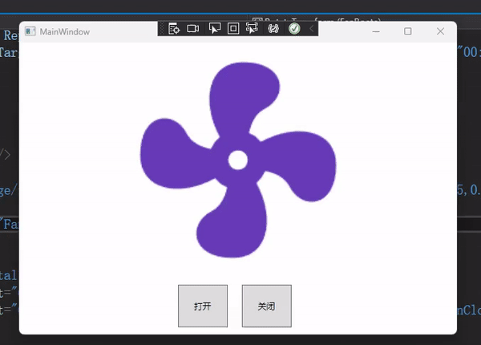
## 2.代码展示
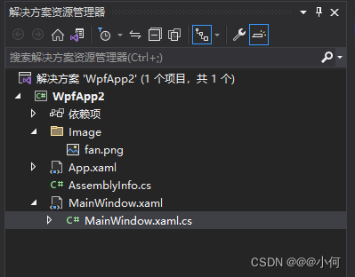
MainWindow.xaml代码：

```xml
<Window x:Class="WpfApp2.MainWindow"
        xmlns="http://schemas.microsoft.com/winfx/2006/xaml/presentation"
        xmlns:x="http://schemas.microsoft.com/winfx/2006/xaml"
        xmlns:d="http://schemas.microsoft.com/expression/blend/2008"
        xmlns:mc="http://schemas.openxmlformats.org/markup-compatibility/2006"
        xmlns:local="clr-namespace:WpfApp2"
        mc:Ignorable="d"
        Title="MainWindow" Height="450" Width="800">
    <Window.Resources>
        <Storyboard x:Key="FanAnimation" RepeatBehavior="Forever">
            <DoubleAnimation Storyboard.TargetName="FanRoate" Storyboard.TargetProperty="Angle" BeginTime="00:00:00" Duration="00:00:01" From="0" To="360"/>
        </Storyboard>
    </Window.Resources>
    <Grid>
        <Grid.RowDefinitions>
            <RowDefinition/>
            <RowDefinition Height="Auto"/>
        </Grid.RowDefinitions>
        <Image Grid.Row="0" Source="/Image/fan.png" HorizontalAlignment="Center" RenderTransformOrigin="0.5,0.5">
            <Image.RenderTransform>
                <RotateTransform x:Name="FanRoate"/>
            </Image.RenderTransform>
        </Image>
        <StackPanel Orientation="Horizontal" Grid.Row="1" HorizontalAlignment="Center">
            <Button Content="打开" Height="60" Width="70" x:Name="btnOpen" Click="btnOpen_Click"/>
            <Button Content="关闭" Height="60" Width="70" x:Name="btnClose" Margin="20 10 10 10" Click="btnClose_Click"/>
        </StackPanel>
    </Grid>
</Window>

```
MainWindow.xaml.cs代码：

```csharp
using System;
using System.Collections.Generic;
using System.Linq;
using System.Text;
using System.Threading.Tasks;
using System.Windows;
using System.Windows.Controls;
using System.Windows.Data;
using System.Windows.Documents;
using System.Windows.Input;
using System.Windows.Media;
using System.Windows.Media.Animation;
using System.Windows.Media.Imaging;
using System.Windows.Navigation;
using System.Windows.Shapes;

namespace WpfApp2
{
	/// <summary>
	/// Interaction logic for MainWindow.xaml
	/// </summary>
	public partial class MainWindow : Window
	{
		Storyboard storyboard = null;
		public MainWindow()
		{
			InitializeComponent();

			storyboard = Resources["FanAnimation"] as Storyboard;//从View页面中定义的资源字典中拿到名为FanAnimation的资源

		}

		private void btnOpen_Click(object sender, RoutedEventArgs e)
		{
			storyboard.Begin();
		}

		private void btnClose_Click(object sender, RoutedEventArgs e)
		{
			storyboard.Stop();
		}
	}
}

```
# 7.设计一个带有波浪效果的进度球
## 1.实现效果
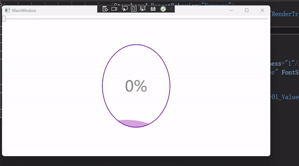
## 2.代码展示
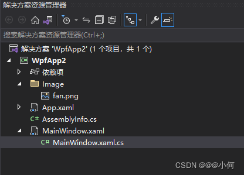
MainWindow.xaml代码：

```xml
<Window x:Class="WpfApp2.MainWindow"
        xmlns="http://schemas.microsoft.com/winfx/2006/xaml/presentation"
        xmlns:x="http://schemas.microsoft.com/winfx/2006/xaml"
        xmlns:d="http://schemas.microsoft.com/expression/blend/2008"
        xmlns:mc="http://schemas.openxmlformats.org/markup-compatibility/2006"
        xmlns:local="clr-namespace:WpfApp2" Topmost="True"
        mc:Ignorable="d"
        Title="MainWindow" Height="450" Width="800">
    <Grid>
        <Viewbox Width="200">
            <Grid Width="90" Height="110">
                <Grid.Clip>
                    <EllipseGeometry Center="45 55" RadiusX="45" RadiusY="55"/>
                </Grid.Clip>
                <Border Width="220" Opacity="0.5" Margin="-100" Height="220" RenderTransformOrigin="0.5 0.5" Background="#ab47bc" CornerRadius="90">
                    <Border.RenderTransform>
                        <TransformGroup>
                            <RotateTransform Angle="0"/>
                            <TranslateTransform Y="160" x:Name="trans"/>
                        </TransformGroup>
                    </Border.RenderTransform>
                    <Border.Triggers>
                        <EventTrigger RoutedEvent="Loaded">
                            <BeginStoryboard>
                                <Storyboard RepeatBehavior="Forever">
                                    <DoubleAnimation Storyboard.TargetProperty="RenderTransform.Children[0].Angle" To="359" Duration="0:0:5"/>
                                </Storyboard>
                            </BeginStoryboard>
                        </EventTrigger>
                    </Border.Triggers>
                </Border>
                <Ellipse Width="90" Height="110" Stroke="#7b1fa2" StrokeThickness="1"/>
                <TextBlock HorizontalAlignment="Center" VerticalAlignment="Center" FontSize="20" Opacity="0.5" Text="{Binding ElementName=slider01,Path=Value,StringFormat={}{0}%}"/>
            </Grid>
        </Viewbox>
        <Slider x:Name="slider01" Maximum="100" Minimum="0" ValueChanged="slider01_ValueChanged" IsSnapToTickEnabled="True"/>
    </Grid>
</Window>

```
MainWindow.xaml.cs代码：

```csharp
using System;
using System.Collections.Generic;
using System.Linq;
using System.Text;
using System.Threading.Tasks;
using System.Windows;
using System.Windows.Controls;
using System.Windows.Data;
using System.Windows.Documents;
using System.Windows.Input;
using System.Windows.Media;
using System.Windows.Media.Animation;
using System.Windows.Media.Imaging;
using System.Windows.Navigation;
using System.Windows.Shapes;

namespace WpfApp2
{
	/// <summary>
	/// Interaction logic for MainWindow.xaml
	/// </summary>
	public partial class MainWindow : Window
	{
		public MainWindow()
		{
			InitializeComponent();
		}

		private void slider01_ValueChanged(object sender, RoutedPropertyChangedEventArgs<double> e)
		{
			this.trans.Y = 160 - e.NewValue;
		}
	}


}

```
# 8.设计一个圆形进度条
## 1.简介

> 主要用StrokeDashArray来绘制图形。

> 思路：
> 1. 用Rectangle来画2个圆环，一个浅色作为进度条的背景，一个深色作为进度条进度显示。
> 2. 然后通过设置StrokeDashArray来调整进度的多少，并通过StrokeDashCap把进度条两端也弄成圆弧。但是值得注意的是，通过设置StrokeDashArray来调整进度的多少，设置的并不是1%的进度，而是圆弧长度，因此还需要其他方法来设置进度条进度。
> 3. 通过TextBox中输入的值来手动设置进度值，并通过TextChanged事件来刷新进度条进度。
> 4. 接下来主要就是计算百分比的问题：
> StrokeDashArray的单位长度不是1，而是StrokeThickness，所以整个StrokeDashArray的长度是这个圆环的周长，但是要用StrokeThickness的值为单位。
## 2. 实现效果
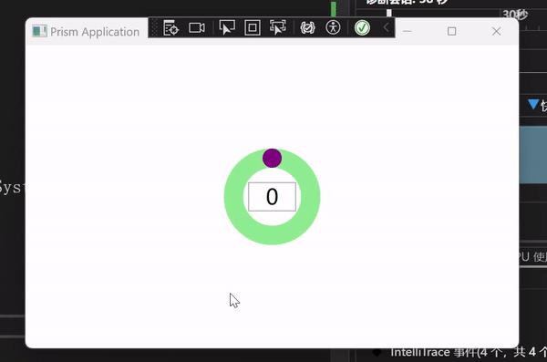
## 3.代码展示
MainWindow.xaml代码：

```xml
<Window
    x:Class="BlankApp1.Views.MainWindow"
    xmlns="http://schemas.microsoft.com/winfx/2006/xaml/presentation"
    xmlns:x="http://schemas.microsoft.com/winfx/2006/xaml"
    xmlns:prism="http://prismlibrary.com/"
    Title="{Binding Title}"
    Width="525"
    Height="350"
    prism:ViewModelLocator.AutoWireViewModel="True">
    <Grid>
        <Rectangle Width="100" Height="100" Stroke="LightGreen" StrokeThickness="20" RadiusX="50" RadiusY="50"/>
        <Rectangle x:Name="progressBar" RenderTransformOrigin="0.5,0.5" Width="100" Height="100" Stroke="Purple" StrokeDashArray="1,100" StrokeDashCap="Round" StrokeThickness="20" RadiusX="50" RadiusY="50">
            <Rectangle.RenderTransform>
                <RotateTransform Angle="90"/>
            </Rectangle.RenderTransform>
        </Rectangle>
        <TextBox x:Name="txt" Background="Transparent" Width="50" Height="30" Text="0" TextAlignment="Center" FontSize="22" TextChanged="txt_TextChanged"/>
    </Grid>
</Window>

```

MainWindow.xaml.cs代码：

```csharp
using System;
using System.Windows;
using System.Windows.Media;

namespace BlankApp1.Views
{
	/// <summary>
	/// Interaction logic for MainWindow.xaml
	/// </summary>
	public partial class MainWindow : Window
	{
		public MainWindow()
		{
			InitializeComponent();
		}

		private void txt_TextChanged(object sender, System.Windows.Controls.TextChangedEventArgs e)
		{
			double pro = 0;
			try
			{
				pro = Convert.ToDouble(txt.Text);
			}
			catch(Exception ex)
			{
				MessageBox.Show(ex.Message);
			}
			finally
			{
				CaluculateProgress(pro,progressBar.RadiusX,progressBar.StrokeThickness);
			}
		}

		void CaluculateProgress(double pro,double radius,double thickness)
		{
			double r = radius - thickness / 2;///圆环半径，计算方法为：外弧半径-thickness的一半
			double perimeter = 2 * Math.PI * r / thickness;//圆弧长度，计算方法为：圆弧的周长除以单位长度
			double step = pro / 100*perimeter;//进度，计算方法为：圆弧的长度除以比例
			progressBar.StrokeDashArray = new DoubleCollection() { step, 100 };
		}
	}
}
```
# 9.原神官网角色展示
## 1.简介

> 转自：[《原神》官网角色展示界面的WPF实现](https://www.bilibili.com/video/BV1te411G7AW?p=3&vd_source=4f56e4e53e0b60896f7cf23c14182a20)。觉得原作者的代码中有很多学习地方，故摘抄下来学习。

> 简介：
> 1. 代码中有一些自定义动画、自定义按钮、自定义进度条以及json对象操作。
## 2. 实现效果


## 3.代码展示

> 1. 文件结构：
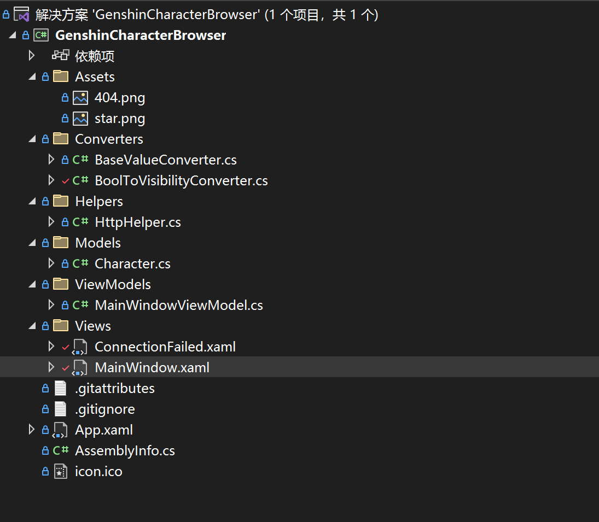

> 2. MainWindow.xaml代码：

```xml
<Window x:Class="GenshinCharacterBrowser.Views.MainWindow" xmlns="http://schemas.microsoft.com/winfx/2006/xaml/presentation" xmlns:x="http://schemas.microsoft.com/winfx/2006/xaml" xmlns:d="http://schemas.microsoft.com/expression/blend/2008" xmlns:mc="http://schemas.openxmlformats.org/markup-compatibility/2006" xmlns:local="clr-namespace:GenshinCharacterBrowser.Views" xmlns:i="http://schemas.microsoft.com/xaml/behaviors" xmlns:vm="clr-namespace:GenshinCharacterBrowser.ViewModels" xmlns:model="clr-namespace:GenshinCharacterBrowser.Models" xmlns:vc="clr-namespace:GenshinCharacterBrowser.Converters" Title="《原神》角色一览" Width="1280" Height="800" MinWidth="800" MinHeight="550" Background="#222" WindowStartupLocation="CenterScreen" mc:Ignorable="d">
    <Window.DataContext>
        <vm:MainWindowViewModel />
    </Window.DataContext>
    <Window.Resources>
        <Storyboard x:Key="protraitIn">
            <DoubleAnimation Storyboard.TargetName="protraitPic" Storyboard.TargetProperty="RenderTransform.(TranslateTransform.X)" From="400" To="100" Duration="0:0:0.35">
                <DoubleAnimation.EasingFunction>
                    <CubicEase EasingMode="EaseInOut" />
                </DoubleAnimation.EasingFunction>
            </DoubleAnimation>
            <DoubleAnimation Storyboard.TargetName="protraitPic" Storyboard.TargetProperty="Opacity" From="0" To="1" Duration="0:0:0.35" />
        </Storyboard>
    </Window.Resources>
    <i:Interaction.Triggers>
        <i:EventTrigger EventName="Loaded">
            <i:InvokeCommandAction Command="{Binding LoadCityCommand}" CommandParameter="150" />
        </i:EventTrigger>
    </i:Interaction.Triggers>
    <Grid>
        <Grid.RowDefinitions>
            <RowDefinition Height="*" />
            <RowDefinition Height="180" />
        </Grid.RowDefinitions>

        <MediaElement Volume="0.7" IsMuted="{Binding ElementName=bgm, Path=IsChecked}">
            <MediaElement.Triggers>
                <EventTrigger RoutedEvent="Loaded">
                    <BeginStoryboard>
                        <Storyboard>
                            <MediaTimeline Source="https://ys.mihoyo.com/main/_nuxt/medias/video-bgm.532ef479.mp3" RepeatBehavior="Forever" />
                        </Storyboard>
                    </BeginStoryboard>
                </EventTrigger>
            </MediaElement.Triggers>
        </MediaElement>

        <!-- 背景图片 -->
        <Grid Grid.RowSpan="2" RenderTransformOrigin="0.5,0.5">
            <Grid.RenderTransform>
                <ScaleTransform />
            </Grid.RenderTransform>
            <Grid.Triggers>
                <EventTrigger RoutedEvent="Loaded">
                    <BeginStoryboard>
                        <Storyboard>
                            <DoubleAnimation RepeatBehavior="Forever" AutoReverse="True" Storyboard.TargetProperty="RenderTransform.(ScaleTransform.ScaleX)" From="1" To="1.3" Duration="0:0:30" />
                            <DoubleAnimation RepeatBehavior="Forever" AutoReverse="True" Storyboard.TargetProperty="RenderTransform.(ScaleTransform.ScaleY)" From="1" To="1.3" Duration="0:0:30" />
                        </Storyboard>
                    </BeginStoryboard>
                </EventTrigger>
            </Grid.Triggers>

            <Image d:Source="https://webstatic.mihoyo.com/upload/contentweb/2022/08/15/ab72edd8acc105904aa50da90e4e788e_2299455865599609620.jpg" Source="{Binding DuskImage}" Stretch="UniformToFill" />

            <Image Grid.RowSpan="2" d:Source="https://webstatic.mihoyo.com/upload/contentweb/2022/08/15/04d542b08cdee91e5dabfa0e85b8995e_8653892990016707198.jpg" Source="{Binding DawnImage}" RenderTransformOrigin="0.5,0.5" Stretch="UniformToFill">
                <Image.Triggers>
                    <EventTrigger RoutedEvent="Loaded">
                        <BeginStoryboard>
                            <Storyboard>
                                <DoubleAnimationUsingKeyFrames RepeatBehavior="Forever" AutoReverse="True" Storyboard.TargetProperty="Opacity" Duration="0:0:20">
                                    <LinearDoubleKeyFrame KeyTime="0:0:0" Value="1" />
                                    <LinearDoubleKeyFrame KeyTime="0:0:9" Value="1" />
                                    <LinearDoubleKeyFrame KeyTime="0:0:11" Value="0" />
                                    <LinearDoubleKeyFrame KeyTime="0:0:20" Value="0" />
                                </DoubleAnimationUsingKeyFrames>
                            </Storyboard>
                        </BeginStoryboard>
                    </EventTrigger>
                </Image.Triggers>
            </Image>
        </Grid>

        <!-- 音量按钮 -->
        <ToggleButton x:Name="bgm" Margin="20" HorizontalAlignment="Right" VerticalAlignment="Top" Panel.ZIndex="999" FocusVisualStyle="{x:Null}" Foreground="#9FFF" IsChecked="True" Cursor="Hand">
            <ToggleButton.Effect>
                <BlurEffect Radius="1" />
            </ToggleButton.Effect>
            <ToggleButton.Template>
                <ControlTemplate TargetType="ToggleButton">
                    <Grid>
                        <Ellipse Width="25" Height="25" Stroke="{TemplateBinding Foreground}" StrokeThickness="2" />
                        <TextBlock HorizontalAlignment="Center" VerticalAlignment="Center" Text="&#xEC4F;" FontSize="16" FontWeight="SemiBold" FontFamily="Segoe MDL2 Assets" RenderTransformOrigin="0.5,0.5" Foreground="{TemplateBinding Foreground}">
                            <TextBlock.RenderTransform>
                                <RotateTransform Angle="-15" />
                            </TextBlock.RenderTransform>
                        </TextBlock>
                        <TextBlock x:Name="block" Margin="0,0,4,5" HorizontalAlignment="Right" VerticalAlignment="Bottom" Visibility="Hidden" Text="&#xF140;" FontWeight="SemiBold" FontSize="10" Foreground="LightCoral" FontFamily="Segoe MDL2 Assets" RenderTransformOrigin="0.5,0.5">
                            <TextBlock.RenderTransform>
                                <ScaleTransform ScaleX="-1" />
                            </TextBlock.RenderTransform>
                        </TextBlock>
                    </Grid>
                    <ControlTemplate.Triggers>
                        <Trigger Property="IsChecked" Value="True">
                            <Setter TargetName="block" Property="Visibility" Value="Visible" />
                        </Trigger>
                    </ControlTemplate.Triggers>
                </ControlTemplate>
            </ToggleButton.Template>
        </ToggleButton>

        <!-- 角色立绘 -->
        <Image Name="protraitPic" Grid.RowSpan="2" d:Source="https://webstatic.mihoyo.com/upload/contentweb/2022/08/19/a15445b2b2e4443398eabf3b479f49e7_8073097535789989508.png" Source="{Binding SelectedItem.ProtraitUrl}" Stretch="UniformToFill">
            <Image.RenderTransform>
                <TranslateTransform X="100" />
            </Image.RenderTransform>
        </Image>

        <!-- 角色名称和元素 -->
        <Grid Margin="200,10,0,0" HorizontalAlignment="Left" VerticalAlignment="Top">
            <Image Height="300" HorizontalAlignment="Left" d:Source="https://webstatic.mihoyo.com/upload/contentweb/2022/08/15/b131cb7706e97d71ecf3d4f2965b0ff1_7476946874531800864.png" Source="{Binding SelectedItem.ElementUrl}" Opacity="0.25" />
            <Image Height="120" Margin="50,0,0,0" HorizontalAlignment="Center" d:Source="https://webstatic.mihoyo.com/upload/contentweb/2022/08/15/4f3f7fc8cc5fce975bfff8d552e8e7b8_7543421952558259312.png" Source="{Binding SelectedItem.NameUrl}" />
        </Grid>

        <!-- 角色台词 -->
        <Image Height="200" Margin="200,0,0,-30" HorizontalAlignment="Left" VerticalAlignment="Bottom" d:Source="https://webstatic.mihoyo.com/upload/contentweb/2022/08/15/5ec15b13ccdf26bc05e6fdafdf57b0b2_3416441378250207025.png" Source="{Binding SelectedItem.DialogueUrl}" />

        <!-- 选择城市 -->
        <StackPanel HorizontalAlignment="Left" VerticalAlignment="Center">
            <StackPanel.Resources>
                <Style TargetType="RadioButton">
                    <Setter Property="FontSize" Value="20" />
                    <Setter Property="Foreground" Value="White" />
                    <Setter Property="Margin" Value="0,2" />
                    <Setter Property="VerticalContentAlignment" Value="Center" />
                    <Setter Property="FocusVisualStyle" Value="{x:Null}" />
                    <Setter Property="Template">
                        <Setter.Value>
                            <ControlTemplate TargetType="RadioButton">
                                <Border Name="border" Width="250" Padding="20,18,0,18" Background="Transparent">
                                    <StackPanel Orientation="Horizontal">
                                        <Grid RenderTransformOrigin="0.5,0.5">
                                            <Grid.RenderTransform>
                                                <RotateTransform Angle="45" />
                                            </Grid.RenderTransform>
                                            <Grid.Effect>
                                                <DropShadowEffect BlurRadius="5" ShadowDepth="0" Color="White" />
                                            </Grid.Effect>
                                            <Rectangle Name="uncheckIcon" Width="6" Height="6" HorizontalAlignment="Center" VerticalAlignment="Center" Fill="{TemplateBinding Foreground}" />
                                            <Grid Name="checkIcon" Visibility="Hidden">
                                                <Rectangle Width="16" Height="16" HorizontalAlignment="Center" VerticalAlignment="Center" Stroke="{TemplateBinding Foreground}" StrokeThickness="2" />
                                                <Path HorizontalAlignment="Center" VerticalAlignment="Center" Data="M0,0 9,0 9,9" Fill="{TemplateBinding Foreground}" />
                                            </Grid>
                                        </Grid>
                                        <ContentPresenter Name="content" Margin="15,0,0,0" />
                                    </StackPanel>
                                </Border>
                                <ControlTemplate.Triggers>
                                    <Trigger Property="IsChecked" Value="True">
                                        <Setter TargetName="checkIcon" Property="Visibility" Value="Visible" />
                                        <Setter TargetName="uncheckIcon" Property="Visibility" Value="Hidden" />
                                        <Setter TargetName="content" Property="Margin" Value="25,0,0,0" />
                                        <Setter TargetName="border" Property="Background">
                                            <Setter.Value>
                                                <LinearGradientBrush StartPoint="0,0" EndPoint="1,0">
                                                    <GradientStop Color="#9000" />
                                                    <GradientStop Offset="1" Color="#0000" />
                                                </LinearGradientBrush>
                                            </Setter.Value>
                                        </Setter>
                                    </Trigger>
                                </ControlTemplate.Triggers>
                            </ControlTemplate>
                        </Setter.Value>
                    </Setter>
                </Style>
            </StackPanel.Resources>
            <RadioButton Content="蒙德城" IsChecked="True" Command="{Binding LoadCityCommand}" CommandParameter="150" />
            <RadioButton Content="璃月港" Command="{Binding LoadCityCommand}" CommandParameter="151" />
            <RadioButton Content="稻妻城" Command="{Binding LoadCityCommand}" CommandParameter="324" />
            <RadioButton Content="须弥城" Command="{Binding LoadCityCommand}" CommandParameter="350" />
            <RadioButton Content="敬请期待" IsEnabled="False" />
        </StackPanel>

        <!-- 角色列表 -->
        <ListBox x:Name="charListBox" Grid.Row="1" Margin="-1" Padding="5,5,5,2" d:ItemsSource="{x:Null}" d:SelectedIndex="0" SelectedItem="{Binding SelectedItem}" BorderThickness="0" ScrollViewer.CanContentScroll="False" FocusVisualStyle="{x:Null}" Background="#33f0f8ff" ItemsSource="{Binding CharList}" ScrollViewer.VerticalScrollBarVisibility="Disabled" ScrollViewer.HorizontalScrollBarVisibility="Visible">
            <ListBox.Resources>
                <Style TargetType="ScrollBar">
                    <Setter Property="Margin" Value="18,0,18,8" />
                    <Setter Property="Height" Value="Auto" />
                    <Setter Property="Stylus.IsPressAndHoldEnabled" Value="false" />
                    <Setter Property="Stylus.IsFlicksEnabled" Value="false" />
                    <Setter Property="Foreground" Value="#7000" />
                    <Setter Property="Template">
                        <Setter.Value>
                            <ControlTemplate TargetType="{x:Type ScrollBar}">
                                <Grid SnapsToDevicePixels="true">
                                    <Track x:Name="PART_Track" Grid.Column="1" IsEnabled="{TemplateBinding IsMouseOver}">
                                        <Track.Thumb>
                                            <Thumb>
                                                <Thumb.Style>
                                                    <Style TargetType="{x:Type Thumb}">
                                                        <Setter Property="OverridesDefaultStyle" Value="true" />
                                                        <Setter Property="IsTabStop" Value="false" />
                                                        <Setter Property="Template">
                                                            <Setter.Value>
                                                                <ControlTemplate TargetType="{x:Type Thumb}">
                                                                    <Rectangle Width="{TemplateBinding Width}" Height="{TemplateBinding Height}" Fill="{TemplateBinding Foreground}" RadiusX="10" RadiusY="10" SnapsToDevicePixels="True" />
                                                                    <ControlTemplate.Triggers>
                                                                        <Trigger Property="IsMouseOver" Value="true">
                                                                            <Setter Property="Foreground" Value="#9000" />
                                                                        </Trigger>
                                                                        <Trigger Property="IsDragging" Value="true">
                                                                            <Setter Property="Foreground" Value="#9000" />
                                                                        </Trigger>
                                                                    </ControlTemplate.Triggers>
                                                                </ControlTemplate>
                                                            </Setter.Value>
                                                        </Setter>
                                                    </Style>
                                                </Thumb.Style>
                                            </Thumb>
                                        </Track.Thumb>
                                    </Track>
                                </Grid>
                            </ControlTemplate>
                        </Setter.Value>
                    </Setter>
                </Style>
            </ListBox.Resources>
            <i:Interaction.Triggers>
                <i:EventTrigger EventName="SelectionChanged">
                    <i:ControlStoryboardAction ControlStoryboardOption="Play" Storyboard="{StaticResource protraitIn}" />
                </i:EventTrigger>
            </i:Interaction.Triggers>
            <ListBox.ItemsPanel>
                <ItemsPanelTemplate>
                    <StackPanel Orientation="Horizontal" />
                </ItemsPanelTemplate>
            </ListBox.ItemsPanel>
            <ListBox.ItemTemplate>
                <DataTemplate>
                    <Border Name="border" Margin="15,8" Background="Transparent" CornerRadius="5">
                        <StackPanel Margin="2,2,2,1">
                            <Border Name="iconBorder" Background="#5000" CornerRadius="4,4,0,0">
                                <Grid>
                                    <Image Width="106" Source="{Binding IconUrl}" Stretch="Uniform">
                                        <Image.OpacityMask>
                                            <VisualBrush>
                                                <VisualBrush.Visual>
                                                    <Border Width="{Binding RelativeSource={RelativeSource AncestorType=Image}, Path=ActualWidth}" Height="{Binding RelativeSource={RelativeSource AncestorType=Image}, Path=ActualHeight}" CornerRadius="4,4,0,0" Background="White" />
                                                </VisualBrush.Visual>
                                            </VisualBrush>
                                        </Image.OpacityMask>
                                    </Image>
                                </Grid>
                            </Border>
                            <Border Name="nameBorder" Padding="0,1" Background="#d000" CornerRadius="0,0,4,4">
                                <TextBlock Name="nameText" HorizontalAlignment="Center" Foreground="White" Text="{Binding Name}" FontSize="16" />
                            </Border>
                        </StackPanel>
                    </Border>
                    <DataTemplate.Triggers>
                        <DataTrigger Binding="{Binding RelativeSource={RelativeSource AncestorType=ListBoxItem}, Path=IsSelected}" Value="True">
                            <Setter TargetName="border" Property="Background" Value="White" />
                            <Setter TargetName="nameBorder" Property="Background" Value="Transparent" />
                            <Setter TargetName="nameText" Property="Foreground" Value="Black" />
                            <Setter TargetName="iconBorder" Property="Background">
                                <Setter.Value>
                                    <LinearGradientBrush StartPoint="0,0" EndPoint="1,1">
                                        <GradientStop Color="#111" />
                                        <GradientStop Offset="1" Color="#7000" />
                                    </LinearGradientBrush>
                                </Setter.Value>
                            </Setter>
                        </DataTrigger>
                        <Trigger Property="FrameworkElement.IsMouseOver" Value="True">
                            <Setter TargetName="border" Property="Background" Value="White" />
                            <Setter TargetName="nameBorder" Property="Background" Value="Transparent" />
                            <Setter TargetName="nameText" Property="Foreground" Value="Black" />
                            <Setter TargetName="iconBorder" Property="Background">
                                <Setter.Value>
                                    <LinearGradientBrush StartPoint="0,0" EndPoint="1,1">
                                        <GradientStop Color="#111" />
                                        <GradientStop Offset="1" Color="#7000" />
                                    </LinearGradientBrush>
                                </Setter.Value>
                            </Setter>
                        </Trigger>
                    </DataTemplate.Triggers>
                </DataTemplate>
            </ListBox.ItemTemplate>
            <ListBox.ItemContainerStyle>
                <Style TargetType="ListBoxItem">
                    <Setter Property="Template">
                        <Setter.Value>
                            <ControlTemplate TargetType="ListBoxItem">
                                <ContentPresenter />
                            </ControlTemplate>
                        </Setter.Value>
                    </Setter>
                </Style>
            </ListBox.ItemContainerStyle>
            <d:ListBox.Items>
                <model:Character Name="提纳里" IconUrl="https://webstatic.mihoyo.com/upload/contentweb/2022/08/15/1f88bdae2e99307e68a0bbfedf6cc74f_2882938237707913291.png" />
                <model:Character Name="柯莱" IconUrl="https://webstatic.mihoyo.com/upload/contentweb/2022/08/15/3677cbc063b7ab3887ceb7f9a77287ac_1039229097287658400.png" />
                <model:Character Name="多莉" IconUrl="https://webstatic.mihoyo.com/upload/contentweb/2022/08/29/b8a367991017a9f3c6bb445c5c8b68e6_1191967378101363412.png" />
            </d:ListBox.Items>
        </ListBox>

        <!-- 404 界面 -->
        <local:ConnectionFailed Grid.RowSpan="2" Panel.ZIndex="999" Visibility="{Binding ConnectionFailed, Converter={vc:BoolToVisibilityConverter UseHidden=True}}" />

    </Grid>
</Window>

```

> 3. ConnectionFailed.xaml代码：

```xml
<UserControl x:Class="GenshinCharacterBrowser.Views.ConnectionFailed" xmlns="http://schemas.microsoft.com/winfx/2006/xaml/presentation" xmlns:x="http://schemas.microsoft.com/winfx/2006/xaml" xmlns:mc="http://schemas.openxmlformats.org/markup-compatibility/2006" xmlns:d="http://schemas.microsoft.com/expression/blend/2008" xmlns:local="clr-namespace:GenshinCharacterBrowser" xmlns:vm="clr-namespace:GenshinCharacterBrowser.ViewModels" d:DesignHeight="720" d:DesignWidth="1280" d:DataContext="{d:DesignInstance vm:MainWindowViewModel}" Background="#393b40" mc:Ignorable="d">
    <UserControl.Resources>
        <Style TargetType="TextBlock">
            <Setter Property="HorizontalAlignment" Value="Center" />
        </Style>
    </UserControl.Resources>
    <Grid>
        <Rectangle Margin="10" HorizontalAlignment="Stretch" VerticalAlignment="Stretch" Stroke="#595b5f" RadiusX="20" RadiusY="20" StrokeThickness="4" />
        <Rectangle Margin="20" HorizontalAlignment="Stretch" VerticalAlignment="Stretch" Stroke="#4c4e53" RadiusX="14" RadiusY="14" StrokeThickness="2" />

        <StackPanel Width="360" VerticalAlignment="Center">
            <Image Source="/Assets/404.png" />
            <TextBlock Margin="0,28" Text="无法访问《原神》官网" Foreground="White" FontSize="32" />
            <TextBlock TextAlignment="Center" Foreground="#757b87" FontSize="16" LineHeight="24">
                <Run>可能跟温迪一起出游了吧</Run>
                <LineBreak />
                <Run>可能跟钟离一起尘世仙游了也说不定？</Run>
                <LineBreak />
                <Run>可能跟雷电将军一起进一心净土了也没准……</Run>
            </TextBlock>
            <Image Width="30" Margin="28" Source="/Assets/star.png" />
            <Button Content="尝试重连 »" Command="{Binding RetryClickCommand}">
                <Button.Style>
                    <Style TargetType="Button">
                        <Setter Property="HorizontalAlignment" Value="Center" />
                        <Setter Property="Foreground" Value="#d7d8d9" />
                        <Setter Property="BorderThickness" Value="0" />
                        <Setter Property="FontSize" Value="20" />
                        <Setter Property="Cursor" Value="Hand" />
                        <Setter Property="Template">
                            <Setter.Value>
                                <ControlTemplate TargetType="Button">
                                    <ContentPresenter />
                                </ControlTemplate>
                            </Setter.Value>
                        </Setter>
                        <Style.Triggers>
                            <Trigger Property="IsMouseOver" Value="True">
                                <Setter Property="Foreground" Value="White" />
                            </Trigger>
                        </Style.Triggers>
                    </Style>
                </Button.Style>
            </Button>
        </StackPanel>
    </Grid>
</UserControl>

```

> 4. MainWindowViewModel.cs代码：

```csharp
using CommunityToolkit.Mvvm.ComponentModel;
using CommunityToolkit.Mvvm.Input;
using GenshinCharacterBrowser.Helpers;
using GenshinCharacterBrowser.Models;
using Newtonsoft.Json.Linq;
using System;
using System.Collections.ObjectModel;
using System.Net.Http;
using System.Threading.Tasks;
using System.Windows.Media.Imaging;

namespace GenshinCharacterBrowser.ViewModels;

public partial class MainWindowViewModel : ObservableObject
{
    [ObservableProperty]
    ObservableCollection<Character> charList = new();

    [ObservableProperty]
    Character selectedItem;

    [ObservableProperty]
    BitmapImage dawnImage;

    [ObservableProperty]
    BitmapImage duskImage;

    [ObservableProperty]
    bool connectionFailed;

    string lastVisitedCity = null;

    [RelayCommand]
    async Task LoadCity(string id)
    {
        lastVisitedCity = id;
        try
        {
            var result = await HttpHelper.GetStringAsync($"https://content-static.mihoyo.com/content/ysCn/getContentList?pageSize=20&pageNum=1&order=asc&channelId={id}");

            var list = JObject.Parse(result)["data"]["list"];

            CharList.Clear();
            foreach (var item in list)
            {
                CharList.Add(new(item));
            }

            SelectedItem = CharList[0];

            await ChangeBg(id);
        }
        catch (HttpRequestException)
        {
            ConnectionFailed = true;
            return;
        }
    }

    async Task ChangeBg(string id)
    {
        var dawnUrl = id switch
        {
            "150" => @"https://uploadstatic.mihoyo.com/contentweb/20200211/2020021114220951905.jpg",
            "151" => @"https://uploadstatic.mihoyo.com/contentweb/20200515/2020051511073340128.jpg",
            "324" => @"https://uploadstatic.mihoyo.com/contentweb/20210719/2021071917030766463.jpg",
            "350" => @"https://webstatic.mihoyo.com/upload/contentweb/2022/08/15/04d542b08cdee91e5dabfa0e85b8995e_8653892990016707198.jpg",
            _ => throw new ArgumentException(id)
        };

        var duskUrl = id switch
        {
            "150" => @"https://uploadstatic.mihoyo.com/contentweb/20200211/2020021114221470532.jpg",
            "151" => @"https://uploadstatic.mihoyo.com/contentweb/20200515/2020051511072867344.jpg",
            "324" => @"https://uploadstatic.mihoyo.com/contentweb/20210719/2021071917033032133.jpg",
            "350" => @"https://webstatic.mihoyo.com/upload/contentweb/2022/08/15/ab72edd8acc105904aa50da90e4e788e_2299455865599609620.jpg",
            _ => throw new ArgumentException(id)
        };

        var dawn = HttpHelper.GetImageAsync(dawnUrl);
        var dusk = HttpHelper.GetImageAsync(duskUrl);
        await Task.WhenAll(dawn, dusk);

        DawnImage = dawn.Result;
        DuskImage = dusk.Result;
    }

    [RelayCommand]
    async Task RetryClick()
    {
        ConnectionFailed = false;

        await LoadCity(lastVisitedCity);
    }
}

```

> 5. Character.cs代码：

```csharp
using Newtonsoft.Json.Linq;
using System.Linq;

namespace GenshinCharacterBrowser.Models;

public class Character
{
    public string Name { get; init; }
    public string IconUrl { get; init; }
    public string ProtraitUrl { get; init; }
    public string NameUrl { get; set; }
    public string ElementUrl { get; set; }
    public string DialogueUrl { get; set; }

    public Character() { }

    public Character(JToken obj)
    {
        Name = obj["title"].ToString();
        IconUrl = obj["ext"].First(v => v["arrtName"].ToString() == "角色-ICON")["value"][0]["url"].ToString();
        ProtraitUrl = obj["ext"].First(v => v["arrtName"].ToString() == "角色-PC端主图")["value"][0]["url"].ToString();
        NameUrl = obj["ext"].First(v => v["arrtName"].ToString() == "角色-名字")["value"][0]["url"].ToString();
        ElementUrl = obj["ext"].First(v => v["arrtName"].ToString() == "角色-属性")["value"][0]["url"].ToString();
        DialogueUrl = obj["ext"].First(v => v["arrtName"].ToString() == "角色-台词")["value"][0]["url"].ToString();
    }
}

```

> 6. HttpHelper.cs代码：

```csharp
using System;
using System.IO;
using System.Net.Http;
using System.Threading.Tasks;
using System.Windows.Media.Imaging;

namespace GenshinCharacterBrowser.Helpers;

public static class HttpHelper
{
    private static HttpClient httpClient = new();

    /// <summary>
    /// Get an http response from sending request to a specific url
    /// </summary>
    /// <param name="url"></param>
    /// <param name="method">Http method being used (default: <see cref="HttpMethod.Get"/>)</param>
    /// <returns></returns>
    public static async Task<HttpResponseMessage> GetResponseAsync(string url, HttpMethod method = null)
    {
        using var request = new HttpRequestMessage
        {
            RequestUri = new Uri(url),
            Method = method ?? HttpMethod.Get
        };
        var response = await httpClient.SendAsync(request);
        response.EnsureSuccessStatusCode();
        return response;
    }

    /// <summary>
    /// Get string content from a specific url
    /// </summary>
    /// <param name="url"></param>
    /// <returns></returns>
    public static async Task<string> GetStringAsync(string url)
    {
        using var response = await GetResponseAsync(url);
        response.EnsureSuccessStatusCode();
        return await response.Content.ReadAsStringAsync();
    }

    /// <summary>
    /// Get a bitmap image from a specific url
    /// </summary>
    public static async Task<BitmapImage> GetImageAsync(string url)
    {
        using var response = await GetResponseAsync(url);
        var data = await response.Content.ReadAsByteArrayAsync();
        using var stream = new MemoryStream(data);

        var image = new BitmapImage();
        image.BeginInit();
        image.CreateOptions = BitmapCreateOptions.PreservePixelFormat;
        image.CacheOption = BitmapCacheOption.OnLoad;
        image.UriSource = null;
        image.StreamSource = stream;
        image.EndInit();
        image.Freeze();

        return image;
    }
}

```
> 7.  BoolToVisibilityConverter.cs代码：

```csharp
using System;
using System.Globalization;
using System.Windows;

namespace GenshinCharacterBrowser.Converters;

public class BoolToVisibilityConverter : BaseValueConverter
{
    public bool IsReverse { get; set; }

    public bool UseHidden { get; set; }

    public override object Convert(object value, Type targetType, object parameter, CultureInfo culture)
    {
        var res = System.Convert.ToBoolean(value);

        if (IsReverse) res = !res;

        if (res) return Visibility.Visible;
        else return UseHidden ? Visibility.Hidden : Visibility.Collapsed;
    }

    public override object ConvertBack(object value, Type targetType, object parameter, CultureInfo culture)
    {
        var vis = (Visibility)value;

        bool res = vis != Visibility.Visible;
        if (IsReverse) res = !res;

        return res;
    }
}

```

> 8. BaseValueConverter.cs代码：

```csharp
using System;
using System.Globalization;
using System.Windows.Data;
using System.Windows.Markup;

namespace GenshinCharacterBrowser.Converters;

public abstract class BaseValueConverter : MarkupExtension, IValueConverter
{
    public abstract object Convert(object value, Type targetType, object parameter, CultureInfo culture);

    public abstract object ConvertBack(object value, Type targetType, object parameter, CultureInfo culture);

    public override object ProvideValue(IServiceProvider serviceProvider)
    {
        return this;
    }
}

```

> 9. 图片：


# 10设计一个带按钮的多级树形控件
## 1.简介

> 参考链接：[WPF 中 TreeListView 的使用](https://www.cnblogs.com/browser-yy/p/3298975.html)。
## 2.实现效果
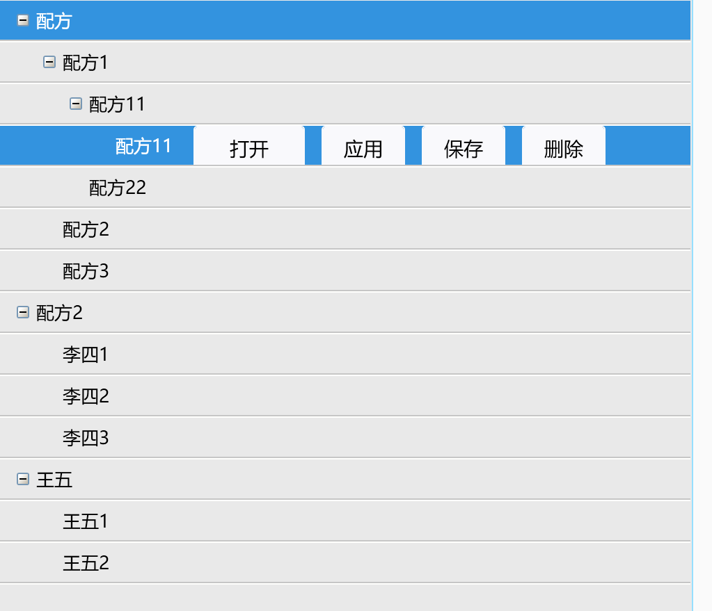
## 3.代码展示
> View：

```xml
    <UserControl.Resources>
		<!--Converter for Indentation of items-->
		<convert:LevelToIndentConverter x:Key="LevelIndentConverter" />

		<Style x:Key="ExpandCollapseToggleStyle" TargetType="{x:Type ToggleButton}">
			<Setter Property="Width" Value="19" />
			<Setter Property="Height" Value="13" />
			<Setter Property="Focusable" Value="False" />
			<Setter Property="Template">
				<Setter.Value>
					<ControlTemplate TargetType="{x:Type ToggleButton}">
						<Border Width="19" Height="13" Background="Transparent">
							<Border Width="9" Height="9" BorderThickness="1" BorderBrush="#FF7898B5" CornerRadius="1" SnapsToDevicePixels="true">
								<Border.Background>
									<LinearGradientBrush StartPoint="0,0" EndPoint="1,1">
										<LinearGradientBrush.GradientStops>
											<GradientStop Color="White" Offset=".2" />
											<GradientStop Color="#FFC0B7A6" Offset="1" />
										</LinearGradientBrush.GradientStops>
									</LinearGradientBrush>
								</Border.Background>
								<Path x:Name="ExpandPath" Margin="1,1,1,1" Fill="Black" Data="M 0 2 L 0 3 L 2 3 L 2 5 L 3 5 L 3 3 L 5 3 L 5 2 L 3 2 L 3 0 L 2 0 L 2 2 Z" />
							</Border>
						</Border>
						<ControlTemplate.Triggers>
							<Trigger Property="IsChecked" Value="True">
								<Setter Property="Data" TargetName="ExpandPath" Value="M 0 2 L 0 3 L 5 3 L 5 2 Z" />
							</Trigger>
						</ControlTemplate.Triggers>
					</ControlTemplate>
				</Setter.Value>
			</Setter>
		</Style>

		<DataTemplate x:Key="CellTemplate_Name">
			<DockPanel>
				<ToggleButton x:Name="Expander" Style="{StaticResource ExpandCollapseToggleStyle}" Margin="{Binding Path=Level,
                               Converter={StaticResource LevelIndentConverter},
                               RelativeSource={RelativeSource AncestorType={x:Type local:TreeListViewItem}}}" IsChecked="{Binding Path=IsExpanded,
                                  RelativeSource={RelativeSource AncestorType={x:Type local:TreeListViewItem}}}" ClickMode="Press" />
				<!--首列绑定值-->
				<TextBlock Text="{Binding Name}" />
			</DockPanel>
			<DataTemplate.Triggers>
				<DataTrigger Binding="{Binding Path=HasItems,
                                   RelativeSource={RelativeSource AncestorType={x:Type local:TreeListViewItem}}}" Value="False">
					<Setter TargetName="Expander" Property="Visibility" Value="Hidden" />
				</DataTrigger>
			</DataTemplate.Triggers>
		</DataTemplate>

		<ImageBrush x:Key="gvHeaderBackground" ImageSource="/SFFrameWork.Control.UI;component/Recipe/Assests/list_header_bk.png" />
		<Style x:Key="gvColumnHeaderStyle" TargetType="{x:Type GridViewColumnHeader}">
			<Style.Setters>
				<Setter Property="Height" Value="0" />
				<Setter Property="Background" Value="{StaticResource gvHeaderBackground}" />
			</Style.Setters>
		</Style>

		<GridViewColumnCollection x:Key="gvColumns">
			<GridViewColumn Header="名称" CellTemplate="{StaticResource CellTemplate_Name}" Width="130" />
			<!--<GridViewColumn Header="年龄" DisplayMemberBinding="{Binding Age}" Width="80" />
        <GridViewColumn Header="性别" DisplayMemberBinding="{Binding Sex}" Width="80" />
        <GridViewColumn Header="职务" DisplayMemberBinding="{Binding Duty}" Width="100" />-->
		</GridViewColumnCollection>

		<GridViewColumnCollection x:Key="gvColumns02">
			<GridViewColumn>
				<GridViewColumn.CellTemplate>
					<DataTemplate>
						<StackPanel Orientation="Horizontal" VerticalAlignment="Center" HorizontalAlignment="Center">
							<Button Content="打开" Command="{Binding OpenRecipeCmd}" Width="80"/>
						</StackPanel>
					</DataTemplate>
				</GridViewColumn.CellTemplate>
			</GridViewColumn>
			<GridViewColumn>
				<GridViewColumn.CellTemplate>
					<DataTemplate>
						<StackPanel Orientation="Horizontal" VerticalAlignment="Center" HorizontalAlignment="Center">
							<Button Content="应用" Command="{Binding ApplyRecipeCmd}" />
						</StackPanel>
					</DataTemplate>
				</GridViewColumn.CellTemplate>
			</GridViewColumn>
			<GridViewColumn>
				<GridViewColumn.CellTemplate>
					<DataTemplate>
						<StackPanel Orientation="Horizontal" VerticalAlignment="Center" HorizontalAlignment="Center">
							<Button Content="保存" Command="{Binding SaveRecipeCmd}"/>
						</StackPanel>
					</DataTemplate>
				</GridViewColumn.CellTemplate>
			</GridViewColumn>
			<GridViewColumn>
				<GridViewColumn.CellTemplate>
					<DataTemplate>
						<StackPanel Orientation="Horizontal" VerticalAlignment="Center" HorizontalAlignment="Center">
							<Button Content="删除" Command="{Binding DelRecipeCmd}" />
						</StackPanel>
					</DataTemplate>
				</GridViewColumn.CellTemplate>
			</GridViewColumn>
		</GridViewColumnCollection>

		<!--交替行样式-->
		<AlternationConverter x:Key="conBack">
			<SolidColorBrush>#FFE9E9E9</SolidColorBrush>
			<SolidColorBrush>#FFE9E9E9</SolidColorBrush>
		</AlternationConverter>

		<Style TargetType="{x:Type local:TreeListViewItem}">
			<Setter Property="FontSize" Value="13" />
			<Setter Property="Background" Value="Transparent" />
			<Setter Property="SnapsToDevicePixels" Value="True" />
			<Setter Property="HorizontalContentAlignment" Value="Stretch" />
			<Setter Property="VerticalContentAlignment" Value="Center" />
			<Setter Property="IsSelected" Value="{Binding IsSelected}" />
			<Setter Property="IsExpanded" Value="{Binding IsExpanded}" />
			<Setter Property="Background" Value="{Binding RelativeSource={RelativeSource Self},
                Path=(local:TreeListView.AlternationIndex),
                Converter={StaticResource conBack}}" />
			<Setter Property="Template">
				<Setter.Value>
					<ControlTemplate TargetType="{x:Type local:TreeListViewItem}">
						<StackPanel>
							<Border x:Name="outerBorder" BorderThickness="0,0,0,1" BorderBrush="#FFFFFFFD" Margin="0" Padding="0" Height="30" HorizontalAlignment="{TemplateBinding HorizontalContentAlignment}" SnapsToDevicePixels="True">
								<Border x:Name="innerBorder" BorderThickness="0,0,0,1" BorderBrush="#FFC6C6C6" Background="{TemplateBinding Background}" Padding="{TemplateBinding Padding}" HorizontalAlignment="{TemplateBinding HorizontalContentAlignment}" SnapsToDevicePixels="True">
									<StackPanel Orientation="Horizontal">
										<GridViewRowPresenter x:Name="PART_Header" Content="{TemplateBinding Header}" Columns="{StaticResource gvColumns}" HorizontalAlignment="{TemplateBinding HorizontalContentAlignment}" VerticalAlignment="{TemplateBinding VerticalContentAlignment}" />
										<GridViewRowPresenter x:Name="PART_Header02" Visibility="Collapsed" Content="{TemplateBinding Header}" Columns="{StaticResource gvColumns02}" HorizontalAlignment="{TemplateBinding HorizontalContentAlignment}" VerticalAlignment="{TemplateBinding VerticalContentAlignment}" />
									</StackPanel>
								</Border>
							</Border>
							<ItemsPresenter x:Name="ItemsHost" />
						</StackPanel>
						<ControlTemplate.Triggers>
							<Trigger Property="IsMouseOver" Value="true" SourceName="innerBorder">
								<Setter Property="Foreground" Value="White" />
								<Setter Property="Background" Value="#3393DF" TargetName="innerBorder" />
							</Trigger>
							<Trigger Property="IsSelected" Value="true">
								<Setter Property="Foreground" Value="White" />
								<Setter Property="Background" Value="#3393DF" TargetName="innerBorder" />
								<Setter Property="Visibility" Value="Visible" TargetName="PART_Header02" />
							</Trigger>
							<Trigger Property="IsExpanded" Value="false">
								<Setter TargetName="ItemsHost" Property="Visibility" Value="Collapsed" />
							</Trigger>
							<Trigger Property="IsEnabled" Value="false">
								<Setter Property="Foreground" Value="{DynamicResource {x:Static SystemColors.GrayTextBrushKey}}" />
							</Trigger>
							<MultiTrigger>
								<MultiTrigger.Conditions>
									<Condition Property="IsSelected" Value="true" />
									<Condition Property="IsSelectionActive" Value="false" />
								</MultiTrigger.Conditions>
								<Setter TargetName="innerBorder" Property="Background" Value="{DynamicResource {x:Static SystemColors.ControlBrushKey}}" />
								<Setter Property="Foreground" Value="{DynamicResource {x:Static SystemColors.ControlTextBrushKey}}" />
							</MultiTrigger>
							<MultiTrigger>
								<MultiTrigger.Conditions>
									<Condition Property="HasHeader" Value="false" />
									<Condition Property="Width" Value="Auto" />
								</MultiTrigger.Conditions>
								<Setter TargetName="PART_Header" Property="MinWidth" Value="75" />
								<Setter TargetName="PART_Header02" Property="MinWidth" Value="75" />
							</MultiTrigger>
							<MultiTrigger>
								<MultiTrigger.Conditions>
									<Condition Property="HasHeader" Value="false" />
									<Condition Property="Height" Value="Auto" />
								</MultiTrigger.Conditions>
								<Setter TargetName="PART_Header" Property="MinHeight" Value="19" />
								<Setter TargetName="PART_Header02" Property="MinHeight" Value="19" />
							</MultiTrigger>
						</ControlTemplate.Triggers>
					</ControlTemplate>
				</Setter.Value>
			</Setter>
		</Style>

		<Style TargetType="{x:Type local:TreeListView}">
			<Setter Property="Template">
				<Setter.Value>
					<ControlTemplate TargetType="{x:Type local:TreeListView}">
						<!--Create a standard border around the 'TreeListView'.-->
						<Border Padding="{TemplateBinding Padding}" BorderBrush="{TemplateBinding BorderBrush}" BorderThickness="{TemplateBinding BorderThickness}" Background="{TemplateBinding Background}">
							<!--ScrollViewer providing horizontal scrolling functionality 
                                for both, content and headers.-->
							<ScrollViewer HorizontalScrollBarVisibility="Auto" VerticalScrollBarVisibility="Disabled">
								<DockPanel>
									<!--The header row.-->
									<GridViewHeaderRowPresenter DockPanel.Dock="Top" ColumnHeaderContainerStyle="{StaticResource gvColumnHeaderStyle}" Columns="{StaticResource gvColumns}" />
									<!--ScrollViewer providing vertical scrolling
                                        functionality for the content.-->
									<ScrollViewer HorizontalScrollBarVisibility="Disabled" VerticalScrollBarVisibility="Auto">
										<!--ItemsPresenter containg the content.-->
										<ItemsPresenter />
									</ScrollViewer>
								</DockPanel>
							</ScrollViewer>
						</Border>
					</ControlTemplate>
				</Setter.Value>
			</Setter>
		</Style>
    </UserControl.Resources>
    <Grid>
        <Grid.ColumnDefinitions>
            <ColumnDefinition Width="500"/>
            <ColumnDefinition/>
        </Grid.ColumnDefinitions>
        <local:TreeListView x:Name="treeListView" Grid.Column="0" Background="#FFE9E9E9" BorderBrush="#FF96DFFF" AlternationCount="2" ItemsSource="{Binding StaffList}">
            <local:TreeListView.ItemTemplate>
                <HierarchicalDataTemplate ItemsSource="{Binding StaffList}" />
            </local:TreeListView.ItemTemplate>
        </local:TreeListView>
        <TabControl Grid.Column="1" Margin="5,0,0,0" TabStripPlacement="Top" ItemsSource="{Binding RecipeItemList}" SelectedItem="{Binding SelectedItem}" IsEnabled="{Binding IsItemOpen}">
            <!--<TabControl.ItemContainerStyle>
                <Style TargetType="TabItem" BasedOn="{StaticResource TabItemHorizontalStyle}">
                    <Setter Property="Visibility" Value="{Binding IsHidden, Converter={StaticResource bInvertVisible}}" />
                </Style>
            </TabControl.ItemContainerStyle>
            <TabControl.ItemTemplate>
                <DataTemplate>
                    <TextBlock Text="{Binding Header}" FontSize="12" />
                </DataTemplate>
            </TabControl.ItemTemplate>
            <TabControl.ContentTemplate>
                <DataTemplate>
                    <ContentControl Content="{Binding TabModel}" />
                </DataTemplate>
            </TabControl.ContentTemplate>-->
        </TabControl>
    </Grid>
</UserControl>

```

> ViewModel:

```csharp
	public class Staff : ViewModelBase
	{
		private string _Name;
		private int _Age;
		private string _Sex;
		private string _Duty;
		private bool _IsSelected;
		private bool _IsExpanded;


		private ObservableCollection<Staff> _StaffList = new ObservableCollection<Staff>();

		public ObservableCollection<Staff> StaffList
		{
			get { return _StaffList; }
			set
			{
				_StaffList = value;
				OnPropertyChanged();
			}
		}

		/// <summary>
		/// 姓名
		/// </summary>
		public string Name
		{
			get { return _Name; }
			set
			{
				_Name = value;
				OnPropertyChanged();
			}
		}
		/// <summary>
		/// 年龄
		/// </summary>
		public int Age
		{
			get { return _Age; }
			set
			{
				_Age = value;
				OnPropertyChanged();
			}
		}
		/// <summary>
		/// 性别
		/// </summary>
		public string Sex
		{
			get { return _Sex; }
			set
			{
				_Sex = value;
				OnPropertyChanged();
			}
		}
		/// <summary>
		/// 职务
		/// </summary>
		public string Duty
		{
			get { return _Duty; }
			set
			{
				_Duty = value;
				OnPropertyChanged();
			}
		}

		/// <summary>
		/// 是否选中
		/// </summary>
		public bool IsSelected
		{
			get { return _IsSelected; }
			set
			{
				_IsSelected = value;
				OnPropertyChanged();
			}
		}
		/// <summary>
		/// 是否展开
		/// </summary>
		public bool IsExpanded
		{
			get { return _IsExpanded; }
			set
			{
				_IsExpanded = value;
				OnPropertyChanged();
			}
		}

		public Staff()
		{
			IsSelected = false;
			IsExpanded = false;
		}
	}
	public class RecipeMainViewModel:ViewModelBase
	{
		private ObservableCollection<Staff> _StaffList = new ObservableCollection<Staff>();

		public ObservableCollection<Staff> StaffList
		{
			get { return _StaffList; }
			set
			{
				_StaffList = value;
				OnPropertyChanged();
			}
		}

        public RecipeMainViewModel()
        {
			Staff staff = new Staff()
			{
				Name = "配方",
				Age = 30,
				Sex = "男",
				Duty = "经理",
				IsExpanded = true
			};

			Staff staff2 = new Staff()
			{
				Name = "配方1",
				Age = 21,
				Sex = "男",
				Duty = "员工",
				IsExpanded = true
			};
			Staff staff3 = new Staff()
			{
				Name = "配方11",
				Age = 21,
				Sex = "男",
				Duty = "员工"
			};
			Staff staff31 = new Staff()
			{
				Name = "配方111",
				Age = 21,
				Sex = "男",
				Duty = "员工"
			};
			staff3.StaffList.Add(staff31);
			staff2.StaffList.Add(staff3);
			staff3 = new Staff()
			{
				Name = "配方22",
				Age = 21,
				Sex = "女",
				Duty = "员工"
			};
			staff2.StaffList.Add(staff3);
			staff.StaffList.Add(staff2);
			staff2 = new Staff()
			{
				Name = "配方2",
				Age = 22,
				Sex = "女",
				Duty = "员工"
			};
			staff.StaffList.Add(staff2);
			staff2 = new Staff()
			{
				Name = "配方3",
				Age = 23,
				Sex = "女",
				Duty = "员工"
			};
			staff.StaffList.Add(staff2);
			StaffList.Add(staff);

			staff = new Staff()
			{
				Name = "配方2",
				Age = 31,
				Sex = "男",
				Duty = "副经理"
			};
			staff2 = new Staff()
			{
				Name = "李四1",
				Age = 24,
				Sex = "女",
				Duty = "员工"
			};
			staff.StaffList.Add(staff2);
			staff2 = new Staff()
			{
				Name = "李四2",
				Age = 25,
				Sex = "女",
				Duty = "员工"
			};
			staff.StaffList.Add(staff2);
			staff2 = new Staff()
			{
				Name = "李四3",
				Age = 26,
				Sex = "男",
				Duty = "员工"
			};
			staff.StaffList.Add(staff2);
			StaffList.Add(staff);

			staff = new Staff()
			{
				Name = "王五",
				Age = 32,
				Sex = "女",
				Duty = "组长"
			};
			staff2 = new Staff()
			{
				Name = "王五1",
				Age = 27,
				Sex = "女",
				Duty = "员工"
			};
			staff.StaffList.Add(staff2);
			staff2 = new Staff()
			{
				Name = "王五2",
				Age = 28,
				Sex = "女",
				Duty = "员工"
			};
			staff.StaffList.Add(staff2);
			StaffList.Add(staff);
		}
    }
```

> Converter:

```csharp
	/// <summary>
	/// Convert Level to left margin
	/// Pass a prarameter if you want a unit length other than 19.0.
	/// </summary>
	public class LevelToIndentConverter : IValueConverter
	{
		public object Convert(object o, Type type, object parameter,
							  CultureInfo culture)
		{
			return new Thickness((int)o * c_IndentSize, 0, 0, 0);
		}

		public object ConvertBack(object o, Type type, object parameter,
								  CultureInfo culture)
		{
			throw new NotSupportedException();
		}

		private const double c_IndentSize = 19.0;
	}
```
# 11.
