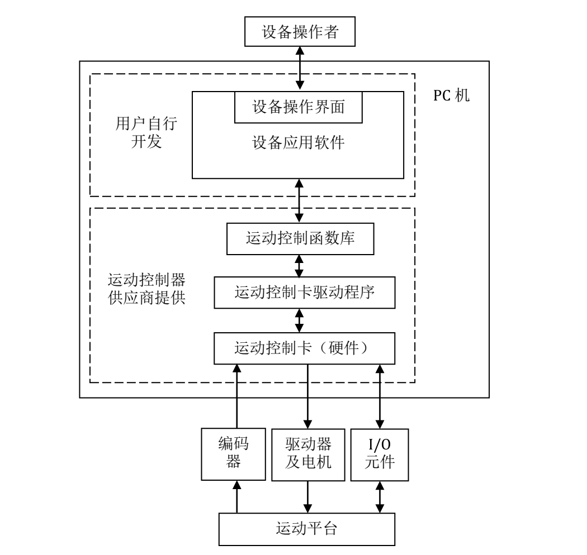

@[TOC](目录)

>知识在于理解,运用在于总结,高阶在于巩固!
>简单记录下自己接触到的工控知识，比较杂，希望对以下知识技术点有一个入门级的认识。
> 

# 1.运动控制专题

> 大佬科普运动控制系统链接：https://www.cnblogs.com/cariohu/p/15508175.html。
## 1.简介

>控制分为:过程控制(偏连续性控制，气体液体流速等)和运动控制(偏离散性控制，例如气缸、阀门、电机等)。
>
>运动控制包括:开环(步进电机)、半开环(伺服电机)、闭环(光栅、直线电机)。精度:开环<半开环<闭环。
>
>如果我们的项目涉及到一些运动相关的控制，我们必然会提前选择好电机，如果要求精度比较高，一般会选择伺服电机，否则的话，我们可以选择步进电机来进行运动控制，但是，无论是步进电机还是伺服电机，一般都是和其对应的驱动器是配套的。那么后续的问题在于如何通过步进（伺服）驱动器进行步进（伺服）电机的控制？
>一般来说，我们有以下几种方案：
>
>1. 采用PLC进行控制，目前市场上的大部分PLC都是支持运动控制的，大部分PLC可以扩展到32轴，根据驱动器类型可以采用脉冲控制、总线控制或模拟量控制。
>
>2.  采用运动控制卡控制，运动控制卡是专门进行运动控制的一种控制器，可以进行多达256轴的控制，运动控制卡需要PC编程。
>
>3. 采用运动控制器控制，运动控制器与运动控制卡不同之处在于，可以脱离PC电脑的束缚，编写完程序下载到控制器里，即可直接对驱动器进行控制。
>
>电机在低转速的时候，是控制不稳定的，有很大的波动，这个和电机内部结构是有很大关系的，所以电机一般都是上千转。


## 2.运动控制卡

### 1.简介

> 运动控制卡控制方式：运动控制卡 → 驱动器 → 电机 → 机械运动。

> 控制器或者控制卡的性能主要取决于控制算法，不同厂家控制卡的性能差别可能非常大。目前常见工业应用中比较高端的有以色列ACS，美国Aerotech，这是属于第一梯队的，其他国外的流行品牌还有elmo、PMAC、Galil、欧姆龙等。国内的有固高、雷赛、正运动、柏楚等，与国外产品相比仍然有一定差距，但也在不断突破。
>
> 根据控制器传递命令给驱动器的方式，可以分为总线型、模拟量型、PWM型、脉冲型控制卡。目前，总线型控制卡是最主流的，各大厂家的口号都是一网到底，这个网就是指的总线，就是通过一根总线把所有模块都接上去，确实方便。其他三种类型控制卡也有各自的特色，所以都并行存在于主流市场。

### 2.运动控制卡和PLC的区别

> 运动控制卡与PLC都是控制器，主要负责工业自动化系统中运动轴控制、输入输出信号控制；
> PLC肯定是通用一些，通讯组态都比较灵活，选择也很多!一般运动控制卡CPU模块是4轴，但可以扩展，现在大部分都能扩到32轴。一般低端点的PLC有两个高速输出点，可以控制2轴步进，也可以购买相关的轴控制模块，或者有直接控制伺服的PLC，一般也是可以到32轴。如果跟PLC比，PLC专长在于逻辑IO控制，而运动控制卡就跟专业伺服电机的控制对运动而已他的指令很简单，控制的方式更多。齿轮，插补，凸轮等但在IO处理起来就不像有PLC的梯形图那么简单，要语言编程。
>
> 运动控制卡：基于PC界面，由于PC机的强大功能，因此与其一起组成的运动控制器功能最强，但其工作稳定性、可靠性较差。运动控制卡通过PCI插槽将控制卡插在PC的主机上；利用高级编程语言C++、C#、VB、VB.NET、labview等编程语言进行开发；编程中使用运动控制卡厂商提供的控制卡API接口函数，来实现对控制卡资源的使用；运动控制卡通过发送脉冲的方式控制伺服或步进驱动器来控制伺服电机或步进电机、通过读取输入信号、控制输出信号来实现对继电器、传感器、气缸等IO的控制；运动控制卡主要的优势在于利用PC强大的功能，比如CAD功能、机器视觉功能、软件高级编程等；利用FPGA+DSP / ARM + DSP芯片的功能实现高精度的运动控制（多轴直线、圆弧插补等，运动跟随，PWM控制等）。
>
> PLC可编程逻辑控制器：主要功能是对开关量进行逻辑控制，并有简单的运动控制（直线轨迹控制）、运算、数据处理等功能，通常采用触摸屏作人机界面。具有工作可靠，编程简单等优点，但其运动控制功能相对简单。PLC的应用过程中主要通过PLC+HMI，这就导致可视化界面受到极大地限制，实际应用过程中最大的问题就是不能实现导图功能；现在由于机器视觉大力的发展与应用，PLC与机器视觉的结合难度很大；目前有部分厂商给PLC提供一种机器视觉方案，独立的PC机处理视觉部分，将处理的结果发送给PLC，PLC来应用所接收数据进行操作。这种方式提高了开发成本，一套控制系统需要两套软件来执行。

### 3.运动控制卡开发体系



### 4.固高运动控制卡开发事项

> 1. 选卡的选项要注意是否有PSO功能，能支持几个轴。以GSN系列为例，卡包含2个模块，每个模块可以装4各轴，总共可以装8各轴。
> 2. 一般要在轴插补的时候打开PSO，但是插补的轴要在同一个模块上。


## 3.知识点普及

### 1. 电机减速机、扭矩

> 减速机的原理是什么？
> 电机加上减速机可以实现低速大扭矩，减速机(增扭机)的作用就是减小速度，增大输出扭矩。根据能量守恒，转速低了扭矩自然要高。 <br>
> 为什么要用到减速机？
> 是由于电机运转时转速很高，但扭力很小，此时利用一个减速装置来降低电机转速，同时提升负载能力（提升扭力或扭矩），等于提高了电机的工作能力。因为能量守恒定律告诉我们，电机输出功率不可能无缘无故地变，只可能因为各种损耗变成热能量了。功率不变，速度减小，那就使力量（力矩）变大了；而且我们想要理想的扭矩，要么要一个大的伺服，要么要一个小的伺服加一个减速机，结果一般是一个伺服加一个减速机的成本小于一个大号伺服的价格。<br>

### 2.  伺服电机、步进电机

> 步进电机是通过控制脉冲的个数控制转动角度的，一个脉冲对应一个步距角。 伺服电机是通过控制脉冲时间的长短控制转动角度的。

> 伺服电机是一种精密控制电机，它的构成可以分为以下几个部分:
> * 转子:伺服电机的转子是电机的旋转部分，通常由永磁体或者电磁线圈构成。电机通过控制转子的位置和速度来实现精确运动控制。
> * 定子:电机的定子是电机的定位部分，通常由铁芯和线圈构成。当电流通过线圈时，它会产生磁场，使定子中的铁芯产生磁力吸引转子，从而实现电机的运动。
> * 编码器:编码器是伺服电机的反馈元件，它可以测量电机的位置和速度。编码器通常由光电系统或者磁电系统组成，可以将电机的运动状态转换为数字信号，供控制器使用。
> * 控制器:控制器是伺服电机的核心部件，它负责实时控制电机的转速和位置。控制器通常由微处理器和放大器构成，可以根据编码器反馈的信号进行闭环控制，在预定时间内实现精确运动。
> 
> 对于伺服电机，一个轴控卡可以控制多个驱动器，每个驱动器只能控制一个轴，从而导致一个轴运动控制卡来控制多个轴。
伺服电机组成:位置环、速度环、电流环。运动伺服一般都是三环控制系统,从内到外依次是电流环、速度环、位置环。
伺服电机可以通过编码器来告诉驱动器电机具体转了多少。<br>

> 步进电机是一种将电脉冲转化为角位移的执行机构。当步进驱动器接收到一个脉冲信号，它就驱动步进电机按设定的方向转动一个固定的角度（称为“步距角”），它的旋转是以固定的角度一步一步运行的。
> **可以通过控制脉冲个数来控制角位移量，从而达到准确定位的目的；同时可以通过控制脉冲频率来控制电机转动的速度和加速度，从而达到调速的目的。**
### 3. 点位运动、连续运动、直线和圆弧插补运动

> 点位运动是指：运动控制器控制运动平台从当前位置开始以设定的速度运动到指定位置后准确地停止。
点位运动只关注终点坐标，对运动轨迹的精度没有要求。点位运动的运动距离由脉冲数决定，运动速度由脉冲频率决定。
多轴同时做点位运动，称之为多轴联动。<br>
如果从起点到终点都需要按照规定的路径运动，就必须采用直线插补或圆弧插补功能。<br>
连续运动是指：电机从起始速度开始运行，加速至最大速度后连续运动；只有当接收到停止指令或外部停止信号后，才减速停止。
连续运动指令其实就是速度控制指令，国外运动控制器将此指令称为 JOG 指令。<br>
> 为了实现轨迹控制，运动控制卡按照一定的控制策略控制多轴联动，使运动平台用微小直线段精确地逼近轨迹的理论曲线，保证运动平台从起点到终点上的所有轨迹点都控制在允许误差范围内。这种控制策略称为插补算法，因此轨迹运动通常称为插补运动。插补运动有许多种类，如：直线插补、圆弧插补、螺旋线插补等。
### 4.软限位和正限位

> 软限位是通过软件设置的限制，用于限定轴的运动范围，防止超出机械结构所能承受的极限。软限位的范围一般比硬限位的范围要小。软限位可以在安装调试过程中根据实际情况进行设置，例如避免与其他设备干涉或限制机器人的运动范围。软限位的设置不需要额外的成本，并且可以避免误操作造成财产损失。<br>
硬限位是通过机械结构实现的限制，用于限定轴的运动范围。通常通过安装限位块或设置机械结构上的螺丝孔来实现。硬限位的设置是确保设备和人员安全的重要措施。在机器人中，部分型号的机器人的部分关节轴可能会有硬限位的解决方案。不同型号的机器人可能有不同的硬限位设置方法和规格。<br>
软限位通过软件设置，硬限位通过机械结构实现。软限位主要用于避免干涉和限制运动范围，而硬限位主要用于确保设备和人员的安全。
### 5.脉冲当量、脉冲数、脉冲频率

> 脉冲当量是当控制器输出一个定位控制脉冲时，所产生的定位控制移动的位移。对直线运动来说，是指移动的距离，对圆周运动来说，是指其转动的角度。简单说，就是发一个脉冲，电机能走多少距离，也就是电机的最小精度。我们控制电机运动，就是向电机发送脉冲信号。那么如果想得到前进的距离，就需要将脉冲个数*脉冲当量，来得到这个距离。<br>
> 而脉冲数就是对应发脉冲的个数来控制电机移动的距离，我们需要计算出就需要将脉冲个数乘以脉冲当量，来得到这个距离。<br>
> 脉冲频率是指每秒向电机发送的脉冲数量。通常情况下，脉冲频率越高，电机转速越快。因此脉冲频率越高，电机速度越快。<br>
> 简而言之，脉冲总量确定电机位移，脉冲频率确定电机速度。
### 6.回零：光电开关和编码器信号

> 电机控制轴回零一般有2种方式：光电开关和编码器。
> 光电开关是外部的，编码器是内部的，最好用内部的编码器信号，因为相比光电开关稍微准确一点。而且编码器外部的位置容易变动，归零的速度不一样会对归零的位置有影响，因此对精度要求稍高的话，可以采用编码器回零方式。
### 7.前瞻

> 前瞻功能是指对插补运动指令来进行预计算，在拐角或者高曲率的地方，增高或降低相应速度，使直线和曲线部分的整个运动保持匀速。在进行插补运动时候，往往要打开前瞻功能。<br>
> 设想一个场景，在实际加工过程中，为追求加工效率会开启连续插补，运动轨迹的拐角处若不减速，当拐角较大时，会对机台造成较大冲击，影响加工精度。若关闭连续插补，使拐角处减速为0，虽然保护了机台，但是加工效率受到了较大影响，所以提供了前瞻指令，使在拐角处自动判断是否将拐角速度降到一个合理的值，既不会影响加工精度又能提高加工的速度，这就是轨迹前瞻功能的作用。　　运动控制器的轨迹前瞻可以根据用户的运动路径自动计算出平滑的速度规划，减少机台的冲击，从而提高加工精度。自动分析在运动缓冲区的指令轨迹将会出现的拐点，并依据用户设置的拐角条件，自动计算拐角处的运动速度，也会依据用户设定的最大加速度值计算速度规划，使任何加减速过程中的加减速都不超过ACCEL和DECEL的值，防止对机械部分产生破坏冲击力。

### 8.PSO

> PSO功能是指让运动轨迹等间距输出，这样可以保证在拐角处也能匀速运动或者控制激光出光。

> 以激光打标为例，假如我们要用激光在一张板子上画一个正方形：

```c#
class LaserMarkingExample {
    struct Point {
        double x;
        double y;
        bool laserState;  // true = 开激光，false = 关激光
    };

    void markSquare() {
        // 正方形的四个角点
        vector<Point> squarePoints = {
            {0,    0,    true},    // 起点，开激光
            {100,  0,    true},    // 右移
            {100,  100,  true},    // 上移
            {0,    100,  true},    // 左移
            {0,    0,    true},    // 回到起点
        };

        // 没有PSO的情况
        void markWithoutPSO() {
            // 可能会出现位置和激光不同步的问题
            for(auto point : squarePoints) {
                moveToPosition(point.x, point.y);
                setLaser(point.laserState);  // 激光可能滞后或提前
            }
        }

        // 使用PSO的情况
        void markWithPSO() {
            // PSO确保激光和位置精确同步
            setPSOPoints(squarePoints);  // 设置PSO点位
            startMotion();               // 启动运动
            // PSO自动在正确的位置触发激光
        }
    }
};
```

> **实际效果对比：**
>
> 没有PSO：
>
> * 运动到位置 → 延时 → 开激光
>
> * 可能会在拐角处出现烧灼
>
> * 直线段可能起始不齐


> 使用PSO：
>
> * 位置和激光完全同步
>
> * 拐角清晰
>
> * 直线段起始整齐


> 就像用笔画正方形：
>
> 没有PSO = 一边走一边看到位了才下笔
>
> 有PSO = 精确知道什么位置下笔，动作连贯流畅
>
> PSO就是确保"笔"（激光、喷头等）在精确的位置动作，不早也不晚。

# 2.激光切割专题

## 1.激光切割系统简介

> 常用结构：
> 

## 2.振镜、振镜卡、激光器

>  激光器、振镜、振镜卡的关系：激光器(产生激光)，控制卡(装载软件控制激光打标)，振镜(马达转动改变激光路线)。<br>
>  CO2的切割精度不如UV和绿光激光器。CO2激光器的热影响比较大，UV、绿光激光器的热影响小。区别：UV主要适用于激光冷加工，UV会直接把物体的化学键打断，CO2是通过大功率、高温融掉化学键。

### 1.激光器功率

> 1. 一般情况下，激光振镜控制卡会提供三种激光能量输出模式，以固高GSN系列控制卡为例：
>
> * 占空比输出模式：
>   该模式通过设置频率和占空比调节激光器能量。使用时调用指令 GTN_LaserPowerMode 将激光设置为占空比输出模式，调用指令 GTN_LaserOutFrq 设置 PWM 信号的输出频率，调用指令 GTN_LaserPrfCmd 设置 PWM 信号的输出占空比，并调用函数 GTN_LaserOn 启动输出。
> * 频率输出模式：
>   该模式通过设置频率和脉宽调节激光器能量。使用时调用指令 GTN_LaserPowerMode 将激光设置为频率输出模式，调用指令 GTN_LaserPrfCmd 设置频率输出值，并调用指令 GTN_LaserOn 启动输出。
> * 模拟量输出模式：
>   该模式通过设置输出电压调节激光器能量。使用时调用指令 GTN_LaserPowerMode 将激光设置为 DA 输出模式，调用指令 GTN_LaserPrfCmd 设置 DA 输出值，并调用指令 GTN_LaserOn 启动输出。

### 2. 振镜

> 激光振镜是一种专门用于激光加工领域的特殊的运动器件，它靠两个振镜反射激光，形成
> XY 平面的运动。激光振镜不同于一般的电机，激光振镜具有非常小的惯量，且在运动的过程中
> 负载非常小（只有两个小的反射镜片），系统的响应非常快。

> 振镜模块不仅可以对电机进行控制，同时还可以对激光振镜进行运动控制，来完成振镜的定位和插补运动，并且在运动过程中可以实现激光的控制、IO的控制、DA的控制等工艺操作，所有的功能都将在振镜运动坐标系中完成。 

> 激光振镜运动如下图所示，在此过程中包含了两种基本的运动：一种为跳转（Jump）运动，
> 一种为标刻（Mark）运动。
> 
> 在上图中，有两种轨迹形式，一种是虚线，一种是实线。其中，虚线为跳转（Jump）指令（该轨迹运动中激光是呈关闭状态），实线为标刻（Mark）指令（该轨迹运动中激光呈打开状态）。<br>
> Jump 运动由于是一个跳转指令，在运动的过程中，激光呈关闭状态，不影响轨迹的加工，因此可以以很大的速度运动。Mark 运动为标刻指令，在运动过程中，激光呈开启状态，进行轨迹的加工，因此用户需要把 Mark 运动的速度设置得相对低一些。<br>
> 标刻运动时，激光会按照设定的 Mark 速度沿着给定的标刻轨迹运动，在执行一个 Mark 指
> 令时，激光振镜运动控制器会自动地开启激光。如果下一条仍是 Mark 指令，激光一直呈开启状 态，直到最后一条 Mark指令结束，或缓存区指令执行完毕。

## 3.Box矫正

> [[基于激光振镜控制器的高精度视觉校正振镜精度解决方案](https://www.cnblogs.com/zmtion/articles/18164219)]

## 4.3D振镜

## 5.飞行切割

> 当待切割图形是规则的图形，如(矩形、整圆、多边形)而且呈一定规定排布时，通过扫描切割将同方向的线段连起来进行飞行切割，将大大提高切割速度，节省切割时间，这就是飞行切割。
> <br>
> 进行扫描切割之前，建议用户先对需要扫描的图形进行排序，此操作可以优化扫描切割的路径，节省空移时间。单击常用菜单栏下“飞切”按钮（注意：当规则阵列的组成图形全部是圆时，该按钮功能为圆弧飞行切割）或下拉菜单中“直线飞行切割”选项，进入直线飞行切割参数设置界面。

## 6.如何做到软件控制不同厂家激光器

> 目前市面上不同厂家的激光器通信协议不同，如果只是通过设计软件来控制不同种类的激光器，那么需要开发人员二次开发每种激光器的API，很麻烦，工作量也很大。但是可以自己定做板卡，通过板卡连接线来连接不同激光器，做到控制激光器的电压，通过电压值来控制激光器的功率等参数。

## 7.激光器软件控制科普

> 激光器常见的有Co2激光器和UV激光器。<br>
> Co2激光器可以由振镜控制卡、运动控制卡直接控制IO的方式来控制激光器基本参数，比如设置占空比、功率、控制开关光。如下图为固高GSN系列控制卡提供的Co2激光器控制功能界面：
> 
> <br>UV激光器不由运动控制卡或振镜控制卡来控制，而是通过厂商提供的API列表，软件工程师来做一层封装进行二次开发，就像封装固高dll一样。<br>
> 另外，激光器从散热方面划分，分为水冷激光器和风冷激光器。<br>
> 水冷激光器必须要接冷水机通过液体降温。风冷激光器则通过通风方式进行降温。

## 8.激光隐切

### 1.隐切简介

> 激光隐切是指切割物体内部材料而不是表面。
> 如下图分别为晶圆切割技术中的金刚石刀片切割、砂轮切割、机关表切、激光隐切。
> 
> <br>
> 激光隐切技术通过将激光聚焦形成小面积的光斑，可产生巨大的能量密度，进而实现晶圆切割。<br>
> 激光隐切具有高速、高质量（无碎屑或极少碎屑）和低切口损失等优势。激光隐切的具体工艺过程可分为两个步骤：
>
> * 激光诱导穿孔：采用光学系统将可透过晶圆的脉冲激光束聚焦到晶圆表面下方的焦点，当该焦点处激光功率密度达到峰值时，将会形成穿孔，此时晶圆上的芯片还未产生分离；
> * 芯片分离：将放置在晶圆的蓝膜展开后，由于激光穿孔附近存在较大的张应力和压应力，因此可沿着激光路径在晶圆内部诱导产生裂缝，实现芯片分离。

### 2.隐切过程存在的问题以及改进

>尽管尽管激光隐切技术具有诸多优势，但在切割过程中仍会受到一系列问题的干扰。主要的干扰有：
>
>* **晶圆表面翘曲影响切割精度**：晶圆表面翘曲、激光能量密度调控问题将导致激光焦点无法精确落在晶圆中的具体薄层，阻碍了切割精度、芯片良率的进一步提升；
>  

>* **激光作用不均匀导致过度加工**：由于激光束在加速、减速和转角段难以均匀作用于晶圆，容易出现过度加工等问题；
>  


>针对以上问题，目前学术界和产业界提出了一系列的解决方案，如图5所示，具体包括：
>
>* **实时高度跟随控制**：在切割晶圆时，通过位移传感器实时测量产品表面微小的高度波动，并实时补偿到激光器所在的z轴，确保激光焦点精确落在晶圆中的具体薄层；
>  

>* **高速位置比较输出控制(PSO)**：开发高度跟随算法，有效避免了激光在加速、减速和转角段的过度加工问题，使激光均匀地作用在被加工物体上；
>  

## 9.激光自动寻焦原理

> 1. 激光不同的Z方向高度打在玻璃上呈现的形状不一样，焦点位置光斑最小最圆(激光打圆方式)。也可以通过打线来判断激光焦点(相机测量最细的线，基本也是焦点)。因此判断激光器焦点通常有2种方式：打圆、打直线。
> 2. 具体动作流程：硬件方面需要有X轴(或Y轴)、相机、Z轴、激光器。X轴或Y轴用来调整物体平面位置，因为总不能在物体同一个地方打光。通过X轴或Y轴，调整物体要进行打光的部位，相机用来拍下每个高度的Z轴对应的打光后图片，然后通过视觉算法来进行处理，挑选出效果最好的图片，然后记录图片对应的高度Z即为激光器的焦距。

## 10.激光干涉仪

> 激光干涉仪在激光切割中主要用于精密测量和位置反馈，它是一种基于激光干涉原理的高精度测量仪器，可以用来测试比如大理石等的水平度。当两束激光波在空间中叠加时，它们会产生干涉现象，形成明暗相间的干涉条纹。这些干涉条纹的位置取决于两束激光波的相位差。因此，通过测量干涉条纹的位置，可以确定两束激光波的相位差，进而得出被测量的信息。
>
> 激光干涉仪的主要组成部分包括激光器、分束器、反射镜和探测器。激光器发出激光，分束器将激光分成两束，反射镜将其中一束激光反射回来，两束激光在空间中叠加形成干涉现象。干涉条纹被探测器检测到，通过信号处理可以得出被测量的信息。
> 首先需要先了解光的干涉：
> 
> 激光干涉仪或者一些精密测量仪器会受到温湿度、气压等因素影响，因此好多车间都恒温恒压。

> 

# 3.半导体专题

## 1.贴片机（固晶机）

> 固晶机，又称为贴片机，英文是Die Bonder，是一种固定晶体，半导体封装的设备，主要应用于各种金丝超声波焊接设备的引线柜架压板、以及半导体封装测试阶段的芯片贴装环节，即将芯片从已经切割好的晶圆（Wafer）上抓取下来，并安置在基板对应的Die flag上，利用银胶（Epoxy）把芯片和基板粘接起来。<br>
> 随着芯片小型化的需求，要求贴片机的精度范围在3~5微米之间。为了达到精细化的贴装，封装厂的先进封装产线对贴片机的精度、速度、良品率、稳定性的要求都非常高，在半导体封测过程中贴片机是最关键、最核心的设备。

## 2.LowK

> Low-K材料难以用普通的金刚石刀轮进行切割，原因是金刚石刀轮直接作用会导致Low-K材料的飞溅和外观不良，如崩缺、裂纹、钝化、金属层掀起等现象。因此需先用激光去除硅晶圆表面的Low-K层，之后用刀轮切割硅等衬底材料。<br>
> 目前主流的low-k层去除方式是使用激光开槽技术，通过光路系统将光斑整形成特定的形貌,将激光聚焦于材料表面达到特定槽型，并利用超快激光极高的峰值功率，将low-k层瞬间汽化，没有中间过程，从而极大的减少热影响区，是一种先进的激光“冷” 加工工艺制程。
> 

## 3.键合

> 芯片键合技术通过将半导体芯片附着到引线框架(Lead Frame)或印刷电路板(PCB, Printed Circuit Board)上，来实现芯片与外部之间的电连接。完成芯片键合之后，应确保芯片能够承受封装后产生的物理压力，并能够消散芯片工作期间产生的热量。必要时，必须保持恒定导电性或实现高水平的绝缘性。

## 4.ECD和倒装设备

## 5.晶圆传输设备

> 1. 半导体机械手、半导体机器人，硅片机器人、硅片机械手等，均指半导体晶圆传输机器人。重点用在半导体工艺设备和Foundry厂等，典型应用如蚀刻机、光刻机、薄膜沉积设备（PVD、CVD）、晶圆清洗设备、CMP设备、离子注入机、检测设备（ATE、探针台、分选机）、涂胶显影机、晶圆片键合机、去胶设备和显影设备等。全球半导体机械手（Semiconductor Wafer Transfer Robots）主要生产商包括了Brooks Automation、RORZE Corporation、DAIHEN Corporation、Hirata Corporation和Yaskawa，Phoenix Engineering。北美是全球最大的半导体机械手市场，其市场份额大约为25%，再者是中国大陆及中国台湾地区。目前改行业属于尖端细分领域，国产替代空间大。目前率先在中国实现国产设备量产的厂家有苏州菲科半导体。
> 2. 晶圆传输设备（EFEM）在整个生产线上完成晶圆的分类、预对准和传输等功能，是连接物料搬运系统与晶圆处理系统的桥梁，是晶圆生产线不可或缺的重要组成部分。
> 3. 晶圆传输设备的核心技术部件主要包括：晶圆装载装置、晶圆运输机械手（Robot）、晶圆预对准机构（Pre-Aligner）和空气过滤器（FFU）。

# 4.硬件开发专题

## 1.相机开发

> 1. 相机的连接一般有网口和USB口方式。网口连接的话，传输距离可以很长，但是传输图像速度比较慢。USB开发的话，图像传输速度非常快，但是传输距离很短。
> 2. 测试

## 2.根据定义的(相机，运动控制卡，光源，振镜卡，PLC，激光器等)接口功能，独立开发硬件外设

# 5.工控机选型专题

## 1. 防止工控机突然断电导致数据丢失

> 防止工控机突然断电问题后，数据无法及时保存在磁盘问题，可以有如下2种举措：
>
> * 安装UPS电源。
> * 添加磁盘阵列功能。

## 2. CPU选择

> Intel的E系列CPU是服务器专用，主打超长时间稳定运行，多线程任务处理，而Intel的I系列CPU是桌面级的，主打游戏娱乐、办公设计。
> 这个是完全不同的两个产品线，没有好坏之分，服务器就E，普通电脑就I。因此在工业领域，尤其是一些对电脑、系统稳定性要求较高的地方，还是用Intel的e系列CPU比较好。

# 6.通信专题

## 1.总线

> **总线就像工厂里的"神经系统"，用于设备间的通信。**

> 总线:IBM->pci->pcie(x4、x8、x16、x32)。
> 常见的有：PCI总线、PCIE总线、CAN总线(在汽车和医疗用的比较多)、EtherCAT总线、ModBus总线、IP(未来发展趋势)、CameraLink总线。
> 总线包含:机械(外部接口构造结构)+电气(滤波、整流)+协议(校验，处在网络7层模型的数据链
> 路层，确保传输的数据正确)+软件。
> 总线存在的时钟效应问题，没有时间戳(时间戳:记录时间信息)。
> 计算机和硬件的通信是通过总线Bus结构来的。

## 2.串口

### 1.简介

> 常见的串口类型有：
>
> * RS232，// 最常见的串口标准
> * RS485，// 工业常用，支持多点通信
> * RS422，// 差分信号，长距离传输
> * TTL，// 单片机常用，逻辑电平
> * UART，// 通用异步收发器

> 在使用串口通信时，首先要约定好帧格式和波特率，两个设备要进行串口通讯的话，他们的帧格式和波特率必须要相同，否则就会出现乱码问题。
> 使用串口通信只需要3根线，就可以使数据在两个设备间一位一位地发送和接收了，如下图：
> 
> 在串口通讯时，首先要知道串口的帧格式和波特率。
> 帧格式是指电平的排布顺序和长度。
> 

> 而波特率：1秒之内能够传输的高低电平个数。常用的波特率有9600、19200、38400、115200。以9600为例，代表一秒钟可以传输9600个电平。但是需要注意的是，两个设备要进行串口通讯的话，他们的帧格式和波特率都要相同，否则就会出现乱码问题。
> 

### 2.二次开发

1. [C#串口开发之SerialPort类封装](https://www.cnblogs.com/timefiles/p/SerialPortClient.html)。
