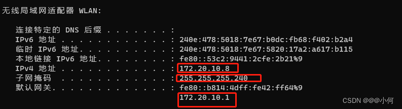
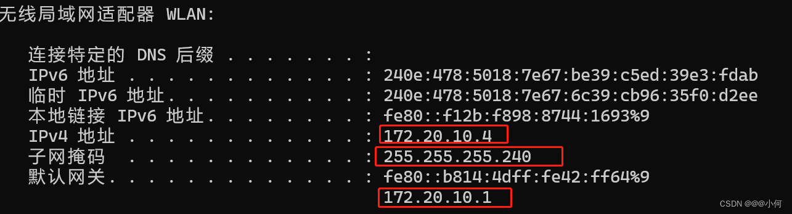
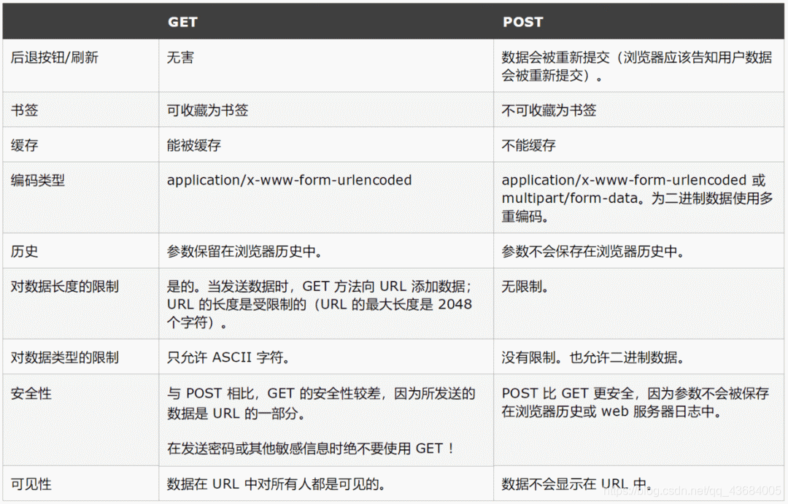

@[TOC](目录)

> 感觉自己的计算机基础知识还很薄弱，工作之余补习一下。


## 1.计算机奠基人—冯•诺依曼
### 1.冯·诺依曼结构

> 冯·诺依曼结构也称作普林斯顿结构，是一种将程序（指令序列的集合）和数据存放在同一存储器的不同地址的电脑设计概念结构。这是建立在冯·诺依曼原理“程序可看做一种特殊的“数据”，同样地可以被处理和存储，故两者可存放在同一存储器中，采用单一的地址总线和数据总线”之上的。

### 2.冯·诺依曼结构的特点

> 1. 数字计算机的数制采用二进制；计算机应该按照程序 顺序执行。
> 2. 程序和数据存放在同一存储器的不同地址上。
> 3. 存储单元线性排列，且其位数固定。
> 4. 顺序执行，即程序/数据—>内存—>取指令执行指令。
> 5. 计算机应包括运算器、存储器、控制器、输入和输出设备五大基本部件。

## 2.计算机的发展

> 按照计算机所使用的逻辑部件将计算机的发展分为四代：
> 1. 第一代，1946-1957年，电子管时代，机器和汇编语言。
> 2. 第二代，1958-1964年，晶体管时代，高级编程语言。
> 3. 第三代，1965-1970年，中小规模集成电路，操作系统成熟。
> 4. 第四代，1971-至今，大规模、超大规模集成电路，出现网络，使用面日益广泛。

## 3.内存

> 内存可以分为物理内存和虚拟内存：
> 1. 物理内存：顾名思义，物理上，真实存在的插在主板内存槽上的内存条的容量的大小。
> 2. 虚拟内存：别称虛拟存储器 (Virtual Memory)。 电脑中所运行的程序均需经由内存执行，若执行的程序占用内存很大或很多，则会导致内存消耗殆尽。为解決该问题，可以运用了虛拟内存技术，即匀出一部分硬盘空间来充当内存使用。当内存耗尽时，电脑就会自动调用硬盘来充当内存，以缓解内存的紧张。

## 4.32位和64位操作系统的区别

> 1. 内存方面：
> * 32位的操作系统做多支持4G的运行内存，实际最多支持内存为3.25G。也就是说，即使给32位的操作系统加内存条加到8G也没用。
> * 64 位系统支持 4G、8G、16G、32G、64G、128G、256G 内存，理论上可以无限支持。只要你主板上有足够的内存条。
> 2. CPU方面：
> * 32位系统CPU一次可以处理32位数据，即一次处理4个字节（一个字节等于8位）。
> * 64位系统CPU一次可以处理64位数据，即一次处理8个字节（一个字节等于8位）。
> 3. 性能方面： 理论上，64位的机器性能要高于32位，因为64位机器的CPU一次能处理的字节个数是32位的2倍。

## 5.编码类型
### 1.ASCII编码

> 在计算机中怎么表达英文字符，比如字母a、字母A、字母b、空格等？
> 
> 我们知道计算机只认二进制。 上个世纪 60 年代，美国制定了一套宇符编码，对英语字符与二进制位之间的关系，做了统一规定。这被称为
> ASClI码，一直沿用至今。 ASCII码一共规定了128个字符的编码，例如：
> 
> 空格 SPACE 对应的二进制是：0010 0000，对应的十进制是 32 大写的字母 A对应的二进制是：01000001，对应的十进制是
> 65

### 2.Unicode编码

> 先说下ASCII编码的缺点： 英语用 128 个符号编码（ASCII编码）就够了，但是用来表示其他语言，128个符号是不够的。
> 
> 比如，在法语中，字母上方有注音符号，它就无法用 ASCIl码表示。 法语自己建立一个编码格式，比如法语中的é的编码为
> 130（二进制10000010）。
> 
> 问题一：不同的国家有不同的字母，因此，哪怕它们都使用 256个符号的编码方式，代表的字母却不一样。
> 问题二：至于亚洲国家的文字，使用的符号就更多了，汉字就多达10万左右。一个字节只能表示256种符号，肯定是不够的。
> 
> 在这种背景下，为了统一国际上所有的语言符号，国际上统一设计制定了一套编码，叫作Unicode编码。
> 
> Unicode 是一个很大的集合，现在的规模可以容纳100多万个符号。每个符号的编码都不一样。

### 3.UTF-8编码

> Unicode编码和UTF-8编码的关系：
> UTF-8编码是Unicode编码的实现方式之一。Unicode编码规定了世界上所有语言的字符对应的唯一一个16进制的编码，而UTF-8是保证了UTF-8对应的·6进制的编码怎么转化为2进制来存储。
> 
> 其他实现方式还包括 UTF-16 （字符用两个字节或四个字节表示）和 UTF-32(字符用四个字节表示），不过在互联网上某本不用。
> 
> TF-8最大的一个特点，就是它是一种变长的编码方式。它可以使用1~4 个字书表示一个符号，根据不同的符号而变化字节长度。

### 4.GBK编码

> 上面的UTF-8解决的是国际上字符的一种多字节编码，它对英文使用8位（即一个字节），中文使用 24位（三个字节）来编码。 而 GBK
> 编码专门用来解决中文编码的，是双字节的，即GBK 使用两个字节来编码中文。
> 
> 在GBK 之前有一种 GB2312 的编码标准也是解决中文编码的，GB2312 是最早一版的中文编码，每个字占据2字节。
> 
> 由于 GB2312 只有6763 个汉宇，我汉语博大精深，只有6763 个字怎么够？于是GBK 中在保证不和GB2312、ASCII
> 冲突（即兼容 GB2312 和ASCII）的前提下，也用每个字占据 2字节的方式又编码了许多汉宇。经过 GBK 编码后，可以表示的汉字达到了
> 20902个。

## 6.CPU的X86架构和ARM架构的区别

> x86 和 ARM 架构涉及的是当代计算机硬件设计的两种主流方式，它们是如何组成和操作一个处理器的指令集，处理器必须理解这些指令才能完成其任务。
> 1. **设计理念：**
> - x86架构是一种基于高性能的设计。其设计旨在通过提高时钟速度和提高每个时钟周期内的操作数量来增加总体性能。这种设计的一个问题是，能耗和散热会随着效能的提高而增加。
> - ARM架构的设计重点是在限制的功率和热环境下，优化每瓦特的性能。因此，智能手机和其他便携式设备常选用此架构。
> 2.  **应用场景：**
> - x86的应用场景主要用于需要更高性能的中高端市场，包括桌面计算机、笔记本电脑和数据中心服务器。
> - ARM架构广泛应用于低功耗市场，如移动设备（智能手机、平板电脑）、嵌入式系统（家用电器、汽车电子设备等）和物联网设备。
> 3. **指令集：**
> - x86使用的CISC（Complex Instruction Set Computer，复杂指令集计算机）可以让一次指令完成更多工作，但这也增加了处理器的复杂性和功耗。
> - ARM则使用RISC（Reduced Instruction Set Computer，精简指令集计算机）。RISC设计的目的是让每一条指令尽可能简单和快速，只做一件很基本的事情，尽可能减少每个指令的执行时间。
> 4. **开放性:**
> - x86架构由Intel和AMD等少数厂商控制，其他厂商很难对其进行定制开发。
> - ARM允许其他公司使用其架构进行定义和优化，制造商可以根据需求对处理器进行定制。
> 5. **兼容性：**
> - x86的兼容性更强，它能支持大多数的桌面操作系统和绝大部分诞生于PC时代的应用 
> - ARM的兼容性相对较弱，因为各种ARM设备会有不同的定制和优化，所以软件开发者需要尽可能的考虑这些差异，或者针对特定的设备进行开发。
> 

> 总之，这两种架构都有自己的优缺点，适用场景也会有所不同，取决于特定的设备需求和使用条件。在很大程度上，x86常被用在高性能场景，而ARM则在低功耗场景中流行。

## 7.CPU和GPU的区别

> 1. CPU是电脑的中央处理器，而GPU是GPU是电脑的图形处理器。
> 2. CPU是一块超大规模的集成电路，也是一台计算机的控制和运算核心，它的主要功能便是解释计算机发出的指令以及处理电脑软件中的大数据。而GPU是图像处理器的缩写，它是一种专门为PC或者嵌入式设备进行图像运算工作的微处理器。
> 3. CPU和GPU工作的侧重点不同，CPU侧重于精密运算，GPU侧重于大量不精密运算（可以这样看待它们的区别：CPU相当于一个博士操作着一台超级计算机在工作，GPU相当于100个大学生每人拿着一台笔记本电脑在工作）。

## 8.RAM和ROM的区别

> RAM和ROM都是用来存东西的。比如我们熟悉的CPU缓存、电脑和手机的内存就属于是RAM，而固态硬盘、U盘、买手机所说的32G/64G存储空间都属于ROM。
> 二者最大的区别，简单说就是RAM在断电之后存储的数据就没有了，比如我们的内存。而ROM在断电之后存储的数据依旧不会消失，比如我们的U盘。

## 9.BIOS和UEFI的区别

> 在进行电脑重装的时候，常看到UEFI和BIOS这两个词，例如怎么进入BIOS启动设置页面，电脑不支持UEFI启动等等。今日简单了解下二者。

> BIOS，全称"Basic Input Output System"，中文名称"基本输入输出系统"。它是一组固化到计算机内主板上一个ROM芯片上的程序，主要是为计算机提供最底层的、最直接的硬件设置和控制，其中包括自检及初始化、程序服务处理、硬件中断处理。

> UEFI,全称“Unified Extensible Firmware Interface”，中文名称“统一的可扩展固件接口”。它是一种新型的电脑启动系统，被认为是有传统 BIOS 的继任者。相比BIOS，它具有纠错特性，兼容性，可扩展性，具有图形界面，还可以使用鼠标操作。

> 
> 二者区别具体如下：
> 1. **操作方面：**
> * Bios只能用键盘控制，不能识别USB。
> * UEFI可以用鼠标和键盘，可以识别USB，具有联网功能。
> 2. **启动流程方面：**
> * Bios有固定的开机流程，如果电脑没有装系统，就会停留在黑屏状态，只能重启电脑重新进入Bios界面来操作。
> * UEFI的流程是，如果电脑没有装系统，也会自动进入UEFI界面，无需再经过重启，可以直接插入U盘winpe进行相关配置，再用U盘重装系统。
> 3. **界面方面：**
> * Bios基本是一片蓝色，即使电脑机型有所区别，也大差不差。
> * 而UEFI则有丰富的UI界面。

## 10.设置环境变量的目的是什么

> 设置环境变量的作用是指定命令搜索路径，比如软件的运行或者一些程序的编译需要找到相应的命令程序才可正常运行。
> 通俗地讲，相当于在系统中创建了一个全局的快捷方式。
> 你桌面上创建某个可执行文件的快捷方式，意味着不管这个文件的实际路径是什么，你都可以从桌面上启动它。
> 同理，你在环境变量中设置了某个文件的路径，那么你就可以在系统任意路径下启动它。

## 11.计算机网络知识
### 1.IP地址

> IP地址：要实现电脑之间的通信，就必须要有一个ip地址。IP地址由网络地址和主机地址构成。
> 
> 作用：确认位置。
> 
> 举例：相当于地址，比如一栋大楼的房间号。
### 2.子网掩码
> 子网掩码：将IP地址划分为网络地址和主机地址，他不能单独存在，必须和IP地址一起使用。
> 
> 作用：确认网段，将某个IP地址划分成网络地址和主机地址两部分。。
> 
> 举例：如果说ip地址是大楼的房间号，那么子网掩码就是大楼的楼层号。
### 3.端口号
> 端口号：网络中的计算机是通过IP地址来代表其身份的，它只能表示某台特定的计算机，但是一台计算机上可以同时提供很多个服务，如数据库服务、FTP服务、Web服务等，我们就通过端口号来区别相同计算机所提供的这些不同的服务，如常见的端口号21表示的是FTP服务，端口号23表示的是Telnet服务端口号25指的是SMTP服务等。端口号一般习惯为4位整数，在同一台计算机.上端口号不能重复，否则，就会产生端口冲突这样的例外。
> 
> 作用：端口号的主要作用是表示一台计算机中的特定进程所提供的服务。
> 
> 举例：客户端通过IP地址找到对应的服务器端，但是服务器端会有很多的应用，每个应用对应一个端口号。通过端口号，客户端才能准确的访问到该服务端的应用。
### 4.网关
> 网关：就是一个网络通向其他网络的桥梁。假设有网络A和网络B，网络A的IP地址范围为"192.168.1.1-192.168.1.254“，子网掩码为255.255.255.0；网络B的IP地址范围为“192.168.2.1-192.168.2.254",子网掩码为255.255.255.0。在没有路由器的情况下，两个网络之间是不能进行TCP/IP通信的，即使是两个网络连接在同一台交换机(或集线器)上， TCP/IP协议也会根据子网掩码(255.255.255.0) 判定两个网络中的主机处在不同的网络里。而要实现这两个网络之间的通信，则必须通过网关。如果网络A中的主机发现数据包的目的主机不在本地网络中，就把数据包转发给它自己的网关，再由网关转发给网络B的网关,网络B的网关再转发给网络B的某个主机。网络A向网络B转发数据包的过程。通常意义的网关就是TCP/IP协议下的网关。
作用：中间人、桥梁。
举例：假设你的名字叫小不点(很小)，你住在一个大院子里，但是你家长不允许你走出大门，你想与外界联系，都必须由父母（你自己的网关）用电话帮助你联系。假如你想找你的同学小明聊天，小明家住在很远的另外一个院子里，他家里也有父母（小明的网关）。但是你不知道小明家的电话号码，不过你的班主任老师有一份你们班全体同学的名单和电话号码对照表（你的老师就是你的DNS服务器）。
于是你在家里和父母有了下面的对话：
小不点：妈妈(或爸爸),我想找班主任查一下小明的电话号码行吗？家长：好，你等着。（接着你家长给你的班主任挂了一个电话，问清楚了小明的电话）问到了，他家的号码是211.99.99.99
小不点：太好了！妈(或爸),我想找小明，你再帮我联系一下小明吧。
家长：没问题。（接着家长向电话局发出了请求接通小明家电话的请求，最后一关当然是被转接到了小明家家长那里，然后他家长把电话给转到小明）.
就这样你和小明取得了联系。
如果搞清了什么是网关，默认网关也就好理解了。就好像一个房间可以有多扇门一样，一台主机可以有多个网关。默认网关的意思是一台主机如果找不到可用的网关，就把数据包发给默认指定的网关，由这个网关来处理数据包。
### 5.DNS
>    DNS：域名系统(Domain Name System)。DNS协议是互联网的一项服务，它作为将域名和IP地址相互映射的一个分布式数据库，能够使人更方便的访问互联网。
> 
> 作用：正向解析：根据主机名称（域名）查找对应的IP地址。
>  反向解析：根据IP地址查找对应的主机域名。
> 
> 举例：在Internet上一台主机想要访问另一台主机时，必须要获得其IP地址，就和你去拜访朋友必须要知道他家的地址一样，以ipv4为例，TCP/IP中的IP地址是四段以“.”分开的数字组成，记起来不是很方便，所以就采用了域名系统来管理名字和IP之间的对应关系。
> 
> 为什么不用域名来直接进行通信呢？
> 1.因为IP地址是固定长度的，IPv4是32位，IPv6是128位，而域名是变长的，不便于计算机处理。
> 2.IP地址对于用户来说不方便记忆，但域名便于用户使用，例如www.baidu.com这是百度的域名。
> 3.总结来说，IP地址是面向主机的，而域名则是面向用户的。
## 12.实现两台电脑在同一局域网内文件共享互传
> 一般要满足3个条件：
> 1. 两台电脑的IP地址在同一个网段内。比如：A和B电脑都连接上同一个WIFI，A电脑的IP地址192.168.10.30 B电脑的IP地址为192.168.10.31 则A电脑和B电脑就在同一网段(192.168.10.XXX网段)。
> 2. 子网掩码相同。两台PC的子网掩码必须相同,比如255.255.255.0。子网掩码决定了同一网段的范围,所以必须一致。
> 3. 子网掩码相同。两台PC的子网掩码必须相同,比如255.255.255.0。子网掩码决定了同一网段的范围,所以必须一致。
> 
> 实操： 这里有2台电脑A和B已经现共享文件传输(一般连接上同一个WIFI后，上述三个条件都默认满足，只需要配置共享文件夹就行)。
> 看他们的配置如下：
> 
> 电脑A:



> 电脑B:



> 对比可看到，上述3个条件均满足。
## 13.一些bat命令的用法实例
> 1. 下面的bat文件中包含功能：拷贝指定文件夹到另一个指定文件夹、不存在就创建文件夹、创建以当前时间命名的文件夹、向文本文件中追加数据等。

```bash
@echo off

set "baseName=BatData"

::获取当前时间
set nowTime=%baseName%_%date:~,4%%date:~5,2%%date:~8,2%%time:~0,2%%time:~3,2%%time:~6,2%

::获取日期
set d=%date:~0,10% 

::获取当前时间
set t=%time:~0,10%  

::追加的记录内容，可自行编辑
set addtext=------备份记录：-----

:: 如果本地目录下不存在TestBat文件夹，就创建TestBat文件夹
if not exist %~dp0.\TestBat\ (
	md %~dp0.\TestBat\
)

:: 创建以当前时间命名的文件夹
if not exist %~dp0.\TestBat\%nowTime% (
	md %~dp0.\TestBat\%nowTime%
)

::拷贝系统盘下的BatData文件夹到本地目录
robocopy  %USERPROFILE%\Documents\BatData\   %~dp0.\TestBat\%nowTime%	/e

::向文本文件中追加内容，每次执行都会换行追加
echo %addtext%%d% %t% >>TestBat\备份记录.txt

::pause

@echo on
```

> 2. 强制杀死进程：

```bash
taskkill /f /im 后加上要杀死的进程名称。例如：
taskkill /f /im Test.exe
```

## 14.TCP/UDP

> TCP与UDP基本区别： 
> 1. 基于连接与无连接。
> 2. TCP要求系统资源较多，UDP较少。
> 3. UDP程序结构较简单。
> 4. 流模式（TCP）与数据报模式(UDP) 。
> 5. TCP保证数据正确性，UDP可能丢包。
> 6. TCP保证数据顺序，UDP不保证：
>&nbsp; TCP通过检验和、序列号、确认应答、重发控制、连接管理以及窗口控制等机制实现可靠性传输。 
>&nbsp; 在拥塞时，TCP会降低传送速度，UDP不会。

>UDP应用场景：
>1. 面向数据报方式。
>2. 网络数据大多为短消息 。
>3. 拥有大量Client 。
>4. 对数据安全性无特殊要求 。
>5. 网络负担非常重，但对响应速度要求高。
## 15.上位机和下位机
> 1. 有些设备能够访问其它的设备，比如读取内存中的数据、向内存写数据，这样的设备具有较高的权限和地位，因此被称为上位机。
> 2. 有些设备只能被其它设备访问，而没有访问其它设备的权力，这样的设备就称为下位机。
## 16.C语言的构建方式
> C语言从源代码到可执行文件的构建过程可分为源代码编写、 预处理器、编译器、汇编器、链接器、可执行文件。

> 1. 源代码编写： C语言的构建过程始于源代码的编写。开发人员使用C语言的语法规则和语义来编写代码，这些代码以.c为后缀名保存在文本文件中。源代码是程序的起点，它包含了实现程序逻辑的指令和数据。
> 
> 2. 预处理器： 在源代码被编译之前，需要经过预处理器的处理。预处理器负责处理以#符号开头的预处理指令，例如#include和#define等。预处理器的主要作用是展开头文件、宏替换和条件编译等。预处理器会生成一个经过预处理的源文件，其中包含了被替换和展开后的代码。
> 
> 3. 编译器： 预处理完成后，源代码就会交给编译器进行编译。编译器将源代码翻译成机器可以理解的中间代码，通常是一种称为汇编语言的形式。这个中间代码以汇编文件的形式存在，其文件扩展名为.s。
> 
> 4. 汇编器： 汇编器将汇编代码转换成机器码指令。它会将每一条汇编语句转换成对应的机器指令，这些指令直接在处理器上执行。汇编器生成的文件通常以目标文件的形式存在，其文件扩展名为.o。
> 
> 5. 链接器： 链接器的任务是将目标文件和库文件合并成一个可执行文件。在C语言中，程序可能会引用其他源文件中定义的函数和变量，这些函数和变量在编译时并不在同一个文件中。链接器通过解析这些引用，将它们与对应的函数和变量进行连接，生成最终的可执行文件。
> 
> 6. 可执行文件： 最终的可执行文件包含了程序的机器指令，可以在特定的操作系统环境中执行。当用户运行程序时，操作系统加载可执行文件到内存，并按照指令逐条执行。这样，C语言程序就得以运行并实现其设计的功能。
## 17.工作流引擎

## 18.ajax

> Ajax为异步请求，即局部刷新技术，在传统的页面中，用户需要点击按钮或者事件触发请求，到刷新页面，而异步技术为不需要点击即可触发事件，这样使得用户体验感增强，比如商城购物车的异步加载，当你点击商品时无需请求后台而直接动态修改参数。
## 19.HTTP协议
> 常用的请求方法有：get、post。

> Get与post的区别：
> 传送数据，get携带参数与访问地址传送，用户可以看见，这的话信息会不安全，导致信息泄露。而post则将字段与对应值封装在实体中传送，这个过程用户是不可见的。Get传递参数有限制，而post无限制。
## 20.cookie
> cookie是Web服务器发送给浏览器的一块信息。浏览器会在本地文件中给每一个Web服务器存储cookie。以后浏览器在给特定的Web服务器发请求的时候，同时会发送所有为该服务器存储的cookie。
## 21.Get请求和Post请求
> 在服务端和客户端之间进行请求响应时，GET和POST是其最常用的两种方法：
>  GET：从指定资源获取数据。
> POST：从指定的资源提交要被处理的数据。

> 对比如下：



> 最直观的区别就是：
> * GET把参数包含在URL中，一般我们的参数是写在 ? 后面，用 & 分割。
> * POST 通过 request body 传递参数。

## 22.svg和png格式图片

> 前端开发经常听到的两种图片格式：svg和png。这两种图片格式分别是什么样子的呢，又有什么区别呢？
> 1. svg是矢量图，png是位图。简单了解：位图会受到分辨率大小的影响，分辨率越高，图片越清晰，而矢量图不会受到分辨率影响。
> 2. svg由图形和路径组成，png由像素组成。
> 3. svg不会因为放大而失真，并且支持透明度和动画，是 XML 编写的代码片段；png清晰度会随着图片的大小而变化，支持透明度但不支持动画。
> 4. svg可编辑，适合图形设计、文字设计，png不可编辑。
## 23.通信协议
> 通信协议是指双方实体完成通信或服务所必须遵循的规则和约定。通过通信信道和设备互连起来的多个不同地理位置的数据通信系统，要使其能协同工作实现信息交换和资源共享，它们之间必须具有共同的语言。交流什么、怎样交流及何时交流，都必须遵循某种互相都能接受的规则。这个规则就是通信协议。

> 设备之间不同的通信协议相当于人类之间不同的交流语言。

> 在计算机通信中，通信协议用于实现计算机与网络连接之间的标准，网络如果没有统一的通信协议，电脑之间的信息传递就无法识别。通信协议是指通信各方事前约定的通信规则，可以简单地理解为各计算机之间进行相互会话所使用的共同语言。两台计算机在进行通信时，必须使用的通信协议。
比如你说英语我说汉语，我们之间沟通不了；你说汉语我说汉语，我们俩个才能沟通，这就是通讯协议。实际上通讯协议是比较复杂的，是我发去一个波，另一边收到还能转换出来。我发123，那边收到的也是123，它们互相之间能通话，就叫通讯协议。
## 24.无线AP和无线路由器的区别
> [视频简介](https://www.bilibili.com/video/BV1Sa411C7mu/?spm_id_from=333.337.search-card.all.click&vd_source=4f56e4e53e0b60896f7cf23c14182a20)
## 25.Intel的e系列和i系列CPU的区别
> 
> * E系列是服务器专用，主打超长时间稳定运行，多线程任务处理。
>* I系列是桌面级的，主打游戏娱乐、办公设计。

> 这个是完全不同的两个产品线，没有好坏之分，服务器就E，普通电脑就I。因此在工业领域，尤其是一些对电脑、系统稳定性要求较高的地方，还是用e系列CPU比较好。

## 26.
