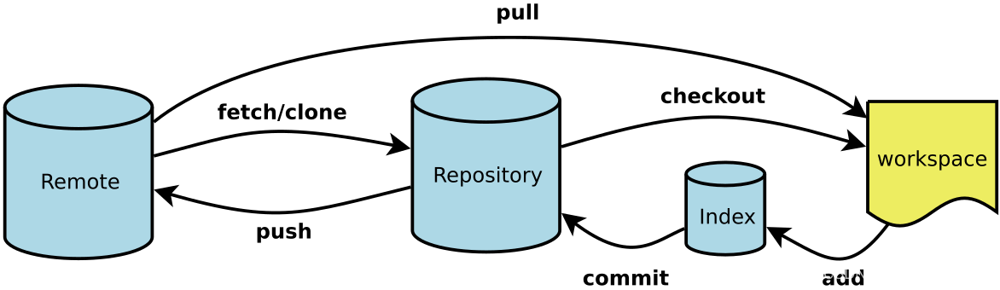
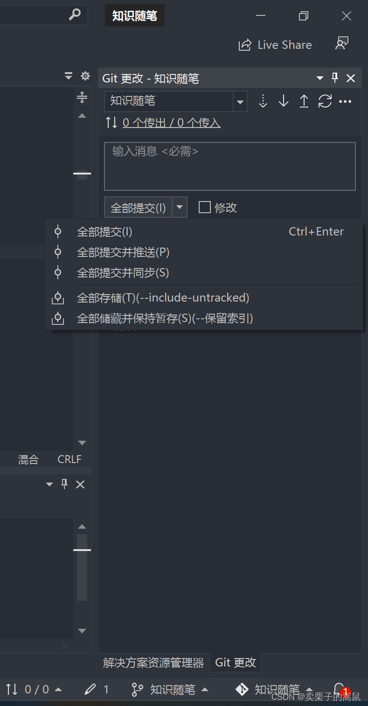
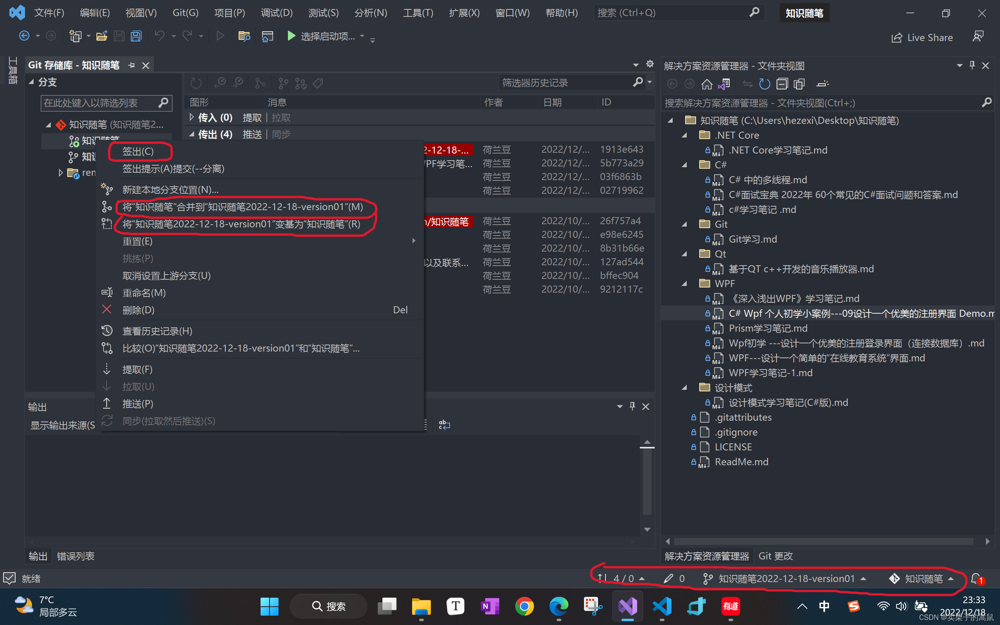

@[TOC](目录)
# 前言

> 工欲善其事，必先利其器。简单学习并记录下Git中的常用名词和术语。
> 

## 1. Git基本概念

Workspace：工作区
Index / Stage：暂存区
Repository：仓库区（或本地仓库）
Remote：远程仓库
### 1.已提交、已修改、已暂存
Git中的文件有三种状态：
* 已提交（committed）：表示数据已经安全的保存在本地数据库中；
* 已修改（modified）：表示修改了文件，但还没保存到数据库中；
* 已暂存（staged）：对一个已修改文件的当前版本做了标记，使之包含在下次提交的快照中；

对应这三种状态，Git的有三个工作区域：

* Git 仓库：Git用来保存项目的元数据和对象数据库的地方；
* 工作目录：对项目的某个版本独立提取出来的内容；
* 暂存区域：保存了下次将提交的文件列表信息；

### 2.仓库（Repository）
保存了所有文件的修改历史，同时我们的代码都是存储在仓库里。
#### 1.本地仓库
是在开发人员自己电脑上的Git仓库。
#### 2.远程仓库
是在远程服务器上的Git仓库，远程仓库的搭建，我们可以借助互联网上提供的一些代码托管服务来实现，其中比较常用的有GitHub、码云、GitLab等。
### 3.工作区（Working Directory)
本地电脑上的工作目录文件夹。
### 4.暂存区（Staging area）
暂存区是暂存工作区的文件变化。
### 5.克隆（clone）
从远程仓库URL加载创建一个与远程仓库一样的本地仓库.
### 6.提交（commit）
将暂存文件上传到本地仓库（我们对本地仓库做修改后一般都得先提交一次，再推送）。
### 7.检出（checkout）
切换不同分支。
### 8.暂存（git stash）
保存工作现场。
### 9.合并（merge）
将多个同名文件合并为一个文件，该文件包含多个同名文件的所有内容，相同内容抵消
。
### 10.拉取（pull）
是指从远程仓库拉取到本地，并进行比较，标出冲突。如果远程仓库被其他开发者推送，拉取时会将冲突(指两个开发者修改了同一处代码)的地方标出。。
### 11.推送（push）
向远程仓库推送当前分支，将本地仓库同步至远程仓库，一般推送（push）前先拉取（pull）一次，确保一致。
### 12.签入（Checkin）
将新版本复制回仓库。
### 13.签出（Checkout）
从仓库中将文件的最新修订版本复制到工作区。
### 14.提交（Commit）
将暂存区的文件提交到仓库。
### 15.冲突（Conflict）
多人对同一文件的同一部分进行了修改，导致了冲突的发生。
### 16.合并（Merge）
将指定分支合并到当前分支。
### 17.提取
提取的含义是从远程仓库抓取本地没有的修改。
### 18.签出分支
## 2. Vs中Git中相关
### 1. 全部提交、提交并推送、提交并同步

* 全部提交：提交到本地的仓库。

* 提交并推送：提交到本地仓库并推送到远程仓库，如果远程仓库已经有其他人推送过那么本次操作就会失败。

* 提交并同步：提交到本地仓库并且当远程仓库有新的提交之后，将本地和远程进行同步(合并后推送到远程)。

### 2. 签出、合并、变基

* 签出：切换当前分支到该分支。（如上图所示，点击“签出”按钮后，分支会从“知识随笔2022-18-22-version-1”切换至“知识随笔”分支）。
* 合并 分支1 至 分支2：将分支1的更改合并到分支2。
* 变基：就是将该分支未更改前的文件基础更改到某个版本
## 3.使用Git的常规工作流程
1. 从远程仓库中克隆代码到本地仓库。
2.  从本地仓库中checkout代码然后进行代码修改。
3. 在提交前先将代码提交到暂存区。
4. 提交到本地仓库。本地仓库中保存修改的各个历史版本。
5. 修改完成后，需要和团队成员共享代码时，将代码push到远程仓库。

