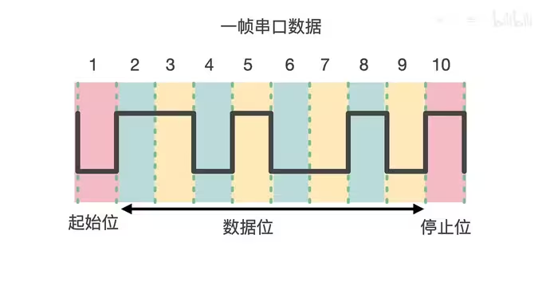

@[TOC](目录)

>知识在于理解,运用在于总结,高阶在于巩固!
>简单记录下自己接触到的工控知识，比较杂，希望对以下知识技术点有一个入门级的认识。
> 

# 1.电机减速机、扭矩

> 减速机的原理是什么？
> 电机加上减速机可以实现低速大扭矩，减速机(增扭机)的作用就是减小速度，增大输出扭矩。根据能量守恒，转速低了扭矩自然要高。 <br>
> 为什么要用到减速机？
> 是由于电机运转时转速很高，但扭力很小，此时利用一个减速装置来降低电机转速，同时提升负载能力（提升扭力或扭矩），等于提高了电机的工作能力。因为能量守恒定律告诉我们，电机输出功率不可能无缘无故地变，只可能因为各种损耗变成热能量了。功率不变，速度减小，那就使力量（力矩）变大了；而且我们想要理想的扭矩，要么要一个大的伺服，要么要一个小的伺服加一个减速机，结果一般是一个伺服加一个减速机的成本小于一个大号伺服的价格。<br>

# 2.运动控制相关

> 大佬科普运动控制系统链接：https://www.cnblogs.com/cariohu/p/15508175.html。
## 1.运动控制简介
>控制分为:过程控制(偏连续性控制，气体液体流速等)和运动控制(偏离散性控制，例如气缸、阀门、电机等)。<br>
运动控制包括:开环(步进电机)、半开环(伺服电机)、闭环(光栅、直线电机)。精度:开环<半开环<闭环。<br>
> 如果我们的项目涉及到一些运动相关的控制，我们必然会提前选择好电机，如果要求精度比较高，一般会选择伺服电机，否则的话，我们可以选择步进电机来进行运动控制，但是，无论是步进电机还是伺服电机，一般都是和其对应的驱动器是配套的。那么后续的问题在于如何通过步进（伺服）驱动器进行步进（伺服）电机的控制？
> 一般来说，我们有以下几种方案：
> 
> 1. 采用PLC进行控制，目前市场上的大部分PLC都是支持运动控制的，大部分PLC可以扩展到32轴，根据驱动器类型可以采用脉冲控制、总线控制或模拟量控制。
> 
> 2.  采用运动控制卡控制，运动控制卡是专门进行运动控制的一种控制器，可以进行多达256轴的控制，运动控制卡需要PC编程。
> 
> 3. 采用运动控制器控制，运动控制器与运动控制卡不同之处在于，可以脱离PC电脑的束缚，编写完程序下载到控制器里，即可直接对驱动器进行控制。
> 
> 电机在低转速的时候，是控制不稳定的，有很大的波动，这个和电机内部结构是有很大关系的，所以电机一般都是上千转。
## 2.伺服电机、步进电机
### 1.伺服电机
> 伺服电机是一种精密控制电机，它的构成可以分为以下几个部分:
> * 转子:伺服电机的转子是电机的旋转部分，通常由永磁体或者电磁线圈构成。电机通过控制转子的位置和速度来实现精确运动控制。
> * 定子:电机的定子是电机的定位部分，通常由铁芯和线圈构成。当电流通过线圈时，它会产生磁场，使定子中的铁芯产生磁力吸引转子，从而实现电机的运动。
> * 编码器:编码器是伺服电机的反馈元件，它可以测量电机的位置和速度。编码器通常由光电系统或者磁电系统组成，可以将电机的运动状态转换为数字信号，供控制器使用。
> * 控制器:控制器是伺服电机的核心部件，它负责实时控制电机的转速和位置。控制器通常由微处理器和放大器构成，可以根据编码器反馈的信号进行闭环控制，在预定时间内实现精确运动。
> 
> 对于伺服电机，一个轴控卡可以控制多个驱动器，每个驱动器只能控制一个轴，从而导致一个轴运动控制卡来控制多个轴。<br>
伺服电机组成:位置环、速度环、电流环。运动伺服一般都是三环控制系统,从内到外依次是电流环、速度环、位置环。<br>
伺服电机可以通过编码器来告诉驱动器电机具体转了多少。<br>
### 2.步进电机
> 步进电机是一种将电脉冲转化为角位移的执行机构。当步进驱动器接收到一个脉冲信号，它就驱动步进电机按设定的方向转动一个固定的角度（称为“步距角”），它的旋转是以固定的角度一步一步运行的。
> **可以通过控制脉冲个数来控制角位移量，从而达到准确定位的目的；同时可以通过控制脉冲频率来控制电机转动的速度和加速度，从而达到调速的目的。**
### 3.总结
> **步进电机是通过控制脉冲的个数控制转动角度的，一个脉冲对应一个步距角。 伺服电机是通过控制脉冲时间的长短控制转动角度的。**

## 3.点位运动、连续运动、直线和圆弧插补运动

> 点位运动是指：运动控制器控制运动平台从当前位置开始以设定的速度运动到指定位置后准确地停止。
点位运动只关注终点坐标，对运动轨迹的精度没有要求。点位运动的运动距离由脉冲数决定，运动速度由脉冲频率决定。
多轴同时做点位运动，称之为多轴联动。<br>
如果从起点到终点都需要按照规定的路径运动，就必须采用直线插补或圆弧插补功能。<br>
连续运动是指：电机从起始速度开始运行，加速至最大速度后连续运动；只有当接收到停止指令或外部停止信号后，才减速停止。
连续运动指令其实就是速度控制指令，国外运动控制器将此指令称为 JOG 指令。<br>
> 为了实现轨迹控制，运动控制卡按照一定的控制策略控制多轴联动，使运动平台用微小直线段精确地逼近轨迹的理论曲线，保证运动平台从起点到终点上的所有轨迹点都控制在允许误差范围内。这种控制策略称为插补算法，因此轨迹运动通常称为插补运动。插补运动有许多种类，如：直线插补、圆弧插补、螺旋线插补等。
## 4.软限位和正限位
> 软限位是通过软件设置的限制，用于限定轴的运动范围，防止超出机械结构所能承受的极限。软限位的范围一般比硬限位的范围要小。软限位可以在安装调试过程中根据实际情况进行设置，例如避免与其他设备干涉或限制机器人的运动范围。软限位的设置不需要额外的成本，并且可以避免误操作造成财产损失。<br>
硬限位是通过机械结构实现的限制，用于限定轴的运动范围。通常通过安装限位块或设置机械结构上的螺丝孔来实现。硬限位的设置是确保设备和人员安全的重要措施。在机器人中，部分型号的机器人的部分关节轴可能会有硬限位的解决方案。不同型号的机器人可能有不同的硬限位设置方法和规格。<br>
软限位通过软件设置，硬限位通过机械结构实现。软限位主要用于避免干涉和限制运动范围，而硬限位主要用于确保设备和人员的安全。
## 5.脉冲当量、脉冲数、脉冲频率
> 脉冲当量是当控制器输出一个定位控制脉冲时，所产生的定位控制移动的位移。对直线运动来说，是指移动的距离，对圆周运动来说，是指其转动的角度。简单说，就是发一个脉冲，电机能走多少距离，也就是电机的最小精度。我们控制电机运动，就是向电机发送脉冲信号。那么如果想得到前进的距离，就需要将脉冲个数*脉冲当量，来得到这个距离。<br>
> 而脉冲数就是对应发脉冲的个数来控制电机移动的距离，我们需要计算出就需要将脉冲个数*脉冲当量，来得到这个距离。<br>
> 脉冲频率是指每秒向电机发送的脉冲数量。通常情况下，脉冲频率越高，电机转速越快。因此脉冲频率越高，电机速度越快。<br>
> 简而言之，脉冲总量确定电机位移，脉冲频率确定电机速度。
## 6.回零：光电开关和编码器信号
> 电机控制轴回零一般有2种方式：光电开关和编码器。
> 光电开关是外部的，编码器是内部的，最好用内部的编码器信号，因为相比光电开关稍微准确一点。而且编码器外部的位置容易变动，归零的速度不一样会对归零的位置有影响，因此对精度要求稍高的话，可以采用编码器回零方式。
## 7.前瞻
> 在进行插补运动时候，往往要打开前瞻功能。<br>
> 设想一个场景，在实际加工过程中，为追求加工效率会开启连续插补，运动轨迹的拐角处若不减速，当拐角较大时，会对机台造成较大冲击，影响加工精度。若关闭连续插补，使拐角处减速为0，虽然保护了机台，但是加工效率受到了较大影响，所以提供了前瞻指令，使在拐角处自动判断是否将拐角速度降到一个合理的值，既不会影响加工精度又能提高加工的速度，这就是轨迹前瞻功能的作用。　　运动控制器的轨迹前瞻可以根据用户的运动路径自动计算出平滑的速度规划，减少机台的冲击，从而提高加工精度。自动分析在运动缓冲区的指令轨迹将会出现的拐点，并依据用户设置的拐角条件，自动计算拐角处的运动速度，也会依据用户设定的最大加速度值计算速度规划，使任何加减速过程中的加减速都不超过ACCEL和DECEL的值，防止对机械部分产生破坏冲击力。

# 4.运动控制卡
## 1.简介

> 控制器或者控制卡的性能主要取决于控制算法，不同厂家控制卡的性能差别可能非常大。目前常见工业应用中比较高端的有以色列ACS，美国Aerotech，这是属于第一梯队的，其他国外的流行品牌还有elmo、PMAC、Galil、欧姆龙等。国内的有固高、雷赛、正运动、柏楚等，与国外产品相比仍然有一定差距，但也在不断突破。<br>
> 根据控制器传递命令给驱动器的方式，可以分为总线型、模拟量型、PWM型、脉冲型控制卡。目前，总线型控制卡是最主流的，各大厂家的口号都是一网到底，这个网就是指的总线，就是通过一根总线把所有模块都接上去，确实方便。其他三种类型控制卡也有各自的特色，所以都并行存在于主流市场。
## 2.运动控制卡和PLC的区别
> 运动控制卡与PLC都是控制器，主要负责工业自动化系统中运动轴控制、输入输出信号控制；PLC肯定是通用一些，通讯组态都比较灵活，选择也很多!一般运动控制卡CPU模块是4轴，但可以扩展，现在大部分都能扩到32轴。一般低端点的PLC有两个高速输出点，可以控制2轴步进，也可以购买相关的轴控制模块，或者有直接控制伺服的PLC，一般也是可以到32轴。如果跟PLC比，PLC专长在于逻辑IO控制，而运动控制卡就跟专业伺服电机的控制对运动而已他的指令很简单，控制的方式更多。齿轮，插补，凸轮等但在IO处理起来就不像有PLC的梯形图那么简单，要语言编程。<br>
> 运动控制卡：基于PC界面，由于PC机的强大功能，因此与其一起组成的运动控制器功能最强，但其工作稳定性、可靠性较差。运动控制卡通过PCI插槽将控制卡插在PC的主机上；利用高级编程语言C++、C#、VB、VB.NET、labview等编程语言进行开发；编程中使用运动控制卡厂商提供的控制卡API接口函数，来实现对控制卡资源的使用；运动控制卡通过发送脉冲的方式控制伺服或步进驱动器来控制伺服电机或步进电机、通过读取输入信号、控制输出信号来实现对继电器、传感器、气缸等IO的控制；运动控制卡主要的优势在于利用PC强大的功能，比如CAD功能、机器视觉功能、软件高级编程等；利用FPGA+DSP / ARM + DSP芯片的功能实现高精度的运动控制（多轴直线、圆弧插补等，运动跟随，PWM控制等）。<br>
> PLC可编程逻辑控制器：主要功能是对开关量进行逻辑控制，并有简单的运动控制（直线轨迹控制）、运算、数据处理等功能，通常采用触摸屏作人机界面。具有工作可靠，编程简单等优点，但其运动控制功能相对简单。PLC的应用过程中主要通过PLC+HMI，这就导致可视化界面受到极大地限制，实际应用过程中最大的问题就是不能实现导图功能；现在由于机器视觉大力的发展与应用，PLC与机器视觉的结合难度很大；目前有部分厂商给PLC提供一种机器视觉方案，独立的PC机处理视觉部分，将处理的结果发送给PLC，PLC来应用所接收数据进行操作。这种方式提高了开发成本，一套控制系统需要两套软件来执行。
## 3.运动控制卡开发体系

# 5.激光干涉仪

> 激光干涉仪是一种基于激光干涉原理的高精度测量仪器，可以用来测试比如大理石等的水平度。当两束激光波在空间中叠加时，它们会产生干涉现象，形成明暗相间的干涉条纹。这些干涉条纹的位置取决于两束激光波的相位差。因此，通过测量干涉条纹的位置，可以确定两束激光波的相位差，进而得出被测量的信息。<br>
> 激光干涉仪的主要组成部分包括激光器、分束器、反射镜和探测器。激光器发出激光，分束器将激光分成两束，反射镜将其中一束激光反射回来，两束激光在空间中叠加形成干涉现象。干涉条纹被探测器检测到，通过信号处理可以得出被测量的信息。
> 首先需要先了解光的干涉：

> 激光干涉仪或者一些精密测量仪器会受到温湿度、气压等因素影响，因此好多车间都恒温恒压。
# 6.激光投影仪
> 投影仪是用来打螺纹光的东西。
> [照相机和投影仪的原理](https://www.bilibili.com/video/BV1ve411F7P3/?spm_id_from=pageDriver&vd_source=4f56e4e53e0b60896f7cf23c14182a20)。
# 7.总线
> 总线:IBM->pci->pcie(x4、x8、x16、x32)。
> 常见的有：PCI总线、PCIE总线、CAN总线(在汽车和医疗用的比较多)、EtherCAT总线、ModBus总线、IP(未来发展趋势)、CameraLink总线。
> 总线包含:机械(外部接口构造结构)+电气(滤波、整流)+协议(校验，处在网络7层模型的数据链
路层，确保传输的数据正确)+软件。
总线存在的时钟效应问题，没有时间戳(时间戳:记录时间信息)。
计算机和硬件的通信是通过总线Bus结构来的。
# 8.串口
## 1.简介
> 串口的波特率越高，距离越短。波特率越低则越长。光纤通信的效率比较高。

> 在使用串口通信时，首先要约定好帧格式和波特率，使用串口通信只需要3根线，就可以使数据在两个设备间一位一位地发送和接收了，如下图：
> 
> 在串口通讯时，首先要知道串口的帧格式和波特率。
> 帧格式是指电平的排布顺序和长度。
> 

> 而波特率：1秒之内能够传输的高低电平个数。常用的波特率有9600、19200、38400、115200。以9600为例，代表一秒钟可以传输9600个电平。但是需要注意的是，两个设备要进行串口通讯的话，他们的帧格式和波特率都要相同，否则就会出现乱码问题。
> 
> 在串口通讯中，常用的标准有TTL标准、RS232标准、RS485标准。
## 2.资料
1. [C#串口开发之SerialPort类封装](https://www.cnblogs.com/timefiles/p/SerialPortClient.html)。
2. [C#开发串口总结，并提炼串口辅助类到公用类库中](https://www.cnblogs.com/wuhuacong/archive/2011/07/19/2111055.html)。

# 9.傅立叶变换
> 傅立叶变换可以用于滤波。<br>
> 傅里叶在机器视觉中常用到，而且美颜和变声也是利用傅里叶变换的产物。<br>
> 傅立叶变换：将信号分解为多个正负波形，并通过计算每个点处信号与正负波形的乘积区域面积来确定信号中包含的频率成分。<br>
> 傅里叶变换包括傅里叶级数和快速傅里叶变换。傅里叶级数针对的是周期函数,傅里叶变换针对的是非周期函数,<br>
> 横（时域）看成岭侧（频域）成峰，远近高低各不同。
> 

> 任何一个周期函数都可以变换成正(余)弦函数的和。<br>
> 对一个信号作傅里叶变换后，可以得到三个信息：这个信号中所包含的频率种类、每个频率对应的振幅是多大、每一个频率的相位是多少。反过来，知道这三个信息之后可以进行逆变换来反推出信号。<br>
>注意：傅里叶级数只能处理周期性函数，对于非周期的函数可以使用傅里叶变换。
# 10.滤波器
> 滤波器的应用场景：当我们进行录音的时候，往往环境中会伴随着噪音，所以就需要降噪处理，这时候滤波器就派上用场了，比如人说话的频率在200~1200HZ之间，那么低于200HZ和高于1200HZ的频率对我们来说就是噪音，所以专业的录音设备都要加一个滤波器，为的就是把噪音给滤除。
科普视频：[深入理解滤波器](https://www.bilibili.com/video/BV1ri4y1y7yG/?spm_id_from=333.337.search-card.all.click&vd_source=4f56e4e53e0b60896f7cf23c14182a20)。
# 11.3D打印机和GCode
## 1.简介
> 要使用3D打印机打印东西要经过几个步骤：       
>  1、创建3D模型。
>  2、切片软件处理，生成3D打印机能识别的命令(保存在G-code文件中)
> 3、发送打印命令给3D打印机。
> 而Gcode文件是用来命令3D打印工作的，你想要将电脑里的三维模型用3D打印机打印出来，首先需要将模型(常见.stl和.obj格式)输入到切片软件中(例如Cura)进行平面切片，再生成Gcode文件。将Gcode文件交给3D打印机读取，打印喷头才会按照规划好的路径来填充每一层，再逐层堆叠最后成型。
Gcode文件内是一行对应一条控制命令，按从上到下的顺序逐行执行命令。
## 2.3D打印机指令及解释
> "G0": "快速移动，用于快速移动到指定位置，在使用该命令之前，要考虑其移动的直线路径上是否有障碍物",
        "G1": "运动。F: 喷嘴最大移动速度，单位为 mm/min；E：控制挤出机给丝量，即输入丝材的长度，单位 mm，也可控制回抽。与M82(绝对挤出)/M83(相对)命令配合",
        "G2": "顺时针圆弧",
        "G3": "逆时针圆弧",
        "G4": "等待。无参数等价于M400，停止移动。参数如P500 = 0.5s；S3 = 3s",
        "G5": "（贝塞尔三次样条）具有 XYE 目标和 IJPQ 偏移的三次 B 样条",
        "G6": "（直接步进移动）执行直接、未插值和非运动学同步移动",
        "G10": "（缩回）收回灯丝",
        "G11":"（恢复）使用基于固件的缩回来恢复灯丝。",
        "G12": "（清洁喷嘴）执行喷嘴清洁程序。",
        "G17": "平面设定,为XY平面, 控制G2/G3(圆弧)、G73,G81-G89(封闭循环)。默认值",
        "G18": "平面设定,为XZ平面, 控制G2/G3(圆弧)、G73,G81-G89(封闭循环)",
        "G19": "平面设定,为YZ平面, 控制G2/G3(圆弧)、G73,G81-G89(封闭循环)",
        "G20": "设置单位为英制英寸",
        "G21": "设置单位为公制毫米",
        "G26": "（网格验证模式）测试网格并调整。",
        "G27": "（驻车工具头）停放当前工具头",
        "G28": "复位，无参数表示所有轴复位；加上参数，表示仅控制指定的轴复位。该命令会禁用打印平台水平补偿，使用'M420 S'命令打开水平。W:：所有轴复位，但不影响平台水平补偿",
        "G29": "（床调平（手动，3 点，双线性，线性，统一））测量网格中的 Z 高度，启用水平补偿",
        "G30": "（单 Z 探头）当前 XY 位置的探针台",
        "G31": "（码头雪橇）对接 Z 探头底座。",
        "G32": "（卸货雪橇）松开 Z ​​探头底座。",
        "G33": "（台达自动校准）校准各种Delta参数",
        "G34": "（机械龙门校准）Průša 的 TMC_Z_CALIBRATION 的现代替代品（Z 步进器自动对齐）使用床探头对齐多个 Z 步进器",
        "G35": "（电车助理）运行程序来移动床",
        "G42": "（移动到网格坐标）移动到调平网格中的特定点",
        "G53": "（在机器坐标中移动）将本机工作区应用于当前移动。",
        "G60": "（保存当前位置）保存当前位置到指定槽",
        "G61": "（返回保存位置）返回指定槽的保存位置",
        "G76": "（探头温度校准）校准探头温度补偿",
        "G80": "取消当前运动模式(G0 G1 G2 G3 G5 G38.X)",
        "G90": "使用绝对坐标系，一般都用绝对坐标系",
        "G91": "使用相对坐标系",
        "G92": "设定位置。如E1，设定当前挤出机位置为1",
        "G425": "（间隙校准）使用导电物体校准 XYZ 间隙",
        "M0": "（无条件停止）停止并等待用户",
        "M1": "（无条件停止）停止并等待用户",
        "M3": "（主轴 CW / 激光开启）设置主轴顺时针速度或激光功率",
        "M4": "（主轴逆时针/激光开启）设置主轴逆时针速度或激光功率",
        "M5": "（主轴/激光关闭）关闭主轴或激光",
        "M7": "（冷却液控制）打开 / 关闭雾或洪水冷却液",
        "M9": "（冷却液控制）打开 / 关闭雾或洪水冷却液",
        "M10": "（真空/鼓风机控制）启用和禁用切割机真空或激光鼓风机电机。",
        "M11": "（真空/鼓风机控制）启用和禁用切割机真空或激光鼓风机电机。",
        "M16": "（预期的打印机检查）防止在错误的机器上使用 G 代码",
        "M17": "（启用步进器）启用步进器",
        "M18": "（禁用步进器）禁用步进器（与 M84 相同）。",
        "M20": "（列出 SD 卡）列出 SD 卡的内容。",
        "M21": "（初始化 SD 卡）尝试检测插槽中的 SD 卡。",
        "M22": "（释放 SD 卡）模拟弹出 SD 卡",
        "M23": "（选择 SD 文件）选择要执行的 SD 文件",
        "M24": "（开始或恢复标清打印）启动或恢复使用 [`M23`](/docs/gcode/M023.html) 选择的文件",
        "M25": "（暂停标清打印）暂停从 SD 卡打印",
        "M26": "（设置 SD 位置）设置 SD 读取位置",
        "M27": "（报告 SD 打印状态）将 SD 进度打印到串行",
        "M28": "（开始 SD 写入）开始写入 SD 卡上的文件",
        "M29": "（停止 SD 写入）停止写入文件，结束记录。",
        "M30": "（删除 SD 文件）从 SD 中删除指定的文件。",
        "M31": "（打印时间）报告当前打印时间。",
        "M32": "（选择并开始）从文件开始 SD 打印。",
        "M33": "（获得长路径）将短路径名转换为长路径名。",
        "M34": "（SD卡分拣）设置 SDCard 文件排序选项。",
        "M42": "（设置引脚状态）将模拟或数字引脚设置为指定状态。",
        "M43": "（调试引脚）获取有关引脚的信息。",
        "M43 T": "（拨动销）获取有关引脚的信息。",
        "M48": "（探头重复性测试）测量 Z 探头的可重复性。",
        "M73": "设置当前打印进程。如 P25 R43 表示当前完成25%的任务，还需43分钟；Q25 S43 和P R 一样，只不过前者为正常模式，后者为静音模式。详见https://3dprinting.stackexchange.com/questions/11351/what-is-m73-q17-s43-g-code-command",
        "M75": "（启动打印作业计时器）启动打印作业计时器。",
        "M76": "（暂停打印作业）暂停打印作业计时器。",
        "M77": "（停止打印作业定时器）停止打印作业计时器。",
        "M78": "（打印作业统计）打印有关打印作业的统计信息。",
        "M80": "（开机）打开电源",
        "M81": "关闭电源",
        "M82": "耗材挤出模式，绝对挤出模式。计算一共挤出多少丝材，最开始为0，然后挤出多少都会累加。",
        "M83": "耗材挤出模式，相对挤出模式。从当前位置再挤出多少丝材，当前位置为0",
        "M84": "关闭电机",
        "M85": "（不活动关机）设置不活动超时。",
        "M92": "（设置每单位的轴步数）设置每毫米、每英寸或每度的步数",
        "M100": "（空闲内存）观察代码使用的内存",
        "M104": "设定喷嘴温度。S：温度，单位是摄氏度",
        "M105": "发送温度",
        "M106": "设定风扇转速，S: 0-255 = 0-100% 转速",
        "M107": "关闭风扇",
        "M108": "（中断并继续）跳出当前的等待循环",
        "M109": "等待喷嘴加热到指定温度，到指定温度后再运动。S：温度，单位是摄氏度",
        "M110": "（设置行号）设置当前行号。",
        "M111": "（调试级别）报告并可选择设置调试标志。",
        "M112": "（紧急停止）关闭一切并停止机器。",
        "M113": "（主机保活）获取或设置主机保活间隔。",
        "M114": "（获取当前位置）向主机报告当前工具位置。",
        "M115": "输出固件信息",
        "M117": "（设置 LCD 信息）在 LCD 上设置消息行。",
        "M118": "（串行打印）向串口发送文本",
        "M119": "（终点状态）向主机报告 endstop 和探测状态。",
        "M120": "（启用终点站）启用 endstop 并在不归位时保持启用状态。",
        "M121": "（禁用终点站）禁用 endstop 并在不归位时保持启用。",
        "M122": "（TMC 调试）获取 TMC 调试信息",
        "M123": "（风扇转速计）从转速计报告风扇速度",
        "M125": "（公园头）保存当前位置并移动到灯丝更换位置。",
        "M126": "（Baricuda 1 打开）打开 Baricuda 1 的阀门。",
        "M127": "（Baricuda 1 关闭）关闭 Baricuda 1 的阀门。",
        "M128": "（Baricuda 2 开放）打开 Baricuda 2 的阀门。",
        "M129": "（Baricuda 2 关闭）关闭 Baricuda 2 的阀门。",
        "M140": "设定热床温度。S：温度，单位是摄氏度",
        "M141": "设定打印机舱室温度。S：温度，单位是摄氏度",
        "M143": "（设置激光冷却器温度）设置新的目标激光冷却剂温度。",
        "M145": "（设置材料预设）在 LCD 菜单中设置材料预设。",
        "M149": "（设置温度单位）将温度单位设置为摄氏度、华氏度或开尔文。",
        "M150": "（设置 RGB(W) 颜色）设置 RGB(W) LED、背光灯或 LED 灯条的颜色。",
        "M154": "（位置自动报告）定期自动向串口报告位置",
        "M155": "（温度自动报告）定期自动向主机报告温度。",
        "M163": "（设置混合系数）为混合挤出机设置单一混合因子。",
        "M164": "（保存组合）将当前混音保存为虚拟工具。",
        "M165": "（组合组合）设置混合挤出机的所有混合因子。",
        "M166": "（渐变混合）设置渐变混合",
        "M190": "等待喷嘴加热到指定温度，到指定温度后再运动。S：温度，单位是摄氏度",
        "M191": "（等待腔室温度）等待腔室达到目标温度。",
        "M192": "（等待探头温度）等待探头温度传感器到达目标",
        "M193": "（设置激光冷却器温度）设置新的目标激光冷却剂温度。",
        "M200": "（设置灯丝直径）设置体积挤出的直径。",
        "M201": "设置最大加速度，单位为 mm/sec^2",
        "M203": "设置最大进给速度(移动速度)，单位为 mm/sec",
        "M204": "设置启动加速度，单位为 mm/sec^2",
        "M205": "高级设置，详见https://marlinfw.org/docs/gcode/M205.html",
        "M206": "（设置原点偏移）应用持久偏移",
        "M207": "（设置固件撤回）设置基于固件的撤回选项。",
        "M208": "（固件恢复）固件撤回恢复设置。",
        "M209": "（设置自动缩回）启用/禁用自动缩回。",
        "M211": "（软件止动装置）设置和/或获取软件停止状态",
        "M217": "（灯丝交换参数）设置灯丝交换的长度和速度",
        "M218": "（设置热端偏移）设置热端的偏移量（从热端 0 开始）。",
        "M220": "（设置进给率百分比）设置全局进给率百分比。",
        "M221": "（设置流量百分比）设置适用于所有 E 动作的流量百分比。",
        "M226": "（等待引脚状态）等待引脚具有给定状态。",
        "M240": "（触发相机）触发相机快门",
        "M250": "（LCD 对比度）设置和/或获取 LCD 对比度。",
        "M256": "（LCD 亮度）设置和/或获取 LCD 亮度。",
        "M260": "（I2C 发送）将数据发送到 I2C 总线。",
        "M261": "（I2C 请求）来自 I2C 总线的请求和回显字节。",
        "M280": "（伺服位置）设置或获取伺服位置。",
        "M281": "（编辑伺服角度）设置伺服部署和/或收起角度",
        "M282": "（分离伺服）分离伺服直到它的下一步动作",
        "M290": "（婴儿步）Babystep 一根或多根轴",
        "M300": "（播放音）播放单音、嗡嗡声或哔哔声。",
        "M301": "（设置热端 PID）设置热端的 PID 值。",
        "M302": "（冷挤压）设置最低挤压温度，允许冷挤压。",
        "M303": "（PID 自整定）自动调整 PID 系统以找到稳定值。",
        "M304": "（设置床PID）设置加热床的 PID 值。",
        "M305": "（用户热敏电阻参数）设置（或报告）自定义热敏电阻参数",
        "M350": "（设置微步）为支持它的驱动程序设置微步",
        "M351": "（设置微步引脚）直接设置微步进引脚",
        "M355": "（机箱灯控制）打开或关闭机箱灯，设置亮度",
        "M360": "（SCARA Theta A）移动到 Theta A",
        "M361": "（SCARA Theta-B）移动到 Theta-B",
        "M362": "（SCARA Psi-A）移至 Psi-A",
        "M363": "（SCARA Psi-B）移动到 Psi-B",
        "M364": "（SCARA Psi-C）移动到 Psi-C",
        "M380": "（激活电磁阀）启用",
        "M381": "（停用电磁阀）停用所有挤出机电磁阀",
        "M400": "（完成动作）等待所有动作完成",
        "M401": "（部署探针）部署床探头",
        "M402": "（收起探头）收起床探头",
        "M403": "（MMU2 灯丝类型）为 Multi-Material Unit 2.0 设置灯丝类型",
        "M404": "（设置灯丝直径）设置灯丝宽度传感器自动流动的标称直径",
        "M405": "（灯丝宽度传感器开启）启用灯丝宽度传感器流量控制",
        "M406": "（灯丝宽度传感器关闭）禁用灯丝宽度传感器流量控制",
        "M407": "（灯丝宽度） 报告测量的灯丝宽度",
        "M410": "（快速停止）立即停止所有步进器",
        "M412": "（灯丝跳动）获取/设置灯丝跳动检测参数",
        "M413": "（断电恢复）启用/禁用掉电恢复",
        "M420": "（床调平状态）获取和/或设置床调平状态和参数",
        "M421": "（设置网格值）设置单个网格 Z 高度",
        "M422": "（设置 Z 电机 XY）为 G34 自动对齐设置 Z 电机位置",
        "M423": "（X 扭曲补偿）修改、重置和报告 X 轴扭曲补偿数据",
        "M425": "（反向间隙补偿）启用和调整反向间隙补偿",
        "M428": "（此处的原点偏移）根据当前位置设置原点偏移",
        "M430": "（功率监视器）读取并显示电流 (A)、电压 (V) 和功率 (W)",
        "M486": "（取消对象）识别和取消对象",
        "M500": "（保存设置）将设置保存到 EEPROM。",
        "M501": "（恢复设置）从 EEPROM 恢复设置。",
        "M502": "（恢复出厂设置）将所有设置恢复为出厂默认设置。",
        "M503": "（报告设置）报告所有可能保存到 EEPROM 的设置。",
        "M504": "（验证 EEPROM 内容）验证 EEPROM 的内容。",
        "M510": "（锁机）如果机器有密码，请锁定机器",
        "M511": "（解锁机器）如果机器有密码，则解锁机器",
        "M512": "（设置密码）设置用于锁定机器的数字密码",
        "M524": "（中止标清打印）中止以 [`M24`](/docs/gcode/M024.html) 开始的 SD 打印",
        "M540": "（Endstops Abort SD）触发 endstop 时中止 SD 打印。",
        "M569": "（设置 TMC 步进模式）切换隐形斩",
        "M575": "（串行波特率） 更改串行波特率",
        "M600": "（灯丝更换）自动更换灯丝",
        "M603": "（配置灯丝更换）配置自动灯丝更换参数",
        "M605": "（多喷嘴模式）设置多喷嘴设置的行为模式",
        "M665": "（SCARA 配置）设置 SCARA 几何值 / （三角配置）设置增量几何值",
        "M666": "（设置双限位器偏移）设置双限位器偏移 / （设置 Delta endstop 调整）设置 Delta endstop 调整",
        "M672": "（Duet 智能效应器灵敏度）设置 Duet 智能效应器灵敏度",
        "M701": "（负载灯丝）负载灯丝",
        "M702": "（卸载灯丝）卸载灯丝",
        "M710": "（控制器风扇设置）设置或报告控制器风扇设置",
        "M7219": "（MAX7219 控制）控制 Max7219 分段 LED",
        "M808": "（重复标记）设置或转到循环 G 代码的标记",
        "M810-M819": "（G 代码宏）设置/执行十个 G 代码宏之一",
        "M851": "（XYZ 探头偏移）设置 Z 探头 XYZ 与喷嘴的偏移",
        "M852": "（床倾斜补偿）XYZ 轴未对准。",
        "M860-M869": "（I2C 位置编码器）用于闭环控制的 I2C 位置编码器",
        "M871": "（探头温度配置） 配置探头温度补偿",
        "M876": "（处理提示响应）处理主机提示响应",
        "M900": "（线性提前系数）获取和设置 Linear Advance K 值",
        "M906": "（步进电机电流）设置电机电流（毫安）",
        "M907": "（设置电机电流）通过数字微调器设置电机电流",
        "M908": "（设置微调销）直接设置数字微调器",
        "M909": "（DAC 打印值）向主机报告 DAC 当前值",
        "M910": "（将 DAC 提交到 EEPROM）将数字电位器/DAC 值提交到外部 EEPROM",
        "M911": "（TMC OT 预警条件）驱动器过热预警条件",
        "M912": "（清除 TMC OT 预警）清除过热预警条件标志",
        "M913": "（设置混合阈值速度）TMC 驱动程序切换到 spreadCycle",
        "M914": "（TMC 凹凸灵敏度）设置无传感器归位灵敏度",
        "M915": "（TMC Z 轴校准）对齐 Z 轴末端并测试扭矩",
        "M916": "（L6474 热警告测试）查找 L6474 驱动电平 (KVAL_HOLD) 阈值",
        "M917": "（L6474 过流警告测试）查找 L6474 最小电流阈值",
        "M918": "（L6474 速度警告测试）查找 L6474 速度阈值",
        "M919": "（TMC 斩波器时序）设置斩波器时序值",
        "M928": "（开始 SD 记录）将串行输入记录到 SD 文件",
        "M951": "（磁力停车挤出机）设置/报告磁性停车挤出机设置",
        "M993-M994": "（SD / SPI 闪存）加载或备份 SPI Flash 和 SD",
        "M995": "（触摸屏校准）TFT显示屏的触摸屏校准",
        "M997": "（固件更新）执行应用内固件更新",
        "M999": "（停止重启）将机器返回到运行状态",
        "T0-T6": "（选择工具）切换到指定工具",
# 12.加密狗
> 在使用一些专业软件时候，我们将一种类似u盘的东西插入电脑后，软件才可以正常使用，这种就是加密狗。比在大华相机有一个MV Viewer软件，需要机密狗才可以使用。<br>
> 加密狗是目前流行的一种软件加密工具。它是插在计算机接口上的软硬件结合的软件加密产品。一般有USB口和并口两种，又称USB加密狗和并口加密狗，目前流行的一般是USB加密狗，并口加密狗在前几年的时候用得比较多。<br>
加密狗内部一般都有几十到几十K字节的存储空间可供读写，有的内部还增添了一个单片机。软件运行时通过向狗发送消息，判断从接口返回密码(简单的就是返回0或1)数据正确与否来检查加密狗是否存在。
# 13.DXF
> DXF图纸的编辑在工控领域用处很多。
# 14.工控机选型
## 1. 防止工控机突然断电导致数据丢失
> 防止工控机突然断电问题后，数据无法及时保存在磁盘问题，可以有如下2种举措：
> * 安装UPS电源。
> * 添加磁盘阵列功能。
## 2. CPU选择
> Intel的E系列CPU是服务器专用，主打超长时间稳定运行，多线程任务处理，而Intel的I系列CPU是桌面级的，主打游戏娱乐、办公设计。
> 这个是完全不同的两个产品线，没有好坏之分，服务器就E，普通电脑就I。因此在工业领域，尤其是一些对电脑、系统稳定性要求较高的地方，还是用Intel的e系列CPU比较好。
# 15.日志
## 1.纯手写版本
> 以下代码自定义的日志类特点如下：
> * 线程安全，日志异步写入文件不影响业务逻辑；
> * 支持过期文件自动清理，也可自定义清理逻辑；
> * 缓存队列有内存上限防呆，防止异常情况下内存爆满；
> * 提供默认的静态日志记录器，也支持自定义多个日志记录器；
> * 通过委托方法支持日志文件名、日志记录格式的自定义，更加自由；

```csharp
using Microsoft.VisualBasic.FileIO;
using System.Text.RegularExpressions;
using System.Text;
using static System.Net.Mime.MediaTypeNames;
using System.IO;
using System.Collections.Concurrent;

namespace ConsoleApp2
{
	public class Program
	{
		static void Main(string[] args)
		{
			//自定义日志保存路径，默认保存到程序启动目录下的Log文件夹
			LogManager.CustomLogPath = () => AppDomain.CurrentDomain.BaseDirectory + "\\CustomLogs";
			//自定义日志文件名称，默认文件名为 DateTime.Now.ToString("yyyy-MM-dd") + ".log"
			LogManager.CustomLogFileName = () => "MyLog_" + DateTime.Now.ToString("yyyyMMdd") + ".log";
			//日志保存天数，默认30天
			LogManager.SaveDays = 10;
			//日志记录的格式，默认为 $"[{Time:yyyy-MM-dd HH:mm:ss ffff}] [{Level.ToString().ToUpper()}] [{ThreadId}] {Message}"
			LogManager.LogFormatter = (item) =>
			{
				//可以在这里做日志等级筛选，如果返回string.Empty这该条日志不会记录到文件
				return $"{item.Time:yyyy/MM/dd HH:mm:ss.fff} | {item.Level} | T{item.ThreadId:0000} | {item.Message}";
			};
			//日志回调，可用于界面实时显示日志或日志保存其它存储介质
			LogManager.OnWriteLog = (item) => Console.WriteLine("An event was logged: " + item.ToString());


			//正常写入日志
			LogManager.Info("This is an info message: {0}", "TestInfo");
			LogManager.Debug("This is a debug message: {0}", "TestDebug");
			LogManager.Warn("This is an warning message: {0}", "TestInfo");
			LogManager.Error("This is a error message: {0}", "TestDebug");

			//自定义写入日志，一般情况下使用枚举定义日志记录器的名称
			var logger = LogManager.GetLogger("测试日志");
			logger.Info("This is an info message: {0}", "TestInfo");
			logger.Debug("This is a debug message: {0}", "TestDebug");
			logger.Warn("This is an warning message: {0}", "TestInfo");
			logger.Error("This is a error message: {0}", "TestDebug");

			// 在程序退出前关闭所有日志记录器，默认超时时间是3秒
			LogManager.Close(5);

			//调试时偶尔使用
			if (LogManager.LastException != null)
			{
				Console.WriteLine("日志异常:" + LogManager.LastException);
			}
		}
	}

	/// <summary>
	/// 日志组件，内部维护了一个静态日志记录类
	/// </summary>
	public static class LogManager
	{
		/// <summary>
		/// 日志等级
		/// </summary>
		public enum LogLevel
		{ Debug, Info, Warn, Error, Fatal }

		/// <summary>
		/// 日志数据
		/// </summary>
		public class LogItem
		{
			public LogItem(LogLevel level, string message)
			{
				Level = level;
				Message = message;
				Time = DateTime.Now;
				ThreadId = Thread.CurrentThread.ManagedThreadId;
			}

			public DateTime Time { get; private set; }
			public LogLevel Level { get; private set; }
			public int ThreadId { get; private set; }
			public string Message { get; private set; }

			public override string ToString()
			{
				return $"[{Time:yyyy-MM-dd HH:mm:ss ffff}] [{Level.ToString().ToUpper()}] [{ThreadId}] {Message}";
			}
		}

		/// <summary>
		/// 线程安全异步日志基础类，默认缓存10000条日志，超出时日志会阻塞
		/// </summary>
		public class Logger
		{
			/// <summary>
			/// 日志文件存储路径的委托
			/// </summary>
			public Func<string> CustomLogPath { get; set; }

			/// <summary>
			/// 日志文件名的委托，文件扩展名必须是log，否则会影响日志文件的自动清理（可以自定义清理的方法）
			/// </summary>
			public Func<string> CustomLogFileName { get; set; }

			/// <summary>
			/// 日志文件保存时间
			/// </summary>
			public int SaveDays { get; set; } = 30;

			/// <summary>
			/// 日志格式化委托实例
			/// </summary>
			public Func<LogItem, string> LogFormatter { get; set; }

			/// <summary>
			/// 写日志事件
			/// </summary>
			public Action<LogItem> OnWriteLog { get; set; }

			/// <summary>
			/// 日志清理委托实例，传入日志保存时间
			/// </summary>
			public Action<int> LogCleanup { get; set; }

			/// <summary>
			/// 最后一次异常（仅调试时用，不用于正常业务流程）
			/// </summary>
			public Exception LastException { get; set; }

			// 线程安全的日志队列
			private BlockingCollection<string> logQueue = new BlockingCollection<string>(10000);

			// 标识是否允许写入新日志
			private bool allowNewLogs = true;

			public Logger()
			{
				Task.Factory.StartNew(WriteToFile, TaskCreationOptions.LongRunning);
			}

			// 添加日志至队列方法
			public void EnqueueLog(LogLevel level, string message)
			{
				if (!allowNewLogs) return;
				LogItem item = new LogItem(level, message);

				string logMessage;
				if (LogFormatter != null)
				{
					logMessage = LogFormatter(item);
				}
				else
				{
					logMessage = item.ToString();
				}
				if (!string.IsNullOrWhiteSpace(logMessage))
				{
					logQueue.Add(logMessage);
				}
				OnWriteLog?.Invoke(item);
			}

			// 循环写入写日志到文件
			private void WriteToFile()
			{
				string logPath = CustomLogPath?.Invoke() ?? AppDomain.CurrentDomain.BaseDirectory + "\\Log";
				DirectoryInfo logDir = Directory.CreateDirectory(logPath);

				while (true)
				{
					try
					{
						if (!allowNewLogs && logQueue.Count == 0) break;

						string logMessage;
						if (logQueue.TryTake(out logMessage, TimeSpan.FromSeconds(1)))
						{
							string fileName = CustomLogFileName?.Invoke() ?? DateTime.Now.ToString("yyyy-MM-dd") + ".log";
							if (!File.Exists(fileName))
							{
								// 清理旧日志
								if (LogCleanup != null)
								{
									LogCleanup(SaveDays);
								}
								else
								{
									CleanUpOldLogs(logDir, SaveDays);
								}
							}
							File.AppendAllText(Path.Combine(logPath, fileName), logMessage + Environment.NewLine);
						}
					}
					catch (Exception ex)
					{
						LastException = ex;
						Console.WriteLine("Logger Exception - WriteToFile : " + ex.Message);
					}
				}


			}

			/// <summary>
			/// 关闭日志器方法，指定超时时间（秒）
			/// </summary>
			/// <param name="waitTimeInSeconds">等待时间</param>
			public void Close(int waitTimeInSeconds = 3)
			{
				allowNewLogs = false;
				CancellationTokenSource cts = new CancellationTokenSource(TimeSpan.FromSeconds(waitTimeInSeconds));
				try
				{
					CancellationToken token = cts.Token;
					// 标识队列已完成添加
					logQueue.CompleteAdding();

					while (!token.IsCancellationRequested)
					{
						if (logQueue.Count == 0) break; // 提前退出

						// 短暂休眠以降低 CPU 占用
						Task.Delay(100, token).Wait();
					}
				}
				catch (OperationCanceledException)
				{
					// 等待时间到，退出方法，不传播异常
				}
				catch (Exception ex)
				{
					Console.WriteLine("An unexpected exception occurred in the Close method: " + ex.Message);
				}
			}

			/// <summary>
			/// 默认的清理过期日志的方法
			/// </summary>
			/// <param name="logDir"></param>
			/// <param name="saveDays"></param>
			public static void CleanUpOldLogs(DirectoryInfo logDir, int saveDays)
			{
				FileInfo[] logFiles = logDir.GetFiles("*.log");
				foreach (FileInfo file in logFiles)
				{
					if (DateTime.Now - file.CreationTime >= TimeSpan.FromDays(saveDays))
					{
						file.Delete();
					}
				}
			}

			/// <summary>
			/// 记录Info等级日志
			/// </summary>
			/// <param name="message"></param>
			/// <param name="args"></param>
			public void Info(string message, params object[] args)
			{
				EnqueueLog(LogLevel.Info, string.Format(message, args));
			}

			/// <summary>
			/// 记录Debug等级日志
			/// </summary>
			/// <param name="message"></param>
			/// <param name="args"></param>
			public void Debug(string message, params object[] args)
			{
				EnqueueLog(LogLevel.Debug, string.Format(message, args));
			}

			/// <summary>
			/// 记录Warning等级日志
			/// </summary>
			/// <param name="message"></param>
			/// <param name="args"></param>
			public void Warn(string message, params object[] args)
			{
				EnqueueLog(LogLevel.Warn, string.Format(message, args));
			}

			/// <summary>
			/// 记录Error等级日志
			/// </summary>
			/// <param name="message"></param>
			/// <param name="args"></param>
			public void Error(string message, params object[] args)
			{
				EnqueueLog(LogLevel.Error, string.Format(message, args));
			}

			/// <summary>
			/// 记录Fatal等级日志
			/// </summary>
			/// <param name="message"></param>
			/// <param name="args"></param>
			public void Fatal(string message, params object[] args)
			{
				EnqueueLog(LogLevel.Fatal, string.Format(message, args));
			}
		}


		private static Logger logger = new Logger();
		private static ConcurrentDictionary<string, Logger> logDic = new ConcurrentDictionary<string, Logger>();

		/// <summary>
		/// 获取自定义的日志记录类
		/// </summary>
		/// <param name="name"></param>
		/// <returns></returns>
		public static Logger GetLogger(string name)
		{
			return logDic.GetOrAdd(name, key =>
			{
				var log = new Logger();
				log.CustomLogPath = () => AppDomain.CurrentDomain.BaseDirectory + "\\Log\\" + key;
				return log;
			});
		}

		/// <summary>
		/// 日志文件存储路径的委托
		/// </summary>
		public static Func<string> CustomLogPath
		{
			get => logger.CustomLogPath;
			set => logger.CustomLogPath = value;
		}

		/// <summary>
		/// 日志文件名的委托，文件扩展名必须是log，否则会影响日志文件的自动清理（可以自定义清理的方法）
		/// </summary>
		public static Func<string> CustomLogFileName
		{
			get => logger.CustomLogFileName;
			set => logger.CustomLogFileName = value;
		}

		/// <summary>
		/// 日志文件保存时间
		/// </summary>
		public static int SaveDays
		{
			get => logger.SaveDays;
			set => logger.SaveDays = value;
		}

		/// <summary>
		/// 日志格式化委托实例
		/// </summary>
		public static Func<LogItem, string> LogFormatter
		{
			get => logger.LogFormatter;
			set => logger.LogFormatter = value;
		}

		/// <summary>
		/// 写日志事件
		/// </summary>
		public static Action<LogItem> OnWriteLog
		{
			get => logger.OnWriteLog;
			set => logger.OnWriteLog = value;
		}

		/// <summary>
		/// 日志清理委托实例，传入日志保存时间
		/// </summary>
		public static Action<int> LogCleanup
		{
			get => logger.LogCleanup;
			set => logger.LogCleanup = value;
		}

		/// <summary>
		/// 最后一次异常（仅调试时用，不用于正常业务流程）
		/// </summary>
		public static Exception LastException
		{
			get => logger.LastException;
			set => logger.LastException = value;
		}

		/// <summary>
		/// 关闭所有日志记录器，指定超时时间（秒），日志记录器较多时可能耗时较久
		/// </summary>
		/// <param name="waitTimeInSeconds">等待时间</param>
		public static void Close(int waitTimeInSeconds = 3)
		{
			logger.Close(waitTimeInSeconds);
			foreach (var item in logDic.Values)
			{
				item.Close(waitTimeInSeconds);
			}
		}

		/// <summary>
		/// 记录Info等级日志
		/// </summary>
		/// <param name="message"></param>
		/// <param name="args"></param>
		public static void Info(string message, params object[] args)
		{
			logger.EnqueueLog(LogLevel.Info, string.Format(message, args));
		}

		/// <summary>
		/// 记录Debug等级日志
		/// </summary>
		/// <param name="message"></param>
		/// <param name="args"></param>
		public static void Debug(string message, params object[] args)
		{
			logger.EnqueueLog(LogLevel.Debug, string.Format(message, args));
		}

		/// <summary>
		/// 记录Warning等级日志
		/// </summary>
		/// <param name="message"></param>
		/// <param name="args"></param>
		public static void Warn(string message, params object[] args)
		{
			logger.EnqueueLog(LogLevel.Warn, string.Format(message, args));
		}

		/// <summary>
		/// 记录Error等级日志
		/// </summary>
		/// <param name="message"></param>
		/// <param name="args"></param>
		public static void Error(string message, params object[] args)
		{
			logger.EnqueueLog(LogLevel.Error, string.Format(message, args));
		}

		/// <summary>
		/// 记录Fatal等级日志
		/// </summary>
		/// <param name="message"></param>
		/// <param name="args"></param>
		public static void Fatal(string message, params object[] args)
		{
			logger.EnqueueLog(LogLevel.Fatal, string.Format(message, args));
		}
	}
}

```
## 2.Nlog版本
> 有时候因为公司或团队原因必须使用NLog日志库，这里提供一个简单的NLog版本的日志类，日志规则基本和上面的自定义类一致。
使用方法如下：

```csharp
using Microsoft.VisualBasic.FileIO;
using System.Text.RegularExpressions;
using System.Text;
using static System.Net.Mime.MediaTypeNames;
using System.IO;
using System.Collections.Concurrent;
using NLog;
using NLog.Config;
using NLog.Layouts;
using NLog.Targets.Wrappers;
using NLog.Targets;

namespace ConsoleApp2
{
	public class Program
	{
		static void Main(string[] args)
		{
			//可以指定日志保存天数，默认30天
			Logger.Init();
			//订阅写日志事件
			Logger.GetLogEventTarget().LogReceived += Logger_LogWrite;
			//记录日志
			Logger.Info("软件启动");
		}

		private static void Logger_LogWrite(object? sender, string e)
		{
			
		}
	}


	/// <summary>
	/// 全局日志类
	/// </summary>
	public static class Logger
	{
		#region 私有字段方法

		private static ILogger logger;

		private static void ConfigureNLog(int saveDays = 30)
		{
			var config = new LoggingConfiguration();

			// 创建目标（这里是 FileTarget 用于写入文件）
			var fileTarget = new FileTarget("logfile")
			{
				FileName = "${basedir}/Log/${date:format=yyyy-MM-dd}.log",
				Layout = "${longdate} ${uppercase:${level}} ${message}  ${exception:format=tostring}",
				ArchiveOldFileOnStartup = true,
				ArchiveEvery = FileArchivePeriod.Day,
				MaxArchiveFiles = saveDays,
			};

			// 使用 AsyncTargetWrapper 实现异步写日志
			var asyncFileTarget = new AsyncTargetWrapper(fileTarget, 1000, AsyncTargetWrapperOverflowAction.Discard);
			// 设置规则
			var rule = new LoggingRule("*", LogLevel.Debug, asyncFileTarget);
			config.LoggingRules.Add(rule);

			// 创建自定义Target
			var logEventTarget = new LogEventTarget
			{
				Name = "logEvent",
				MessageLayout = "${longdate}  ${uppercase:${level}} ${message}  ${exception:format=tostring}"
			};
			config.AddTarget(logEventTarget);

			// 添加规则
			var eventRule = new LoggingRule("*", LogLevel.Debug, logEventTarget);
			config.LoggingRules.Add(eventRule);

			// 应用配置
			LogManager.Configuration = config;
		}

		#endregion 私有字段方法

		#region 公共字段方法

		/// <summary>
		/// 初始化日志，程序初始化时启动
		/// </summary>
		/// <param name="saveDays"></param>
		public static void Init(int saveDays = 30)
		{
			ConfigureNLog(saveDays);
			logger = LogManager.GetCurrentClassLogger();
		}

		/// <summary>
		/// 获取日志回调Target
		/// </summary>
		/// <returns></returns>
		public static LogEventTarget GetLogEventTarget()
		{
			return (LogEventTarget)LogManager.Configuration.FindTargetByName("logEvent");
		}

		/// <summary>
		/// 关闭日志，程序退出时调用
		/// </summary>
		public static void Close()
		{
			LogManager.Flush();
			LogManager.Shutdown();
		}

		#endregion 公共字段方法

		#region 日志接口

		/// <summary>
		/// 跟踪日志级别：最详细的级别，用于开发，很少用于生产。
		/// </summary>
		/// <param name="message"></param>
		/// <param name="args"></param>
		public static void Trace(string message, params object[] args)
		{
			logger.Trace(message, args);
		}

		/// <summary>
		/// 调试日志级别：根据感兴趣的内部事件调试应用程序行为。
		/// </summary>
		/// <param name="message"></param>
		/// <param name="args"></param>
		public static void Debug(string message, params object[] args)
		{
			logger.Debug(message, args);
		}

		/// <summary>
		/// 信息日志级别：突出显示进度或应用程序生存期事件的信息。
		/// </summary>
		/// <param name="message"></param>
		/// <param name="args"></param>
		public static void Info(string message, params object[] args)
		{
			logger.Info(message, args);
		}

		/// <summary>
		/// 警告日志级别：关于可以恢复的验证问题或临时故障的警告。
		/// </summary>
		/// <param name="message"></param>
		/// <param name="args"></param>
		public static void Warn(string message, params object[] args)
		{
			logger.Warn(message, args);
		}

		/// <summary>
		/// 错误日志级别：功能失败或捕捉到System.Exception的错误。
		/// </summary>
		/// <param name="message"></param>
		/// <param name="args"></param>
		public static void Error(string message, params object?[] args)
		{
			logger.Error(message, args);
		}

		/// <summary>
		/// 致命日志级别：最关键级别，应用程序即将中止。
		/// </summary>
		/// <param name="message"></param>
		/// <param name="args"></param>
		public static void Fatal(string message, params object[] args)
		{
			logger.Fatal(message, args);
		}

		#endregion 日志接口
	}

	/// <summary>
	/// 日志事件目标
	/// </summary>
	public class LogEventTarget : Target
	{
		/// <summary>
		/// 日志事件
		/// </summary>
		public event EventHandler<string> LogReceived;
		/// <summary>
		/// 日志布局
		/// </summary>
		[RequiredParameter]
		public Layout MessageLayout { get; set; }
		protected override void Write(LogEventInfo logEvent)
		{
			string logMessage = MessageLayout.Render(logEvent);
			OnLogReceived(logMessage);
		}
		private void OnLogReceived(string message)
		{
			LogReceived?.Invoke(this, message);
		}
	}
}
```
# 16.激光自动寻焦原理

> 1. 激光不同的Z方向高度打在玻璃上呈现的形状不一样，焦点位置光斑最小最圆(激光打圆方式)。也可以通过打线来判断激光焦点(相机测量最细的线，基本也是焦点)。因此判断激光器焦点通常有2种方式：打圆、打直线。
> 2. 具体动作流程：硬件方面需要有X轴(或Y轴)、相机、Z轴、激光器。X轴或Y轴用来调整物体平面位置，因为总不能在物体同一个地方打光。通过X轴或Y轴，调整物体要进行打光的部位，相机用来拍下每个高度的Z轴对应的打光后图片，然后通过视觉算法来进行处理，挑选出效果最好的图片，然后记录图片对应的高度Z即为激光器的焦距。
# 17.振镜、振镜卡、激光器相关
>  激光器、振镜、振镜卡的关系：激光器(产生激光)，控制卡(装载软件控制激光打标)，振镜(马达转动改变激光路线)。<br>
> CO2的切割精度不如UV和绿光激光器。CO2激光器的热影响比较大，UV、绿光激光器的热影响小。区别：UV主要适用于激光冷加工，UV会直接把物体的化学键打断，CO2是通过大功率、高温融掉化学键。
## 1.激光器功率
> 1. 一般情况下，激光振镜控制卡会提供三种激光能量输出模式，以固高GSN系列控制卡为例：
>* 占空比输出模式：
该模式通过设置频率和占空比调节激光器能量。使用时调用指令 GTN_LaserPowerMode 将激光设置为占空比输出模式，调用指令 GTN_LaserOutFrq 设置 PWM 信号的输出频率，调用指令 GTN_LaserPrfCmd 设置 PWM 信号的输出占空比，并调用函数 GTN_LaserOn 启动输出。
>* 频率输出模式：
该模式通过设置频率和脉宽调节激光器能量。使用时调用指令 GTN_LaserPowerMode 将激光设置为频率输出模式，调用指令 GTN_LaserPrfCmd 设置频率输出值，并调用指令 GTN_LaserOn 启动输出。
>* 模拟量输出模式：
该模式通过设置输出电压调节激光器能量。使用时调用指令 GTN_LaserPowerMode 将激光设置为 DA 输出模式，调用指令 GTN_LaserPrfCmd 设置 DA 输出值，并调用指令 GTN_LaserOn 启动输出。
## 2. 振镜
> 激光振镜是一种专门用于激光加工领域的特殊的运动器件，它靠两个振镜反射激光，形成
XY 平面的运动。激光振镜不同于一般的电机，激光振镜具有非常小的惯量，且在运动的过程中
负载非常小（只有两个小的反射镜片），系统的响应非常快。

> 振镜模块不仅可以对电机进行控制，同时还可以对激光振镜进行运动控制，来完成振镜的定位和插补运动，并且在运动过程中可以实现激光的控制、IO的控制、DA的控制等工艺操作，所有的功能都将在振镜运动坐标系中完成。 

> 激光振镜运动如下图所示，在此过程中包含了两种基本的运动：一种为跳转（Jump）运动，
一种为标刻（Mark）运动。

在上图中，有两种轨迹形式，一种是虚线，一种是实线。其中，虚线为跳转（Jump）指令（该轨迹运动中激光是呈关闭状态），实线为标刻（Mark）指令（该轨迹运动中激光呈打开状态）。<br>
Jump 运动由于是一个跳转指令，在运动的过程中，激光呈关闭状态，不影响轨迹的加工，因此可以以很大的速度运动。Mark 运动为标刻指令，在运动过程中，激光呈开启状态，进行轨迹的加工，因此用户需要把 Mark 运动的速度设置得相对低一些。<br>
> 标刻运动时，激光会按照设定的 Mark 速度沿着给定的标刻轨迹运动，在执行一个 Mark 指
> 令时，激光振镜运动控制器会自动地开启激光。如果下一条仍是 Mark 指令，激光一直呈开启状 态，直到最后一条 Mark指令结束，或缓存区指令执行完毕。
# 18.获取电脑硬件信息
```csharp
using System;
using System.Management;
using System.Net;
using System.Text.RegularExpressions;

namespace PrototypePattern
{

	/// <summary>
	/// 获取客户端计算机硬件及系统信息帮助类
	/// </summary>
	public class HardwareHandler
	{
		public HardwareHandler()
		{
		}
		/// <summary>
		/// Cpu信息
		/// </summary>
		/// <returns></returns>
		public void CpuInfo()
		{
			try
			{
				ManagementClass mc = new ManagementClass(WMIPath.Win32_Processor.ToString());
				ManagementObjectCollection moc = mc.GetInstances();
				foreach (ManagementObject mo in moc)
				{
					Console.WriteLine("CPU编号：" + mo.Properties["ProcessorId"].Value);
					Console.WriteLine("CPU型号：" + mo.Properties["Name"].Value);
					Console.WriteLine("CPU状态：" + mo.Properties["Status"].Value);
					Console.WriteLine("主机名称：" + mo.Properties["SystemName"].Value);
				}
			}
			catch
			{
				Console.WriteLine("Erroe");
			}
		}

		/// <summary>
		/// 主板信息
		/// </summary>
		public void MainBoardInfo()
		{
			try
			{
				ManagementClass mc = new ManagementClass(WMIPath.Win32_BaseBoard.ToString());
				ManagementObjectCollection moc = mc.GetInstances();
				foreach (ManagementObject mo in moc)
				{
					Console.WriteLine("主板ID：" + mo.Properties["SerialNumber"].Value);
					Console.WriteLine("制造商：" + mo.Properties["Manufacturer"].Value);
					Console.WriteLine("型号：" + mo.Properties["Product"].Value);
					Console.WriteLine("版本：" + mo.Properties["Version"].Value);
				}
			}
			catch
			{
				Console.WriteLine("Erroe");
			}
		}

		/// <summary>
		/// 硬盘信息
		/// </summary>
		public void DiskDriveInfo()
		{
			try
			{
				ManagementClass mc = new ManagementClass(WMIPath.Win32_DiskDrive.ToString());
				ManagementObjectCollection moc = mc.GetInstances();
				foreach (ManagementObject mo in moc)
				{
					Console.WriteLine("硬盘SN：" + mo.Properties["SerialNumber"].Value);
					Console.WriteLine("型号：" + mo.Properties["Model"].Value);
					Console.WriteLine("大小：" + Convert.ToDouble(mo.Properties["Size"].Value) / (1024 * 1024 * 1024));
				}
			}
			catch
			{
				Console.WriteLine("Erroe");
			}
		}

		/// <summary>
		/// 获取当前服务器或本地电脑的默认ip信息
		/// </summary>
		/// <returns></returns>
		public void GetDefaultIP()
		{
			try
			{
				IPHostEntry ipHost = Dns.Resolve(Dns.GetHostName());
				IPAddress ipAddr = ipHost.AddressList[0];
				Console.WriteLine("本机IP地址：" + ipAddr.ToString());
			}
			catch (Exception exp)
			{ }
		}
		/// <summary>
		/// 操作系统信息 
		/// </summary>
		public void OsInfo()
		{
			try
			{
				ManagementClass mc = new ManagementClass(WMIPath.Win32_OperatingSystem.ToString());
				ManagementObjectCollection moc = mc.GetInstances();
				foreach (ManagementObject mo in moc)
				{
					Console.WriteLine("操作系统：" + mo.Properties["Name"].Value);
					Console.WriteLine("版本：" + mo.Properties["Version"].Value);
					Console.WriteLine("系统目录：" + mo.Properties["SystemDirectory"].Value);
				}
			}
			catch
			{
				Console.WriteLine("Erroe");
			}
		}
	}
	public enum WMIPath
	{
		// 硬件 
		Win32_Processor,         // CPU 处理器 
		Win32_PhysicalMemory,    // 物理内存条 
		Win32_Keyboard,          // 键盘 
		Win32_PointingDevice,    // 点输入设备，包括鼠标。 
		Win32_FloppyDrive,       // 软盘驱动器 
		Win32_DiskDrive,         // 硬盘驱动器 
		Win32_CDROMDrive,        // 光盘驱动器 
		Win32_BaseBoard,         // 主板 
		Win32_BIOS,              // BIOS 芯片 
		Win32_ParallelPort,      // 并口 
		Win32_SerialPort,        // 串口 
		Win32_SerialPortConfiguration, // 串口配置 
		Win32_SoundDevice,       // 多媒体设置，一般指声卡。 
		Win32_SystemSlot,        // 主板插槽 (ISA & PCI & AGP) 
		Win32_USBController,     // USB 控制器 
		Win32_NetworkAdapter,    // 网络适配器 
		Win32_NetworkAdapterConfiguration, // 网络适配器设置 
		Win32_Printer,           // 打印机 
		Win32_PrinterConfiguration, // 打印机设置 
		Win32_PrintJob,          // 打印机任务 
		Win32_TCPIPPrinterPort,  // 打印机端口 
		Win32_POTSModem,         // MODEM 
		Win32_POTSModemToSerialPort, // MODEM 端口 
		Win32_DesktopMonitor,    // 显示器 
		Win32_DisplayConfiguration, // 显卡 
		Win32_DisplayControllerConfiguration, // 显卡设置 
		Win32_VideoController,  // 显卡细节。 
		Win32_VideoSettings,    // 显卡支持的显示模式。 

		// 操作系统 
		Win32_TimeZone,         // 时区 
		Win32_SystemDriver,     // 驱动程序 
		Win32_DiskPartition,    // 磁盘分区 
		Win32_LogicalDisk,      // 逻辑磁盘 
		Win32_LogicalDiskToPartition,     // 逻辑磁盘所在分区及始末位置。 
		Win32_LogicalMemoryConfiguration, // 逻辑内存配置 
		Win32_PageFile,         // 系统页文件信息 
		Win32_PageFileSetting,  // 页文件设置 
		Win32_BootConfiguration, // 系统启动配置 
		Win32_ComputerSystem,   // 计算机信息简要 
		Win32_OperatingSystem,  // 操作系统信息 
		Win32_StartupCommand,   // 系统自动启动程序 
		Win32_Service,          // 系统安装的服务 
		Win32_Group,            // 系统管理组 
		Win32_GroupUser,        // 系统组帐号 
		Win32_UserAccount,      // 用户帐号 
		Win32_Process,          // 系统进程 
		Win32_Thread,           // 系统线程 
		Win32_Share,            // 共享 
		Win32_NetworkClient,    // 已安装的网络客户端 
		Win32_NetworkProtocol,  // 已安装的网络协议 
	}


	public class Client
	{
		public static void Main()
		{
			HardwareHandler hardwareHandler = new HardwareHandler();
			hardwareHandler.CpuInfo();
			hardwareHandler.MainBoardInfo();
			hardwareHandler.DiskDriveInfo();
			hardwareHandler.GetDefaultIP();
			hardwareHandler.OsInfo();
		}
	}
}
```
# 19.激光隐切
## 1.隐切简介

> 激光隐切是指切割物体内部材料而不是表面。
> 如下图分别为晶圆切割技术中的金刚石刀片切割、砂轮切割、机关表切、激光隐切。
> 
> <br>
> 激光隐切技术通过将激光聚焦形成小面积的光斑，可产生巨大的能量密度，进而实现晶圆切割。<br>
>激光隐切具有高速、高质量（无碎屑或极少碎屑）和低切口损失等优势。激光隐切的具体工艺过程可分为两个步骤：
>* 激光诱导穿孔：采用光学系统将可透过晶圆的脉冲激光束聚焦到晶圆表面下方的焦点，当该焦点处激光功率密度达到峰值时，将会形成穿孔，此时晶圆上的芯片还未产生分离；
>* 芯片分离：将放置在晶圆的蓝膜展开后，由于激光穿孔附近存在较大的张应力和压应力，因此可沿着激光路径在晶圆内部诱导产生裂缝，实现芯片分离。
## 2.隐切过程存在的问题以及改进
>尽管尽管激光隐切技术具有诸多优势，但在切割过程中仍会受到一系列问题的干扰。主要的干扰有：
>* **晶圆表面翘曲影响切割精度**：晶圆表面翘曲、激光能量密度调控问题将导致激光焦点无法精确落在晶圆中的具体薄层，阻碍了切割精度、芯片良率的进一步提升；
>

>* **激光作用不均匀导致过度加工**：由于激光束在加速、减速和转角段难以均匀作用于晶圆，容易出现过度加工等问题；
>


>针对以上问题，目前学术界和产业界提出了一系列的解决方案，如图5所示，具体包括：
>* **实时高度跟随控制**：在切割晶圆时，通过位移传感器实时测量产品表面微小的高度波动，并实时补偿到激光器所在的z轴，确保激光焦点精确落在晶圆中的具体薄层；
>

>* **高速位置比较输出控制(PSO)**：开发高度跟随算法，有效避免了激光在加速、减速和转角段的过度加工问题，使激光均匀地作用在被加工物体上；

# 20.激光器软件控制科普
> 激光器常见的有Co2激光器和UV激光器。<br>
> Co2激光器可以由振镜控制卡、运动控制卡直接控制IO的方式来控制激光器基本参数，比如设置占空比、功率、控制开关光。如下图为固高GSN系列控制卡提供的Co2激光器控制功能界面：
> 
<br>UV激光器不由运动控制卡或振镜控制卡来控制，而是通过厂商提供的API列表，软件工程师来做一层封装进行二次开发，就像封装固高dll一样。<br>
另外，激光器从散热方面划分，分为水冷激光器和风冷激光器。<br>
水冷激光器必须要接冷水机通过液体降温。风冷激光器则通过通风方式进行降温。
> 
# 21.如何做到软件控制不同厂家激光器
> 目前市面上不同厂家的激光器通信协议不同，如果只是通过设计软件来控制不同种类的激光器，那么需要开发人员二次开发每种激光器的API，很麻烦，工作量也很大。但是可以自己定做板卡，通过板卡连接线来连接不同激光器，做到控制激光器的电压，通过电压值来控制激光器的功率等参数。
# 22.固高运动控制卡开发事项
> 1. 选卡的选项要注意是否有PSO功能，能支持几个轴。以GSN系列为例，卡包含2个模块，每个模块可以装4各轴，总共可以装8各轴。
> 2. 一般要在轴插补的时候打开PSO，但是插补的轴要在同一个模块上。
# 23.半导体相关
## 1.贴片机（固晶机）
> 固晶机，又称为贴片机，英文是Die Bonder，是一种固定晶体，半导体封装的设备，主要应用于各种金丝超声波焊接设备的引线柜架压板、以及半导体封装测试阶段的芯片贴装环节，即将芯片从已经切割好的晶圆（Wafer）上抓取下来，并安置在基板对应的Die flag上，利用银胶（Epoxy）把芯片和基板粘接起来。<br>
> 随着芯片小型化的需求，要求贴片机的精度范围在3~5微米之间。为了达到精细化的贴装，封装厂的先进封装产线对贴片机的精度、速度、良品率、稳定性的要求都非常高，在半导体封测过程中贴片机是最关键、最核心的设备。
> 
## 2.LowK
> Low-K材料难以用普通的金刚石刀轮进行切割，原因是金刚石刀轮直接作用会导致Low-K材料的飞溅和外观不良，如崩缺、裂纹、钝化、金属层掀起等现象。因此需先用激光去除硅晶圆表面的Low-K层，之后用刀轮切割硅等衬底材料。<br>
> 目前主流的low-k层去除方式是使用激光开槽技术，通过光路系统将光斑整形成特定的形貌,将激光聚焦于材料表面达到特定槽型，并利用超快激光极高的峰值功率，将low-k层瞬间汽化，没有中间过程，从而极大的减少热影响区，是一种先进的激光“冷” 加工工艺制程。

## 3.键合
> 芯片键合技术通过将半导体芯片附着到引线框架(Lead Frame)或印刷电路板(PCB, Printed Circuit Board)上，来实现芯片与外部之间的电连接。完成芯片键合之后，应确保芯片能够承受封装后产生的物理压力，并能够消散芯片工作期间产生的热量。必要时，必须保持恒定导电性或实现高水平的绝缘性。
## 4.ECD和倒装设备
## 5.晶圆传输设备
> 1. 半导体机械手、半导体机器人，硅片机器人、硅片机械手等，均指半导体晶圆传输机器人。重点用在半导体工艺设备和Foundry厂等，典型应用如蚀刻机、光刻机、薄膜沉积设备（PVD、CVD）、晶圆清洗设备、CMP设备、离子注入机、检测设备（ATE、探针台、分选机）、涂胶显影机、晶圆片键合机、去胶设备和显影设备等。全球半导体机械手（Semiconductor Wafer Transfer Robots）主要生产商包括了Brooks Automation、RORZE Corporation、DAIHEN Corporation、Hirata Corporation和Yaskawa，Phoenix Engineering。北美是全球最大的半导体机械手市场，其市场份额大约为25%，再者是中国大陆及中国台湾地区。目前改行业属于尖端细分领域，国产替代空间大。目前率先在中国实现国产设备量产的厂家有苏州菲科半导体。
> 2. 晶圆传输设备（EFEM）在整个生产线上完成晶圆的分类、预对准和传输等功能，是连接物料搬运系统与晶圆处理系统的桥梁，是晶圆生产线不可或缺的重要组成部分。
> 3. 晶圆传输设备的核心技术部件主要包括：晶圆装载装置、晶圆运输机械手（Robot）、晶圆预对准机构（Pre-Aligner）和空气过滤器（FFU）。
# 24.飞行切割

> 当待切割图形是规则的图形，如(矩形、整圆、多边形)而且呈一定规定排布时，通过扫描切割将同方向的线段连起来进行飞行切割，将大大提高切割速度，节省切割时间，这就是飞行切割。
> <br>
>进行扫描切割之前，建议用户先对需要扫描的图形进行排序，此操作可以优化扫描切割的路径，节省空移时间。单击常用菜单栏下“飞切”按钮（注意：当规则阵列的组成图形全部是圆时，该按钮功能为圆弧飞行切割）或下拉菜单中“直线飞行切割”选项，进入直线飞行切割参数设置界面。
# 25.3D振镜
> CTI振镜不推荐用，他们自己人都不推荐用。CTI振镜可以用的。
# 26.激光切割系统
> 常用结构：
> 
# 27.空间光调制器
# 28.首尾补偿
> 在调整工艺延时的过程中，往往会影响到图形轨迹。因此，在工艺延时满足要求的情
况下，我们可以通过首尾补偿功能，快速补偿图形轨迹精度，达到快速完成工艺调试的目
的。

# 29.相机开发
> 1. 相机的连接一般有网口和USB口方式。网口连接的话，传输距离可以很长，但是传输图像速度比较慢。USB开发的话，图像传输速度非常快，但是传输距离很短。
> 2. 测试

