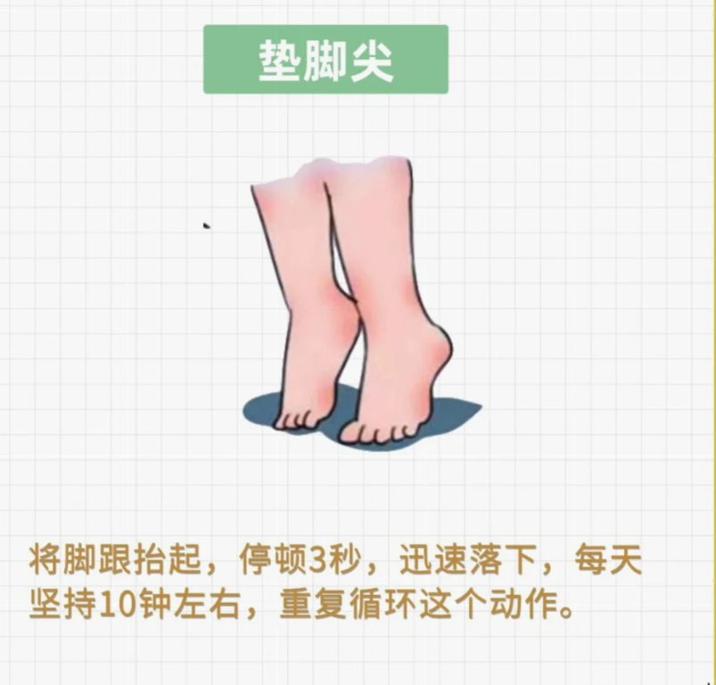

>  追去自我救赎的道路开始了，下定决心准备健身、备考雅思了，做点更有意义的事情。

## 1.健身计划

练习内容：

1. 每天早睡，12点以前睡觉；

2. 每天热水泡脚20分钟；

3. 深蹲每天200个，分为4组，每次50个。

4. 提肛运动每组20次，每天5组。

   

5. 垫脚尖100个。

   

6. 每周用哑铃练习胸、背、肩、手臂各一次。

## 2.训练时间排表

- [x] 2024.12.18

## 1.第1周

- [ ] 2024.12.19
- [ ] 2024.12.20
- [ ] 2024.12.21
- [ ] 2024.12.22

## 2.第2周

- [ ] 2024.12.23
- [ ] 2024.12.24
- [ ] 2024.12.25
- [ ] 2024.12.26
- [ ] 2024.12.27
- [ ] 2024.12.28
- [ ] 2024.12.29

## 3.第3周

- [ ] 2024.12.30
- [ ] 2024.12.31
- [ ] 2024.1.1
- [ ] 2024.1.2
- [ ] 2024.1.3
- [ ] 2024.1.4
- [ ] 2024.1.5

## 4.第4周

- [ ] 2024.1.6
- [ ] 2024.1.7
- [ ] 2024.1.8
- [ ] 2024.1.9
- [ ] 2024.1.10
- [ ] 2024.1.11
- [ ] 2024.1.12
