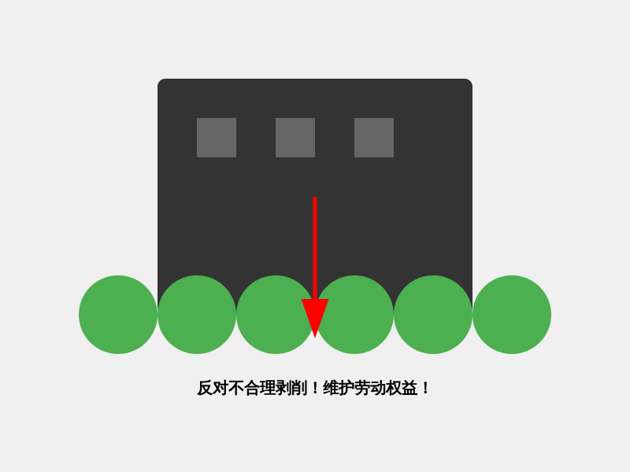

> 简单补充下自己身在职场要了解到的法律知识，国内黑公司太多了，便于日后维权。

# 职场法律知识指南

## 目录

- [劳动合同](#劳动合同)
- [薪资待遇](#薪资待遇)
- [工伤与职业病保护](#社会保险与福利)
- [知识产权保护](#知识产权保护)
- [社会保险与福利](#工伤与职业病保护)
- [劳动争议处理](#劳动争议处理)
- [实用建议](#实用建议)
- [相关法律法规](#相关法律法规)
- [常用联系方式](#常用联系方式)

## 劳动合同

### 1. 劳动合同类型
- **固定期限劳动合同**：约定合同终止时间
- **无固定期限劳动合同**：未约定终止时间
- **以完成一定工作任务为期限的劳动合同**：以特定工作完成为终止条件

### 2. 必备条款

- **书面形式签订**
- 用人单位名称、住所和法定代表人
- 劳动者姓名、住址和身份证号码
- 劳动合同期限
- 工作内容和工作地点
- 工作时间和休息休假
- 劳动报酬
- 社会保险
- 劳动保护、劳动条件和职业危害防护

### 3. 劳动合同终止与补偿

#### 1.合法解雇条件

- 严重违纪
- 能力不匹配
- 经济性裁员

#### 2.经济补偿

- 按照工作年限计算
- 每满一年支付一个月工资
- 不满一年按比例计算

## 薪资待遇

### 1. 工资支付原则

- 同工同酬
- 不得低于当地最低工资标准
- 按月支付
- 不得克扣或无故拖欠

### 2. 工资构成
- 基本工资
- 绩效工资
- 加班工资
- 各类津贴补贴

### 3. 工资保护

- 用人单位破产时优先支付
- 拖欠工资可申请劳动争议仲裁
- 可向劳动监察部门投诉

## 工伤与职业病保护

### 1. 工伤认定

- 在工作期间受伤
- 因工作原因致残或死亡
- 往返工作路途中的意外

### 2. 工伤保险

- 医疗费用报销
- 伤残补助
- 护理费用

## 知识产权保护

### 1. 职务发明

- 单位享有申请专利权
- 发明人享有署名权
- 获得奖励和报酬

### 2. 竞业限制

- 约定服务期
- 竞业补偿金
- 不得过度限制

## 社会保险与福利

### 1. 五险一金
- **养老保险**
- **医疗保险**
- **失业保险**
- **工伤保险**
- **生育保险**
- **住房公积金**

### 2. 法定假期
- **年休假**：工作满1年
  - 1-10年：5天
  - 10-20年：10天
  - 20年以上：15天
- **法定节假日**：11天
- **婚假、丧假、产假**等

## 劳动争议处理

### 1. 处理途径

1. **协商解决**
   - 与用人单位直接沟通
   - 通过工会组织协调
3. **仲裁**
   - 劳动争议仲裁委员会
   - 申请时效为一年
   - 仲裁裁决具有法律效力
4. **诉讼**
   - 对仲裁裁决不服可提起诉讼
   - 部分案件可直接起诉
   - 通过法院解决

### 2. 证据收集
- 劳动合同
- 工资条
- 考勤记录
- 工作证明
- 通讯记录
- 录音录像
- 证人证言

### 3. 维权注意事项
1. **及时性**
   - 注意仲裁时效
   - 保留相关证据
   - 及时申请劳动监察

2. **合法性**
   - 遵循法定程序
   - 采用合法手段
   - 理性表达诉求

3. **专业性**
   - 必要时寻求法律援助
   - 咨询专业律师
   - 了解相关法律法规

## 实用建议

### 1. 入职注意事项
- 仔细阅读劳动合同
- 索要并保管入职材料
- 了解公司规章制度

### 2. 在职期间
- 定期整理工作记录
- 保留重要沟通证据
- 及时反映问题隐患

### 3. 离职注意事项

- 按程序办理交接
- 索要离职证明
- 办理社保转移

## 相关法律法规

- 《中华人民共和国劳动法》
- 《中华人民共和国劳动合同法》
- 《中华人民共和国社会保险法》
- 《工资支付暂行规定》
- 《劳动争议调解仲裁法》
- 《女职工劳动保护特别规定》

## 常用联系方式

- **劳动监察投诉电话**：12333
- **劳动争议仲裁委员会**：查询当地电话
- **工会职工服务热线**：12351
- **法律援助热线**：12348

**记住：了解和运用法律知识是保护自身权益的重要手段。在职场中遇到问题时，应理性对待，依法维权。 可以遵从以下几点：**

1. **保存重要文件和证据**
2. **了解自身权利**
3. **理性维权**
4. **必要时寻求法律援助**