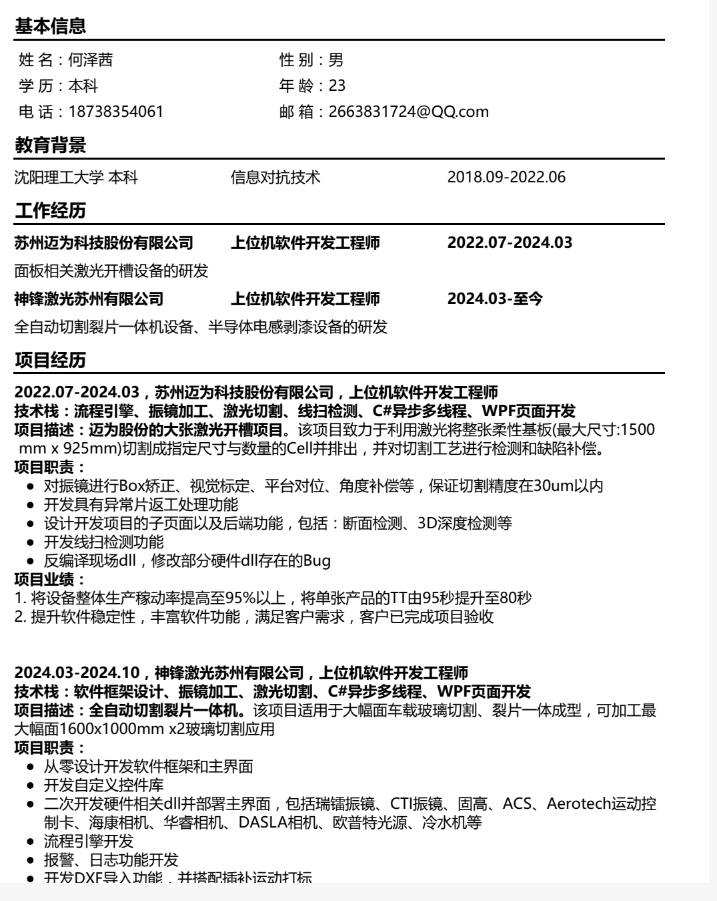
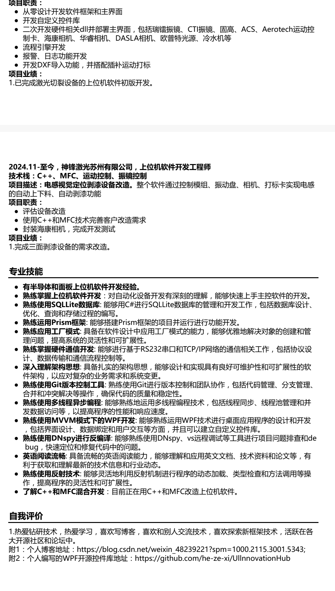
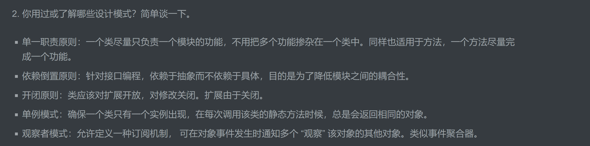

# 一.需要学习的代码知识

* 自动化设备通信协议，能够与硬件设备实现稳定、高效的通信；主流通信方式和协议如TCP/IP协议、Modbus协议等，精通串口和网口通信；
* 多线程同步异步开发， 数据库, Xml运用；
* 精通运动控制，熟悉各种运动控制卡及IO卡、采集卡的使用；
* 系统分析和设计能力；
* 反编译能力；

# 二.面试准备

## 1.简历参考

## 2.面试过往经验总结

### 1.海康面试失败原因

> 1. 我在简历上写明我在从零设计框架，但面试官问我，框架有哪些特点，框架设计结构是怎样的，我却回答吞吞吐吐，我在简历上写的应该是我非常了解的，而不是自问自答都回答不出来的这种，以后不许再犯这样的错误。
> 2. 问我对WPF下MVVM模式的理解、对prism框架使用下来的优点和缺点评价、对垃圾回收器机制的理解。说明我的问题：看问题、学知识没有真正理解，太过表面和功利化。
> 3. 简历内容有错别字，面试官大打折扣。
> 4. 我在面试的时候，对自己工作的描述过于简单化，让人听了就是只会做界面，而不会解决问题。
> 5. 对自己不够自信，面试官问我答这种，也没有做PPT展示对公司技术层面的分析和资料查找。
> 6. 没有让人看到你想为面试公司做事的决心。
> 7. 要的薪资太高，原因归因于：工作经验不够+面试表现一般。

## 3.自我介绍以及面试问题

>1. 介绍一下自己吧？
>我叫何泽茜，2022年6月份毕业于沈阳理工大学，所修专业是信息对抗技术。2022年7月份正式参加工作，工作2年多，一直在激光切割设备领域从事上位机软件开发工作。在第一家公司的时候，参与开发国内第一台大型激光开槽设备，该设备用于激光切割面板屏幕并对切割结果进行检测，担任的角色是软件开发工程师，和CIM、视觉、电气、工艺协同完成设备开发任务，在客户现场了出差了一年，积累了丰富的开发经验。目前公司，参与设计开发激光切裂一体设备，编写上位机软件开发工作，并参与设计基础平台编写，目前上位机软件已成功在设备上部署并得到客户的良好反馈。
>
>2. 这个项目的难点在哪里，怎么解决的？你遇到了问题是怎么解决的？
>
>* 绵阳BOE，22年底，那时候刚工作4个月，来到BOE车间，设备在线过程中，突发界面爆出一个异常，OutofMemory，线扫相机线扫出图刷图很慢，CPU爆满，设备不得不停下来，他们在加班加点生成苹果屏幕，客户的科长也在，12个BOE的工程师给我围起来，穿着黄色衣服，我压力很大。带我的人没进来，因为核酸检测结果没出来，客户科长说，给你半小时，能解决吗？我开始搞，分析问题。OutofMemory一般是由于内存不足引起的，而软件表象是线扫出图很慢，我先查看文件夹里存图片，发现存图不齐全，每个配方对应的cell会有16张线扫图片存起来，但是只存了几个，我就分析到是线扫存图出了问题，结合Bitmap是用的非托管内存，马上找到对应存图代码，发现程序在一个for循环中频繁创建和销毁Bitmap对象可能导致内存碎片化，避免一次加载整个图片，而是尽量在循环外创建Bitmap对象，然后在for循环内部对图像进行分块处理图像的宽高像素，修改了代码后，和客户一起测试程序，暂未发现问题，然后后续经过大量验证测试。因此做了如下总结，在涉及到相机拍照存图时候，使用using语句和dispose方法来及时释放内存，在加载或处理大图像时，可能会抛出OutOfMemoryException，这个时候就要分块处理大图像：避免一次性加载整个图像，而且避免在for循环内部频繁创建BitMap对象避免内存碎片化现象。
>
>
>
>* 目前的UV固化方式：设置功率没有得到从UV灯硬件反馈出的一个信号，而不是现在的执行完设置功率的方法就认为是设置成功了,按照目前车间UV固化的方案，UV灯出事是早晚的事情。操作UV灯有反馈信号。比如通信断了，有一个反馈，比如说使用的时候，间隔多少毫秒，软件和硬件进行通信，当间隔一段时间通信失联的话，就会反馈，固化灯硬件就会报警或者强制处理措施。应用物理电路学中的安全动作原理(硬件自身的防护是最后一段关卡)。再比如，设置功率成功或者失败了，肯定要从UV灯硬件那里得到一个反馈信号，弹窗提示也行啊。
>
>3. 设备硬件组成有哪些？
>
>  * 4个CO2激光器（最大理论切割功率为100w），实际切割功率为32w左右。
>  * 8个线扫相机。
>  * 冷水机1个用于给激光器、线扫相机、UV灯降温。
>  * 精校相机1个，用于标定和补偿精度。
>  * 有4个振镜头，分别对应4个CO2激光器。光从CO2激光器打出，经过光路盒从振镜头里出来。
>  * 2个预校相机，放在平台上，作用：预校、对位、补偿，让片子摆正。
>  * USC1个，用于清洁产品。
>  * VCR相机(读码相机)1个，用于识别片子上的二维码信息。
>  * FindMark相机1个，用于拍片上的箭头，检查片子是否放反了。
>
>4. 设备流程：上料（同时识别VCR和FindMark箭头）------识别预校Mark（看片子有没有偏，每张会计算出一个补偿值）------放到WorkTable上做线扫（查找切割Mark）------短边切割-----长边3切割------下料。
>
>5. CIM主要负责与上游Robot的上料交互、帐料的管理，设备状态等事件上报、设备内大部分的通信和Tray组信息管理。
>
>6. Loki半导体晶圆激光开槽设备,
>
>7. 标定一般流程：初始化设备、执行标定、验证结果、保存结果，常见的标定以及原理：
>
>  * 视觉标定：相机内外参标定(焦距、畸变系数)、手眼标定()
>  * 运动标定：直线度标定
>  * 激光功率标定：激光器功率标定、激光寻焦
>
>8. 提升TT的一些方式：
>
>  * 任务并行化：多线程异步
>  * 预加载：提前加载数据，提前打开硬件比如提前打开UV灯，提前移动设备到对应位置
>  * 图像处理优化、相机触发优化(提前触发相机)
>
>9. 从零设计开发软件框架和主界面?
>
>   10. 你认为prism框架的优缺点是什么？
>
>  优点：1. MVVM模式开发、模块化开发、依赖注入、导航服务、事件聚合器
>
>   缺点：
>
> * 性能开销，每次反射都会带来性能增长，每次导航也会创建新的实例。
>* 过度设计，简单功能实现复杂，简单的页面跳转需要定义多个类而且还需要注册和配置
>
>总结：适用场景：
>
>
>
>
>
>12. 流程引擎？
>
>13. TCP通信：TCP/IP通信的关键特点：
>
>   * 可靠性：TCP提供可靠的数据传输
>
>    * 面向连接：需要建立连接后才能通信。
>
>    * 流式传输：数据作为字节流传输
>
>    * 双向通信：支持全双工通信
>
> 14. 反射的应用场景： 依赖注入容器、序列化、插件系统。
>
>15. 最近在研究热插拔系统，所谓的软件热更新。
>
>16. SCANLAB RTC系列振镜卡、金橙子振镜卡。
>
>17. CTI振镜、SCANLab振镜。
>
>18. Modbus通信协议：
>
>   通信方式：
>
>    * Modbus RTU (串口)
>
>    * Modbus TCP (网络)
>
>    * Modbus ASCII (较少使用)
>
>    使用流程：确认是否支持Modbus协议，连接到服务器、创建客户端、读写寄存器、关闭连接。
>
> 19. 首先讲述一下我们设计的通用平台框架的特点：
>
>* 快速组装程序，根据不同的dll和配置文件来快速组成程序。
>* 插拔式，可以在文件中动态配置软件页面.
>* 每个硬件都是单独的dll，参考MEF框架，可以灵活在主程序调用。
>* MVVM架构。
>* 自动流程可以动态组合，拖拽式的方式。
>* parameters参数文件和recipe 参数文件存放在文件夹。
>* IOC手写的，希望效果为IOC.Get<>()。流程为：
### 3.1 Bug定位调试

使用windeBug和dotMemory。

## 4.有没有什么要问我面试官的？

> 1. 满足招聘要求的话，具体会从事什么？
> 2. 前任离职原因是什么？
> 3. 开发语言和技术、开发平台、系统架构？
> 4. 有没有一些技术培训，定期给技术部门学习知识、普及知识。
> 4. 钙钛矿，ACS，RTC5。

## 2.技术

### 1.综合

> 1. 谈一谈你对进程和线程的理解以及他们的区别：
> 
> * 什么是进程？进程就是程序运行资源的集合吧，包括文件句柄、虚地址空间。
> * 什么是线程？线程是属于进程内部的一个运行程序的对象。
> 区别和联系：
>  一般来说，一个进程内部包含一个线程，从程序的开始一直到结束。
> 一个进程可以包含不同的线程，这些线程可以共享用来执行程序的不同部分功能，而且他们可以共享进程的资源。
> 线程是CPU执行规划的最小单元。
> 
> 2. 刚来到公司，你会怎么快速适应环境和开发工作？
>    首先先从同事那里了解部门业务、研究方向，然后要一些资料，通过边工作便熟悉项目代码，同时做好总结。

### 2.C#相关

> 1. 说一说你对面向对象编程三大特点：封装、继承、多态的理解？
> 
> * 封装：对类的数据和方法进行保护，设置外部访问权限，保护数据安全。
> * 继承：通过继承来达到代码的复用和扩展性。
> * 多态：同一操作作用于不同的对象，可以有不同的的解释，产生不同的执行结果，这就是多态性。在具体编程中，一般就是相同的方法不同的实现。
> 
> 2. 值类型和引用类型都有哪些？区别是什么？
> 
> * 引用类型，需要两段内存，第一段存储实际的数据，它总是位于堆中；第二段是一个引用，指向数据在堆中的存放位置。
> * 值类型，数据存放在栈里；对于引用类型，实际数据存放在堆里而引用存放在栈里。
> * 常用的值类型有：int、float、double、enum。引用类型有：string、object、class、list这些。
> 
> 3. 你对抽象的理解？
>    抽象是指隐藏实现细节，只展示必要的信息和功能的方法。
>    抽象的好处是可以提供一种标准化的接口，使得不同的子类可以根据自己的需求来实现抽象方法，从而实现多态性和代码的重用性。
> 
> 4. 说一说你对抽象类和接口的理解？
>    区别：
> 
> * 成员实现：抽象类可以有具体的成员实现，包括方法、属性、事件，而接口只有成员的声明，没实现。
> * 继承：抽象类本身也是类，一个类只能继承一个抽象类，但是可以继承多个接口。
> * 访问修饰符：抽象类的成员可以用不同的修饰符，但接口一般默认为public。
> * 用途：抽象类一般用于定义公用的基础行为和属性，而接口一般用于强制类实现某些规范。
> 
> 5. 谈一谈你对依赖注入和控制反转的理解？
>    控制反转IOC就是将对象的操纵权由传统的手动new这些交给容器。依赖注入是实现IOC的一种方式，我们不是直接在另一个类（依赖类）中创建一个类的对象，而是将对象作为参数传递给依赖类的构造函数。它有助于编写松散耦合的代码，并有助于使代码更加模块化和易于测试。实现依赖注入的三种方式：构造函数注入、属性注入、方法注入。
> 
> 6. 属性和字段有什么区别？
> 
> * 属性的本质就是方法，get和set两个方法构成。
> * 字段只管存值，不管对数据的操作，字段一定是占用内存的。属性可以占用内存，也可以不占用，当属性中封装了字段时，那么属性会占用内存，当不封装字段而是做了其他操作时，是可以不占用内存的。
> * 字段是给类自己内部用的，属性是给外部调用这个类的时候用的。
> 字段一般都声明为private私有的，而属性一般都声明为public公有的。
> * 属性跟字段最根本区别就在于属性是类似于方法，字段就是变量。通过属性的set和get函数可以限制字段的一些功能，以达到某种目的。

>7. 谈一谈你对异步编程的理解？
>    首先什么是异步编程？异步的大概原理就是，程序在等待IO的过程中，继续做点别的事情，等IO过程完了，再回过来处理IO的内容，这样呢，CPU也不会闲着，在等待的过程中，又做了点别的事情吗，而不是一直等待。反映到用户那边的效果就是，程序更快了，处理用时也变短了。异步编程，核心是async和await关键字和Task对象。
>
>8. 谈一谈你对垃圾回收器GC的理解？
>
>     GC它是一种自动管理内存的机制，它可以释放不再使用的托管堆上。对象所占用的空间，从而避免内存泄漏和内存溢出
>
>     **GC的回收策略**：每次进行垃圾回收时，GC都会先回收第0代，如果需要，再回收第1代，最后是第2代。0代时最先被创建的对象，1代稍微久一点，这种分代的做法是基于这样一个观察：新创建的对象通常很快就不再使用了，而长时间存在的对象则可能会继续存在。
>
>     **GC的工作原理**：1.先遍历所有对象，标记从根开始的所有对象，没有从根开始就认为是暂不被使用的对象。2.清除所有未标记的对象，因为它们无法从任何根到达，这意味着它们不再被应用程序使用。3.为了解决碎片化问题，GC可能会移动对象，以便空闲内存是连续的，这样就可以为大型对象分配空间。
>
>9. 

### 3.WPF

> 1. WPF template模板类型有哪些？
> 3种：DataTemplate、ControlTemplate、ItemsPanelTemplate。
> * ControlTemplate定义了控件的外观；
> * DataTemplate是数据内容的展示方式；
> * ItemsPanelTemplate用于定义集合控件的容器外观，如ListBox,Combox 等等。
> 2. 谈一谈你对路由事件的理解？
> 可以在元素树上向上冒泡和向下隧道传播，并且沿着传播路径被事件处理程序处理。按钮的点击事件就是路由事件。
> 3. 谈一谈你对MVVM的理解？
> **优点**：
> * 团队层面：统一的思维方式和实现。vie层写界面，model层写模型数据，viewmodel层写交互逻辑。
> * 代码层面：美观、整齐、可替换。
> * 架构层面：解耦、稳定。
> **缺点**： 
> * viewmodel里加入太多的控制代码，你Ui如果复杂点，会变成到处都是binding，造成viewmodel中的代码维护越来越复杂。
> * 调试的时候定位问题不是很容易，当程序没按照预期的效果出现在界面上，可能是页面有问题，也可能是ViewModel层有问题。
> 4. 谈一谈你对依赖属性的理解？
> 首先，WPF是数据驱动，UI和逻辑松耦合。
> 在提出依赖属性之前，有必要先说一下WPF传统CLR属性存在的问题，我们都知道CLR属性包括一个字段，而一个控件又会有很多属性，子控件继承后会继承很多冗余的属性，每个CLR属性只有有字段就会占用很多内存，因此如果WPF里面控件的属性全是CLR属性的话，就会带来很大的内存开销。这时候为了解决这个问题，就有了依赖属性，依赖属性是一种自己没有值，但是可以通过绑定从别处拿到数据的一种属性它依赖于其他的数据源。
> 5. 清除样式可以用{x:Null} .
> 6. ObservableCollection和List的区别：
> ObservableCollection是一个动态集合，已经实现了INotifyPropertyChanged接口，不需要再实现因此PropertyChanged方法，因此能自动刷新前台页面。而List集合则没有实现INotifyPropertyChanged接口，我们需要自己实现List集合的PropertyChanged方法，才能在前台页面实现动态刷新。
> 7. margin是外间距，padding是内间距。
> 8. 谈一谈你对触发器的理解？触发器有哪些？
>  触发器可以理解为, 当达到了触发的条件, 那么就执行预期内的响应, 可以是样式、数据变化、动画等。
>     触发器包括：Trigger、MultiTrigger 、DataTrigger 、MultiDataTrigger、EventTrigger 。
>  9. 什么是行为？
>  行为是Blend中的东西，WPF中用的话，要引入一个包。
>     关于什么是行为？控件的界面逻辑大都可以被认为是行为：TextBox在被聚焦后自动全选、在Window中按下Esc会退出、Button点击后会弹出一个小窗口、Grid按照某种方式排布子控件。
>  10. WPF中常用的几种布局方式？
> * Grid;
> * StackPanel;
> * WrapPanel;
> * DockPanel;
> * UnifromGrid;
> * Canvas;
> * ScrollViewer;
> * ViewBox;
> * Border;
> 11. 如果要根据数据对象和数据绑定元素来选择DataTemplate数据模板，要怎么做？
> 可以用DataTemplateSelector，为数据模型内不同的属性用值应用不同的数据模板，多用于容器。
> 12. 您在WPF开发中使用哪些常用控件和布局？
> 控件方面，Button、TextBox、TextBlock、ListBox、Combox、DataGrid。布局方面，Grid、StackPanel、Border、DockPanel。
> 13. 谈一谈你对数据绑定的理解，以及在实际项目中如何运用？
> 数据绑定是WPF里很强大的特性，我们可以将数据源绑定在UI控件上，当后台数据发生变化时，UI界面也会随着更新。在实际项目中，我一般会把数据源写在ViewModel中，把View中通过数据绑定将数据源和UI元素相互关联。
> 14. 分享一次在WPF开发中遇到的困难，以及如何解决的？
> * 有一次，使用MVVM模式时，曾遇到过视图模型逻辑过于复杂、在多个视图中共享代码等挑战。为了解决这些问题，我通常把视图模型按功能划分为多个小模块，并使用依赖注入等技术来减少模块之间的耦合。
> * 曾遇到过一个由于大数据量所导致的UI卡顿问题，关于DataGrid的。后来通过异步数据加载和分页显示等方式来缓解UI界面的负担。最终，通过这些调整和改进，成功地解决了UI卡顿的问题。
> 15. 谈一下你对MVC和MVVM模式的理解和区别？
> * MVC模式一般在Asp.net模式中用的较多，model、view、controller，当用户请求路由时候，就会调用路由对应的控制器，对数据进行处理，返给前端页面进行渲染。
> * 区别：
> MVC是单向通信，数据模型必须通过Controller层进行承上启下。而MVVM是双向的，并且是自动的，也就是数据发生变化自动同步视图，视图发生变化自动同步数据。
> 16. WPF中的绑定方式有哪几种？
> 四种：OneWay、TwoWay、OneTime和OneWayToSource。
> * OneWay用于将数据从数据源绑定到目标属性，适用于只读或只写属性；
> * TwoWay用于双向绑定，可实现UI和数据源的自动同步；
> * OneTime用于单次绑定，只在初始化时传递数据，适用于只需一次性绑定的情况；
> * OneWayToSource用于将数据从UI元素传递回数据源，适用于需要修改数据并更新源数据的情况。
> 17. WPF中实现动画的方式有哪些？Storyboard、触发器、时间线、路径动画等。
> 18. 如果要实现自定义控件，可以从哪些层面入手？
> * 继承或者组合现有控件。
> * 重写控件模板。
> 18. WPF 中的路由事件可以根据传播方向分为三种类型，即冒泡、直接和隧道。
>

### 4.设计模式

> 1. 为什么要用到设计模式啊？
> 我觉得在软件开发过程中不仅要完成基本的逻辑业务，还要考虑项目的扩展、复用、可维护性，如果项目代码写得像一坨狗屎一样，整体结构只会越来越糟，甚至最后还有可能出现“程序是运行在Bug上的”离谱场景。
> 还有，在写代码的时候不必刻意去采用哪种设计模式来写代码，要根据合适的场景来选择合适的设计模式，即使有时候不采用设计模式也未必是不对的。工业这块，代码要求稳定、规矩，不花里胡哨，当然设计出来的软件也要求稳定、耐用。
> 其实设计模式在平时代码中会隐藏式地体现出来。比如单一模式原则，一个类中应该只负责一个功能领域中的职责，平时在设计类时候，也会这么做。
> 2. 你用过或了解哪些设计模式？简单谈一下。
> * 单一职责原则：一个类尽量只负责一个模块的功能，不用把多个功能掺杂在一个类中。同样也适用于方法，一个方法尽量完成一个功能。
> * 依赖倒置原则：针对接口编程，依赖于抽象而不依赖于具体，目的是为了降低模块之间的耦合性。
> * 开闭原则：类应该对扩展开放，对修改关闭。扩展由于关闭。
> * 单例模式：确保一个类只有一个实例出现，在每次调用该类的静态方法时候，总是会返回相同的对象。
> * 观察者模式：允许定义一种订阅机制， 可在对象事件发生时通知多个 “观察” 该对象的其他对象。类似事件聚合器。
### 6.数据库

> 1. 数据库有哪几种类型？
> 关系型数据库、分布式数据库、非关系型数据库。
> 2. 谈一谈你对Delete和Drop的区别和用法？
> * Drop是删除表中的数据和定义，释放空间，最暴力不保留任何东西。
> * Delete是删除表中数据不删除定义，不释放空间。
> 3. 数据库中，主键有什么作用？
> 标识表中唯一的实体。
> 4. 什么是数据库中的表？
> 数据库表就是数据库中存放行和列记录的表。
> 5. 一些命令：
> * 创建一个数据表：Create DataBase Student;
> * 创建一个数据表 ：Create table Student  (Id int,StudentNo char(11),Phone char(11),Sex nchar(4));
> * 删除数据库：drop database Student；
> * 删除用户表中的数据：delete from Userinfo；
> * 清空用户表中的数据：truncate table UserInfo ;
> 6. truncate 与 delete 的区别
> truncate 是真正意义上的清空， 不能加任何查询条件，自增id 会重置；
> delete 只是删除数据，如果Id是自增，则自增种子不会从头开始。
### 7.半导体相关

1. 半导体机械手、半导体机器人，硅片机器人、硅片机械手等，均指半导体晶圆传输机器人。重点用在半导体工艺设备和Foundry厂等，典型应用如蚀刻机、光刻机、薄膜沉积设备（PVD、CVD）、晶圆清洗设备、CMP设备、离子注入机、检测设备（ATE、探针台、分选机）、涂胶显影机、晶圆片键合机、去胶设备和显影设备等。全球半导体机械手（Semiconductor Wafer Transfer Robots）主要生产商包括了Brooks Automation、RORZE Corporation、DAIHEN Corporation、Hirata Corporation和Yaskawa，Phoenix Engineering。北美是全球最大的半导体机械手市场，其市场份额大约为25%，再者是中国大陆及中国台湾地区。目前改行业属于尖端细分领域，国产替代空间大。目前率先在中国实现国产设备量产的厂家有苏州菲科半导体。
2. 晶圆传输设备（EFEM）在整个生产线上完成晶圆的分类、预对准和传输等功能，是连接物料搬运系统与晶圆处理系统的桥梁，是晶圆生产线不可或缺的重要组成部分。
3. 晶圆传输设备的核心技术部件主要包括：晶圆装载装置、晶圆运输机械手（Robot）、晶圆预对准机构（Pre-Aligner）和空气过滤器（FFU）。

### 8.激光加工领域常见的激光器类型

#### 1.简介

1. CO2激光器

   基本特征：

   > 波长：10.6μm（远红外光）
   >
   > 功率范围：几瓦到数万瓦
   >
   > 工作方式：连续或脉冲

   主要应用：

   > 非金属材料切割（亚克力、木材、布料等）
   >
   > 玻璃表面处理
   >
   > 包装材料打标
   >
   > 皮革雕刻

   优势：

   > 成本较低
   >
   > 运行稳定
   >
   > 适合大面积加工
   >
   > 对非金属材料吸收率高

2. UV激光器

   基本特征：

   > 波长：355nm左右
   >
   > 光束质量好
   >
   > 冷加工特性

   主要应用：

   > PCB板切割/钻孔
   >
   > FPC柔性线路板加工
   >
   > 半导体晶圆切割
   >
   > 精密显示屏加工
   >
   > 玻璃内雕

   优势：

   > 精度高
   >
   > 热影响区小
   >
   > 适合精密加工
   >
   > 可加工透明材料

3. 飞秒激光器

   基本特征：

   > 脉冲宽度：飞秒级（10^-15秒）
   >
   > 峰值功率极高
   >
   > 超快脉冲特性

   主要应用：

   > 医疗器械精密加工
   >
   > 半导体器件制造
   >
   > 玻璃内部改性
   >
   > 精密微加工
   >
   > 科学研究

   优势：

   > 超高精度
   >
   > 几乎无热影响
   >
   > 可加工任何材料
   >
   > 适合超精密加工

4. 紫外（DPSS）激光器

   基本特征：

   > 波长：355nm
   >
   > 固态激光器
   >
   > 高稳定性

   主要应用：

   > 精密电子元件标记
   >
   > LCD面板修复
   >
   > 太阳能电池加工
   >
   > 精密零件打标

   优势：

   > 光束质量好
   >
   > 寿命长
   >
   > 维护成本低
   >
   > 适合精密标记

#### 2.技术比较

加工精度：

> 飞秒激光器 > UV激光器 > 紫外激光器 > CO2激光器。

成本：

> 飞秒激光器 > UV激光器 > 紫外激光器 > CO2激光器。

适用范围：

> CO2：非金属材料大面积加工
>
> UV：精密电子元件、透明材料
>
> 飞秒：超精密加工、特殊材料
>
> 紫外：精密标记、电子元件

#### 3.发展趋势

1. 智能化升级

> 智能控制系统
>
> 在线监测
>
> 自动化集成

2. 性能提升

> 更高功率密度
>
> 更好的光束质量
>
> 更高的稳定性

3. 应用拓展

> 新材料加工
>
> 复合加工工艺
>
> 特殊工艺开发

#### 4.选择建议

选择激光器时需考虑：

> 加工材料特性
>
> 精度要求
>
> 生产效率需求
>
> 投资预算
>
> 维护成本
>
> 应用场景

> 不同类型激光器各有特点，需要根据具体应用场景选择合适的类型，有时可能需要多种激光器配合使用以满足不同工艺需求。

#### 5.工作的激光器相关

> 4个CO2激光器(相干的激光器，大概十几万一台)一起切割，切割精度：≤±30µm。4个UV激光器(通快的激光器，大几十万一台)一起切割切割精度：≤±30µm。绿光激光器，切割精度：≤±30µm。
>
> 切裂一体机：皮秒(70w，波长为1064nm)+CO2(120瓦，波长为10.6um)双激光器结构。1um=1000nm。
>
> 加工精度：飞秒激光器 > UV激光器 > 紫外激光器 > CO2激光器。
>
> 国外进口激光器相比国内稳定，指的是：功率的稳定性、光束质量、光斑发散角、光束的指向性、脉冲稳定性。

#### 6.工业视觉相关知识：halcon、opencv。

#### 7.

## 3.工作经历

> 1. FLC和BendingCut做的工作：主要负责中段和后端的检测和线扫工作。  
>   * GPC段 3D深度检测功能，对激光的切割深度进行检测，并在界面上显示处理过的图像。主要做的工作是：3D深度检测流程开发。首先先写一个抽检功能，比如我要每30张half来做一次深度检测，那么当满足条件的时候，我需要让主流程先暂停，然后进入3D深度检测流程，并控制轴走到一定程度的时候触发相机拍照，然后拿到图片传给视觉，视觉处理完之后，我在呈现在界面上，然后进入下一步流程流入后端。
> * GPC的照度测量，测量4个UV灯在台子上的不同地方的照度数据，从而判断是否有衰减问题。  
> * IO和水汽的监控，超出阈值会在界面显示或者报警提醒。 
> * 生产模式和空跑模式下对流程的控制等等。  
> * 不同配方下轴点位功能的保存和记录。  
> * PIU段对异物、残胶、划痕、气泡来进行检测，检测不合格会赋予NG，然后人工处理 
> * 上传客户FTP服务器图片，并做到图片定时删除，比如保留一个月自动删除这些。
>
> 2. 解决的的一些问题：
>
>    绵阳BOE，22年底，那时候刚工作4个月，来到BOE车间，设备在线过程中，突发界面爆出一个异常，OutofMemory，线扫相机线扫出图刷图很慢，CPU爆满，设备不得不停下来，他们在加班加点生成苹果屏幕，客户的科长也在，12个BOE的工程师给我围起来，穿着黄色衣服，我压力很大。带我的人没进来，因为核酸检测结果没出来，客户科长说，给你半小时，能解决吗？我开始搞，分析问题。OutofMemory一般是由于内存不足引起的，而软件表象是线扫出图很慢，我先查看文件夹里存图片，发现存图不齐全，每个配方对应的cell会有16张线扫图片存起来，但是只存了几个，我就分析到是线扫存图出了问题，结合Bitmap是用的非托管内存，马上找到对应存图代码，发现程序在一个for循环中频繁创建和销毁Bitmap对象可能导致内存碎片化，避免一次加载整个图片，而是尽量在循环外创建Bitmap对象，然后在for循环内部对图像进行分块处理图像的宽高像素，修改了代码后，和客户一起测试程序，暂未发现问题，然后后续经过大量验证测试。因此做了如下总结，在涉及到相机拍照存图时候，使用using语句和dispose方法来及时释放内存，在加载或处理大图像时，可能会抛出OutOfMemoryException，这个时候就要分块处理大图像：避免一次性加载整个图像，而且避免在for循环内部频繁创建BitMap对象避免内存碎片化现象。

谈一谈你对垃圾回收器GC的理解？

GC它是一种自动管理内存的机制，它可以释放不再使用的托管堆上。对象所占用的空间，从而避免内存泄漏和内存溢出。GC的回收策略**：每次进行垃圾回收时，GC都会先回收第0代，如果需要，再回收第1代，最后是第2代。0代时最先被创建的对象，1代稍微久一点，这种分代的做法是基于这样一个观察：新创建的对象通常很快就不再使用了，而长时间存在的对象则可能会继续存在。GC的工作原理**：1.先遍历所有对象，标记从根开始的所有对象，没有从根开始就认为是暂不被使用的对象。2.清除所有未标记的对象，因为它们无法从任何根到达，这意味着它们不再被应用程序使用。3.为了解决碎片化问题，GC可能会移动对象，以便空闲内存是连续的，这样就可以为大型对象分配空间。

* 快速组装程序，根据不同的dll和配置文件来快速组成程序。
* 插拔式，可以在文件中动态配置软件页面。
* 每个硬件都是单独的dll，参考MEF框架，可以灵活在主程序调用。
* MVVM架构。
* 自动流程可以动态组合，拖拽式的方式。
* parameters参数文件和recipe 参数文件存放在文件夹。
* IOC手写的，希望效果为IOC.Get<>()。流程为：

生产者消费者。

1. 介绍下你在项目中担任的角色，开发过什么功能？
2. **在项目中，你解决过什么重大问题？有没有遇到一些很难解决的问题？**
3. **你开发用过的哪些技术栈，你在项目中使用WPF开发过哪些自定义控件和页面？**
4. **你们项目中用到的是什么开发框架？对MVVM模式的优点和缺点的理由**。
5. **谈一谈你对依赖属性的理解？**
6. **WPF怎么把事件和ViewModel里的方法绑定？**
7. **C#中，你对GC的理解和认识？**
8. **你对抽象类和接口的理解？**
9. 