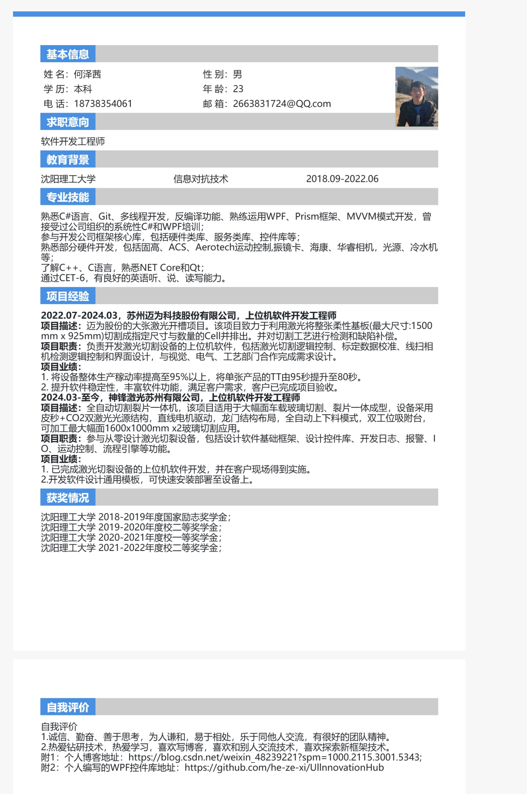
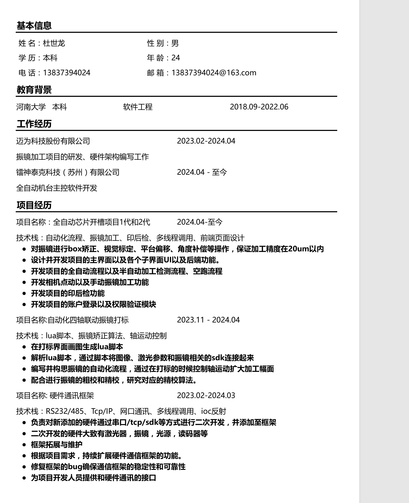
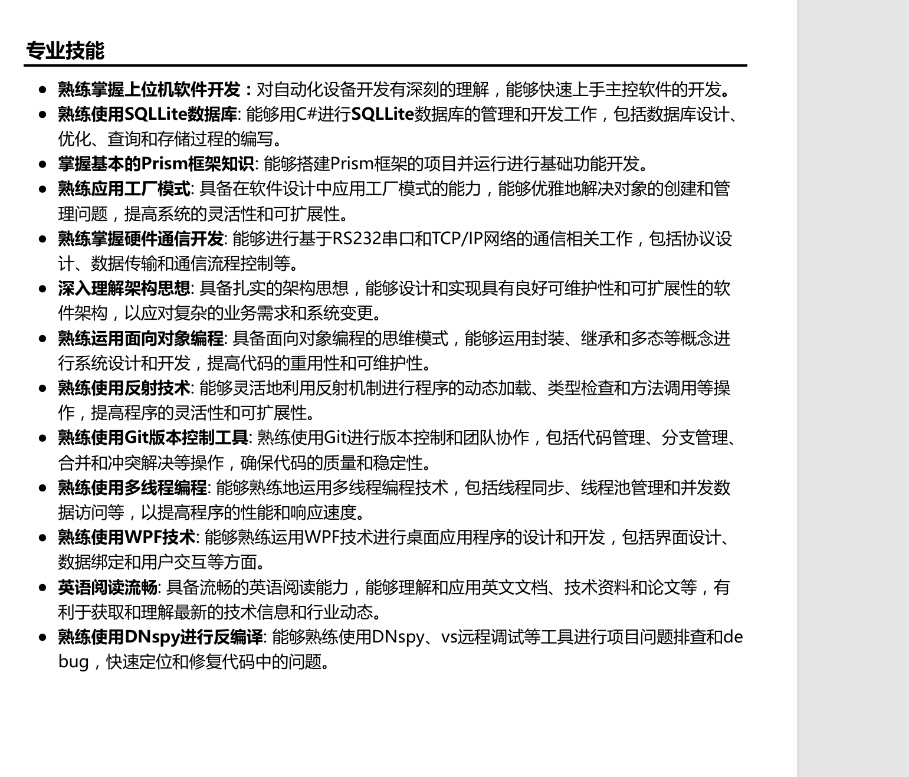
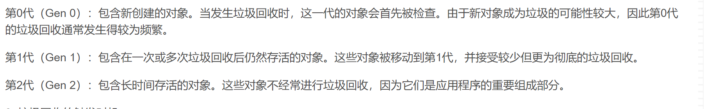

# 一.需要学习的代码知识

* 自动化设备通信协议，能够与硬件设备实现稳定、高效的通信；主流通信方式和协议如TCP/IP协议、Modbus协议等，精通串口和网口通信；
* 多线程同步异步开发， 数据库, Xml运用；
* 精通运动控制，熟悉各种运动控制卡及IO卡、采集卡的使用；
* 系统分析和设计能力；
* 反编译能力；

# 二.面试准备

## 1.简历参考







## 2.面试过往经验总结

### 1.海康面试失败原因

> 1. 我在简历上写明我在从零设计框架，但面试官问我，框架有哪些特点，框架设计结构是怎样的，我却回答吞吞吐吐，我在简历上写的应该是我非常了解的，而不是自问自答都回答不出来的这种，以后不许再犯这样的错误。
> 2. 问我对WPF下MVVM模式的理解、对prism框架使用下来的优点和缺点评价、对垃圾回收器机制的理解。说明我的问题：看问题、学知识没有真正理解，太过表面和功利化。
> 3. 简历内容有错别字，面试官大打折扣。
> 4. 我在面试的时候，对自己工作的描述过于简单化，让人听了就是只会做界面，而不会解决问题。
> 5. 对自己不够自信，面试官问我答这种，也没有做PPT展示对公司技术层面的分析和资料查找。
> 6. 没有让人看到你想为面试公司做事的决心。
> 7. 要的薪资太高，原因归因于：工作经验不够+面试表现一般。

## 3.自我介绍以及面试问题

>1. 介绍一下自己吧？
>我叫何泽茜，2022年6月份毕业于沈阳理工大学，所修专业是信息对抗技术。2022年7月份正式参加工作，工作2年多，一直在激光切割设备领域从事上位机软件开发工作。在第一家公司的时候，参与开发国内第一台大型激光开槽设备，该设备用于激光切割面板屏幕并对切割结果进行检测，担任的角色是软件开发工程师，和CIM、视觉、电气、工艺协同完成设备开发任务，在客户现场了出差了一年，积累了丰富的开发经验。目前公司，参与设计开发激光切裂一体设备，编写上位机软件开发工作，并参与设计基础平台编写，目前上位机软件已成功在设备上部署并得到客户的良好反馈。
>2. 这个项目的难点在哪里，怎么解决的？你遇到了问题是怎么解决的？
>有段时间出现了个问题，视觉加了一个3D深度检测的功能，软件这边也开了个流程和页面做对应调整。软件经过2天验证测试，CPU占用就满了，需要关掉软件然后对软件进行Bug分析。那个视觉的同事没有任何证据的情况下，就肆意甩锅给我们软件，说是我们写的流程有问题。我没像他那样肆意推卸责任，我只想拿数据和证据说话。首先我在流程的多个地方打了日志，记录每一个小节的处理时间。然后排查到在从相机中拿完图存储的时候时间很长，然后屏蔽了他的拿图算法后，处理时间有了改善，最后经过大量测试，发现了问题原因并写了分析报告给领导，查找了真正问题所在。
>3. 如果有两个不同的解决方案可以解决同一个问题，您会如何选择？请说明您的决策过程。
>首先分析环境因素，客户给的时间、金钱成本、人力成本因素；
>其次从解决方案本身，是否真正解决问题，未来是否有隐患，是否具有可维护性角度来进行综合评估。
>4. 当遇到一个超出预期的困难时，您通常会如何处理？请举一个实际例子来说明。
>之前客户让添加一个相机视图鹰眼图的功能并做到鼠标点击哪里，多轴平台就可以运动到哪里。当时刚毕2个月，知识储备还不足以完成此复杂功能，在网上查找了些资料，没发现相关功能代码，于是就在咸鱼上找外援，花了100元解决了，并成功应用在客户公司。寻求他人的帮助就行。
>5. 您如何保持对行业趋势的敏感度？请分享一些您最近关注到的行业动态。
>平时看一些公司的财报、一些面板公众号等，了解行业内最新资讯。
>6. 简要介绍下对半导体行业的看法？
>应用领域广泛：通信、工业、汽车、信息安全、医疗、物联网、PC、新能源、消费电子，因此无论是从科技还是经济领域来看，半导体都有着很重要的促进作用。
>7. 您如何保持对上位机技术的更新和学习？
>不局限于软件层面，工艺、视觉、硬件参数都在齐头并进了解。
>8. 请解释一下什么是上位机，以及它在控制系统中的作用。
>上位机是可以直接发出操控命令的计算机，通常为工控机、PC机、触摸屏等。用于控制下位机(如PLC、单片机)等，也可以用于监控工厂设备运行状态等。
>9. 您在上位机开发方面的核心技能是什么？
>* 系统性的专业技能，C#、WPF等技术栈。
>*  对设备的深入理解，科学的做事方式。
>*  丰富的客户现场开发和出差经验。
## 2.技术
### 1.综合
> 1. 上位机软件开发流程： 首先上位机软件开发的主要目的是为用户提供一个可靠的、可控的、可管理的系统，以满足用户的需求。主要流程包括：软件设计、编程、测试、安装和维护。在做好一个功能之前，需要了解的工作：机械结构、电气结构、网络结构、分布式软件结构、需求、技术。
> 2. 框架是不断更新和发展的，您如何保持学习并跟上最新的技术趋势？ 我认为保持持续学习和跟上最新技术趋势是非常重要的。我的做法是定期阅读相关书籍、文章和博客，并参加行业内的培训和研讨会等活动。此外，我也会积极参与开源社区，学习和分享最新的技术成果。
> 3. 你认为工控好软件的标准是什么？稳定、高性能、UI好看。
> 设备UI的本质是人机交互，人机交互是建立在对设备的状态进行了解、完全控制的基础上的。
> 4. 谈一谈你对进程和线程的理解以及他们的区别：
> * 什么是进程？进程就是程序运行资源的集合吧，包括文件句柄、虚地址空间。
> * 什么是线程？线程是属于进程内部的一个运行程序的对象。
> 区别和联系：
>  一般来说，一个进程内部包含一个线程，从程序的开始一直到结束。
> 一个进程可以包含不同的线程，这些线程可以共享用来执行程序的不同部分功能，而且他们可以共享进程的资源。
> 线程是CPU执行规划的最小单元。
> 5. 为什么想离职？
> * 出差太多，我上班一年半几乎都在外面出差。每次出差都是长期半年起步。
> * 珠海成立了一个迈为，之前说好了自愿过去，可是这两年要强制搬过去，不想去那边。
> 6. 对未来有什么规划？
> * 个人追求层面，想在激光领域学习和发展。激光的应用很广泛，很有发展前景，目前国内起步也稍晚于国外，在一些光学加工、精密测量领域，市场需求很大，希望在这方面做点实事。
> 7. 刚来到公司，你会怎么快速适应环境和开发工作？
> 首先先从同事那里了解部门业务、研究方向，然后要一些资料，通过边工作便熟悉项目代码，同时做好总结。
> 8. 问题：
> * 部门研发方向分为哪些？
> * 如果我达到贵公司的招聘要求的话，具体会去从事什么业务和工作？有多少研发部门，平时写代码会和哪些部门交互？
> * 加班情况和出差情况如何？双休吗？
> * 部门规模如何，有多少研发人员，有具体分工吗？
### 2.C#相关
> 1. 你对类的理解是什么？
> 类是用来创建对象的模板，包含数据成员和方法。类也是面向对象和面向过程区别的一大特点。
> 2. 你对面向对象和面向过程编程的理解？
> * 面向过程编程和面向对象编程是2种不同的编程思想。
> * 什么是面向过程编程? 面向过程编程强调以过程为中心，将问题分解为一系列的操作步骤，通过顺序执行步骤，每个方法都是一步操作，通过方法的拼接来将问题转化为完整的流水线式的操作。它适用解决于线性的、结构简单的问题，优点是结构清晰，执行效率高，缺点在应对复杂的问题时难以维护和扩展。
> * 什么是面向对象编程? 面向对象编程以操作对象里的数据结构和方法为核心，对多个对象进行组合和搭配，并通过封装继承多态来实现代码的扩展和服复用，来解决问题。优点是扩展、复用性高，但是执行相率相比面向过程会低一点。
> 3. 说一说你对面向对象编程三大特点：封装、继承、多态的理解？
> * 封装：对类的数据和方法进行保护，设置外部访问权限，保护数据安全。
> * 继承：通过继承来达到代码的复用和扩展性。
> * 多态：同一操作作用于不同的对象，可以有不同的的解释，产生不同的执行结果，这就是多态性。在具体编程中，一般就是相同的方法不同的实现。
> 4. 解释一下托管代码和非托管代码？
> * 托管代码：运行在CLR上的代码就是托管代码，与Java机制不同在于Java是经过一次编译和一次解释运行，C#是经过两次编译运行,这两个阶段分别为：源代码编译为托管代码，托管代码编译为微软平台的专用语言，又称机器语言。
> * 非托管代码：是由操作系统管理的代码。高级语言编写的程序必须经过一定的步骤编译为机器语言才能被机器理解和运行。 这一系列步骤为：预处理、编译、汇编、链接。
> * 特点：托管代码可以享受CLR提供的一些服务，如垃圾回收等，不需要自己管理内存。而像C++、java那些非托管代码，需要自己释放内存。
> 5. 值类型和引用类型都有哪些？区别是什么？
> * 引用类型，需要两段内存，第一段存储实际的数据，它总是位于堆中；第二段是一个引用，指向数据在堆中的存放位置。
> * 值类型，数据存放在栈里；对于引用类型，实际数据存放在堆里而引用存放在栈里。
> * 常用的值类型有：int、float、double、enum。引用类型有：string、object、class、list这些。
> 6. 你对抽象的理解？
> 抽象是指隐藏实现细节，只展示必要的信息和功能的方法。举个例子，骑手在骑摩托车的时候不需要了解内部发动机和排气是怎么运作的，但是他们知道自行车的颜色和型号。抽象也是一样的道理。它注重对于特定功能的访问，而不暴漏该功能内部是如何运作的。
> 抽象的好处是可以提供一种标准化的接口，使得不同的子类可以根据自己的需求来实现抽象方法，从而实现多态性和代码的重用性。
> 7. 说一说你对抽象类和接口的理解？
> 区别：
> * 成员实现：抽象类可以有具体的成员实现，包括方法、属性、事件，而接口只有成员的声明，没实现。
> * 继承：抽象类本身也是类，一个类只能继承一个抽象类，但是可以继承多个接口。
> * 访问修饰符：抽象类的成员可以用不同的修饰符，但接口一般默认为public。
> * 用途：抽象类一般用于定义公用的基础行为和属性，而接口一般用于强制类实现某些规范。
> 8. 谈一谈你对依赖注入和控制反转的理解？
> 控制反转IOC就是将对象的操纵权由传统的手动new这些交给容器。依赖注入是实现IOC的一种方式，我们不是直接在另一个类（依赖类）中创建一个类的对象，而是将对象作为参数传递给依赖类的构造函数。它有助于编写松散耦合的代码，并有助于使代码更加模块化和易于测试。实现依赖注入的三种方式：构造函数注入、属性注入、方法注入。
> 9. 谈一谈你对委托和事件的理解？
> * 委托就是可以用方法名调用另一方法的便捷方法，可以理解为一个”命令”。C#中的委托有：delegate、func、action、predicate几种类型。
> * 错误使用赋值操作符导致原本的委托链被覆盖：
> 如果一个委托通过 “+=” 绑定了多个方法，那么当委托通过 “=” 绑定方法时，之前所有通过 “+=” 方式绑定的方法都将被覆盖。而+=和-=是事件允许的唯一运算符。
> * 总结下来就是：委托封装的不好，没有很严格规范的使用规则，事件则解决了这些问题：
> 事件本质是对委托的封装，事件只能在类内调用，+=和-=是事件允许的唯一运算符，可以为事件定义事件访问器。有两个访问器add和remove。
> 10. 谈一谈你对struct和class的理解和他们的区别？
> 结构和类很相似，看可以有数据成员和方法成员，以下是区别：
> * 类是引用类型，而结构是值类型。
> * 结构不能被派生。
> 11. 属性和字段有什么区别？
> * 属性的本质就是方法，get和set两个方法构成。
> * 字段只管存值，不管对数据的操作，字段一定是占用内存的。属性可以占用内存，也可以不占用，当属性中封装了字段时，那么属性会占用内存，当不封装字段而是做了其他操作时，是可以不占用内存的。
> * 字段是给类自己内部用的，属性是给外部调用这个类的时候用的。
> 字段一般都声明为private私有的，而属性一般都声明为public公有的。
> * 属性跟字段最根本区别就在于属性是类似于方法，字段就是变量。通过属性的set和get函数可以限制字段的一些功能，以达到某种目的。
> 12. 谈一谈你对反射的理解？
> C#编写的程序会编译成一个程序集(.DLL或.exe)，其中会包含元数据、编译代码和资源，通过反射可以获取到程序集中的信息。
> 通俗来讲，反射就是我们在只知道一个对象的外部而不了解内部结构的情况下，可以知道这个对象的内部实现。
> 13. 写一个单例模式：
```csharp
	public class TestSingle
	{
        private TestSingle()
        {
                
        }
        private static TestSingle instance=new TestSingle();
        public static TestSingle GetInstance() =>instance;
    }
```
>14. 谈一谈你对异步编程的理解？
>首先什么是异步编程？异步的大概原理就是，程序在等待IO的过程中，继续做点别的事情，等IO过程完了，再回过来处理IO的内容，这样呢，CPU也不会闲着，在等待的过程中，又做了点别的事情吗，而不是一直等待。反映到用户那边的效果就是，程序更快了，处理用时也变短了。异步编程，核心是async和await关键字和Task对象。
>15. 谈一谈你对垃圾回收器GC的理解？
>它是一种自动管理内存的机制，它可以控制托管堆上对象的分配和释放，释放不再使用的对象所占用的空间，从而避免内存泄漏和内存溢出。<br>
>它采用分代收集的策略，将内存中不同的对象划分为不同的的代，并针对不同的对象作不同的回收策略。这些代包括0、1、2，
>GC如何工作？ 在C#中，GC会定期扫描程序中的对象，并识别哪些对象可以被回收。当一个对象不再被引用时，GC将它标记为可回收状态，并将其内存释放以供再次使用。这个过程是自动的，程序员不需要手动处理。
>16. 

### 3.WPF
> 1. WPF template模板类型有哪些？
> 3种：DataTemplate、ControlTemplate、ItemsPanelTemplate。
> * ControlTemplate定义了控件的外观；
> * DataTemplate是数据内容的展示方式；
> * ItemsPanelTemplate用于定义集合控件的容器外观，如ListBox,Combox 等等。
> 2. 谈一谈你对路由事件的理解？
> 可以在元素树上向上冒泡和向下隧道传播，并且沿着传播路径被事件处理程序处理。按钮的点击事件就是路由事件。
> 3. 谈一谈你对MVVM的理解？
> **优点**：
> * 团队层面：统一的思维方式和实现。vie层写界面，model层写模型数据，viewmodel层写交互逻辑。
> * 代码层面：美观、整齐、可替换。
> * 架构层面：解耦、稳定。
> **缺点**： 
> * viewmodel里加入太多的控制代码，你Ui如果复杂点，会变成到处都是binding，造成viewmodel中的代码维护越来越复杂。
> * 调试的时候定位问题不是很容易，当程序没按照预期的效果出现在界面上，可能是页面有问题，也可能是ViewModel层有问题。
> 4. 谈一谈你对依赖属性的理解？
> 首先，WPF是数据驱动，UI和逻辑松耦合。
> 在提出依赖属性之前，有必要先说一下WPF传统CLR属性存在的问题，我们都知道CLR属性包括一个字段，而一个控件又会有很多属性，子控件继承后会继承很多冗余的属性，每个CLR属性只有有字段就会占用很多内存，因此如果WPF里面控件的属性全是CLR属性的话，就会带来很大的内存开销。这时候为了解决这个问题，就有了依赖属性，依赖属性是一种自己没有值，但是可以通过绑定从别处拿到数据的一种属性它依赖于其他的数据源。
> 5. 清除样式可以用{x:Null} .
> 6. ObservableCollection和List的区别：
> ObservableCollection是一个动态集合，已经实现了INotifyPropertyChanged接口，不需要再实现因此PropertyChanged方法，因此能自动刷新前台页面。而List集合则没有实现INotifyPropertyChanged接口，我们需要自己实现List集合的PropertyChanged方法，才能在前台页面实现动态刷新。
> 7. margin是外间距，padding是内间距。
> 8. 谈一谈你对触发器的理解？触发器有哪些？
>  触发器可以理解为, 当达到了触发的条件, 那么就执行预期内的响应, 可以是样式、数据变化、动画等。
>     触发器包括：Trigger、MultiTrigger 、DataTrigger 、MultiDataTrigger、EventTrigger 。
>  9. 什么是行为？
>  行为是Blend中的东西，WPF中用的话，要引入一个包。
>     关于什么是行为？控件的界面逻辑大都可以被认为是行为：TextBox在被聚焦后自动全选、在Window中按下Esc会退出、Button点击后会弹出一个小窗口、Grid按照某种方式排布子控件。
>  10. WPF中常用的几种布局方式？
> * Grid;
> * StackPanel;
> * WrapPanel;
> * DockPanel;
> * UnifromGrid;
> * Canvas;
> * ScrollViewer;
> * ViewBox;
> * Border;
> 11. 如果要根据数据对象和数据绑定元素来选择DataTemplate数据模板，要怎么做？
> 可以用DataTemplateSelector，为数据模型内不同的属性用值应用不同的数据模板，多用于容器。
> 12. 您在WPF开发中使用哪些常用控件和布局？
> 控件方面，Button、TextBox、TextBlock、ListBox、Combox、DataGrid。布局方面，Grid、StackPanel、Border、DockPanel。
> 13. 谈一谈你对数据绑定的理解，以及在实际项目中如何运用？
> 数据绑定是WPF里很强大的特性，我们可以将数据源绑定在UI控件上，当后台数据发生变化时，UI界面也会随着更新。在实际项目中，我一般会把数据源写在ViewModel中，把View中通过数据绑定将数据源和UI元素相互关联。
> 14. 分享一次在WPF开发中遇到的困难，以及如何解决的？
> * 有一次，使用MVVM模式时，曾遇到过视图模型逻辑过于复杂、在多个视图中共享代码等挑战。为了解决这些问题，我通常把视图模型按功能划分为多个小模块，并使用依赖注入等技术来减少模块之间的耦合。
> * 曾遇到过一个由于大数据量所导致的UI卡顿问题，关于DataGrid的。后来通过异步数据加载和分页显示等方式来缓解UI界面的负担。最终，通过这些调整和改进，成功地解决了UI卡顿的问题。
> 15. 谈一下你对MVC和MVVM模式的理解和区别？
> * MVC模式一般在Asp.net模式中用的较多，model、view、controller，当用户请求路由时候，就会调用路由对应的控制器，对数据进行处理，返给前端页面进行渲染。
> * 区别：
> MVC是单向通信，数据模型必须通过Controller层进行承上启下。而MVVM是双向的，并且是自动的，也就是数据发生变化自动同步视图，视图发生变化自动同步数据。
> 16. WPF中的绑定方式有哪几种？
> 四种：OneWay、TwoWay、OneTime和OneWayToSource。
> * OneWay用于将数据从数据源绑定到目标属性，适用于只读或只写属性；
> * TwoWay用于双向绑定，可实现UI和数据源的自动同步；
> * OneTime用于单次绑定，只在初始化时传递数据，适用于只需一次性绑定的情况；
> * OneWayToSource用于将数据从UI元素传递回数据源，适用于需要修改数据并更新源数据的情况。
> 17. WPF中实现动画的方式有哪些？Storyboard、触发器、时间线、路径动画等。
> 18. 如果要实现自定义控件，可以从哪些层面入手？
> * 继承或者组合现有控件。
> * 重写控件模板。
> 18. WPF 中的路由事件可以根据传播方向分为三种类型，即冒泡、直接和隧道。
> 19. 介绍下你对Prism优缺点的理解或者有哪些不好用的地方？
>

### 4.设计模式

> 1. 为什么要用到设计模式啊？
> 我觉得在软件开发过程中不仅要完成基本的逻辑业务，还要考虑项目的扩展、复用、可维护性，如果项目代码写得像一坨狗屎一样，整体结构只会越来越糟，甚至最后还有可能出现“程序是运行在Bug上的”离谱场景。
> 还有，在写代码的时候不必刻意去采用哪种设计模式来写代码，要根据合适的场景来选择合适的设计模式，即使有时候不采用设计模式也未必是不对的。工业这块，代码要求稳定、规矩，不花里胡哨，当然设计出来的软件也要求稳定、耐用。
> 其实设计模式在平时代码中会隐藏式地体现出来。比如单一模式原则，一个类中应该只负责一个功能领域中的职责，平时在设计类时候，也会这么做。
> 2. 你用过或了解哪些设计模式？简单谈一下。
> * 单一职责原则：一个类尽量只负责一个模块的功能，不用把多个功能掺杂在一个类中。同样也适用于方法，一个方法尽量完成一个功能。
> * 依赖倒置原则：针对接口编程，依赖于抽象而不依赖于具体，目的是为了降低模块之间的耦合性。
> * 开闭原则：类应该对扩展开放，对修改关闭。扩展由于关闭。
> * 单例模式：确保一个类只有一个实例出现，在每次调用该类的静态方法时候，总是会返回相同的对象。
> * 观察者模式：允许定义一种订阅机制， 可在对象事件发生时通知多个 “观察” 该对象的其他对象。类似事件聚合器。
### 6.数据库

> 1. 数据库有哪几种类型？
> 关系型数据库、分布式数据库、非关系型数据库。
> 2. 谈一谈你对Delete和Drop的区别和用法？
> * Drop是删除表中的数据和定义，释放空间，最暴力不保留任何东西。
> * Delete是删除表中数据不删除定义，不释放空间。
> 3. 数据库中，主键有什么作用？
> 标识表中唯一的实体。
> 4. 什么是数据库中的表？
> 数据库表就是数据库中存放行和列记录的表。
> 5. 一些命令：
> * 创建一个数据表：Create DataBase Student;
> * 创建一个数据表 ：Create table Student  (Id int,StudentNo char(11),Phone char(11),Sex nchar(4));
> * 删除数据库：drop database Student；
> * 删除用户表中的数据：delete from Userinfo；
> * 清空用户表中的数据：truncate table UserInfo ;
> 6. truncate 与 delete 的区别
> truncate 是真正意义上的清空， 不能加任何查询条件，自增id 会重置；
> delete 只是删除数据，如果Id是自增，则自增种子不会从头开始。
### 7.半导体相关

1. 半导体机械手、半导体机器人，硅片机器人、硅片机械手等，均指半导体晶圆传输机器人。重点用在半导体工艺设备和Foundry厂等，典型应用如蚀刻机、光刻机、薄膜沉积设备（PVD、CVD）、晶圆清洗设备、CMP设备、离子注入机、检测设备（ATE、探针台、分选机）、涂胶显影机、晶圆片键合机、去胶设备和显影设备等。全球半导体机械手（Semiconductor Wafer Transfer Robots）主要生产商包括了Brooks Automation、RORZE Corporation、DAIHEN Corporation、Hirata Corporation和Yaskawa，Phoenix Engineering。北美是全球最大的半导体机械手市场，其市场份额大约为25%，再者是中国大陆及中国台湾地区。目前改行业属于尖端细分领域，国产替代空间大。目前率先在中国实现国产设备量产的厂家有苏州菲科半导体。
2. 晶圆传输设备（EFEM）在整个生产线上完成晶圆的分类、预对准和传输等功能，是连接物料搬运系统与晶圆处理系统的桥梁，是晶圆生产线不可或缺的重要组成部分。
3. 晶圆传输设备的核心技术部件主要包括：晶圆装载装置、晶圆运输机械手（Robot）、晶圆预对准机构（Pre-Aligner）和空气过滤器（FFU）。

## 3.工作经历

> 1. FLC和BendingCut做的工作：主要负责中段和后端的检测和线扫工作。  
>   * GPC段 3D深度检测功能，对激光的切割深度进行检测，并在界面上显示处理过的图像。主要做的工作是：3D深度检测流程开发。首先先写一个抽检功能，比如我要每30张half来做一次深度检测，那么当满足条件的时候，我需要让主流程先暂停，然后进入3D深度检测流程，并控制轴走到一定程度的时候触发相机拍照，然后拿到图片传给视觉，视觉处理完之后，我在呈现在界面上，然后进入下一步流程流入后端。
> * GPC的照度测量，测量4个UV灯在台子上的不同地方的照度数据，从而判断是否有衰减问题。  
> * IO和水汽的监控，超出阈值会在界面显示或者报警提醒。 
> * 生产模式和空跑模式下对流程的控制等等。  
> * 不同配方下轴点位功能的保存和记录。  
> * PIU段对异物、残胶、划痕、气泡来进行检测，检测不合格会赋予NG，然后人工处理 
> * 上传客户FTP服务器图片，并做到图片定时删除，比如保留一个月自动删除这些。
>
> 2. 解决的的一些问题：